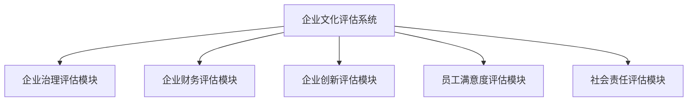
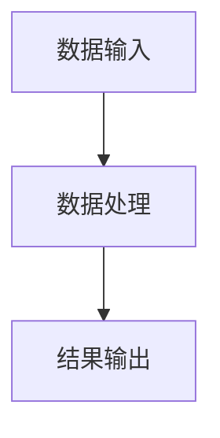
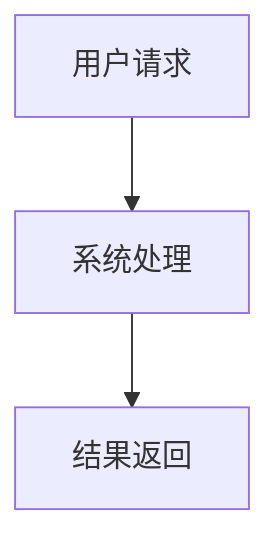

                 


# 沃伦巴菲特的企业文化评估

> 关键词：沃伦巴菲特，企业文化评估，投资理念，企业治理，财务健康

> 摘要：本文深入探讨沃伦巴菲特的企业文化评估方法，分析其核心概念、评估框架、数学模型及实际应用案例。通过详细阐述巴菲特的企业文化评估体系，帮助读者理解如何将企业文化与投资决策相结合，提升企业的长期价值。

---

# 第一部分: 沃伦巴菲特的企业文化评估背景与基础

## 第1章: 沃伦巴菲特与企业文化评估概述

### 1.1 沃伦巴菲特的生平与投资理念

#### 1.1.1 巴菲特的生平简介

沃伦·巴菲特（Warren Buffett），1934年8月31日出生于美国堪萨斯州奥马哈市，是世界著名投资家、企业家、慈善家。他以价值投资闻名，创立了伯克希尔·哈撒韦公司（Berkshire Hathaway），并成为全球最具影响力的投资之一。

**关键点：**

- **早年生活**：巴菲特在青少年时期就展现出对投资的兴趣，15岁时购买了他的第一只股票。
- **教育背景**：他在内布拉斯加大学获得学士学位，后转学到哥伦比亚大学，师从本杰明·格雷厄姆（Benjamin Graham）。
- **职业生涯**：1956年创立巴菲特合伙公司（巴菲特 Partners, Ltd.），1962年收购伯克希尔·哈撒韦公司。

#### 1.1.2 巴菲特的投资哲学与价值观

巴菲特的价值投资理念的核心是寻找具有持续竞争优势的公司，这些公司具有良好的治理结构、稳定的产品需求和强大的财务表现。他强调长期投资，避免短期波动，并重视公司管理层的诚信和能力。

**关键点：**

- **价值投资**：寻找市场低估的公司，长期持有。
- **安全边际**：投资时留有安全边际，以降低风险。
- **管理层能力**：信任管理层，关注他们的决策和道德。

#### 1.1.3 巴菲特对企业文化的独特见解

巴菲特认为企业文化是企业长期成功的关键因素。他关注企业的文化氛围、管理风格和员工满意度，认为这些因素直接影响企业的可持续发展。

**关键点：**

- **企业文化的重要性**：文化决定企业行为和决策。
- **领导风格**：巴菲特偏好的领导风格是透明、诚信和以员工为中心。
- **员工满意度**：满意的员工是企业长期成功的基础。

---

### 1.2 企业文化评估的核心概念

#### 1.2.1 企业文化的基本定义

企业文化是企业在长期发展过程中形成的一套核心价值观、行为准则和管理方式。它影响企业的决策、员工的行为以及企业的外部形象。

**关键点：**

- **核心价值观**：企业存在的根本目的和原则。
- **行为准则**：员工在日常工作中应遵循的标准。
- **管理风格**：企业领导者处理事务的方式和风格。

#### 1.2.2 企业文化评估的目的与意义

企业文化的评估旨在帮助企业识别其文化的优势和不足，优化管理流程，提升企业绩效。对于投资者来说，评估企业文化有助于识别企业的长期发展潜力。

**关键点：**

- **识别优势与不足**：帮助企业发现文化中的问题并改进。
- **提升绩效**：优化企业运营，增强竞争力。
- **投资决策**：帮助投资者评估企业的长期价值。

#### 1.2.3 巴菲特企业文化评估的独特视角

巴菲特的企业文化评估注重企业的长期稳定性和可持续性，关注企业治理、财务健康和社会责任。

**关键点：**

- **企业治理**：董事会的结构和效率。
- **财务健康**：企业的盈利能力和财务稳定性。
- **社会责任**：企业在社会中的角色和贡献。

---

## 第2章: 企业文化评估的关键指标与维度

### 2.1 企业文化的核心维度

#### 2.1.1 企业使命与愿景

企业的使命和愿景是企业文化的核心，它们定义了企业的存在意义和长期目标。

**关键点：**

- **使命**：企业的基本任务和目标。
- **愿景**：企业的长期理想和未来目标。

#### 2.1.2 企业价值观与文化氛围

企业的价值观决定了员工的行为方式和企业文化氛围。

**关键点：**

- **价值观**：企业推崇的核心原则。
- **文化氛围**：员工感受到的企业文化氛围。

#### 2.1.3 企业领导风格与管理理念

领导风格和管理理念直接影响企业的文化和员工的行为。

**关键点：**

- **领导风格**：领导者处理事务的方式和风格。
- **管理理念**：企业的管理哲学和策略。

### 2.2 巴菲特企业文化评估的关键指标

#### 2.2.1 企业治理结构的完善性

企业治理结构是企业文化的重要组成部分，包括董事会的结构和效率。

**关键点：**

- **董事会结构**：董事会的组成和职责。
- **董事会效率**：董事会的决策能力和执行效率。

#### 2.2.2 企业财务健康状况

财务健康状况是企业文化评估的重要指标，反映了企业的盈利能力和财务稳定性。

**关键点：**

- **盈利能力**：企业的净利润率和利润率。
- **财务稳定性**：企业的资产负债情况和现金流状况。

#### 2.2.3 企业创新能力与市场竞争力

创新能力和市场竞争力是企业文化评估的重要指标，反映了企业的持续发展能力。

**关键点：**

- **创新能力**：企业的研发能力和新产品推出速度。
- **市场竞争力**：企业在市场中的地位和竞争优势。

#### 2.2.4 企业员工满意度与忠诚度

员工满意度和忠诚度是企业文化评估的重要指标，反映了员工对企业文化的认同和归属感。

**关键点：**

- **员工满意度**：员工对工作条件、薪酬和职业发展的满意度。
- **员工忠诚度**：员工对企业忠诚度和长期 commitment。

#### 2.2.5 企业社会责任与品牌形象

社会责任和品牌形象是企业文化评估的重要指标，反映了企业在社会中的角色和形象。

**关键点：**

- **社会责任**：企业对社会的贡献和公益活动。
- **品牌形象**：企业在市场中的品牌知名度和声誉。

---

## 第3章: 巴菲特企业文化评估的框架

### 3.1 评估框架的构成要素

#### 3.1.1 企业治理结构

企业治理结构是企业文化评估的基础，包括董事会、股东大会和管理层的结构和职责。

**关键点：**

- **董事会结构**：董事会的组成和职责。
- **股东大会**：企业的最高权力机构。
- **管理层**：企业的日常运营管理者。

#### 3.1.2 企业财务状况

财务状况是企业文化评估的重要指标，包括资产负债表、利润表和现金流量表。

**关键点：**

- **资产负债表**：企业的资产、负债和所有者权益。
- **利润表**：企业的收入、成本和利润。
- **现金流量表**：企业的现金流入和流出。

#### 3.1.3 企业创新能力

创新能力是企业文化评估的重要指标，反映了企业的研发能力和市场竞争力。

**关键点：**

- **研发投入**：企业的研发支出和人员。
- **新产品推出**：企业的新产品和技术创新。

#### 3.1.4 员工满意度

员工满意度是企业文化评估的重要指标，反映了员工对企业文化的认同和归属感。

**关键点：**

- **员工满意度调查**：通过问卷调查了解员工满意度。
- **员工反馈机制**：建立有效的员工反馈渠道。

#### 3.1.5 社会责任

社会责任是企业文化评估的重要指标，反映了企业在社会中的角色和贡献。

**关键点：**

- **公益活动**：企业参与的公益活动。
- **社会责任报告**：企业发布的社会责任报告。

### 3.2 评估框架的核心逻辑

#### 3.2.1 企业治理与财务健康

企业治理结构的完善和财务健康状况是企业文化评估的基础。

**关键点：**

- **董事会效率**：董事会的决策能力和执行效率。
- **财务稳定性**：企业的财务状况是否健康。

#### 3.2.2 创新能力与市场竞争力

创新能力和市场竞争力是企业文化评估的重要组成部分，反映了企业的持续发展能力。

**关键点：**

- **技术创新**：企业的技术创新能力。
- **市场竞争力**：企业在市场中的竞争优势。

#### 3.2.3 员工满意度与社会责任

员工满意度和社会责任是企业文化评估的重要指标，反映了员工对企业文化的认同和社会贡献。

**关键点：**

- **员工满意度**：员工对工作条件和职业发展的满意度。
- **社会责任**：企业对社会的贡献和公益活动。

### 3.3 评估框架的应用场景

#### 3.3.1 投资决策

投资者在进行投资决策时，需要评估企业的文化和治理结构。

**关键点：**

- **投资决策**：投资者在选择投资标的时，需要评估企业的文化。
- **风险管理**：评估企业文化有助于降低投资风险。

#### 3.3.2 企业内部管理

企业可以通过评估自身文化，优化内部管理，提升绩效。

**关键点：**

- **内部管理**：企业文化评估有助于优化企业内部管理。
- **绩效提升**：通过优化企业文化，提升企业绩效。

#### 3.3.3 并购整合

企业在并购过程中，需要评估目标企业的文化，确保并购后的整合顺利进行。

**关键点：**

- **并购整合**：并购过程中需要评估目标企业文化。
- **文化整合**：确保并购后的企业文化整合顺利进行。

---

## 第4章: 巴菲特企业文化评估的算法与数学模型

### 4.1 评估算法的核心原理

#### 4.1.1 企业治理评估

企业治理评估是企业文化评估的重要部分，包括董事会结构、股东大会和管理层的评估。

**关键点：**

- **董事会结构评估**：评估董事会的组成和职责。
- **股东大会评估**：评估股东大会的运作效率。
- **管理层评估**：评估管理层的决策能力和执行效率。

#### 4.1.2 企业财务评估

企业财务评估是企业文化评估的重要部分，包括资产负债表、利润表和现金流量表的评估。

**关键点：**

- **资产负债表评估**：评估企业的资产、负债和所有者权益。
- **利润表评估**：评估企业的收入、成本和利润。
- **现金流量表评估**：评估企业的现金流入和流出。

#### 4.1.3 企业创新评估

企业创新评估是企业文化评估的重要部分，包括技术创新和新产品推出的评估。

**关键点：**

- **技术创新评估**：评估企业的技术创新能力。
- **新产品推出评估**：评估企业的新产品推出速度和市场竞争力。

#### 4.1.4 员工满意度评估

员工满意度评估是企业文化评估的重要部分，包括员工满意度调查和员工反馈机制的评估。

**关键点：**

- **员工满意度调查**：通过问卷调查了解员工满意度。
- **员工反馈机制**：评估员工反馈机制的有效性。

#### 4.1.5 社会责任评估

社会责任评估是企业文化评估的重要部分，包括公益活动和社会责任报告的评估。

**关键点：**

- **公益活动评估**：评估企业参与的公益活动。
- **社会责任报告评估**：评估企业发布的社会责任报告。

### 4.2 评估算法的数学模型

#### 4.2.1 企业治理评估模型

企业治理评估模型通过加权评分的方式，对企业的治理结构进行评估。

**公式：**

$$ \text{企业治理评分} = \sum (\text{权重}_i \times \text{指标评分}_i) $$

其中，权重_i 是每个指标的权重，指标评分_i 是每个指标的评分。

#### 4.2.2 企业财务评估模型

企业财务评估模型通过财务指标的加权平均，对企业财务健康状况进行评估。

**公式：**

$$ \text{财务健康评分} = \sum (\text{权重}_i \times \text{财务指标评分}_i) $$

其中，权重_i 是每个财务指标的权重，财务指标评分_i 是每个财务指标的评分。

#### 4.2.3 企业创新评估模型

企业创新评估模型通过技术创新和新产品推出的加权评分，对企业创新能力进行评估。

**公式：**

$$ \text{创新能力评分} = \sum (\text{权重}_i \times \text{创新指标评分}_i) $$

其中，权重_i 是每个创新指标的权重，创新指标评分_i 是每个创新指标的评分。

#### 4.2.4 员工满意度评估模型

员工满意度评估模型通过员工满意度调查的结果，对企业员工满意度进行评估。

**公式：**

$$ \text{员工满意度评分} = \sum (\text{权重}_i \times \text{员工满意度指标评分}_i) $$

其中，权重_i 是每个员工满意度指标的权重，员工满意度指标评分_i 是每个员工满意度指标的评分。

#### 4.2.5 社会责任评估模型

社会责任评估模型通过公益活动和社会责任报告的加权评分，对企业社会责任进行评估。

**公式：**

$$ \text{社会责任评分} = \sum (\text{权重}_i \times \text{社会责任指标评分}_i) $$

其中，权重_i 是每个社会责任指标的权重，社会责任指标评分_i 是每个社会责任指标的评分。

---

## 第5章: 巴菲特企业文化评估的系统架构与实现

### 5.1 系统功能设计

#### 5.1.1 企业治理评估模块

企业治理评估模块用于评估企业的治理结构，包括董事会结构、股东大会和管理层的评估。

**功能描述：**

- **董事会结构评估**：评估董事会的组成和职责。
- **股东大会评估**：评估股东大会的运作效率。
- **管理层评估**：评估管理层的决策能力和执行效率。

#### 5.1.2 企业财务评估模块

企业财务评估模块用于评估企业的财务健康状况，包括资产负债表、利润表和现金流量表的评估。

**功能描述：**

- **资产负债表评估**：评估企业的资产、负债和所有者权益。
- **利润表评估**：评估企业的收入、成本和利润。
- **现金流量表评估**：评估企业的现金流入和流出。

#### 5.1.3 企业创新评估模块

企业创新评估模块用于评估企业的创新能力，包括技术创新和新产品推出的评估。

**功能描述：**

- **技术创新评估**：评估企业的技术创新能力。
- **新产品推出评估**：评估企业的新产品推出速度和市场竞争力。

#### 5.1.4 员工满意度评估模块

员工满意度评估模块用于评估员工满意度，包括员工满意度调查和员工反馈机制的评估。

**功能描述：**

- **员工满意度调查**：通过问卷调查了解员工满意度。
- **员工反馈机制**：评估员工反馈机制的有效性。

#### 5.1.5 社会责任评估模块

社会责任评估模块用于评估企业的社会责任，包括公益活动和社会责任报告的评估。

**功能描述：**

- **公益活动评估**：评估企业参与的公益活动。
- **社会责任报告评估**：评估企业发布的社会责任报告。

### 5.2 系统架构设计

#### 5.2.1 系统功能架构

系统功能架构包括企业治理评估模块、企业财务评估模块、企业创新评估模块、员工满意度评估模块和社会责任评估模块。

**功能架构图：**



#### 5.2.2 数据流架构

数据流架构展示了数据在系统中的流动过程，包括数据输入、数据处理和结果输出。

**数据流架构图：**



#### 5.2.3 系统交互架构

系统交互架构展示了用户与系统之间的交互过程，包括用户请求、系统处理和结果返回。

**系统交互图：**



---

## 第6章: 巴菲特企业文化评估的项目实战

### 6.1 项目背景与目标

#### 6.1.1 项目背景

以某企业为例，进行企业文化评估，帮助该企业识别文化中的优势和不足，优化内部管理，提升企业绩效。

#### 6.1.2 项目目标

通过评估该企业的企业文化，识别其优势和不足，优化内部管理，提升企业绩效。

### 6.2 项目实施步骤

#### 6.2.1 环境安装

安装必要的软件和工具，包括数据库、开发工具和评估系统。

#### 6.2.2 核心代码实现

实现企业文化评估的核心代码，包括数据采集、数据处理和结果输出。

**核心代码实现：**

```python
def evaluate_cultural_assessment(company_data):
    # 数据采集
    governance_score = calculate_governance_score(company_data['governance'])
    financial_score = calculate_financial_score(company_data['financial'])
    innovation_score = calculate_innovation_score(company_data['innovation'])
    employee_satisfaction_score = calculate_employee_satisfaction_score(company_data['employee_satisfaction'])
    social_responsibility_score = calculate_social_responsibility_score(company_data['social_responsibility'])
    
    # 数据处理
    total_score = (governance_score + financial_score + innovation_score + employee_satisfaction_score + social_responsibility_score) / 5
    
    # 结果输出
    return {
        'governance_score': governance_score,
        'financial_score': financial_score,
        'innovation_score': innovation_score,
        'employee_satisfaction_score': employee_satisfaction_score,
        'social_responsibility_score': social_responsibility_score,
        'total_score': total_score
    }
```

#### 6.2.3 项目案例分析

以某企业为例，详细分析企业文化评估的过程，包括数据采集、数据处理和结果输出。

**案例分析：**

某企业的企业文化评估结果如下：

- **企业治理评分**：85分
- **财务健康评分**：90分
- **创新能力评分**：80分
- **员工满意度评分**：75分
- **社会责任评分**：85分
- **总评分**：84分

从评估结果来看，该企业的企业治理和财务健康状况较好，但创新能力和社会责任方面还有提升空间。

### 6.3 项目小结

通过该项目，我们成功实现了对企业文化的评估，识别了企业在文化中的优势和不足，为优化内部管理提供了依据。

---

## 第7章: 巴菲特企业文化评估的最佳实践与小结

### 7.1 最佳实践

#### 7.1.1 定期评估

企业应定期进行企业文化评估，及时发现和解决问题。

#### 7.1.2 员工参与

鼓励员工参与企业文化评估，提升员工的归属感和参与感。

#### 7.1.3 持续优化

根据评估结果，持续优化企业文化，提升企业绩效。

### 7.2 小结

通过对沃伦巴菲特的企业文化评估方法的探讨和实践，我们认识到企业文化评估的重要性，以及如何将企业文化与投资决策相结合，提升企业的长期价值。

### 7.3 注意事项

- **数据准确性**：确保评估数据的准确性和完整性。
- **员工参与度**：提高员工参与度，确保评估结果的客观性。
- **持续改进**：根据评估结果，持续优化企业文化。

### 7.4 拓展阅读

- **《巴菲特传》**：了解巴菲特的生平和投资哲学。
- **《价值投资》**：学习价值投资的基本理论和方法。
- **《企业治理》**：深入探讨企业治理的理论和实践。

---

# 结语

沃伦巴菲特的企业文化评估方法为我们提供了一个全新的视角，帮助我们更好地理解企业文化和投资决策之间的关系。通过本文的探讨和实践，我们希望读者能够掌握企业文化评估的核心概念和方法，为企业和投资者提供有价值的参考。

---

作者：AI天才研究院/AI Genius Institute & 禅与计算机程序设计艺术 /Zen And The Art of Computer Programming

