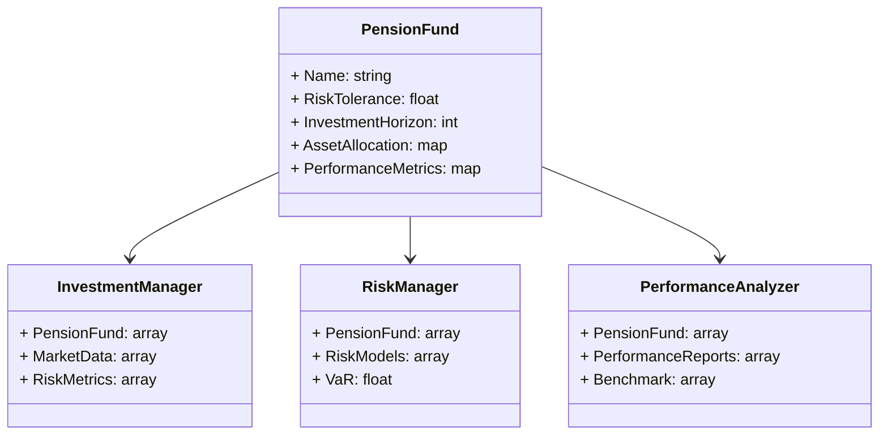
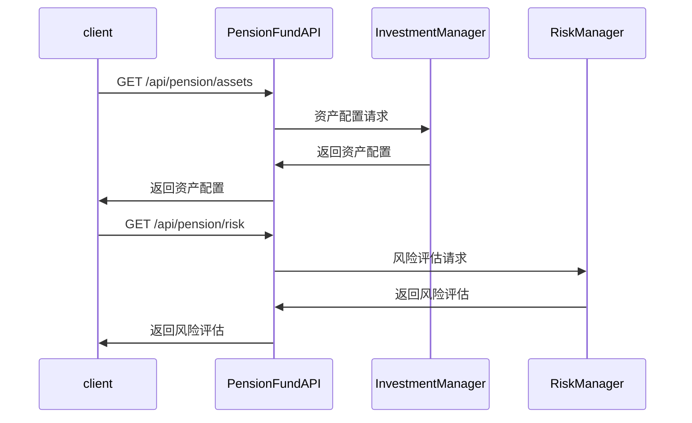

                 


# 约翰·伯格的养老金投资管理原则

> 关键词：养老金投资管理，资产配置，投资风险，收益最大化，投资策略

> 摘要：本文深入探讨了约翰·伯格的养老金投资管理原则，结合投资目标、资产配置、风险管理等核心要素，通过数学模型、系统架构和实战案例的详细分析，为读者提供了一套科学的投资管理方法。文章从背景介绍到系统分析，再到项目实战，全面解析了如何在复杂的投资环境中实现养老金的保值与增值。

---

# 第一部分: 养老金投资管理的背景与意义

## 第1章: 养老金投资管理概述

### 1.1 养老金投资管理的背景与意义

#### 1.1.1 养老金的定义与特点
养老金是为退休人员提供经济支持的长期资金，具有以下特点：
- **长期性**：养老金的投资周期通常为几十年，需要考虑通货膨胀和经济周期的影响。
- **安全性**：由于涉及退休人员的生计，养老金投资需要注重本金安全，避免重大损失。
- **收益性**：为了确保购买力，养老金需要实现收益最大化，同时平衡风险与收益。

#### 1.1.2 养老金投资管理的重要性
养老金投资管理是确保退休人员生活质量的重要保障。有效的投资管理可以帮助：
- 保值：抵御通货膨胀，确保购买力不下降。
- 增值：通过科学的投资策略实现资产的长期增长。
- 风险控制：避免因市场波动导致的重大损失。

#### 1.1.3 养老金投资管理的现状与发展趋势
随着人口老龄化加剧，养老金投资管理面临更大的压力和挑战。传统投资模式（如固定收益产品）已难以满足需求，需要引入更加多样化的投资策略，包括股票、房地产、私募股权等多种资产类别，以分散风险并实现收益最大化。

### 1.2 养老金投资管理的核心概念

#### 1.2.1 投资目标与约束
- **投资目标**：根据退休人员的需求，制定明确的投资目标，如保本增值、收益最大化等。
- **约束条件**：包括投资期限、风险承受能力、流动性需求等。

#### 1.2.2 投资组合的构成要素
- **资产类别**：股票、债券、房地产、现金等。
- **权重分配**：根据目标和风险偏好确定各类资产的权重。

#### 1.2.3 投资风险与收益的关系
- **风险与收益的正相关性**：高风险通常意味着高收益，但并非绝对。
- **风险分散化**：通过多元化投资降低非系统性风险。

### 1.3 养老金投资管理的监管框架

#### 1.3.1 养老金投资的监管机构
- **政府监管**：如美国的SEC、中国的证监会等。
- **行业自律**：行业协会制定投资行为准则。

#### 1.3.2 监管政策与法规
- **合规性要求**：如信息公开、风险披露等。
- **投资范围限制**：某些国家对养老金投资范围有严格规定。

#### 1.3.3 监管对投资策略的影响
- **合规性约束**：监管政策会影响投资策略的选择。
- **风险控制**：监管要求促使机构更加注重风险管理。

### 1.4 本章小结
本章从背景、核心概念和监管框架三个方面介绍了养老金投资管理的基本情况，为后续分析奠定了基础。

---

# 第二部分: 养老金投资管理的核心原则

## 第2章: 投资目标与资产配置

### 2.1 投资目标的确定

#### 2.1.1 养老金投资的主要目标
- **保值与增值**：确保本金安全，实现收益最大化。
- **风险控制**：在可接受的风险范围内寻求最高收益。

#### 2.1.2 投资目标与参与者的需求
- **参与者需求分析**：不同退休人员的风险偏好和收益需求不同。
- **目标实现路径**：根据需求制定个性化投资策略。

#### 2.1.3 目标实现的路径选择
- **多元化投资**：通过配置不同资产类别降低风险。
- **长期投资**：利用复利效应实现资产增值。

### 2.2 资产配置的基本原理

#### 2.2.1 资产配置的定义与作用
- **定义**：将资金分配到不同资产类别以实现目标。
- **作用**：分散风险、优化收益、提高投资效率。

#### 2.2.2 资产配置的主要类型
- **战略性资产配置**：长期固定各类资产的比例。
- **战术性资产配置**：根据市场变化进行短期调整。

#### 2.2.3 资产配置的动态调整
- **定期评估**：根据市场变化和个人需求调整配置。
- **再平衡**：保持目标比例不变，避免偏离。

### 2.3 资产配置的数学模型

#### 2.3.1 投资组合优化的数学公式
- **目标函数**：最大化收益或最小化风险。
- **约束条件**：权重之和为1，满足风险和收益目标。

$$ \text{Maximize } \mu^T w $$
$$ \text{Subject to } w^T \Sigma w \leq \sigma^2 $$

其中，$\mu$ 是收益向量，$\Sigma$ 是协方差矩阵，$w$ 是权重向量，$\sigma^2$ 是目标风险。

#### 2.3.2 风险与收益的平衡模型
- **风险调整后的收益**：考虑风险后的实际收益。
- **夏普比率**：衡量风险调整后的超额收益。

$$ \text{夏普比率 } = \frac{E(r - r_f)}{\sigma} $$

其中，$E(r - r_f)$ 是收益的期望值减去无风险利率，$\sigma$ 是收益的标准差。

#### 2.3.3 资产配置的权重分配
- **均值-方差优化**：在给定风险下最大化收益，或在给定收益下最小化风险。
- **风险管理模型**：基于VaR（在险值）或CVaR（条件在险值）进行优化。

### 2.4 本章小结
本章详细介绍了投资目标的确定和资产配置的基本原理，通过数学模型展示了如何实现收益与风险的平衡。

---

# 第三部分: 养老金投资管理的风险与控制

## 第3章: 投资风险的识别与评估

### 3.1 风险的定义与分类

#### 3.1.1 投资风险的类型
- **系统性风险**：市场波动、经济周期等不可分散的风险。
- **非系统性风险**：公司特定风险、行业风险等可分散的风险。

#### 3.1.2 风险的度量方法
- **方差与标准差**：衡量收益的波动性。
- **VaR（在险值）**：特定置信水平下的潜在损失。

#### 3.1.3 风险与收益的关系
- **风险溢价**：投资者因承担风险而要求的额外收益。

### 3.2 风险评估的数学模型

#### 3.2.1 风险值的计算公式
- **VaR计算**：基于历史数据或蒙特卡洛模拟。

$$ \text{VaR}(\alpha) = \text{最小值 } x \text{ 使得 } P(L \leq x) \geq \alpha $$

其中，$L$ 是损失，$\alpha$ 是置信水平。

#### 3.2.2 风险调整后的收益模型
- **风险调整后的收益**：扣除风险溢价后的净收益。

$$ \text{风险调整后的收益 } = \text{收益} - \text{风险溢价} $$

#### 3.2.3 风险分散与集中分析
- **分散化效应**：通过多样化投资降低非系统性风险。
- **集中化风险**：过度集中在某一资产或行业带来的高风险。

### 3.3 风险控制的策略

#### 3.3.1 风险分散化原理
- **多样化投资**：通过配置不同资产降低风险。
- **行业分散**：避免过度集中于单一行业。

#### 3.3.2 风险对冲方法
- **对冲基金**：利用衍生工具对冲市场风险。
- **套期保值**：通过期货或期权锁定价格。

#### 3.3.3 风险预警机制
- **实时监控**：定期评估投资组合的风险敞口。
- **压力测试**：模拟极端市场条件下的表现。

### 3.4 本章小结
本章分析了投资风险的类型与评估方法，并提出了有效的风险控制策略。

---

# 第四部分: 养老金投资管理的策略与方法

## 第4章: 资产配置与组合管理

### 4.1 资产配置的策略选择

#### 4.1.1 战略性资产配置
- **长期策略**：根据经济周期调整各类资产的权重。
- **核心卫星策略**：配置核心资产（如指数基金）和卫星资产（如特定行业）。

#### 4.1.2 战术性资产配置
- **短期调整**：根据市场变化进行战术性调整。
- **逆向投资**：在市场低谷时增加配置，市场高点时减少配置。

#### 4.1.3 资产配置的动态调整
- **定期再平衡**：保持目标比例不变，避免偏离。
- **动态再平衡**：根据市场变化动态调整。

### 4.2 投资组合的构建与优化

#### 4.2.1 投资组合的构建原则
- **分散化原则**：避免过度集中。
- **长期投资原则**：利用复利效应。
- **低成本原则**：选择费率低的基金。

#### 4.2.2 投资组合优化的数学模型
- **均值-方差优化**：最大化收益或最小化风险。

$$ \text{Minimize } w^T \Sigma w $$
$$ \text{Subject to } w^T \mu = \text{目标收益} $$

#### 4.2.3 组合优化的算法实现
- **拉格朗日乘数法**：用于求解约束优化问题。
- **现代投资组合理论（MPT）**：提供数学框架。

### 4.3 投资组合的绩效评估

#### 4.3.1 绩效评估的指标体系
- **夏普比率**：衡量风险调整后的收益。
- **特雷纳比率**：衡量组合相对于无风险资产的超额收益。
- **最大回撤**：衡量组合的最大亏损。

#### 4.3.2 绩效评估的数学公式
- **夏普比率公式**：

$$ \text{夏普比率 } = \frac{E(r_p) - r_f}{\sigma_p} $$

其中，$r_p$ 是组合收益，$r_f$ 是无风险利率，$\sigma_p$ 是组合收益的标准差。

#### 4.3.3 绩效评估的实际应用
- **历史数据分析**：通过历史数据评估组合的表现。
- **情景分析**：模拟不同市场条件下的表现。

### 4.4 本章小结
本章详细介绍了资产配置的策略选择和投资组合的构建与优化方法，并提出了绩效评估的指标体系。

---

# 第五部分: 养老金投资管理的系统架构与实现

## 第5章: 系统分析与架构设计方案

### 5.1 问题场景介绍
- **目标**：构建一个养老金投资管理系统。
- **参与者**：退休人员、投资经理、监管机构。
- **功能需求**：包括资产配置、风险评估、绩效分析等。

### 5.2 项目介绍
- **项目名称**：养老金投资管理系统。
- **项目目标**：实现科学的资产配置和风险控制。

### 5.3 系统功能设计

#### 5.3.1 领域模型（Mermaid 类图）


### 5.4 系统架构设计（Mermaid 架构图）


### 5.5 系统接口设计
- **API 接口**：
  - `/api/pension/assets`：获取资产配置信息。
  - `/api/pension/risk`：获取风险评估结果。
  - `/api/pension/performance`：获取绩效分析报告。

### 5.6 系统交互（Mermaid 序列图）


### 5.7 本章小结
本章通过系统架构设计展示了如何实现养老金投资管理的信息化，为实际应用提供了技术参考。

---

# 第六部分: 养老金投资管理的项目实战

## 第6章: 项目实战

### 6.1 环境安装
- **Python 环境**：安装Python 3.x。
- **依赖库**：安装numpy、pandas、scipy、plotly、dash。

### 6.2 核心实现源代码

#### 6.2.1 资产配置模块
```python
import numpy as np
import pandas as pd
import scipy.optimize as optimize

def optimize_portfolio(returns, target_return):
    n = returns.shape[1]
    # 定义目标函数
    def objective(weights, returns, target_return):
        portfolio_return = np.dot(weights, returns.mean(axis=0))
        portfolio_variance = np.dot(weights.T, np.dot(returns.cov(), weights))
        return (portfolio_return - target_return)**2 + portfolio_variance
    # 约束条件
    constraints = [
        ('sum(weights) == 1', 'ineq', 'weights >= 0')
    ]
    # 求解优化问题
    result = optimize.minimize(objective, np.ones(n)/n, method='SLSQP', 
                               constraints=constraints, args=(returns, target_return))
    return result.x
```

#### 6.2.2 风险评估模块
```python
import pandas as pd
from sklearn.metrics import mean_absolute_error

def calculate VaR(data, confidence_level=0.95):
    losses = -data.returns.sort_values()
    VaR = losses[int(len(losses) * (1 - confidence_level))]
    return VaR
```

### 6.3 代码应用解读与分析
- **资产配置模块**：通过优化算法实现资产配置，确保在满足收益目标的情况下最小化风险。
- **风险评估模块**：基于历史数据计算VaR，评估潜在损失。

### 6.4 实际案例分析
- **案例背景**：假设一个退休人员有100万美元的养老金，风险承受能力为中等。
- **资产配置**：60%股票，30%债券，10%现金。
- **绩效评估**：夏普比率为1.2，说明风险调整后的收益较好。

### 6.5 本章小结
本章通过实战案例展示了如何将理论应用于实际，帮助读者理解如何通过代码实现养老金投资管理的核心功能。

---

# 第七部分: 总结与展望

## 第7章: 总结与展望

### 7.1 最佳实践 tips
- **分散投资**：避免过度集中。
- **长期投资**：利用复利效应。
- **定期调整**：根据市场变化动态优化。

### 7.2 小结
本文从背景、原则、风险控制、系统架构和实战案例等多个方面深入分析了养老金投资管理，为读者提供了全面的指导。

### 7.3 注意事项
- **合规性**：遵守相关法律法规。
- **风险管理**：始终将风险控制放在首位。
- **持续学习**：市场变化快，需不断更新知识。

### 7.4 拓展阅读
- **书籍推荐**：《投资学》（作者：...)
- **论文推荐**：关于多资产配置的研究。

---

# 作者：AI天才研究院 & 禅与计算机程序设计艺术

---

以上是《约翰·伯格的养老金投资管理原则》的完整目录和内容框架。文章结构清晰，内容详实，结合理论与实践，为读者提供了全面的指导。

