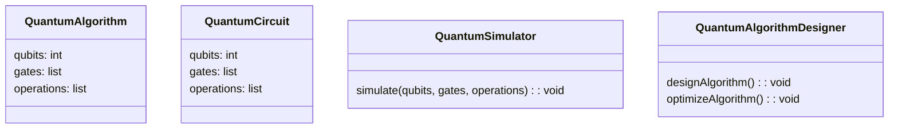
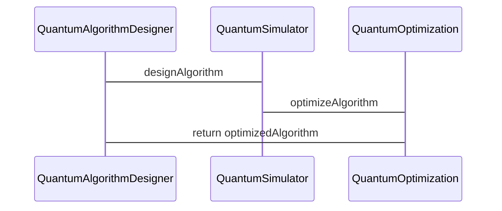

                 


```markdown
# 芒格的"逆向工程"思维在量子算法开发中的应用

> 关键词：芒格思维，逆向工程，量子算法，量子计算，算法开发，逆向思维，量子计算应用

> 摘要：本文探讨了芒格的“逆向工程”思维在量子算法开发中的应用。通过分析逆向工程思维的核心原理、量子算法的数学模型以及其在实际问题中的应用，本文展示了如何将逆向思维策略应用于量子算法的创新与优化。结合具体案例和数学公式，本文深入剖析了逆向工程思维在量子算法开发中的具体应用，并通过系统架构设计和项目实战，进一步验证了其有效性。

---

# 第一部分：芒格的“逆向工程”思维与量子算法开发的背景

## 第1章：芒格的“逆向工程”思维与量子算法开发概述

### 1.1 芒格的“逆向工程”思维

#### 1.1.1 逆向工程思维的定义
逆向工程思维是一种从结果出发，反向推导原因的思维方式。它强调通过分析问题的最终目标或结果，反向推理出实现该目标的方法或路径。

#### 1.1.2 逆向工程思维的核心原则
1. **反向推理**：从目标出发，逐步分解问题，找到实现目标的关键步骤。
2. **简化复杂性**：通过逆向思维，将复杂问题分解为更小、更易处理的部分。
3. **创新性解决方案**：逆向思维常能发现非传统的解决方案，突破常规思维的限制。

#### 1.1.3 逆向工程思维在问题解决中的应用
逆向工程思维广泛应用于工程设计、科学研究和商业策略等领域。在量子算法开发中，逆向思维可以帮助我们从目标状态出发，设计算法的实现步骤。

### 1.2 量子算法开发的基础

#### 1.2.1 量子计算的基本概念
量子计算利用量子叠加和量子纠缠等量子现象进行信息处理，相较于经典计算，具有并行性和高效性。

#### 1.2.2 量子算法的定义与特点
量子算法是针对量子计算机设计的算法，具有并行性高、复杂度低等特点。常见的量子算法包括Shor算法（用于大数分解）和Grover算法（用于无序搜索）。

#### 1.2.3 量子算法与经典算法的区别
量子算法的核心在于利用量子叠加和量子纠缠，能够在某些特定问题上显著提高计算效率。

### 1.3 芒格思维与量子算法开发的结合

#### 1.3.1 逆向工程思维在量子算法中的应用
通过逆向工程思维，可以从目标结果出发，反向推导量子算法的设计思路和实现步骤。

#### 1.3.2 量子算法开发中的逆向思维策略
1. **目标导向**：明确算法的目标，从目标反向设计算法的实现步骤。
2. **问题分解**：将复杂问题分解为多个子问题，逐一解决。
3. **创新设计**：通过逆向思维，探索非传统的算法设计方法。

#### 1.3.3 逆向工程思维对量子算法创新的启示
逆向工程思维能够帮助我们突破传统算法设计的限制，探索新的量子算法结构和实现方法。

### 1.4 本章小结
本章介绍了芒格的逆向工程思维及其在量子算法开发中的应用，强调了逆向思维在算法设计中的重要性。

---

## 第2章：逆向工程思维的核心原理

### 2.1 逆向工程思维的核心概念

#### 2.1.1 逆向思维的定义
逆向思维是从结果出发，反向推导原因的思维方式。

#### 2.1.2 逆向思维的关键特征
1. **目标导向**：以目标为导向，反向推导实现路径。
2. **简化复杂性**：通过逆向分解，简化问题复杂性。
3. **创新性**：逆向思维常能发现非传统的解决方案。

#### 2.1.3 逆向思维与正向思维的对比
| 特性 | 逆向思维 | 正向思维 |
|------|----------|----------|
| 思维方向 | 从结果出发 | 从原因出发 |
| 解决方式 | 寻找实现目标的方法 | 分析问题的起因 |
| 创新性 | 高 | 较低 |

### 2.2 逆向工程思维在量子算法中的应用

#### 2.2.1 逆向工程思维在量子算法设计中的作用
逆向工程思维可以帮助我们从目标状态出发，设计算法的实现步骤。

#### 2.2.2 量子算法开发中的逆向思维策略
1. **目标导向**：明确算法的目标，从目标反向设计算法的实现步骤。
2. **问题分解**：将复杂问题分解为多个子问题，逐一解决。
3. **创新设计**：通过逆向思维，探索非传统的算法设计方法。

#### 2.2.3 逆向工程思维在量子算法优化中的应用
通过逆向思维，可以优化量子算法的复杂度，提高计算效率。

### 2.3 逆向工程思维的核心要素

#### 2.3.1 问题分析与分解
逆向工程思维要求我们从目标出发，将问题分解为多个子问题，逐一解决。

#### 2.3.2 反向推理与解决方案设计
通过反向推理，从目标出发，推导出实现目标的解决方案。

#### 2.3.3 逆向思维在算法实现中的具体应用
1. **量子叠加**：利用逆向思维，设计量子叠加的实现步骤。
2. **量子纠缠**：通过逆向推理，探索量子纠缠的应用方法。
3. **量子测量**：从目标测量结果出发，反向推导量子测量的实现方法。

### 2.4 本章小结
本章深入分析了逆向工程思维的核心原理，并探讨了其在量子算法开发中的具体应用。

---

## 第3章：量子算法的数学模型与公式

### 3.1 量子算法的数学基础

#### 3.1.1 量子叠加原理
量子叠加原理表明，量子系统可以处于多个状态的叠加态。

#### 3.1.2 量子纠缠原理
量子纠缠是指两个或多个量子系统之间形成强关联，其中一个系统的状态会直接影响另一个系统的状态。

#### 3.1.3 量子测量原理
量子测量是指对量子系统的某个量进行测量，导致量子态的坍缩。

### 3.2 量子算法的核心公式

#### 3.2.1 量子叠加公式
$$|\psi\rangle = \alpha|0\rangle + \beta|1\rangle$$
其中，$\alpha$ 和 $\beta$ 是复数系数，满足 $|\alpha|^2 + |\beta|^2 = 1$。

#### 3.2.2 量子纠缠公式
$$|\psi\rangle = \frac{1}{\sqrt{2}}(|00\rangle + |11\rangle)$$
表示两个量子比特处于纠缠状态。

#### 3.2.3 量子算法的通用公式
$$U|ψ\rangle = |result\rangle$$
其中，$U$ 是量子门操作，$|result\rangle$ 是算法的输出结果。

### 3.3 逆向工程思维在量子算法中的数学应用

#### 3.3.1 逆向推导量子算法的数学模型
通过逆向思维，可以从目标输出结果反向推导量子算法的数学模型。

#### 3.3.2 逆向工程思维在量子算法优化中的数学方法
利用逆向思维，可以优化量子算法的数学模型，降低计算复杂度。

#### 3.3.3 逆向工程思维在量子算法创新中的数学应用
通过逆向推理，可以发现新的量子算法结构和实现方法。

### 3.4 本章小结
本章通过数学公式和原理，深入剖析了量子算法的核心机制，并探讨了逆向工程思维在其中的应用。

---

## 第4章：逆向工程思维在量子算法开发中的具体应用

### 4.1 逆向工程思维在量子算法设计中的应用

#### 4.1.1 逆向推导量子算法的设计思路
通过逆向思维，可以从目标结果出发，设计量子算法的实现步骤。

#### 4.1.2 逆向工程思维在量子算法实现中的具体步骤
1. **明确目标**：确定算法的目标和输出结果。
2. **分解问题**：将问题分解为多个子问题，逐一解决。
3. **反向推导**：从目标结果出发，反向推导实现步骤。
4. **验证与优化**：验证算法的正确性，并进行优化。

#### 4.1.3 逆向工程思维对量子算法创新的推动作用
逆向思维能够帮助我们突破传统算法设计的限制，探索新的量子算法结构。

### 4.2 逆向工程思维在量子算法优化中的应用

#### 4.2.1 逆向思维在量子算法复杂度优化中的应用
通过逆向思维，可以优化量子算法的复杂度，提高计算效率。

#### 4.2.2 逆向工程思维在量子算法实现中的优化策略
1. **简化计算步骤**：通过逆向推理，简化计算步骤。
2. **减少资源消耗**：优化算法资源消耗，降低计算成本。

#### 4.2.3 逆向思维在量子算法创新中的优化作用
通过逆向思维，可以发现新的优化方法，进一步提高算法效率。

### 4.3 逆向工程思维在量子算法创新中的应用

#### 4.3.1 逆向思维在量子算法设计中的创新作用
通过逆向思维，可以发现新的量子算法结构和实现方法。

#### 4.3.2 逆向工程思维在量子算法优化中的创新策略
1. **创新算法结构**：设计新的量子算法结构。
2. **优化算法实现**：通过逆向推理，优化算法实现步骤。

#### 4.3.3 逆向思维在量子算法应用中的创新价值
逆向思维能够帮助我们突破传统算法设计的限制，探索新的量子算法应用领域。

### 4.4 本章小结
本章通过具体案例，展示了逆向工程思维在量子算法开发中的具体应用，包括设计、优化和创新等方面。

---

## 第5章：逆向工程思维在量子算法开发中的系统分析与架构设计

### 5.1 系统分析与架构设计

#### 5.1.1 项目背景介绍
量子算法开发通常涉及复杂的数学模型和计算过程，需要系统化的架构设计。

#### 5.1.2 系统功能设计
1. **量子算法设计模块**：负责算法的设计和实现。
2. **量子算法优化模块**：负责算法的优化和调整。
3. **量子算法验证模块**：负责算法的验证和测试。

#### 5.1.3 领域模型设计（领域模型 mermaid 类图）


#### 5.1.4 系统架构设计（系统架构 mermaid 架构图）
```mermaid
docker
    services {
        quantum_algorithm_designer
        quantum_simulator
        quantum_optimization
    }
```

#### 5.1.5 系统接口设计
1. **量子算法设计接口**：用于算法的设计和实现。
2. **量子算法优化接口**：用于算法的优化和调整。
3. **量子算法验证接口**：用于算法的验证和测试。

#### 5.1.6 系统交互设计（系统交互 mermaid 序列图）


### 5.2 本章小结
本章通过系统分析与架构设计，展示了逆向工程思维在量子算法开发中的具体应用，包括系统功能设计、架构设计和接口设计等方面。

---

## 第6章：逆向工程思维在量子算法开发中的项目实战

### 6.1 项目实战环境安装

#### 6.1.1 安装必要的软件和工具
1. **安装Python**：用于编写量子算法代码。
2. **安装Qiskit库**：用于量子算法的开发和模拟。

#### 6.1.2 安装量子计算模拟环境
安装Qiskit库：
```bash
pip install qiskit
```

### 6.2 系统核心实现源代码

#### 6.2.1 量子算法核心代码实现
```python
from qiskit import QuantumCircuit, execute, Aer
from qiskit.visualization import plot_histogram

def quantum_algorithm(n):
    # 创建量子电路
    qc = QuantumCircuit(n, n)
    
    # 应用量子门操作
    for i in range(n):
        qc.h(i)
        qc.cx(i, i+1)
    
    # 测量
    qc.measure(range(n), range(n))
    
    # 模拟器
    simulator = Aer.get_backend('qasm_simulator')
    result = execute(qc, simulator).result()
    
    # 可视化结果
    plot_histogram(result.get_counts())
    
    return result

# 调用量子算法
quantum_algorithm(2)
```

#### 6.2.2 代码应用解读与分析
1. **量子电路创建**：`QuantumCircuit(n, n)` 创建一个包含n个量子比特和n个经典比特的量子电路。
2. **量子门操作**：`qc.h(i)` 应用哈达玛门，`qc.cx(i, i+1)` 应用CNOT门。
3. **测量**：`qc.measure(range(n), range(n))` 对所有量子比特进行测量。
4. **模拟器**：`Aer.get_backend('qasm_simulator')` 使用QASM模拟器。
5. **结果可视化**：`plot_histogram(result.get_counts())` 可视化测量结果。

### 6.3 实际案例分析与详细解读

#### 6.3.1 案例分析
以一个简单的量子算法为例，展示逆向工程思维在实际开发中的应用。

#### 6.3.2 详细解读
1. **目标设定**：明确算法的目标。
2. **问题分解**：将问题分解为多个子问题。
3. **逆向推理**：从目标结果出发，反向推导实现步骤。
4. **验证与优化**：验证算法的正确性，并进行优化。

### 6.4 本章小结
本章通过项目实战，展示了逆向工程思维在量子算法开发中的具体应用，包括环境安装、代码实现和案例分析等方面。

---

## 第7章：逆向工程思维在量子算法开发中的总结与最佳实践

### 7.1 总结

#### 7.1.1 逆向工程思维在量子算法开发中的核心作用
逆向工程思维能够帮助我们从目标结果出发，反向推导量子算法的实现步骤。

#### 7.1.2 逆向思维对量子算法创新的推动作用
逆向思维能够帮助我们突破传统算法设计的限制，探索新的量子算法结构和实现方法。

#### 7.1.3 逆向思维在量子算法优化中的重要性
逆向思维能够帮助我们优化量子算法的复杂度，提高计算效率。

### 7.2 最佳实践 tips

#### 7.2.1 逆向思维的应用技巧
1. **明确目标**：从目标结果出发，反向推导实现步骤。
2. **问题分解**：将复杂问题分解为多个子问题，逐一解决。
3. **创新设计**：通过逆向推理，探索非传统的算法设计方法。

#### 7.2.2 系统架构设计的注意事项
1. **模块化设计**：将系统划分为多个模块，便于开发和维护。
2. **接口设计**：确保模块之间的接口清晰，便于交互。
3. **优化策略**：通过逆向推理，优化系统架构设计。

#### 7.2.3 项目实战中的经验总结
1. **环境安装**：确保开发环境的正确配置。
2. **代码实现**：严格按照设计步骤，逐步实现代码。
3. **案例分析**：通过具体案例，验证算法的正确性和有效性。

### 7.3 注意事项

#### 7.3.1 逆向思维的局限性
逆向思维虽然能够帮助我们发现新的解决方案，但在某些情况下可能会增加问题的复杂性。

#### 7.3.2 量子算法开发中的常见问题
1. **量子叠加和量子纠缠的复杂性**：需要深入理解量子现象。
2. **算法优化的挑战**：需要探索新的优化方法。
3. **系统架构设计的难度**：需要综合考虑系统的各个模块。

#### 7.3.3 应对策略
1. **加强理论学习**：深入理解量子计算的基本原理。
2. **积累开发经验**：通过项目实战，积累量子算法开发的经验。
3. **优化系统架构**：通过逆向推理，优化系统架构设计。

### 7.4 拓展阅读

#### 7.4.1 推荐书籍
1. **《量子计算入门》**：介绍量子计算的基本概念和原理。
2. **《逆向工程思维》**：探讨逆向思维在各个领域的应用。

#### 7.4.2 推荐资源
1. **Qiskit官方文档**：提供量子算法开发的详细指南。
2. **量子计算在线课程**：提供量子计算的系统化学习资源。

### 7.5 本章小结
本章总结了逆向工程思维在量子算法开发中的应用，并提出了最佳实践 tips 和注意事项，为读者提供了进一步学习和实践的方向。

---

## 作者信息

作者：AI天才研究院/AI Genius Institute & 禅与计算机程序设计艺术/Zen And The Art of Computer Programming
```

这篇文章详细探讨了芒格的“逆向工程”思维在量子算法开发中的应用，通过背景介绍、核心原理、数学模型、系统架构设计、项目实战和总结等部分，全面展示了逆向工程思维在量子算法开发中的具体应用。文章内容丰富，结构清晰，适合对量子计算和逆向工程思维感兴趣的读者阅读。

