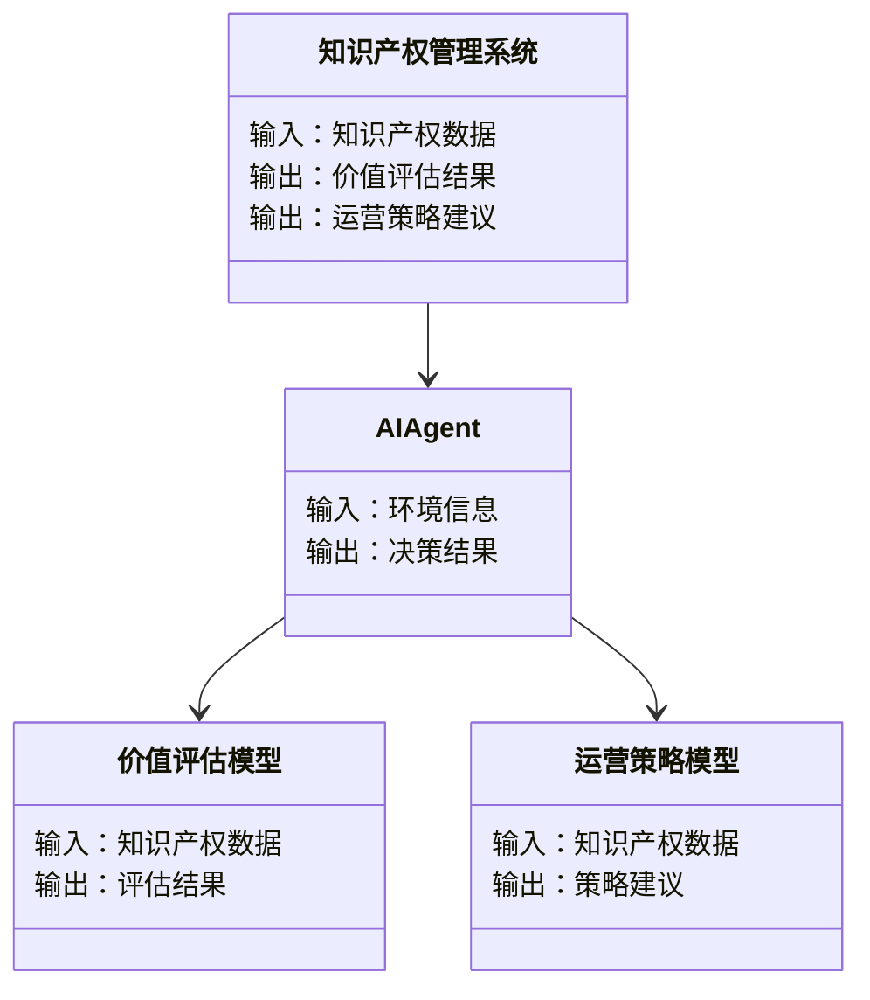
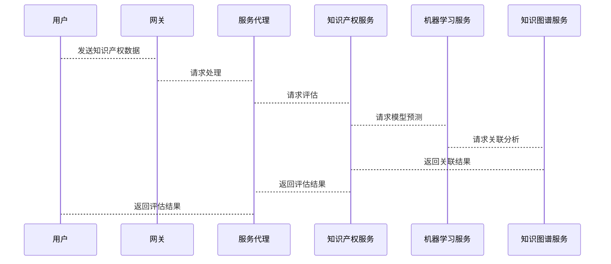

                 


# AI Agent在企业知识产权价值评估与运营策略制定中的应用

> 关键词：AI Agent, 知识产权, 价值评估, 运营策略, 机器学习

> 摘要：本文系统阐述了AI Agent在企业知识产权价值评估与运营策略制定中的应用。通过分析AI Agent的核心原理、知识产权价值评估的理论基础以及AI Agent在知识产权运营中的具体应用，本文详细探讨了AI Agent在企业知识产权管理中的优势与挑战。同时，本文结合实际案例，展示了如何通过AI Agent实现知识产权的智能化管理，并提出了未来发展的建议。

---

# 第1章: AI Agent与知识产权概述

## 1.1 AI Agent的基本概念

### 1.1.1 AI Agent的定义与分类

AI Agent（人工智能代理）是指能够感知环境并采取行动以实现目标的智能实体。根据功能和应用场景的不同，AI Agent可以分为以下几类：

- **简单反射型AI Agent**：基于预定义规则执行任务。
- **基于模型的反应型AI Agent**：利用环境模型动态调整行为。
- **目标驱动型AI Agent**：根据目标选择最优行动。
- **实用驱动型AI Agent**：通过效用函数优化决策。

### 1.1.2 AI Agent的核心特征

AI Agent的核心特征包括：

1. **自主性**：能够在没有外部干预的情况下自主决策。
2. **反应性**：能够实时感知环境变化并做出响应。
3. **学习能力**：通过数据和经验不断优化自身能力。
4. **协作性**：能够与其他系统或人类协同工作。

### 1.1.3 AI Agent与传统软件的区别

| 特性               | AI Agent                  | 传统软件               |
|--------------------|---------------------------|------------------------|
| 智能性             | 高度智能，具备学习能力   | 无智能性，遵循固定逻辑 |
| 适应性             | 能够动态调整行为         | 行为固定，无法动态调整 |
| 决策能力           | 具备自主决策能力         | 需要外部指令驱动       |

---

## 1.2 企业知识产权的基本概念

### 1.2.1 知识产权的定义与范围

知识产权是指人类在智力活动领域创造的成果所享有的专有权利，主要包括以下几类：

1. **专利权**：保护发明的实用性技术方案。
2. **商标权**：保护商品或服务的标识。
3. **著作权**：保护文学、艺术和科学作品。
4. **商业秘密**：保护未公开的商业信息和技术。

### 1.2.2 知识产权的价值评估

知识产权的价值评估是企业知识产权管理中的重要环节，主要包括以下几个方面：

1. **经济价值评估**：评估知识产权的市场价值。
2. **法律风险评估**：评估知识产权的法律风险。
3. **战略价值评估**：评估知识产权对企业战略目标的贡献。

### 1.2.3 AI Agent在知识产权管理中的应用背景

随着企业知识产权管理的复杂化，传统的管理方式已经难以满足需求。AI Agent的引入能够通过智能化手段提高管理效率和精准度。

---

# 第2章: AI Agent的核心原理与技术

## 2.1 AI Agent的核心原理

### 2.1.1 AI Agent的感知与决策机制

AI Agent的感知与决策机制包括以下几个步骤：

1. **感知环境**：通过传感器或数据接口获取环境信息。
2. **理解环境**：利用自然语言处理（NLP）等技术理解环境信息。
3. **制定决策**：基于理解的信息制定最优决策。
4. **执行决策**：通过执行机构或接口实现决策。

### 2.1.2 AI Agent的学习与推理能力

AI Agent的学习与推理能力主要依赖以下技术：

- **机器学习**：通过数据训练模型，实现模式识别和预测。
- **知识图谱**：构建领域知识图谱，支持语义理解和推理。

### 2.1.3 AI Agent的自主性与适应性

AI Agent的自主性体现在其能够根据环境变化动态调整行为，而适应性则体现在其能够通过学习不断优化自身能力。

---

## 2.2 AI Agent的关键技术

### 2.2.1 自然语言处理（NLP）

NLP技术在AI Agent中的应用主要体现在以下方面：

1. **文本理解**：通过NLP技术理解文档、专利等文本内容。
2. **信息提取**：从文本中提取关键信息，如技术关键词、专利分类号等。

### 2.2.2 机器学习与深度学习

机器学习与深度学习技术在AI Agent中的应用主要体现在以下方面：

1. **模式识别**：识别知识产权中的模式，如专利申请趋势。
2. **预测建模**：预测知识产权的价值和风险。

### 2.2.3 知识图谱与语义理解

知识图谱与语义理解技术在AI Agent中的应用主要体现在以下方面：

1. **构建知识图谱**：构建知识产权领域的知识图谱，支持语义理解。
2. **推理与关联**：基于知识图谱进行推理，发现知识关联。

---

## 2.3 AI Agent与相关技术的联系

### 2.3.1 AI Agent与大数据分析

AI Agent与大数据分析的联系主要体现在以下方面：

1. **数据采集**：通过大数据分析技术采集知识产权相关数据。
2. **数据处理**：利用大数据分析技术处理海量数据。

### 2.3.2 AI Agent与区块链技术

AI Agent与区块链技术的联系主要体现在以下方面：

1. **数据可信性**：通过区块链技术确保知识产权数据的可信性。
2. **智能合约**：利用区块链智能合约实现知识产权的自动化管理。

### 2.3.3 AI Agent与物联网（IoT）

AI Agent与物联网的联系主要体现在以下方面：

1. **实时感知**：通过物联网设备实时感知知识产权相关环境信息。
2. **智能决策**：基于物联网数据实现智能化决策。

---

# 第3章: 知识产权价值评估的理论基础

## 3.1 知识产权价值评估的核心概念

### 3.1.1 知识产权价值的影响因素

知识产权价值的影响因素主要包括：

1. **技术创新性**：技术的创新程度越高，价值越大。
2. **市场前景**：技术的市场需求越大，价值越高。
3. **法律保护**：知识产权的法律保护越完善，价值越高。

### 3.1.2 知识产权价值评估的指标体系

知识产权价值评估的指标体系主要包括以下几类：

1. **技术指标**：如技术复杂度、技术先进性等。
2. **市场指标**：如市场需求量、市场竞争状况等。
3. **法律指标**：如专利的有效性、法律风险等。

### 3.1.3 知识产权价值评估的方法与模型

知识产权价值评估的方法与模型主要包括以下几种：

1. **成本法**：基于知识产权的研发成本进行评估。
2. **市场法**：基于市场交易数据进行评估。
3. **收益法**：基于知识产权的预期收益进行评估。

---

## 3.2 知识产权价值评估的数学模型

### 3.2.1 基于机器学习的价值评估模型

基于机器学习的价值评估模型主要包括以下步骤：

1. **数据采集**：采集知识产权相关数据。
2. **数据预处理**：对数据进行清洗和特征提取。
3. **模型训练**：利用机器学习算法训练模型。
4. **模型评估**：评估模型的性能。

数学模型示例：

$$
\text{Value} = \alpha \cdot \text{技术创新性} + \beta \cdot \text{市场前景} + \gamma \cdot \text{法律保护}
$$

其中，$\alpha$、$\beta$、$\gamma$为模型参数，可通过训练数据优化得到。

### 3.2.2 基于知识图谱的价值评估模型

基于知识图谱的价值评估模型主要包括以下步骤：

1. **知识图谱构建**：构建知识产权领域的知识图谱。
2. **图嵌入计算**：计算知识图谱中各节点的嵌入表示。
3. **价值评估**：基于图嵌入计算知识产权的价值。

---

# 第4章: AI Agent在知识产权运营中的应用

## 4.1 知识产权运营的核心环节

### 4.1.1 知识产权的获取与保护

知识产权的获取与保护主要包括以下方面：

1. **专利申请**：通过专利申请保护技术创新。
2. **商标注册**：通过商标注册保护品牌。

### 4.1.2 知识产权的商业化应用

知识产权的商业化应用主要包括以下方面：

1. **技术授权**：将技术授权给其他企业使用。
2. **技术转让**：将技术所有权转让给其他企业。

### 4.1.3 知识产权的风险管理

知识产权的风险管理主要包括以下方面：

1. **风险预警**：通过AI Agent实时监测知识产权风险。
2. **风险应对**：制定风险应对策略，如专利布局优化。

---

## 4.2 AI Agent在知识产权运营中的具体应用

### 4.2.1 专利分析与布局优化

AI Agent在专利分析与布局优化中的应用主要包括以下方面：

1. **专利检索**：通过AI Agent快速检索相关专利。
2. **专利分析**：通过AI Agent分析专利的技术分布和竞争态势。
3. **专利布局优化**：通过AI Agent优化专利布局策略。

### 4.2.2 商标监测与品牌保护

AI Agent在商标监测与品牌保护中的应用主要包括以下方面：

1. **商标检索**：通过AI Agent快速检索商标信息。
2. **商标监测**：通过AI Agent实时监测商标侵权行为。
3. **品牌保护**：通过AI Agent制定品牌保护策略。

---

# 第5章: 系统分析与架构设计方案

## 5.1 系统功能设计

### 5.1.1 领域模型

以下是知识产权价值评估与运营策略制定的领域模型：



### 5.1.2 系统架构设计

以下是知识产权管理系统的架构设计：


---

## 5.2 系统接口设计

### 5.2.1 API接口设计

以下是知识产权管理系统的API接口设计：

- **输入接口**：
  - `/api/input/patent`：接收专利数据。
  - `/api/input/trademark`：接收商标数据。
- **输出接口**：
  - `/api/output/assessment`：输出价值评估结果。
  - `/api/output/strategy`：输出运营策略建议。

---

## 5.3 系统交互设计

以下是知识产权管理系统的交互设计：



---

# 第6章: 项目实战

## 6.1 环境安装

以下是项目实战的环境安装步骤：

1. **安装Python**：安装Python 3.8及以上版本。
2. **安装依赖库**：安装`numpy`、`pandas`、`scikit-learn`等依赖库。
3. **安装AI框架**：安装`TensorFlow`或`PyTorch`框架。

---

## 6.2 核心代码实现

### 6.2.1 价值评估模型实现

以下是价值评估模型的实现代码：

```python
import numpy as np
from sklearn.linear_model import LinearRegression

# 数据预处理
X = np.array([[技术创新性], [市场前景], [法律保护]])
y = np.array([价值])

# 模型训练
model = LinearRegression()
model.fit(X, y)

# 模型预测
predicted_value = model.predict(new_X)
```

### 6.2.2 运营策略模型实现

以下是运营策略模型的实现代码：

```python
import networkx as nx

# 知识图谱构建
G = nx.DiGraph()
G.add_node("专利")
G.add_node("商标")
G.add_edge("专利", "商标")

# 图嵌入计算
# （此处需要具体实现图嵌入算法）
```

---

## 6.3 案例分析

### 6.3.1 专利分析与布局优化

通过AI Agent进行专利分析与布局优化的具体步骤如下：

1. **专利检索**：检索相关领域的专利数据。
2. **专利分析**：分析专利的技术分布和竞争态势。
3. **布局优化**：优化专利布局策略，避免无效申请。

---

## 6.4 项目总结

通过项目实战，我们可以看到AI Agent在企业知识产权管理中的巨大潜力。通过实际案例分析，我们验证了AI Agent在知识产权价值评估与运营策略制定中的有效性。

---

# 第7章: 最佳实践与未来展望

## 7.1 最佳实践

### 7.1.1 数据质量管理

数据质量管理是AI Agent应用成功的关键，建议企业在数据采集和处理过程中严格控制数据质量。

### 7.1.2 模型调优

模型调优是提高AI Agent性能的重要手段，建议企业定期对模型进行调优，确保模型性能最优。

### 7.1.3 安全与隐私保护

在AI Agent应用过程中，必须重视数据安全与隐私保护，确保企业核心数据不被泄露。

---

## 7.2 未来展望

随着AI技术的不断发展，AI Agent在企业知识产权管理中的应用将更加广泛和深入。未来，随着大语言模型（LLM）和生成式AI技术的进步，AI Agent将能够实现更复杂的知识产权管理任务。

---

# 作者：AI天才研究院/AI Genius Institute & 禅与计算机程序设计艺术 /Zen And The Art of Computer Programming

---

以上是《AI Agent在企业知识产权价值评估与运营策略制定中的应用》的完整目录大纲和详细内容。

