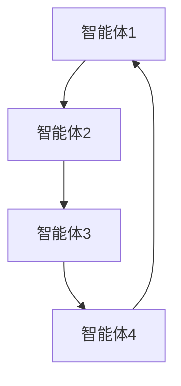
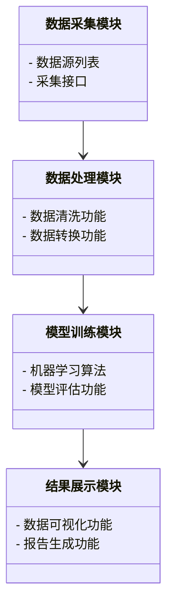
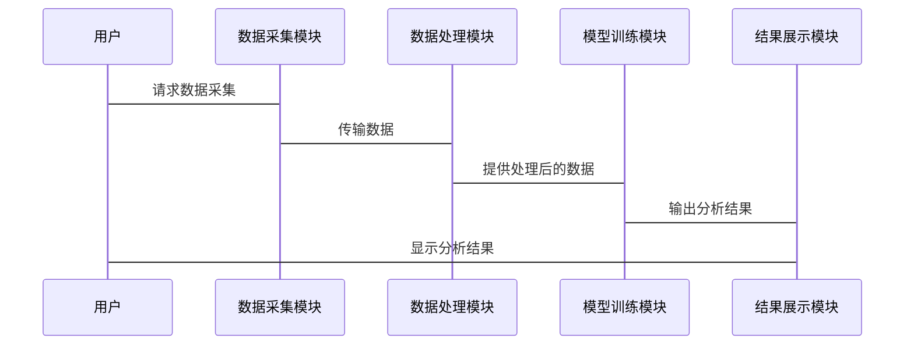

                 


# AI多智能体在公司财务分析中的角色

## 关键词：AI多智能体、财务分析、人工智能、多智能体系统、数据处理、决策支持

## 摘要：
本文深入探讨了AI多智能体在公司财务分析中的角色，分析了AI多智能体的基本概念及其在财务分析中的应用背景。详细讲解了多智能体系统的构成与功能，对比了传统AI与多智能体系统在财务分析中的优劣。从算法原理、系统架构设计、项目实战等多维度详细阐述了AI多智能体在财务分析中的具体应用。最后，总结了当前的研究成果，并展望了未来的发展方向。

---

# 第一部分: AI多智能体在公司财务分析中的角色概述

# 第1章: AI多智能体与财务分析的背景

## 1.1 AI多智能体的基本概念
### 1.1.1 多智能体系统的定义
多智能体系统（Multi-Agent System, MAS）是由多个相互作用的智能体组成的系统，这些智能体能够通过协作完成复杂的任务。每个智能体都有自己的目标、知识和行为规则，能够独立决策并与其他智能体进行通信和协作。

### 1.1.2 AI多智能体的核心特征
- **自主性**：智能体能够自主决策，无需外部干预。
- **反应性**：能够实时感知环境并做出反应。
- **协作性**：通过通信和协作完成共同目标。
- **分布式性**：智能体之间分布式的计算和决策。

### 1.1.3 多智能体与传统AI的区别
| 特性          | 多智能体系统                 | 传统AI系统                 |
|---------------|------------------------------|-----------------------------|
| 决策中心化     | 分布式决策                  | 集中的决策中心             |
| 任务处理      | 多个智能体协作完成任务       | 单一AI模型处理任务         |
| 知识共享      | 智能体之间共享知识          | 知识集中在一个模型中        |
| 灵活性         | 系统具有高度的适应性和灵活性 | 系统相对固定，难以快速调整  |

---

## 1.2 财务分析的背景与挑战
### 1.2.1 财务分析的基本概念
财务分析是通过对财务数据的分析，评估公司的财务状况、经营成果和现金流量，为决策提供支持。常见的财务分析方法包括比率分析、趋势分析和财务预测等。

### 1.2.2 传统财务分析的局限性
- **数据量大**：传统财务分析需要处理大量的数据，人工分析效率低且容易出错。
- **复杂性高**：财务数据涉及多个维度，人工分析难以全面覆盖。
- **实时性差**：传统方法难以实现实时分析，无法及时应对市场变化。

### 1.2.3 AI在财务分析中的应用现状
- **数据处理**：AI能够快速处理大量数据，提高分析效率。
- **模式识别**：通过机器学习算法识别财务数据中的模式和趋势。
- **预测分析**：利用AI进行财务预测，帮助企业做出更明智的决策。

---

## 1.3 AI多智能体在财务分析中的应用背景
### 1.3.1 多智能体系统的优势
- **分工协作**：多个智能体可以分别负责不同的分析任务，如数据采集、数据分析和结果解读。
- **实时性**：多智能体系统能够实时处理数据，提供及时的分析结果。
- **灵活性**：系统可以根据实际情况动态调整智能体的任务分配。

### 1.3.2 财务分析中的多智能体应用场景
- **数据采集**：多个智能体分别从不同的数据源采集财务数据。
- **数据分析**：智能体之间协作进行数据清洗、建模和预测。
- **决策支持**：智能体根据分析结果提供决策建议。

### 1.3.3 当前技术发展的趋势
随着AI技术的快速发展，多智能体系统在财务分析中的应用越来越广泛。未来，多智能体系统将更加智能化和协同化，能够更好地满足企业对财务分析的需求。

---

## 1.4 本章小结
本章介绍了AI多智能体的基本概念及其在财务分析中的应用背景。通过对比传统AI和多智能体系统的优劣，分析了多智能体系统在财务分析中的优势和应用场景。这些内容为后续章节的深入分析奠定了基础。

---

# 第2章: AI多智能体在财务分析中的核心概念

## 2.1 多智能体系统的构成与功能
### 2.1.1 实体识别与角色分配
在财务分析中，智能体需要根据任务的不同进行角色分配。例如，一个智能体负责数据采集，另一个负责数据分析。

### 2.1.2 多智能体之间的协作机制
智能体之间的协作机制包括通信协议、任务分配和结果共享。通过这些机制，智能体可以高效地完成任务。

### 2.1.3 系统的动态性与适应性
多智能体系统具有高度的动态性和适应性，能够根据环境的变化调整任务分配和协作策略。

---

## 2.2 财务分析的核心流程
### 2.2.1 数据收集与预处理
数据收集是财务分析的第一步，需要从多个数据源获取财务数据，并进行清洗和预处理。

### 2.2.2 数据分析与建模
通过机器学习算法对数据进行建模，识别数据中的模式和趋势，为决策提供支持。

### 2.2.3 结果解读与决策支持
根据分析结果，为企业提供财务决策支持，帮助企业优化财务管理。

---

## 2.3 AI多智能体与财务分析的结合点
### 2.3.1 数据处理的智能化
AI多智能体能够高效地处理大量数据，提高数据处理的效率和准确性。

### 2.3.2 分析模型的动态优化
通过多智能体协作，分析模型可以根据实时数据进行动态优化，提高分析结果的准确性。

### 2.3.3 决策支持的多维度性
AI多智能体可以从多个维度进行分析，为企业提供全面的决策支持。

---

## 2.4 核心概念对比分析
### 2.4.1 多智能体系统与传统AI的对比
| 特性          | 多智能体系统                 | 传统AI系统                 |
|---------------|------------------------------|-----------------------------|
| 任务处理      | 多个智能体协作完成任务       | 单一AI模型处理任务         |
| 知识共享      | 智能体之间共享知识          | 知识集中在一个模型中        |
| 灵活性         | 系统具有高度的适应性和灵活性 | 系统相对固定，难以快速调整  |

### 2.4.2 财务分析中的关键指标对比
| 指标          | 传统财务分析                | 基于AI多智能体的财务分析    |
|---------------|-----------------------------|-----------------------------|
| 分析效率       | 较低                        | 高                          |
| 分析准确性     | 受人工因素影响较大          | 更高                        |
| 实时性         | 较差                        | 较好                        |

### 2.4.3 系统架构的优劣势分析
| 特性          | 优势                        | 劣势                        |
|---------------|-----------------------------|-----------------------------|
| 系统灵活性     | 高                          | 系统复杂性较高              |
| 分析效率       | 高                          | 需要较高的计算资源          |
| 可扩展性       | 较高                        | 系统维护成本较高            |

---

## 2.5 本章小结
本章详细讲解了多智能体系统的构成与功能，分析了AI多智能体在财务分析中的核心流程和结合点。通过对比分析，明确了多智能体系统在财务分析中的优势和劣势，为后续章节的分析提供了理论基础。

---

# 第3章: AI多智能体在财务分析中的算法原理

## 3.1 多智能体协作算法概述
### 3.1.1 分布式计算的基本原理
分布式计算是多智能体协作的基础，通过将任务分配给多个智能体，实现并行计算和协作。

### 3.1.2 多智能体协作的流程图


---

## 3.2 基于多智能体的财务分析模型
### 3.2.1 模型的输入与输出
- **输入**：财务数据、市场数据等。
- **输出**：财务分析结果、决策建议等。

### 3.2.2 模型的训练与优化
通过机器学习算法对模型进行训练和优化，提高分析的准确性。

### 3.2.3 模型的评估与验证
通过测试数据对模型进行评估和验证，确保模型的稳定性和准确性。

---

## 3.3 算法实现的数学模型
### 3.3.1 数据预处理公式
$$x_{\text{normalized}} = \frac{x - \mu}{\sigma}$$
其中，$\mu$ 是均值，$\sigma$ 是标准差。

### 3.3.2 模型训练的损失函数
$$L = \frac{1}{n}\sum_{i=1}^{n}(y_i - \hat{y_i})^2$$
其中，$y_i$ 是真实值，$\hat{y_i}$ 是预测值。

### 3.3.3 模型预测的公式
$$\hat{y} = f(x)$$
其中，$f(x)$ 是训练好的模型。

---

## 3.4 本章小结
本章详细讲解了AI多智能体在财务分析中的算法原理，包括多智能体协作的流程图和数学模型。通过这些内容，读者可以理解多智能体系统在财务分析中的具体实现方式。

---

# 第4章: 系统分析与架构设计方案

## 4.1 系统功能需求分析
### 4.1.1 数据采集模块
负责从多个数据源采集财务数据，如公司财务报表、市场数据等。

### 4.1.2 数据处理模块
对采集到的数据进行清洗、转换和预处理，确保数据的准确性和一致性。

### 4.1.3 模型训练模块
利用机器学习算法对数据进行建模和训练，生成财务分析模型。

### 4.1.4 结果展示模块
将分析结果以可视化的方式展示给用户，如图表、报告等。

---

## 4.2 系统功能设计
### 4.2.1 功能模块的类图


### 4.2.2 系统架构的ER实体关系图
```mermaid
erd
actor 用户
database 数据库 {
    table 财务数据表 {
        id
        数据类型
        数据值
    }
    table 分析结果表 {
        id
        分析指标
        结果值
    }
}
```

---

## 4.3 系统接口设计
### 4.3.1 数据采集接口
- **输入**：数据源信息
- **输出**：采集到的财务数据

### 4.3.2 数据处理接口
- **输入**：原始数据
- **输出**：处理后的数据

### 4.3.3 分析结果接口
- **输入**：分析模型
- **输出**：分析结果

---

## 4.4 系统交互流程


---

## 4.5 本章小结
本章详细分析了AI多智能体在财务分析系统中的功能需求、系统架构和接口设计。通过类图和序列图展示了系统的整体结构和交互流程，为后续的项目实施提供了指导。

---

# 第5章: 项目实战

## 5.1 环境安装
### 5.1.1 安装Python
安装Python 3.8及以上版本，确保支持数据处理和机器学习功能。

### 5.1.2 安装必要的库
安装以下Python库：
- `pandas`：数据处理
- `numpy`：数值计算
- `scikit-learn`：机器学习算法
- `matplotlib`：数据可视化

---

## 5.2 核心代码实现
### 5.2.1 数据采集模块
```python
import pandas as pd

def collect_data():
    # 从数据库中采集数据
    data = pd.read_sql("SELECT * FROM financial_data", con=connection)
    return data
```

### 5.2.2 数据处理模块
```python
def preprocess_data(data):
    # 数据清洗
    data.dropna(inplace=True)
    # 数据标准化
    from sklearn.preprocessing import StandardScaler
    scaler = StandardScaler()
    data_scaled = scaler.fit_transform(data)
    return data_scaled
```

### 5.2.3 模型训练模块
```python
def train_model(data):
    # 训练机器学习模型
    from sklearn.linear_model import LinearRegression
    model = LinearRegression()
    model.fit(data)
    return model
```

### 5.2.4 结果展示模块
```python
def display_results(results):
    # 数据可视化
    import matplotlib.pyplot as plt
    plt.figure(figsize=(10, 6))
    plt.plot(results)
    plt.title('Financial Analysis Results')
    plt.xlabel('Time')
    plt.ylabel('Value')
    plt.show()
```

---

## 5.3 代码解读与分析
### 5.3.1 数据采集模块
- 使用`pandas`库从数据库中采集数据。
- 数据采集模块需要连接到数据库，并执行查询语句。

### 5.3.2 数据处理模块
- 使用`scikit-learn`库中的`StandardScaler`进行数据标准化。
- 数据清洗步骤用于处理缺失值。

### 5.3.3 模型训练模块
- 使用`LinearRegression`算法进行模型训练。
- 模型训练需要输入处理后的数据。

### 5.3.4 结果展示模块
- 使用`matplotlib`库进行数据可视化。
- 图表展示分析结果，帮助用户更好地理解数据。

---

## 5.4 实际案例分析
### 5.4.1 案例背景
某公司希望利用AI多智能体系统进行财务分析，提升分析效率和准确性。

### 5.4.2 数据处理过程
- 数据采集：从公司财务系统中采集财务数据。
- 数据处理：清洗和标准化数据，确保数据质量。

### 5.4.3 模型训练
- 使用线性回归算法对数据进行建模，预测公司未来的财务状况。

### 5.4.4 结果展示
- 通过图表展示预测结果，帮助公司制定财务决策。

---

## 5.5 本章小结
本章通过实际案例分析，展示了AI多智能体在财务分析中的具体应用。通过代码实现和案例分析，读者可以更好地理解多智能体系统在财务分析中的实际操作。

---

# 第6章: 总结与展望

## 6.1 总结
本文详细探讨了AI多智能体在公司财务分析中的角色，分析了多智能体系统的构成与功能，对比了传统AI与多智能体系统在财务分析中的优劣。通过实际案例分析，展示了AI多智能体在财务分析中的具体应用。

---

## 6.2 未来的研究方向
- **算法优化**：进一步优化多智能体协作算法，提高分析效率和准确性。
- **系统扩展**：探索多智能体系统在更多财务分析场景中的应用。
- **人机协作**：研究人机协作模式，提升用户体验。

---

## 6.3 注意事项
- 数据安全：在实际应用中，需要注意数据的安全性和隐私保护。
- 系统维护：定期维护和更新系统，确保系统的稳定性和高效性。

---

## 6.4 拓展阅读
- 推荐阅读《Multi-Agent Systems》和《Financial Data Analysis with Python》等书籍，深入学习多智能体系统和财务分析的相关知识。

---

# 作者：AI天才研究院/AI Genius Institute & 禅与计算机程序设计艺术 /Zen And The Art of Computer Programming

---

以上是《AI多智能体在公司财务分析中的角色》的技术博客文章的详细大纲和内容，涵盖了从背景介绍到实际应用的各个方面，逻辑清晰、结构紧凑，适合对AI多智能体和财务分析感兴趣的读者阅读和研究。

