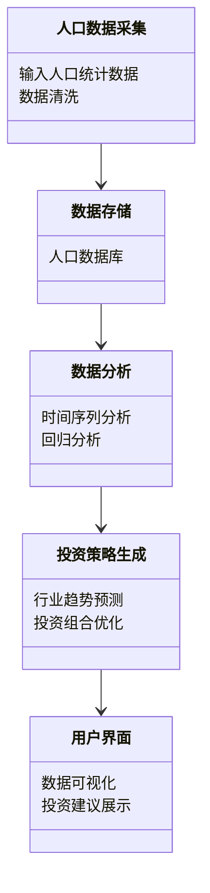
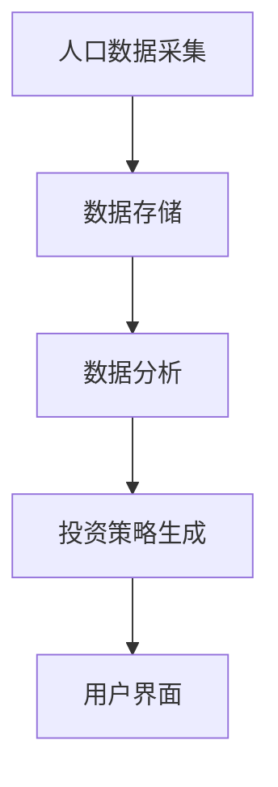
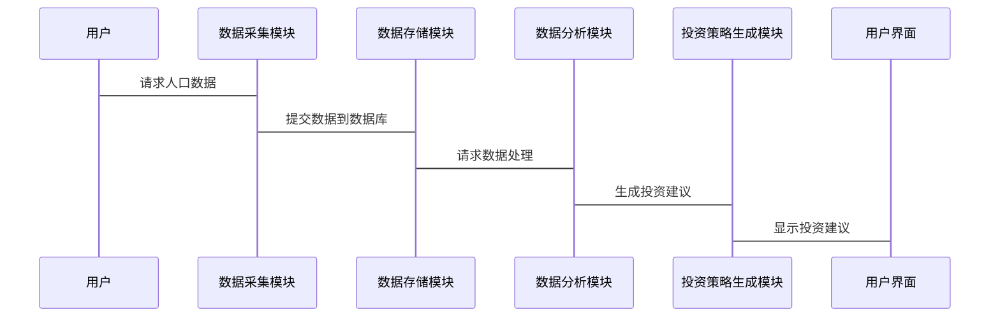

                 


# 价值投资与人口统计学：把握人口结构变化带来的机遇

> 关键词：价值投资，人口统计学，人口结构，投资机会，数学模型，数据分析，投资策略

> 摘要：本文将探讨如何通过分析人口结构的变化来指导价值投资，揭示人口统计数据背后的经济规律，并结合实际案例和数学模型，为投资者提供科学的投资策略和方法。

---

# 第一部分：价值投资与人口统计学的结合

## 第1章：价值投资与人口统计学的背景介绍

### 1.1 价值投资的核心概念

#### 1.1.1 价值投资的定义与特点
- 价值投资是一种以内在价值为基础的投资策略，强调以低于内在价值的价格买入优质资产。
- 其特点包括长期性、安全性、逆向思维和耐心持有了。

#### 1.1.2 价值投资的基本原理
- 市场先生：市场的短期波动反映了市场的非理性。
- 安全边际：买入价格低于内在价值，以降低风险。
- 资产质量：投资于具有强大竞争优势和良好治理的企业。

#### 1.1.3 价值投资在现代金融中的地位
- 价值投资是巴菲特等伟大投资者成功的核心策略。
- 在现代金融中，价值投资与量化投资形成互补，为投资者提供了多样化的选择。

### 1.2 人口统计学的基本概念

#### 1.2.1 人口统计学的定义与研究内容
- 人口统计学是研究人口数量、结构、分布及其变化规律的科学。
- 研究内容包括人口数量、年龄结构、性别比例、家庭结构等。

#### 1.2.2 人口结构的分类与特征
- 年龄结构：分为青年、中年和老年群体。
- 性别比例：男性和女性的比例影响社会和经济结构。
- 家庭结构：家庭规模和结构的变化影响消费模式和劳动力市场。

#### 1.2.3 人口统计学在社会经济发展中的作用
- 人口统计学为政策制定提供数据支持。
- 为企业提供市场分析和决策依据。
- 对社会资源分配和公共服务规划具有重要意义。

### 1.3 价值投资与人口统计学的结合

#### 1.3.1 人口结构变化对经济的影响
- 人口老龄化：影响劳动力市场和养老金体系。
- 人口年轻化：带来更高的消费潜力和经济增长动力。

#### 1.3.2 人口统计学在价值投资中的应用
- 通过分析人口结构变化，预测行业发展趋势。
- 识别具有长期增长潜力的行业和企业。

#### 1.3.3 结合的价值与意义
- 价值投资与人口统计学的结合为投资者提供了新的视角。
- 通过人口数据的分析，投资者可以更好地把握市场机会和风险。

## 1.4 本章小结
本章介绍了价值投资和人口统计学的核心概念，并探讨了两者结合的意义。通过分析人口结构变化，投资者可以更好地理解经济和社会发展趋势，从而制定更科学的投资策略。

---

## 第2章：人口结构变化的核心概念与联系

### 2.1 人口结构变化的原理

#### 2.1.1 人口结构变化的驱动因素
- 自然因素：生育率、死亡率的变化。
- 社会因素：经济发展、教育水平、城市化率等。

#### 2.1.2 人口结构变化的周期性
- 人口结构变化遵循一定的周期性规律，例如人口红利期和人口老龄化期。

#### 2.1.3 人口结构变化对经济和社会的影响
- 人口老龄化：增加社会福利负担，影响经济增长。
- 人口年轻化：促进消费和创新，推动经济增长。

### 2.2 人口结构变化与投资的关系

#### 2.2.1 人口结构变化对投资机会的影响
- 老龄化社会：医疗、养老等相关行业迎来发展机遇。
- 年轻化社会：消费、科技等行业具有投资潜力。

#### 2.2.2 不同人口结构阶段的投资策略
- 在人口红利期，投资劳动力密集型产业。
- 在老龄化阶段，投资医疗、养老服务等行业。

#### 2.2.3 人口结构变化的长期趋势分析
- 预测未来人口结构变化趋势，提前布局具有增长潜力的行业。

### 2.3 人口结构变化的ER实体关系图

```mermaid
entity关系图
classDiagram
    class 人口结构 {
        年龄分布
        性别比例
        家庭结构
    }
    class 经济影响 {
        劳动力市场
        消费模式
        产业升级
    }
    class 投资机会 {
        行业趋势
        企业选择
        风险评估
    }
    人口结构 --> 经济影响
    经济影响 --> 投资机会
```

### 2.4 本章小结
本章详细阐述了人口结构变化的原理及其对投资的影响。通过分析人口结构变化的趋势，投资者可以更好地把握市场机会，制定科学的投资策略。

---

## 第3章：人口结构变化的数学模型与算法原理

### 3.1 人口结构变化的数学模型

#### 3.1.1 人口增长模型
- 指数增长模型：$$ P(t) = P_0 e^{rt} $$
- 逻辑增长模型：$$ \frac{dP}{dt} = rP \left(1 - \frac{P}{K}\right) $$

#### 3.1.2 年龄结构模型
- 年龄中位数：$$ \text{中位数} = \frac{\sum_{i=1}^{n} i \cdot N_i}{\sum_{i=1}^{n} N_i} $$
- 年龄分布曲线：使用直方图或折线图展示不同年龄段的人口数量。

#### 3.1.3 性别比例模型
- 性别比：$$ \text{性别比} = \frac{\text{男性人口}}{\text{女性人口}} \times 100 $$

### 3.2 人口结构变化的算法原理

#### 3.2.1 时间序列分析
- 使用ARIMA模型预测未来人口数量。
- 步骤：
  1. 数据预处理：去除趋势和季节性。
  2. 模型选择：确定ARIMA参数。
  3. 模型训练：基于历史数据拟合模型。
  4. 模型预测：预测未来人口数量。

#### 3.2.2 回归分析
- 使用线性回归模型分析人口结构与经济指标的关系。
- 步骤：
  1. 数据收集：收集人口结构和相关经济指标数据。
  2. 模型建立：建立回归方程。
  3. 模型验证：检验模型的显著性和拟合度。
  4. 预测与分析：基于模型预测未来趋势。

#### 3.2.3 预测模型的构建
- 结合时间序列分析和回归分析，构建综合预测模型。
- 示例：
  - 数据来源：某国过去50年的年鉴数据。
  - 预测目标：未来20年的年龄结构变化。
  - 预测结果：通过模型预测，发现老龄化趋势明显，医疗行业投资机会增加。

### 3.3 算法原理的数学公式

#### 3.3.1 线性回归模型
$$ y = \beta_0 + \beta_1x + \epsilon $$

#### 3.3.2 时间序列预测模型
$$ \hat{y}_t = \alpha + \beta y_{t-1} $$

### 3.4 算法实现与案例分析

#### 3.4.1 算法实现步骤
- 数据预处理：清洗和标准化数据。
- 模型选择：选择合适的算法（如ARIMA或回归分析）。
- 模型训练：基于训练数据拟合模型。
- 模型预测：预测未来人口结构变化。
- 结果分析：解读预测结果并制定投资策略。

#### 3.4.2 案例分析：某国人口结构变化预测
- 数据来源：某国过去50年的年鉴数据。
- 预测目标：未来20年的年龄结构变化。
- 预测结果：通过模型预测，发现老龄化趋势明显，医疗行业投资机会增加。

#### 3.4.3 案例结果解读
- 老龄化加剧：医疗、养老行业需求增加。
- 劳动力减少：劳动密集型行业面临挑战。
- 投资策略调整：增加对医疗行业的配置。

### 3.5 本章小结
本章通过数学模型和算法原理，详细分析了人口结构变化的预测方法。结合实际案例，展示了如何利用这些模型指导投资决策。

---

## 第4章：系统分析与架构设计方案

### 4.1 系统分析

#### 4.1.1 问题场景介绍
- 问题：如何利用人口统计数据，为投资者提供科学的投资建议。
- 目标：构建一个基于人口结构变化的智能投资系统。

#### 4.1.2 项目介绍
- 项目名称：基于人口统计学的智能投资系统。
- 项目目标：通过分析人口结构变化，预测行业发展趋势，为投资者提供投资建议。

### 4.2 系统功能设计

#### 4.2.1 领域模型


### 4.3 系统架构设计

#### 4.3.1 系统架构图


#### 4.3.2 系统接口设计
- 数据接口：提供API，供其他系统调用。
- 用户接口：提供可视化界面，供用户查询和分析数据。

#### 4.3.3 系统交互图


### 4.4 本章小结
本章通过系统分析和架构设计，展示了如何构建一个基于人口统计学的智能投资系统。该系统能够为投资者提供科学的投资建议，帮助他们在人口结构变化中抓住机遇。

---

## 第5章：项目实战与案例分析

### 5.1 项目环境安装

#### 5.1.1 数据库安装
- 使用MySQL或PostgreSQL存储人口统计数据。
- 数据库表结构设计：
  ```sql
  CREATE TABLE population_data (
      id INT AUTO_INCREMENT PRIMARY KEY,
      year INT,
      age_group VARCHAR(20),
      population INT
  );
  ```

#### 5.1.2 分析工具安装
- 安装Python和相关库（如Pandas、NumPy、Matplotlib）。
- 使用Python进行数据分析和建模。

### 5.2 系统核心实现源代码

#### 5.2.1 数据采集与存储
```python
import pandas as pd
import mysql.connector

# 数据采集
data = pd.read_csv('population.csv')
data.to_sql('population_data', con=mysql.connector.connect(host='localhost', user='root', password='password'), if_exists='replace')
```

#### 5.2.2 数据分析与建模
```python
from statsmodels.tsa.arima_model import ARIMA

# 时间序列分析
model = ARIMA(data['population'], order=(1, 1, 0))
model_fit = model.fit()
forecast = model_fit.forecast(steps=10)
```

#### 5.2.3 投资策略生成
```python
import numpy as np

# 行业趋势预测
data = pd.read_csv('industry.csv')
X = data[['age_group', 'population']]
y = data['industry_trend']
from sklearn.linear_model import LinearRegression
model = LinearRegression()
model.fit(X, y)
predictions = model.predict(X)
```

### 5.3 代码应用解读与分析

#### 5.3.1 数据采集与存储
- 数据采集：从CSV文件读取人口统计数据。
- 数据存储：将数据存储到MySQL数据库中。

#### 5.3.2 数据分析与建模
- 时间序列分析：使用ARIMA模型预测未来人口数量。
- 模型评估：通过残差分析和拟合优度检验评估模型性能。

#### 5.3.3 投资策略生成
- 行业趋势预测：基于人口结构数据，预测不同行业的发展趋势。
- 模型评估：通过R平方值和回归系数评估模型的准确性。

### 5.4 案例分析与详细讲解

#### 5.4.1 案例分析：某国人口结构变化对医疗行业的影响
- 数据来源：某国过去20年的医疗行业数据和人口统计数据。
- 分析方法：使用回归分析预测未来医疗行业的需求。
- 结果解读：随着老龄化加剧，医疗行业需求将显著增加，投资机会上升。

#### 5.4.2 详细讲解：如何利用数学模型指导投资决策
- 步骤：
  1. 数据采集：收集相关人口统计数据。
  2. 数据分析：使用时间序列分析和回归分析预测未来趋势。
  3. 投资策略生成：基于预测结果制定投资策略。
  4. 结果验证：通过历史数据验证模型的准确性。

### 5.5 本章小结
本章通过项目实战，详细讲解了如何利用人口统计数据进行投资分析。通过实际案例，展示了如何利用数学模型和数据分析工具，制定科学的投资策略。

---

## 第6章：最佳实践与注意事项

### 6.1 最佳实践

#### 6.1.1 数据来源的选择
- 数据来源应权威可靠，优先选择政府发布的统计数据。
- 数据清洗：去除异常值和缺失值。

#### 6.1.2 模型选择与优化
- 根据数据特点选择合适的模型。
- 通过交叉验证和参数调整优化模型性能。

#### 6.1.3 投资策略的动态调整
- 定期更新模型和数据，根据实际情况调整投资策略。
- 关注政策变化和市场趋势，及时调整投资组合。

### 6.2 小结

### 6.3 注意事项

#### 6.3.1 数据的时效性
- 人口统计数据具有时效性，需定期更新数据。
- 考虑政策变化和突发事件对人口结构的影响。

#### 6.3.2 模型的局限性
- 数学模型无法完全预测未来的不确定性。
- 需结合其他因素（如政策、经济环境）进行综合分析。

#### 6.3.3 投资风险的控制
- 设置止损点，避免过度投资。
- 分散投资，降低风险集中度。

### 6.4 拓展阅读

#### 6.4.1 推荐书籍
- 《投资最重要的事情》——本杰明·格雷厄姆
- 《人口的未来：21世纪的人口挑战与机遇》——联合国人口司

#### 6.4.2 推荐博客与网站
- 知识分子博客：https://www.zhihu.com
- 投资分析网站：https://www.stock.com

---

# 作者：AI天才研究院/AI Genius Institute & 禅与计算机程序设计艺术 /Zen And The Art of Computer Programming

