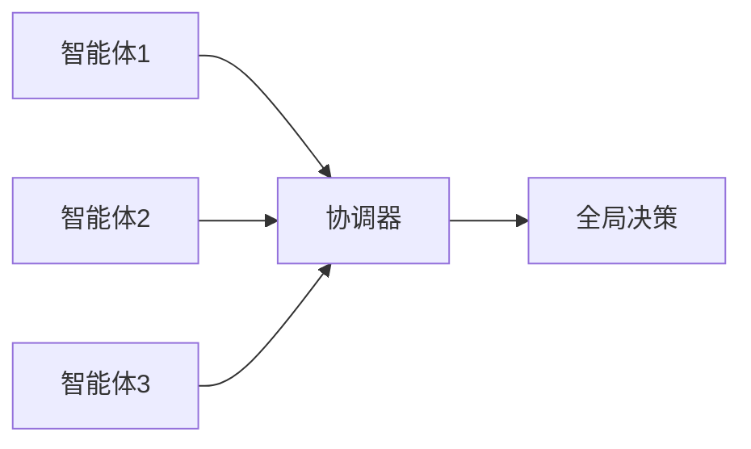
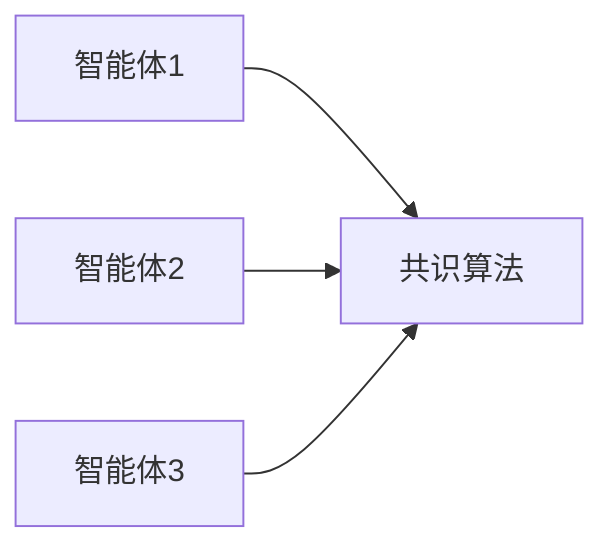
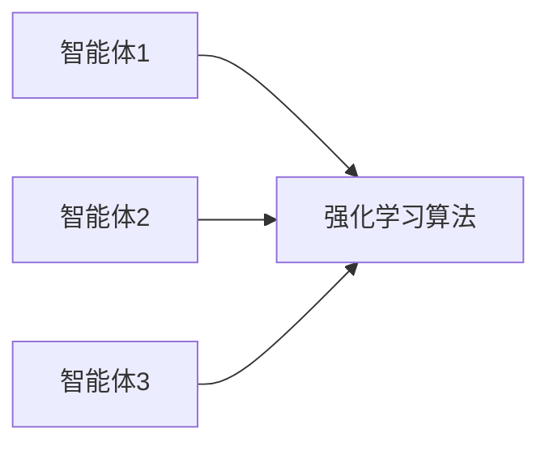
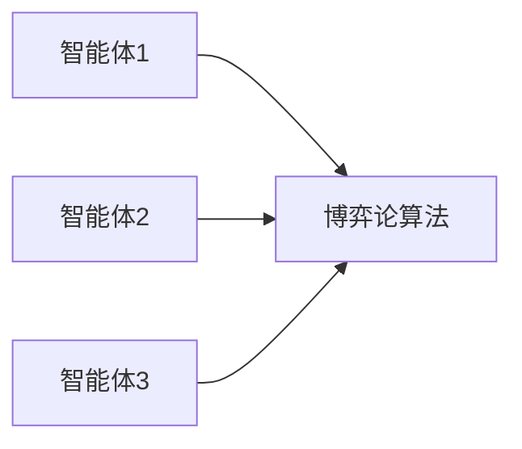
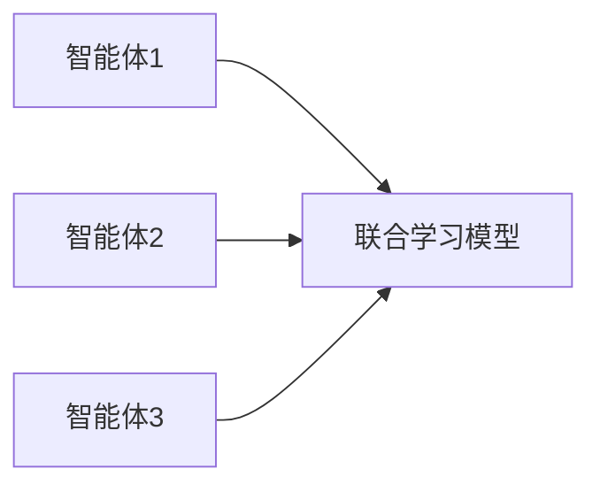
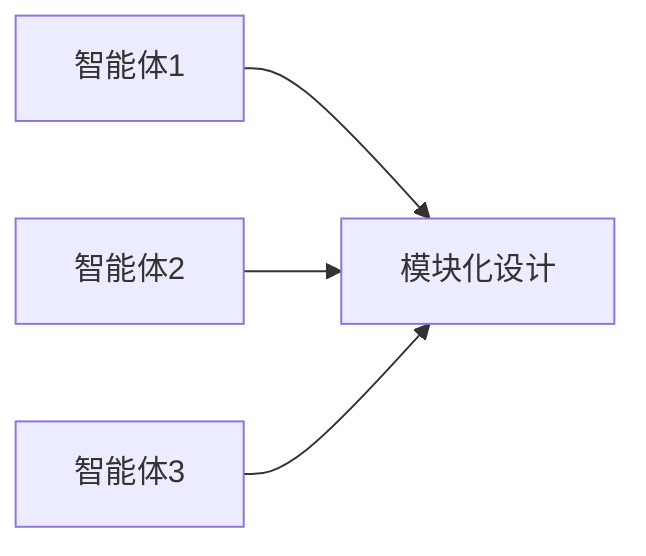
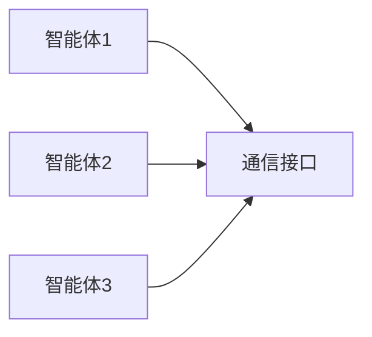

                 


# 多智能体系统在识别价值陷阱中的应用：防范投资风险

> 关键词：多智能体系统，价值陷阱，投资风险，分布式计算，投资决策，人工智能

> 摘要：本文探讨了多智能体系统在识别价值陷阱中的应用，通过分析多智能体系统的原理和算法，结合数学模型和实际案例，展示了如何利用多智能体系统来防范投资风险。文章内容涵盖了多智能体系统的概念、算法原理、数学模型、系统架构设计以及项目实战，旨在为投资领域提供一种新的视角和方法。

---

# 第1章: 多智能体系统概述

## 1.1 多智能体系统的基本概念

### 1.1.1 多智能体系统的定义

多智能体系统（Multi-Agent System, 简称MAS）是由多个智能体（Agent）组成的分布式系统，这些智能体通过协作和交互完成特定任务。每个智能体都有一定的自主性、反应性和社交能力，能够感知环境、做出决策并与其他智能体或外部系统进行交互。

### 1.1.2 多智能体系统的核心特征

| 特征 | 描述 |
|------|------|
| 分布式 | 系统中的多个智能体分布在网络中，各自独立运行。 |
| 协作性 | 智能体之间通过协作完成共同目标。 |
| 反应性 | 智能体能够实时感知环境并做出响应。 |
| 自主性 | 智能体在没有外部干预的情况下能够自主决策。 |

### 1.1.3 多智能体系统的分类

多智能体系统可以按照不同的标准进行分类，常见的分类方式包括：

1. **任务驱动型**：智能体之间的协作是为了完成特定任务。
2. **知识共享型**：智能体之间通过共享知识来提高整体系统的智能性。
3. **分布式计算型**：基于分布式计算的多智能体系统，强调计算资源的分布。

---

## 1.2 多智能体系统在投资中的应用

### 1.2.1 投资中的多智能体系统场景

在投资领域，多智能体系统可以应用于股票交易、风险评估、市场预测等多个场景。例如，多个智能体可以分别负责数据收集、分析、决策和执行，从而实现高效的交易策略。

### 1.2.2 多智能体系统的优势

1. **分布式计算能力**：多智能体系统能够利用分布式计算的优势，提高系统的计算能力和处理效率。
2. **协作能力**：多个智能体可以通过协作完成复杂的任务，提升系统的整体性能。
3. **适应性**：多智能体系统能够根据市场环境的变化动态调整策略，具有较强的适应性。

### 1.2.3 多智能体系统与传统投资方法的对比

| 特性 | 多智能体系统 | 传统投资方法 |
|------|--------------|---------------|
| 决策速度 | 快速且分布式 | 集中化，可能较慢 |
| 协作能力 | 强 | 较弱或依赖人工 |
| 灵活性 | 高 | 低 |

---

## 1.3 价值陷阱的定义与特征

### 1.3.1 价值陷阱的定义

价值陷阱是指某些股票或资产在表面上看起来具有较高的投资价值，但由于公司基本面恶化或其他因素，其实际价值远低于表面价值。投资者如果误判，可能会陷入亏损。

### 1.3.2 价值陷阱的核心特征

| 特征 | 描述 |
|------|------|
| 低估值 | 表面上看估值低，但实际价值可能更低。 |
| 基本面恶化 | 公司财务状况恶化，盈利能力下降。 |
| 市场误判 | 市场参与者对公司的前景存在误判。 |

### 1.3.3 价值陷阱与投资风险的关系

价值陷阱是投资风险的一种表现形式，投资者如果无法准确识别价值陷阱，可能会面临较大的投资损失。多智能体系统可以通过分析多个维度的数据，帮助投资者识别价值陷阱，降低投资风险。

---

## 1.4 多智能体系统在识别价值陷阱中的作用

### 1.4.1 多智能体系统如何辅助识别价值陷阱

多智能体系统可以通过以下方式辅助识别价值陷阱：

1. **数据收集与分析**：多个智能体分别负责收集和分析不同的数据源，如财务数据、市场数据、新闻数据等。
2. **协作决策**：智能体之间通过协作，综合分析多方面的数据，识别潜在的价值陷阱。
3. **动态调整**：根据市场变化，动态调整识别策略，提高识别的准确率。

### 1.4.2 多智能体系统的分布式计算优势

多智能体系统的分布式计算能力使其能够高效地处理大量数据，同时通过协作提高识别的准确率。例如，一个智能体可以负责分析财务数据，另一个智能体可以负责分析市场情绪，通过协作完成对价值陷阱的识别。

### 1.4.3 多智能体系统在复杂市场环境中的适应性

多智能体系统能够根据市场环境的变化动态调整识别策略，具有较强的适应性。例如，在市场波动加剧的情况下，智能体可以快速调整分析策略，提高识别的效率和准确率。

---

## 1.5 本章小结

本章介绍了多智能体系统的基本概念、核心特征及其在投资中的应用，重点分析了多智能体系统在识别价值陷阱中的作用和优势。通过对比多智能体系统与传统投资方法，我们可以看出，多智能体系统在投资领域具有广阔的应用前景。

---

# 第2章: 多智能体系统的算法原理

## 2.1 分布式计算与多智能体协调

### 2.1.1 分布式计算的基本原理

分布式计算是指将计算任务分布在多个计算节点上，通过协作完成任务。多智能体系统中的分布式计算可以通过以下步骤实现：

1. **任务分解**：将整体任务分解为多个子任务，分配给不同的智能体。
2. **通信与协作**：智能体之间通过通信模块进行数据交换和协作。
3. **结果整合**：将各个智能体的计算结果整合，得到最终的解决方案。

### 2.1.2 多智能体系统的协调机制

多智能体系统的协调机制可以通过以下流程实现：



协调器负责接收各个智能体的计算结果，并根据这些结果做出全局决策。

### 2.1.3 分布式算法在多智能体系统中的应用

分布式算法是多智能体系统的核心，常见的分布式算法包括：

1. **一致性算法**：如Paxos、Raft等，用于保证系统中多个节点的数据一致性。
2. **分布式搜索算法**：如BFS、DFS等，用于分布式环境中的数据搜索。

---

## 2.2 多智能体系统的通信与决策

### 2.2.1 多智能体系统中的通信协议

多智能体系统中的通信协议可以通过以下流程实现：


通信协议负责管理智能体之间的数据交换，确保数据的准确性和及时性。

### 2.2.2 多智能体系统的决策模型

多智能体系统的决策模型可以通过以下步骤实现：

1. **数据收集**：智能体收集相关数据。
2. **数据分析**：智能体分析数据，做出决策。
3. **决策输出**：智能体将决策结果输出，供其他智能体使用。

### 2.2.3 多智能体系统的共识算法

多智能体系统的共识算法可以通过以下流程实现：



共识算法用于确保系统中所有智能体达成一致的决策。

---

## 2.3 多智能体系统的优化算法

### 2.3.1 分布式优化算法概述

分布式优化算法是多智能体系统中的核心算法，常见的分布式优化算法包括：

1. **分布式梯度下降**：通过分布式计算实现梯度下降。
2. **分布式强化学习**：通过分布式智能体实现强化学习。

### 2.3.2 基于强化学习的多智能体优化

基于强化学习的多智能体优化可以通过以下流程实现：



强化学习算法通过奖励机制，引导智能体做出最优决策。

### 2.3.3 基于博弈论的多智能体决策优化

基于博弈论的多智能体决策优化可以通过以下流程实现：



博弈论算法通过模拟博弈过程，优化智能体的决策。

---

## 2.4 本章小结

本章详细介绍了多智能体系统的算法原理，包括分布式计算、通信与决策、优化算法等内容。通过分析多智能体系统的算法实现，我们可以更好地理解其在投资中的应用。

---

# 第3章: 多智能体系统在投资中的数学模型

## 3.1 投资风险的数学模型

### 3.1.1 投资风险的定义与度量

投资风险是指投资过程中可能面临的损失或收益波动。投资风险的度量可以通过以下公式实现：

$$R_i = \sqrt{\frac{2}{N}\sum_{i=1}^{N}(x_i - \mu)^2}$$

其中，$R_i$ 表示投资风险，$x_i$ 表示收益序列，$\mu$ 表示收益序列的均值，$N$ 表示收益序列的长度。

### 3.1.2 投资风险的数学表达式

投资风险的数学表达式可以通过以下公式表示：

$$R_i = \sqrt{\frac{2}{N}\sum_{i=1}^{N}(x_i - \mu)^2}$$

---

## 3.2 多智能体系统的协作模型

### 3.2.1 多智能体协作的基本模型

多智能体协作的基本模型可以通过以下公式表示：

$$V = \max_{\theta} \sum_{i=1}^{n} \text{value}(s_i, \theta)$$

其中，$V$ 表示系统的整体价值，$\theta$ 表示系统的参数，$s_i$ 表示智能体的状态。

### 3.2.2 多智能体协作的数学表达

多智能体协作的数学表达可以通过以下公式表示：

$$V = \max_{\theta} \sum_{i=1}^{n} \text{value}(s_i, \theta)$$

---

## 3.3 价值陷阱识别的数学模型

### 3.3.1 价值陷阱识别的特征提取

价值陷阱识别的特征提取可以通过以下步骤实现：

1. **数据预处理**：对数据进行清洗和标准化处理。
2. **特征选择**：选择具有代表性的特征，如财务指标、市场指标等。
3. **特征提取**：通过主成分分析（PCA）等方法提取特征。

### 3.3.2 价值陷阱识别的分类模型

价值陷阱识别的分类模型可以通过以下公式表示：

$$\text{分类结果} = \arg\max_{\text{class}} P(\text{class}|\text{特征})$$

其中，$P(\text{class}|\text{特征})$ 表示在给定特征下，某个类别的概率。

### 3.3.3 基于多智能体的联合学习模型

基于多智能体的联合学习模型可以通过以下流程实现：



---

## 3.4 本章小结

本章详细介绍了多智能体系统在投资中的数学模型，包括投资风险的度量、多智能体协作模型以及价值陷阱识别的分类模型等内容。通过数学模型的分析，我们可以更好地理解多智能体系统在投资中的应用。

---

# 第4章: 多智能体系统在投资中的系统架构设计

## 4.1 系统功能设计

### 4.1.1 数据采集与处理模块

数据采集与处理模块负责从多个数据源（如股票市场数据、财务数据等）获取数据，并进行清洗和预处理。

### 4.1.2 多智能体协作模块

多智能体协作模块负责协调多个智能体的协作，确保系统的高效运行。

### 4.1.3 投资决策模块

投资决策模块负责根据智能体的协作结果，做出投资决策。

---

## 4.2 系统架构设计

### 4.2.1 分层架构设计

多智能体系统的分层架构设计可以通过以下流程实现：


### 4.2.2 模块化设计

多智能体系统的模块化设计可以通过以下流程实现：



### 4.2.3 系统交互流程设计

系统交互流程设计可以通过以下流程实现：


---

## 4.3 系统接口设计

### 4.3.1 多智能体间通信接口

多智能体间通信接口可以通过以下流程实现：



### 4.3.2 系统与外部数据源接口

系统与外部数据源接口可以通过以下流程实现：


### 4.3.3 用户交互接口

用户交互接口可以通过以下流程实现：


---

## 4.4 本章小结

本章详细介绍了多智能体系统在投资中的系统架构设计，包括功能设计、架构设计和接口设计等内容。通过系统架构设计的分析，我们可以更好地理解多智能体系统在投资中的实现方式。

---

# 第5章: 多智能体系统在投资中的项目实战

## 5.1 项目环境安装与配置

### 5.1.1 开发环境搭建

推荐使用Python作为开发语言，安装以下工具：

1. **Python**：3.8或更高版本。
2. **NumPy**：用于数值计算。
3. **Pandas**：用于数据处理。
4. **Scikit-learn**：用于机器学习。
5. **Multi-Agent Framework**：如MASA。

### 5.1.2 依赖库安装

安装以下依赖库：

```bash
pip install numpy pandas scikit-learn
```

### 5.1.3 系统配置

配置以下系统参数：

1. **路径配置**：确保数据文件路径正确。
2. **日志配置**：配置日志输出格式和路径。

---

## 5.2 系统核心实现

### 5.2.1 多智能体协作算法实现

以下是多智能体协作算法的Python实现：

```python
import numpy as np
import pandas as pd
from sklearn.metrics import mean_squared_error

def multi_agent_collaboration(data):
    agents = [Agent1(), Agent2(), Agent3()]
    results = []
    for agent in agents:
        result = agent.analyze(data)
        results.append(result)
    # 综合多个智能体的结果，做出最终决策
    final_decision = np.mean(results)
    return final_decision

class Agent:
    def analyze(self, data):
        # 具体分析逻辑
        return np.mean(data)
```

### 5.2.2 价值陷阱识别算法实现

以下是价值陷阱识别算法的Python实现：

```python
def value_traps_detection(data):
    # 数据预处理
    processed_data = data preprocessing
    # 特征提取
    features = feature extraction(processed_data)
    # 分类模型训练
    model = train_classifier(features, labels)
    # 模型预测
    predictions = model.predict(features)
    return predictions
```

### 5.2.3 投资决策模块实现

以下是投资决策模块的Python实现：

```python
def investment_decision(predictions):
    # 根据预测结果，做出投资决策
    if predictions == 'value trap':
        return '卖出'
    else:
        return '持有'
```

---

## 5.3 代码应用解读与分析

### 5.3.1 核心算法代码解读

以下是对核心算法代码的解读：

```python
def multi_agent_collaboration(data):
    agents = [Agent1(), Agent2(), Agent3()]
    results = []
    for agent in agents:
        result = agent.analyze(data)
        results.append(result)
    final_decision = np.mean(results)
    return final_decision
```

上述代码通过多个智能体的协作，综合分析数据，做出最终决策。

### 5.3.2 系统功能模块代码解读

以下是对系统功能模块代码的解读：

```python
class Agent:
    def analyze(self, data):
        # 具体分析逻辑
        return np.mean(data)
```

上述代码定义了一个智能体的分析方法，具体分析逻辑可以根据实际需求进行扩展。

### 5.3.3 代码实现中的注意事项

1. **数据预处理**：确保数据的准确性和完整性。
2. **算法选择**：根据具体需求选择合适的算法。
3. **系统优化**：通过优化算法和系统架构，提高系统的运行效率。

---

## 5.4 本章小结

本章通过实际案例，详细介绍了多智能体系统在投资中的项目实战，包括环境安装、系统核心实现和代码解读等内容。通过实际案例的分析，我们可以更好地理解多智能体系统在投资中的应用。

---

# 作者：AI天才研究院/AI Genius Institute & 禅与计算机程序设计艺术 /Zen And The Art of Computer Programming

