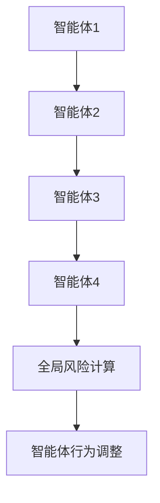
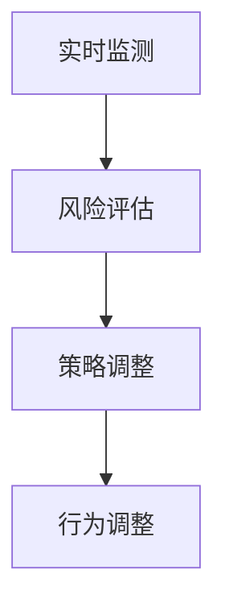
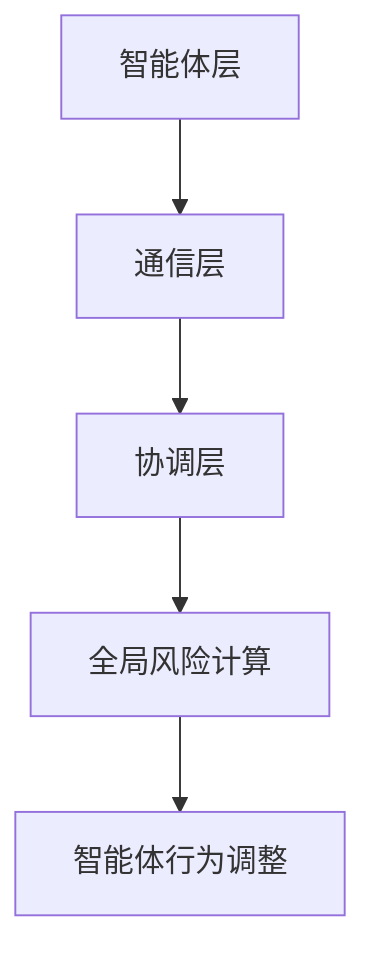

                 


# 多智能体系统如何实现动态风险平衡

## 关键词：
多智能体系统, 动态风险平衡, 智能体协作, 风险评估, 分布式计算, 系统架构

## 摘要：
多智能体系统（Multi-Agent Systems, MAS）是由多个智能体组成的复杂系统，这些智能体能够自主决策、协作和互动。在动态环境中，这些智能体需要平衡各种风险，以确保系统的稳定性和高效性。本文将深入探讨如何在多智能体系统中实现动态风险平衡，从理论基础到实际应用，详细分析其核心概念、算法原理、系统架构，并通过实际案例展示如何在复杂环境中实现动态风险平衡。

---

# 第1章: 多智能体系统概述

## 1.1 多智能体系统的定义与特点

### 1.1.1 多智能体系统的定义
多智能体系统是由多个智能体组成的分布式系统，这些智能体能够感知环境、自主决策，并通过协作完成特定任务。智能体之间的互动是多智能体系统的核心特征。

### 1.1.2 多智能体系统的特征
- **自主性**：智能体能够自主决策，无需外部干预。
- **反应性**：智能体能够实时感知环境并做出反应。
- **协作性**：智能体之间通过通信和协作完成共同目标。
- **动态性**：环境和任务可能是动态变化的。

### 1.1.3 多智能体系统与单智能体系统的区别
| 特性            | 单智能体系统       | 多智能体系统       |
|-----------------|-------------------|-------------------|
| 智能体数量      | 单个             | 多个             |
| 决策方式        | 中央化           | 分布式           |
| 任务处理        | 单一目标         | 多目标协作       |
| 复杂性          | 较低             | 较高             |

## 1.2 动态风险平衡的背景与意义

### 1.2.1 动态风险平衡的定义
动态风险平衡是指在多智能体系统中，通过动态调整智能体的行为和策略，以平衡系统中的各种风险，确保系统的稳定性和高效性。

### 1.2.2 动态风险平衡的重要性
在多智能体系统中，智能体的互动可能导致风险的积累和扩散。动态风险平衡能够有效管理和化解这些风险，避免系统崩溃或性能下降。

### 1.2.3 多智能体系统中的风险来源
- **环境不确定性**：外部环境的变化可能导致智能体决策失误。
- **智能体冲突**：智能体之间的竞争可能导致资源分配不均。
- **通信延迟**：智能体之间的通信延迟可能影响协作效率。

## 1.3 多智能体系统的应用场景

### 1.3.1 分布式计算
在分布式计算中，多智能体系统可以协调多个计算节点的任务分配，提高计算效率。

### 1.3.2 智能交通系统
智能交通系统中，多个智能体可以协调交通信号灯、自动驾驶车辆的行为，优化交通流量。

### 1.3.3 电子商务与金融
在金融系统中，多智能体可以用于风险评估、交易撮合和市场预测。

## 1.4 本章小结
本章介绍了多智能体系统的定义、特征、与单智能体系统的区别，以及动态风险平衡的背景和意义。通过实际应用场景的分析，强调了动态风险平衡在多智能体系统中的重要性。

---

# 第2章: 多智能体系统的核心概念

## 2.1 多智能体系统的组成要素

### 2.1.1 智能体的定义
智能体（Agent）是指能够感知环境、自主决策并采取行动的实体。智能体可以是软件程序、机器人或其他具有智能行为的实体。

### 2.1.2 智能体的类型
智能体可以分为以下几类：
- **简单反射智能体**：基于当前感知做出反应，不依赖历史信息。
- **基于模型的智能体**：利用内部模型和历史信息进行决策。
- **目标驱动智能体**：根据目标和优先级进行决策。
- **实用驱动智能体**：根据效用函数进行决策。

### 2.1.3 智能体的属性
智能体具有以下属性：
- **自主性**：能够自主决策。
- **反应性**：能够感知环境并做出反应。
- **协作性**：能够与其他智能体协作。
- **学习能力**：能够通过经验改进自身行为。

## 2.2 多智能体系统中的通信与协作

### 2.2.1 智能体之间的通信机制
智能体之间的通信可以通过以下方式实现：
- **直接通信**：智能体之间直接交换信息。
- **间接通信**：通过中间媒介传递信息。

### 2.2.2 协作协议与协调机制
为了实现协作，多智能体系统需要遵循特定的协议和协调机制：
- **协商协议**：智能体之间通过协商确定任务分配和行动。
- **冲突解决机制**：当智能体之间发生冲突时，通过协商或仲裁解决冲突。

### 2.2.3 通信模型
通信模型可以分为以下几种：
- **点对点通信**：智能体之间直接通信。
- **广播通信**：一个智能体向所有其他智能体发送信息。
- **组播通信**：智能体向特定组内的智能体发送信息。

## 2.3 多智能体系统的动态性与复杂性

### 2.3.1 动态环境的定义
动态环境是指环境状态和条件会随着时间变化的环境。

### 2.3.2 复杂系统的特征
复杂系统具有以下特征：
- **非线性**：系统行为不是简单地线性叠加。
- **涌现性**：系统整体表现出个体不具备的特征。
- **适应性**：系统能够根据环境变化调整自身行为。

### 2.3.3 动态风险的来源
动态风险的来源包括：
- **环境变化**：外部环境的变化可能导致智能体决策失误。
- **智能体行为不确定性**：智能体的行为可能受到不确定因素的影响。
- **协作失败**：智能体之间的协作失败可能导致系统风险。

## 2.4 本章小结
本章详细介绍了多智能体系统的组成要素、通信与协作机制、动态性和复杂性，以及动态风险的来源。这些内容为后续章节的分析奠定了基础。

---

# 第3章: 动态风险平衡的理论基础

## 3.1 动态风险平衡的定义与特征

### 3.1.1 动态风险平衡的定义
动态风险平衡是指在多智能体系统中，通过动态调整智能体的行为和策略，以平衡系统中的各种风险，确保系统的稳定性和高效性。

### 3.1.2 动态风险平衡的特征
- **动态性**：风险平衡是动态调整的，随环境变化而变化。
- **局部性**：每个智能体只关注自身的风险平衡。
- **全局性**：系统的整体风险平衡需要考虑所有智能体的行为。

## 3.2 多智能体系统中的风险评估

### 3.2.1 风险评估的定义
风险评估是指对系统中可能存在的风险进行识别、量化和分析。

### 3.2.2 风险评估的方法
常用的风险评估方法包括：
- **定量分析**：通过数学模型量化风险。
- **定性分析**：通过专家判断或经验分析风险。
- **混合分析**：结合定量和定性方法进行风险评估。

### 3.2.3 风险评估的指标
风险评估的指标包括：
- **风险概率**：风险发生的可能性。
- **风险影响**：风险发生后对系统的影响程度。

## 3.3 多智能体系统中的风险平衡策略

### 3.3.1 风险平衡策略的定义
风险平衡策略是指在多智能体系统中，通过调整智能体的行为和策略，以达到风险平衡的方法。

### 3.3.2 风险平衡策略的分类
风险平衡策略可以分为以下几类：
- **预防性策略**：通过预防措施降低风险发生的概率。
- **应急策略**：在风险发生后采取措施减轻风险影响。
- **适应性策略**：根据环境变化动态调整风险平衡策略。

## 3.4 本章小结
本章介绍了动态风险平衡的定义和特征，详细分析了多智能体系统中的风险评估和风险平衡策略。这些理论为后续章节的算法和系统设计提供了理论基础。

---

# 第4章: 多智能体系统的算法原理

## 4.1 分布式风险评估算法

### 4.1.1 算法概述
分布式风险评估算法是一种基于分布式计算的风险评估方法，适用于多智能体系统。

### 4.1.2 算法步骤
1. **信息收集**：每个智能体收集自身的风险信息。
2. **信息传播**：智能体之间通过通信传播风险信息。
3. **风险计算**：每个智能体根据收集到的信息计算系统整体风险。
4. **风险反馈**：智能体根据计算结果调整自身行为。

### 4.1.3 算法实现
```python
def distributed_risk_assessment():
    for agent in agents:
        agent.gather_information()
        agent.spread_information()
    global_risk = calculate_global_risk()
    for agent in agents:
        agent.adjust_behavior(global_risk)
```

### 4.1.4 算法流程图


## 4.2 动态风险调整算法

### 4.2.1 算法概述
动态风险调整算法是一种基于实时反馈调整风险平衡的方法。

### 4.2.2 算法步骤
1. **实时监测**：智能体实时监测环境和系统状态。
2. **风险评估**：根据实时数据评估当前风险。
3. **策略调整**：根据风险评估结果调整智能体行为。

### 4.2.3 算法实现
```python
def dynamic_risk_adjustment():
    while True:
        for agent in agents:
            agent.monitor_environment()
        global_risk = calculate_global_risk()
        for agent in agents:
            agent.adjust_strategy(global_risk)
```

### 4.2.4 算法流程图


## 4.3 本章小结
本章详细介绍了多智能体系统的算法原理，包括分布式风险评估算法和动态风险调整算法。这些算法为实现动态风险平衡提供了技术支持。

---

# 第5章: 多智能体系统的系统架构设计

## 5.1 系统架构概述

### 5.1.1 系统架构的目标
系统架构设计的目标是确保多智能体系统的稳定性和高效性。

### 5.1.2 系统架构的组成部分
系统架构主要包括以下部分：
- **智能体层**：负责智能体的行为和决策。
- **通信层**：负责智能体之间的通信和数据交换。
- **协调层**：负责智能体之间的协作和冲突解决。

## 5.2 系统功能设计

### 5.2.1 功能模块划分
系统功能模块包括：
- **风险评估模块**：负责系统风险的评估和计算。
- **策略调整模块**：负责根据风险评估结果调整智能体行为。
- **通信模块**：负责智能体之间的信息传递。

### 5.2.2 功能模块的交互流程
1. 智能体通过通信模块传递信息。
2. 风险评估模块根据信息计算系统风险。
3. 策略调整模块根据风险评估结果调整智能体行为。

## 5.3 系统架构设计

### 5.3.1 系统架构的描述
系统架构可以采用分层设计，包括智能体层、通信层和协调层。

### 5.3.2 系统架构的实现


## 5.4 本章小结
本章详细介绍了多智能体系统的系统架构设计，包括功能模块划分和架构实现。这些设计为实现动态风险平衡提供了系统支持。

---

# 第6章: 项目实战——智能交通系统中的动态风险平衡

## 6.1 项目背景

### 6.1.1 项目目标
本项目的目标是设计一个智能交通系统，实现交通信号灯和自动驾驶车辆的动态风险平衡。

## 6.2 系统设计

### 6.2.1 系统功能设计
系统功能包括交通信号灯控制、自动驾驶车辆路径规划和风险评估。

### 6.2.2 系统架构设计
系统架构包括交通信号灯智能体、自动驾驶车辆智能体和风险评估模块。

## 6.3 系统实现

### 6.3.1 环境安装
需要安装Python、Mermaid和相关开发工具。

### 6.3.2 核心实现代码
```python
class TrafficLightAgent:
    def __init__(self, id):
        self.id = id
        self.state = 'green'
    
    def change_state(self, new_state):
        self.state = new_state
    
    def get_state(self):
        return self.state

class AutonomousVehicleAgent:
    def __init__(self, id):
        self.id = id
        self.position = 0
        self.speed = 0
    
    def move(self, target_position):
        self.position = target_position
        self.speed = abs(target_position - self.position) / 0.1
    
    def get_position(self):
        return self.position

class RiskAssessmentModule:
    def __init__(self, agents):
        self.agents = agents
    
    def assess_risk(self):
        risk = 0
        for agent in self.agents:
            if agent.get_position() > 100:
                risk += 1
        return risk

# 使用示例
traffic_light = TrafficLightAgent(1)
vehicle = AutonomousVehicleAgent(1)
risk_module = RiskAssessmentModule([traffic_light, vehicle])

risk_module.assess_risk()
```

## 6.4 实际案例分析

### 6.4.1 案例背景
在智能交通系统中，自动驾驶车辆需要与交通信号灯协作，确保交通流畅。

### 6.4.2 系统实现分析
通过代码实现交通信号灯和自动驾驶车辆的协作，风险评估模块实时评估系统风险，并动态调整智能体行为。

## 6.5 项目小结
本章通过智能交通系统的实际案例，详细展示了如何在多智能体系统中实现动态风险平衡。通过项目实战，读者可以更好地理解理论知识。

---

# 第7章: 总结与展望

## 7.1 本章总结
本文详细介绍了多智能体系统如何实现动态风险平衡，从理论基础到实际应用，全面分析了多智能体系统的组成、算法原理和系统架构设计。

## 7.2 未来展望
未来的研究方向包括：
- **更复杂的动态环境**：研究如何在更复杂的动态环境中实现动态风险平衡。
- **更智能的算法**：开发更智能的算法，提高风险评估和策略调整的效率。
- **更高效的系统架构**：设计更高效的系统架构，提高系统的稳定性和效率。

## 7.3 最佳实践 Tips
- 在设计多智能体系统时，应充分考虑智能体的自主性和协作性。
- 在实现动态风险平衡时，应实时监测系统状态，并根据需要动态调整策略。

## 7.4 本章小结
本文总结了多智能体系统实现动态风险平衡的核心内容，并展望了未来的研究方向。

---

# 作者：AI天才研究院/AI Genius Institute & 禅与计算机程序设计艺术 /Zen And The Art of Computer Programming

---

以上是《多智能体系统如何实现动态风险平衡》的完整目录和文章内容。文章详细分析了多智能体系统的组成、动态风险平衡的理论基础、算法原理和系统架构设计，并通过智能交通系统的实际案例展示了如何在多智能体系统中实现动态风险平衡。

