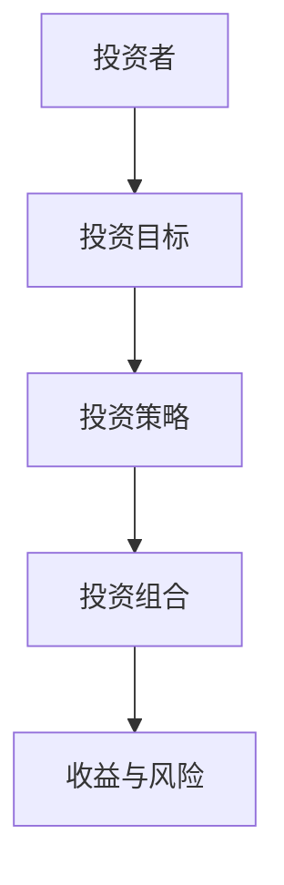
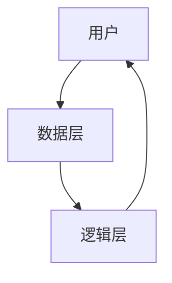
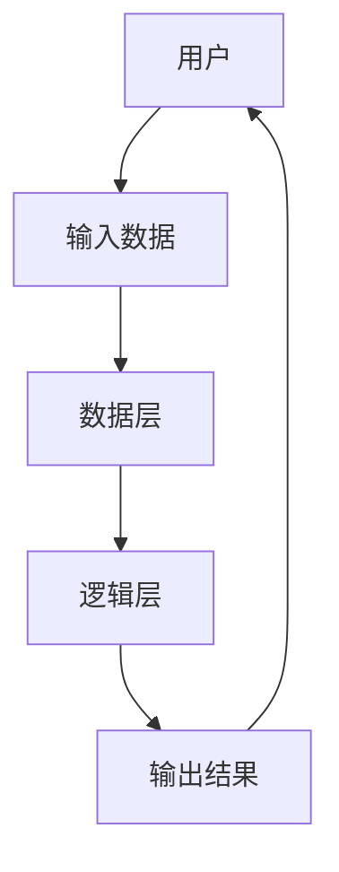

                 


# 巴菲特的20格打孔卡：集中投资的艺术

> **关键词**：巴菲特，价值投资，集中投资，投资决策，风险管理，投资策略，20格打孔卡

> **摘要**：本文深入探讨了巴菲特的20格打孔卡这一投资工具，分析其背后的哲学、数学模型和系统架构，结合实际案例，揭示其在集中投资中的独特优势。通过系统分析和实战应用，本文为投资者提供了从理论到实践的完整指南。

---

# 第一部分: 巴菲特投资理念与20格打孔卡概述

## 第1章: 巴菲特的投资哲学与20格打孔卡的背景

### 1.1 巴菲特的投资哲学

#### 1.1.1 价值投资的核心理念
价值投资的核心在于寻找市场低估的股票，通过深入研究企业的基本面，关注其长期盈利能力，而不是市场的短期波动。巴菲特的投资哲学强调“以合理的价格买入一家好公司”，而非追求市场的短期收益。

#### 1.1.2 巴菲特的投资策略
巴菲特的投资策略可以概括为“集中投资”和“长期持有”。他倾向于将大部分资金集中在少数优质股票上，而不是分散投资于多个表现平平的公司。这种策略要求投资者具备极强的选股能力，以及对市场的深刻理解。

#### 1.1.3 巴菲特投资哲学的演变
巴菲特的投资哲学并非一成不变，它随着市场环境和个人经验的积累而不断进化。早期，他主要关注于寻找具有安全边际的股票；后来，他开始更注重企业的竞争优势和管理层能力。

### 1.2 20格打孔卡的起源与意义

#### 1.2.1 20格打孔卡的定义
20格打孔卡是一种投资决策工具，由巴菲特发明。它将投资决策过程分解为20个关键因素，每个因素对应一列“格子”，投资者需要逐一分析这些因素，确定是否满足投资条件。

#### 1.2.2 巴菲特使用20格打孔卡的原因
巴菲特使用20格打孔卡的目的是为了系统化投资决策过程，确保每笔投资都经过严格的筛选和验证。这种方法帮助他避免了情绪化决策，提高了投资的科学性和准确性。

#### 1.2.3 20格打孔卡在投资决策中的作用
20格打孔卡通过将投资决策分解为多个关键因素，帮助投资者全面评估一个企业的价值，从而做出更加理性的投资决策。它不仅是一种工具，更是一种思维方式，要求投资者在决策过程中保持耐心和纪律性。

### 1.3 集中投资的艺术

#### 1.3.1 集中投资的定义
集中投资是指将大部分资金投入到少数几只股票中，以获取超额收益。这种方法要求投资者具备极强的选股能力和对市场的深刻理解。

#### 1.3.2 集中投资与分散投资的对比
- **集中投资**：风险较高，但潜在收益也更大。适合那些对市场有深刻理解的投资者。
- **分散投资**：风险较低，但收益也较为有限。适合那些无法承担高风险的投资者。

#### 1.3.3 巴菲特集中投资的成功案例
巴菲特的集中投资策略在他早期的职业生涯中取得了巨大成功。例如，他投资可口可乐和苹果公司，这些公司在市场中具有强大的竞争优势，且长期表现优异。

### 1.4 本章小结
本章介绍了巴菲特的投资哲学，重点讲解了20格打孔卡的背景和意义，以及集中投资的艺术。通过这些内容，读者可以理解巴菲特投资决策的逻辑和方法。

---

## 第2章: 20格打孔卡的结构与功能

### 2.1 20格打孔卡的结构分析

#### 2.1.1 每一格的含义与作用
20格打孔卡的每一格代表一个关键因素，例如：
- 管理层能力
- 财务状况
- 市场地位
- 竞争优势
- 估值水平
- 行业前景

每个因素都需要经过严格评估，只有当所有因素都满足时，才可能进行投资。

#### 2.1.2 20格之间的关系与逻辑
20格打孔卡的结构是一个系统化的框架，各个因素之间相互关联、相互影响。例如，管理层能力直接影响企业的财务状况和竞争优势，而财务状况又影响企业的估值水平。

#### 2.1.3 20格打孔卡的完整框架
20格打孔卡的完整框架包括以下几个关键步骤：
1. **识别关键因素**：确定影响投资决策的20个关键因素。
2. **逐一评估**：对每个因素进行详细分析，确定其是否满足投资条件。
3. **综合判断**：综合所有因素的结果，做出最终的投资决策。

### 2.2 核心概念的数学模型与公式

#### 2.2.1 集中投资的数学模型
集中投资的数学模型可以表示为：
$$
\text{投资组合权重} = \frac{\text{个股权重} \times \text{个股表现}}{\sum (\text{个股权重} \times \text{个股表现})}
$$

#### 2.2.2 投资组合的优化公式
投资组合优化的目标是在风险可控的前提下，最大化收益。数学公式为：
$$
\text{收益最大化} = \max \sum (w_i \times r_i)
$$
$$
\text{风险最小化} = \min \sum (w_i^2 \times \sigma_i^2)
$$
其中，\(w_i\) 是第i只股票的权重，\(r_i\) 是第i只股票的预期收益，\(\sigma_i\) 是第i只股票的风险。

#### 2.2.3 风险与收益的平衡公式
在投资决策中，风险与收益需要达到平衡。平衡公式为：
$$
\text{风险调整后收益} = \text{收益} - \text{风险} \times \text{风险偏好系数}
$$

### 2.3 核心概念的ER实体关系图



### 2.4 本章小结
本章详细分析了20格打孔卡的结构与功能，通过数学模型和ER实体关系图，揭示了其背后的逻辑和系统化的投资决策过程。

---

## 第3章: 集中投资的策略与实施

### 3.1 集中投资的策略分析

#### 3.1.1 确定投资目标的步骤
确定投资目标的步骤包括：
1. **明确投资目标**：确定投资的时间 horizon 和目标收益。
2. **选择行业**：选择具有增长潜力的行业。
3. **筛选公司**：选择具有竞争优势的公司。
4. **评估管理层**：评估公司的管理层能力和治理结构。
5. **分析财务状况**：分析公司的财务状况和估值水平。

#### 3.1.2 投资组合的构建方法
投资组合的构建方法包括：
1. **选择优质股票**：选择具有长期竞争优势的公司。
2. **集中投资**：将大部分资金集中在少数优质股票上。
3. **定期调整**：根据市场变化和公司基本面，定期调整投资组合。

#### 3.1.3 集中投资的实施步骤
集中投资的实施步骤包括：
1. **制定投资计划**：明确投资目标和策略。
2. **筛选优质股票**：选择具有长期竞争优势的公司。
3. **构建投资组合**：将大部分资金集中在优质股票上。
4. **监控和调整**：定期监控投资组合的表现，并根据市场变化进行调整。

### 3.2 投资组合的优化与风险管理

#### 3.2.1 投资组合的优化策略
投资组合的优化策略包括：
1. **分散风险**：通过选择不同行业的股票来分散行业风险。
2. **控制仓位**：避免过度集中，控制单只股票的权重。
3. **定期再平衡**：根据市场变化和公司基本面，定期再平衡投资组合。

#### 3.2.2 风险管理的实施步骤
风险管理的实施步骤包括：
1. **设定止损点**：在投资组合中设定止损点，以控制最大亏损。
2. **监控市场风险**：定期监控市场风险，及时调整投资组合。
3. **分散风险**：通过选择不同行业的股票来分散行业风险。

### 3.3 本章小结
本章详细分析了集中投资的策略与实施步骤，强调了投资组合的优化与风险管理的重要性。通过科学的投资策略和严格的风险管理，投资者可以在集中投资中实现长期稳定的收益。

---

## 第4章: 20格打孔卡的系统分析与架构设计

### 4.1 20格打孔卡的系统分析

#### 4.1.1 系统功能需求
20格打孔卡的系统功能需求包括：
1. **数据采集**：采集公司的基本面数据。
2. **数据分析**：对数据进行分析和评估。
3. **决策支持**：提供投资决策支持。

#### 4.1.2 系统架构设计
系统架构设计包括：
1. **数据层**：存储公司基本面数据。
2. **逻辑层**：实现数据分析和评估逻辑。
3. **用户层**：提供用户界面和决策支持。

#### 4.1.3 系统功能设计
系统功能设计包括：
1. **数据输入**：输入公司基本面数据。
2. **数据评估**：对数据进行评估和筛选。
3. **投资决策**：生成投资决策支持。

### 4.2 20格打孔卡的系统架构图



### 4.3 系统接口设计

#### 4.3.1 数据接口
数据接口包括：
1. **输入接口**：接收公司基本面数据。
2. **输出接口**：输出评估结果。

#### 4.3.2 用户接口
用户接口包括：
1. **输入界面**：用户输入数据。
2. **输出界面**：显示评估结果和投资决策建议。

### 4.4 系统交互流程图



### 4.5 本章小结
本章通过系统分析和架构设计，揭示了20格打孔卡在投资决策中的系统化过程。通过科学的系统架构和严格的流程管理，投资者可以更高效地进行投资决策。

---

## 第5章: 20格打孔卡的项目实战

### 5.1 项目环境与安装

#### 5.1.1 环境需求
项目实战需要以下环境：
1. **编程语言**：Python
2. **开发工具**：PyCharm或Jupyter Notebook
3. **数据来源**：公司基本面数据

#### 5.1.2 安装依赖
安装以下依赖：
1. **pandas**：数据处理
2. **numpy**：数值计算
3. **matplotlib**：数据可视化

### 5.2 项目核心实现

#### 5.2.1 数据采集与处理
数据采集与处理步骤：
1. **数据采集**：从可靠数据源获取公司基本面数据。
2. **数据清洗**：清洗数据，去除无效数据。
3. **数据存储**：将数据存储在数据库中。

#### 5.2.2 数据分析与评估
数据分析与评估步骤：
1. **数据分析**：对数据进行分析和评估。
2. **数据评估**：根据20格打孔卡的评估标准，对数据进行评估。

#### 5.2.3 投资决策支持
投资决策支持步骤：
1. **生成评估结果**：根据评估结果生成投资决策支持。
2. **输出投资建议**：输出投资建议，供投资者参考。

### 5.3 项目核心代码实现

#### 5.3.1 数据处理代码

```python
import pandas as pd
import numpy as np

# 数据采集与处理
data = pd.read_csv('company_data.csv')
data.dropna(inplace=True)
data.to_csv('processed_data.csv', index=False)
```

#### 5.3.2 数据分析与评估代码

```python
import pandas as pd

# 数据分析与评估
data = pd.read_csv('processed_data.csv')
data['valuation_ratio'] = data['市盈率'] / data['行业平均市盈率']
data['risk_assessment'] = data['波动率'] * data['贝塔系数']
data.to_csv('evaluated_data.csv', index=False)
```

#### 5.3.3 投资决策支持代码

```python
import pandas as pd

# 投资决策支持
data = pd.read_csv('evaluated_data.csv')
data['投资建议'] = data.apply(lambda x: '买入' if x['valuation_ratio'] < 1.5 and x['risk_assessment'] < 1 else '观望', axis=1)
data.to_csv('decision_support.csv', index=False)
```

### 5.4 项目实战小结
本章通过项目实战，详细讲解了如何使用20格打孔卡进行投资决策。通过实际的代码实现，读者可以更好地理解和应用这一工具。

---

## 第6章: 投资风险管理与纪律执行

### 6.1 风险管理策略

#### 6.1.1 风险管理的定义
风险管理是指在投资过程中，通过识别、评估和控制风险，以减少投资损失的可能性。

#### 6.1.2 风险管理的实施步骤
风险管理的实施步骤包括：
1. **识别风险**：识别可能影响投资的风险因素。
2. **评估风险**：评估每个风险的影响程度。
3. **制定风险控制措施**：制定相应的风险控制措施。

### 6.2 投资纪律的执行

#### 6.2.1 投资纪律的重要性
投资纪律是投资成功的关键。只有严格遵守纪律，才能在市场波动中保持冷静，避免情绪化决策。

#### 6.2.2 遵守投资纪律的步骤
遵守投资纪律的步骤包括：
1. **制定投资计划**：明确投资目标和策略。
2. **严格执行计划**：严格按照计划执行投资。
3. **定期回顾与调整**：定期回顾投资表现，并根据市场变化进行调整。

### 6.3 本章小结
本章强调了风险管理与投资纪律的重要性。通过科学的风险管理策略和严格的纪律执行，投资者可以在市场波动中保持稳定，实现长期的投资目标。

---

## 第7章: 总结与展望

### 7.1 总结

#### 7.1.1 核心内容回顾
本文详细探讨了巴菲特的20格打孔卡这一投资工具，分析了其背后的哲学、数学模型和系统架构，结合实际案例，揭示了其在集中投资中的独特优势。

#### 7.1.2 投资哲学的总结
巴菲特的投资哲学强调价值投资和长期持有，通过系统化的投资决策过程，实现超额收益。

#### 7.1.3 投资策略的总结
集中投资是一种高风险、高回报的投资策略，需要投资者具备极强的选股能力和对市场的深刻理解。

### 7.2 展望

#### 7.2.1 未来投资趋势
未来投资趋势将更加注重科技和创新，投资者需要关注具有长期竞争优势的科技公司。

#### 7.2.2 20格打孔卡的未来发展
20格打孔卡作为一种系统化的投资决策工具，将在未来得到更广泛的应用。随着人工智能和大数据技术的发展，20格打孔卡将变得更加智能化和高效化。

### 7.3 本章小结
本章总结了本文的核心内容，并对未来投资趋势和20格打孔卡的发展进行了展望。通过本文的分析，读者可以更好地理解和应用巴菲特的20格打孔卡投资方法。

---

# 作者：AI天才研究院/AI Genius Institute & 禅与计算机程序设计艺术 /Zen And The Art of Computer Programming

