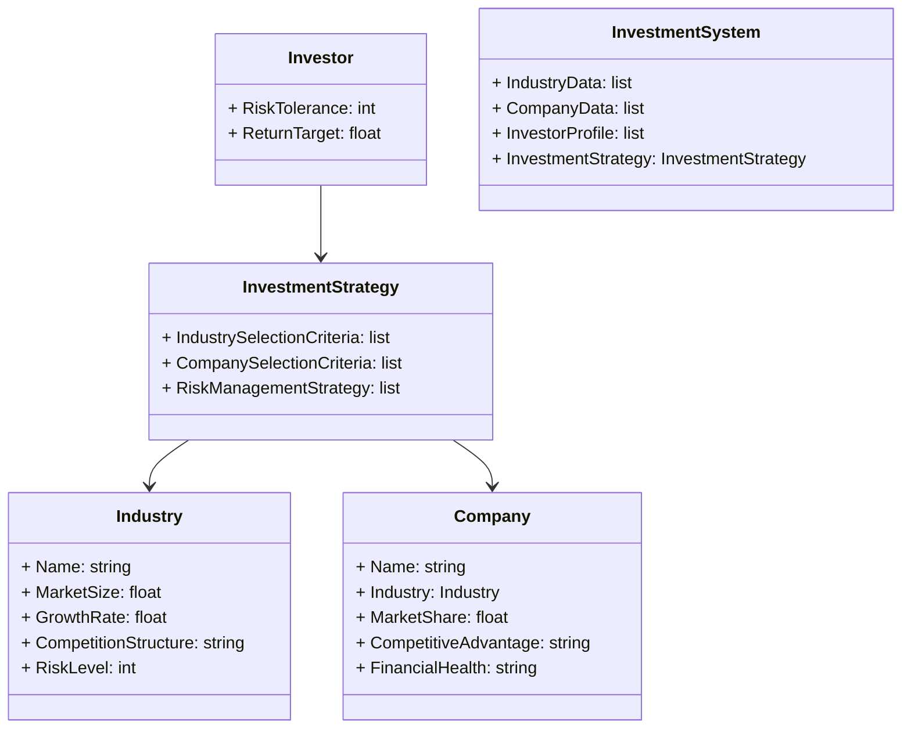
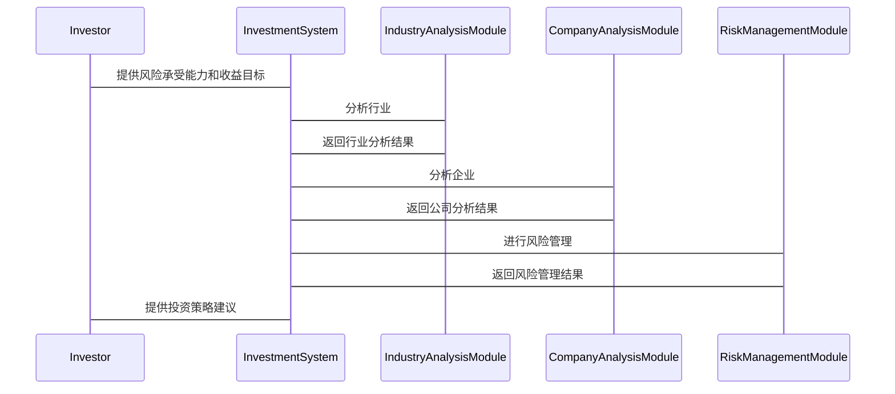

                 


# 彼得林奇的行业选择标准

## 关键词：彼得林奇，行业选择标准，投资策略，行业分析，竞争优势

## 摘要：彼得林奇作为投资大师，提出了系统的行业选择标准。本文详细分析其投资理念、行业分析方法、竞争优势评估、财务状况分析以及风险管理策略，通过实际案例帮助读者掌握这些标准，并指导投资决策。

---

## 第1章：彼得林奇投资理念与行业分析基础

### 1.1 彼得林奇投资理念概述

#### 1.1.1 投资的核心理念
- **长期投资**：关注企业的长期价值，而非短期市场波动。
- **价值发现**：寻找市场价格低于内在价值的企业。
- **分散投资**：通过投资多个行业和企业降低风险。
- **安全边际**：在价格显著低于内在价值时买入，确保投资的安全性。

#### 1.1.2 行业分析的基本概念
- **行业分析**：研究行业内的企业结构、竞争状况、市场趋势等因素，评估行业的投资价值。
- **行业生命周期**：分为导入期、成长期、成熟期、衰退期，不同阶段的投资策略不同。
- **行业风险**：包括市场风险、竞争风险、政策风险等，需在分析中识别和评估。

#### 1.1.3 投资者心态与市场认知
- **投资者心态**：理性分析与感性决策的平衡，避免情绪化投资。
- **市场认知**：理解市场的波动性和不确定性，保持独立思考。

### 1.2 行业分析的基本方法

#### 1.2.1 行业分析的定义
- 行业分析：通过研究行业的市场规模、增长潜力、竞争结构、盈利能力等，评估行业的投资价值。

#### 1.2.2 行业分析的关键指标
- **市场规模**：行业的总收入或销售额。
- **增长率**：行业的年增长率，反映行业的发展潜力。
- **竞争结构**：行业内主要企业的市场份额、竞争程度、进入壁垒等。
- **盈利能力**：行业的平均利润率、ROE（净资产收益率）等。

#### 1.2.3 行业分析的步骤与流程
1. **确定分析目标**：明确分析的行业和目的。
2. **收集数据**：通过行业报告、财务报表、市场调研等获取数据。
3. **分析数据**：使用财务指标、竞争分析等方法进行评估。
4. **评估投资价值**：结合行业前景和企业情况，判断投资价值。
5. **制定投资策略**：根据分析结果，制定相应的投资策略。

---

## 第2章：行业前景与市场需求分析

### 2.1 行业前景评估

#### 2.1.1 市场需求的判断
- **需求弹性**：行业产品的需求对价格变化的敏感程度。
- **市场容量**：行业潜在的市场规模，考虑人口、经济、技术等因素。
- **增长潜力**：行业未来几年的增长预期，结合宏观经济趋势。

#### 2.1.2 行业发展趋势的预测
- **技术进步**：行业的技术发展趋势，是否会有颠覆性创新。
- **政策影响**：政府政策对行业的影响，如环保政策、税收优惠等。
- **消费者行为**：消费者偏好变化对行业的影响。

#### 2.1.3 市场容量与增长潜力
- **市场容量计算**：通过人口、消费习惯、价格等因素估算市场规模。
- **增长潜力评估**：分析行业在未来几年的增长率，考虑宏观经济和行业特定因素。

### 2.2 行业生命周期分析

#### 2.2.1 行业生命周期的定义
- **导入期**：行业刚刚出现，市场需求小，竞争者少。
- **成长期**：市场需求快速增长，企业数量增加。
- **成熟期**：市场需求稳定，竞争激烈，市场份额趋于稳定。
- **衰退期**：市场需求下降，企业数量减少，技术或产品逐渐被淘汰。

#### 2.2.2 不同阶段的投资策略
- **导入期**：高风险高回报，适合风险承受能力强的投资者。
- **成长期**：市场需求增长快，适合寻找高增长企业。
- **成熟期**：稳定收益，适合防御性投资。
- **衰退期**：需谨慎，避免投资衰退明显的行业。

#### 2.2.3 生命周期分析的案例
- 案例：假设分析某科技行业，判断其处于成长期还是成熟期，制定相应投资策略。

### 2.3 市场竞争结构分析

#### 2.3.1 竞争格局的评估
- **垄断与寡头竞争**：行业是否由少数几家企业控制。
- **完全竞争**：行业内企业众多，竞争激烈。
- **垄断竞争**：企业之间有差异化产品，但存在一定程度的竞争。

#### 2.3.2 主导企业分析
- **市场份额**：行业内主要企业的市场份额分布。
- **竞争优势**：主导企业的核心竞争力，如品牌、技术、成本优势等。

#### 2.3.3 市场进入壁垒
- **技术壁垒**：行业的技术门槛高低。
- **资金壁垒**：进入行业需要的资金投入。
- **政策壁垒**：政府政策对新进入者的限制。

---

## 第3章：竞争优势与企业分析

### 3.1 企业竞争优势的识别

#### 3.1.1 核心竞争力的定义
- 核心竞争力：企业在行业中长期保持竞争优势的关键因素，如技术、品牌、成本控制等。

#### 3.1.2 企业竞争优势的来源
- **技术优势**：拥有独特的技术或专利。
- **成本优势**：通过规模效应或管理优化降低成本。
- **品牌优势**：强大的品牌影响力吸引消费者。
- **市场网络**：广泛的销售网络和渠道。

#### 3.1.3 竞争优势的持续性评估
- **可持续性分析**：评估竞争优势是否会长期存在，是否会因技术进步或竞争而削弱。

### 3.2 财务状况分析

#### 3.2.1 财务健康状况的评估
- **财务健康状况**：企业的财务状况是否稳健，能否持续盈利。

#### 3.2.2 财务指标的计算与分析
- **盈利能力**：ROE（净资产收益率）、净利率等。
- **偿债能力**：资产负债率、流动比率等。
- **运营效率**：存货周转率、应收账款周转率等。

#### 3.2.3 财务状况与投资决策的关系
- 财务状况良好的企业更具有投资价值，财务状况不佳的企业需谨慎投资。

### 3.3 管理层能力评估

#### 3.3.1 管理层的素质与风格
- **管理团队**：管理层的背景、经验和能力。
- **管理风格**：保守、激进或稳健。

#### 3.3.2 管理层决策的历史案例
- 分析管理层过去的决策，判断其决策能力和风险控制能力。

#### 3.3.3 管理层能力对投资的影响
- 能力强的管理层能带领企业持续发展，提升企业价值。

---

## 第4章：行业风险与投资策略

### 4.1 行业风险的识别与评估

#### 4.1.1 行业风险的定义
- 行业风险：由于行业本身的特性或外部环境变化导致的投资损失风险。

#### 4.1.2 行业风险的来源
- **市场风险**：市场需求下降或波动。
- **竞争风险**：行业内竞争加剧，市场份额被抢占。
- **政策风险**：政府政策变化对企业的影响。
- **技术风险**：技术进步可能导致行业结构变化。

#### 4.1.3 风险评估的方法
- **定性分析**：通过行业报告、专家意见等进行风险评估。
- **定量分析**：通过财务指标、市场数据等进行风险量化。

### 4.2 投资策略的制定

#### 4.2.1 风险与收益的平衡
- **风险承受能力**：根据投资者的风险偏好制定投资策略。
- **收益目标**：设定合理的收益目标，避免过度冒险。

#### 4.2.2 不同市场环境下的策略调整
- **牛市**：积极投资，寻找高增长行业和企业。
- **熊市**：防御性投资，选择稳定行业和企业。

#### 4.2.3 投资组合的构建
- **分散投资**：将资金分散投资于不同行业和企业，降低风险。
- **资产配置**：根据市场环境和个人风险偏好调整资产配置比例。

### 4.3 风险管理与控制

#### 4.3.1 风险分散策略
- 通过投资不同行业和企业分散行业风险。

#### 4.3.2 风险监控机制
- 定期评估投资组合的风险，及时调整策略。

#### 4.3.3 风险应对措施
- 设定止损点，避免重大损失。

---

## 第5章：彼得林奇的防御性投资策略

### 5.1 防御性投资的定义与特点

#### 5.1.1 防御性投资的核心理念
- 防御性投资：在市场下跌时，选择那些能够稳定或增长的企业和行业进行投资，降低投资组合的波动性。

#### 5.1.2 防御性投资的适用场景
- 经济衰退期：选择防御性行业，如公用事业、消费品等。
- 市场下跌期：寻找那些能够稳定收益的企业。

#### 5.1.3 防御性投资与进攻性投资的区别
- 防御性投资注重稳定性和安全性，进攻性投资注重高增长和高回报。

### 5.2 防御性投资的实施步骤

#### 5.2.1 选择防御性行业的标准
- 选择那些需求稳定、受经济波动影响较小的行业。

#### 5.2.2 防御性企业的筛选
- 选择财务稳健、具有强大竞争优势的企业。

#### 5.2.3 防御性投资组合的构建
- 将资金分配到防御性行业和企业，降低整体投资组合的风险。

### 5.3 防御性投资的案例分析

#### 5.3.1 典型防御性行业的选择
- 公用事业：如电力、水务等，需求稳定，受经济波动影响较小。
- 消费品：如食品、日用品等，需求刚性。

#### 5.3.2 防御性投资的成功案例
- 分析某公用事业企业在经济衰退期的表现，证明防御性投资的有效性。

#### 5.3.3 防御性投资的风险与挑战
- 通胀风险：防御性行业可能受通胀影响较大。
- 利率风险：防御性行业的债券可能受利率变化影响。

---

## 第6章：彼得林奇的成长性投资策略

### 6.1 成长性投资的定义与特点

#### 6.1.1 成长性投资的核心理念
- 成长性投资：投资于那些未来具有高增长潜力的企业和行业，追求超额收益。

#### 6.1.2 成长性投资的适用场景
- 经济成长期：选择那些处于成长期的行业和企业。
- 市场上升期：寻找那些能够快速成长的企业。

#### 6.1.3 成长性投资与防御性投资的区别
- 成长性投资注重高增长和高回报，防御性投资注重稳定和安全。

### 6.2 成长性投资的实施步骤

#### 6.2.1 选择高增长行业的标准
- 行业处于成长期，市场需求增长快。
- 行业具有较大的增长潜力，受政策和技术支持。

#### 6.2.2 成长性企业的筛选
- 选择那些具有强大竞争优势、增长潜力大的企业。
- 分析企业的财务指标，如ROE、收入增长率等。

#### 6.2.3 成长性投资组合的构建
- 将资金分配到高增长行业和企业，追求超额收益。

### 6.3 成长性投资的案例分析

#### 6.3.1 典型成长性行业的选择
- 科技行业：如半导体、人工智能等领域，技术进步快，市场需求大。
- 新兴行业：如电动汽车、 renewable energy等，未来增长潜力大。

#### 6.3.2 成长性投资的成功案例
- 分析某科技企业在成长期的表现，证明成长性投资的有效性。

#### 6.3.3 成长性投资的风险与挑战
- 市场波动风险：成长性行业和企业在市场波动中可能大幅波动。
- 周期性风险：某些成长性行业可能受经济周期影响较大。

---

## 第7章：系统分析与架构设计方案

### 7.1 问题场景介绍

#### 7.1.1 投资者面临的挑战
- 市场波动大，信息复杂，难以准确判断行业和企业价值。
- 投资者需要系统化的方法来选择行业和企业。

### 7.2 项目介绍

#### 7.2.1 项目目标
- 开发一个基于彼得林奇行业选择标准的投资分析系统，帮助投资者系统化地选择行业和企业。

### 7.3 系统功能设计

#### 7.3.1 领域模型（Mermaid类图）


#### 7.3.2 系统架构设计（Mermaid架构图）
```mermaid
container InvestmentAnalysisSystem {
    Investor Interface
    Industry Analysis Module
    Company Analysis Module
    Risk Management Module
    Database
    Results Display Module
}
```

#### 7.3.3 系统接口设计
- **投资者输入**：投资者输入风险承受能力和收益目标。
- **数据输入**：行业和企业的数据输入，包括市场规模、增长率、竞争结构等。
- **分析模块调用**：系统调用行业分析、公司分析和风险管理模块进行分析。
- **结果输出**：系统输出行业和企业的分析结果，以及投资策略建议。

#### 7.3.4 系统交互（Mermaid序列图）


### 7.4 项目实战

#### 7.4.1 环境安装
- **工具安装**：安装Mermaid、Python、Jupyter Notebook等工具。
- **数据获取**：获取行业和企业的数据，如市场规模、财务指标等。

#### 7.4.2 核心实现源代码

```python
import pandas as pd
import numpy as np

# 定义行业分析函数
def industry_analysis(industry_data):
    industry_df = pd.DataFrame(industry_data)
    # 计算行业增长率
    growth_rate = (industry_df['MarketSize'].pct_change() * 100).mean()
    # 计算行业平均利润率
    average_profit_margin = industry_df['NetProfit'].mean() / industry_df['Revenue'].mean() * 100
    return {
        '平均增长率': growth_rate,
        '平均利润率': average_profit_margin
    }

# 定义企业分析函数
def company_analysis(company_data):
    company_df = pd.DataFrame(company_data)
    # 计算ROE
   roe = (company_df['NetProfit'] / company_df['Equity']).mean() * 100
    # 计算收入增长率
    revenue_growth = (company_df['Revenue'].pct_change() * 100).mean()
    return {
        '平均ROE': roe,
        '平均收入增长率': revenue_growth
    }

# 定义风险管理函数
def risk_management(risk_level):
    if risk_level >= 70:
        return "高风险"
    elif 30 <= risk_level < 70:
        return "中风险"
    else:
        return "低风险"

# 示例数据
industry_data = [
    {'Name': '科技', 'MarketSize': 1000, 'GrowthRate': 15, 'CompetitionStructure': '垄断竞争', 'RiskLevel': 60},
    {'Name': '消费品', 'MarketSize': 800, 'GrowthRate': 10, 'CompetitionStructure': '完全竞争', 'RiskLevel': 40}
]

company_data = [
    {'Name': '公司A', 'Industry': '科技', 'MarketShare': 30, 'CompetitiveAdvantage': '技术创新', 'FinancialHealth': '良好'},
    {'Name': '公司B', 'Industry': '消费品', 'MarketShare': 25, 'CompetitiveAdvantage': '品牌优势', 'FinancialHealth': '优秀'}
]

# 行业分析
industry_result = industry_analysis(industry_data)
print(f"行业平均增长率：{industry_result['平均增长率']}%, 平均利润率：{industry_result['平均利润率']}%")

# 企业分析
company_result = company_analysis(company_data)
print(f"公司平均ROE：{company_result['平均ROE']}%, 平均收入增长率：{company_result['平均收入增长率']}%")

# 风险管理
risk_level = 60
risk Assessment = risk_management(risk_level)
print(f"行业风险评估：{risk Assessment}")
```

#### 7.4.3 代码应用解读与分析
- **行业分析函数**：计算行业的平均增长率和平均利润率，帮助投资者评估行业的增长潜力和盈利能力。
- **企业分析函数**：计算企业的平均ROE和收入增长率，评估企业的盈利能力和成长潜力。
- **风险管理函数**：根据行业风险等级，评估投资风险，并给出相应的风险管理建议。

#### 7.4.4 实际案例分析
- **案例分析**：假设分析某科技行业和消费品行业的市场数据，计算行业的平均增长率和利润率，分析企业的ROE和收入增长率，评估行业和企业的投资价值，并制定相应的投资策略。

#### 7.4.5 项目小结
- 通过系统化的分析，投资者可以更科学地选择行业和企业，制定合适的投资策略，降低投资风险，提高投资收益。

---

## 第8章：最佳实践与小结

### 8.1 最佳实践 Tips

#### 8.1.1 投资者心态管理
- 保持冷静，避免情绪化决策。
- 长期投资，避免频繁交易。

#### 8.1.2 行业选择标准的应用
- 结合行业分析和企业分析，选择具有竞争优势和良好财务状况的企业。
- 定期评估投资组合，根据市场变化调整策略。

#### 8.1.3 风险管理的重要性
- 设置止损点，控制投资风险。
- 分散投资，降低行业和企业的集中风险。

### 8.2 小结

彼得林奇的行业选择标准为投资者提供了一套系统化的方法来选择行业和企业。通过分析行业前景、竞争优势、财务状况和管理层能力，投资者可以更好地评估行业的投资价值。同时，防御性投资和成长性投资策略帮助投资者在不同市场环境下制定合适的投资策略。通过系统化的分析和科学的决策，投资者可以在复杂的市场环境中实现稳健的投资收益。

---

## 作者：AI天才研究院/AI Genius Institute & 禅与计算机程序设计艺术 /Zen And The Art of Computer Programming

