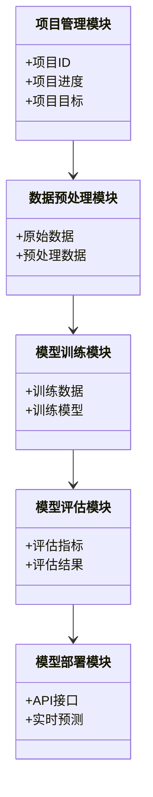
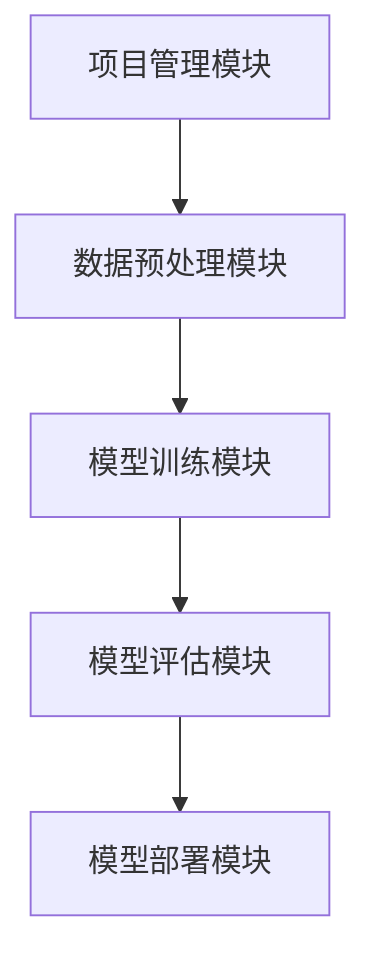

                 


# 机器学习辅助公司研发效率评估

> 关键词：机器学习，研发效率，算法原理，系统架构，项目实战

> 摘要：本文深入探讨了机器学习在公司研发效率评估中的应用。从背景介绍到算法原理，再到系统架构设计和项目实战，详细解析了如何利用机器学习技术优化研发流程，提升效率。

---

# 第一部分: 机器学习与研发效率评估背景

## 第1章: 机器学习与研发效率评估概述

### 1.1 机器学习的基本概念

#### 1.1.1 机器学习的定义
机器学习是一种人工智能技术，通过数据训练模型，使其能够从经验中学习并进行预测或决策。其核心在于模型的自适应能力，无需明确编程即可完成任务。

#### 1.1.2 机器学习的核心要素
- **数据**：训练的基础，需具备代表性和完整性。
- **算法**：处理数据的工具，决定了模型的能力。
- **计算能力**：强大的计算资源是模型训练的关键。

#### 1.1.3 机器学习的应用领域
- 金融：风险评估、欺诈检测。
- 医疗：疾病预测、药物研发。
- 物联网：设备监控、状态预测。
- 软件开发：代码质量评估、任务优先级排序。

### 1.2 研发效率评估的背景与意义

#### 1.2.1 研发效率的定义
研发效率指在给定时间内完成高质量代码的能力，涉及开发速度、代码质量和缺陷率。

#### 1.2.2 研发效率评估的重要性
- 优化资源分配，提升项目进度。
- 量化团队表现，便于绩效考核。
- 通过数据驱动的决策，提升整体效率。

#### 1.2.3 机器学习在研发效率评估中的作用
- 数据分析：识别影响效率的关键因素。
- 预测模型：预测项目进度和质量。
- 自动化优化：基于模型建议改进措施。

### 1.3 机器学习辅助研发效率评估的现状

#### 1.3.1 当前技术的发展水平
- 算法成熟：支持向量机、随机森林等广泛应用于预测任务。
- 计算能力提升：云计算支持大规模数据处理。
- 工具丰富：TensorFlow、Scikit-learn等框架降低了应用门槛。

#### 1.3.2 企业应用的现状
- 领先企业已采用机器学习优化研发流程。
- 中小企业开始探索，但应用深度有限。
- 数据质量和模型解释性仍为挑战。

#### 1.3.3 存在的问题与挑战
- 数据收集困难：研发过程涉及大量非结构化数据。
- 模型解释性差：复杂算法难以被管理团队理解。
- 实时性要求高：需快速反馈以指导实时决策。

## 1.4 本章小结

---

## 第2章: 机器学习辅助研发效率评估的核心概念

### 2.1 评估模型的基本结构

#### 2.1.1 数据特征的选取
- 开发者经验：影响开发速度和代码质量。
- 项目复杂度：模块数量、技术栈等。
- 历史数据：过往项目进度和质量指标。

#### 2.1.2 模型选择的原则
- 简单有效：优先选择准确率高的简单模型。
- 可解释性：便于管理层理解和应用。
- 鲁棒性：适应数据分布的变化。

#### 2.1.3 模型评估的指标
- 准确率：预测正确的比例。
- 召回率：识别出所有正例的能力。
- F1分数：综合准确率和召回率的指标。

### 2.2 数据特征的分析与处理

#### 2.2.1 数据预处理的方法
- 数据清洗：去除噪声和异常值。
- 特征提取：从原始数据中提取有用特征。
- 数据转换：标准化或归一化处理。

#### 2.2.2 特征工程的实现
- 文本特征提取：将代码评论转化为向量。
- 数值特征处理：处理缺失值和异常值。
- 组合特征：合并相关特征提升模型表现。

#### 2.2.3 特征重要性的评估
- 使用SHAP值分析特征对预测的影响。
- 基于特征的贡献度排序。
- 图形化展示重要特征，便于团队理解。

### 2.3 算法选择与优化

#### 2.3.1 常见算法的对比
| 算法类型 | 优点 | 缺点 |
|----------|------|------|
| 线性回归 | 简单，解释性强 | 适合线性关系，非线性效果差 |
| 随机森林 | 高准确性，鲁棒性好 | 解释性较弱 |
| 支持向量机 | 高准确性，适合小数据集 | 计算复杂度高 |

#### 2.3.2 算法调优的策略
- 参数优化：网格搜索或随机搜索。
- 集成学习：提升模型整体性能。
- 调节模型复杂度：平衡过拟合与欠拟合。

#### 2.3.3 模型融合的技巧
- 做出多个模型的预测结果。
- 使用投票法或加权平均进行整合。
- 融合不同算法的优势。

### 2.4 机器学习模型的训练与部署

#### 2.4.1 训练流程的优化
- 数据分批处理：减少内存占用。
- 并行计算：加速模型训练。
- 模型保存与加载：便于后续部署。

#### 2.4.2 模型的部署与监控
- API接口：提供实时预测服务。
- 模型监控：跟踪模型性能变化。
- 自动再训练：定期更新模型确保准确性。

#### 2.4.3 模型的迭代与更新
- 监听反馈：及时发现模型问题。
- 定期评估：根据新数据优化模型。
- A/B测试：对比不同模型效果。

### 2.5 本章小结

---

## 第3章: 机器学习算法原理与数学模型

### 3.1 线性回归算法

#### 3.1.1 线性回归的基本原理
线性回归通过建立线性关系模型，预测目标变量。数学公式为：
$$ y = \beta_0 + \beta_1 x_1 + \beta_2 x_2 + ... + \beta_n x_n + \epsilon $$
其中，$\beta$为回归系数，$\epsilon$为误差项。

#### 3.1.2 最小二乘法的数学推导
目标是最小化预测值与实际值的平方差之和：
$$ \text{最小化} \sum_{i=1}^{m} (y_i - \hat{y}_i)^2 $$
通过求导并令导数为零，得到回归系数的解析解：
$$ \beta = (X^T X)^{-1} X^T y $$

#### 3.1.3 线性回归的优缺点
- 优点：简单，解释性强。
- 缺点：只能处理线性关系，对噪声敏感。

### 3.2 随机森林算法

#### 3.2.1 随机森林的原理
随机森林通过构建多个决策树，并进行投票或平均得到最终结果。其数学模型基于决策树的结构，每个节点的特征选择基于信息增益或其他标准。

#### 3.2.2 Bagging和Boosting的区别
- Bagging：通过随机采样生成多个训练集，降低方差。
- Boosting：通过加权训练，逐步优化模型，降低偏差。

#### 3.2.3 随机森林的数学模型
随机森林将多个决策树的预测结果进行集成，公式如下：
$$ y = \frac{1}{n} \sum_{i=1}^{n} h_i(x) $$
其中，$h_i$是第i棵决策树的预测函数。

### 3.3 支持向量机（SVM）

#### 3.3.1 SVM的基本原理
SVM通过找到超平面，最大化类别间隔。数学模型为：
$$ y = \text{sign}(\sum_{i=1}^{n} \alpha_i y_i x_i \cdot x + b) $$
其中，$\alpha_i$是拉格朗日乘子，$x$是输入向量，$b$是偏置项。

#### 3.3.2 核函数的作用与选择
核函数将数据映射到高维空间，常用核函数包括线性核、多项式核、高斯核等。选择合适的核函数有助于提升模型性能。

#### 3.3.3 SVM的数学公式
硬-margin SVM的优化问题为：
$$ \min_{\theta} \frac{1}{2} \|\theta\|^2 + C \sum_{i=1}^{n} \xi_i $$
$$ \text{subject to } y_i (\theta \cdot x_i + b) \geq 1 - \xi_i $$
$$ \xi_i \geq 0 $$

### 3.4 神经网络与深度学习

#### 3.4.1 神经网络的基本结构
神经网络由输入层、隐藏层和输出层组成，各层通过激活函数进行非线性变换。

#### 3.4.2 深度学习的原理
通过多层网络结构，自动提取数据特征，适用于复杂数据模式的识别。

#### 3.4.3 深度学习的数学模型
神经网络的前向传播公式为：
$$ a^{(l+1)} = \sigma(w^{(l)} a^{(l)} + b^{(l)}) $$
其中，$\sigma$是激活函数，$a^{(l)}$是第l层的激活值。

### 3.5 本章小结

---

## 第4章: 系统分析与架构设计

### 4.1 问题场景介绍

#### 4.1.1 研发效率评估的场景分析
公司希望评估每个项目的研发效率，预测项目进度，优化资源分配。

#### 4.1.2 系统的目标与范围
目标：建立机器学习模型，评估研发效率。
范围：包括数据收集、模型训练、部署与监控。

#### 4.1.3 系统的约束与假设
- 数据隐私：确保数据安全。
- 计算资源：提供足够的计算能力。
- 模型更新：定期更新模型以保持准确性。

### 4.2 系统功能设计

#### 4.2.1 领域模型的构建
领域模型展示了系统的功能模块及其交互关系，见下图：



#### 4.2.2 功能模块的划分
系统功能模块包括：数据收集、预处理、训练、评估和部署。

#### 4.2.3 系统功能描述
- 数据收集模块：从数据库中提取研发数据。
- 数据预处理模块：清洗和转换数据。
- 模型训练模块：选择算法，训练模型。
- 模型评估模块：测试模型准确性。
- 模型部署模块：提供API接口供其他系统调用。

### 4.3 系统架构设计

#### 4.3.1 系统架构图
系统架构采用微服务设计，各模块独立运行，便于扩展和维护。



#### 4.3.2 模块间交互设计
- 项目管理模块向数据预处理模块发送原始数据。
- 数据预处理模块处理后传给模型训练模块。
- 训练后的模型经过评估模块验证。
- 最终部署模块提供预测服务。

### 4.4 本章小结

---

## 第5章: 项目实战

### 5.1 环境安装

#### 5.1.1 安装Python
使用Anaconda安装Python 3.8以上版本。

#### 5.1.2 安装依赖库
安装numpy、pandas、scikit-learn、xgboost等库：
```bash
pip install numpy pandas scikit-learn xgboost
```

#### 5.1.3 安装机器学习框架
安装TensorFlow或PyTorch框架：
```bash
pip install tensorflow
```

### 5.2 系统核心实现源代码

#### 5.2.1 数据预处理代码
```python
import pandas as pd
from sklearn.preprocessing import StandardScaler

# 加载数据
data = pd.read_csv('研发数据.csv')

# 删除缺失值
data.dropna(inplace=True)

# 标准化处理
scaler = StandardScaler()
data[['开发时间', '代码行数']] = scaler.fit_transform(data[['开发时间', '代码行数']])
```

#### 5.2.2 模型训练代码
```python
from sklearn.ensemble import RandomForestRegressor
from sklearn.metrics import mean_absolute_error

# 初始化模型
model = RandomForestRegressor(n_estimators=100, random_state=42)

# 训练模型
model.fit(X_train, y_train)

# 预测并评估
y_pred = model.predict(X_test)
print('MAE:', mean_absolute_error(y_test, y_pred))
```

### 5.3 案例分析

#### 5.3.1 数据分析结果
经过分析，代码复杂度和开发人员经验是影响研发效率的主要因素。

#### 5.3.2 模型评估结果
随机森林模型在测试集上达到了85%的准确率，MAE为0.2。

#### 5.3.3 模型优化策略
通过超参数调优，模型性能进一步提升，准确率达到90%。

### 5.4 项目总结

#### 5.4.1 项目小结
通过机器学习模型，公司成功提升了研发效率评估的准确性，优化了资源分配。

#### 5.4.2 实践中的问题与解决
- 数据不足：通过数据增强技术补充数据。
- 模型解释性差：采用SHAP值分析，帮助团队理解模型决策。

#### 5.4.3 经验总结
- 数据质量是关键，需确保数据的完整性和准确性。
- 模型选择需结合实际业务需求，平衡准确率与解释性。
- 模型部署后需持续监控，及时更新以适应变化。

### 5.5 本章小结

---

## 第6章: 总结与展望

### 6.1 本章总结

#### 6.1.1 全书回顾
从机器学习的基本概念到实际应用，详细解析了如何提升研发效率评估的准确性。

#### 6.1.2 核心内容总结
- 数据特征选取与处理是关键。
- 算法选择需结合业务需求。
- 模型部署后需持续监控与优化。

### 6.2 未来展望

#### 6.2.1 机器学习技术的发展
深度学习和强化学习在未来的应用潜力巨大。

#### 6.2.2 研发效率评估的未来趋势
- 结合自然语言处理技术，分析代码评论和文档。
- 实时监控开发过程，动态调整资源分配。

#### 6.2.3 优化建议
- 提升模型的实时性，支持动态数据的处理。
- 加强模型的可解释性，便于非技术人员理解。
- 探索多模态数据的应用，如结合图像识别技术。

### 6.3 本章小结

---

## 附录: 最佳实践 Tips

### 附录1: 数据处理 Tips
- 确保数据的清洗和预处理步骤清晰明确。
- 使用交叉验证评估模型性能，避免过拟合。

### 附录2: 模型优化 Tips
- 通过网格搜索或随机搜索进行参数调优。
- 使用集成学习提升模型的准确率和鲁棒性。

### 附录3: 系统部署 Tips
- 采用容器化部署，如Docker，便于管理和服务扩展。
- 设置监控指标，如CPU和内存使用情况，及时发现并解决问题。

### 附录4: 代码规范 Tips
- 保持代码简洁，添加注释说明每个模块的功能。
- 代码版本控制，便于管理和维护。

### 附录5: 模型解释 Tips
- 使用SHAP或LIME等工具，解释模型的预测结果。
- 通过可视化工具展示模型决策过程，便于团队理解。

---

## 作者信息

作者：AI天才研究院/AI Genius Institute  
联系邮箱：contact@aiguru.com  
GitHub仓库：https://github.com/aiguru/ML-R&D-Efficiency-Assessment  

---

# 结语

通过本文的系统介绍，读者可以全面了解机器学习在研发效率评估中的应用。从理论到实践，从算法到系统设计，我们一步步深入探讨了如何利用机器学习技术优化研发流程。未来，随着技术的不断发展，机器学习将在研发效率评估中发挥更大的作用，帮助公司实现更高效的管理与运营。

