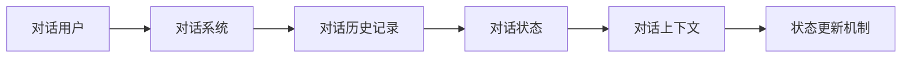
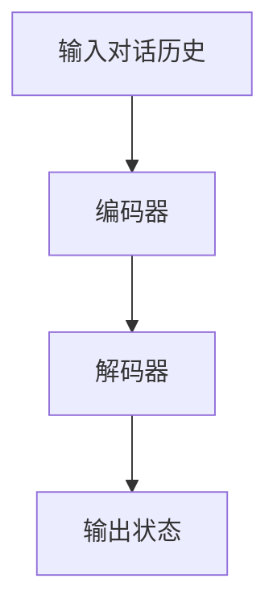
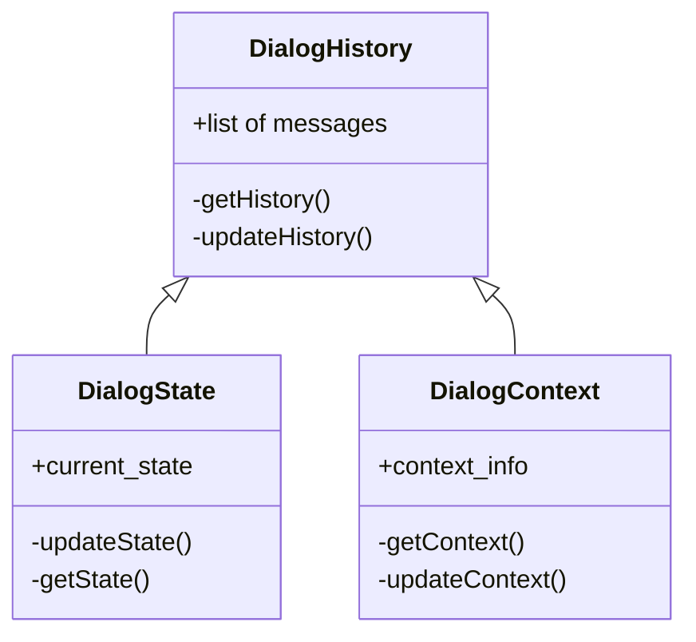
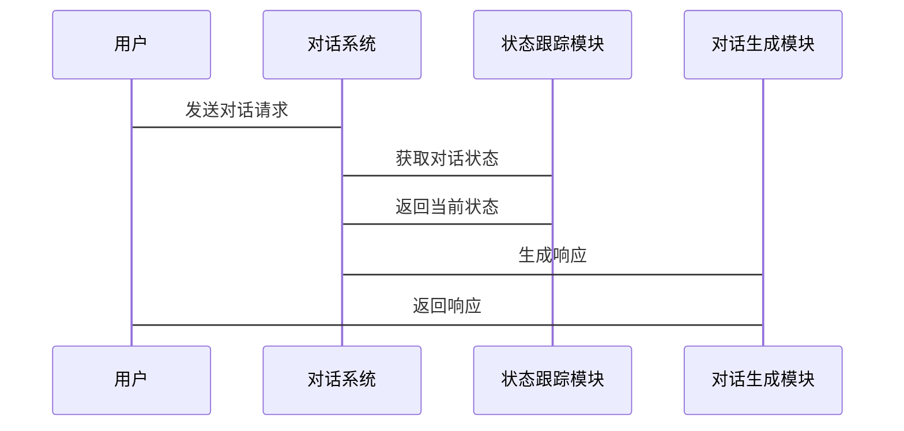

                 


# 《构建AI Agent的多轮对话状态跟踪系统》

## 关键词：
- AI Agent
- 多轮对话
- 状态跟踪
- 对话系统
- 机器学习
- 算法原理
- 系统架构

## 摘要：
多轮对话状态跟踪系统是构建智能对话系统的核心技术之一。本文从背景、核心概念、算法原理、系统架构、项目实战等多方面，详细讲解了如何构建一个高效、准确的多轮对话状态跟踪系统。文章内容丰富，包括对话系统的背景介绍、核心概念的原理分析、算法的数学模型和公式推导、系统架构设计的详细方案以及项目实战的代码实现和案例分析。

---

# 第一部分: 多轮对话状态跟踪系统背景与基础

# 第1章: 多轮对话状态跟踪系统概述

## 1.1 多轮对话状态跟踪的背景与问题背景
### 1.1.1 多轮对话的定义与特点
多轮对话是指在对话过程中，系统与用户之间通过多轮交互完成任务的过程。其特点包括：  
1. **交互性**：对话过程是双向的，用户和系统可以交替发言。  
2. **上下文依赖性**：每一轮对话都依赖于之前的对话内容。  
3. **动态性**：对话的状态会随着每一轮的交互而变化。  

### 1.1.2 状态跟踪在对话系统中的重要性
状态跟踪是对话系统的核心功能之一，它决定了系统是否能够准确理解用户的意图并保持对话的连贯性。  
- 状态跟踪能够帮助系统记住对话的历史信息，从而更好地理解当前用户的意图。  
- 状态跟踪能够为后续的对话生成提供参考，确保对话的逻辑性和一致性。  

### 1.1.3 当前对话系统中的挑战与问题
当前的对话系统在状态跟踪方面面临以下挑战：  
1. **信息丢失**：对话历史中的某些信息可能在后续的对话中被遗忘或忽略。  
2. **上下文理解不足**：系统可能无法准确理解对话中隐含的信息。  
3. **动态更新困难**：对话状态的动态变化使得状态跟踪的算法和模型需要不断更新和优化。  

## 1.2 多轮对话状态跟踪的定义与问题描述
### 1.2.1 对话状态的定义
对话状态是指在对话过程中，系统对当前对话内容的理解和表示。它包括以下三个部分：  
1. **对话历史**：用户和系统之前的所有交互记录。  
2. **当前意图**：用户在当前轮次的意图或需求。  
3. **上下文信息**：与当前对话相关的背景信息。  

### 1.2.2 状态跟踪的目标与意义
状态跟踪的目标是通过分析对话历史，准确地表示和更新对话状态，从而为后续的对话生成提供支持。其意义包括：  
1. 提高对话系统的准确性和流畅性。  
2. 降低对话过程中的误解和歧义。  
3. 为对话系统的优化和改进提供数据支持。  

### 1.2.3 状态跟踪系统的边界与外延
状态跟踪系统的边界包括：  
1. 对话历史的记录和存储。  
2. 对话状态的表示和更新。  
3. 对话上下文的管理与应用。  

其外延包括：  
1. 对话生成模块的输入数据。  
2. 对话评估与优化模块的反馈数据。  

## 1.3 本章小结
本章从背景、定义和问题描述三个方面，全面介绍了多轮对话状态跟踪系统的基本概念和重要性。通过分析对话系统的挑战和状态跟踪的目标，为后续章节的深入探讨奠定了基础。

---

# 第2章: 多轮对话状态跟踪的核心概念与联系

## 2.1 状态跟踪的核心概念原理
### 2.1.1 对话信息抽取
对话信息抽取是状态跟踪的第一步，它需要从对话历史中提取出与当前对话相关的重要信息。  
- **实体识别**：识别对话中的实体信息，如用户的名字、地址等。  
- **意图识别**：识别用户的意图，如查询、预订等。  

### 2.1.2 状态表示方法
状态表示方法是状态跟踪的核心，它决定了如何将对话历史转化为系统能够理解的格式。  
- **向量表示法**：将对话状态表示为一个向量，每个维度对应一个状态特征。  
- **符号表示法**：使用符号或关键词来表示对话状态。  
- **图结构表示法**：使用图结构来表示对话状态之间的关系。  

### 2.1.3 状态更新机制
状态更新机制是指在每一轮对话中，如何根据新的对话内容更新对话状态。  
- **增量更新**：仅更新与新对话内容相关的状态特征。  
- **全量更新**：重新计算整个对话状态。  

## 2.2 核心概念属性特征对比表
以下是核心概念属性特征的对比表：

| 概念 | 属性 | 特征 |
|------|------|------|
| 对话历史 | 时间性 | 顺序性 |
| 状态表示 | 结构性 | 明确性 |
| 更新机制 | 动态性 | 响应性 |

## 2.3 系统实体关系图（Mermaid）
以下是系统实体关系图：



## 2.4 本章小结
本章通过分析对话信息抽取、状态表示方法和状态更新机制，深入探讨了多轮对话状态跟踪的核心概念和原理。通过对比表和关系图，进一步明确了各概念之间的联系和作用。

---

# 第3章: 多轮对话状态跟踪的算法原理

## 3.1 序列到序列模型（Seq2Seq）
### 3.1.1 模型结构
序列到序列模型（Seq2Seq）由编码器（Encoder）和解码器（Decoder）两部分组成。  
- **编码器**：将输入的对话历史转化为一个固定长度的向量。  
- **解码器**：根据编码器输出的向量生成对话状态。  

### 3.1.2 注意力机制
注意力机制是一种用于序列到序列模型的关键技术，它能够帮助模型关注输入序列中的重要部分。  
- **注意力计算**：通过计算输入序列中每个位置的权重，生成一个加权向量。  
- **注意力应用**：将加权向量与解码器的输出进行结合，生成最终的对话状态。  

### 3.1.3 解码器端的处理
解码器端的处理包括：  
1. 初始化解码器的状态。  
2. 根据编码器输出的向量和注意力机制生成对话状态。  

## 3.2 基于Transformer的对话状态跟踪算法
### 3.2.1 Transformer模型简介
Transformer模型是一种基于深度学习的模型，由编码器和解码器组成。它通过自注意力机制和前馈网络实现序列的编码和解码。  

### 3.2.2 多头注意力机制
多头注意力机制是一种改进的注意力机制，它能够同时关注输入序列的不同部分。  
- **多头注意力计算**：将输入序列分成多个子序列，分别计算注意力权重。  
- **多头注意力合并**：将多个子序列的注意力结果进行合并，生成最终的注意力向量。  

### 3.2.3 前向网络处理
前向网络用于将注意力结果转化为最终的对话状态。  
- **前向网络结构**：由多个全连接层和激活函数组成。  
- **前向网络输出**：生成最终的对话状态向量。  

## 3.3 算法流程图（Mermaid）
以下是算法流程图：



## 3.4 算法实现代
以下是算法的Python代码实现：

```python
import torch
import torch.nn as nn
import torch.nn.functional as F

class Seq2Seq(nn.Module):
    def __init__(self, input_size, hidden_size):
        super(Seq2Seq, self).__init__()
        self.encoder = nn.LSTM(input_size, hidden_size, batch_first=True)
        self.decoder = nn.LSTM(hidden_size, input_size, batch_first=True)

    def forward(self, x):
        # 编码器
        encoded, _ = self.encoder(x)
        # 解码器
        decoded, _ = self.decoder(encoded)
        return decoded

# 定义输入
input_size = 10
hidden_size = 20
batch_size = 5
x = torch.randn(batch_size, 10, input_size)

# 初始化模型
model = Seq2Seq(input_size, hidden_size)
# 前向传播
output = model(x)
print(output.shape)  # 输出形状：(batch_size, seq_len, input_size)
```

## 3.5 本章小结
本章详细介绍了序列到序列模型和基于Transformer的对话状态跟踪算法。通过公式推导和代码实现，深入探讨了算法的原理和实现细节。通过分析多头注意力机制和前向网络处理，进一步明确了算法的核心思想和优化方向。

---

# 第4章: 多轮对话状态跟踪系统的架构设计

## 4.1 问题场景介绍
本章将从实际应用的角度出发，介绍多轮对话状态跟踪系统的架构设计。通过分析对话系统的功能需求和技术挑战，提出一个高效的系统架构设计方案。

## 4.2 系统功能设计
### 4.2.1 领域模型（Mermaid 类图）
以下是领域模型类图：



### 4.2.2 系统架构设计（Mermaid 架构图）
以下是系统架构设计图：


## 4.3 系统接口设计
### 4.3.1 接口定义
- **输入接口**：接收用户的对话请求。  
- **输出接口**：返回对话系统的响应。  
- **状态更新接口**：更新对话状态。  

### 4.3.2 接口协议
- **HTTP协议**：用于前端与后端的交互。  
- **WebSocket协议**：用于实时对话的长连接。  

## 4.4 系统交互流程（Mermaid 序列图）
以下是系统交互流程图：



## 4.5 本章小结
本章从实际应用的角度出发，详细介绍了多轮对话状态跟踪系统的架构设计。通过领域模型类图、系统架构设计图和交互流程图，明确了系统各部分的功能和交互关系。

---

# 第5章: 项目实战——构建一个多轮对话状态跟踪系统

## 5.1 环境安装与配置
### 5.1.1 安装依赖
- **Python**：3.6+
- **PyTorch**：1.9+
- **Numpy**：1.21+
- **Mermaid**：用于绘制图表  
  ```bash
  pip install mermaid
  ```

## 5.2 核心代码实现
### 5.2.1 对话历史记录模块
```python
class DialogHistory:
    def __init__(self):
        self.history = []

    def add_message(self, message):
        self.history.append(message)

    def get_history(self):
        return self.history
```

### 5.2.2 状态跟踪模块
```python
class DialogStateTracker:
    def __init__(self):
        self.current_state = {}

    def update_state(self, new_state):
        self.current_state.update(new_state)

    def get_state(self):
        return self.current_state
```

### 5.2.3 对话生成模块
```python
class DialogGenerator:
    def __init__(self, model):
        self.model = model

    def generate_response(self, input_text):
        # 输入文本处理
        # 调用模型生成响应
        response = self.model.generate(input_text)
        return response
```

## 5.3 案例分析与系统优化
### 5.3.1 案例分析
通过一个具体的对话案例，分析系统的运行流程和状态跟踪过程。  
- **输入对话历史**：用户：你好，我叫张三。  
- **系统处理**：更新对话状态，将用户姓名设置为“张三”。  
- **输出状态**：当前状态：`{"name": "张三"}`  

### 5.3.2 系统优化
通过分析系统的运行情况，提出优化建议：  
1. **状态更新频率**：根据对话的实时性调整状态更新的频率。  
2. **状态表示方式**：尝试不同的状态表示方法，选择最优的表示方式。  
3. **算法优化**：改进算法模型，提高对话状态跟踪的准确性和效率。  

## 5.4 本章小结
本章通过项目实战，详细讲解了如何构建一个多轮对话状态跟踪系统。通过代码实现和案例分析，进一步巩固了理论知识，同时提出了系统的优化建议。

---

# 第6章: 总结与展望

## 6.1 本章总结
本章总结了全文的主要内容，包括多轮对话状态跟踪系统的背景、核心概念、算法原理、系统架构和项目实战。通过理论与实践的结合，全面介绍了如何构建一个高效、准确的多轮对话状态跟踪系统。

## 6.2 未来研究方向
未来的研究方向包括：  
1. **算法优化**：进一步改进对话状态跟踪算法，提高系统的准确性和效率。  
2. **多模态对话**：结合图像、视频等多种模态信息，提升对话系统的智能化水平。  
3. **跨语言对话**：研究多语言对话状态跟踪技术，支持多种语言的对话交互。  
4. **边缘计算**：将对话状态跟踪技术应用于边缘计算环境，提升系统的实时性和响应速度。  

## 6.3 注意事项
在实际应用中，需要注意以下几点：  
1. **数据隐私**：保护用户对话数据的隐私和安全。  
2. **系统稳定性**：确保系统的稳定运行，避免因系统故障导致对话中断。  
3. **用户体验**：注重用户体验，提升对话系统的友好性和智能化水平。  

## 6.4 本章小结
本章总结了全文的主要内容，并展望了未来的研究方向。通过注意事项的提出，为读者提供了实践中的重要参考。

---

# 作者：AI天才研究院/AI Genius Institute & 禅与计算机程序设计艺术 /Zen And The Art of Computer Programming

