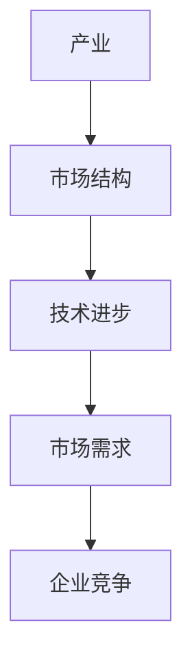
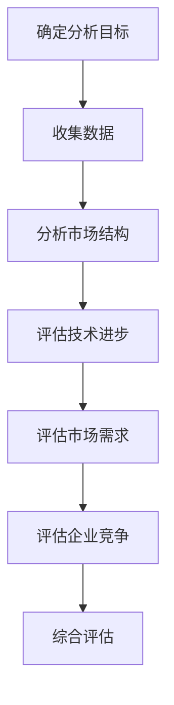
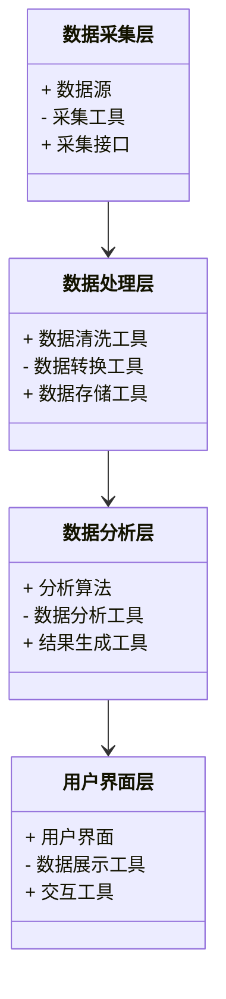
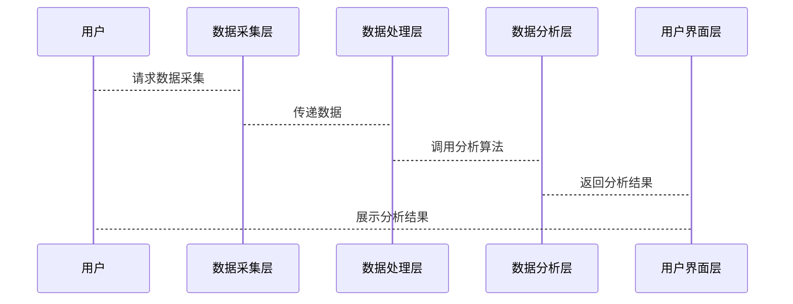

                 


# 菲利普费雪的产业分析框架

> 关键词：产业分析框架，菲利普费雪，成长投资，市场结构，技术进步，企业竞争

> 摘要：本文详细介绍了菲利普费雪的产业分析框架，从背景介绍、核心概念到算法原理、系统架构，再到项目实战，全面解读如何通过产业分析来评估投资机会，帮助投资者做出明智决策。

---

# 第一部分: 菲利普·费雪产业分析框架的背景与核心概念

## 第1章: 产业分析框架的背景介绍

### 1.1 产业分析框架的定义与背景

#### 1.1.1 产业分析框架的定义

产业分析框架是一种系统化的方法，用于评估特定产业的市场结构、技术进步、市场需求和企业竞争情况。通过分析这些因素，投资者可以更好地理解产业的潜在机会和风险，从而做出更明智的投资决策。

#### 1.1.2 产业分析框架的背景与问题背景

随着全球经济的快速发展，产业环境变得越来越复杂。投资者需要一种系统化的方法来评估不同产业的潜力。菲利普·费雪的成长投资理念强调通过深入分析企业所在的产业环境来评估投资机会，这为产业分析框架奠定了基础。

#### 1.1.3 产业分析框架的目标与意义

产业分析框架的目标是帮助投资者识别具有高增长潜力的产业，并评估这些产业中的企业竞争力。通过分析市场结构、技术进步、市场需求和企业竞争情况，投资者可以更准确地预测企业的未来表现，从而做出更明智的投资决策。

### 1.2 菲利普·费雪的产业分析框架

#### 1.2.1 菲利普·费雪的成长投资理念

菲利普·费雪是成长投资的倡导者，他认为投资者应该投资于具有持续增长潜力的企业。他强调企业所在产业的健康状况和市场地位对企业成长的重要性。

#### 1.2.2 产业分析框架的核心要素

产业分析框架的核心要素包括：

1. **市场结构**：分析行业的竞争程度，包括市场集中度、主要竞争者等。
2. **技术进步**：评估行业的技术创新速度及其对企业竞争力的影响。
3. **市场需求**：研究行业的产品或服务需求量及其增长趋势。
4. **企业竞争**：分析企业的市场份额、竞争优势和竞争策略。

#### 1.2.3 产业分析框架的边界与外延

产业分析框架的边界包括企业的内部管理、财务状况等因素。其外延则涉及宏观经济环境、政策法规等外部因素，这些因素可能影响产业的整体表现。

### 1.3 产业分析框架的核心概念与联系

#### 1.3.1 核心概念原理

产业分析框架的核心概念包括市场结构、技术进步、市场需求和企业竞争。这些概念相互关联，共同影响企业的成长潜力和投资价值。

#### 1.3.2 核心概念属性特征对比表格

以下是核心概念的属性特征对比表格：

| 概念       | 属性特征                  |
|------------|---------------------------|
| 产业       | 经济活动的基本单位        |
| 市场结构    | 行业内的竞争程度          |
| 技术进步    | 行业的技术创新速度          |
| 市场需求    | 行业的产品或服务需求量      |
| 企业竞争    | 企业的市场份额与竞争力      |

#### 1.3.3 ER实体关系图架构的 Mermaid 流程图



### 1.4 本章小结

本章介绍了产业分析框架的背景、核心要素及其相互关系。通过分析市场结构、技术进步、市场需求和企业竞争，投资者可以更好地评估产业的潜力和企业的竞争力。

---

## 第2章: 菲利普·费雪产业分析框架的核心概念与联系

### 2.1 产业分析框架的核心概念原理

#### 2.1.1 产业的定义与分类

产业是指生产同类商品或服务的企业集合。根据规模和性质，产业可以分为完全竞争、垄断竞争、寡头垄断和完全垄断四种类型。

#### 2.1.2 市场结构的类型与影响

市场结构的类型包括完全竞争、垄断竞争、寡头垄断和完全垄断。不同市场结构对企业定价、竞争策略和利润水平有重要影响。

#### 2.1.3 技术进步对产业的影响

技术进步可以提高生产效率、降低成本，从而增强企业的竞争力。技术创新还可以推动产业升级，创造新的市场机会。

### 2.2 核心概念的属性特征对比

#### 2.2.1 产业与市场的区别与联系

产业是指生产同类商品或服务的企业集合，而市场则是指购买这些商品或服务的消费者群体。两者相互依存，市场的需求直接影响产业的供给。

#### 2.2.2 技术进步与市场需求的关系

技术进步可以满足新的市场需求，或者通过提高产品性能来扩大市场。市场需求则是技术进步的驱动力之一。

#### 2.2.3 企业竞争对市场结构的影响

企业竞争可以通过价格战、产品创新等方式影响市场结构。强大的企业竞争可以促进市场优胜劣汰，推动产业升级。

### 2.3 产业分析框架的 Mermaid 实体关系图


### 2.4 本章小结

本章深入分析了产业分析框架中的核心概念及其相互关系。通过理解产业、市场结构、技术进步、市场需求和企业竞争之间的联系，投资者可以更好地评估产业的潜力和企业的竞争力。

---

## 第3章: 菲利普·费雪产业分析框架的算法原理

### 3.1 产业分析框架的算法原理

#### 3.1.1 产业分析的步骤

产业分析的步骤包括：

1. **确定分析目标**：明确分析的具体目标和范围。
2. **收集数据**：获取相关产业的市场结构、技术进步、市场需求和企业竞争数据。
3. **分析市场结构**：评估行业的竞争程度。
4. **评估技术进步**：分析行业的技术创新情况。
5. **评估市场需求**：研究产品或服务的需求量及其增长趋势。
6. **评估企业竞争**：分析企业的市场份额和竞争优势。
7. **综合评估**：根据分析结果，评估产业的整体投资价值。

#### 3.1.2 产业分析的 Mermaid 流程图



#### 3.1.3 产业分析的数学模型与公式

##### 3.1.3.1 净资产收益率（ROE）计算公式

ROE（净资产收益率）是衡量企业盈利能力的重要指标，计算公式如下：

$$ROE = \frac{\text{净利润}}{\text{净资产}}$$

##### 3.1.3.2 增长率计算公式

增长率用于衡量企业的销售增长速度，计算公式如下：

$$\text{增长率} = \frac{\text{当年销售额} - \text{上一年销售额}}{\text{上一年销售额}}$$

##### 3.1.3.3 市盈率计算公式

市盈率是衡量企业股票价格是否合理的指标，计算公式如下：

$$\text{市盈率} = \frac{\text{股票价格}}{\text{每股收益}}$$

---

### 3.2 产业分析框架的数学模型与公式

#### 3.2.1 投资价值评估模型

投资价值评估模型基于企业的盈利能力、成长性和估值水平。公式如下：

$$\text{投资价值} = \text{ROE} \times \text{增长率} \times \text{市盈率}$$

#### 3.2.2 投资组合优化模型

投资组合优化模型用于确定最优的投资组合，以最大化投资回报并最小化风险。公式如下：

$$\text{最优投资组合} = \argmin_{w} \left( w^T \Sigma w - \lambda w^T \mu \right)$$

其中，\( w \) 是投资权重向量，\( \Sigma \) 是收益波动矩阵，\( \mu \) 是收益均值向量，\( \lambda \) 是风险厌恶系数。

#### 3.2.3 项目风险评估模型

项目风险评估模型用于评估投资项目的风险，公式如下：

$$\text{风险评估} = \sqrt{\text{方差}}$$

其中，方差表示项目收益的波动性。

---

### 3.3 产业分析框架的实现步骤

#### 3.3.1 确定分析目标

明确分析的具体目标和范围，例如分析科技产业的投资潜力。

#### 3.3.2 收集数据

收集科技产业的相关数据，包括市场结构、技术进步、市场需求和企业竞争数据。

#### 3.3.3 分析市场结构

评估科技产业的竞争程度，例如是否属于完全竞争或寡头垄断市场。

#### 3.3.4 评估技术进步

分析科技产业的技术创新情况，例如人工智能和区块链技术的应用。

#### 3.3.5 评估市场需求

研究科技产品或服务的需求量及其增长趋势，例如智能手机的市场需求。

#### 3.3.6 评估企业竞争

分析科技企业的市场份额和竞争优势，例如苹果和谷歌的竞争策略。

#### 3.3.7 综合评估

根据分析结果，评估科技产业的整体投资价值，例如判断是否具备高增长潜力。

---

## 第4章: 菲利普·费雪产业分析框架的系统分析与架构设计

### 4.1 系统分析与架构设计方案

#### 4.1.1 问题场景介绍

本章将介绍如何设计一个基于菲利普·费雪产业分析框架的系统，以帮助投资者进行产业分析和投资决策。

#### 4.1.2 项目介绍

项目名称：菲利普·费雪产业分析系统  
目标：提供一个系统化的工具，帮助投资者进行产业分析和投资决策。  
范围：包括市场结构分析、技术进步评估、市场需求分析和企业竞争评估。

#### 4.1.3 系统功能设计

系统功能设计包括以下几个模块：

1. **市场结构分析模块**：分析行业内的市场集中度和竞争格局。
2. **技术进步评估模块**：评估行业的技术创新情况。
3. **市场需求分析模块**：研究产品或服务的需求量及其增长趋势。
4. **企业竞争评估模块**：分析企业的市场份额和竞争优势。

#### 4.1.4 系统架构设计

系统架构设计包括以下几个部分：

1. **数据采集层**：负责收集市场结构、技术进步、市场需求和企业竞争数据。
2. **数据处理层**：对收集的数据进行清洗、转换和存储。
3. **数据分析层**：使用算法对数据进行分析，生成分析结果。
4. **用户界面层**：提供友好的用户界面，展示分析结果。

#### 4.1.5 系统架构的 Mermaid 类图



#### 4.1.6 系统接口设计

系统接口设计包括以下几个部分：

1. **数据采集接口**：提供API接口，用于从数据源采集数据。
2. **数据分析接口**：提供API接口，用于调用分析算法进行数据处理。
3. **结果展示接口**：提供API接口，用于将分析结果展示给用户。

#### 4.1.7 系统交互的 Mermaid 序列图



---

## 第5章: 菲利普·费雪产业分析框架的项目实战

### 5.1 项目实战：科技产业的产业分析

#### 5.1.1 环境配置

为了进行科技产业的产业分析，首先需要配置以下环境：

1. **数据源**：获取科技产业的相关数据，包括市场结构、技术进步、市场需求和企业竞争数据。
2. **工具安装**：安装数据分析工具，例如Python、Pandas、NumPy等。

#### 5.1.2 核心代码实现

以下是科技产业分析的核心代码实现：

```python
import pandas as pd
import numpy as np

# 数据采集
data = pd.read_csv('technology.csv')

# 数据清洗
data.dropna(inplace=True)
data = data[data['市场结构'] != '未知']

# 数据分析
market_structure = data['市场结构'].value_counts()
technology_progress = data['技术进步'].mean()
market_demand = data['市场需求'].sum()
enterprise_competition = data['企业竞争'].max()

# 结果展示
print("市场结构分布:", market_structure)
print("平均技术进步:", technology_progress)
print("总市场需求:", market_demand)
print("最大企业竞争:", enterprise_competition)
```

#### 5.1.3 代码应用解读与分析

1. **数据采集**：从CSV文件中读取科技产业的数据。
2. **数据清洗**：删除缺失值，并过滤掉市场结构为“未知”的数据。
3. **数据分析**：
   - 计算市场结构的分布情况。
   - 计算技术进步的平均值。
   - 计算市场需求的总和。
   - 计算企业竞争的最大值。
4. **结果展示**：打印分析结果，帮助投资者理解科技产业的市场结构、技术进步、市场需求和企业竞争情况。

#### 5.1.4 实际案例分析

以科技产业为例，分析其市场结构、技术进步、市场需求和企业竞争情况：

1. **市场结构**：科技产业通常属于寡头垄断市场，主要竞争对手有苹果、谷歌、微软等。
2. **技术进步**：科技产业技术创新迅速，例如人工智能和区块链技术的应用。
3. **市场需求**：科技产品需求量大，且增长迅速。
4. **企业竞争**：科技企业之间的竞争激烈，通过技术创新和市场拓展来获取更大的市场份额。

#### 5.1.5 项目小结

通过科技产业的分析，投资者可以更好地理解科技产业的市场结构、技术进步、市场需求和企业竞争情况，从而做出更明智的投资决策。

---

## 第6章: 菲利普·费雪产业分析框架的小结与注意事项

### 6.1 小结

菲利普·费雪的产业分析框架是一种系统化的方法，用于评估特定产业的市场结构、技术进步、市场需求和企业竞争情况。通过分析这些因素，投资者可以更好地理解产业的潜力和企业的竞争力，从而做出更明智的投资决策。

### 6.2 投资中的注意事项

1. **数据的准确性**：确保数据来源可靠，数据准确无误。
2. **模型的适用性**：根据具体产业的特点，选择合适的分析模型和方法。
3. **风险的控制**：在进行投资决策时，注意控制投资风险，避免过度依赖单一产业。

### 6.3 未来趋势与展望

随着科技的不断进步和全球经济的不断发展，产业分析框架将变得更加重要。未来，投资者需要更加关注新兴技术和市场需求的变化，以更好地评估产业的潜力和企业的竞争力。

### 6.4 最佳实践 Tips

1. **持续学习**：保持对新兴技术和产业动态的关注，不断提升自身的分析能力。
2. **多角度分析**：从多个角度进行产业分析，确保分析结果的全面性和准确性。
3. **团队合作**：在进行产业分析时，可以组建团队，共同完成分析任务，提高分析效率和质量。

---

## 作者：AI天才研究院/AI Genius Institute & 禅与计算机程序设计艺术 /Zen And The Art of Computer Programming

---

**摘要**：本文详细介绍了菲利普费雪的产业分析框架，从背景介绍、核心概念到算法原理、系统架构，再到项目实战，全面解读如何通过产业分析来评估投资机会，帮助投资者做出明智决策。

