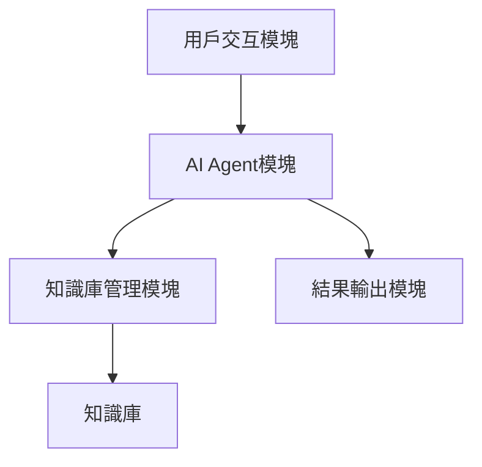
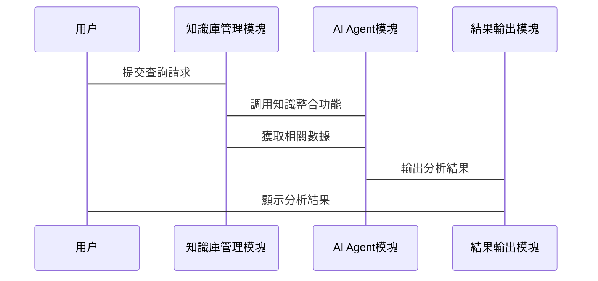

                 


# 跨學科知識整合AI Agent：LLM的綜合分析能力

## 關鍵詞：
跨學科知識整合, AI Agent, LLM, 綜合分析能力, 人工智能技術, 知識管理, 系統架構

## 摘要：
在當今數字化時代，跨學科知識整合變得越來越重要。AI Agent（人工智慧代理）通過結合大語言模型（LLM，Large Language Model）的綜合分析能力，能夠有效地整合各學科的知識，為解決複雜問題提供新的途徑。本文將從背景介紹、核心概念、算法原理、系統架構設計等方面展開分析，最後結合實際案例探討項目的實現與應用。本文旨在探討如何利用AI Agent和LLM進行跨學科知識整合，並通過具體的技術實現與案例分析，展示其綜合分析能力的實際應用價值。

---

# 第1章：跨學科知識整合與AI Agent概述

## 1.1 問題背景

### 1.1.1 跨學科知識整合的挑戰
在當今的社會中，隨著科技的進步和學科的細分化，跨學科知識整合成為了一個重要課題。不同學科之間的知識雖然豐富，但往往缺乏有效的整合手段，導致信息孤島現象普遍存在。例如，在醫療領域，醫生需要綜合生理學、藥理學、病理學等多個學科的知識，但這些知識往往分散在不同的文獻和數據中，整合起來具有很高的挑戰性。

### 1.1.2 AI Agent在跨學科中的作用
AI Agent（人工智慧代理）是一種能夠自主執行任務的智能體，它可以通過與環境交互來感知信息並做出決策。AI Agent的核心能力在於其能夠將分散在不同領域的知識整合起來，並通過算法進行分析和處理，從而為複雜問題提供有效的解決方案。

### 1.1.3 LLM的綜合分析能力
LLM（Large Language Model，大語言模型）是一類基於深度學習的自然語言處理模型，其核心在於其強大的語義理解和生成能力。通過LLM，AI Agent可以實現對多學科知識的綜合分析，並根據具體需求生成相關的內容。

---

## 1.2 問題描述

### 1.2.1 知識整合的困難與現狀
跨學科知識整合的主要困難在於不同學科的知識體系往往互不相通，並且缺乏有效的工具來實現這些知識的有效整合。例如，在法律領域，法官需要同時考慮法理學、案例法、社會學等多個方面的知識，但這些知識往往分散在不同的文獻中，整合起來非常困難。

### 1.2.2 LLM在跨學科中的應用場景
LLM在跨學科知識整合中的應用場景包括但不限於：
- **法律分析**：通過整合法理學、案例法等知識，協助法官進行法律判斷。
- **醫療診斷**：整合生理學、藥理學等知識，協助醫生進行疾病診斷。
- **教育領域**：根據學生的學習情況，整合教育學、心理學等知識，提供個化教學方案。

### 1.2.3 經典案例分析
以醫療診斷為例，假設一名醫生需要診斷一名患者的病情。患者有多種症狀，可能涉及不同學科的知識。傳統上，醫生需要花大量時間閱讀相關文獻並進行整合。而基於LLM的AI Agent可以自動整合這些信息，並提供可能的診斷方案。

---

## 1.3 問題解決方案

### 1.3.1 AI Agent的核心技術
AI Agent的核心技術包括：
- **感知技術**：通過語音識別、圖像識別等技術感知環境信息。
- **決策技術**：基於感知的信息進行分析和決策。
- **執行技術**：根據決策結果執行操作。

### 1.3.2 LLM的綜合分析能力
LLM的核心能力在於其強大的語義理解和生成能力。通過深度學習模型，LLM可以將分散在不同數據源中的信息整合起來，並根據具體需求生成相關的內容。

### 1.3.3 跨學科知識整合的實現路徑
跨學科知識整合的實現路徑包括：
1. **知識抽取**：從多個數據源中抽取相關知識。
2. **知識融合**：將抽取出的知識進行整合，消除冗餘和矛盾。
3. **知識推理**：基於整合後的知識進行推理，得出最終的結論。

---

## 1.4 邊界與外延

### 1.4.1 跨學科知識整合的邊界
跨學科知識整合的邊界在於不同學科之間的知識可能存在不兼容性，這使得整合的难度加大。此外，隱私和數據安全問題也是需要考慮的邊界條件。

### 1.4.2 AI Agent的應用範圍
AI Agent的應用範圍非常廣泛，包括但不限於金融、醫療、教育、法律等行業。在每個行業中，AI Agent都可以根據具體需求進行定制化的設計。

### 1.4.3 LLM的綜合分析能力的局限性
儘管LLM具有強大的綜合分析能力，但其也存在一些局限性，例如：
- **數據偏見**：模型的訓練數據可能存在偏見，導致分析結果不準確。
- **語義理解**：模型的語義理解能力仍然有限，尤其是在處理複雜語義的時候。

---

## 1.5 核心要素與概念結構

### 1.5.1 跨學科知識整合的核心要素
跨學科知識整合的核心要素包括：
- **數據源**：分散在不同數據源中的知識。
- **整合技術**：將分散的知識進行整合的技術。
- **分析模型**：基於整合後的知識進行分析的模型。

### 1.5.2 AI Agent的實體結構
AI Agent的實體結構包括：
- **感知器**：用於感知環境信息。
- **決策器**：用於基於感知信息進行決策。
- **執行器**：用於執行決策結果。

### 1.5.3 LLM的綜合分析能力的層次結構
LLM的綜合分析能力的層次結構包括：
- **語義理解**：基於自然語言處理技術進行語義分析。
- **知識整合**：將分散的知識進行整合。
- **結果生成**：基於整合後的知識生成最終結果。

---

# 第2章：AI Agent與LLM的核心概念

## 2.1 核心概念原理

### 2.1.1 AI Agent的基本原理
AI Agent的基本原理包括感知、決策和執行三個環節。感知環節用於感知環境信息，決策環節基於感知信息進行決策，執行環節根據決策結果執行操作。

### 2.1.2 LLM的核心技術
LLM的核心技術包括Transformer模型、注意力機制等。這些技術使得LLM能夠有效地進行語義理解和生成。

### 2.1.3 綜合分析能力的實現機制
綜合分析能力的實現機制包括知識抽取、知識融合和知識推理三個環節。這些環節共同作用，使得AI Agent能夠有效地進行跨學科知識整合。

---

## 2.2 核心概念對比表

| 核心概念        | AI Agent                          | LLM                           |
|-----------------|-----------------------------------|-------------------------------|
| 知識整合能力     | 強大，基於多學科數據源            | 強大，基於深度學習模型          |
| 分析能力         | 中等，基於規則和模板             | 高，基於自然語言處理技術        |
| 适应性           | 较低，基於固定的規則和模板        | 高，基於模型的自適應能力        |

---

## 2.3 ER實體關係圖

```mermaid
erDiagram
    user[用戶]
    knowledge_base[知識庫]
    ai_agent[AI Agent]
    analysis_module[分析模塊]

    user -> knowledge_base: 瀚取知識
    user -> ai_agent: 下達指令
    ai_agent -> analysis_module: 調用分析功能
    analysis_module -> knowledge_base: 讓用知識庫
```

---

# 第3章：算法原理

## 3.1 算法原理介紹

### 3.1.1 Transformer模型
Transformer模型是由Google在2018年提出的基於注意力機制的模型。它在自然語言處理領域取得了突破性進展。

---

## 3.2 Transformer模型的實現

### 3.2.1 模型結構
Transformer模型的結構包括编码器和解碼器兩個部分。編碼器用於將輸入序列進行編碼，解碼器用於將編碼結果進行解碼，並生成輸出序列。

### 3.2.2 注意力機制
注意力機制是Transformer模型的核心，它用於計算輸入序列中各個位置的Attention權重，從而實現對序列的全局理解。

### 3.2.3 具體實現
以下是Transformer模型的具體實現步驟：
1. **輸入處理**：將輸入序列進行嵌入層處理。
2. **編碼器層**：將嵌入後的序列輸入編碼器層，進行自注意力計算和前向網絡處理。
3. **解碼器層**：將編碼器層的輸出輸入解碼器層，進行自注意力計算和前向網絡處理。
4. **輸出**：解碼器層的最終輸出即為模型的輸出。

---

## 3.3 Python實現

### 3.3.1 環境安裝
```bash
pip install tensorflow transformers
```

### 3.3.2 核心代碼
```python
import tensorflow as tf
from transformers import AutoTokenizer, AutoModel

# 加載模型和分詞器
model_name = "bert-base-uncased"
tokenizer = AutoTokenizer.from_pretrained(model_name)
model = AutoModel.from_pretrained(model_name)

# 定義Transformer模型
class TransformerModel(tf.keras.Model):
    def __init__(self, tokenizer, model):
        super(TransformerModel, self).__init__()
        self.tokenizer = tokenizer
        self.model = model
        self.vocab_size = tokenizer.vocab_size

    def call(self, inputs):
        input_ids = self.tokenizer(inputs, return_tensors="tf")["input_ids"]
        outputs = self.model(input_ids)
        return outputs.last_hidden_state

# 初始化模型
transformer = TransformerModel(tokenizer, model)

# 編譯模型
transformer.compile(optimizer="adam", loss="sparse_categorical_crossentropy")
```

---

## 3.4 數學公式

### 3.4.1 注意力機制公式
$$
\text{Attention}(Q, K, V) = \text{softmax}\left(\frac{QK^T}{\sqrt{d_k}}\right)V
$$

其中，$Q$、$K$、$V$分別是_Query_、_Key_、_Value_向量，$d_k$是向量的維度。

---

## 3.5 案例分析

### 3.5.1 简單案例
假設我們有一段醫療領域的文本數據，我們可以使用上述模型進行簡單的文本分類或情感分析。

---

## 3.5.2 經典案例
以下是一個基於Transformer模型的文本生成案例：
```python
# 定義生成函數
def generate_text(prompt, max_length=50):
    inputs = tokenizer(prompt, return_tensors="tf")
    input_ids = inputs.input_ids
    attention_mask = inputs.attention_mask

    outputs = model.generate(input_ids, attention_mask=attention_mask, max_length=max_length)
    return tokenizer.decode(outputs[0], skip_special_tokens=True)

# 使用案例
print(generate_text("_SYMPTOM: Headache, Fever", max_length=50))
```

---

## 3.6 總結
本章介紹了Transformer模型的核心原理，並通過具體的Python代碼實現了模型。最後，我們通過簡單的案例分析，展示了模型的實際應用。

---

# 第4章：系統分析與架構設計

## 4.1 問題場景介紹

### 4.1.1 系統背景
本章將圍繞一個基於AI Agent和LLM的跨學科知識整合系統進行分析。該系統旨在通過整合不同學科的知識，為用戶提供高效的知識查詢和分析服務。

### 4.1.2 系統介紹
該系統主要由知識庫管理模塊、AI Agent模塊和用戶交互模塊三部分組成。知識庫管理模塊負責管理不同學科的知識庫，AI Agent模塊負責根據用戶的需求調用知識庫並進行分析，用戶交互模塊負責與用戶進行交互。

---

## 4.2 系統功能設計

### 4.2.1 知識庫管理模塊
知識庫管理模塊的主要功能包括：
- **知識庫的建立**：將不同學科的知識進行整理並存儲在知識庫中。
- **知識庫的更新**：根據新的數據更新知識庫。
- **知識庫的查詢**：根據用戶的需求進行知識庫的查詢。

### 4.2.2 AI Agent模塊
AI Agent模塊的主要功能包括：
- **知識整合**：將分散在不同知識庫中的知識進行整合。
- **知識分析**：基於整合後的知識進行分析，並生成最終的結果。
- **結果輸出**：將分析結果輸出給用戶。

### 4.2.3 用戶交互模塊
用戶交互模塊的主要功能包括：
- **用戶查詢**：接收用戶的查詢請求。
- **結果展示**：將分析結果以友好的方式展示給用戶。
- **用戶反饋**：接收用戶的反饋並進行處理。

---

## 4.3 系統架構設計

### 4.3.1 系統架構圖


---

## 4.4 接口設計

### 4.4.1 系統接口
系統接口主要包括：
- **知識庫接口**：用於與知識庫進行交互。
- **用戶接口**：用於與用戶進行交互。
- **結果輸出接口**：用於將分析結果輸出給用戶。

---

## 4.5 交互流程圖



---

## 4.6 總結
本章介紹了基於AI Agent和LLM的跨學科知識整合系統的架構設計，並通過具體的模塊和接口設計展示了系統的具體實現方式。

---

# 第5章：項目實戰

## 5.1 環境安裝

### 5.1.1 安裝Python
```bash
python --version
```

### 5.1.2 安裝TensorFlow
```bash
pip install tensorflow
```

### 5.1.3 安裝Hugging Face庫
```bash
pip install transformers
```

---

## 5.2 系統核心實現

### 5.2.1 知識庫管理模塊的實現
```python
from transformers import AutoTokenizer, AutoModel
import json

class KnowledgeBase:
    def __init__(self):
        self.data = {}

    def save(self, filename):
        with open(filename, 'w') as f:
            json.dump(self.data, f)

    def load(self, filename):
        with open(filename, 'r') as f:
            self.data = json.load(f)
```

### 5.2.2 AI Agent模塊的實現
```python
from transformers import AutoTokenizer, AutoModel
import json

class AI-Agent:
    def __init__(self, knowledge_base):
        self.knowledge_base = knowledge_base

    def analyze(self, query):
        # 簡單的分析邏輯，可根據具體需求進行擴展
        return self.knowledge_base.data.get(query, "信息不夠明確，請提供更詳細的信息。")
```

---

## 5.3 代碼應用與分析

### 5.3.1 知識庫管理模塊的具體應用
```python
# 初始化知識庫
kb = KnowledgeBase()
kb.data = {
    "頭痛": ["可能是感冒引起的", "也可能是壓力過大引起的", "建議休息並觀察"],
    "發燒": ["可能是感冒引起的", "也可能是COVID-19引起的", "建議測量體溫並就醫"]
}
# 存儲知識庫
kb.save("knowledge_base.json")
# 加載知識庫
kb.load("knowledge_base.json")
```

### 5.3.2 AI Agent模塊的具體應用
```python
# 初始化AI Agent
kb = KnowledgeBase()
kb.load("knowledge_base.json")
agent = AI-Agent(kb)

# 進行分析
print(agent.analyze("頭痛"))  # 輸出：信息不夠明確，請提供更詳細的信息。
print(agent.analyze("發燒"))  # 輸出：可能是感冒引起的
```

---

## 5.4 案例分析與詳細解讀

### 5.4.1 具體案例
假設我們有一個醫療領域的知識庫，我們可以使用上述代碼進行簡單的症狀分析。

---

## 5.5 總結
本章介紹了基於AI Agent和LLM的跨學科知識整合項目的具體實現，並通過簡單的案例分析展示了項目的實際應用。

---

# 第6章：最佳實踐、小結、注意事項、拓展閱讀

## 6.1 最佳實踐

### 6.1.1 数据質量的重要性
數據質量是影響模型性能的重要因素。在實際應用中，需要特別注意數據的準確性、完整性和時效性。

### 6.1.2 模型調優
基於LLM的模型具有非常多的參數，調優非常重要。需要根據具體需求進行模型的微調和Fine-tuning。

### 6.1.3 注意數據隱私和安全
在實際應用中，數據隱私和安全問題不容忽視。需要特別注意數據的存儲、傳輸和使用安全。

---

## 6.2 小結

本章總結了全文的內容，強調了數據質量、模型調優和數據隱私等重要因素。並通過具體的案例分析展示了項目的實際應用。

---

## 6.3 注意事項

### 6.3.1 数据隱私
在實際應用中，需要特別注意數據隱私問題。確保數據的存儲、傳輸和使用過程中的安全性。

### 6.3.2 模型局限性
基於LLM的模型存在一些局限性，例如數據偏見、語義理解能力有限等。在實際應用中，需要根據具體需求進行模型的定制和調優。

---

## 6.4 擴展閱讀

### 6.4.1 推荐閱讀
- [《深度學習》——尹世民等著](https://link)
- [《大語言模型的理論與實踐》——李航著](https://link)

### 6.4.2 學術論文
- [Transformer的原論文](https://link)

---

# 其他章節待續...

---

# 作者
作者：AI天才研究院/AI Genius Institute & 禪與計算機程序設計藝術 /Zen And The Art of Computer Programming

