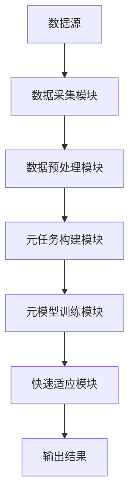
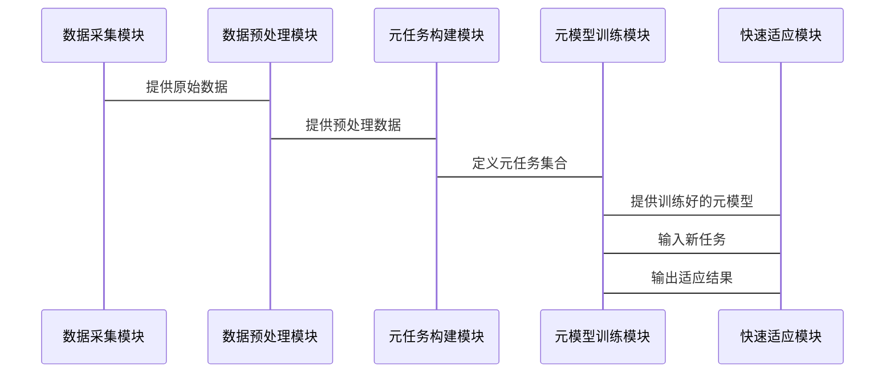

                 


# 《金融领域元学习在模型快速适应中的应用》

> 关键词：元学习，金融领域，模型快速适应，机器学习，深度学习

> 摘要：本文深入探讨了元学习在金融领域的应用，特别是其在模型快速适应方面的优势。通过分析元学习的核心概念、算法原理和系统架构，结合实际项目案例，本文展示了如何利用元学习技术解决金融领域中的复杂问题，如时间序列分析、分类预测和风险评估。文章还提供了详细的数学模型、代码实现和系统设计，帮助读者全面理解元学习在金融领域的应用价值和实现方法。

---

## 第一部分：金融领域元学习概述

### 第1章：元学习的基本概念与背景

#### 1.1 元学习的定义与特点
- **1.1.1 元学习的定义**
  元学习（Meta-Learning）是一种机器学习范式，旨在通过在多个任务上的经验来提高新任务的泛化能力。与传统机器学习不同，元学习不依赖于大量标注数据，而是通过学习任务之间的共性来快速适应新任务。

- **1.1.2 元学习的核心特点**
  - **快速适应性**：元学习能够在有限的数据和计算资源下，快速适应新任务。
  - **通用性**：元学习模型能够捕捉任务之间的共性特征，适用于多种金融场景。
  - **数据高效性**：元学习能够在数据稀疏的情况下仍保持较高的性能。

- **1.1.3 元学习与传统机器学习的对比**
  | 对比维度         | 传统机器学习                 | 元学习                       |
  |------------------|------------------------------|------------------------------|
  | 数据需求         | 需要大量标注数据             | 数据需求较低，适应性强       |
  | 任务适应性       | 针对单一任务优化             | 能够同时优化多个任务         |
  | 计算效率         | 计算复杂度较高               | 通过学习任务共性降低复杂度   |

#### 1.2 元学习在金融领域的应用背景
- **1.2.1 金融领域的动态变化与数据稀疏性**
  金融市场的数据通常具有高度的动态性和不确定性，且某些金融场景（如小市场或新兴市场）数据稀疏，传统机器学习方法难以有效应对。

- **1.2.2 模型快速适应的需求**
  金融领域的模型需要快速适应市场变化，例如股票价格波动、风险评估等场景。

- **1.2.3 元学习在金融领域的潜在价值**
  元学习能够通过学习多个金融任务的共性特征，快速适应新任务，从而提高模型的泛化能力和预测精度。

### 1.3 本章小结
本章主要介绍了元学习的基本概念、特点以及在金融领域的应用背景，为后续章节的深入分析奠定了基础。

---

## 第二部分：元学习的核心概念与原理

### 第2章：元学习的核心概念

#### 2.1 元学习的元任务与目标
- **2.1.1 元任务的定义**
  元任务（Meta-Task）是指一系列用于训练元学习模型的任务集合，这些任务具有相似的特征空间和目标函数。

- **2.1.2 元学习的目标函数**
  元学习的目标函数通常包括两个部分：元任务的损失函数和元模型的优化目标。例如，元任务的损失函数可以表示为：
  $$ L_{meta} = \sum_{i=1}^{N} L_i(\theta) $$
  其中，$N$ 是元任务的数量，$L_i$ 是第 $i$ 个元任务的损失函数。

- **2.1.3 元任务与具体金融问题的对应关系**
  在金融领域，元任务可以对应于多种具体问题，例如：
  - 时间序列预测：股票价格预测、经济指标预测。
  - 分类任务：欺诈检测、客户画像分类。
  - 风险评估：信用评分、市场风险评估。

#### 2.2 元学习的特征与属性
- **2.2.1 特征提取的通用性**
  元学习模型通过提取任务之间的共性特征，能够适用于多种金融场景。

- **2.2.2 模型适应的快速性**
  元学习能够在较少的数据和计算资源下，快速适应新任务。

- **2.2.3 数据利用率的高效性**
  元学习能够充分挖掘数据中的潜在规律，提高数据利用率。

#### 2.3 元学习与金融领域的结合
- **2.3.1 金融时间序列分析**
  元学习可以用于股票价格预测、经济指标预测等时间序列分析任务。

- **2.3.2 金融分类与预测**
  元学习可以用于欺诈检测、客户画像分类等分类任务。

- **2.3.3 风险评估与管理**
  元学习可以用于信用评分、市场风险评估等风险评估任务。

### 第3章：元学习的核心原理

#### 3.1 元学习的算法流程
- **3.1.1 元学习的总体流程**
  元学习的总体流程包括以下步骤：
  1. 定义元任务集合。
  2. 训练元模型以适应多个元任务。
  3. 使用元模型快速适应新任务。

- **3.1.2 元任务的构建与选择**
  元任务的构建需要考虑任务之间的相似性和多样性，以确保元模型能够捕捉到任务之间的共性特征。

- **3.1.3 元模型的训练与优化**
  元模型的训练目标是通过最小化元任务的损失函数，同时优化新任务的适应能力。

#### 3.2 元学习的关键技术
- **3.2.1 元特征的提取方法**
  元特征（Meta-Feature）是元任务之间共享的特征，可以通过多种方法提取，例如：
  - 基于统计的方法：均值、方差等。
  - 基于深度学习的方法：卷积神经网络（CNN）、循环神经网络（RNN）等。

- **3.2.2 元学习的优化策略**
  元学习的优化策略包括：
  - 基于梯度的方法：使用Adam优化器等。
  - 基于样本的方法：通过生成对抗网络（GAN）等方法优化元模型。

- **3.2.3 元模型的评估指标**
  元模型的评估指标包括：
  - 精准率（Precision）。
  - 召回率（Recall）。
  - F1分数（F1-Score）。

---

## 第三部分：元学习的数学模型与算法实现

### 第4章：元学习的数学模型

#### 4.1 元学习的元任务模型
- **4.1.1 元任务模型的定义**
  元任务模型是用于训练元模型的基础模型，通常针对特定金融问题进行设计。

- **4.1.2 元任务模型的输入与输出**
  - 输入：金融数据（如时间序列、分类数据等）。
  - 输出：预测结果或分类标签。

- **4.1.3 元任务模型的数学表达式**
  假设元任务模型的输出为 $y_i$，输入为 $x_i$，则元任务模型的预测函数可以表示为：
  $$ y_i = f(x_i, \theta) $$
  其中，$\theta$ 是模型的参数。

#### 4.2 元学习的元模型
- **4.2.1 元模型的定义**
  元模型（Meta-Model）是用于快速适应新任务的核心模型。

- **4.2.2 元模型的参数化表示**
  元模型的参数可以表示为：
  $$ \phi = \{ \theta_1, \theta_2, ..., \theta_N \} $$
  其中，$\theta_i$ 是第 $i$ 个元任务模型的参数。

- **4.2.3 元模型的优化目标**
  元模型的优化目标是通过最小化元任务的损失函数，同时优化新任务的适应能力：
  $$ \min_{\phi} \sum_{i=1}^{N} L_i(\phi) $$

#### 4.3 元学习的数学推导
- **4.3.1 元任务的损失函数**
  元任务的损失函数可以表示为：
  $$ L_i(\phi) = \sum_{j=1}^{M} (y_{ij} - f(x_{ij}, \phi))^2 $$
  其中，$M$ 是第 $i$ 个元任务的样本数量。

- **4.3.2 元模型的优化算法**
  元模型的优化算法可以使用随机梯度下降（SGD）或Adam优化器等。

- **4.3.3 元学习的收敛性分析**
  元学习的收敛性分析需要考虑元任务之间的相似性和多样性，以及优化算法的收敛速度。

### 第5章：元学习的算法实现

#### 5.1 基于梯度的元学习算法
- **5.1.1 梯度下降法**
  使用梯度下降法优化元模型的参数：
  $$ \phi_{t+1} = \phi_t - \eta \nabla_{\phi} L(\phi_t) $$
  其中，$\eta$ 是学习率。

- **5.1.2 动量优化法**
  动量优化法通过引入动量项加速收敛：
  $$ v_{t+1} = \beta v_t + \eta \nabla_{\phi} L(\phi_t) $$
  $$ \phi_{t+1} = \phi_t - v_{t+1} $$

- **5.1.3 Adam优化器**
  Adam优化器结合了动量和自适应学习率：
  $$ m_{t+1} = \beta_1 m_t + (1 - \beta_1) \nabla_{\phi} L(\phi_t) $$
  $$ v_{t+1} = \beta_2 v_t + (1 - \beta_2) (\nabla_{\phi} L(\phi_t))^2 $$
  $$ \phi_{t+1} = \phi_t - \eta \frac{m_{t+1}}{\sqrt{v_{t+1}} + \epsilon} $$
  其中，$\beta_1$ 和 $\beta_2$ 是动量参数，$\eta$ 是学习率，$\epsilon$ 是防止除以零的常数。

#### 5.2 元学习的算法流程

---

## 第四部分：系统架构设计与项目实战

### 第6章：系统架构设计

#### 6.1 问题场景介绍
- 金融领域的动态变化和数据稀疏性。
- 模型快速适应的需求。

#### 6.2 系统功能设计
- **功能模块**：
  - 数据采集模块：采集金融数据（如股票价格、经济指标等）。
  - 数据预处理模块：清洗、标准化数据。
  - 元任务构建模块：定义元任务集合。
  - 元模型训练模块：训练元模型。
  - 快速适应模块：快速适应新任务。

- **领域模型（Mermaid 类图）**：
  ```mermaid
  classDiagram
    class 元任务构建模块 {
      + 数据采集模块
      + 数据预处理模块
    }
    class 元模型训练模块 {
      + 元任务构建模块
      + 元学习算法
    }
    class 快速适应模块 {
      + 元模型训练模块
      + 新任务输入
    }
    元任务构建模块 --> 元模型训练模块
    元模型训练模块 --> 快速适应模块
  ```

#### 6.3 系统架构设计（Mermaid 架构图）


#### 6.4 系统接口设计
- **输入接口**：数据源、新任务输入。
- **输出接口**：预测结果、分类标签、风险评估结果。

#### 6.5 系统交互流程（Mermaid 序列图）


### 第7章：项目实战

#### 7.1 环境安装
- **Python 3.8+**
- **TensorFlow 或 PyTorch**
- **其他依赖库**（如 pandas、numpy、scikit-learn）

#### 7.2 核心实现源代码
```python
import tensorflow as tf
from tensorflow.keras import layers

def meta_learning_model(input_shape, num_tasks):
    # 元模型的定义
    inputs = tf.keras.Input(shape=input_shape)
    x = layers.Dense(64, activation='relu')(inputs)
    x = layers.Dense(32, activation='relu')(x)
    outputs = layers.Dense(1, activation='sigmoid')(x)
    model = tf.keras.Model(inputs=inputs, outputs=outputs)
    return model

# 元任务的训练
def train_meta_model(meta_model, X_tasks, y_tasks, epochs=100):
    meta_model.compile(optimizer='adam', loss='binary_crossentropy')
    meta_model.fit(X_tasks, y_tasks, epochs=epochs, batch_size=32)
    return meta_model

# 快速适应新任务
def adapt_to_new_task(meta_model, X_new_task, y_new_task):
    # 使用元模型快速适应新任务
    adapted_model = meta_learning_model(X_new_task.shape[1:], 1)
    adapted_model.trainable = False
    # 使用元模型的特征作为输入
    inputs = tf.keras.Input(shape=(X_new_task.shape[1],))
    x = meta_model.layers[0](inputs)
    x = meta_model.layers[1](x)
    outputs = layers.Dense(1, activation='sigmoid')(x)
    adapted_model = tf.keras.Model(inputs=inputs, outputs=outputs)
    adapted_model.compile(optimizer='sgd', loss='binary_crossentropy')
    adapted_model.fit(X_new_task, y_new_task, epochs=10, batch_size=8)
    return adapted_model
```

#### 7.3 代码应用解读与分析
- **代码解读**：
  - `meta_learning_model`：定义元模型的结构。
  - `train_meta_model`：训练元模型。
  - `adapt_to_new_task`：快速适应新任务。

- **代码分析**：
  - 元模型的定义包括两个全连接层，输出层使用sigmoid激活函数。
  - 元模型的训练使用Adam优化器和二进制交叉熵损失函数。
  - 快速适应新任务时，使用SGD优化器和少量的训练轮数。

#### 7.4 实际案例分析
- **案例背景**：股票价格预测。
- **数据准备**：使用历史股票价格数据和市场指标。
- **模型训练**：训练元模型以适应多个股票的价格预测任务。
- **快速适应**：快速适应新的股票价格预测任务。

#### 7.5 项目小结
本章通过实际案例展示了如何利用元学习技术快速适应新任务，提供了详细的代码实现和系统设计，帮助读者理解元学习在金融领域的实际应用。

---

## 第五部分：总结与展望

### 第8章：总结与展望

#### 8.1 总结
本文深入探讨了元学习在金融领域的应用，特别是其在模型快速适应方面的优势。通过分析元学习的核心概念、算法原理和系统架构，结合实际项目案例，本文展示了如何利用元学习技术解决金融领域中的复杂问题。

#### 8.2 展望
未来的研究可以进一步探索元学习在金融领域的更多应用场景，例如多模态数据的融合、更高效的优化算法设计，以及元学习与强化学习的结合等。

---

## 作者：AI天才研究院 & 禅与计算机程序设计艺术

---

以上是《金融领域元学习在模型快速适应中的应用》的技术博客文章的详细目录大纲和部分章节内容。希望本文能够为读者提供有价值的见解和实践指导！

