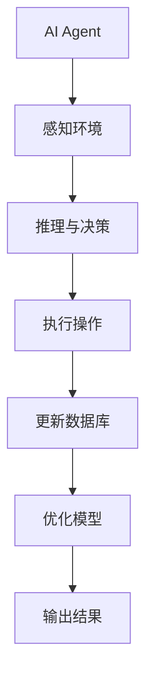
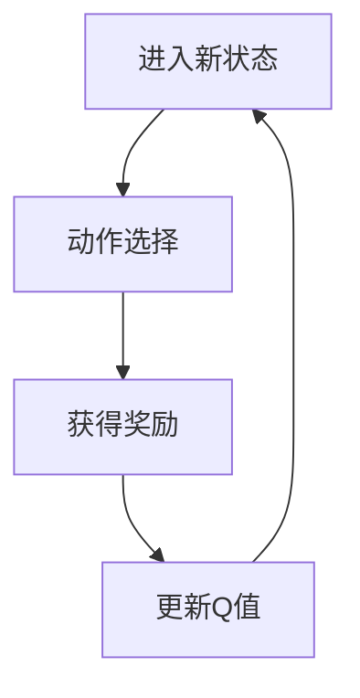
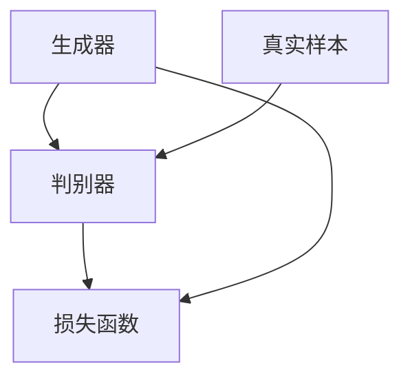
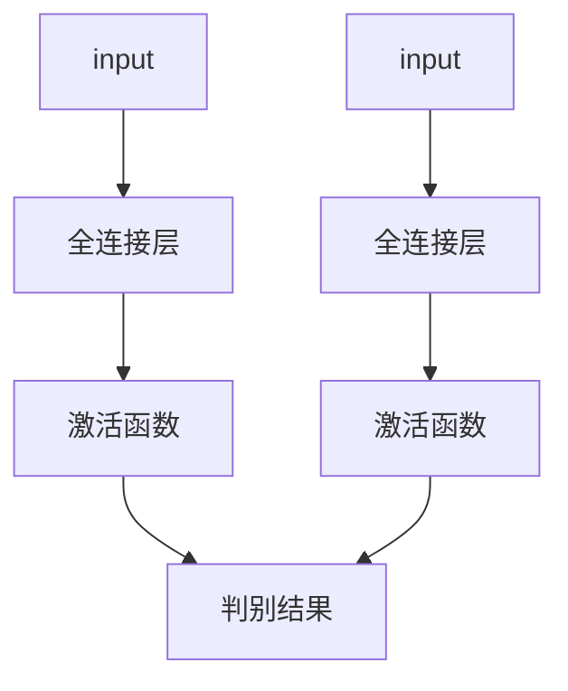
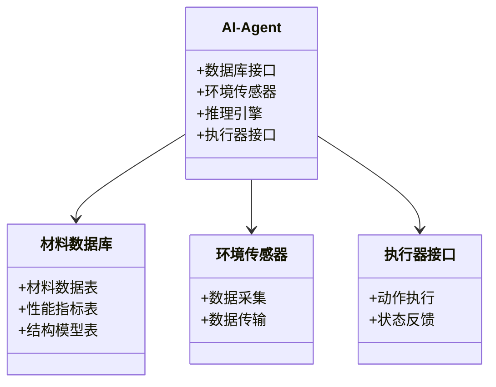
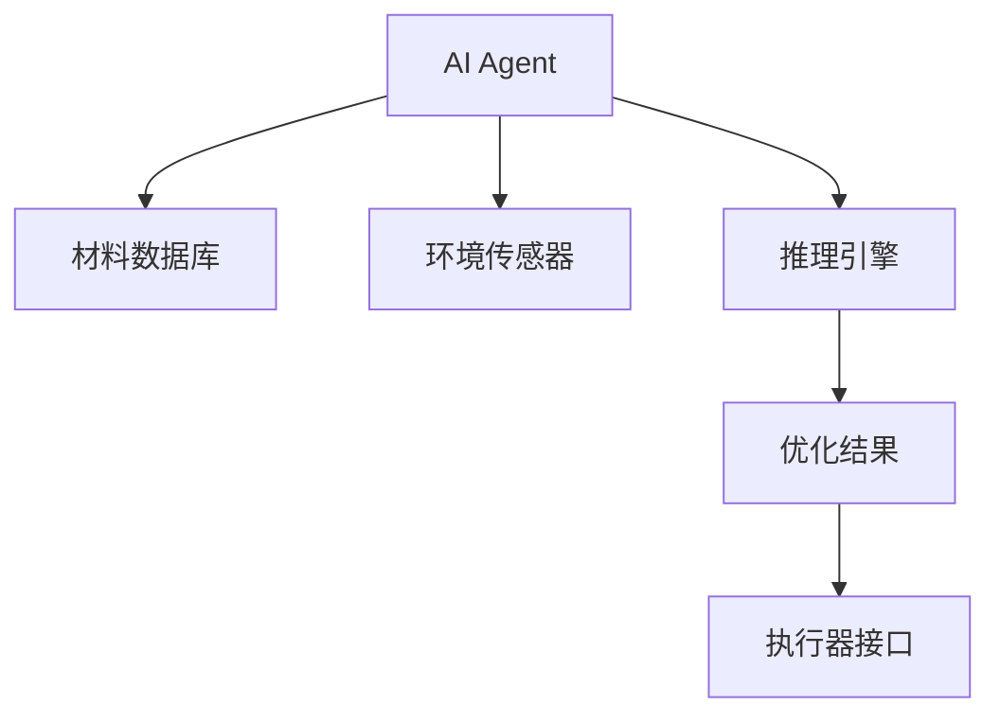
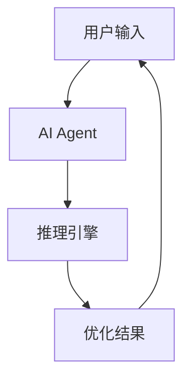

                 


# AI Agent在智能材料设计中的实践

## 关键词：AI Agent, 智能材料设计, 机器学习, 材料科学, 优化算法, 系统架构, 创新应用

## 摘要：
随着人工智能技术的飞速发展，AI Agent在智能材料设计中的应用逐渐展现出其独特的优势。本文系统地探讨了AI Agent如何通过强化学习、生成对抗网络等算法，结合材料科学的知识，实现智能材料的高效设计与优化。文章不仅详细分析了AI Agent在智能材料设计中的核心原理，还通过实际案例展示了其在实际应用中的巨大潜力。本文内容涵盖了从理论基础到系统架构，再到项目实战的全链条，为读者提供了一套完整的实践指南。

---

# 第1章: AI Agent与智能材料设计的背景与基础

## 1.1 AI Agent的基本概念

### 1.1.1 AI Agent的定义与特点
AI Agent（人工智能代理）是指在计算机系统中，能够感知环境、自主决策并执行任务的智能实体。其特点包括：
- **自主性**：能够在没有外部干预的情况下独立运作。
- **反应性**：能够实时感知环境变化并做出响应。
- **学习能力**：通过数据和经验不断优化自身的决策策略。
- **社交能力**：能够与其他AI Agent或人类进行交互协作。

### 1.1.2 AI Agent的核心原理
AI Agent的核心原理是通过感知、推理和行动三个环节实现目标。感知阶段通过传感器或数据输入获取信息；推理阶段利用机器学习算法分析信息并制定决策；行动阶段则通过执行器或接口将决策转化为具体操作。

### 1.1.3 AI Agent与传统算法的对比
传统算法通常基于固定的规则和逻辑进行处理，而AI Agent则能够根据环境动态调整策略，具有更强的适应性和创新能力。

## 1.2 智能材料的基本概念

### 1.2.1 智能材料的定义与分类
智能材料是指能够对外界环境（如温度、压力、光照等）做出响应并改变自身性质的材料。常见的智能材料包括形状记忆合金、压电材料、磁性材料等。

### 1.2.2 智能材料的特性与应用场景
智能材料的特性包括响应性、自适应性和可编程性。其应用场景广泛，例如医疗领域的人工智能假肢、建筑领域的智能结构材料等。

### 1.2.3 智能材料设计的挑战与机遇
智能材料设计的挑战主要在于材料性能的复杂性和多目标优化的难度。而机遇则体现在AI技术的应用为材料设计提供了新的工具和方法。

## 1.3 AI Agent在智能材料设计中的作用

### 1.3.1 AI Agent如何提升材料设计效率
通过AI Agent的自动化决策能力，可以大幅缩短材料设计的周期，降低试错成本。

### 1.3.2 AI Agent在材料性能预测中的应用
AI Agent可以通过机器学习模型预测材料的性能，帮助设计者快速找到最优解决方案。

### 1.3.3 AI Agent在材料优化中的创新
AI Agent可以探索传统方法难以发现的新型材料结构，推动材料科学的创新。

## 1.4 本章小结
本章从AI Agent和智能材料的基本概念出发，分析了AI Agent在智能材料设计中的作用，为后续章节的深入探讨奠定了基础。

---

# 第2章: AI Agent与智能材料设计的核心概念

## 2.1 AI Agent的决策机制

### 2.1.1 基于强化学习的决策过程
强化学习是一种通过试错机制优化决策策略的方法。AI Agent在智能材料设计中可以通过强化学习算法不断调整材料的参数，以达到最优性能。

### 2.1.2 基于生成模型的创新设计
生成对抗网络（GAN）等生成模型可以用来生成新型材料的结构，突破传统设计的局限性。

### 2.1.3 多目标优化的实现方法
智能材料设计通常涉及多个目标的优化，如强度、韧性、导电性等。AI Agent可以通过多目标优化算法找到最佳平衡点。

## 2.2 智能材料的属性与建模

### 2.2.1 材料性能的多维度分析
智能材料的性能通常涉及多个维度，如力学性能、热学性能、电学性能等。AI Agent可以通过多维度建模来全面分析材料特性。

### 2.2.2 材料属性与AI模型的关联
通过对材料属性的建模，AI Agent可以将材料的物理特性与机器学习模型的输出建立直接联系。

### 2.2.3 材料数据库的构建与应用
构建高质量的材料数据库是智能材料设计的基础。AI Agent可以通过数据挖掘和机器学习技术，从海量数据中提取有用的信息。

## 2.3 AI Agent与智能材料设计的系统性联系

### 2.3.1 系统整体架构图
以下是AI Agent与智能材料设计的系统整体架构图：



### 2.3.2 核心概念对比表
以下是AI Agent与传统算法的核心概念对比表：

| **属性**       | **AI Agent**                     | **传统算法**                     |
|----------------|----------------------------------|----------------------------------|
| 决策方式       | 基于环境反馈动态调整策略        | 基于固定规则进行处理            |
| 学习能力       | 具备学习能力，可以优化性能        | 无学习能力，性能固定            |
| 灵活性         | 高，能够适应复杂环境变化          | 低，适应性差                    |

### 2.3.3 实体关系图
以下是AI Agent与智能材料设计的实体关系图：

```mermaid
erd
    A[AI Agent] -{-> B[材料数据库]
    A -{-> C[环境传感器]
    B -{-> D[材料性能模型]
    C -{-> D
```

## 2.4 本章小结
本章详细分析了AI Agent的决策机制、智能材料的属性建模以及两者之间的系统性联系，为后续的算法实现奠定了理论基础。

---

# 第3章: AI Agent在智能材料设计中的算法原理

## 3.1 强化学习算法

### 3.1.1 强化学习的基本原理
强化学习的基本原理是通过试错机制，AI Agent通过与环境交互获得奖励或惩罚，从而优化决策策略。以下是强化学习的基本流程图：



### 3.1.2 Q-Learning算法的实现
Q-Learning是一种经典的强化学习算法，其核心公式为：

$$Q(s, a) = Q(s, a) + \alpha [r + \gamma \max Q(s', a') - Q(s, a)]$$

其中：
- \( s \) 是当前状态
- \( a \) 是当前动作
- \( r \) 是获得的奖励
- \( \gamma \) 是折扣因子
- \( \alpha \) 是学习率

### 3.1.3 策略梯度算法的优化
策略梯度算法通过优化策略直接最大化期望奖励，其核心公式为：

$$\nabla \theta \leftarrow \nabla_\theta J(\theta) = \mathbb{E}[ \nabla_\theta \log \pi_\theta(a|s) Q(s,a)]$$

---

## 3.2 生成对抗网络（GAN）的应用

### 3.2.1 GAN的基本原理
GAN由生成器和判别器组成，生成器的目标是生成逼真的样本，而判别器的目标是区分真实样本和生成样本。以下是GAN的基本流程图：



### 3.2.2 材料结构生成的创新应用
GAN可以用于生成新型材料的微观结构，从而优化材料的性能。以下是生成器和判别器的网络结构示意图：



### 3.2.3 模型训练中的挑战与解决方案
GAN训练中的主要挑战是生成器和判别器的平衡问题。解决方案包括使用Wasserstein GAN、标签平滑等方法。

## 3.3 贪婪算法与启发式搜索

### 3.3.1 贪婪算法在材料优化中的应用
贪婪算法在材料优化中通常用于局部最优解的寻找，例如在晶格结构优化中，可以通过局部调整来降低能量。

### 3.3.2 A*算法在材料设计中的启发式搜索
A*算法通过启发式函数优先搜索最有潜力的路径，可以用于智能材料的结构优化。

### 3.3.3 算法选择的策略与优化
在实际应用中，需要根据具体问题的特点选择合适的算法，并通过参数调优进一步优化性能。

## 3.4 算法实现的数学模型与公式

### 3.4.1 强化学习的数学模型
强化学习的数学模型通常涉及状态空间、动作空间和奖励函数。以下是典型的Q-Learning公式：

$$Q(s, a) = Q(s, a) + \alpha (r + \gamma \max Q(s', a') - Q(s, a))$$

### 3.4.2 GAN的损失函数
GAN的损失函数通常包括生成器损失和判别器损失。以下是典型的Wasserstein GAN损失函数：

$$\mathcal{L}_\text{G} = \mathbb{E}_{z \sim p_z}[\mathcal{D}(G(z))]$$
$$\mathcal{L}_\text{D} = \mathbb{E}_{x \sim p_x}[\mathcal{D}(x)] + \mathbb{E}_{z \sim p_z}[1 - \mathcal{D}(G(z))]$$
$$\mathcal{L} = \mathcal{L}_\text{G} + \mathcal{L}_\text{D}$$

### 3.4.3 启发式搜索的评估函数
启发式搜索的评估函数通常包括路径成本和启发式估计。公式为：

$$f(n) = g(n) + h(n)$$

其中，\( g(n) \) 是从起点到节点n的实际成本，\( h(n) \) 是从节点n到目标的启发式估计。

---

## 3.5 本章小结
本章详细讲解了强化学习、生成对抗网络和启发式搜索等算法在智能材料设计中的应用，并通过数学公式和流程图进行了直观的解释。

---

# 第4章: 智能材料设计的系统分析与架构设计

## 4.1 系统整体架构设计

### 4.1.1 系统功能模块划分
以下是系统功能模块划分的类图：



### 4.1.2 系统架构设计
以下是系统的架构设计图：



### 4.1.3 系统接口设计
系统接口设计需要考虑模块之间的通信协议和数据格式，通常采用RESTful API或消息队列机制。

## 4.2 系统功能设计

### 4.2.1 材料性能预测模块
材料性能预测模块通过机器学习模型，预测材料在不同条件下的性能指标。

### 4.2.2 材料结构生成模块
材料结构生成模块利用生成模型，设计新型材料的微观结构。

### 4.2.3 多目标优化模块
多目标优化模块通过强化学习算法，实现材料性能的多目标优化。

## 4.3 系统交互设计

### 4.3.1 系统交互流程图
以下是系统交互的流程图：



### 4.3.2 交互过程中的注意事项
在系统交互过程中，需要注意数据的实时性、系统的稳定性和结果的可解释性。

---

## 4.4 本章小结
本章详细分析了智能材料设计系统的整体架构、功能模块和交互设计，为后续的项目实战奠定了基础。

---

# 第5章: 项目实战

## 5.1 环境安装与配置

### 5.1.1 系统环境要求
- 操作系统：Linux/Windows/MacOS
- Python版本：3.6及以上
- 需要的库：TensorFlow、Keras、numpy、scipy、matplotlib

### 5.1.2 安装步骤
1. 安装Python和pip
2. 安装所需的库：`pip install -r requirements.txt`
3. 配置环境变量

## 5.2 系统核心实现源代码

### 5.2.1 强化学习算法实现
以下是基于Q-Learning的强化学习算法实现代码：

```python
import numpy as np

class QLearning:
    def __init__(self, state_size, action_size, gamma=0.99, alpha=0.1):
        self.state_size = state_size
        self.action_size = action_size
        self.gamma = gamma
        self.alpha = alpha
        self.q_table = np.zeros((state_size, action_size))
    
    def remember(self, state, action, reward, next_state):
        self.q_table[state, action] += self.alpha * (reward + self.gamma * np.max(self.q_table[next_state]) - self.q_table[state, action])
    
    def act(self, state):
        return np.argmax(self.q_table[state])
```

### 5.2.2 GAN算法实现
以下是生成对抗网络的实现代码：

```python
import tensorflow as tf
from tensorflow.keras import layers

def make_generator_model():
    model = tf.keras.Sequential()
    model.add(layers.Dense(256, activation='relu', input_shape=(100,)))
    model.add(layers.Dense(512, activation='relu'))
    model.add(layers.Dense(1024, activation='sigmoid'))
    return model

def make_discriminator_model():
    model = tf.keras.Sequential()
    model.add(layers.Dense(1024, activation='relu', input_shape=(1024,)))
    model.add(layers.Dense(1, activation='sigmoid'))
    return model

generator = make_generator_model()
discriminator = make_discriminator_model()
```

## 5.3 代码应用解读与分析

### 5.3.1 强化学习算法的应用
强化学习算法用于智能材料的多目标优化，通过不断试错优化材料性能。

### 5.3.2 GAN算法的应用
GAN算法用于生成新型材料的微观结构，突破传统设计的限制。

### 5.3.3 系统整体实现
系统整体实现包括数据采集、模型训练、结果输出等环节。

## 5.4 实际案例分析与详细讲解剖析

### 5.4.1 案例背景
假设我们需要设计一种新型压电材料，目标是提高其能量转换效率。

### 5.4.2 数据准备
收集现有压电材料的数据，包括材料成分、微观结构、性能指标等。

### 5.4.3 模型训练
使用强化学习和GAN算法进行模型训练，优化材料的性能参数。

### 5.4.4 结果分析
分析生成的材料结构，验证其性能是否达到预期目标。

## 5.5 项目小结
本项目通过实际案例展示了AI Agent在智能材料设计中的应用，验证了算法的有效性和实用性。

---

## 5.6 本章小结
本章通过项目实战，详细讲解了AI Agent在智能材料设计中的具体实现，帮助读者更好地理解和应用相关技术。

---

# 第6章: 总结与展望

## 6.1 本项目的核心成果
本项目通过AI Agent实现了智能材料的高效设计与优化，验证了AI技术在材料科学中的巨大潜力。

## 6.2 未来的发展方向
未来的研究方向包括更高效的算法优化、更广泛的应用场景探索以及更精确的材料数据库构建。

## 6.3 最佳实践 tips
- 在实际应用中，建议结合具体问题选择合适的算法。
- 数据的质量和数量对模型性能有重要影响，需要高度重视数据 preprocessing。
- 系统的可解释性和可维护性也需要在设计阶段予以考虑。

## 6.4 总结
AI Agent在智能材料设计中的应用不仅提高了设计效率，还推动了材料科学的创新发展。随着技术的进步，AI Agent将在更多领域展现其独特的优势。

---

# 作者：AI天才研究院/AI Genius Institute & 禅与计算机程序设计艺术 /Zen And The Art of Computer Programming

---

以上是《AI Agent在智能材料设计中的实践》的完整目录大纲和部分正文内容，您可以根据需要进一步扩展每一部分的具体内容。

