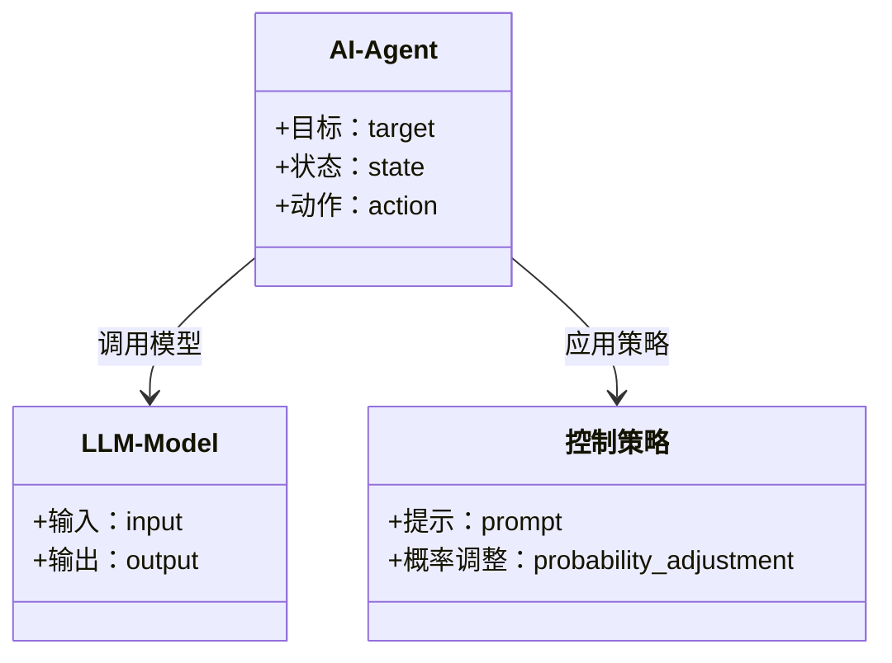
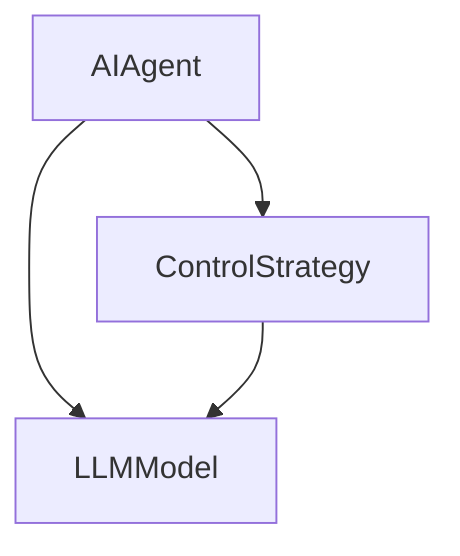
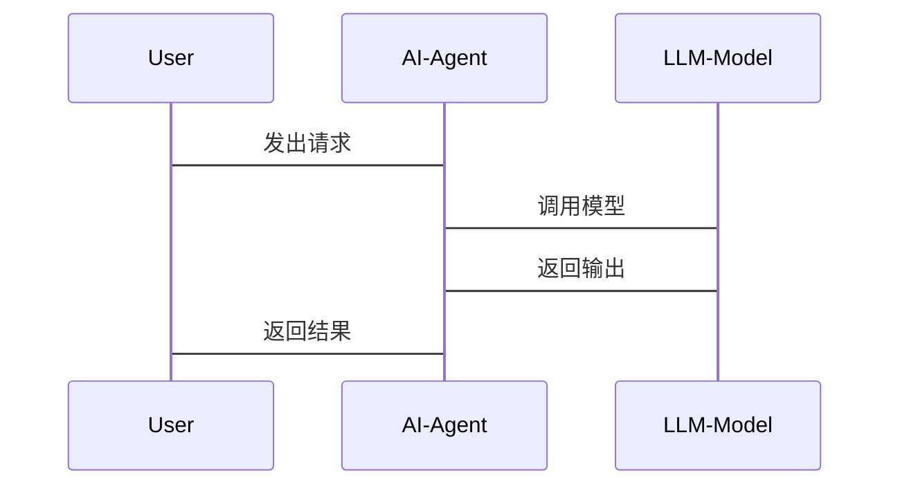

                 


# AI Agent的可控生成：精确控制LLM的输出

> **关键词**: AI Agent, LLM, 可控生成, 提示工程, 概率控制, 标签控制

> **摘要**:  
本文详细探讨了AI Agent如何精确控制LLM（大语言模型）的输出，从核心概念、算法原理到系统架构和项目实战，全面解析了AI Agent与LLM结合的原理与实现方法。通过对比分析、流程图和代码示例，本文为读者提供了从理论到实践的完整指南。

---

## 第一部分: AI Agent的可控生成基础

## 第1章: 背景介绍与核心概念

### 1.1 问题背景与描述

AI Agent（人工智能代理）与LLM（Large Language Model，大语言模型）的结合正在成为人工智能领域的重要研究方向。AI Agent通过调用和控制LLM的输出，可以实现更加智能化和目标导向的任务处理。然而，LLM的输出通常具有不可预测性，这给AI Agent的控制带来了挑战。我们需要一种精确控制LLM输出的方法，以确保AI Agent的行为符合预期目标。

### 1.2 问题解决与边界

#### 1.2.1 可控生成的目标
- 确保LLM的输出符合特定的任务要求。
- 提高AI Agent的决策准确性和效率。
- 降低LLM输出的不确定性和潜在风险。

#### 1.2.2 边界与外延
- 可控生成的边界：仅针对LLM的输出进行控制，不涉及LLM的内部训练过程。
- 可控生成的外延：通过提示工程、概率控制等方法，增强AI Agent对LLM输出的干预能力。

#### 1.2.3 核心要素组成
- AI Agent：负责发出请求和控制LLM的输出。
- LLM：提供生成文本的核心功能。
- 控制策略：通过特定的算法实现对LLM输出的干预。

### 1.3 本章小结

本章从背景出发，介绍了AI Agent与LLM结合的重要性，明确了可控生成的目标和边界，并总结了核心要素。为后续章节的深入分析奠定了基础。

---

## 第二部分: AI Agent与LLM的核心概念与联系

## 第2章: 核心概念原理

### 2.1 AI Agent的基本原理

#### 2.1.1 AI Agent的定义
AI Agent是一种能够感知环境、自主决策并执行任务的智能实体。它通过与环境交互，完成特定目标。

#### 2.1.2 AI Agent的核心特征
- **自主性**：能够自主决策。
- **反应性**：能够实时感知环境并做出反应。
- **目标导向**：以实现特定目标为导向。
- **学习能力**：能够通过经验改进性能。

#### 2.1.3 AI Agent的分类
- **简单反射型AI Agent**：基于规则的简单响应。
- **基于模型的AI Agent**：利用内部模型进行决策。
- **目标导向型AI Agent**：以实现目标为导向。

### 2.2 LLM的基本原理

#### 2.2.1 LLM的定义
LLM（Large Language Model）是一种基于大规模数据训练的神经网络模型，能够生成与训练数据相似的文本。

#### 2.2.2 LLM的工作原理
- **输入处理**：将输入文本转换为模型可处理的向量表示。
- **生成过程**：通过解码器生成序列，逐步生成输出文本。
- **概率预测**：基于上下文概率预测下一个词。

#### 2.2.3 LLM的优缺点
- **优点**：生成能力强，能够处理复杂语言任务。
- **缺点**：输出具有不确定性，可能偏离预期目标。

### 2.3 AI Agent与LLM的关系

#### 2.3.1 AI Agent如何利用LLM
- AI Agent通过调用LLM API，利用其生成能力完成复杂任务。
- AI Agent通过控制LLM的输入（如提示），影响其输出结果。

#### 2.3.2 LLM如何增强AI Agent的能力
- 提供强大的自然语言生成能力。
- 支持多语言和多任务处理。
- 增强人机交互的自然性。

#### 2.3.3 两者结合的潜在问题
- LLM的输出不确定性可能影响AI Agent的决策。
- 过度依赖LLM可能导致AI Agent的自主性降低。

---

## 第3章: 核心概念对比与ER实体关系图

### 3.1 AI Agent与LLM的核心属性对比

| **属性**       | **AI Agent**             | **LLM**                |
|-----------------|--------------------------|------------------------|
| **核心功能**    | 感知环境、自主决策       | 生成自然语言文本       |
| **输入要求**    | 多样化，包括传感器数据   | 文本输入               |
| **输出形式**    | 行动指令或目标结果       | 自然语言文本           |
| **学习能力**    | 可通过强化学习改进       | 无法主动改进，依赖训练数据 |

### 3.2 ER实体关系图

```mermaid
er
actor: User
agent: AI Agent
llm: Large Language Model
goal: Target Output

actor --> agent: 发出请求
agent --> llm: 调用模型
llm --> goal: 生成目标输出
```

---

## 第三部分: 可控生成的算法原理

## 第4章: 算法原理与实现

### 4.1 可控生成的基本原理

#### 4.1.1 概率控制
通过调整生成过程中的概率分布，引导模型生成符合预期的文本。

#### 4.1.2 标签控制
通过在输入中添加特定的标签或标记，指导模型生成特定类型的输出。

#### 4.1.3 提示工程
通过精心设计的提示（prompt），引导模型生成符合预期的文本。

### 4.2 基于概率的可控生成算法

#### 4.2.1 算法流程
1. 输入文本经过编码器转换为向量表示。
2. 生成过程中，根据概率分布动态调整生成词的概率。
3. 输出符合预期的文本。

#### 4.2.2 算法实现
```python
import torch

def probability_adjustment(x, temperature=1.0):
    # 对数概率调整
    adjusted_logits = x / temperature
    # 软最大
    prob = torch.nn.functional.softmax(adjusted_logits, dim=-1)
    return prob

# 示例输入
input_tensor = torch.randn(1, 50, 512)
adjusted_prob = probability_adjustment(input_tensor)
print(adjusted_prob)
```

#### 4.2.3 算法优缺点
- **优点**：可以灵活调整生成结果。
- **缺点**：需要实时计算概率分布，计算开销较大。

### 4.3 基于标签的可控生成算法

#### 4.3.1 标签定义
- **类别标签**：指定生成文本的类型（如“幽默”、“正式”）。
- **实体标签**：指定生成文本中涉及的实体。

#### 4.3.2 标签分类
- **显式标签**：直接在输入中添加标签（如`<humor>`）。
- **隐式标签**：通过上下文间接影响生成内容。

#### 4.3.3 标签实现
```python
def generate_with_labels(prompt, labels):
    # 在输入前添加标签
    modified_prompt = "<" + labels + ">" + prompt
    response = generate(modified_prompt)
    return response
```

---

## 第5章: 算法实现与数学模型

### 5.1 算法实现

#### 5.1.1 基于概率的数学模型
- **概率调整公式**：
  $$ P(y|x) = \frac{e^{x \cdot w_y}}{\sum_{k} e^{x \cdot w_k}} $$
- **调整温度参数**：
  $$ \text{adjusted\_logit} = \frac{x}{\text{temperature}} $$

#### 5.1.2 基于标签的数学模型
- **标签权重调公式**：
  $$ w_{\text{adjusted}} = w + \alpha \cdot \text{label\_weight} $$

### 5.2 数学公式与实现

#### 5.2.1 概率分布公式
$$ P(y|x) = \frac{e^{x \cdot w_y}}{\sum_{k} e^{x \cdot w_k}} $$

#### 5.2.2 标签权重调整公式
$$ w_{\text{adjusted}} = w + \alpha \cdot \text{label\_weight} $$

---

## 第四部分: 系统分析与架构设计

## 第6章: 系统分析与架构设计方案

### 6.1 问题场景介绍

AI Agent需要通过调用LLM完成特定任务，例如：
- 自然语言理解任务（如问答系统）。
- 文本生成任务（如内容创作）。
- 多轮对话任务（如客服系统）。

### 6.2 系统功能设计

#### 6.2.1 领域模型设计


#### 6.2.2 系统架构设计


#### 6.2.3 接口设计
- **输入接口**：接收用户的请求。
- **输出接口**：输出生成的文本。
- **控制接口**：实现对LLM的控制策略。

#### 6.2.4 交互序列图


---

## 第五部分: 项目实战

## 第7章: 项目实战与案例分析

### 7.1 环境安装

#### 7.1.1 安装依赖
```bash
pip install transformers torch
```

### 7.2 系统核心实现

#### 7.2.1 提示工程实现
```python
from transformers import GPT2LMHeadModel, GPT2Tokenizer

def generate_with_prompt(model, tokenizer, prompt, max_length=50):
    inputs = tokenizer.encode(prompt, return_tensors="pt")
    outputs = model.generate(inputs, max_length=max_length, do_sample=True)
    return tokenizer.decode(outputs[0], skip_special_tokens=True)
```

#### 7.2.2 概率调整实现
```python
def probability_adjustment(x, temperature=1.0):
    adjusted_logits = x / temperature
    prob = torch.nn.functional.softmax(adjusted_logits, dim=-1)
    return prob
```

### 7.3 代码应用解读与分析

#### 7.3.1 提示工程案例
```python
model = GPT2LMHeadModel.from_pretrained('gpt2')
tokenizer = GPT2Tokenizer.from_pretrained('gpt2')

prompt = "请用幽默的语气描述一场雨"
output = generate_with_prompt(model, tokenizer, prompt)
print(output)
```

#### 7.3.2 概率调整案例
```python
input_tensor = torch.randn(1, 50, 512)
adjusted_prob = probability_adjustment(input_tensor)
print(adjusted_prob)
```

### 7.4 案例分析与详细讲解

#### 7.4.1 案例一：提示工程控制
输入提示为“请用幽默的语气描述一场雨”，输出结果为“一场雨，像上帝打翻了水桶，哗啦啦地洒向人间。”

#### 7.4.2 案例二：概率调整控制
调整温度参数为0.7，生成的文本更加多样化。

### 7.5 项目小结

本章通过实际案例展示了AI Agent如何利用提示工程和概率调整控制LLM的输出，帮助读者更好地理解理论与实践的结合。

---

## 第六部分: 总结与展望

## 第8章: 总结与展望

### 8.1 最佳实践 tips

- **合理设计提示**：提示是控制LLM输出的关键。
- **动态调整参数**：根据任务需求动态调整生成参数。
- **结合领域知识**：结合具体领域知识，提升生成质量。

### 8.2 小结

本文从AI Agent与LLM的基本概念出发，详细探讨了可控生成的算法原理与实现方法，并通过实际案例展示了如何在项目中应用这些方法。

### 8.3 注意事项

- **数据隐私**：注意保护用户数据隐私。
- **模型鲁棒性**：确保生成结果的可靠性和一致性。
- **可解释性**：提升生成过程的可解释性。

### 8.4 拓展阅读

- 《生成式人工智能：原理与应用》
- 《大规模语言模型的控制与优化》

---

## 作者

作者：AI天才研究院/AI Genius Institute & 禅与计算机程序设计艺术 /Zen And The Art of Computer Programming

