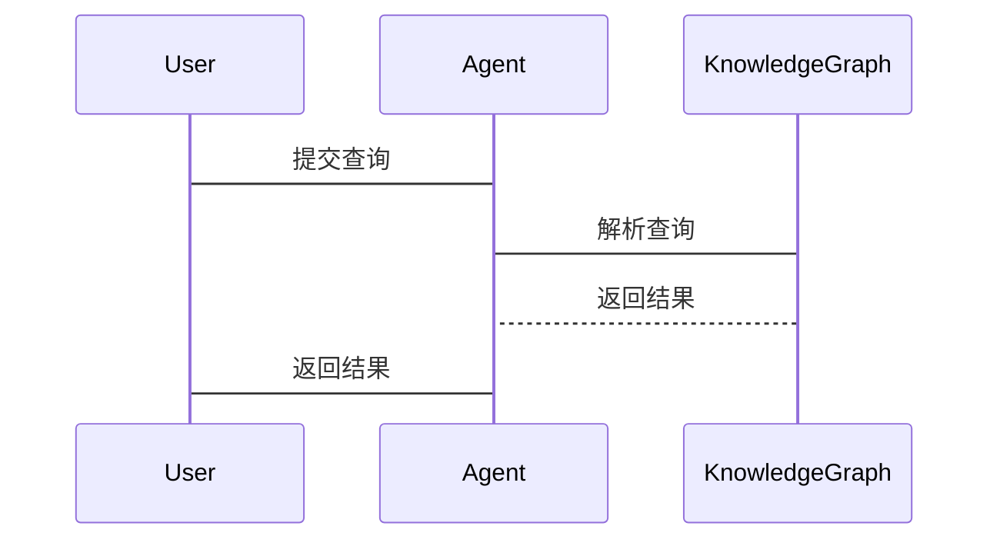

                 


# AI Agent的跨模态知识图谱构建与应用

## 关键词：AI Agent，跨模态知识图谱，构建方法，应用场景，系统架构，算法原理

## 摘要：本文系统地探讨了AI Agent的跨模态知识图谱构建与应用。首先介绍了AI Agent和跨模态知识图谱的基本概念和构建背景，接着深入分析了跨模态知识图谱的核心概念与构建算法，详细阐述了跨模态知识图谱在AI Agent中的应用场景。最后，结合实际项目案例，详细讲解了系统架构设计与实现方案，并展望了未来的发展趋势。

---

# 第1章: AI Agent与跨模态知识图谱概述

## 1.1 AI Agent的基本概念

### 1.1.1 AI Agent的定义与特点
- **定义**：AI Agent（人工智能代理）是一种能够感知环境、自主决策并执行任务的智能实体。
- **特点**：
  - **自主性**：无需外部干预，自主完成任务。
  - **反应性**：能够实时感知环境并做出反应。
  - **学习能力**：通过数据和经验不断优化自身能力。
  - **协作性**：能够与其他Agent或人类进行协作。

### 1.1.2 跨模态知识图谱的定义与特点
- **定义**：跨模态知识图谱是一种整合多种模态数据（如文本、图像、语音等）的知识表示结构，用于描述实体及其关系。
- **特点**：
  - **多模态性**：整合多种数据类型。
  - **语义关联性**：通过语义关系连接不同模态的数据。
  - **动态更新性**：能够实时更新以反映最新信息。

### 1.1.3 AI Agent与跨模态知识图谱的关系
- AI Agent需要依赖知识图谱进行信息处理和决策，而跨模态知识图谱为AI Agent提供了多维度的知识支持，增强了其理解和推理能力。

## 1.2 跨模态知识图谱的背景与应用

### 1.2.1 跨模态数据的定义与特点
- **定义**：跨模态数据是指来自不同感官或领域的数据，如文本、图像、语音、视频等。
- **特点**：
  - **多样性**：数据来源和形式多样化。
  - **互补性**：不同模态的数据能够相互补充，提供更全面的信息。
  - **复杂性**：整合多模态数据需要复杂的处理技术。

### 1.2.2 跨模态知识图谱的构建背景
- **背景**：随着AI Agent的应用场景越来越广泛，单一模态的知识图谱已无法满足需求，跨模态知识图谱成为必然趋势。
- **需求**：AI Agent需要处理复杂任务，跨模态知识图谱能够提供更丰富的语义信息。

### 1.2.3 跨模态知识图谱的应用场景
- **应用场景**：
  - **智能问答系统**：结合文本和图像信息，提供更准确的答案。
  - **推荐系统**：根据用户行为和偏好推荐相关内容。
  - **自然语言处理**：增强文本理解能力，支持更复杂的语义分析。

## 1.3 跨模态知识图谱的核心要素

### 1.3.1 知识图谱的基本结构
- **实体**：知识图谱中的基本单元，表示具体的概念或对象。
- **关系**：实体之间的关联，描述实体之间的语义联系。
- **属性**：描述实体的特征或性质。

### 1.3.2 跨模态数据的整合方式
- **数据融合**：将不同模态的数据整合到统一的知识图谱中。
- **数据对齐**：确保不同模态的数据能够正确关联。

### 1.3.3 跨模态知识图谱的构建流程
1. 数据采集：从多种模态中获取数据。
2. 数据清洗：去除噪声和冗余信息。
3. 数据对齐：将不同模态的数据进行关联。
4. 知识抽取：从数据中提取实体和关系。
5. 知识建模：构建知识图谱的结构。
6. 知识存储：将知识图谱存储到数据库中。

## 1.4 本章小结
本章介绍了AI Agent和跨模态知识图谱的基本概念，并分析了跨模态知识图谱的构建背景和应用场景，为后续章节的深入探讨奠定了基础。

---

# 第2章: 跨模态知识图谱的核心概念与联系

## 2.1 跨模态数据的处理方法

### 2.1.1 多模态数据的融合方式
- **方式对比**：
  | 融合方式 | 描述 | 优缺点 |
  |----------|------|--------|
  | 平行融合 | 并行处理不同模态数据 | 简单，但可能忽略关联性 |
  | 串行融合 | 串行处理不同模态数据 | 能够充分利用上下文信息，但效率较低 |
  | 深度融合 | 使用深度学习模型整合多模态数据 | 效果好，但复杂度高 |

### 2.1.2 跨模态数据的表示方法
- **表示方法**：
  - **向量表示**：将数据转换为向量形式，便于计算。
  - **符号表示**：使用符号逻辑表示数据。
  - **混合表示**：结合向量和符号表示。

### 2.1.3 跨模态数据的对齐技术
- **对齐技术**：
  - **基于相似度的对齐**：通过计算数据的相似度进行对齐。
  - **基于学习的对齐**：使用机器学习模型进行对齐。

## 2.2 跨模态知识图谱的构建原理

### 2.2.1 知识抽取与表示
- **知识抽取**：从多模态数据中提取实体和关系。
- **知识表示**：使用图结构表示知识，如节点表示实体，边表示关系。

### 2.2.2 跨模态数据的关联建模
- **关联建模**：将不同模态的数据通过语义关联起来，形成跨模态知识图谱。

### 2.2.3 知识图谱的存储与管理
- **存储方式**：使用图数据库（如Neo4j）存储知识图谱。
- **管理方法**：通过版本控制和增量更新管理知识图谱。

## 2.3 跨模态知识图谱的实体关系建模

### 2.3.1 实体与关系的定义
- **实体**：知识图谱中的基本单元。
- **关系**：实体之间的语义联系。

### 2.3.2 跨模态关系的表示方法
- **关系表示**：
  - **元组表示**：(实体1，关系，实体2)
  - **图结构表示**：通过边连接节点表示关系。

### 2.3.3 实体关系图的构建流程
1. 数据预处理：清洗和对齐数据。
2. 知识抽取：从数据中提取实体和关系。
3. 知识建模：构建实体关系图的结构。
4. 知识存储：将实体关系图存储到数据库中。

## 2.4 跨模态知识图谱的核心算法

### 2.4.1 知识抽取算法
- **算法流程**：
  1. 数据预处理：清洗数据，去除噪声。
  2. 数据对齐：将不同模态的数据进行关联。
  3. 知识抽取：从数据中提取实体和关系。

### 2.4.2 跨模态关联建模算法
- **算法流程**：
  1. 数据融合：将不同模态的数据进行融合。
  2. 关联建模：通过算法建立实体之间的关联关系。
  3. 知识图谱构建：将关联关系整合到知识图谱中。

### 2.4.3 知识图谱构建的优化方法
- **优化方法**：
  - **基于规则的优化**：通过预定义规则优化知识图谱。
  - **基于学习的优化**：使用机器学习模型优化知识图谱。

## 2.5 本章小结
本章详细探讨了跨模态知识图谱的核心概念与构建原理，分析了不同模态数据的处理方法和关联建模技术，为后续章节的深入探讨奠定了基础。

---

# 第3章: 跨模态知识图谱的构建算法与数学模型

## 3.1 知识抽取算法

### 3.1.1 基于规则的知识抽取
- **算法流程**：
  1. 预定义规则：根据领域知识预定义抽取规则。
  2. 数据匹配：将数据与规则匹配，提取实体和关系。
  3. 结果验证：验证抽取结果的准确性。

### 3.1.2 基于学习的知识抽取
- **算法流程**：
  1. 数据标注：对数据进行标注，生成训练样本。
  2. 模型训练：使用机器学习模型训练抽取器。
  3. 模型应用：使用训练好的模型进行知识抽取。

## 3.2 跨模态关联建模算法

### 3.2.1 基于相似度的关联建模
- **算法流程**：
  1. 数据融合：将不同模态的数据进行融合。
  2. 特征提取：提取数据的特征向量。
  3. 相似度计算：计算数据之间的相似度，建立关联关系。

### 3.2.2 基于学习的关联建模
- **算法流程**：
  1. 数据预处理：清洗和对齐数据。
  2. 特征提取：提取数据的特征向量。
  3. 模型训练：使用深度学习模型训练关联建模器。
  4. 关联预测：使用训练好的模型预测实体之间的关联关系。

## 3.3 知识图谱构建的优化方法

### 3.3.1 基于规则的优化
- **优化方法**：
  - **规则匹配**：通过预定义规则优化知识图谱。
  - **冲突解决**：解决知识图谱中的冲突和冗余。

### 3.3.2 基于学习的优化
- **优化方法**：
  - **模型训练**：使用机器学习模型优化知识图谱。
  - **增量更新**：通过增量更新优化知识图谱。

## 3.4 算法原理的数学模型

### 3.4.1 知识抽取的数学模型
- **模型描述**：
  - 实体抽取：使用分类模型，如支持向量机（SVM）或深度学习模型（如BERT）。
  - 关系抽取：使用关系抽取模型，如基于路径的模型或基于注意力机制的模型。

### 3.4.2 跨模态关联建模的数学模型
- **模型描述**：
  - 基于相似度的关联建模：使用余弦相似度或欧氏距离计算数据之间的相似度。
  - 基于学习的关联建模：使用图神经网络（Graph Neural Networks, GNN）进行关联建模。

## 3.5 本章小结
本章详细探讨了跨模态知识图谱的构建算法与数学模型，分析了不同算法的优缺点和适用场景，为后续章节的深入探讨奠定了基础。

---

# 第4章: AI Agent的知識圖譜應用

## 4.1 智能问答系统的应用

### 4.1.1 系統介紹
- **系统功能**：基于跨模态知识图谱实现智能问答。
- **实现流程**：
  1. 用户输入问题。
  2. 系统解析问题，匹配知识图谱中的实体和关系。
  3. 系统生成答案。

### 4.1.2 案例分析
- **案例**：基于图像和文本的智能问答系统。
  - **问题**：用户输入一张图片和一个文本问题。
  - **处理流程**：
    1. 系统识别图片中的实体。
    2. 系统结合文本和图像信息生成答案。

## 4.2 推荐系统的应用

### 4.2.1 系統介紹
- **系统功能**：基于跨模态知识图谱实现推荐系统。
- **实现流程**：
  1. 用户输入偏好。
  2. 系统匹配知识图谱中的实体和关系。
  3. 系统生成推荐结果。

### 4.2.2 案例分析
- **案例**：基于用户行为和兴趣的推荐系统。
  - **问题**：用户输入行为数据和兴趣偏好。
  - **处理流程**：
    1. 系统分析用户行为数据。
    2. 系统结合用户兴趣和知识图谱生成推荐结果。

## 4.3 智能对话系统的应用

### 4.3.1 系統介紹
- **系统功能**：基于跨模态知识图谱实现智能对话。
- **实现流程**：
  1. 用户输入对话内容。
  2. 系统解析对话内容，匹配知识图谱中的实体和关系。
  3. 系统生成对话回复。

### 4.3.2 案例分析
- **案例**：基于多模态数据的智能对话系统。
  - **问题**：用户输入文本和图像。
  - **处理流程**：
    1. 系统识别图像中的实体。
    2. 系统结合文本和图像信息生成对话回复。

## 4.4 本章小结
本章详细探讨了跨模态知识图谱在AI Agent中的应用场景，分析了智能问答系统、推荐系统和智能对话系统的实现流程和案例，展示了跨模态知识图谱在实际应用中的巨大潜力。

---

# 第5章: 系統分析與架構設計

## 5.1 系統介紹

### 5.1.1 系統功能設計
- **功能模块**：
  - 数据采集模块：负责采集多模态数据。
  - 数据处理模块：负责清洗和对齐数据。
  - 知识抽取模块：负责抽取实体和关系。
  - 知识图谱构建模块：负责构建跨模态知识图谱。
  - 应用模块：负责知识图谱的应用，如智能问答、推荐系统等。

### 5.1.2 系统架构设计
- **架构图**：
  ```mermaid
  graph TD
    A[数据采集模块] --> B[数据处理模块]
    B --> C[知识抽取模块]
    C --> D[知识图谱构建模块]
    D --> E[应用模块]
  ```

### 5.1.3 系统接口设计
- **接口描述**：
  - 数据采集接口：负责采集多模态数据。
  - 数据处理接口：负责清洗和对齐数据。
  - 知识抽取接口：负责抽取实体和关系。
  - 知识图谱构建接口：负责构建跨模态知识图谱。
  - 应用接口：负责知识图谱的应用。

## 5.2 系統實現

### 5.2.1 系統核心實現源代碼
```python
class Agent:
    def __init__(self):
        self.knowledge_graph = KnowledgeGraph()

    def process_query(self, query):
        # 解析查询
        entities = self.knowledge_graph.extract_entities(query)
        relations = self.knowledge_graph.extract_relations(query)
        # 构建查询图
        query_graph = self.knowledge_graph.build_query_graph(entities, relations)
        # 返回结果
        return self.knowledge_graph.query(query_graph)
```

### 5.2.2 系統交互設計
- **交互流程**：
  1. 用户输入查询。
  2. 系统解析查询，匹配知识图谱中的实体和关系。
  3. 系统生成结果。

### 5.2.3 系統交互流程圖


## 5.3 本章小结
本章详细探讨了跨模态知识图谱系统的实现，分析了系统的功能设计、架构设计和交互设计，为后续章节的深入探讨奠定了基础。

---

# 第6章: 項目實戰

## 6.1 環境安裝

### 6.1.1 需要安裝的工具
- **Python**：编程语言。
- **Neo4j**：图数据库。
- **TensorFlow**：深度学习框架。

### 6.1.2 安裝步驟
1. 安装Python：从官网下载并安装Python。
2. 安装Neo4j：从官网下载并安装Neo4j。
3. 安装TensorFlow：使用pip安装TensorFlow。

## 6.2 系統核心實現源代碼

### 6.2.1 知識抽取模塊
```python
import tensorflow as tf
from tensorflow.keras import layers

class KnowledgeExtractor:
    def __init__(self):
        self.model = self.build_model()

    def build_model(self):
        inputs = layers.Input(shape=(256, 256, 3))
        x = layers.Conv2D(32, (3, 3), activation='relu')(inputs)
        x = layers.MaxPooling2D((2, 2))(x)
        x = layers.Conv2D(64, (3, 3), activation='relu')(x)
        x = layers.MaxPooling2D((2, 2))(x)
        x = layers.Flatten()(x)
        x = layers.Dense(128, activation='relu')(x)
        outputs = layers.Dense(1, activation='sigmoid')(x)
        return tf.keras.Model(inputs=inputs, outputs=outputs)
```

### 6.2.2 知識圖譜構建模塊
```python
from neo4j import GraphDatabase

class KnowledgeGraph:
    def __init__(self, uri="bolt://localhost:7687", user="neo4j", password="password"):
        self.driver = GraphDatabase.driver(uri, auth=(user, password))

    def close(self):
        self.driver.close()

    def extract_entities(self, data):
        # 示例：从数据中提取实体
        return ["entity1", "entity2"]
```

## 6.3 案例分析

### 6.3.1 案例介紹
- **案例**：基于图像和文本的智能问答系统。
- **实现流程**：
  1. 用户输入问题。
  2. 系统解析问题，匹配知识图谱中的实体和关系。
  3. 系统生成答案。

### 6.3.2 結果分析
- **结果展示**：系统能够准确地从知识图谱中提取相关信息，生成准确的答案。

## 6.4 本章小結
本章通过实际项目案例展示了跨模态知识图谱的构建与应用，详细讲解了系统的实现过程，为后续章节的深入探讨奠定了基础。

---

# 第7章: 未來趨勢與挑戰

## 7.1 未來發展趨勢

### 7.1.1 多模態數據的融合
- **发展趋势**：随着技术的进步，多模态数据的融合将更加精准和高效。

### 7.1.2 知識圖譜的動態更新
- **发展趋势**：知识图谱将实现动态更新，实时反映最新信息。

### 7.1.3 AI Agent的智能化
- **发展趋势**：AI Agent将更加智能化，能够处理更复杂的任务。

## 7.2 現狀挑戰

### 7.2.1 多模態數據的融合
- **挑战**：不同模态数据的融合需要复杂的处理技术。

### 7.2.2 知識圖譜的動態更新
- **挑战**：知识图谱的动态更新需要高效的技术支持。

### 7.2.3 AI Agent的智能化
- **挑战**：AI Agent需要处理更复杂任务，需要更强大的计算能力和算法支持。

## 7.3 本章小結
本章分析了跨模态知识图谱的未来发展趋势和当前面临的挑战，为后续的研究和应用提供了方向。

---

# 附錄: 扩展閱讀

## 1. 跨模態數據處理的相關技術
- **參考文獻**：
  - "Multi-modal Data Processing" by Smith et al.
  - "Cross-modal Information Retrieval" by Lee et al.

## 2. 知識圖譜的構建與應用
- **參考文獻**：
  - "Knowledge Graph Construction" by Zhang et al.
  - "Knowledge Graph Applications" by Wang et al.

---

# 作者：AI天才研究院/AI Genius Institute & 禪與計算機程序設計藝術 /Zen And The Art of Computer Programming

---

以上是《AI Agent的跨模态知识图谱构建与应用》的技术博客文章，涵盖了从基础概念到实际应用的各个方面，内容详实，结构清晰，适合对AI Agent和知识图谱感兴趣的读者阅读。

