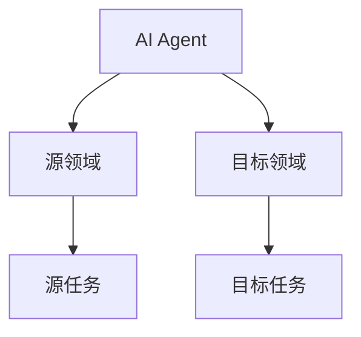
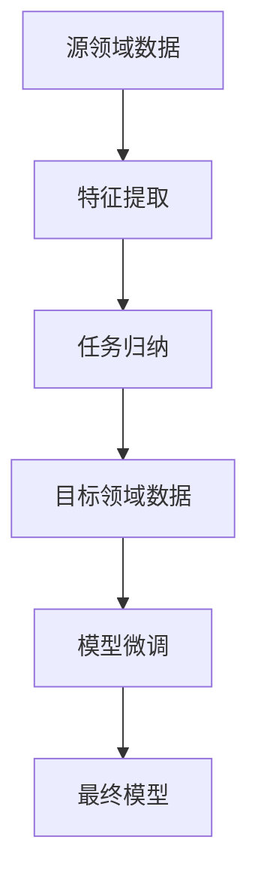
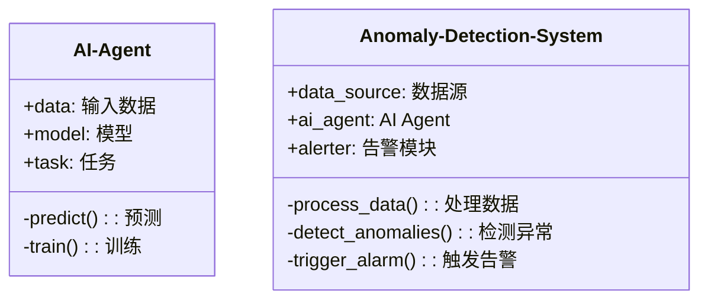
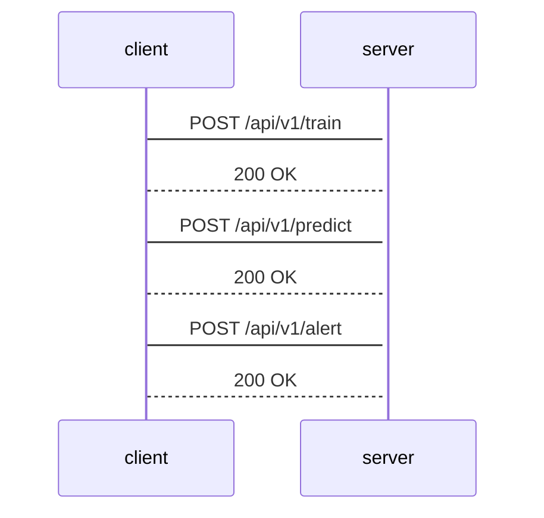

                 


# AI Agent的迁移学习在异常检测中的应用

> 关键词：AI Agent, 迁移学习, 异常检测, 域适应, 任务归纳, 系统架构

> 摘要：本文深入探讨了AI Agent在迁移学习中的应用，特别是在异常检测领域。文章从背景、核心概念、算法原理、系统架构到实战案例，全面分析了AI Agent如何通过迁移学习提升异常检测的性能与泛化能力。通过理论与实践结合，为读者提供了一套完整的解决方案与实现路径。

---

## 第1章: 异常检测与迁移学习的背景介绍

### 1.1 异常检测的定义与应用

#### 1.1.1 异常检测的基本概念
异常检测（Anomaly Detection）是指识别数据中与预期模式或行为显著不同的数据点。这些异常可能代表潜在的问题、机会或需要进一步调查的事件。异常检测广泛应用于金融 fraud detection、网络安全、医疗诊断、工业 IoT 设备监控等领域。

#### 1.1.2 异常检测的常见应用场景
1. **金融领域**：检测交易中的异常行为，识别 fraud。
2. **网络安全**：识别网络流量中的异常模式，发现潜在攻击。
3. **医疗领域**：分析患者数据，发现异常症状或诊断结果。
4. **工业领域**：监控设备运行状态，预测潜在故障。

#### 1.1.3 异常检测的挑战与难点
1. **数据稀疏性**：异常数据点通常较少，难以通过传统统计方法有效捕捉。
2. **数据不平衡性**：正常数据远多于异常数据，导致模型训练偏差。
3. **动态环境**：实际场景中数据分布可能随时间变化，模型需要具备适应性。

### 1.2 迁移学习的定义与特点

#### 1.2.1 迁移学习的基本概念
迁移学习（Transfer Learning）是一种机器学习技术，旨在将从源领域（Source Domain）学到的知识迁移到目标领域（Target Domain）。其核心思想是利用两个领域之间的共性来提高目标领域的学习性能。

#### 1.2.2 迁移学习的核心优势
1. **数据利用率高**：可以在数据不足的目标领域利用源领域的数据进行学习。
2. **领域适应性强**：适用于不同领域之间的知识迁移，提升模型的泛化能力。
3. **减少训练成本**：通过迁移学习可以减少对目标领域标注数据的依赖，降低训练成本。

#### 1.2.3 迁移学习与传统机器学习的对比
| 特性          | 传统机器学习               | 迁移学习               |
|---------------|----------------------------|------------------------|
| 数据需求      | 需要大量目标领域的数据     | 利用源领域数据，减少目标领域数据需求 |
| 领域适应性    | 适用于单一领域             | 适用于跨领域           |
| 知识复用性    | 知识仅限于目标领域         | 知识可以跨领域复用     |

### 1.3 AI Agent的基本概念与作用

#### 1.3.1 AI Agent的定义与特点
AI Agent（人工智能代理）是指能够感知环境、自主决策并执行任务的智能体。AI Agent具有以下特点：
1. **自主性**：能够自主决策，无需外部干预。
2. **反应性**：能够实时感知环境并做出反应。
3. **学习能力**：能够通过经验改进自身的决策能力。

#### 1.3.2 AI Agent在异常检测中的应用价值
1. **动态适应**：AI Agent能够根据环境变化自适应地调整异常检测策略。
2. **实时监控**：AI Agent可以实时分析数据流，快速识别异常事件。
3. **多领域应用**：AI Agent能够跨领域应用，提升迁移学习的效率。

#### 1.3.3 AI Agent与迁移学习的结合意义
AI Agent通过迁移学习技术，可以将一个领域学到的知识迁移到另一个领域，从而在不同的应用场景中实现高效的异常检测。

---

## 第2章: AI Agent的迁移学习核心概念与联系

### 2.1 迁移学习的核心原理

#### 2.1.1 域适应（Domain Adaptation）的基本原理
域适应的目标是将源领域学到的模型直接应用到目标领域。其核心思想是通过最小化源领域和目标领域的分布差异，提升模型在目标领域的性能。

#### 2.1.2 任务归纳（Task Induction）的基本原理
任务归纳是指通过源领域的知识，推断出目标领域的任务。其核心思想是利用领域间的共性，构建适用于目标领域的模型。

#### 2.1.3 迁移学习的数学模型概述
迁移学习的数学模型通常包括以下两部分：
1. **特征表示**：将数据映射到一个共享的特征空间。
2. **目标函数**：在目标领域上优化模型的性能。

### 2.2 AI Agent在迁移学习中的角色

#### 2.2.1 AI Agent作为知识迁移的中介者
AI Agent通过分析源领域和目标领域的特征，构建一个共享的特征空间，实现知识的迁移。

#### 2.2.2 AI Agent在特征提取与任务适应中的作用
AI Agent能够自适应地调整特征提取的方式，以适应目标领域的数据分布。

#### 2.2.3 AI Agent的自适应学习机制
AI Agent通过自适应学习机制，能够在动态环境中不断优化模型的性能。

### 2.3 核心概念对比与ER实体关系图

#### 2.3.1 迁移学习与传统学习的对比分析
| 特性          | 迁移学习               | 传统机器学习           |
|---------------|------------------------|------------------------|
| 数据需求      | 利用源领域数据         | 需要目标领域数据       |
| 领域适应性    | 跨领域适应             | 适用于单一领域         |
| 知识复用性    | 知识可以跨领域复用     | 知识仅限于目标领域     |

#### 2.3.2 AI Agent与传统异常检测算法的对比分析
| 特性          | AI Agent               | 传统异常检测算法       |
|---------------|------------------------|------------------------|
| 自主性        | 具有自主性             | 依赖人工干预           |
| 反应性        | 具有实时反应能力       | 响应速度较慢           |
| 学习能力      | 具有自适应学习能力     | 学习能力有限           |

#### 2.3.3 ER实体关系图展示（使用mermaid）



---

## 第3章: 迁移学习算法的数学模型与实现

### 3.1 域适应（Domain Adaptation）的数学模型

#### 3.1.1 域适应的基本公式推导
假设源领域和目标领域分别有数据集 $D_s$ 和 $D_t$，域适应的目标是最小化两者的分布差异。数学表达式为：

$$ \min_{\theta} \mathbb{E}_{x \sim D_s} [f(x; \theta)] + \mathbb{E}_{x \sim D_t} [f(x; \theta)] $$

其中，$f(x; \theta)$ 是模型在参数 $\theta$ 下的输出。

#### 3.1.2 最小化源域与目标域的分布差异
通过计算源领域和目标领域的相似性，调整模型参数以最小化分布差异。常用的方法包括：

1. **最大均值差异**：最大化源领域和目标领域的均值差异。
2. **最小化最大均值差异**：最小化源领域和目标领域的均值差异。

#### 3.1.3 使用Python实现的代码示例
以下是使用Python实现的域适应算法示例：

```python
import numpy as np

def compute_mean_difference(X_s, X_t):
    mean_s = np.mean(X_s, axis=0)
    mean_t = np.mean(X_t, axis=0)
    return np.mean(np.abs(mean_s - mean_t))

# 示例数据
X_s = np.random.randn(100, 2)
X_t = np.random.randn(100, 2) * 2

# 计算均值差异
difference = compute_mean_difference(X_s, X_t)
print("Mean difference:", difference)
```

### 3.2 任务归纳（Task Induction）的数学模型

#### 3.2.1 任务归纳的基本公式推导
任务归纳的目标是通过源领域的知识，推断目标领域的任务。数学表达式为：

$$ \min_{\theta} \mathbb{E}_{x \sim D_s} [f(x; \theta)] + \mathbb{E}_{x \sim D_t} [f(x; \theta)] $$

其中，$f(x; \theta)$ 是模型在参数 $\theta$ 下的输出。

#### 3.2.2 使用预训练模型进行任务归纳的数学表达
通过预训练模型提取特征，并在目标领域上进行微调。数学表达式为：

$$ f(x; \theta) = g(x; \theta) + h(x; \theta) $$

其中，$g(x; \theta)$ 是预训练模型的特征提取部分，$h(x; \theta)$ 是目标领域的微调部分。

#### 3.2.3 使用Python实现的代码示例
以下是使用Python实现的任务归纳算法示例：

```python
import tensorflow as tf
from tensorflow.keras import layers

def create_model(input_dim):
    inputs = layers.Input(shape=(input_dim,))
    x = layers.Dense(64, activation='relu')(inputs)
    x = layers.Dense(32, activation='relu')(x)
    predictions = layers.Dense(1, activation='sigmoid')(x)
    return tf.keras.Model(inputs=inputs, outputs=predictions)

# 示例数据
X_s = np.random.randn(100, 10)
X_t = np.random.randn(100, 10) * 2

# 创建模型
model = create_model(X_s.shape[1])

# 编译模型
model.compile(optimizer='adam', loss='binary_crossentropy')

# 训练模型
model.fit(X_s, y_s, epochs=10, batch_size=32)
```

### 3.3 迁移学习算法的流程图展示（使用mermaid）



---

## 第4章: 系统分析与架构设计方案

### 4.1 异常检测系统的需求分析

#### 4.1.1 系统功能需求
1. 实时数据采集与处理
2. 异常检测模型训练与部署
3. 异常事件告警与响应

#### 4.1.2 系统性能需求
1. 响应时间：小于1秒
2. 处理能力：支持大规模数据流

### 4.2 系统功能设计

#### 4.2.1 领域模型类图


#### 4.2.2 系统架构设计


### 4.3 系统接口设计

#### 4.3.1 API接口定义
1. `/api/v1/train`：训练模型
2. `/api/v1/predict`：预测异常
3. `/api/v1/alert`：触发告警

#### 4.3.2 API交互流程图


---

## 第5章: 项目实战

### 5.1 环境安装与配置

#### 5.1.1 安装依赖
```bash
pip install numpy
pip install pandas
pip install scikit-learn
pip install tensorflow
```

#### 5.1.2 配置环境变量
设置Python路径和库路径。

### 5.2 核心代码实现

#### 5.2.1 数据预处理
```python
import pandas as pd
import numpy as np

def preprocess_data(data):
    # 假设data是pandas DataFrame
    # 删除缺失值
    data = data.dropna()
    # 标准化处理
    from sklearn.preprocessing import StandardScaler
    scaler = StandardScaler()
    data_scaled = scaler.fit_transform(data)
    return data_scaled
```

#### 5.2.2 模型训练与迁移学习实现
```python
import tensorflow as tf
from tensorflow.keras import layers

def create_model(input_dim):
    inputs = layers.Input(shape=(input_dim,))
    x = layers.Dense(64, activation='relu')(inputs)
    x = layers.Dense(32, activation='relu')(x)
    predictions = layers.Dense(1, activation='sigmoid')(x)
    return tf.keras.Model(inputs=inputs, outputs=predictions)

# 示例数据
X_s = np.random.randn(100, 10)
X_t = np.random.randn(100, 10) * 2

# 创建模型
model = create_model(X_s.shape[1])

# 编译模型
model.compile(optimizer='adam', loss='binary_crossentropy')

# 训练模型
model.fit(X_s, y_s, epochs=10, batch_size=32)
```

### 5.3 实际案例分析

#### 5.3.1 案例背景
假设我们有一个金融交易数据集，包含正常交易和欺诈交易。我们需要通过迁移学习，在欺诈交易数据较少的情况下，利用正常交易数据进行训练。

#### 5.3.2 数据准备
1. 数据清洗：删除缺失值和异常值。
2. 数据增强：通过数据增强技术增加训练数据。

#### 5.3.3 模型训练与评估
通过迁移学习训练模型，并在测试数据上评估模型的性能。

### 5.4 项目小结

通过迁移学习，我们可以有效地利用源领域的数据，减少对目标领域数据的依赖，提升模型的性能和泛化能力。

---

## 第6章: 总结与展望

### 6.1 最佳实践 tips
1. 在实际应用中，建议结合具体业务场景，选择合适的迁移学习算法。
2. 数据预处理和特征工程是关键，需要仔细处理。
3. 模型调参和优化是提升性能的重要手段。

### 6.2 小结
本文深入探讨了AI Agent在迁移学习中的应用，特别是在异常检测领域。通过理论与实践结合，为读者提供了一套完整的解决方案与实现路径。

### 6.3 注意事项
1. 数据隐私和安全问题需要高度重视。
2. 模型的可解释性需要进一步研究。

### 6.4 拓展阅读
1. 《迁移学习实战》
2. 《深度学习中的迁移学习》
3. 《AI Agent与智能系统》

---

## 作者：AI天才研究院/AI Genius Institute & 禅与计算机程序设计艺术 /Zen And The Art of Computer Programming

---

**注意**：本文内容基于对技术原理的分析和实现，具体应用需结合实际场景和数据进行调整。

