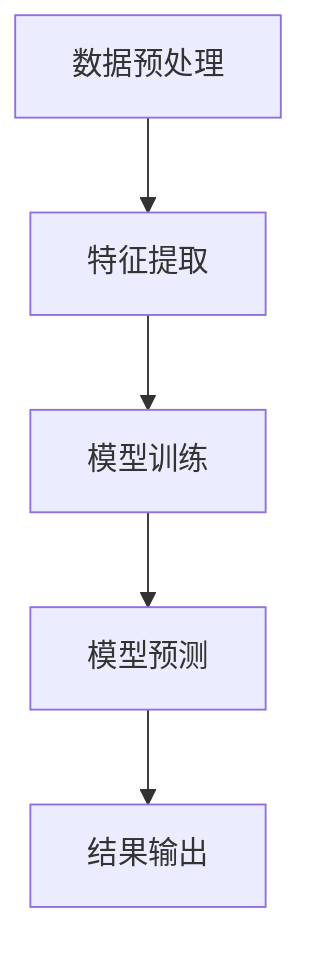
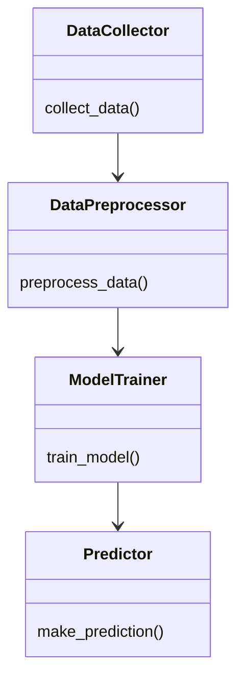
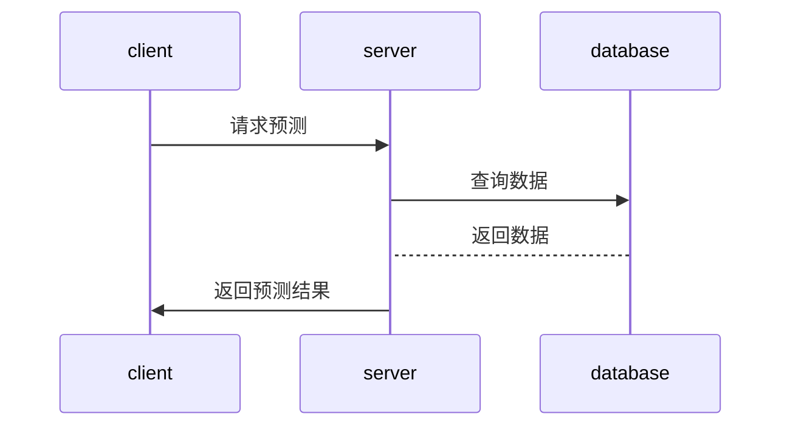

                 


# AI agents协作进行全球资金流动分析：预测市场走向

## 关键词：AI代理、全球资金流动分析、市场预测、分布式计算、时间序列分析、机器学习

## 摘要：  
本文深入探讨了AI代理协作在全球资金流动分析中的应用，通过详细的技术分析和实例，展示了如何利用AI代理协作预测市场走向。文章从背景介绍、核心概念、算法原理、系统架构到项目实战，全面解析了AI代理在金融分析中的潜力和实现路径。通过本文，读者将了解如何利用AI代理协作技术，结合先进的算法和数学模型，实现对全球资金流动的实时分析和预测，从而为投资决策提供科学依据。

---

# 第1章: 全球资金流动分析的背景与问题描述

## 1.1 问题背景

### 1.1.1 全球资金流动分析的现状  
全球资金流动分析是金融领域的核心任务之一，涉及股票、债券、外汇等多种资产的流动情况。传统的资金流动分析依赖于人工经验，存在效率低、误差大、覆盖面有限等问题。随着金融市场的复杂化和全球化，传统的分析方法已无法满足现代金融的需求。

### 1.1.2 当前分析方法的局限性  
传统的资金流动分析方法主要依赖统计模型和人工经验，存在以下问题：  
1. 数据处理能力有限：无法实时处理海量数据，难以捕捉短期波动。  
2. 模型单一：传统模型难以应对复杂的市场环境和非线性关系。  
3. 信息孤岛：不同数据源之间难以有效整合，影响分析结果的准确性。  

### 1.1.3 AI技术在金融分析中的潜力  
AI技术的快速发展为资金流动分析提供了新的可能性。AI代理可以通过分布式计算、实时数据处理和深度学习算法，显著提升分析效率和准确性。AI代理的协作能力使其能够同时处理多个数据源，捕捉市场中的潜在规律。

## 1.2 问题描述

### 1.2.1 资金流动分析的核心目标  
资金流动分析的核心目标是通过对全球资金流动的实时监测，预测市场的未来走势，帮助投资者做出更科学的决策。  

### 1.2.2 当前分析工具的不足  
当前的分析工具主要依赖统计模型和人工经验，存在以下不足：  
1. 数据处理速度慢，难以实时分析。  
2. 模型缺乏灵活性，难以应对复杂多变的市场环境。  
3. 单一模型难以覆盖全球市场的复杂性。  

### 1.2.3 AI代理协作的必要性  
AI代理协作能够通过分布式计算和多模型协同，克服传统方法的不足。AI代理可以通过分工合作，分别处理不同数据源和任务，从而实现更高效、更准确的分析。

## 1.3 问题解决

### 1.3.1 AI代理协作的优势  
AI代理协作具有以下优势：  
1. 高效性：通过分布式计算，显著提升数据处理速度。  
2. 精准性：多个代理协同工作，降低单一模型的偏差。  
3. 灵活性：可以根据市场变化动态调整分析策略。  

### 1.3.2 多代理协作的基本原理  
多代理协作的基本原理是通过代理间的通信与协调，共同完成复杂任务。代理之间通过共享信息和任务分配，实现资源的最优利用。  

### 1.3.3 全球资金流动分析的具体实现  
通过AI代理协作，可以实现对全球多个市场的实时监测和分析。代理之间可以分工合作，分别负责数据采集、特征提取、模型训练和预测等任务。

## 1.4 边界与外延

### 1.4.1 分析范围的界定  
本文的研究范围主要集中在全球主要金融市场，包括股票、外汇和债券市场。  

### 1.4.2 系统的边界条件  
系统的边界条件包括数据来源的限制、计算资源的限制以及市场环境的复杂性。  

### 1.4.3 相关领域的关联性  
本文涉及的领域包括人工智能、金融分析、分布式计算和时间序列分析。这些领域的研究成果为本文提供了理论基础和技术支持。

## 1.5 概念结构与核心要素

### 1.5.1 核心概念的构成  
本文的核心概念包括AI代理、资金流动分析、分布式计算和时间序列分析。  

### 1.5.2 各要素之间的关系  
AI代理通过分布式计算实现资金流动分析，时间序列分析用于捕捉市场波动。  

### 1.5.3 系统的整体架构  
系统的整体架构包括数据采集、数据处理、模型训练和预测展示四个模块。

---

# 第2章: AI代理协作的核心概念与联系

## 2.1 AI代理的基本定义与特点

### 2.1.1 AI代理的定义  
AI代理是一种能够感知环境、执行任务的智能实体。它可以独立或协作完成特定任务。  

### 2.1.2 代理的核心属性  
1. 感知能力：通过传感器或数据源获取信息。  
2. 计划能力：制定任务执行计划。  
3. 执行能力：通过行动完成任务。  
4. 学习能力：通过经验优化行为。  

### 2.1.3 代理的分类与应用场景  
1. **单一代理**：独立完成任务，适用于简单场景。  
2. **多代理协作**：通过分工合作完成复杂任务，适用于金融市场分析。  

---

### 2.2 多代理协作的原理

#### 2.2.1 代理之间的通信机制  
代理之间通过共享信息和任务分配进行协作。常用的通信机制包括消息传递和共享数据库。  

#### 2.2.2 协作任务的分配策略  
1. **随机分配**：随机分配任务给代理。  
2. **负载均衡**：根据代理的负载情况动态分配任务。  

#### 2.2.3 代理协作的协调机制  
1. **同步机制**：确保代理之间同步任务进度。  
2. **冲突解决**：通过协商解决任务冲突。  

---

#### 2.2.4 全球资金流动分析中的AI代理协作  
AI代理协作在资金流动分析中的具体应用包括：  
1. 数据采集与预处理：代理负责从不同数据源采集和清洗数据。  
2. 特征提取与建模：代理负责提取特征并训练模型。  
3. 预测与反馈：代理负责生成预测结果并提供反馈。  

---

### 2.3 全球资金流动分析中的AI代理协作

#### 2.3.1 数据来源与处理  
数据来源包括股票价格、外汇汇率、债券收益率等。数据处理包括清洗、标准化和特征提取。  

#### 2.3.2 代理协作的具体流程  
1. 数据采集：代理从不同数据源获取数据。  
2. 数据预处理：代理对数据进行清洗和标准化。  
3. 特征提取：代理提取有助于预测的特征。  
4. 模型训练：代理训练预测模型。  
5. 预测与反馈：代理生成预测结果并提供反馈。  

#### 2.3.3 代理协作的优势与挑战  
优势：  
1. 高效性：通过分布式计算提升数据处理速度。  
2. 精准性：通过多模型协作降低预测误差。  

挑战：  
1. 代理间的通信开销：代理协作需要频繁通信，可能导致延迟。  
2. 模型协调难度：多个模型协作需要复杂的协调机制。  

---

# 第3章: AI代理协作的数学模型与算法原理

## 3.1 数据预处理与特征提取

### 3.1.1 数据清洗与标准化  
数据清洗包括去除缺失值、异常值和重复值。标准化包括归一化和标准化。  

### 3.1.2 特征选择与降维  
特征选择通过选择重要特征减少维度。常用方法包括相关性分析和Lasso回归。  

### 3.1.3 时间序列数据的处理  
时间序列数据的处理包括分解、滑动窗口和差分等方法。  

---

## 3.2 代理协作的算法实现

### 3.2.1 分布式计算框架  
常用的分布式计算框架包括MapReduce、Spark和Flink。  

### 3.2.2 代理间的信息传递机制  
信息传递机制包括消息队列和共享数据库。  

### 3.2.3 代理协作的具体流程  
1. 数据分配：代理被分配到不同的数据子集。  
2. 本地训练：代理在本地数据上训练模型。  
3. 模型融合：代理将本地模型上传到中心服务器，进行模型融合。  

---

## 3.3 算法原理

### 3.3.1 时间序列预测算法  
常用的时间序列预测算法包括ARIMA和LSTM。  

### 3.3.2 机器学习算法  
常用的机器学习算法包括线性回归、随机森林和神经网络。  

---

## 3.4 数学模型

### 3.4.1 时间序列模型：ARIMA  
ARIMA模型的数学表达式为：  
$$ARIMA(p, d, q)$$  
其中，p为自回归阶数，d为差分阶数，q为移动平均阶数。  

### 3.4.2 机器学习模型：LSTM  
LSTM的数学表达式为：  
$$f(t) = \sigma(g(t) + \gamma g(t-1))$$  
其中，$\sigma$为sigmoid函数，$\gamma$为遗忘门权重。  

---

## 3.5 算法实现

### 3.5.1 数据预处理代码  
```python
import pandas as pd
import numpy as np

# 数据清洗
data = pd.read_csv('data.csv')
data.dropna(inplace=True)
data = data[~data.duplicated()]
```

### 3.5.2 特征提取代码  
```python
from sklearn.preprocessing import StandardScaler

# 标准化
scaler = StandardScaler()
X_scaled = scaler.fit_transform(data.drop('label', axis=1))
```

### 3.5.3 模型训练代码  
```python
from sklearn.ensemble import RandomForestRegressor

# 随机森林训练
model = RandomForestRegressor(n_estimators=100, random_state=42)
model.fit(X_scaled, data['label'])
```

---

## 3.6 算法流程图  



---

## 3.7 算法实现中的注意事项

### 3.7.1 数据分布的影响  
数据分布不均可能影响模型性能，需进行数据增强。  

### 3.7.2 模型选择的影响  
不同模型适用于不同场景，需根据数据特点选择合适模型。  

### 3.7.3 超参数调优  
通过网格搜索或随机搜索进行超参数调优，提升模型性能。  

---

# 第4章: 系统分析与架构设计方案

## 4.1 问题场景介绍

### 4.1.1 系统目标  
系统目标是通过AI代理协作实现全球资金流动分析和市场预测。  

### 4.1.2 业务流程  
1. 数据采集：代理从不同数据源采集数据。  
2. 数据预处理：代理清洗和标准化数据。  
3. 模型训练：代理训练预测模型。  
4. 预测与反馈：代理生成预测结果并提供反馈。  

---

## 4.2 项目介绍

### 4.2.1 项目目标  
项目目标是开发一个基于AI代理协作的资金流动分析系统。  

### 4.2.2 项目范围  
项目范围包括数据采集、数据处理、模型训练和预测展示。  

---

## 4.3 系统功能设计

### 4.3.1 领域模型（mermaid类图）  


---

### 4.3.2 系统架构设计（mermaid架构图）  


---

### 4.3.3 系统接口设计  
系统接口包括数据接口、模型接口和预测接口。  

---

### 4.3.4 系统交互流程（mermaid序列图）  


---

## 4.4 系统架构设计

### 4.4.1 服务器端架构  
服务器端包括数据采集、数据处理和模型训练模块。  

### 4.4.2 客户端架构  
客户端包括数据展示和预测结果展示模块。  

### 4.4.3 系统接口设计  
系统接口包括数据接口、模型接口和预测接口。  

---

## 4.5 系统实现

### 4.5.1 数据采集代码  
```python
import requests

# 从API获取数据
response = requests.get('https://api.example.com/data')
data = response.json()
```

### 4.5.2 数据处理代码  
```python
import pandas as pd

# 数据转换为DataFrame
df = pd.DataFrame(data)
```

---

## 4.6 系统交互流程

### 4.6.1 系统交互的流程  
1. 客户端向服务器发送预测请求。  
2. 服务器查询数据库获取数据。  
3. 服务器训练模型生成预测结果。  
4. 服务器将预测结果返回客户端。  

### 4.6.2 系统交互的注意事项  
1. 数据安全：需确保数据传输加密。  
2. 系统性能：需优化服务器响应速度。  
3. 系统可靠性：需设计容错机制。  

---

## 4.7 系统测试与优化

### 4.7.1 系统测试  
系统测试包括功能测试、性能测试和安全测试。  

### 4.7.2 系统优化  
系统优化包括算法优化、架构优化和资源优化。  

---

# 第5章: 项目实战

## 5.1 环境安装

### 5.1.1 安装Python  
安装Python 3.8及以上版本。  

### 5.1.2 安装依赖库  
安装pandas、numpy、scikit-learn等库。  

---

## 5.2 核心代码实现

### 5.2.1 数据采集代码  
```python
import requests

def collect_data():
    response = requests.get('https://api.example.com/data')
    return response.json()
```

### 5.2.2 数据处理代码  
```python
import pandas as pd

def preprocess_data(data):
    df = pd.DataFrame(data)
    df.dropna(inplace=True)
    return df
```

---

### 5.2.3 模型训练代码  
```python
from sklearn.ensemble import RandomForestRegressor

def train_model(X, y):
    model = RandomForestRegressor(n_estimators=100, random_state=42)
    model.fit(X, y)
    return model
```

---

## 5.3 代码解读与分析

### 5.3.1 数据采集函数  
数据采集函数通过API获取数据，返回JSON格式的数据。  

### 5.3.2 数据处理函数  
数据处理函数将JSON数据转换为DataFrame，并删除缺失值。  

### 5.3.3 模型训练函数  
模型训练函数使用随机森林算法训练模型，返回训练好的模型。  

---

## 5.4 实际案例分析

### 5.4.1 数据来源  
数据来源包括股票价格、外汇汇率和债券收益率。  

### 5.4.2 数据处理  
对数据进行清洗和标准化处理。  

### 5.4.3 模型训练  
使用随机森林算法训练模型，预测市场走势。  

---

## 5.5 项目小结

### 5.5.1 项目实现的关键点  
1. 数据采集与处理：确保数据的准确性和完整性。  
2. 模型训练：选择合适的算法并进行参数调优。  
3. 系统交互：实现高效的系统接口和交互流程。  

### 5.5.2 项目实现的难点  
1. 数据量大：需要高效的分布式计算框架。  
2. 模型复杂：需要复杂的算法优化和调优。  
3. 系统性能：需要优化服务器响应速度和系统可靠性。  

---

# 第6章: 总结与展望

## 6.1 总结

### 6.1.1 核心内容回顾  
本文详细探讨了AI代理协作在全球资金流动分析中的应用，通过背景介绍、核心概念、算法原理、系统架构和项目实战，全面解析了AI代理在金融分析中的潜力和实现路径。  

### 6.1.2 本文的主要贡献  
本文的主要贡献包括：  
1. 提出了基于AI代理协作的资金流动分析方法。  
2. 详细讲解了算法实现和系统架构设计。  
3. 提供了完整的项目实战代码和案例分析。  

---

## 6.2 展望

### 6.2.1 研究的局限性  
1. 数据来源的限制：目前仅考虑了部分数据源，未来可以引入更多数据源。  
2. 模型的局限性：目前使用的模型较为简单，未来可以尝试更复杂的深度学习模型。  
3. 系统性能的限制：目前的系统性能有限，未来可以通过优化算法和架构提升性能。  

### 6.2.2 未来研究方向  
1. 探索更高效的分布式计算框架。  
2. 研究更先进的深度学习模型。  
3. 探索更智能的系统优化方法。  

---

## 6.3 最佳实践 Tips

### 6.3.1 数据处理  
1. 数据清洗是关键，确保数据的准确性和完整性。  
2. 数据标准化有助于提升模型性能。  

### 6.3.2 模型选择  
1. 根据数据特点选择合适的模型。  
2. 通过网格搜索进行超参数调优。  

### 6.3.3 系统优化  
1. 优化服务器响应速度。  
2. 设计容错机制提升系统可靠性。  

---

## 6.4 小结

通过本文的分析与实践，我们可以看到，AI代理协作在资金流动分析中的应用前景广阔。未来，随着AI技术的不断发展，AI代理协作将为金融分析带来更多的创新和突破。

---

## 6.5 注意事项

### 6.5.1 数据安全  
数据安全是系统设计中的重要环节，需确保数据传输和存储的安全性。  

### 6.5.2 系统性能  
系统性能是影响用户体验的关键因素，需通过优化算法和架构提升系统性能。  

### 6.5.3 模型解释性  
模型的解释性是实际应用中的重要需求，需通过可视化和解释性分析提升模型的可解释性。  

---

## 6.6 拓展阅读

### 6.6.1 推荐书籍  
1. 《机器学习实战》  
2. 《分布式系统：概念与设计原理》  
3. 《时间序列分析：方法与应用》  

### 6.6.2 推荐论文  
1. "Distributed Machine Learning"  
2. "Time Series Analysis in Financial Markets"  
3. "Multi-Agent Collaboration in Financial Analysis"  

---

## 作者：AI天才研究院/AI Genius Institute & 禅与计算机程序设计艺术/Zen And The Art of Computer Programming

