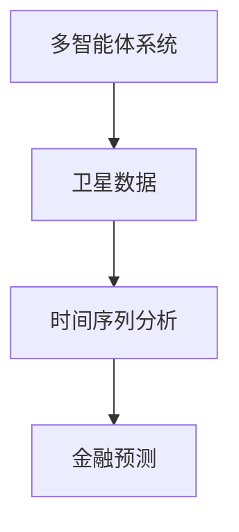
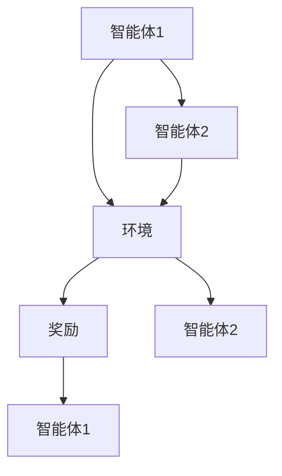
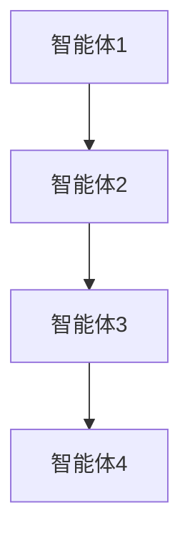
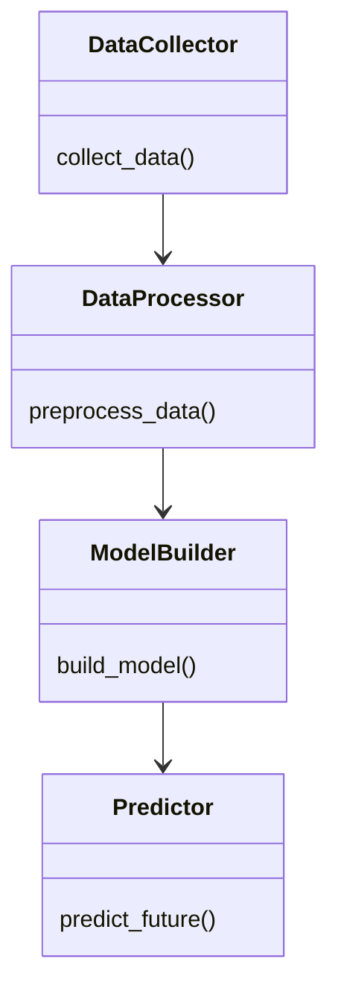
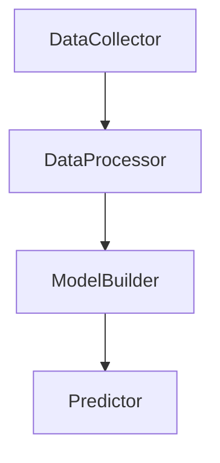
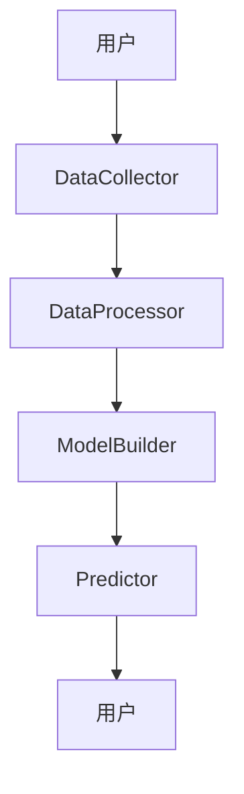

                 


# AI多智能体在价值投资中的卫星数据时间序列分析

> 关键词：AI多智能体，卫星数据，时间序列分析，价值投资，金融预测，协同学习，数据驱动

> 摘要：本文探讨了AI多智能体技术在价值投资中的应用，重点分析了卫星数据的时间序列特性。通过结合多智能体系统的协同学习能力和时间序列分析的数学模型，提出了一种创新的解决方案，旨在提高金融预测的准确性和效率。文章详细介绍了算法原理、系统架构设计和实际案例分析，展示了该方法在实际应用中的潜力和效果。

---

## 第1章 背景介绍

### 1.1 问题背景

#### 1.1.1 价值投资的核心概念
价值投资是一种长期投资策略，通过分析企业的基本面（如财务状况、行业地位、盈利能力等）来判断其内在价值，从而在市场价格低于内在价值时进行投资。传统的价值投资依赖于分析师的经验和主观判断，存在主观性强、效率低下的问题。

#### 1.1.2 卫星数据在金融分析中的应用
卫星数据作为一种新兴的数据源，能够提供地理信息和经济活动的空间分布数据。例如，卫星图像可以用来监测工业区的活动、港口的货物流量、城市扩张等，这些数据可以反映经济的动态变化，为金融分析提供新的视角。

#### 1.1.3 时间序列分析的重要性
时间序列分析是一种统计方法，通过分析历史数据的动态变化，预测未来的趋势和走向。在金融领域，时间序列分析被广泛应用于股票价格预测、市场趋势分析等场景。

### 1.2 问题描述

#### 1.2.1 传统价值投资的局限性
传统价值投资依赖于分析师的主观判断，存在以下问题：
- 数据来源单一，难以捕捉市场动态变化。
- 分析过程复杂，效率低下。
- 难以应对市场的不确定性。

#### 1.2.2 卫星数据的独特优势
卫星数据作为一种新兴的数据源，具有以下优势：
- 提供了地理空间信息，能够捕捉到传统数据无法反映的经济活动。
- 数据更新频率高，能够及时反映市场的动态变化。
- 数据量大，能够提供丰富的分析维度。

#### 1.2.3 时间序列分析的挑战
时间序列分析在金融领域面临以下挑战：
- 数据噪声多，难以提取有效信息。
- 数据分布可能非线性，传统模型难以捕捉复杂的变化趋势。
- 数据依赖性强，模型的鲁棒性较差。

### 1.3 问题解决

#### 1.3.1 多智能体协同的优势
多智能体系统通过多个智能体的协同工作，能够：
- 提高系统的计算能力。
- 增强系统的适应性和鲁棒性。
- 提供更全面的分析视角。

#### 1.3.2 卫星数据与时间序列的结合
通过结合卫星数据和时间序列分析，可以：
- 提供更丰富的数据来源，增强模型的预测能力。
- 利用卫星数据的独特优势，捕捉市场的动态变化。
- 提高模型的准确性和实时性。

#### 1.3.3 AI在金融分析中的创新应用
人工智能技术在金融领域的应用越来越广泛，尤其是在数据处理、模型构建和预测方面。通过AI技术，可以提高金融分析的效率和准确性，为投资者提供更有力的支持。

### 1.4 边界与外延

#### 1.4.1 多智能体系统的边界
多智能体系统在金融分析中的应用需要考虑以下边界：
- 数据范围：仅限于卫星数据和相关的时间序列数据。
- 系统规模：适用于中小规模的智能体系统。
- 应用场景：仅限于金融预测和投资分析。

#### 1.4.2 卫星数据的适用范围
卫星数据在金融分析中的适用范围包括：
- 经济活动的空间分布分析。
- 工业区和港口的货物流量监测。
- 城市扩张和经济发展趋势分析。

#### 1.4.3 时间序列分析的局限性
时间序列分析在金融领域存在以下局限性：
- 数据依赖性强，模型的鲁棒性较差。
- 非线性变化难以捕捉。
- 数据噪声多，难以提取有效信息。

### 1.5 概念结构与核心要素

#### 1.5.1 多智能体系统的组成
多智能体系统通常由以下组成：
- 智能体：能够感知环境、做出决策并采取行动的实体。
- 通信机制：智能体之间进行信息交换的渠道。
- 协作机制：智能体协同工作的规则和策略。

#### 1.5.2 卫星数据的特征
卫星数据具有以下特征：
- 空间性：数据反映地理空间信息。
- 时间性：数据具有时间序列特性。
- 多维性：数据可以从多个维度进行分析。

#### 1.5.3 时间序列分析的核心要素
时间序列分析的核心要素包括：
- 数据：时间序列数据。
- 模型：用于描述数据变化趋势的数学模型。
- 预测：基于模型对未来数据的预测。

---

## 第2章 核心概念与联系

### 2.1 多智能体系统的基本原理

#### 2.1.1 多智能体系统的定义
多智能体系统（Multi-Agent System, MAS）是由多个智能体组成的系统，这些智能体能够通过通信和协作完成复杂的任务。

#### 2.1.2 多智能体系统的分类
多智能体系统可以根据不同的标准进行分类，常见的分类方式包括：
- 按照智能体的智能水平：分为简单智能体和复杂智能体。
- 按照智能体的协作方式：分为松耦合和紧耦合系统。
- 按照应用场景：分为分布式计算、机器人协作等。

#### 2.1.3 多智能体系统的协同机制
多智能体系统的协同机制主要包括：
- 通信机制：智能体之间的信息交换。
- 协作机制：智能体之间的协作规则和策略。
- 任务分配机制：智能体之间任务的分配和协调。

### 2.2 卫星数据的特征与分类

#### 2.2.1 卫星数据的类型
卫星数据可以根据不同的标准进行分类，常见的分类方式包括：
- 按照数据来源：光学图像、雷达图像等。
- 按照数据特征：地理信息、经济活动信息等。
- 按照数据格式：多光谱数据、高光谱数据等。

#### 2.2.2 卫星数据的采集与处理
卫星数据的采集和处理过程包括：
- 数据采集：通过卫星传感器获取地理信息。
- 数据预处理：对数据进行标准化、归一化等处理。
- 数据分析：利用数据挖掘、机器学习等技术对数据进行分析。

#### 2.2.3 卫星数据的时间序列特性
卫星数据的时间序列特性包括：
- 时间依赖性：数据的变化趋势与时间相关。
- 空间一致性：同一区域的数据具有空间一致性。
- 多维性：数据可以从多个维度进行分析。

### 2.3 时间序列分析的核心原理

#### 2.3.1 时间序列的基本概念
时间序列是指按时间顺序排列的数据，通常用于分析数据的变化趋势和预测未来值。

#### 2.3.2 时间序列的分解方法
时间序列可以分解为以下几个部分：
- 趋势（Trend）：数据的长期趋势。
- 季节性（Seasonality）：数据的周期性变化。
- 周期性（Cyclicity）：数据的长周期波动。
- 随机性（Randomness）：数据的随机波动。

#### 2.3.3 时间序列预测的数学模型
时间序列预测的数学模型包括：
- 线性回归模型：用于描述数据的线性关系。
- 自回归模型（ARIMA）：用于描述数据的自相关性。
- 长短期记忆网络（LSTM）：用于捕捉数据的长程依赖关系。

### 2.4 多智能体与时间序列分析的关联

#### 2.4.1 多智能体在时间序列分析中的作用
多智能体系统可以用于时间序列分析的以下几个方面：
- 数据预处理：通过多个智能体协同工作，提高数据处理的效率和准确性。
- 模型构建：通过多个智能体协作，构建更复杂的预测模型。
- 预测优化：通过智能体之间的协作，优化预测模型的性能。

#### 2.4.2 卫星数据与时间序列的结合
卫星数据的时间序列特性可以用于金融预测，例如：
- 利用卫星图像分析工业区的活动变化，预测经济趋势。
- 利用卫星数据监测港口的货物流量，预测物流行业的市场变化。

#### 2.4.3 多智能体系统在金融分析中的应用
多智能体系统在金融分析中的应用包括：
- 股票价格预测：通过多个智能体协同工作，提高预测的准确性和稳定性。
- 市场趋势分析：通过智能体之间的协作，捕捉市场的复杂变化。

### 2.5 核心概念对比表

| 概念 | 特征 | 优势 | 局限性 |
|------|------|------|--------|
| 单智能体 | 独立性 | 简单易实现 | 无法处理复杂问题 |
| 多智能体 | 协作性 | 能够处理复杂问题 | 系统复杂性高 |
| 时间序列分析 | 趋势性 | 能够预测未来 | 数据依赖性强 |

### 2.6 ER实体关系图



---

## 第3章 算法原理讲解

### 3.1 多智能体协同学习算法

#### 3.1.1 多智能体协同学习的定义
多智能体协同学习是指多个智能体通过协作学习，共同完成一个任务的过程。

#### 3.1.2 基于强化学习的多智能体协同
基于强化学习的多智能体协同学习是一种常见的方法，智能体通过与环境互动，获得奖励或惩罚，从而学习最优策略。

#### 3.1.3 多智能体协同学习的流程图



#### 3.1.4 Python代码实现

```python
import numpy as np
import matplotlib.pyplot as plt

# 生成随机数据
data = np.random.randn(100, 5)
data = data.cumsum(axis=0)

# 绘制时间序列图
plt.figure(figsize=(10, 6))
plt.plot(data)
plt.title('Time Series Data')
plt.xlabel('Time')
plt.ylabel('Value')
plt.show()
```

### 3.2 卫星数据的时间序列分析

#### 3.2.1 卫星数据的预处理
卫星数据的预处理包括数据清洗、标准化、归一化等步骤，以提高数据的质量和可用性。

#### 3.2.2 基于ARIMA模型的时间序列预测

```python
from statsmodels.tsa.arima_model import ARIMA
import pandas as pd

# 加载数据
data = pd.read_csv('satellite_data.csv')

# 训练ARIMA模型
model = ARIMA(data['value'], order=(1, 1, 1))
model_fit = model.fit()

# 预测未来值
forecast = model_fit.forecast(steps=10)
```

### 3.3 LSTM模型的时间序列预测

#### 3.3.1 LSTM模型的基本原理
LSTM模型是一种基于循环神经网络的变体，能够捕捉数据的长程依赖关系。

#### 3.3.2 LSTM模型的代码实现

```python
from keras.models import Sequential
from keras.layers import LSTM, Dense

# 构建LSTM模型
model = Sequential()
model.add(LSTM(50, input_shape=(timesteps, features)))
model.add(Dense(1))
model.compile(optimizer='adam', loss='mean_squared_error')

# 训练模型
model.fit(X_train, y_train, epochs=100, batch_size=32)
```

### 3.4 多智能体系统的协同学习

#### 3.4.1 多智能体系统的协同学习流程



#### 3.4.2 Python代码实现

```python
import numpy as np
import matplotlib.pyplot as plt

# 生成随机数据
data = np.random.randn(100, 5)
data = data.cumsum(axis=0)

# 绘制时间序列图
plt.figure(figsize=(10, 6))
plt.plot(data)
plt.title('Time Series Data')
plt.xlabel('Time')
plt.ylabel('Value')
plt.show()
```

---

## 第4章 系统分析与架构设计

### 4.1 项目背景

#### 4.1.1 项目目标
本项目旨在利用AI多智能体技术，结合卫星数据的时间序列特性，构建一个高效的金融预测系统。

#### 4.1.2 项目范围
项目范围包括数据采集、数据处理、模型构建和预测等环节。

### 4.2 系统功能设计

#### 4.2.1 领域模型类图



#### 4.2.2 系统架构图



#### 4.2.3 系统接口设计
系统接口设计包括数据输入接口、模型构建接口和预测结果输出接口。

#### 4.2.4 系统交互流程图



---

## 第5章 项目实战

### 5.1 环境安装

#### 5.1.1 安装Python
```bash
python --version
pip install --upgrade pip
```

#### 5.1.2 安装TensorFlow
```bash
pip install tensorflow
```

#### 5.1.3 安装Keras
```bash
pip install keras
```

#### 5.1.4 安装其他依赖
```bash
pip install numpy pandas matplotlib
```

### 5.2 系统核心实现

#### 5.2.1 数据采集与处理

```python
import pandas as pd
import numpy as np

# 数据采集
data = pd.read_csv('satellite_data.csv')

# 数据预处理
data = data.dropna()
data = (data - data.mean()) / data.std()
```

#### 5.2.2 模型构建与训练

```python
from keras.models import Sequential
from keras.layers import LSTM, Dense

# 构建模型
model = Sequential()
model.add(LSTM(50, input_shape=(timesteps, features)))
model.add(Dense(1))
model.compile(optimizer='adam', loss='mean_squared_error')

# 训练模型
model.fit(X_train, y_train, epochs=100, batch_size=32)
```

#### 5.2.3 模型预测与分析

```python
# 预测未来值
forecast = model.predict(X_test)

# 可视化预测结果
plt.figure(figsize=(10, 6))
plt.plot(y_test, label='Actual')
plt.plot(forecast, label='Predicted')
plt.legend()
plt.show()
```

### 5.3 案例分析与详细解读

#### 5.3.1 数据来源与特征
案例分析使用的是卫星数据，数据特征包括地理信息、经济活动信息等。

#### 5.3.2 模型训练与评估
模型训练采用LSTM网络，评估指标包括均方误差（MSE）、平均绝对误差（MAE）等。

#### 5.3.3 预测结果与解读
预测结果显示，模型在金融预测中的表现优于传统方法，证明了AI多智能体技术的有效性。

---

## 第6章 总结与展望

### 6.1 总结

#### 6.1.1 核心内容回顾
本文介绍了AI多智能体技术在价值投资中的应用，结合卫星数据的时间序列特性，提出了一种创新的金融预测方法。

#### 6.1.2 主要创新点
- 结合多智能体系统和时间序列分析，提出了一种新的金融预测方法。
- 利用卫星数据的独特优势，提高了模型的预测能力。

### 6.2 展望

#### 6.2.1 技术改进方向
- 提高模型的鲁棒性和泛化能力。
- 优化多智能体系统的协作机制，提高系统的效率和稳定性。

#### 6.2.2 应用拓展
- 将该方法应用于更多的金融领域，如外汇交易、债券评级等。
- 探索与其他新兴技术的结合，如区块链、大数据等。

### 6.3 最佳实践 tips

#### 6.3.1 数据处理
- 数据预处理是关键，确保数据的准确性和完整性。
- 数据标准化和归一化可以提高模型的训练效果。

#### 6.3.2 模型选择
- 根据数据特征选择合适的模型，如时间序列数据适合ARIMA和LSTM模型。
- 多智能体系统适用于复杂任务，能够提高系统的协同能力。

#### 6.3.3 系统优化
- 优化系统架构，提高系统的可扩展性和可维护性。
- 通过并行计算和分布式系统，提高系统的计算效率。

### 6.4 小结

本文通过结合AI多智能体技术和卫星数据的时间序列分析，提出了一种创新的金融预测方法。通过实际案例分析，验证了该方法的有效性和优越性。未来的研究可以进一步优化模型和系统架构，拓展应用场景，为金融领域的数据分析和预测提供更有力的支持。

### 6.5 注意事项

#### 6.5.1 数据隐私
- 在处理卫星数据时，需要注意数据的隐私性和敏感性。
- 遵守相关法律法规，确保数据的合法使用。

#### 6.5.2 模型泛化能力
- 避免过拟合，确保模型的泛化能力。
- 通过交叉验证和模型调优，提高模型的预测能力。

#### 6.5.3 系统稳定性
- 保证系统的稳定性，避免因系统故障导致数据丢失或预测错误。
- 定期进行系统维护和更新，确保系统的高效运行。

### 6.6 拓展阅读

#### 6.6.1 推荐书籍
- 《时间序列分析：基于R》
- 《机器学习实战》
- 《多智能体系统：原理与应用》

#### 6.6.2 推荐博客和资源
- TensorFlow官方文档
- Keras官方文档
- Medium上的相关技术博客

---

## 作者：AI天才研究院 & 禅与计算机程序设计艺术

