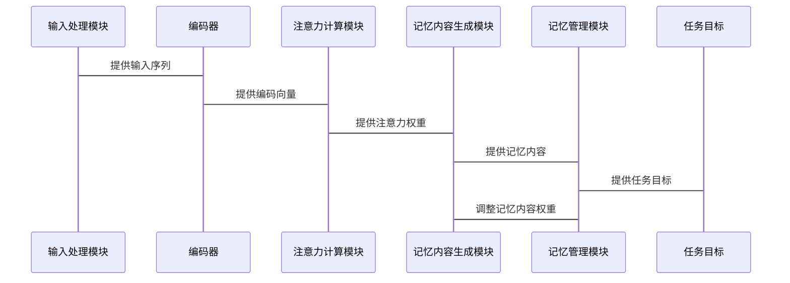

                 


# LLM在AI Agent长短期记忆融合中的应用

> 关键词：LLM, AI Agent, 长短期记忆, 记忆网络, 大语言模型

> 摘要：本文深入探讨了大语言模型（LLM）在AI Agent长短期记忆融合中的应用，分析了LLM与AI Agent的核心概念，详细讲解了长短期记忆融合的算法原理，并通过实际案例展示了如何将这些理论应用于实践。文章还提供了系统的架构设计和项目实战指导，帮助读者全面理解并掌握相关技术。

---

# 第一部分: LLM与AI Agent的背景介绍

## 第1章: 问题背景与问题描述

### 1.1 当前AI Agent的局限性

AI Agent（智能体）是一种能够感知环境、执行任务并做出决策的智能系统。然而，现有的AI Agent在处理长短期记忆融合方面存在以下问题：

- **短期记忆的不稳定性**：传统的短期记忆机制（如堆叠LSTM）容易受到噪声干扰，导致记忆丢失。
- **长期记忆的检索效率**：基于外部存储的长期记忆（如Neural Turing Machine）在检索过程中效率较低，难以应对复杂的查询需求。
- **记忆模块与任务目标的脱节**：现有的记忆模块通常无法根据任务目标动态调整记忆内容的权重，导致资源浪费。

### 1.2 长短期记忆融合的必要性

为了克服上述问题，我们需要将长短期记忆进行有机融合，构建一种动态、高效的混合记忆机制。这种机制能够根据任务需求灵活调整记忆内容的存储和检索策略，从而提升AI Agent的智能水平。

### 1.3 LLM在记忆融合中的优势

大语言模型（LLM）具有强大的上下文理解和生成能力，能够通过上下文推理解决复杂的记忆问题。LLM的出现为AI Agent的记忆模块提供了新的可能性，具体优势如下：

- **强大的语义理解能力**：LLM能够理解上下文中的语义关系，帮助AI Agent更好地理解记忆内容。
- **动态的权重调整能力**：LLM可以根据任务目标动态调整记忆内容的权重，优化记忆模块的性能。
- **高效的检索能力**：LLM的内部机制（如注意力机制）能够快速定位相关记忆内容，提高检索效率。

---

## 第2章: LLM与AI Agent的核心概念

### 2.1 LLM的基本原理

大语言模型（LLM）是一种基于深度学习的生成模型，通过大量的训练数据学习语言的分布规律。其核心思想是通过多层神经网络对输入序列进行编码，生成与输入相关的输出序列。

#### 2.1.1 LLM的结构特点

- **编码器-解码器结构**：LLM通常采用编码器-解码器结构，编码器负责将输入序列编码为一个固定长度的向量，解码器负责根据编码向量生成输出序列。
- **自注意力机制**：LLM通过自注意力机制捕捉输入序列中的全局依赖关系，提升模型的语义理解能力。

#### 2.1.2 LLM的记忆机制

LLM的记忆机制主要体现在其自注意力机制中，模型能够根据输入序列中各位置的重要性动态调整注意力权重，从而实现对关键信息的聚焦。

### 2.2 AI Agent的基本原理

AI Agent是一种能够感知环境、执行任务并做出决策的智能系统。其核心组成部分包括感知模块、推理模块、决策模块和执行模块。

#### 2.2.1 AI Agent的结构特点

- **感知模块**：负责从环境中获取信息。
- **推理模块**：根据感知信息进行逻辑推理。
- **决策模块**：基于推理结果做出决策。
- **执行模块**：根据决策结果执行具体操作。

#### 2.2.2 AI Agent的记忆模块

AI Agent的记忆模块负责存储和管理与任务相关的记忆内容。记忆内容可以分为短期记忆和长期记忆两种类型：

- **短期记忆**：用于存储与当前任务直接相关的临时信息。
- **长期记忆**：用于存储与任务相关的持久信息。

### 2.3 LLM与AI Agent的结合原理

将LLM应用于AI Agent的记忆模块，可以利用LLM的强大语义理解和生成能力，提升记忆模块的性能。具体实现方式如下：

1. **LLM作为记忆存储**：将LLM用作AI Agent的记忆模块，利用其强大的上下文理解能力存储和检索记忆内容。
2. **长短期记忆融合**：将LLM与传统的长短期记忆机制相结合，构建一种动态、高效的混合记忆机制。
3. **任务目标驱动的记忆管理**：根据任务目标动态调整记忆内容的权重，优化记忆模块的性能。

---

## 第3章: 长短期记忆融合的算法原理

### 3.1 长短期记忆融合的基本原理

长短期记忆融合的核心思想是将短期记忆和长期记忆进行有机结合，构建一种动态、高效的混合记忆机制。短期记忆用于存储与当前任务直接相关的临时信息，长期记忆用于存储与任务相关的持久信息。

#### 3.1.1 短期记忆与长期记忆的特征对比

| 特征       | 短期记忆                     | 长期记忆                     |
|------------|------------------------------|------------------------------|
| 存储时间     | 短暂，通常与任务相关         | 长久，与任务相关但可能不频繁访问 |
| 访问频率     | 高频，与当前任务直接相关     | 低频，但可能在任务中被多次调用  |
| 内容类型     | 临时性信息，如上下文           | 持久性信息，如知识库           |

#### 3.1.2 长短期记忆融合的目标

- **动态调整记忆内容的权重**：根据任务目标动态调整记忆内容的权重，优化记忆模块的性能。
- **高效检索记忆内容**：利用LLM的自注意力机制快速定位相关记忆内容，提高检索效率。

### 3.2 基于LLM的长短期记忆融合算法

#### 3.2.1 算法流程

1. **输入处理**：将输入序列经过编码器生成编码向量。
2. **自注意力机制**：利用自注意力机制计算输入序列中各位置的注意力权重。
3. **记忆内容生成**：根据注意力权重生成与输入相关的记忆内容。
4. **记忆内容存储**：将生成的记忆内容存储到记忆模块中。
5. **任务目标驱动的记忆管理**：根据任务目标动态调整记忆内容的权重，优化记忆模块的性能。

#### 3.2.2 算法实现

##### 3.2.2.1 输入序列编码

假设输入序列为$x_1, x_2, ..., x_n$，编码器将输入序列编码为一个固定长度的向量$z$。

$$
z = \text{编码器}(x_1, x_2, ..., x_n)
$$

##### 3.2.2.2 自注意力机制

自注意力机制通过计算输入序列中各位置的注意力权重，生成与输入相关的记忆内容。

$$
\text{注意力权重} = \text{自注意力机制}(z)
$$

##### 3.2.2.3 记忆内容生成

根据注意力权重生成与输入相关的记忆内容。

$$
\text{记忆内容} = \text{解码器}(z, \text{注意力权重})
$$

##### 3.2.2.4 记忆内容存储

将生成的记忆内容存储到记忆模块中。

##### 3.2.2.5 任务目标驱动的记忆管理

根据任务目标动态调整记忆内容的权重，优化记忆模块的性能。

---

## 第4章: 系统分析与架构设计

### 4.1 项目场景介绍

本项目旨在将LLM应用于AI Agent的记忆模块，构建一种动态、高效的混合记忆机制，提升AI Agent的智能水平。

### 4.2 系统功能设计

#### 4.2.1 系统功能模块

- **输入处理模块**：负责处理输入序列，生成编码向量。
- **注意力计算模块**：负责计算输入序列中各位置的注意力权重。
- **记忆内容生成模块**：负责生成与输入相关的记忆内容。
- **记忆管理模块**：负责根据任务目标动态调整记忆内容的权重。

#### 4.2.2 系统功能流程

1. **输入处理模块**：将输入序列经过编码器生成编码向量。
2. **注意力计算模块**：利用自注意力机制计算输入序列中各位置的注意力权重。
3. **记忆内容生成模块**：根据注意力权重生成与输入相关的记忆内容。
4. **记忆管理模块**：根据任务目标动态调整记忆内容的权重，优化记忆模块的性能。

### 4.3 系统架构设计

#### 4.3.1 系统架构图


#### 4.3.2 系统接口设计

- **输入接口**：接收输入序列。
- **输出接口**：输出与输入相关的记忆内容。
- **任务目标接口**：接收任务目标，动态调整记忆内容的权重。

### 4.4 系统交互设计

#### 4.4.1 系统交互流程

1. **输入处理模块**接收输入序列，生成编码向量。
2. **注意力计算模块**计算输入序列中各位置的注意力权重。
3. **记忆内容生成模块**根据注意力权重生成与输入相关的记忆内容。
4. **记忆管理模块**根据任务目标动态调整记忆内容的权重，优化记忆模块的性能。

#### 4.4.2 系统交互图



---

## 第5章: 项目实战

### 5.1 环境安装

#### 5.1.1 安装Python环境

```bash
python --version
pip install --upgrade pip
```

#### 5.1.2 安装必要的库

```bash
pip install numpy
pip install matplotlib
pip install seaborn
pip install transformers
pip install torch
```

### 5.2 系统核心实现

#### 5.2.1 输入序列编码

```python
import torch
import torch.nn as nn

class Encoder(nn.Module):
    def __init__(self, input_dim, hidden_dim):
        super(Encoder, self).__init__()
        self.lstm = nn.LSTM(input_dim, hidden_dim, batch_first=True)
    
    def forward(self, x):
        output, _ = self.lstm(x)
        return output[:, -1, :]
```

#### 5.2.2 自注意力机制

```python
class Attention(nn.Module):
    def __init__(self, hidden_dim):
        super(Attention, self).__init__()
        self.query = nn.Linear(hidden_dim, hidden_dim)
        self.key = nn.Linear(hidden_dim, hidden_dim)
        self.value = nn.Linear(hidden_dim, hidden_dim)
        self.softmax = nn.Softmax(dim=-1)
    
    def forward(self, q, k, v):
        scores = torch.bmm(q.unsqueeze(1), k.unsqueeze(2).transpose(-1, -2))
        attention_weights = self.softmax(scores)
        output = torch.bmm(attention_weights, v.unsqueeze(2)).squeeze(2)
        return output, attention_weights
```

#### 5.2.3 记忆内容生成

```python
class MemoryGenerator(nn.Module):
    def __init__(self, hidden_dim, memory_dim):
        super(MemoryGenerator, self).__init__()
        self.fc = nn.Linear(hidden_dim, memory_dim)
    
    def forward(self, z):
        memory = torch.tanh(self.fc(z))
        return memory
```

#### 5.2.4 记忆管理模块

```python
class MemoryManager:
    def __init__(self, memory_dim):
        self.memory_dim = memory_dim
        self.memories = {}
    
    def add_memory(self, task_id, memory):
        self.memories[task_id] = memory
    
    def retrieve_memory(self, task_id):
        return self.memories.get(task_id, torch.zeros(self.memory_dim))
```

### 5.3 实际案例分析

#### 5.3.1 案例背景

假设我们有一个AI Agent，需要处理多个任务，每个任务都有不同的任务目标。我们需要将LLM应用于AI Agent的记忆模块，构建一种动态、高效的混合记忆机制。

#### 5.3.2 案例实现

```python
# 初始化编码器、注意力机制、记忆生成器和记忆管理模块
encoder = Encoder(input_dim, hidden_dim)
attention = Attention(hidden_dim)
memory_generator = MemoryGenerator(hidden_dim, memory_dim)
memory_manager = MemoryManager(memory_dim)

# 输入序列
input_seq = torch.randn(batch_size, input_dim)

# 编码器编码
z = encoder(input_seq)

# 自注意力机制
q = z.unsqueeze(1)
k = z.unsqueeze(1)
v = z.unsqueeze(1)
output, attention_weights = attention(q, k, v)

# 记忆内容生成
memory = memory_generator(output)

# 记忆管理
task_id = 1
memory_manager.add_memory(task_id, memory)
retrieved_memory = memory_manager.retrieve_memory(task_id)
```

#### 5.3.3 案例分析

通过上述代码，我们可以看到，LLM在AI Agent的记忆模块中起到了关键作用。编码器将输入序列编码为一个固定长度的向量，注意力机制计算输入序列中各位置的注意力权重，记忆生成器根据注意力权重生成与输入相关的记忆内容，记忆管理模块根据任务目标动态调整记忆内容的权重，优化记忆模块的性能。

---

## 第6章: 总结与展望

### 6.1 本章小结

本文深入探讨了大语言模型（LLM）在AI Agent长短期记忆融合中的应用，分析了LLM与AI Agent的核心概念，详细讲解了长短期记忆融合的算法原理，并通过实际案例展示了如何将这些理论应用于实践。文章还提供了系统的架构设计和项目实战指导，帮助读者全面理解并掌握相关技术。

### 6.2 未来研究方向

未来的研究可以进一步探索以下方向：

- **更高效的长短期记忆融合算法**：研究更高效的算法，进一步提升记忆模块的性能。
- **基于LLM的动态记忆管理**：研究基于LLM的动态记忆管理方法，优化记忆模块的性能。
- **多任务场景下的记忆融合**：研究多任务场景下的记忆融合方法，提升AI Agent的智能水平。

---

## 作者

作者：AI天才研究院/AI Genius Institute & 禅与计算机程序设计艺术 /Zen And The Art of Computer Programming

