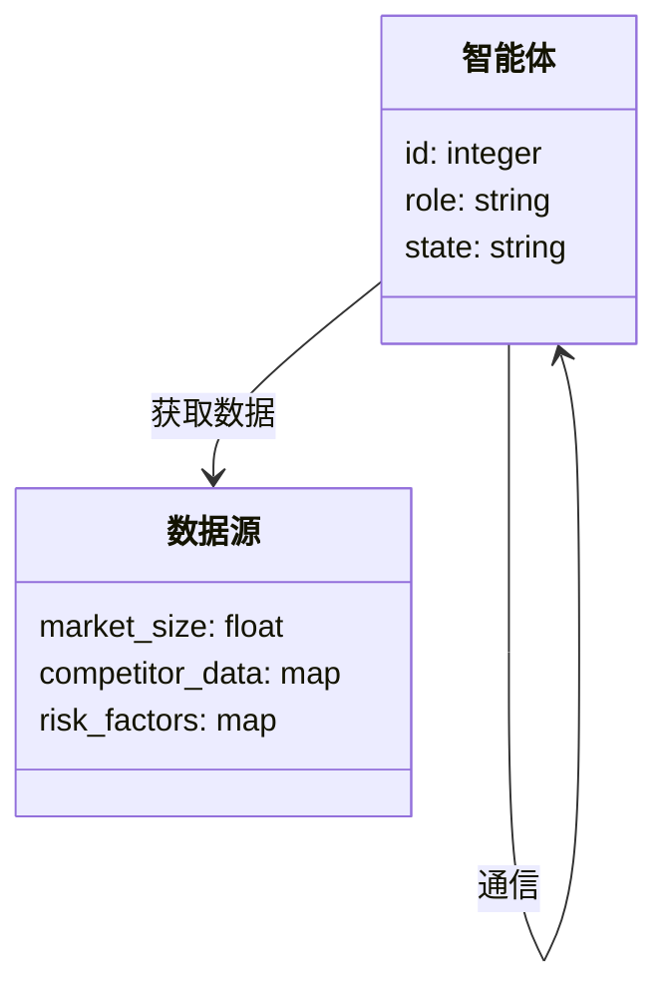
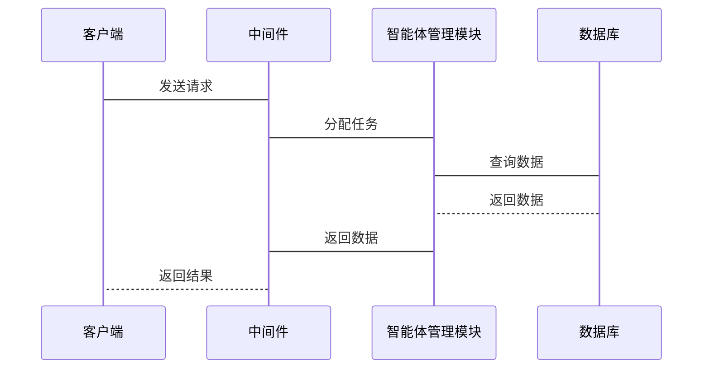

                 


# 多智能体系统在公司国际化战略评估中的应用

## 关键词：多智能体系统，国际化战略，战略评估，AI决策支持，协作优化，系统架构

## 摘要  
随着全球化进程的加速，企业国际化战略的制定和评估变得越来越复杂。传统的单一决策模型已难以应对多变的国际环境和复杂的利益相关者关系。多智能体系统（Multi-Agent System, MAS）作为一种新兴的人工智能技术，能够通过多个智能体的协作和互动，模拟现实世界中的复杂决策过程。本文将探讨如何将多智能体系统应用于公司国际化战略评估中，通过构建分布式、协作化的评估模型，帮助企业更好地应对国际化挑战。  

---

# 第一部分：多智能体系统基础

## 第1章：多智能体系统概述

### 1.1 多智能体系统的基本概念

#### 1.1.1 多智能体系统的定义  
多智能体系统（MAS）是由多个智能体组成的分布式系统，这些智能体能够通过协作完成复杂任务。每个智能体都是一个具备感知、决策和执行能力的实体，能够独立工作，同时与其他智能体进行交互和协作。

#### 1.1.2 多智能体系统的特征  
- **自主性**：智能体能够自主决策，无需外部干预。  
- **反应性**：能够实时感知环境变化并做出反应。  
- **协作性**：多个智能体通过协作完成复杂任务。  
- **分布性**：智能体分布在不同的空间或网络中，通过通信进行协作。  

#### 1.1.3 多智能体系统与单智能体系统的区别  
| 特性             | 单智能体系统        | 多智能体系统        |  
|------------------|---------------------|---------------------|  
| 决策中心化       | 单一决策中心       | 分布式决策         |  
| 协作能力         | 无协作能力         | 强协作能力         |  
| 复杂性           | 简单               | 复杂               |  

### 1.2 多智能体系统的体系结构

#### 1.2.1 分层体系结构  
分层体系结构将系统划分为多个层次，每个层次负责不同的功能。例如，感知层负责数据采集，决策层负责策略制定，执行层负责任务执行。

#### 1.2.2 分布式体系结构  
分布式体系结构中，每个智能体都具有独立的决策能力，通过通信协议进行协作。这种结构适用于大规模分布式环境。

#### 1.2.3 基于角色的体系结构  
基于角色的体系结构将智能体划分为不同的角色，每个角色负责特定的任务。例如，市场分析智能体负责收集市场数据，风险评估智能体负责评估风险。

### 1.3 多智能体系统的通信协议

#### 1.3.1 通信机制  
智能体之间的通信可以通过直接通信或间接通信完成。直接通信是指智能体之间直接交换信息，间接通信是指通过中间媒介进行信息传递。

#### 1.3.2 协议设计  
通信协议的设计需要考虑信息的格式、传输方式和安全性。例如，使用JSON格式进行数据传输，通过HTTPS协议保证通信安全。

#### 1.3.3 通信安全  
为了确保通信的安全性，可以采用加密技术（如AES加密）和身份验证机制（如JWT）。

### 1.4 多智能体系统的学习与优化

#### 1.4.1 分布式学习  
分布式学习是指多个智能体在不同的环境中学习，然后通过协作共享学习成果。例如，使用分布式机器学习框架（如Federated Learning）进行模型训练。

#### 1.4.2 协作学习  
协作学习是指多个智能体共同学习，通过协作提高整体的智能水平。例如，使用多智能体强化学习（Multi-Agent Reinforcement Learning, MARL）进行联合优化。

#### 1.4.3 强化学习在多智能体系统中的应用  
强化学习是一种通过试错机制优化决策的方法。在多智能体系统中，多个智能体通过强化学习协作完成复杂任务。

---

# 第二部分：多智能体系统在国际化战略评估中的应用

## 第2章：国际化战略评估的多智能体建模

### 2.1 国际化战略评估的核心要素

#### 2.1.1 市场分析  
市场分析包括目标市场的市场规模、竞争对手分析、消费者行为分析等。这些信息可以通过智能体的感知功能获取。

#### 2.1.2 竞争分析  
竞争分析包括竞争对手的市场份额、产品定位、竞争优势等。通过智能体之间的协作，可以实时更新竞争信息。

#### 2.1.3 风险评估  
风险评估包括政治风险、经济风险、法律风险等。通过智能体的预测模型，可以提前识别潜在风险。

### 2.2 多智能体系统在战略评估中的建模方法

#### 2.2.1 系统建模的基本原则  
- **简化性**：模型应尽量简化，突出关键因素。  
- **可扩展性**：模型应具有扩展性，能够适应新的需求。  
- **实时性**：模型应能够实时更新，反映最新的市场信息。  

#### 2.2.2 基于多智能体的模型构建  
以市场分析为例，可以构建多个智能体，分别负责收集市场数据、分析竞争对手、预测市场趋势。

#### 2.2.3 模型验证与优化  
通过实际数据验证模型的准确性，并通过参数调整优化模型的性能。

### 2.3 多智能体系统的评估指标

#### 2.3.1 智能体的性能指标  
- **响应时间**：智能体对请求的响应时间。  
- **准确性**：智能体预测的准确率。  
- **稳定性**：智能体在异常情况下的运行稳定性。  

#### 2.3.2 系统整体的评估指标  
- **系统吞吐量**：单位时间内完成的任务数量。  
- **系统延迟**：从请求到响应的平均时间。  
- **系统可用性**：系统在规定时间内正常运行的概率。  

#### 2.3.3 指标权重的确定方法  
可以通过层次分析法（AHP）确定各指标的权重，从而综合评估系统的性能。

### 2.4 本章小结  
本章介绍了国际化战略评估的核心要素，并提出了基于多智能体系统的建模方法，为后续的系统设计奠定了基础。

---

## 第3章：多智能体系统在国际化战略评估中的具体应用

### 3.1 国际化战略评估的流程

#### 3.1.1 战略目标的分解  
将整体战略目标分解为具体的子目标，例如市场拓展、品牌建设、风险控制等。

#### 3.1.2 数据的收集与处理  
通过智能体收集目标市场的数据，包括市场规模、竞争对手信息、消费者行为等，并进行清洗和预处理。

#### 3.1.3 模型的运行与分析  
运行多智能体模型，模拟不同战略的实施效果，并通过数据分析得出最优策略。

### 3.2 多智能体系统的协作机制

#### 3.2.1 协作规则的制定  
制定智能体之间的协作规则，例如信息共享的频率、协作的优先级等。

#### 3.2.2 协作过程中的冲突解决  
当多个智能体之间发生冲突时，需要通过协商或仲裁机制解决冲突。

#### 3.2.3 协作结果的评估  
通过评估协作效果，不断优化协作机制，提高系统的整体效率。

### 3.3 实际案例分析

#### 3.3.1 某跨国公司的国际化战略评估案例  
某跨国公司计划进入新兴市场，通过多智能体系统评估市场风险、竞争环境等，最终制定出最优的市场进入策略。

#### 3.3.2 案例中的多智能体系统设计  
- **智能体角色**：市场分析智能体、竞争分析智能体、风险评估智能体。  
- **通信协议**：使用JSON格式进行数据传输，通过HTTPS协议保证通信安全。  
- **协作机制**：采用分布式学习和协作学习相结合的方式，确保各智能体能够实时共享信息并优化决策。

### 3.4 本章小结  
本章通过实际案例分析，展示了多智能体系统在国际化战略评估中的具体应用，验证了其有效性和优势。

---

# 第三部分：系统设计与实现

## 第4章：系统设计与实现

### 4.1 系统功能设计

#### 4.1.1 领域模型  
通过Mermaid图展示领域模型，例如：



#### 4.1.2 系统架构设计  
通过Mermaid图展示系统架构，例如：


#### 4.1.3 系统接口设计  
通过Mermaid图展示系统接口，例如：



### 4.2 系统实现

#### 4.2.1 环境安装  
需要安装的环境包括：Python、Django框架、Redis、PostgreSQL等。

#### 4.2.2 核心代码实现  
以下是核心代码示例：

```python
class Agent:
    def __init__(self, role):
        self.role = role
        self.state = "idle"

    def get_data(self, data_source):
        # 获取数据
        pass

    def communicate(self, other_agent):
        # 智能体之间通信
        pass

    def make_decision(self):
        # 制定决策
        pass

class DataSource:
    def __init__(self):
        self.market_size = 0
        self.competitor_data = {}
        self.risk_factors = {}
```

#### 4.2.3 案例分析  
通过实际案例分析，展示系统在不同场景下的表现，并进行详细解读。

### 4.3 本章小结  
本章详细描述了系统的设计与实现过程，包括领域模型、系统架构、接口设计和核心代码实现。

---

# 第四部分：项目实战

## 第5章：项目实战

### 5.1 项目背景  
某跨国公司计划进入新兴市场，希望通过多智能体系统评估市场风险、竞争环境等，制定最优的市场进入策略。

### 5.2 核心代码实现  
以下是项目的核心代码示例：

```python
import json
import requests

class MarketAnalyzer:
    def __init__(self):
        self.url = "http://market_data_api"

    def get_market_size(self, region):
        response = requests.get(f"{self.url}/market_size/{region}")
        return json.loads(response.text)

class CompetitorAnalyzer:
    def __init__(self):
        self.url = "http://competitor_api"

    def get_competitor_data(self, region):
        response = requests.get(f"{self.url}/competitor_data/{region}")
        return json.loads(response.text)

class RiskEvaluator:
    def __init__(self):
        self.url = "http://risk_api"

    def evaluate_risk(self, region):
        response = requests.post(f"{self.url}/evaluate_risk", json={"region": region})
        return json.loads(response.text)

# 使用示例
market_analyzer = MarketAnalyzer()
competitor_analyzer = CompetitorAnalyzer()
risk_evaluator = RiskEvaluator()

region = "东南亚"
market_size = market_analyzer.get_market_size(region)
competitor_data = competitor_analyzer.get_competitor_data(region)
risk_assessment = risk_evaluator.evaluate_risk(region)

print(f"市场规模：{market_size}")
print(f"竞争对手数据：{competitor_data}")
print(f"风险评估：{risk_assessment}")
```

### 5.3 案例分析  
通过上述代码，展示了如何通过多智能体系统进行市场分析、竞争分析和风险评估，并根据评估结果制定最优的市场进入策略。

### 5.4 本章小结  
本章通过实际案例展示了多智能体系统在国际化战略评估中的具体应用，验证了其可行性和有效性。

---

# 第五部分：总结与展望

## 第6章：总结与展望

### 6.1 总结  
本文详细探讨了多智能体系统在公司国际化战略评估中的应用，通过构建分布式、协作化的评估模型，帮助企业更好地应对国际化挑战。通过实际案例分析和系统实现，验证了多智能体系统的有效性和优势。

### 6.2 展望  
未来，随着人工智能技术的不断发展，多智能体系统在国际化战略评估中的应用将更加广泛和深入。可以通过以下方式进一步优化和扩展：  
1. **算法优化**：进一步优化多智能体系统的协作机制和学习算法。  
2. **多模态数据融合**：将文本、图像、视频等多种数据类型融入系统，提升评估的全面性。  
3. **边缘计算**：通过边缘计算技术，进一步提升系统的实时性和响应速度。  
4. **可持续发展**：在国际化战略中融入可持续发展理念，推动全球经济的绿色转型。  

---

# 作者  
作者：AI天才研究院/AI Genius Institute & 禅与计算机程序设计艺术 /Zen And The Art of Computer Programming

