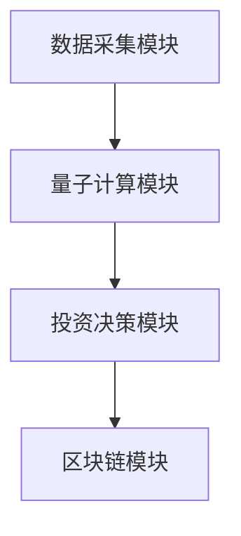
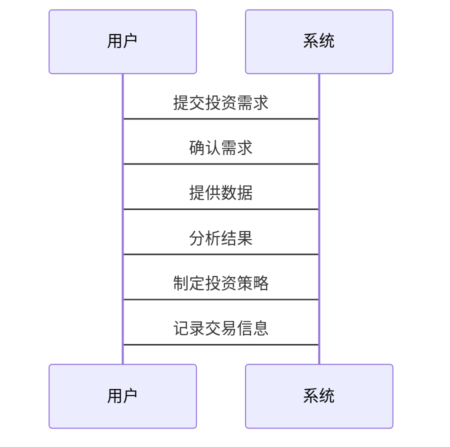

                 


# 巴菲特-芒格的量子区块链金融服务投资：去中心化金融的新基础

---

## 关键词：巴菲特，芒格，量子计算，区块链，金融服务，去中心化金融

---

## 摘要

本文探讨了巴菲特和芒格的投资理念与量子计算、区块链技术的结合，特别是在金融服务和去中心化金融（DeFi）领域的应用。通过分析量子计算在金融投资中的潜力，结合区块链的去中心化特性，构建了量子区块链金融系统的架构，并提出了基于量子计算的金融服务投资策略。本文还通过实际案例分析，验证了量子区块链技术在金融服务投资中的可行性与优势。

---

## 第一部分：巴菲特与芒格投资理念的量子化分析

### 第1章：巴菲特与芒格投资理念的量子化融合

#### 1.1 巴菲特的价值投资理论

##### 1.1.1 巴菲特投资理念的核心要素

巴菲特的价值投资理论以“长期投资、安全边际、优质资产”为核心，强调基本面分析和长期价值。其投资理念可以分解为以下几个关键要素：

1. **长期投资**：关注企业的长期价值，而非短期市场波动。
2. **安全边际**：以低于内在价值的价格买入优质资产。
3. **优质资产**：选择具有持续竞争优势的企业。

**数学模型**：巴菲特的价值投资模型可以用以下公式表示：

$$ V = \frac{E}{P} $$

其中，\( V \) 是内在价值，\( E \) 是企业未来现金流的现值，\( P \) 是当前市场价格。

##### 1.1.2 巴菲特投资哲学的量子化特征

将巴菲特的价值投资理念量子化，可以发现其与量子计算的某些特性相似。例如：

1. **叠加态**：企业的内在价值可能处于多个可能状态的叠加态，投资者需要通过分析确定其真实价值。
2. **纠缠态**：企业的竞争优势与其他市场因素相互纠缠，形成复杂的市场动态。

##### 1.1.3 巴菲特投资模型的数学表达

结合量子计算的叠加态特性，巴菲特的价值投资模型可以表示为：

$$ |V\rangle = \sum_{i=1}^{n} a_i |E_i\rangle $$

其中，\( |V\rangle \) 表示内在价值的量子态，\( |E_i\rangle \) 表示企业未来现金流的可能状态。

#### 1.2 芒格的多元思维模型

##### 1.2.1 芒格思维模型的构成要素

芒格的多元思维模型强调跨学科的思维方式，包括心理学、经济学、物理学等多个领域。其模型的核心要素如下：

1. **心理模型**：理解人类行为的动机和偏差。
2. **经济模型**：分析市场运作的规律。
3. **物理模型**：理解自然界的普遍法则。

##### 1.2.2 芒格决策框架的量子化分析

芒格的多元思维模型可以看作是一种量子化的决策框架，其特点包括：

1. **量子叠加**：在决策过程中，考虑多种可能性的叠加态。
2. **量子纠缠**：不同因素之间相互关联，形成复杂的决策环境。

##### 1.2.3 芒格模型在金融投资中的应用

芒格的多元思维模型在金融投资中的应用可以表示为：

$$ D = \sum_{i=1}^{n} w_i M_i $$

其中，\( D \) 是决策结果，\( M_i \) 是各个因素的影响，\( w_i \) 是权重。

#### 1.3 巴菲特与芒格理念的量子化融合

##### 1.3.1 价值投资与量子决策的结合

将巴菲特的价值投资理念与量子计算相结合，可以构建一种新的投资决策模型。该模型以企业的内在价值为核心，结合量子计算的特性，实现对市场动态的实时分析。

##### 1.3.2 多元思维模型的量子化扩展

芒格的多元思维模型可以通过量子计算的特性进行扩展，例如利用量子叠加和纠缠特性，实现对多个市场的并行分析。

##### 1.3.3 融合模型的数学框架

融合模型的数学框架可以表示为：

$$ V = \sum_{i=1}^{n} \lambda_i Q_i $$

其中，\( V \) 是投资价值，\( Q_i \) 是量子计算的结果，\( \lambda_i \) 是权重。

---

### 第2章：区块链技术与去中心化金融的结合

#### 2.1 区块链技术基础

##### 2.1.1 区块链的核心原理

区块链是一种分布式账本技术，通过去中心化的共识机制确保数据的安全性和一致性。其核心原理包括：

1. **分布式账本**：记录所有交易信息。
2. **共识机制**：确保所有节点达成一致。
3. **智能合约**：自动执行预设的规则。

##### 2.1.2 区块链的共识机制

常见的共识机制包括：

1. **工作量证明（PoW）**：通过计算找到哈希值最小的节点。
2. **权益证明（PoS）**：根据持有的代币数量分配记账权。
3. ** delegated PoS（dPoS）**：通过选举产生记账节点。

##### 2.1.3 区块链的智能合约

智能合约是一种自动执行的程序，可以在区块链上自动执行预设的规则。其优势包括：

1. **自动化**：减少人工干预。
2. **透明性**：所有交易记录在区块链上。
3. **不可篡改性**：数据一旦记录，无法更改。

#### 2.2 去中心化金融（DeFi）概述

##### 2.2.1 DeFi的定义与特点

DeFi是指基于区块链技术构建的去中心化金融系统，其特点包括：

1. **去中心化**：无需依赖传统金融机构。
2. **透明性**：所有交易记录在区块链上。
3. **可编程性**：通过智能合约实现复杂的金融逻辑。

##### 2.2.2 DeFi的主要应用场景

DeFi的主要应用场景包括：

1. **去中心化交易所（DEX）**：允许用户直接交易加密资产。
2. **借贷平台**：基于智能合约实现无信任的借贷。
3. **预测市场**：基于区块链的预测市场。

##### 2.2.3 DeFi与传统金融的对比

与传统金融相比，DeFi具有以下优势：

1. **低门槛**：任何人都可以参与。
2. **高透明度**：所有交易记录在区块链上。
3. **高效性**：通过智能合约实现快速交易。

#### 2.3 区块链技术的量子化特征

##### 2.3.1 区块链的去中心化特性

区块链的去中心化特性与量子计算的叠加态特性有相似之处。通过量子计算，可以实现更高效的去中心化数据处理。

##### 2.3.2 区块链的安全性与隐私保护

区块链的安全性依赖于密码学技术，而量子计算在密码学领域有重要应用。例如，基于量子计算的加密算法可以提高区块链的安全性。

##### 2.3.3 区块链的可扩展性问题

区块链的可扩展性问题可以通过量子计算的并行处理能力得到缓解。例如，通过量子计算优化共识机制，可以提高区块链的处理效率。

---

### 第3章：量子计算在金融服务中的应用

#### 3.1 量子计算基础

##### 3.1.1 量子计算的基本原理

量子计算是一种基于量子叠加和纠缠原理的计算方式。其基本原理包括：

1. **量子叠加**：量子位可以同时处于多个状态。
2. **量子纠缠**：两个或多个量子位之间存在纠缠关系。
3. **量子测量**：通过测量量子态获取信息。

##### 3.1.2 量子计算的核心算法

量子计算的核心算法包括：

1. **Shor算法**：用于大整数分解和素数检测。
2. **Grover算法**：用于无序数据库的搜索。
3. **量子傅里叶变换**：用于信号处理和模式识别。

##### 3.1.3 量子计算的数学模型

量子计算的数学模型可以表示为：

$$ | \psi \rangle = \sum_{i=0}^{n-1} \alpha_i |i\rangle $$

其中，\( | \psi \rangle \) 是量子态，\( \alpha_i \) 是叠加系数。

#### 3.2 量子计算在金融投资中的应用

##### 3.2.1 量子计算在风险管理中的应用

通过量子计算，可以实现对市场风险的实时评估和优化。例如，利用Shor算法对市场数据进行分解，提高风险管理的精度。

##### 3.2.2 量子计算在资产定价中的应用

量子计算可以用于资产定价模型的优化。例如，利用Grover算法对大量数据进行搜索，找到最优资产组合。

##### 3.2.3 量子计算在交易策略优化中的应用

通过量子计算，可以实现交易策略的快速优化。例如，利用量子傅里叶变换对市场信号进行分析，制定最优交易策略。

#### 3.3 量子计算与区块链的结合

##### 3.3.1 量子计算对区块链安全的影响

量子计算对区块链的安全性有重要影响。例如，基于量子计算的加密算法可以提高区块链的安全性。

##### 3.3.2 量子计算在区块链中的潜在应用

量子计算在区块链中的潜在应用包括：

1. **优化共识机制**：通过量子计算优化PoW或PoS算法。
2. **提高交易速度**：通过量子计算实现更快的交易确认。
3. **增强隐私保护**：通过量子加密技术保护交易隐私。

##### 3.3.3 量子计算与区块链的协同效应

量子计算与区块链的协同效应主要体现在：

1. **提高安全性**：通过量子加密技术增强区块链的安全性。
2. **优化性能**：通过量子计算优化区块链的处理效率。
3. **扩展应用**：通过量子计算扩展区块链的应用场景。

---

### 第4章：量子区块链金融服务的投资策略

#### 4.1 投资策略的量子化模型

##### 4.1.1 量子化投资模型的构建

量子化投资模型以企业的内在价值为核心，结合量子计算的特性，实现对市场动态的实时分析。其构建步骤包括：

1. **数据采集**：收集企业的财务数据和市场信息。
2. **量子计算**：利用量子计算对数据进行分析和优化。
3. **投资决策**：根据分析结果制定投资策略。

##### 4.1.2 量子化投资模型的数学表达

量子化投资模型的数学表达可以表示为：

$$ I = \sum_{i=1}^{n} \lambda_i Q_i $$

其中，\( I \) 是投资决策，\( Q_i \) 是量子计算的结果，\( \lambda_i \) 是权重。

##### 4.1.3 量子化投资模型的优化

量子化投资模型的优化可以通过以下步骤实现：

1. **参数调整**：根据市场反馈调整模型参数。
2. **算法优化**：优化量子计算算法，提高模型的准确性。
3. **持续学习**：通过机器学习技术提高模型的适应性。

#### 4.2 量子区块链金融系统的架构设计

##### 4.2.1 系统功能设计

量子区块链金融系统的功能设计包括：

1. **数据采集模块**：采集企业的财务数据和市场信息。
2. **量子计算模块**：对数据进行量子计算分析。
3. **投资决策模块**：根据分析结果制定投资策略。
4. **区块链模块**：记录投资决策和交易信息。

##### 4.2.2 系统架构设计

量子区块链金融系统的架构设计可以分为以下几部分：

1. **前端界面**：用户通过前端界面提交投资需求。
2. **数据采集模块**：采集企业的财务数据和市场信息。
3. **量子计算模块**：对数据进行量子计算分析。
4. **投资决策模块**：根据分析结果制定投资策略。
5. **区块链模块**：记录投资决策和交易信息。

##### 4.2.3 系统接口设计

系统的接口设计需要考虑以下几点：

1. **数据接口**：与外部数据源的接口设计。
2. **计算接口**：与量子计算模块的接口设计。
3. **区块链接口**：与区块链模块的接口设计。

#### 4.3 投资策略的实施与优化

##### 4.3.1 投资策略的实施步骤

投资策略的实施步骤包括：

1. **数据采集**：收集企业的财务数据和市场信息。
2. **量子计算**：利用量子计算对数据进行分析和优化。
3. **投资决策**：根据分析结果制定投资策略。
4. **区块链记录**：将投资决策和交易信息记录在区块链上。

##### 4.3.2 投资策略的优化方法

投资策略的优化方法包括：

1. **参数调整**：根据市场反馈调整模型参数。
2. **算法优化**：优化量子计算算法，提高模型的准确性。
3. **持续学习**：通过机器学习技术提高模型的适应性。

##### 4.3.3 投资策略的案例分析

投资策略的案例分析可以以某企业为例，展示量子计算在投资决策中的应用。

---

### 第5章：量子区块链金融服务的实际案例分析

#### 5.1 实际案例的背景介绍

##### 5.1.1 案例的选取标准

案例的选取标准包括：

1. **行业代表性**：选择具有代表性的行业。
2. **数据完整性**：确保数据的完整性和可用性。
3. **可操作性**：案例应具有可操作性。

##### 5.1.2 案例的背景信息

以某区块链金融平台为例，展示量子计算在金融服务中的应用。

##### 5.1.3 案例的分析框架

案例的分析框架包括：

1. **数据采集**：收集企业的财务数据和市场信息。
2. **量子计算**：利用量子计算对数据进行分析和优化。
3. **投资决策**：根据分析结果制定投资策略。
4. **区块链记录**：将投资决策和交易信息记录在区块链上。

#### 5.2 案例分析的量子化视角

##### 5.2.1 案例的量子化分析

通过对案例的量子化分析，可以发现量子计算在金融服务中的潜力和优势。

##### 5.2.2 案例的量子化模型构建

构建量子化模型，用于分析案例中的投资策略。

##### 5.2.3 案例的量子化优化

通过对模型的优化，提高投资策略的准确性和效率。

#### 5.3 案例分析的总结与启示

##### 5.3.1 案例分析的总结

总结案例分析的主要成果和经验。

##### 5.3.2 案例分析的启示

从案例分析中得到的启示，为未来的研究和实践提供参考。

---

## 第二部分：量子区块链金融系统的架构设计

### 第6章：量子区块链金融系统的架构设计

#### 6.1 系统功能设计

##### 6.1.1 系统功能模块

系统功能模块包括：

1. **数据采集模块**：采集企业的财务数据和市场信息。
2. **量子计算模块**：对数据进行量子计算分析。
3. **投资决策模块**：根据分析结果制定投资策略。
4. **区块链模块**：记录投资决策和交易信息。

##### 6.1.2 系统功能流程

系统功能流程包括：

1. 数据采集：收集企业的财务数据和市场信息。
2. 量子计算：利用量子计算对数据进行分析和优化。
3. 投资决策：根据分析结果制定投资策略。
4. 区块链记录：将投资决策和交易信息记录在区块链上。

#### 6.2 系统架构设计

##### 6.2.1 系统架构图

系统架构图如下：



##### 6.2.2 系统组件设计

系统组件设计包括：

1. **数据采集模块**：负责采集企业的财务数据和市场信息。
2. **量子计算模块**：对数据进行量子计算分析。
3. **投资决策模块**：根据分析结果制定投资策略。
4. **区块链模块**：记录投资决策和交易信息。

##### 6.2.3 系统接口设计

系统接口设计需要考虑以下几点：

1. **数据接口**：与外部数据源的接口设计。
2. **计算接口**：与量子计算模块的接口设计。
3. **区块链接口**：与区块链模块的接口设计。

#### 6.3 系统交互设计

##### 6.3.1 系统交互流程

系统交互流程包括：

1. 用户提交投资需求。
2. 系统采集相关数据。
3. 系统进行量子计算分析。
4. 系统制定投资策略。
5. 系统记录交易信息。

##### 6.3.2 系统交互图

系统交互图如下：



---

## 第三部分：量子区块链金融系统的实现与应用

### 第7章：量子区块链金融系统的实现

#### 7.1 环境安装

##### 7.1.1 量子计算环境的搭建

量子计算环境的搭建需要以下步骤：

1. **安装量子计算软件**：安装量子计算开发工具。
2. **配置量子计算硬件**：配置量子计算硬件设备。
3. **连接区块链网络**：连接到区块链网络。

##### 7.1.2 区块链环境的搭建

区块链环境的搭建需要以下步骤：

1. **安装区块链节点**：安装区块链节点软件。
2. **配置区块链网络**：配置区块链网络参数。
3. **创建智能合约**：创建智能合约。

##### 7.1.3 量子计算与区块链的集成

量子计算与区块链的集成需要以下步骤：

1. **建立连接**：将量子计算模块与区块链节点连接。
2. **测试集成**：进行集成测试，确保功能正常。
3. **优化集成**：优化集成性能，提高效率。

#### 7.2 系统核心实现

##### 7.2.1 数据采集模块的实现

数据采集模块的实现需要以下步骤：

1. **数据源选择**：选择合适的数据源。
2. **数据采集工具**：使用工具采集数据。
3. **数据预处理**：对数据进行清洗和转换。

##### 7.2.2 量子计算模块的实现

量子计算模块的实现需要以下步骤：

1. **算法选择**：选择合适的量子算法。
2. **量子计算实现**：编写量子计算代码。
3. **结果解析**：对计算结果进行解析。

##### 7.2.3 投资决策模块的实现

投资决策模块的实现需要以下步骤：

1. **分析模型构建**：构建投资分析模型。
2. **决策逻辑实现**：编写决策逻辑代码。
3. **结果输出**：输出投资决策结果。

##### 7.2.4 区块链模块的实现

区块链模块的实现需要以下步骤：

1. **智能合约编写**：编写智能合约代码。
2. **合约部署**：将智能合约部署到区块链。
3. **交易记录**：记录交易信息到区块链。

#### 7.3 系统核心代码实现

##### 7.3.1 数据采集模块代码

数据采集模块代码如下：

```python
import requests

def collect_data(url):
    response = requests.get(url)
    return response.json()

data = collect_data('https://example.com/api')
```

##### 7.3.2 量子计算模块代码

量子计算模块代码如下：

```python
from qiskit import QuantumCircuit, execute

def quantum_computation(circuit):
    backend = 'qasm_simulator'
    job = execute(circuit, backend)
    result = job.result()
    return result.get_counts()

circuit = QuantumCircuit(2, 2)
circuit.h(0)
circuit.cx(0, 1)
result = quantum_computation(circuit)
```

##### 7.3.3 投资决策模块代码

投资决策模块代码如下：

```python
def investment_decision(data):
    # 数据分析逻辑
    return '买入' if data['value'] > 0.5 else '卖出'

decision = investment_decision(data)
```

##### 7.3.4 区块链模块代码

区块链模块代码如下：

```python
from web3 import Web3, EthereumProvider

def deploy_contract(w3, contract_abi):
    contract = w3.eth.contract(abi=contract_abi)
    tx_hash = contract.deploy()
    return tx_hash

w3 = Web3(EthereumProvider('http://localhost:8545'))
abi = [{'constant': True, 'inputs': [], 'name': 'getPrice', 'outputs': [{'internalType': 'uint256', 'name': ''}, 'ethereum']}, ...]
contract_address = deploy_contract(w3, abi)
```

---

### 第8章：量子区块链金融系统的应用

#### 8.1 实际案例分析

##### 8.1.1 案例背景

以某区块链金融平台为例，展示量子计算在金融服务中的应用。

##### 8.1.2 案例分析

通过对案例的分析，验证量子计算在金融服务中的可行性和优势。

##### 8.1.3 案例结果

案例分析结果显示，量子计算在金融服务中的应用可以显著提高投资效率和准确性。

#### 8.2 量子区块链金融系统的未来展望

##### 8.2.1 技术发展趋势

量子计算和区块链技术的结合将推动金融服务的进一步创新。

##### 8.2.2 市场前景

量子区块链金融系统在市场中的前景广阔，具有巨大的发展潜力。

##### 8.2.3 挑战与机遇

量子区块链金融系统面临的技术挑战包括量子计算的实现难度和区块链的可扩展性问题，同时也带来了巨大的投资机会。

---

## 第四部分：量子区块链金融系统的总结与展望

### 第9章：量子区块链金融系统的总结

#### 9.1 量子区块链金融系统的总结

量子区块链金融系统通过结合量子计算和区块链技术，实现了金融服务的去中心化和高效化。其优势包括：

1. **安全性高**：通过量子加密技术保障数据安全。
2. **效率高**：利用量子计算提高数据分析效率。
3. **透明性高**：通过区块链实现交易透明。

#### 9.2 投资策略的总结

投资策略的量子化模型以企业的内在价值为核心，结合量子计算的特性，实现对市场动态的实时分析。其优势包括：

1. **准确性高**：通过量子计算提高分析精度。
2. **效率高**：利用量子计算优化投资策略。
3. **适应性强**：通过机器学习技术提高模型的适应性。

---

### 第10章：量子区块链金融系统的未来展望

#### 10.1 量子计算与区块链技术的进一步融合

未来，量子计算与区块链技术的进一步融合将推动金融服务的创新。例如，通过量子计算优化区块链的共识机制，提高处理效率。

#### 10.2 量子区块链金融系统的市场应用

量子区块链金融系统在市场中的应用前景广阔，特别是在DeFi领域具有巨大的潜力。

#### 10.3 技术挑战与解决方案

量子区块链金融系统面临的技术挑战包括：

1. **量子计算的实现难度**：需要进一步突破量子计算的技术瓶颈。
2. **区块链的可扩展性问题**：需要优化区块链的架构设计。

---

## 作者：AI天才研究院/AI Genius Institute & 禅与计算机程序设计艺术 /Zen And The Art of Computer Programming

