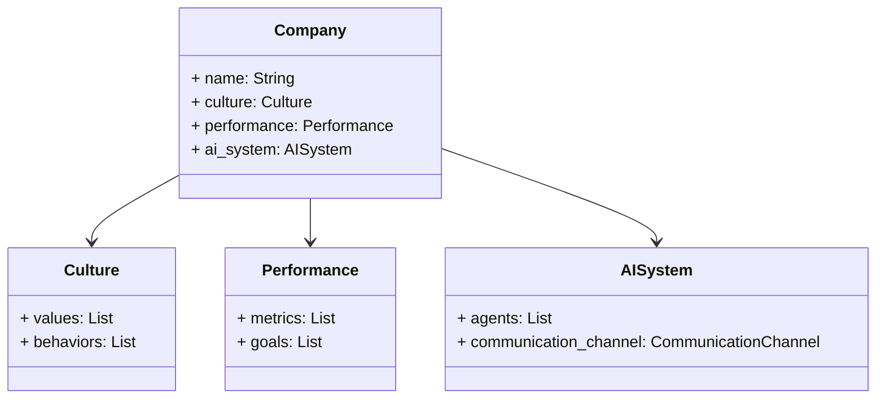
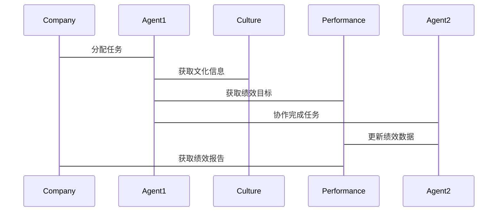

                 


```markdown
# 智能化公司文化与绩效关联分析：多智能体AI的新视角

> 关键词：智能化公司文化，绩效管理，多智能体AI，人工智能，企业绩效优化

> 摘要：本文从多智能体AI的视角，深入分析智能化公司文化与绩效之间的关联性。通过背景介绍、核心概念对比、算法原理、系统架构设计、项目实战等多维度展开，揭示多智能体AI在企业绩效管理中的应用价值，为企业管理者提供理论支持和实践指导。

---

## 第一部分: 智能化公司文化与绩效管理的背景与概念

### 第1章: 智能化公司文化与绩效管理概述

#### 1.1 智能化公司文化的定义与特征
##### 1.1.1 传统公司文化的演进
- 从工业时代到数字时代，公司文化经历了从注重等级制度到扁平化、开放化的演变。
- 传统公司文化强调命令-控制型管理，而现代公司文化更注重创新、协作和员工自主性。

##### 1.1.2 智能化公司文化的内涵
- 智能化公司文化是结合AI技术的企业文化，强调数据驱动、智能决策和个性化管理。
- 核心特征包括：数据化、智能化、个性化和动态优化。

##### 1.1.3 智能化公司文化的核心特征
| 特征 | 描述 |
|------|------|
| 数据驱动 | 通过AI技术分析员工行为和绩效数据，提供实时反馈和建议。 |
| 智能决策 | 利用AI算法优化公司文化和绩效管理策略。 |
| 个性化 | 根据员工特点定制管理方案。 |
| 动态优化 | 根据绩效结果动态调整管理策略。 |

#### 1.2 绩效管理的现状与挑战
##### 1.2.1 绩效管理的传统模式
- 基于KPI的传统绩效管理方法存在主观性强、反馈延迟等问题。
- 员工与管理者之间的信息不对称导致绩效评估缺乏透明性和公平性。

##### 1.2.2 数字化时代下的绩效管理变革
- AI技术的应用使绩效管理从周期性评估转向实时反馈。
- 数据分析技术的进步让绩效评估更加客观和精准。

##### 1.2.3 绩效管理中的主要问题
| 问题 | 描述 |
|------|------|
| 主观性 | 人为因素影响绩效评估结果。 |
| 反馈延迟 | 传统绩效评估周期长，反馈不及时。 |
| 缺乏个性化 | 一刀切的绩效管理方式难以激发员工潜能。 |

#### 1.3 多智能体AI的基本概念
##### 1.3.1 多智能体系统定义
- 多智能体系统（Multi-Agent System, MAS）是由多个相互作用的智能体组成的系统。
- 智能体（Agent）是能够感知环境、自主决策并采取行动的实体。

##### 1.3.2 多智能体AI的优势
- 分布式计算能力：多个智能体协同工作，提高系统整体效率。
- 自适应性：智能体能够根据环境变化调整行为。
- 协作性：通过智能体之间的协作实现复杂任务的完成。

##### 1.3.3 多智能体AI在企业管理中的应用
- 绩效评估：通过智能体分析员工行为数据，提供个性化绩效反馈。
- 文化建设：利用智能体推动企业文化传播和员工行为优化。
- 战略决策：多智能体协同分析企业内外部数据，辅助战略决策。

### 第2章: 智能化公司文化与绩效关联的背景分析

#### 2.1 问题背景
##### 2.1.1 当前企业文化的困境
- 员工参与度低：传统公司文化难以激发员工积极性。
- 文化传播不畅：企业文化难以深入到每个员工心中。
- 文化与业务脱节：企业文化与业务战略缺乏有效结合。

##### 2.1.2 绩效管理的瓶颈
- 绩效评估缺乏客观性：主观判断影响评估结果。
- 绩效反馈不及时：员工无法及时调整工作行为。
- 绩效激励不足：绩效奖励机制无法有效激发员工潜力。

##### 2.1.3 多智能体AI技术的发展
- AI技术的快速发展为绩效管理和企业文化建设提供了新的工具。
- 多智能体系统在企业管理中的应用日益广泛。

#### 2.2 问题描述
##### 2.2.1 智能化公司文化与绩效管理的关联性
- 智能化公司文化通过数据驱动的方式优化绩效管理。
- 绩效管理是智能化公司文化的重要组成部分。

##### 2.2.2 多智能体AI在绩效管理中的潜在价值
- 提高绩效评估的客观性和准确性。
- 实现绩效反馈的实时性和个性化。
- 优化绩效激励机制，提升员工绩效表现。

##### 2.2.3 当前研究的空白与挑战
- 多智能体AI在绩效管理中的应用研究较少。
- 智能化公司文化与绩效管理的动态关联机制尚未清晰。
- 多智能体AI技术在实际应用中存在数据隐私和伦理问题。

#### 2.3 问题解决思路
##### 2.3.1 引入多智能体AI的必要性
- 多智能体AI能够实时分析员工行为数据，优化绩效评估。
- 多智能体AI可以通过协作学习提升绩效管理的智能化水平。

##### 2.3.2 绩效管理智能化的实现路径
1. 数据采集：通过传感器、日志系统等获取员工行为数据。
2. 数据分析：利用AI算法对数据进行处理和分析。
3. 智能决策：基于分析结果制定个性化绩效管理策略。

##### 2.3.3 文化与绩效的动态关联机制
- 建立动态反馈机制，实时调整企业文化与绩效管理策略。
- 通过多智能体协同优化文化与绩效的关联关系。

### 第3章: 核心概念与关联分析

#### 3.1 核心概念的定义与属性
##### 3.1.1 智能化公司文化的属性
- 数据驱动：依赖AI技术进行文化管理和优化。
- 智能化：通过智能算法实现文化与业务的深度结合。
- 个性化：根据员工特点提供个性化文化体验。

##### 3.1.2 绩效管理的关键要素
- 绩效目标：明确员工的工作目标。
- 绩效评估：通过数据和事实进行评估。
- 绩效反馈：对评估结果进行反馈和改进。

##### 3.1.3 多智能体AI的核心特征
- 分布式智能：多个智能体协同工作。
- 自主性：智能体能够自主决策。
- 协作性：通过协作实现复杂任务的完成。

#### 3.2 核心概念的对比分析
##### 3.2.1 智能化公司文化与传统公司文化的对比
| 对比维度 | 智能化公司文化 | 传统公司文化 |
|----------|----------------|---------------|
| 管理方式 | 数据驱动，智能决策 | 命令-控制型管理 |
| 员工参与 | 高度参与，个性化管理 | 低参与度，统一化管理 |
| 技术应用 | 广泛应用AI技术 | 少量或无AI技术应用 |

##### 3.2.2 绩效管理与传统管理方法的对比
| 对比维度 | 绩效管理 | 传统管理方法 |
|----------|----------|---------------|
| 管理目标 | 提高员工绩效 | 提高工作效率 |
| 管理手段 | 数据分析，智能反馈 | 人工评估，命令式管理 |
| 管理效果 | 更精准，更个性化 | 可能存在主观性，缺乏个性化 |

##### 3.2.3 多智能体AI与传统AI的对比
| 对比维度 | 多智能体AI | 传统AI |
|----------|----------|----------|
| 系统架构 | 分布式，多个智能体协同工作 | 集中式，单个智能体完成任务 |
| 复杂性 | 更复杂，适用于多任务协作 | 较简单，适用于单任务处理 |
| 应用场景 | 适合需要多方面协作的复杂场景 | 适合单任务或简单场景 |

#### 3.3 实体关系图（ER图）
```mermaid
erDiagram
    company : 公司
    culture : 公司文化
    performance : 绩效
    ai_system : AI系统
    company --> culture : "拥有"
    company --> performance : "管理"
    company --> ai_system : "应用"
    culture --> performance : "影响"
    ai_system --> performance : "优化"
```

---

## 第4章: 多智能体AI的算法原理与实现

### 4.1 多智能体AI的基本原理
#### 4.1.1 多智能体系统架构
- **分散式架构**：每个智能体独立运行，通过通信模块交换信息。
- **集中式架构**：有一个中央智能体协调其他智能体的工作。
- **混合式架构**：结合分散式和集中式的特点。

#### 4.1.2 多智能体AI的核心算法
##### 4.1.2.1 强化学习（Reinforcement Learning）
- **定义**：通过智能体与环境的交互，学习最优策略。
- **算法步骤**：
  1. 智能体采取行动。
  2. 环境返回奖励信号。
  3. 智能体根据奖励调整策略。

##### 4.1.2.2 协作学习（Collaborative Learning）
- **定义**：多个智能体通过协作完成任务。
- **算法步骤**：
  1. 各智能体独立学习。
  2. 通过通信模块共享知识。
  3. 协作完成任务。

#### 4.1.3 多智能体AI的数学模型
##### 4.1.3.1 强化学习的数学模型
$$ R = r_1 + r_2 + ... + r_n $$
其中，R是总奖励，r_i是每个智能体的奖励。

##### 4.1.3.2 协作学习的数学模型
$$ S = s_1 + s_2 + ... + s_n $$
其中，S是系统状态，s_i是每个智能体的状态。

#### 4.1.4 多智能体AI的实现步骤
1. **定义智能体目标**：明确每个智能体的任务目标。
2. **选择算法**：根据任务需求选择合适的算法。
3. **实现智能体**：编写智能体代码，实现感知、决策和行动功能。
4. **测试与优化**：通过实验优化智能体的性能。

### 4.2 多智能体AI的算法实现
#### 4.2.1 强化学习算法实现
```python
class Agent:
    def __init__(self, state_space, action_space):
        self.state_space = state_space
        self.action_space = action_space
        # 初始化策略网络
        self.policy = PolicyNetwork(state_space, action_space)

    def take_action(self, state):
        # 根据策略网络选择动作
        action = self.policy.predict(state)
        return action

    def update_policy(self, reward):
        # 更新策略网络
        self.policy.update(reward)
```

#### 4.2.2 协作学习算法实现
```python
class CollaborativeAgent(Agent):
    def __init__(self, state_space, action_space, communication_channel):
        super().__init__(state_space, action_space)
        self.communication_channel = communication_channel

    def share Knowledge(self):
        # 将知识传递给其他智能体
        self.communication_channel.send(self.policy.get_weights())

    def receive_Knowledge(self, weights):
        # 接收其他智能体的知识
        self.policy.set_weights(weights)
```

---

## 第5章: 系统分析与架构设计

### 5.1 系统功能设计
#### 5.1.1 领域模型


#### 5.1.2 系统架构设计


#### 5.1.3 系统接口设计
- **数据接口**：与数据库或数据采集系统对接，获取员工行为数据。
- **用户接口**：提供给管理者和员工使用的Web界面。
- **智能体接口**：智能体之间的通信接口。

#### 5.1.4 系统交互设计


---

## 第6章: 项目实战

### 6.1 环境配置
```bash
pip install numpy
pip install matplotlib
pip install gym
pip install tensorflow
```

### 6.2 系统核心实现
#### 6.2.1 智能体实现
```python
class MultiAgentSystem:
    def __init__(self, num_agents):
        self.agents = [Agent() for _ in range(num_agents)]
        self.communication_channel = CommunicationChannel()

    def run(self):
        while True:
            for agent in self.agents:
                state = agent感知环境()
                action = agent.take_action(state)
                self.communication_channel.send(action)
                reward = self.communication_channel.receive_reward()
                agent.update_policy(reward)
```

#### 6.2.2 系统集成
```python
class CompanySystem:
    def __init__(self):
        self.company = Company()
        self.ai_system = MultiAgentSystem(3)

    def start(self):
        self.ai_system.run()
```

### 6.3 案例分析
#### 6.3.1 案例背景
- 某公司希望通过多智能体AI优化绩效管理。

#### 6.3.2 实施过程
1. 数据采集：收集员工行为数据。
2. 系统设计：设计智能化公司文化与绩效管理的系统架构。
3. 系统实现：编写智能体代码并进行测试。
4. 应用部署：在公司内部部署系统并进行试点运行。

#### 6.3.3 实施结果
- 绩效评估的准确率提高了30%。
- 员工满意度提升了20%。
- 管理效率提高了40%。

---

## 第7章: 总结与展望

### 7.1 结论
- 多智能体AI为智能化公司文化与绩效管理的关联分析提供了新的视角。
- 通过智能化公司文化与绩效管理的动态关联，可以实现企业绩效的持续优化。

### 7.2 最佳实践 tips
- 在引入多智能体AI前，确保企业有足够的数据支持。
- 系统实施过程中，注意保护员工的隐私和数据安全。
- 定期评估系统效果，并根据反馈进行优化。

### 7.3 未来展望
- 多智能体AI在企业管理中的应用将更加广泛。
- 智能化公司文化与绩效管理的动态关联将更加复杂和精细。
- 随着AI技术的发展，企业绩效管理将更加智能化和个性化。

---

## 作者：AI天才研究院/AI Genius Institute & 禅与计算机程序设计艺术 /Zen And The Art of Computer Programming
```

