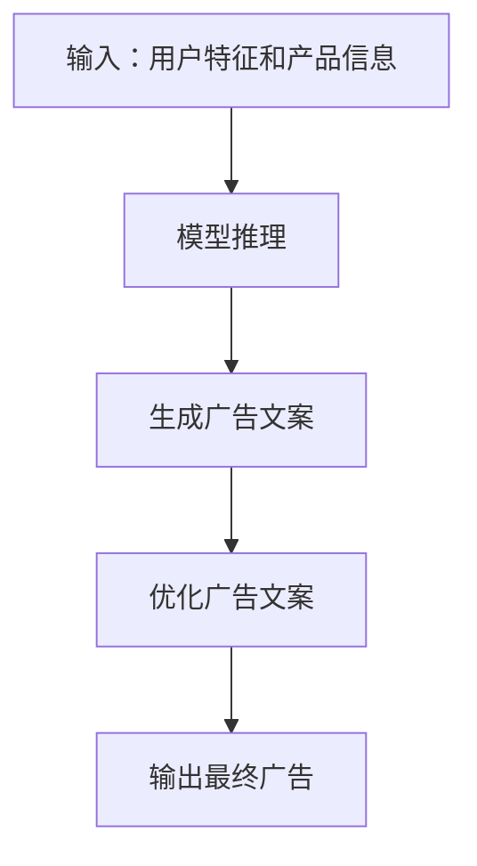
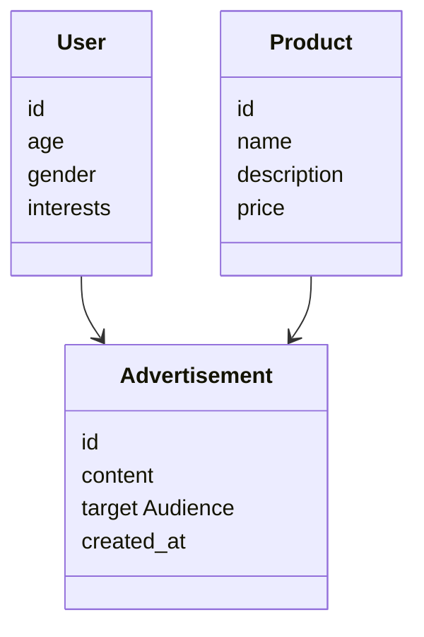
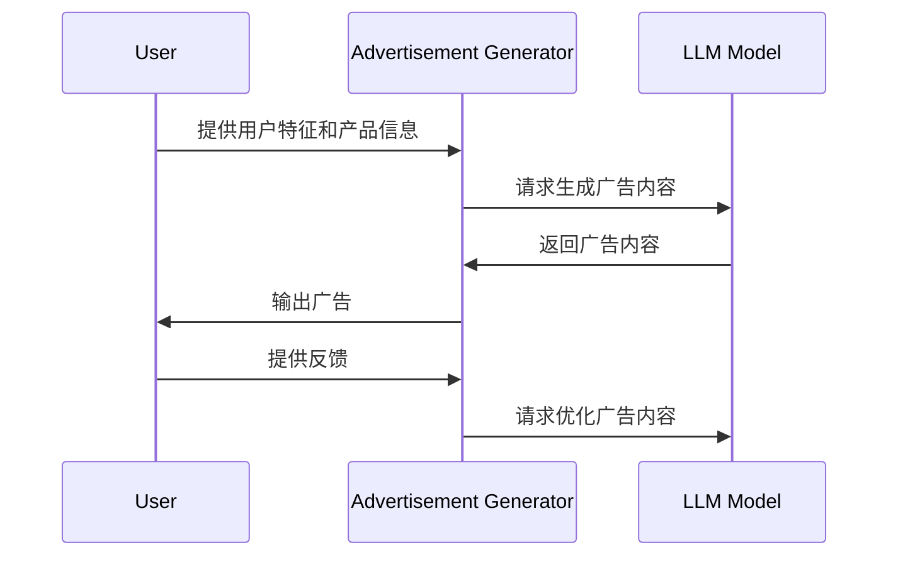

                 


# 智能营销 AI Agent：LLM 驱动的个性化广告生成

**关键词**：智能营销, AI Agent, 大语言模型, 个性化广告, 生成式AI

**摘要**：本文深入探讨了智能营销中AI Agent的应用，特别是基于大语言模型（LLM）的个性化广告生成。文章从背景概述、核心概念、算法原理到系统架构，再到项目实战和最佳实践，全面分析了LLM在广告生成中的应用，帮助读者理解如何利用AI技术提升广告效果。

---

# 第1章 智能营销与AI Agent 概述

## 1.1 智能营销的定义与特点

### 1.1.1 智能营销的定义

智能营销是一种利用人工智能技术，通过数据分析和自动化工具，实现精准用户画像、个性化内容推荐和实时互动的营销方式。它以用户为中心，通过智能化手段提升营销效率和效果。

### 1.1.2 智能营销的核心特点

1. **数据驱动**：依赖于大量数据进行分析和决策。
2. **自动化**：通过AI技术实现自动化操作，减少人工干预。
3. **个性化**：根据用户需求和行为，提供定制化的内容和体验。
4. **实时性**：能够实时响应用户行为和市场变化。
5. **可扩展性**：适用于不同规模和类型的业务。

### 1.1.3 AI Agent 在智能营销中的作用

AI Agent（智能代理）作为智能营销的核心工具，负责执行任务、优化策略和提升用户体验。它能够自动分析数据、生成内容、调整广告策略，并实时与用户互动，从而提高营销效率和转化率。

## 1.2 LLM 驱动的广告生成

### 1.2.1 LLM 的定义与特点

大语言模型（LLM, Large Language Model）是基于深度学习的自然语言处理模型，能够理解和生成人类语言。其特点包括：

1. **大规模训练**：通常使用海量数据进行训练，具有强大的上下文理解和生成能力。
2. **多任务能力**：能够处理多种语言任务，如翻译、问答、文本生成等。
3. **可微调性**：可以根据具体任务进行微调，适应不同的应用场景。

### 1.2.2 LLM 在广告生成中的应用

1. **内容生成**：生成吸引人的广告文案和创意。
2. **个性化推荐**：根据用户特征生成个性化广告内容。
3. **效果优化**：通过生成和优化广告内容提升转化率。

### 1.2.3 个性化广告生成的重要性

个性化广告能够提高用户参与度和广告点击率，因为它们更符合用户的兴趣和需求。通过LLM实现个性化广告生成，不仅提高了效率，还能够实时调整广告内容以适应用户行为的变化。

## 1.3 智能营销的现状与趋势

### 1.3.1 当前智能营销的发展现状

1. **技术进步**：AI和大数据技术的快速发展推动了智能营销的发展。
2. **广泛应用**：许多企业已经开始使用AI Agent进行广告投放和用户互动。
3. **数据驱动**：数据收集和分析是智能营销的核心驱动力。

### 1.3.2 LLM 技术在智能营销中的应用趋势

1. **更个性化的广告内容**：LLM能够生成高度个性化的广告，满足不同用户的需求。
2. **实时优化**：通过实时分析用户行为，快速生成和调整广告内容。
3. **跨渠道整合**：LLM可以整合多种营销渠道，实现统一的广告策略。

### 1.3.3 未来智能营销的发展方向

1. **更加智能化**：AI Agent将更加智能化，能够自主决策和优化广告策略。
2. **更加强大的数据处理能力**：随着数据量的增加，AI Agent需要更强的数据处理和分析能力。
3. **更加注重用户体验**：未来的智能营销将更加注重用户体验，提供更个性化和贴心的服务。

## 1.4 本章小结

本章介绍了智能营销的定义、特点和AI Agent的作用，重点探讨了LLM在广告生成中的应用及其重要性。同时，分析了智能营销的现状和未来趋势，为后续章节的深入讨论奠定了基础。

---

# 第2章 LLM 的核心原理与技术

## 2.1 大语言模型（LLM）的工作原理

### 2.1.1 LLM 的模型结构

大语言模型通常基于Transformer架构，由编码器和解码器组成。编码器负责将输入文本转换为向量表示，解码器则根据这些向量生成输出文本。

### 2.1.2 LLM 的训练方法

1. **预训练**：使用大规模通用数据进行无监督训练，目标是预测文本中的下一个词。
2. **微调**：根据具体任务对模型进行有监督训练，如广告生成任务。

### 2.1.3 LLM 的推理机制

在广告生成任务中，模型接收输入（如用户特征、产品信息）后，通过解码器生成相应的广告文案。

## 2.2 LLM 在广告生成中的应用

### 2.2.1 基于 LLM 的广告内容生成

通过输入广告目标和用户特征，模型生成吸引人的广告文案。

### 2.2.2 基于 LLM 的广告创意优化

根据广告效果数据，优化广告文案以提高点击率和转化率。

### 2.2.3 基于 LLM 的广告效果预测

通过分析广告内容和用户特征，预测广告的点击率和转化率。

## 2.3 LLM 与其他生成模型的对比

### 2.3.1 LLM 与 GPT 的区别

GPT 是一种基于Transformer的生成模型，而 LLM 是更大规模的GPT模型。

### 2.3.2 LLM 与 BERT 的区别

BERT 主要用于文本理解和语义分析，而 LLM 更注重文本生成。

### 2.3.3 LLM 与其他生成模型的优劣势对比

| 模型 | 优势 | 劣势 |
|------|------|------|
| LLM | 强大的生成能力，可处理复杂任务 | 计算资源需求高，生成结果可能不够准确 |
| GPT | 易于微调，生成速度快 | 上下文理解能力较弱 |
| BERT | 语义理解能力强 | 生成能力较弱 |

## 2.4 本章小结

本章详细讲解了LLM的工作原理及其在广告生成中的应用，分析了LLM与其他生成模型的优劣势，为后续章节的系统设计和实现提供了理论基础。

---

# 第3章 基于 LLM 的广告生成算法

## 3.1 基于 LLM 的广告生成流程

### 3.1.1 输入处理

1. **用户特征**：如年龄、性别、兴趣爱好等。
2. **产品信息**：如产品特点、价格、优惠信息等。

### 3.1.2 模型推理

模型根据输入生成广告文案。

### 3.1.3 输出生成

生成的广告文案经过优化后输出。

## 3.2 基于 LLM 的广告生成算法实现

### 3.2.1 算法流程图



### 3.2.2 Python代码实现

```python
import openai

def generate_advertisement(user_info, product_info):
    prompt = f"Generate an advertisement for the product {product_info} targeting {user_info}."
    response = openai.Completion.create(
        model="gpt-3.5-turbo",
        prompt=prompt,
        max_tokens=500,
        temperature=0.7
    )
    return response.choices[0].message.content

# 示例调用
user_info = "young professionals interested in tech gadgets"
product_info = "Smart Watch Pro"
advertisement = generate_advertisement(user_info, product_info)
print(advertisement)
```

### 3.2.3 数学模型与公式

生成广告的过程可以看作是一个概率生成过程，模型的目标是最小化生成文本的交叉熵损失：

$$ \text{Loss} = -\sum_{i=1}^{n} \log p(x_i | x_{<i}) $$

其中，\( x_i \) 表示生成的第 \( i \) 个词，\( x_{<i} \) 表示前面的词序列。

---

## 3.3 本章小结

本章详细讲解了基于LLM的广告生成算法，通过流程图和代码示例展示了生成过程，并通过数学公式解释了模型的优化目标。

---

# 第4章 系统分析与架构设计方案

## 4.1 问题场景介绍

我们设计了一个智能营销系统，用于生成个性化广告。系统需要处理大量用户数据和广告内容，确保高效生成和优化广告。

## 4.2 系统功能设计

### 4.2.1 领域模型



### 4.2.2 系统架构


### 4.2.3 系统接口设计

1. **用户输入接口**：接收用户特征和产品信息。
2. **广告生成接口**：调用LLM生成广告内容。
3. **广告优化接口**：根据效果数据优化广告内容。

### 4.2.4 系统交互流程



## 4.3 本章小结

本章通过系统分析和架构设计，展示了智能营销系统的整体结构和工作流程，为后续章节的项目实现提供了指导。

---

# 第5章 项目实战

## 5.1 环境安装

安装Python和相关库：

```bash
pip install openai transformers
```

## 5.2 系统核心实现

### 5.2.1 核心代码

```python
from openai import OpenAI

client = OpenAI(api_key="your_api_key")

def generate_advertisement(user_info, product_info):
    prompt = f"Create an ad for {product_info} targeting {user_info}."
    response = client.chat.completions.create(
        model="gpt-3.5-turbo",
        messages=[{"role": "user", "content": prompt}],
        temperature=0.7
    )
    return response.choices[0].message.content

# 示例
user_info = "fitness enthusiasts"
product_info = "Running Shoes"
advertisement = generate_advertisement(user_info, product_info)
print(advertisement)
```

### 5.2.2 代码解读

1. **环境配置**：设置OpenAI API密钥。
2. **广告生成函数**：定义生成广告的函数，接收用户信息和产品信息，调用OpenAI API生成广告内容。
3. **示例调用**：生成针对健身爱好者和跑步鞋的广告。

## 5.3 案例分析

### 5.3.1 广告生成案例

输入：
- 用户信息：25岁男性，喜欢科技产品
- 产品信息：智能手表

输出：
"Discover the future of wearable technology with our smartwatch. Stay connected, track your fitness, and stay productive on the go. Buy now!"

### 5.3.2 广告优化案例

根据用户点击率优化广告内容。

---

## 5.4 本章小结

本章通过实际项目展示了如何使用LLM生成个性化广告，提供了代码实现和案例分析，帮助读者掌握广告生成的关键步骤。

---

# 第6章 最佳实践与总结

## 6.1 最佳实践 tips

1. **数据质量**：确保输入数据的准确性和完整性。
2. **模型选择**：根据任务需求选择合适的LLM模型。
3. **效果监控**：实时监控广告效果，及时优化广告内容。

## 6.2 项目小结

通过本项目，我们展示了如何利用LLM生成个性化广告，从系统设计到实际实现，全面分析了智能营销AI Agent的应用。

## 6.3 注意事项

1. **数据隐私**：注意用户数据的隐私保护。
2. **模型调优**：根据实际效果不断优化模型参数。
3. **性能优化**：提高系统的运行效率，降低资源消耗。

## 6.4 拓展阅读

1. 《Deep Learning for Natural Language Processing》
2. 《Transformers: A Neccessary Evil for NLP?》
3. OpenAI API文档

---

# 作者

**作者：AI天才研究院/AI Genius Institute & 禅与计算机程序设计艺术 /Zen And The Art of Computer Programming**

---

以上是《智能营销 AI Agent：LLM 驱动的个性化广告生成》的完整目录和文章内容，涵盖了从背景到实现的各个方面，帮助读者全面理解并掌握相关知识。

