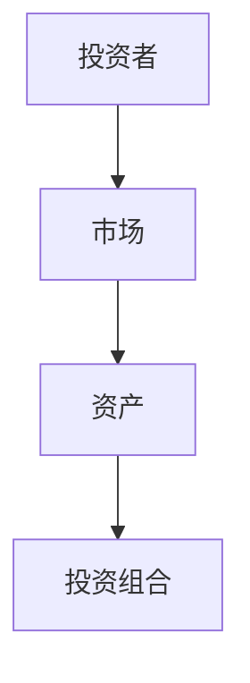
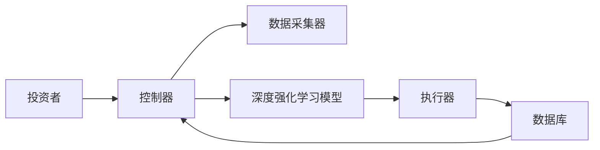
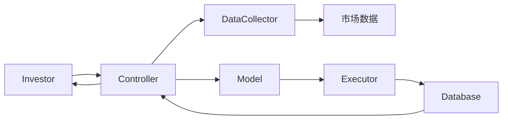

                 


# 深度强化学习优化投资决策

> 关键词：深度强化学习，投资决策，强化学习，深度学习，算法优化，金融应用

> 摘要：深度强化学习（Deep Reinforcement Learning，DRL）作为人工智能领域的重要技术，近年来在投资决策中的应用取得了显著成果。本文将详细探讨深度强化学习的基本原理、其在投资决策中的具体应用，以及如何通过优化算法提升投资决策的准确性和收益。通过分析实际案例，本文将展示深度强化学习在金融市场的独特优势，为读者提供理论与实践相结合的全面解析。

---

# 第一部分：深度强化学习与投资决策的背景介绍

## 第1章：深度强化学习与投资决策概述

### 1.1 深度强化学习的基本概念

- **1.1.1 深度学习与强化学习的结合**
  - 深度学习擅长从大量数据中提取特征，强化学习则通过与环境交互优化决策。
  - DRL的结合实现了端到端的学习，无需手动特征工程。

- **1.1.2 深度强化学习的核心特点**
  - 端到端学习：从原始数据直接生成最优策略。
  - 非线性表达能力：深度神经网络可以捕捉复杂的市场规律。
  - 动态适应性：通过与环境交互，模型能实时调整策略。

- **1.1.3 投资决策中的问题背景**
  - 金融市场数据复杂，涉及价格、成交量、新闻等多种因素。
  - 投资决策需要实时反馈和动态调整，强化学习特别适合这类问题。

### 1.2 投资决策的复杂性与挑战

- **1.2.1 投资决策的核心问题**
  - 在不确定的市场中，如何选择最优的投资组合和交易策略。
  - 需要考虑风险、收益、流动性等多目标优化。

- **1.2.2 传统投资决策方法的局限性**
  - 基于统计的方法（如均值-方差模型）依赖于假设，难以应对非平稳市场。
  - 人工经验受限于主观判断和信息处理能力。

- **1.2.3 强化学习在投资决策中的优势**
  - 能够处理高维、非线性的问题。
  - 可以通过历史数据学习策略，并在实际操作中动态调整。

### 1.3 深度强化学习在投资中的应用前景

- **1.3.1 深度强化学习在金融领域的潜力**
  - 通过分析大量历史数据，发现传统方法难以察觉的模式。
  - 可以实时适应市场变化，优化交易策略。

- **1.3.2 投资决策中的具体应用场景**
  - 股票交易：制定买卖时机和投资组合。
  - 债券评级：评估债券信用风险。
  - 资产配置：动态调整不同资产的比例。

- **1.3.3 技术与金融的结合趋势**
  - 金融机构 increasingly采用AI技术提升决策效率。
  - 深度强化学习在量化交易中的应用日益广泛。

## 1.4 本章小结

本章通过介绍深度强化学习的基本概念，分析了投资决策的复杂性及其局限性，并探讨了深度强化学习在投资中的应用前景。深度强化学习的独特优势使其在金融领域具有巨大的潜力，特别是在处理复杂、动态的投资决策问题上。

---

# 第二部分：深度强化学习的核心概念与原理

## 第2章：深度强化学习的核心概念

### 2.1 强化学习的基本原理

- **2.1.1 状态、动作、奖励的定义**
  - 状态（State）：描述环境当前情况的观测，如市场数据。
  - 动作（Action）：模型在给定状态下选择的操作，如买入或卖出。
  - 奖励（Reward）：环境对动作的反馈，通常以收益或损失的形式体现。

- **2.1.2 策略与价值函数的关系**
  - 策略（Policy）：决定在每个状态下选择哪个动作。
  - 价值函数（Value Function）：评估状态或状态-动作对的优劣。

- **2.1.3 探索与利用的平衡**
  - 探索（Explore）：尝试新的动作以发现更好的策略。
  - 利用（Exploit）：利用已知的最佳策略获取最大收益。
  - 平衡探索与利用是强化学习的核心挑战之一。

### 2.2 深度强化学习的算法框架

- **2.2.1 Q-learning与DQN算法**
  - Q-learning：通过更新Q值表学习最优动作。
  - DQN（Deep Q-Network）：使用深度神经网络近似Q值函数，解决高维状态问题。

- **2.2.2 策略梯度方法**
  - 策略梯度法直接优化策略，而非价值函数。
  - 通过梯度上升法最大化预期收益。

- **2.2.3 深度网络在强化学习中的作用**
  - 深度网络擅长处理高维、非线性的输入。
  - 通过多层网络结构，捕捉数据中的复杂模式。

### 2.3 投资决策中的状态表示与动作选择

- **2.3.1 投资组合的构建与优化**
  - 状态：市场指数、资产价格、宏观经济指标。
  - 动作：调整资产配置比例。

- **2.3.2 动作空间的设计**
  - 动作可以是连续的（如买入多少比例）或离散的（如买入、卖出、持有）。

- **2.3.3 状态空间的特征提取**
  - 使用深度网络自动提取有用的特征，避免人工特征工程。

### 2.4 核心概念对比表

| 概念 | 描述 |
|------|------|
| 状态 | 当前市场情况 |
| 动作 | 投资决策 |
| 奖励 | 投资收益 |

### 2.5 ER实体关系图



## 2.5 本章小结

本章详细介绍了深度强化学习的核心概念，包括状态、动作、奖励、策略与价值函数等，并讨论了这些概念在投资决策中的具体应用。

---

# 第三部分：深度强化学习算法的数学模型与实现

## 第3章：深度强化学习算法原理

### 3.1 DQN算法的数学模型

- **3.1.1 状态值函数**
  $$ Q(s, a) = \theta \cdot \phi(s,a) $$
  其中，$\theta$是模型参数，$\phi(s,a)$是状态-动作对的特征向量。

- **3.1.2 动作选择策略**
  $$ \pi(a|s) = \text{argmax}_a Q(s,a) $$
  选择具有最大Q值的动作作为策略。

- **3.1.3 网络结构**
  ```mermaid
  graph LR
      input --> hidden
      hidden --> output
  ```

- **3.1.4 网络更新**
  使用经验回放和目标网络减少方差，确保稳定的训练过程。

### 3.2 策略梯度方法的实现

- **3.2.1 策略函数**
  $$ \pi_\theta(a|s) = \text{softmax}(Q(s,a)) $$
  利用 softmax 函数将Q值转换为概率分布。

- **3.2.2 梯度更新**
  $$ \nabla J = \sum (\nabla \log \pi_\theta(a|s) \cdot Q(s,a)) $$
  通过梯度上升法最大化期望奖励。

- **3.2.3 算法流程**
  ```mermaid
  graph LR
      initialize(theta) --> update(theta)
      update(theta) --> sample_action
      sample_action --> get_reward
      get_reward --> update Q(s,a)
  ```

### 3.3 算法实现代码

```python
import numpy as np
import tensorflow as tf

class DQN:
    def __init__(self, state_dim, action_dim):
        self.state_dim = state_dim
        self.action_dim = action_dim
        self.model = self.build_model()
        self.target_model = self.build_model()
        self.memory = []
        self.gamma = 0.99
        self.batch_size = 64

    def build_model(self):
        model = tf.keras.Sequential()
        model.add(tf.keras.layers.Dense(64, activation='relu', input_dim=self.state_dim))
        model.add(tf.keras.layers.Dense(32, activation='relu'))
        model.add(tf.keras.layers.Dense(self.action_dim, activation='linear'))
        model.compile(optimizer='adam', loss='mean_squared_error')
        return model

    def remember(self, state, action, reward, next_state):
        self.memory.append((state, action, reward, next_state))

    def act(self, state):
        q = self.model.predict(state)[0]
        return np.argmax(q)

    def replay(self):
        if len(self.memory) >= self.batch_size:
            minibatch = random.sample(self.memory, self.batch_size)
            states = np.array([m[0] for m in minibatch])
            actions = np.array([m[1] for m in minibatch])
            rewards = np.array([m[2] for m in minibatch])
            next_states = np.array([m[3] for m in minibatch])
            
            targets = self.model.predict(states)
            next_q = self.target_model.predict(next_states)
            targets[range(self.batch_size), actions] = rewards + self.gamma * np.max(next_q, axis=1)
            self.model.fit(states, targets, epochs=1, verbose=0)
            
            # 更新目标网络
            weights = self.model.get_weights()
            self.target_model.set_weights(weights)
```

### 3.4 投资决策中的数学模型

- **3.4.1 投资组合优化模型**
  $$ \text{maximize} \quad \mathbb{E}[R] - \lambda \mathbb{V}[R] $$
  其中，$R$是投资组合的收益，$\lambda$是风险厌恶系数。

- **3.4.2 动作选择模型**
  $$ \pi(a|s) = \text{softmax}(\beta Q(s,a)) $$
  其中，$\beta$是温度参数，控制探索与利用的平衡。

## 3.5 本章小结

本章详细讲解了深度强化学习的核心算法，包括DQN和策略梯度方法的数学模型和实现细节，并展示了这些算法在投资决策中的具体应用。

---

# 第四部分：投资决策系统的架构设计与实现

## 第4章：投资决策系统的架构设计

### 4.1 问题场景介绍

- 投资者需要根据市场数据做出投资决策，如股票买卖、资产配置等。
- 系统需要实时处理市场数据，生成投资策略。

### 4.2 系统功能设计

- **数据采集**：获取实时市场数据，如股价、指数、新闻等。
- **状态表示**：将市场数据转化为模型的输入状态。
- **动作选择**：根据模型输出选择投资动作。
- **反馈机制**：根据实际收益更新模型。

### 4.3 系统架构设计



### 4.4 系统接口设计

- 数据接口：与数据源（如金融API）连接，获取实时数据。
- 模型接口：与交易系统对接，执行投资动作。
- 用户接口：显示投资策略和结果。

### 4.5 系统交互流程



## 4.6 本章小结

本章设计了投资决策系统的整体架构，包括功能模块、系统交互流程等，并展示了如何将深度强化学习模型集成到实际系统中。

---

# 第五部分：项目实战与案例分析

## 第5章：深度强化学习在投资决策中的实战应用

### 5.1 项目环境安装

- 安装必要的库：
  ```bash
  pip install numpy tensorflow keras matplotlib pandas
  ```

### 5.2 系统核心实现

- **数据预处理**：
  ```python
  import pandas as pd
  data = pd.read_csv('stock_data.csv')
  ```

- **模型训练**：
  ```python
  model = DQN(state_dim=64, action_dim=3)
  for episode in range(1000):
      state = get_current_state()
      action = model.act(state)
      reward = get_reward(action)
      next_state = get_next_state()
      model.remember(state, action, reward, next_state)
      model.replay()
  ```

- **策略执行**：
  ```python
  while True:
      state = get_current_state()
      action = model.act(state)
      execute_trade(action)
  ```

### 5.3 实际案例分析

- **案例1：股票交易策略**
  - 状态：股价、成交量、技术指标。
  - 动作：买入、卖出、持有。
  - 模型在模拟数据上训练，然后在真实市场中测试。

- **案例2：资产配置优化**
  - 状态：不同资产的收益和风险。
  - 动作：调整各资产的配置比例。
  - 模型通过历史数据学习最优配置策略。

### 5.4 案例分析与解读

- **案例分析**：
  - 模型在训练阶段表现良好，但在实际市场中可能面临过拟合问题。
  - 需要结合其他因素（如市场情绪、突发事件）进一步优化策略。

- **解读**：
  - 深度强化学习能够捕捉复杂的市场规律，但需要大量优质数据支持。
  - 在实际应用中，模型需要定期更新，以适应市场变化。

### 5.5 本章小结

本章通过实际案例展示了深度强化学习在投资决策中的应用，分析了模型的优势和局限性，并提出了改进建议。

---

# 第六部分：优化与实践

## 第6章：深度强化学习优化的注意事项

### 6.1 最佳实践 Tips

- **数据质量**：确保数据准确、完整，避免噪声干扰。
- **模型调参**：合理选择超参数，如学习率、批量大小等。
- **风险管理**：设置止损点，控制投资风险。
- **模型更新**：定期更新模型，适应市场变化。

### 6.2 模型优化建议

- **网络结构**：尝试不同的网络架构，如更深的网络或引入注意力机制。
- **奖励机制**：设计合理的奖励函数，引导模型学习正确的策略。
- **多目标优化**：在考虑收益的同时，也要平衡风险和流动性。

### 6.3 模型评估与验证

- **回测**：在历史数据上验证模型的收益和风险表现。
- **分组测试**：将市场分为不同的子市场，评估模型的通用性。
- **压力测试**：模拟极端市场情况，检验模型的鲁棒性。

### 6.4 模型部署与监控

- **实时监控**：跟踪模型的运行状态和交易表现。
- **异常处理**：及时发现并纠正模型的异常行为。
- **持续优化**：根据市场反馈，持续改进模型。

## 6.5 本章小结

本章总结了深度强化学习在投资决策中的优化技巧和实践注意事项，强调了数据质量、模型调参和风险管理的重要性。

---

# 第七部分：总结与展望

## 第7章：总结与展望

### 7.1 总结

- 深度强化学习为投资决策提供了新的可能性，特别是在处理复杂、动态的金融市场问题上表现突出。
- 通过结合深度学习的特征提取能力和强化学习的决策优化能力，模型能够做出更优的投资决策。

### 7.2 展望

- **算法优化**：探索更高效的强化学习算法，如元学习（Meta-Learning）。
- **多模态数据**：结合文本、图像等多种数据源，提升模型的感知能力。
- **监管与合规**：确保模型符合金融监管要求，避免滥用技术。

### 7.3 未来研究方向

- 研究深度强化学习在更复杂金融问题中的应用，如多资产配置、动态风险控制。
- 探索强化学习与其他AI技术（如生成对抗网络）的结合，提升投资决策的智能化水平。

## 7.4 本章小结

本章总结了文章的主要内容，并展望了深度强化学习在投资决策中的未来发展方向。

---

# 作者：AI天才研究院/AI Genius Institute & 禅与计算机程序设计艺术/Zen And The Art of Computer Programming

---

这篇文章详细介绍了深度强化学习在投资决策中的应用，从理论到实践，从概念到代码，层层深入，为读者提供了全面的视角。通过实际案例和系统设计，展示了如何将深度强化学习技术应用于复杂的金融问题中。

