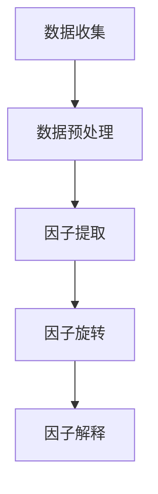
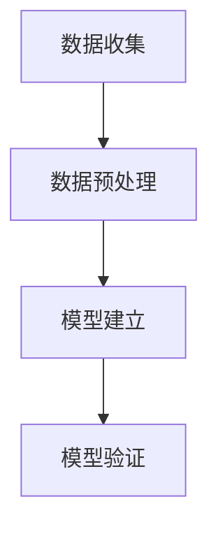
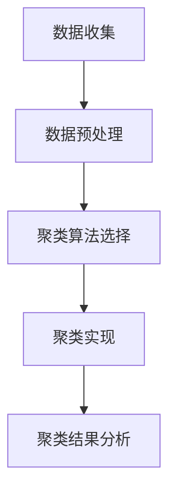
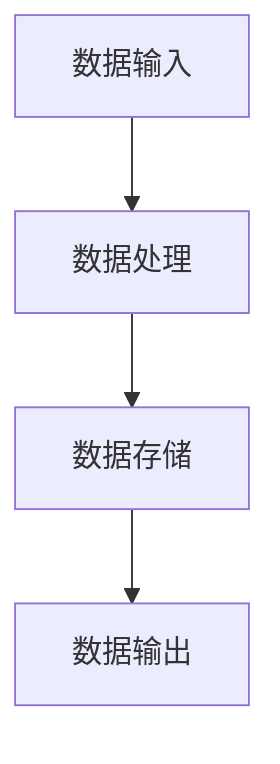
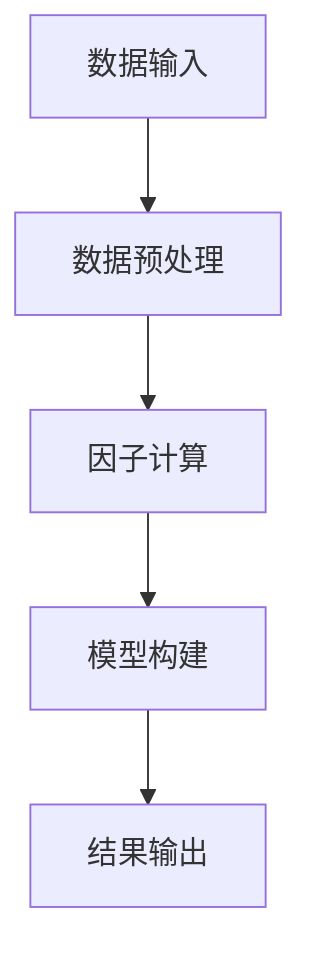
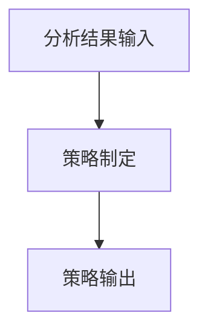
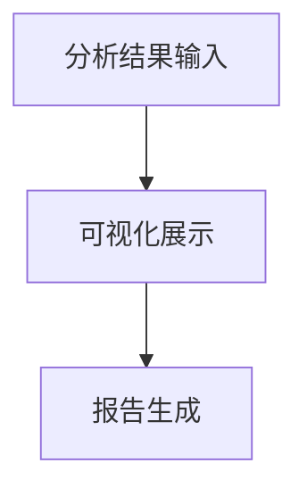
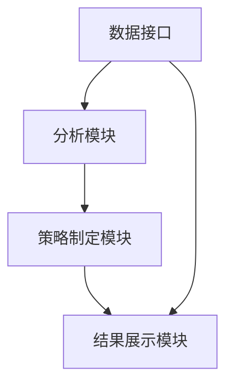

                 


# 特价股票投资中的质量因子分析

## 关键词：特价股票投资，质量因子，股票分析，投资策略，因子模型

## 摘要：本文深入探讨了特价股票投资中的质量因子分析，从基本概念到算法原理，再到系统架构和项目实战，全面解析了质量因子在股票投资中的应用。通过本文的学习，读者将掌握如何利用质量因子构建有效的投资模型，优化投资策略，提高投资收益。

---

# 第1章: 特价股票投资与质量因子概述

## 1.1 特价股票投资的背景与意义

### 1.1.1 股票投资的基本概念

股票投资是一种将资金投入股票市场以获取收益的投资方式。投资者通过购买公司股份，成为公司的部分所有者，并根据公司业绩获得资本增值和分红收益。股票市场具有高风险、高回报的特点，是个人和机构投资者的重要投资渠道。

### 1.1.2 什么是特价股票

特价股票通常指那些市场价格低于其内在价值的股票。这些股票可能因为市场波动、公司暂时的困境或其他因素导致价格被低估，但其基本面良好，具有长期增值的潜力。投资者通过识别和购买这些特价股票，期望在市场恢复或公司业绩改善时获得超额收益。

### 1.1.3 质量因子在投资中的作用

质量因子是衡量股票内在价值和投资潜力的重要指标。高质量的股票通常具有稳定的盈利能力、良好的财务状况和较强的市场竞争力。通过分析质量因子，投资者可以更准确地评估股票的价值，避免因市场短期波动而做出错误的投资决策。

---

## 1.2 质量因子的基本概念

### 1.2.1 质量因子的定义

质量因子是指能够反映股票质量的量化指标。这些指标通常包括市盈率（P/E）、市净率（P/B）、股息率、ROE（净资产收益率）等。通过综合分析这些因子，投资者可以更全面地评估股票的投资价值。

### 1.2.2 质量因子的分类与特点

质量因子可以分为以下几类：

1. **估值因子**：如市盈率、市净率、股息率等，反映股票的估值水平。
2. **盈利能力因子**：如ROE、净利润增长率等，衡量公司的盈利能力。
3. **成长性因子**：如收入增长率、净利润增长率等，反映公司的成长潜力。
4. **流动性因子**：如换手率、平均成交量等，衡量股票的流动性。

每类因子都有其独特的特点和适用场景，投资者可以根据自己的投资目标选择合适的因子组合。

### 1.2.3 质量因子与股票价值的关系

质量因子与股票价值密切相关。高质量的股票通常具有较高的盈利能力、稳定的财务状况和良好的市场前景。通过分析质量因子，投资者可以更准确地评估股票的内在价值，从而做出更明智的投资决策。

---

## 1.3 质量因子分析的背景与意义

### 1.3.1 质量因子分析的背景

随着股票市场的日益复杂化，投资者需要更加科学和系统的方法来评估股票的投资价值。传统的主观判断方法难以应对市场的不确定性和波动性，因此，质量因子分析作为一种量化投资工具，逐渐受到投资者的关注。

### 1.3.2 质量因子分析的意义

质量因子分析的意义在于帮助投资者识别那些具有长期投资价值的股票，避免因短期市场波动而做出错误的投资决策。通过量化分析，投资者可以更客观地评估股票的质量，制定更加科学的投资策略。

---

## 1.4 本章小结

本章主要介绍了特价股票投资和质量因子的基本概念，分析了质量因子在投资中的作用，并总结了质量因子分析的背景和意义。通过本章的学习，读者可以初步了解质量因子在股票投资中的重要性。

---

# 第2章: 质量因子的理论基础

## 2.1 质量因子的理论框架

### 2.1.1 质量因子的构成要素

质量因子的构成要素包括以下几个方面：

1. **盈利能力**：如ROE、净利润增长率等，衡量公司的盈利能力。
2. **成长性**：如收入增长率、净利润增长率等，反映公司的成长潜力。
3. **估值水平**：如市盈率、市净率等，衡量股票的估值水平。
4. **财务状况**：如资产负债率、流动比率等，反映公司的财务健康状况。

### 2.1.2 质量因子的数学模型

质量因子的数学模型可以通过以下公式表示：

$$
\text{质量因子} = \alpha \times \text{盈利能力因子} + \beta \times \text{成长性因子} + \gamma \times \text{估值因子} + \delta \times \text{财务状况因子}
$$

其中，$\alpha$、$\beta$、$\gamma$、$\delta$是各因子的权重系数，表示各因子在质量因子中的重要性。

### 2.1.3 质量因子的评价标准

质量因子的评价标准通常包括以下几点：

1. **可解释性**：因子的含义和作用需要清晰明了。
2. **稳定性**：因子在不同市场环境下的表现稳定。
3. **可操作性**：因子易于计算和应用。

---

## 2.2 质量因子与股票质量的关系

### 2.2.1 质量因子对股票质量的影响

质量因子是衡量股票质量的重要指标。高质量的股票通常具有较高的盈利能力、良好的财务状况和稳定的估值水平。通过分析质量因子，投资者可以更准确地评估股票的投资价值。

### 2.2.2 质量因子与股票价格的关系

质量因子与股票价格密切相关。高质量的股票通常具有较高的市场价格，但其内在价值也较高。因此，质量因子是连接股票质量和市场价格的重要桥梁。

### 2.2.3 质量因子与投资收益的关系

质量因子是影响投资收益的重要因素。通过选择具有高质量因子的股票，投资者可以提高投资收益，降低投资风险。

---

## 2.3 质量因子分析的理论基础

### 2.3.1 质量因子分析的理论依据

质量因子分析的理论依据主要包括以下几个方面：

1. **投资组合理论**：通过分散投资降低风险，提高收益。
2. **因子模型**：通过分析因子对股票收益的影响，构建投资组合。
3. **市场有效性假说**：市场中的信息已经被充分反映在股票价格中，因此需要通过分析因子来寻找超额收益。

### 2.3.2 质量因子分析的数学基础

质量因子分析的数学基础主要包括统计学和计量经济学。常用的分析方法包括回归分析、因子分析和聚类分析等。

### 2.3.3 质量因子分析的实践基础

质量因子分析的实践基础主要包括数据收集、数据预处理、模型构建和模型验证等步骤。通过实践，投资者可以将质量因子分析应用于实际投资决策中。

---

## 2.4 本章小结

本章详细介绍了质量因子的理论基础，包括质量因子的构成要素、数学模型和评价标准，分析了质量因子与股票质量、股票价格和投资收益的关系，并总结了质量因子分析的理论依据和实践基础。

---

# 第3章: 质量因子分析的算法原理

## 3.1 质量因子分析的算法概述

### 3.1.1 质量因子分析的算法分类

质量因子分析的算法可以分为以下几类：

1. **因子分析法**：通过提取因子来解释变量之间的关系。
2. **回归分析法**：通过回归模型分析因子对股票收益的影响。
3. **聚类分析法**：通过聚类算法将股票分为不同的质量类别。

### 3.1.2 质量因子分析的算法特点

质量因子分析的算法特点包括以下几点：

1. **可解释性**：算法需要能够清晰解释因子对股票收益的影响。
2. **稳定性**：算法在不同数据集和市场环境下的表现稳定。
3. **可操作性**：算法易于实现和应用。

### 3.1.3 质量因子分析的算法优缺点

不同算法有其优缺点：

- **因子分析法**：优点是可以提取出潜在的因子，缺点是计算复杂。
- **回归分析法**：优点是简单易懂，缺点是假设线性关系可能不成立。
- **聚类分析法**：优点是能够发现数据中的自然分组，缺点是缺乏明确的解释性。

---

## 3.2 质量因子分析的具体算法

### 3.2.1 因子分析法

因子分析法通过提取潜在因子来解释变量之间的关系。具体步骤包括：

1. **数据收集**：收集相关股票的质量因子数据。
2. **数据预处理**：对数据进行标准化和去噪处理。
3. **因子提取**：使用主成分分析（PCA）等方法提取潜在因子。
4. **因子旋转**：对提取的因子进行旋转以提高解释性。
5. **因子解释**：根据因子载荷矩阵解释各因子的含义。

以下是一个因子分析法的流程图：



### 3.2.2 回归分析法

回归分析法通过建立回归模型分析因子对股票收益的影响。具体步骤包括：

1. **数据收集**：收集相关股票的质量因子和收益数据。
2. **数据预处理**：对数据进行标准化和去噪处理。
3. **模型建立**：建立线性回归模型，将收益作为因变量，质量因子作为自变量。
4. **模型验证**：通过统计检验验证模型的显著性和合理性。

以下是一个回归分析法的流程图：



### 3.2.3 聚类分析法

聚类分析法通过聚类算法将股票分为不同的质量类别。具体步骤包括：

1. **数据收集**：收集相关股票的质量因子数据。
2. **数据预处理**：对数据进行标准化和去噪处理。
3. **聚类算法选择**：选择适合的聚类算法（如K-means、层次聚类等）。
4. **聚类实现**：对数据进行聚类。
5. **聚类结果分析**：根据聚类结果对股票进行分类。

以下是一个聚类分析法的流程图：



---

## 3.3 质量因子分析算法的实现步骤

### 3.3.1 数据预处理

数据预处理是质量因子分析的重要步骤，主要包括以下内容：

1. **数据清洗**：删除缺失值和异常值。
2. **数据标准化**：对数据进行标准化处理，消除量纲影响。
3. **数据去噪**：通过统计方法或模型去除噪声数据。

### 3.3.2 因子选择

因子选择是质量因子分析的关键步骤，主要包括以下内容：

1. **因子筛选**：根据统计指标（如相关系数、方差贡献率等）筛选重要的质量因子。
2. **因子组合**：将多个因子进行组合，形成综合因子。

### 3.3.3 模型构建

模型构建是质量因子分析的核心步骤，主要包括以下内容：

1. **模型选择**：根据数据特点选择合适的分析模型（如因子分析、回归分析、聚类分析等）。
2. **模型参数设置**：根据经验或试错法确定模型的参数。
3. **模型实现**：使用编程语言（如Python、R等）实现模型。

### 3.3.4 模型验证

模型验证是质量因子分析的重要步骤，主要包括以下内容：

1. **模型检验**：通过统计检验（如F检验、t检验等）验证模型的显著性和合理性。
2. **模型评估**：通过交叉验证等方法评估模型的泛化能力。
3. **模型优化**：根据验证结果优化模型参数和结构。

---

## 3.4 本章小结

本章详细介绍了质量因子分析的算法原理，包括因子分析法、回归分析法和聚类分析法的具体实现步骤和流程图。通过本章的学习，读者可以掌握质量因子分析的主要方法及其应用场景。

---

# 第4章: 质量因子分析的数学模型与公式

## 4.1 质量因子分析的基本公式

### 4.1.1 质量因子的计算公式

质量因子的计算公式可以通过以下公式表示：

$$
\text{质量因子} = \sum_{i=1}^{n} w_i \times f_i
$$

其中，$w_i$是第$i$个因子的权重，$f_i$是第$i$个因子的值。

### 4.1.2 质量因子的标准化公式

质量因子的标准化公式可以通过以下公式表示：

$$
\text{标准化质量因子} = \frac{\text{质量因子} - \mu}{\sigma}
$$

其中，$\mu$是质量因子的均值，$\sigma$是质量因子的标准差。

### 4.1.3 质量因子的权重分配公式

质量因子的权重分配公式可以通过以下公式表示：

$$
w_i = \frac{1}{\sum_{j=1}^{n} \text{Var}(f_j)}
$$

其中，$\text{Var}(f_j)$是第$j$个因子的方差。

---

## 4.2 质量因子分析的数学模型

### 4.2.1 质量因子的线性回归模型

质量因子的线性回归模型可以通过以下公式表示：

$$
y = \beta_0 + \beta_1 x_1 + \beta_2 x_2 + \cdots + \beta_k x_k + \epsilon
$$

其中，$y$是股票收益，$x_i$是第$i$个质量因子，$\beta_i$是回归系数，$\epsilon$是误差项。

### 4.2.2 质量因子的非线性回归模型

质量因子的非线性回归模型可以通过以下公式表示：

$$
y = f(x_1, x_2, \cdots, x_k) + \epsilon
$$

其中，$f$是非线性函数，$x_i$是质量因子，$\epsilon$是误差项。

### 4.2.3 质量因子的多元回归模型

质量因子的多元回归模型可以通过以下公式表示：

$$
y = \beta_0 + \beta_1 x_1 + \beta_2 x_2 + \cdots + \beta_k x_k + \epsilon
$$

其中，$y$是股票收益，$x_i$是质量因子，$\beta_i$是回归系数，$\epsilon$是误差项。

---

## 4.3 质量因子分析的数学推导

### 4.3.1 质量因子的协方差矩阵计算

质量因子的协方差矩阵可以通过以下公式计算：

$$
\text{协方差矩阵} = \frac{1}{n-1} \sum_{i=1}^{n} (x_i - \bar{x})(x_i - \bar{x})^T
$$

其中，$x_i$是第$i$个样本的质量因子向量，$\bar{x}$是质量因子的均值向量，$n$是样本数量。

### 4.3.2 质量因子的方差分解

质量因子的方差分解可以通过以下公式表示：

$$
\text{方差分解} = \sum_{i=1}^{k} \lambda_i
$$

其中，$\lambda_i$是第$i$个因子的方差贡献率。

### 4.3.3 质量因子的回归分析

质量因子的回归分析可以通过以下公式表示：

$$
y = \beta_0 + \beta_1 x_1 + \beta_2 x_2 + \cdots + \beta_k x_k + \epsilon
$$

其中，$y$是股票收益，$x_i$是质量因子，$\beta_i$是回归系数，$\epsilon$是误差项。

---

## 4.4 本章小结

本章详细介绍了质量因子分析的数学模型与公式，包括质量因子的计算公式、标准化公式和权重分配公式，分析了质量因子的线性回归模型、非线性回归模型和多元回归模型，并总结了质量因子分析的数学推导步骤。

---

# 第5章: 质量因子分析的系统架构设计

## 5.1 系统架构概述

### 5.1.1 系统架构的目标

质量因子分析系统的架构目标是实现质量因子的自动化计算、分析和投资决策支持。系统需要能够高效处理大量数据，提供准确的分析结果，并支持用户进行投资决策。

### 5.1.2 系统架构的组成部分

质量因子分析系统主要包括以下几个组成部分：

1. **数据接口**：负责数据的输入和输出，包括数据采集、存储和管理。
2. **分析模块**：负责质量因子的计算、分析和模型构建。
3. **策略制定模块**：负责根据分析结果制定投资策略。
4. **结果展示模块**：负责分析结果的可视化展示和报告生成。

### 5.1.3 系统架构的设计原则

系统架构设计原则包括以下几点：

1. **模块化设计**：系统功能模块化，便于维护和扩展。
2. **高可扩展性**：系统架构设计具有良好的扩展性，能够适应数据量和功能需求的变化。
3. **高可用性**：系统需要具备高可用性，确保数据处理和分析的连续性。

---

## 5.2 系统功能设计

### 5.2.1 数据接口设计

数据接口是系统的重要组成部分，主要负责数据的输入和输出。数据接口需要支持多种数据格式（如CSV、Excel、数据库等）和多种数据源（如股票数据、市场数据等）。以下是数据接口的设计流程图：



### 5.2.2 分析模块设计

分析模块是系统的核心部分，负责质量因子的计算、分析和模型构建。分析模块需要支持多种分析方法（如因子分析、回归分析、聚类分析等）和多种数据处理技术（如数据清洗、数据标准化等）。以下是分析模块的设计流程图：



### 5.2.3 策略制定模块设计

策略制定模块负责根据分析结果制定投资策略。策略制定模块需要结合市场环境、投资目标和风险偏好等因素，制定出最优的投资策略。以下是策略制定模块的设计流程图：



### 5.2.4 结果展示模块设计

结果展示模块负责分析结果的可视化展示和报告生成。结果展示模块需要支持多种可视化方式（如图表、仪表盘等）和多种报告格式（如PDF、Word等）。以下是结果展示模块的设计流程图：



---

## 5.3 系统架构图

以下是质量因子分析系统的整体架构图：



---

## 5.4 本章小结

本章详细介绍了质量因子分析系统的架构设计，包括系统架构的目标、组成部分和设计原则，以及数据接口、分析模块、策略制定模块和结果展示模块的具体设计。通过本章的学习，读者可以掌握质量因子分析系统的整体架构和各部分的功能设计。

---

# 第6章: 质量因子分析的项目实战

## 6.1 环境安装与配置

### 6.1.1 系统环境要求

质量因子分析项目需要以下系统环境：

1. **操作系统**：Windows、Linux或MacOS。
2. **Python版本**：Python 3.6以上。
3. **开发工具**：PyCharm、Jupyter Notebook等。

### 6.1.2 依赖库安装

需要安装以下依赖库：

1. **pandas**：用于数据处理。
2. **numpy**：用于数值计算。
3. **scikit-learn**：用于机器学习算法。
4. **matplotlib**：用于数据可视化。
5. **mermaid**：用于绘制流程图。

安装命令：

```bash
pip install pandas numpy scikit-learn matplotlib mermaid
```

---

## 6.2 数据获取与预处理

### 6.2.1 数据获取

从以下数据源获取股票数据：

1. **Yahoo Finance**：提供免费的历史数据。
2. **Pandas DataReader**：提供多种数据源接口。

代码示例：

```python
import pandas as pd
from pandas_datareader import data as pdr
import yfinance as yf

yf.pdr_version()
data = pdr.get_data_yahoo('AAPL', start='2020-01-01', end='2023-12-31')
data.head()
```

### 6.2.2 数据预处理

数据预处理包括以下步骤：

1. **数据清洗**：删除缺失值和异常值。
2. **数据标准化**：对数据进行标准化处理。
3. **数据分组**：将数据按时间分组。

代码示例：

```python
import numpy as np
from sklearn.preprocessing import StandardScaler

# 数据清洗
data.dropna(inplace=True)
data.replace([np.inf, -np.inf], np.nan, inplace=True)
data.dropna(inplace=True)

# 数据标准化
scaler = StandardScaler()
scaled_data = scaler.fit_transform(data[['close', 'open', 'high', 'low']])
```

---

## 6.3 质量因子计算与分析

### 6.3.1 质量因子计算

质量因子计算包括以下步骤：

1. **计算市盈率（P/E）**：净利润/股价。
2. **计算市净率（P/B）**：净资产/股价。
3. **计算股息率**：股息/股价。

代码示例：

```python
import pandas as pd

# 计算市盈率
data['PE'] = data['profit'] / data['price']

# 计算市净率
data['PB'] = data['net_asset'] / data['price']

# 计算股息率
data['Dividend_Yield'] = data['dividend'] / data['price']
```

### 6.3.2 质量因子分析

质量因子分析包括以下步骤：

1. **因子选择**：选择重要的质量因子。
2. **因子组合**：将多个因子进行组合，形成综合因子。
3. **因子分析**：通过因子分析法提取潜在因子。

代码示例：

```python
from sklearn.decomposition import PCA

# 选择重要因子
selected_factors = data[['PE', 'PB', 'Dividend_Yield', 'ROE']]

# 因子组合
combined_factor = selected_factors.mean(axis=1)

# 因子分析
pca = PCA(n_components=3)
pca.fit(selected_factors)
principal_components = pca.transform(selected_factors)
```

---

## 6.4 投资策略制定与回测

### 6.4.1 投资策略制定

投资策略制定包括以下步骤：

1. **策略选择**：选择合适的投资策略（如均值-方差策略、多因子策略等）。
2. **参数设置**：设置策略参数（如风险容忍度、收益目标等）。
3. **策略实现**：将策略转化为具体的投资组合。

代码示例：

```python
import numpy as np
from sklearn.metrics import mean_squared_error

# 策略选择
def mean_var_strategy(returns, risk_aversion):
    # 计算最优组合
    cov_matrix = np.cov(returns.T)
    inv_cov = np.linalg.inv(cov_matrix)
    weights = inv_cov @ np.ones(len(inv_cov))
    weights = weights / sum(weights)
    return weights

# 参数设置
risk_aversion = 2

# 策略实现
weights = mean_var_strategy(returns, risk_aversion)
```

### 6.4.2 策略回测

策略回测包括以下步骤：

1. **回测数据准备**：准备回测所需的数据。
2. **回测实现**：根据策略生成投资组合，并计算收益和风险。
3. **回测结果分析**：分析回测结果，评估策略的有效性。

代码示例：

```python
import numpy as np
from sklearn.metrics import mean_squared_error

# 回测数据准备
backtest_data = data[['close', 'open', 'high', 'low', 'PE', 'PB', 'Dividend_Yield', 'ROE']]

# 回测实现
returns = backtest_data['close'].pct_change().dropna()
weights = mean_var_strategy(returns, risk_aversion)
portfolio_return = np.sum(returns.mean() * weights)
portfolio_risk = np.sqrt(np.dot(weights.T, np.dot(cov_matrix, weights)))

# 回测结果分析
print('投资组合的预期收益：', portfolio_return)
print('投资组合的风险：', portfolio_risk)
```

---

## 6.5 本章小结

本章通过一个实际的项目案例，详细介绍了质量因子分析的环境安装与配置、数据获取与预处理、质量因子计算与分析、投资策略制定与回测的全过程。通过本章的学习，读者可以掌握质量因子分析的实际应用方法。

---

# 第7章: 质量因子分析的最佳实践与注意事项

## 7.1 最佳实践

### 7.1.1 数据清洗与预处理

数据清洗与预处理是质量因子分析的重要步骤。建议在数据处理过程中，仔细检查数据的完整性、准确性和一致性，确保数据的质量。

### 7.1.2 因子选择与组合

因子选择与组合是质量因子分析的关键步骤。建议根据具体的投资目标和市场环境，选择合适的因子，并通过组合优化提高因子的综合表现。

### 7.1.3 模型验证与优化

模型验证与优化是质量因子分析的重要环节。建议通过统计检验和交叉验证等方法，验证模型的显著性和合理性，并根据验证结果优化模型结构和参数。

### 7.1.4 风险管理与控制

风险管理与控制是投资过程中不可忽视的重要环节。建议在实际投资中，结合质量因子分析结果，制定合理的风险管理策略，降低投资风险。

---

## 7.2 注意事项

### 7.2.1 数据质量

数据质量是质量因子分析的基础。建议在数据处理过程中，严格控制数据质量，避免因数据问题导致分析结果的偏差。

### 7.2.2 模型假设

模型假设是质量因子分析的重要前提。建议在模型构建过程中，明确模型假设，并根据实际情况进行调整和优化。

### 7.2.3 市场风险

市场风险是投资过程中不可忽视的风险。建议在实际投资中，充分考虑市场风险，制定合理的风险控制策略。

---

## 7.3 未来研究方向

### 7.3.1 多因子模型优化

多因子模型优化是未来研究的重要方向。建议通过引入更多的因子和优化因子权重，提高多因子模型的预测精度和投资收益。

### 7.3.2 机器学习算法应用

机器学习算法应用是未来研究的另一个重要方向。建议通过引入机器学习算法（如随机森林、神经网络等），提高质量因子分析的智能化水平和分析精度。

### 7.3.3 实时数据分析

实时数据分析是未来研究的新兴方向。建议通过引入实时数据流处理技术，实现实时质量因子分析和动态投资决策。

---

## 7.4 本章小结

本章总结了质量因子分析的最佳实践和注意事项，包括数据清洗与预处理、因子选择与组合、模型验证与优化、风险管理与控制等方面，并展望了未来的研究方向。通过本章的学习，读者可以更好地理解和应用质量因子分析方法。

---

# 作者

作者：AI天才研究院/AI Genius Institute & 禅与计算机程序设计艺术 /Zen And The Art of Computer Programming

