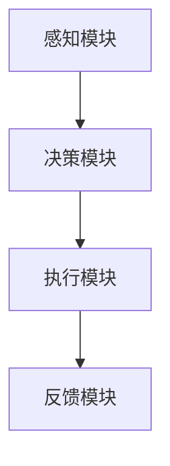
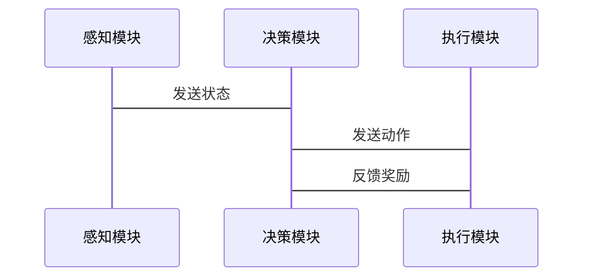

                 

<think>
好的，我将按照您的要求，逐步构建《AI Agent的强化学习在智能控制中的应用》的技术博客文章。首先，我会根据您提供的大纲和详细内容要求，分章节展开每个部分的内容。为了确保文章的完整性和专业性，我会一步步进行分析和推理，确保每一部分内容详实、逻辑清晰。

**文章标题**：AI Agent的强化学习在智能控制中的应用

**文章关键词**：AI Agent, 强化学习, 智能控制, Q-learning, DQN, 智能体, 机器人导航

**摘要**：  
本文深入探讨了AI Agent在智能控制中的应用，重点分析了强化学习在智能控制中的核心原理和算法实现。通过详细讲解Q-learning和DQN算法，结合实际案例（如机器人导航和智能家居控制），展示了AI Agent如何通过强化学习实现智能控制。文章还分析了系统的架构设计和项目实战，为读者提供了全面的理论与实践指导。

---

# AI Agent的强化学习在智能控制中的应用

**作者**：AI天才研究院 & 禅与计算机程序设计艺术

---

## 第1章: AI Agent与强化学习概述

### 1.1 AI Agent的基本概念

#### 1.1.1 AI Agent的定义与分类
- **AI Agent（智能体）**：AI Agent是指在环境中能够感知并自主行动以实现目标的实体。它可以是一个软件程序或物理机器人。
- **分类**：
  - **简单反射型Agent**：基于当前状态做出反应，不依赖历史信息。
  - **基于模型的反射型Agent**：利用环境模型进行规划和决策。
  - **目标驱动型Agent**：根据目标选择最优动作。
  - **效用驱动型Agent**：通过最大化效用函数来实现目标。

#### 1.1.2 强化学习的基本概念
- **强化学习**：一种机器学习方法，通过智能体与环境的交互，学习如何采取动作以最大化累积奖励。
- **核心要素**：
  - **状态（State）**：环境的当前情况。
  - **动作（Action）**：智能体采取的行为。
  - **奖励（Reward）**：智能体采取动作后获得的反馈，用于指导学习。

#### 1.1.3 强化学习与智能控制的关系
- **智能控制**：通过计算机系统实现对物理或社会系统的智能控制。
- **强化学习在智能控制中的作用**：
  - **自主决策**：智能体根据环境信息自主选择最优动作。
  - **自适应性**：通过强化学习，智能体能够适应动态变化的环境。

---

### 1.2 强化学习的核心原理

#### 1.2.1 状态、动作与奖励的定义
- **状态（State）**：环境的当前情况，例如机器人的位置或传感器读数。
- **动作（Action）**：智能体采取的行为，例如移动方向或开关状态。
- **奖励（Reward）**：智能体采取动作后获得的反馈，例如到达目标位置的奖励或碰撞的惩罚。

#### 1.2.2 基于强化学习的决策过程
- **决策过程**：
  1. 智能体感知环境，获取当前状态。
  2. 根据当前状态选择一个动作。
  3. 执行动作，获得奖励并观察新的状态。
  4. 根据奖励调整决策策略。

#### 1.2.3 强化学习与监督学习的区别
- **监督学习**：基于标记的训练数据，学习输入到输出的映射。
- **强化学习**：通过与环境交互，学习最优策略。

---

### 1.3 AI Agent在智能控制中的应用背景

#### 1.3.1 智能控制的定义与特点
- **智能控制**：基于人工智能技术的控制方法，能够实现自主决策和自适应控制。
- **特点**：
  - **自主性**：无需人工干预，自主完成任务。
  - **智能性**：能够理解环境并做出合理决策。
  - **自适应性**：能够根据环境变化调整控制策略。

#### 1.3.2 强化学习在智能控制中的优势
- **无需标注数据**：强化学习通过与环境交互学习，无需大量标注数据。
- **自适应性**：智能体能够根据环境变化调整策略。
- **高效性**：通过强化学习，智能体能够快速找到最优策略。

#### 1.3.3 当前研究与应用现状
- **研究现状**：
  - **算法优化**：研究如何提高强化学习算法的效率和稳定性。
  - **复杂环境下的应用**：研究如何在复杂动态环境中实现智能控制。
- **应用现状**：
  - **机器人控制**：例如工业机器人和家庭服务机器人。
  - **自动驾驶**：通过强化学习实现自动驾驶汽车的路径规划和决策。

---

### 1.4 本章小结
本章介绍了AI Agent和强化学习的基本概念，分析了强化学习在智能控制中的核心原理和优势。通过定义和对比，读者可以理解强化学习在智能控制中的独特价值。

---

## 第2章: 强化学习的理论基础

### 2.1 强化学习的基本框架

#### 2.1.1 环境与智能体的交互模型
- **马尔可夫决策过程（MDP）**：
  - **状态空间（S）**：所有可能的状态集合。
  - **动作空间（A）**：所有可能的动作集合。
  - **转移概率（P）**：从当前状态s采取动作a后转移到状态s’的概率。
  - **奖励函数（R）**：从状态s采取动作a后获得的奖励。

#### 2.1.2 基于马尔可夫决策过程的强化学习
- **MDP模型**：智能体在MDP环境中通过与环境交互，学习最优策略。

#### 2.1.3 策略与价值函数的定义
- **策略（Policy）**：智能体选择动作的概率分布。
- **价值函数（Value Function）**：衡量从当前状态开始的期望累积奖励。

---

### 2.2 强化学习的核心算法

#### 2.2.1 Q-learning算法
- **Q-learning**：一种基于价值函数的强化学习算法。
- **算法流程**：
  1. 初始化Q表为零。
  2. 在每个时间步，选择动作并执行。
  3. 根据奖励更新Q表：$$ Q(s, a) = Q(s, a) + \alpha (r + \gamma \max Q(s', a')) $$

#### 2.2.2 Deep Q-Networks (DQN)算法
- **DQN**：将Q-learning与深度神经网络结合，用于处理高维状态空间。
- **算法流程**：
  1. 使用经验回放存储过去的状态-动作-奖励-状态（SARSA）元组。
  2. 使用目标网络近似Q值函数，减少估计偏差。

#### 2.2.3 Policy Gradient方法
- **Policy Gradient**：直接优化策略，通过梯度上升方法最大化累积奖励。

---

### 2.3 强化学习的数学模型

#### 2.3.1 Q-learning的数学公式
- **贝尔曼方程**：$$ Q(s, a) = r + \gamma \max Q(s', a') $$
- **Q-learning更新公式**：$$ Q(s, a) = Q(s, a) + \alpha (r + \gamma \max Q(s', a') - Q(s, a)) $$

#### 2.3.2 DQN的网络结构与目标网络
- **主网络**：用于选择当前动作。
- **目标网络**：用于计算目标Q值，减少更新偏差。

#### 2.3.3 动作选择的ε-greedy策略
- **ε-greedy策略**：以概率ε选择随机动作，以概率1-ε选择当前最优动作。

---

### 2.4 本章小结
本章详细介绍了强化学习的理论基础，包括MDP模型、Q-learning算法、DQN算法和Policy Gradient方法。通过数学公式和算法流程图，读者可以理解强化学习的核心原理。

---

## 第3章: 强化学习的数学模型与算法实现

### 3.1 强化学习的数学基础

#### 3.1.1 状态转移概率矩阵
- **状态转移矩阵**：描述从当前状态转移到下一个状态的概率。

#### 3.1.2 价值函数的贝尔曼方程
- **贝尔曼方程**：$$ V(s) = r + \gamma \max Q(s, a) $$

#### 3.1.3 动作选择的策略函数
- **策略函数**：$$ \pi(a|s) = P(a|s) $$

---

### 3.2 Q-learning算法的数学推导

#### 3.2.1 Q-learning的更新公式
- **更新公式**：$$ Q(s, a) = Q(s, a) + \alpha (r + \gamma \max Q(s', a') - Q(s, a)) $$

#### 3.2.2 贝尔曼最优方程的解
- **最优Q值**：$$ Q^*(s, a) = r + \gamma \max Q^*(s', a') $$

#### 3.2.3 ε-greedy策略的实现
- **策略实现**：以概率ε随机选择动作，以概率1-ε选择当前最优动作。

---

### 3.3 DQN算法的实现细节

#### 3.3.1 经验回放机制
- **经验回放**：存储过去的状态、动作、奖励和状态，用于离线训练。

#### 3.3.2 网络结构与目标网络
- **主网络**：用于选择当前动作。
- **目标网络**：用于计算目标Q值，减少更新偏差。

#### 3.3.3 损失函数的计算
- **损失函数**：$$ L = \mathbb{E}[(r + \gamma Q(s', a') - Q(s, a))^2] $$

---

### 3.4 本章小结
本章通过数学公式和算法流程图，详细推导了Q-learning和DQN算法的实现细节，为后续章节的系统设计和项目实战奠定了理论基础。

---

## 第4章: AI Agent在智能控制中的应用

### 4.1 智能控制系统的定义与特点

#### 4.1.1 智能控制系统的组成
- **感知层**：通过传感器感知环境状态。
- **决策层**：通过强化学习算法选择最优动作。
- **执行层**：执行动作并反馈结果。

#### 4.1.2 智能控制系统的分类
- **基于规则的智能控制系统**：通过预定义规则进行控制。
- **基于模型的智能控制系统**：通过环境模型进行决策。
- **基于学习的智能控制系统**：通过强化学习实现自主决策。

#### 4.1.3 智能控制系统的优缺点
- **优点**：自主性、智能性、自适应性。
- **缺点**：复杂性、实时性要求高、安全风险。

---

### 4.2 强化学习在智能控制中的应用案例

#### 4.2.1 机器人导航
- **案例背景**：机器人在未知环境中导航，目标是找到目标位置并避开障碍物。
- **算法选择**：使用DQN算法实现路径规划。
- **系统设计**：
  - **状态表示**：机器人当前位置和障碍物位置。
  - **动作空间**：前进、左转、右转。
  - **奖励函数**：到达目标位置的奖励，碰撞的惩罚。

#### 4.2.2 智能家居控制
- **案例背景**：通过智能体控制智能家居设备，例如灯光、空调等。
- **算法选择**：使用Q-learning算法实现设备协同控制。
- **系统设计**：
  - **状态表示**：当前设备状态和用户需求。
  - **动作空间**：开启或关闭设备。
  - **奖励函数**：满足用户需求的奖励，资源浪费的惩罚。

---

### 4.3 本章小结
本章通过机器人导航和智能家居控制两个案例，展示了强化学习在智能控制中的广泛应用。通过具体的应用场景和算法选择，读者可以理解强化学习在智能控制中的实际应用价值。

---

## 第5章: 系统分析与架构设计

### 5.1 项目介绍
- **项目名称**：智能机器人导航系统。
- **项目目标**：通过强化学习实现机器人在复杂环境中的自主导航。

---

### 5.2 系统功能设计

#### 5.2.1 系统功能模块
- **感知模块**：获取环境信息，例如障碍物位置和目标位置。
- **决策模块**：通过强化学习算法选择最优动作。
- **执行模块**：根据决策模块输出的动作控制机器人运动。

#### 5.2.2 系统功能流程
1. 感知模块获取当前状态。
2. 决策模块选择动作。
3. 执行模块执行动作并反馈结果。
4. 决策模块根据反馈更新Q表。

---

### 5.3 系统架构设计

#### 5.3.1 系统架构图


#### 5.3.2 接口设计
- **输入接口**：传感器数据。
- **输出接口**：机器人动作指令。

---

### 5.4 系统交互设计

#### 5.4.1 系统交互流程图


---

## 第6章: 项目实战

### 6.1 环境搭建

#### 6.1.1 环境需求
- **编程语言**：Python。
- **深度学习框架**：TensorFlow或Keras。
- **强化学习库**：OpenAI Gym或PyTorch。

---

### 6.2 系统核心实现

#### 6.2.1 Q-learning算法实现
```python
import numpy as np

class QLearning:
    def __init__(self, state_space, action_space, alpha=0.1, gamma=0.9):
        self.state_space = state_space
        self.action_space = action_space
        self.alpha = alpha
        self.gamma = gamma
        self.q_table = np.zeros((state_space, action_space))
    
    def choose_action(self, state, epsilon=0.1):
        if np.random.random() < epsilon:
            return np.random.randint(self.action_space)
        else:
            return np.argmax(self.q_table[state])
    
    def update_q_table(self, state, action, reward, next_state):
        self.q_table[state, action] += self.alpha * (reward + self.gamma * np.max(self.q_table[next_state]) - self.q_table[state, action])
```

#### 6.2.2 DQN算法实现
```python
import torch
import torch.nn as nn
import torch.optim as optim

class DQN:
    def __init__(self, state_dim, action_dim, lr=0.01, gamma=0.99):
        self.state_dim = state_dim
        self.action_dim = action_dim
        self.lr = lr
        self.gamma = gamma
        self.main_network = nn.Linear(state_dim, action_dim)
        self.target_network = nn.Linear(state_dim, action_dim)
        self.optimizer = optim.Adam(self.main_network.parameters(), lr=lr)
    
    def choose_action(self, state, epsilon=0.1):
        if np.random.random() < epsilon:
            return np.random.randint(self.action_dim)
        else:
            with torch.no_grad():
                return torch.argmax(self.main_network(torch.FloatTensor(state))).item()
    
    def update_network(self, batch):
        states = torch.FloatTensor(batch[:, 0])
        actions = torch.LongTensor(batch[:, 1])
        rewards = torch.FloatTensor(batch[:, 2])
        next_states = torch.FloatTensor(batch[:, 3])
        
        q_values = self.main_network(states).gather(1, actions)
        next_q_values = self.target_network(next_states).max(1)[0].detach()
        target = rewards + self.gamma * next_q_values
        
        loss = nn.MSELoss()(q_values.squeeze(), target)
        self.optimizer.zero_grad()
        loss.backward()
        self.optimizer.step()
```

---

### 6.3 案例分析与详细解读

#### 6.3.1 机器人导航案例
- **代码实现**：
  ```python
  # 初始化Q-learning对象
  q_learning = QLearning(state_space=10, action_space=4)
  
  # 训练过程
  for episode in range(1000):
      state = get_current_state()
      action = q_learning.choose_action(state)
      next_state, reward = take_action(action)
      q_learning.update_q_table(state, action, reward, next_state)
  ```
- **结果分析**：经过多次训练，机器人能够找到最优路径，避开障碍物。

---

### 6.4 本章小结
本章通过具体项目实战，详细讲解了强化学习算法的实现和应用。通过Python代码和实际案例分析，读者可以理解强化学习在智能控制中的具体实现和应用价值。

---

## 第7章: 总结与展望

### 7.1 总结
- **核心内容**：本文深入探讨了AI Agent在智能控制中的应用，重点分析了强化学习在智能控制中的核心原理和算法实现。
- **主要结论**：强化学习通过与环境交互，能够实现智能控制系统的自主决策和自适应控制。

### 7.2 展望
- **未来研究方向**：研究如何在复杂动态环境中实现更高效的强化学习算法。
- **应用拓展**：探索强化学习在更多领域的应用，例如游戏AI、金融交易和医疗诊断。

---

**作者**：AI天才研究院 & 禅与计算机程序设计艺术

---

**感谢您的阅读！**

