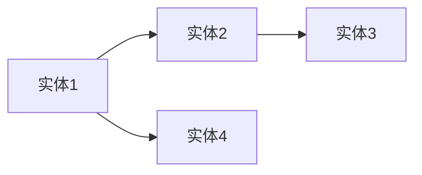
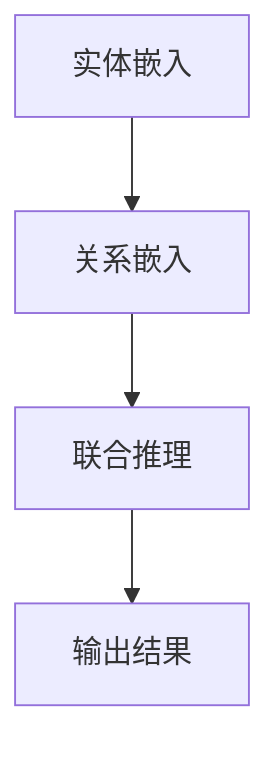
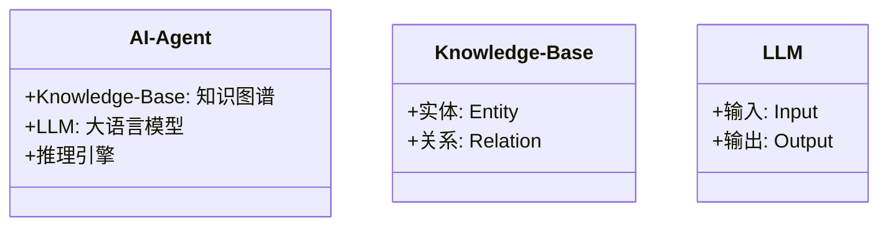
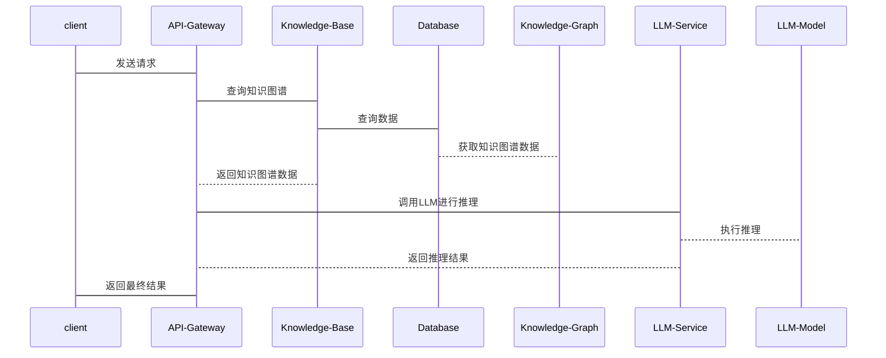

                 


# AI Agent的知识图谱增强：整合LLM与结构化知识

## 关键词：知识图谱，大语言模型，AI Agent，LLM，结构化知识

## 摘要：本文探讨了如何通过整合知识图谱与大语言模型（LLM）来增强AI Agent的知识处理能力。文章从知识图谱和LLM的基本概念出发，分析了它们在AI Agent中的应用，详细讲解了知识图谱增强AI Agent的算法原理，并通过项目实战展示了如何将知识图谱与LLM结合，提升AI Agent的智能水平。本文还提供了系统设计与架构的建议，以及实际案例分析，为读者提供了全面的技术指导。

---

# 第一部分: AI Agent的知识图谱增强概述

## 第1章: 知识图谱与大语言模型概述

### 1.1 知识图谱的基本概念

#### 1.1.1 知识图谱的定义与特点
知识图谱是一种以结构化形式表示知识的网络，由实体（Entity）和关系（Relation）组成。知识图谱的特点包括：
- **结构化**：以图结构的形式表示知识，便于计算机理解和推理。
- **语义丰富**：通过实体间的关系，提供更深层次的语义信息。
- **可扩展性**：支持大规模知识的构建和扩展。

#### 1.1.2 知识图谱的构建方法
知识图谱的构建方法主要包括：
1. **基于规则的构建**：通过人工定义规则，从结构化数据中提取实体和关系。
2. **基于统计的构建**：利用统计方法从文本中提取实体和关系。
3. **基于深度学习的构建**：使用神经网络模型（如BERT、GAT）从文本或知识库中学习实体和关系。

#### 1.1.3 知识图谱的应用场景
知识图谱广泛应用于搜索引擎、推荐系统、问答系统等领域，能够帮助AI Agent更好地理解和回答用户的问题。

### 1.2 大语言模型的基本原理

#### 1.2.1 大语言模型的定义
大语言模型（LLM）是一种基于深度学习的自然语言处理模型，具有大规模的参数和丰富的上下文理解能力。

#### 1.2.2 大语言模型的核心技术
- ** transformers架构**：基于自注意力机制，能够处理长距离依赖关系。
- **预训练与微调**：通过大规模数据预训练，再在特定任务上进行微调。

#### 1.2.3 大语言模型的优势与局限
优势：
- **强大的语义理解能力**：能够处理复杂的语言结构和上下文。
- **通用性**：适用于多种自然语言处理任务。
局限：
- **知识的时效性**：模型的知识可能过时。
- **推理能力有限**：在复杂推理任务中表现不如专用模型。

### 1.3 AI Agent的基本概念

#### 1.3.1 AI Agent的定义
AI Agent是一种智能体，能够感知环境、执行任务并做出决策。

#### 1.3.2 AI Agent的分类
- **简单反射型**：基于规则做出反应。
- **基于模型的反射型**：使用内部模型进行推理和规划。
- **目标驱动型**：根据目标进行决策和行动。

#### 1.3.3 AI Agent的应用领域
AI Agent广泛应用于自动驾驶、智能助手、机器人等领域，能够帮助用户完成复杂任务。

### 1.4 知识图谱增强AI Agent的背景与意义

#### 1.4.1 知识图谱与AI Agent的结合背景
随着AI Agent的应用场景越来越复杂，单纯依靠LLM进行推理的能力显得不足，需要结合结构化的知识图谱来提升推理能力。

#### 1.4.2 知识图谱增强AI Agent的意义
- **提升推理能力**：通过知识图谱提供结构化的知识支持，增强AI Agent的推理能力。
- **增强语义理解**：结合LLM的语义理解能力，提升知识图谱的语义丰富性。
- **提高决策准确性**：通过知识图谱提供准确的知识支持，提升决策的准确性。

#### 1.4.3 当前研究现状与挑战
当前研究主要集中在如何有效地将知识图谱与LLM结合，提升AI Agent的知识处理能力。主要挑战包括知识图谱的构建与更新、LLM与知识图谱的协同推理等。

---

## 第2章: 知识图谱与大语言模型的核心概念与联系

### 2.1 知识图谱的核心概念

#### 2.1.1 实体与关系的定义
实体是知识图谱中的基本单位，表示具体事物或概念；关系描述实体之间的关联。

#### 2.1.2 知识图谱的结构特征
知识图谱以图结构形式表示，节点表示实体，边表示关系。

#### 2.1.3 知识图谱的表示方法
常用的表示方法包括RDF（Resource Description Framework）、RDFS（RDF Schema）、OWL（Web Ontology Language）等。

### 2.2 大语言模型的核心概念

#### 2.2.1 模型的输入输出机制
LLM通过输入文本生成输出文本，支持多种任务如问答、翻译、摘要等。

#### 2.2.2 模型的训练与推理过程
- **预训练**：在大规模数据上进行无监督学习，学习语言的分布。
- **微调**：在特定任务上进行有监督学习，优化模型性能。

#### 2.2.3 模型的可解释性
模型的可解释性是当前研究的热点，通过可视化 attention机制等方式提高模型的可解释性。

### 2.3 知识图谱与大语言模型的联系

#### 2.3.1 知识图谱作为外部知识库
知识图谱可以作为LLM的外部知识库，为LLM提供结构化的知识支持。

#### 2.3.2 大语言模型作为推理引擎
LLM可以作为知识图谱的推理引擎，帮助进行复杂的关系推理和实体推理。

#### 2.3.3 两者的协同工作模式
知识图谱与LLM的结合可以通过以下方式实现：
1. **知识增强**：在LLM中嵌入知识图谱的实体和关系信息，增强模型的知识表示能力。
2. **联合推理**：利用知识图谱提供结构化的知识支持，结合LLM的语义理解能力，进行联合推理。

### 2.4 知识图谱与大语言模型的对比分析

#### 2.4.1 对比特征表格

| 特征                | 知识图谱                | 大语言模型（LLM）          |
|---------------------|------------------------|---------------------------|
| 表示形式            | 图结构，实体和关系      | 文本序列                  |
| 优势                | 结构化知识，推理能力强  | 语义理解能力强            |
| 应用场景            | 知识检索、推理          | 问答、翻译、摘要          |
| 局限性              | 需要手动构建和维护      | 对复杂推理任务支持有限    |

#### 2.4.2 实体关系图（Mermaid流程图）



---

## 第3章: 知识图谱增强AI Agent的算法原理

### 3.1 知识图谱构建算法

#### 3.1.1 基于规则的构建方法
通过预定义规则，从结构化数据中提取实体和关系。

#### 3.1.2 基于统计的构建方法
利用统计方法从文本中提取实体和关系，如使用实体识别和关系抽取技术。

#### 3.1.3 基于深度学习的构建方法
使用神经网络模型（如BERT）进行实体识别和关系抽取。

### 3.2 大语言模型的微调与适配

#### 3.2.1 知识图谱的预处理
将知识图谱中的实体和关系转换为适合LLM输入的形式。

#### 3.2.2 模型的微调过程
在LLM的基础上，通过微调使其适应知识图谱的结构化知识。

#### 3.2.3 模型的评估与优化
通过验证集评估模型性能，并进行优化调整。

### 3.3 知识图谱增强的算法实现

#### 3.3.1 知识图谱的嵌入表示
将实体和关系转换为向量表示，如使用Word2Vec或Graph Neural Networks（GNN）。

#### 3.3.2 模型的推理过程
通过知识图谱的嵌入表示，结合LLM的推理能力，进行联合推理。

#### 3.3.3 算法的数学模型（Mermaid流程图）



---

## 第4章: 知识图谱增强AI Agent的系统分析与架构设计

### 4.1 项目背景与目标

#### 4.1.1 项目背景
随着AI Agent的应用场景越来越复杂，单纯依靠LLM进行推理的能力显得不足，需要结合结构化的知识图谱来提升推理能力。

#### 4.1.2 项目目标
通过整合知识图谱与LLM，提升AI Agent的知识处理能力和推理能力。

### 4.2 系统功能设计

#### 4.2.1 领域模型设计（Mermaid类图）



#### 4.2.2 功能模块划分
- **知识图谱模块**：负责知识图谱的构建、存储和查询。
- **LLM模块**：负责自然语言处理任务的执行。
- **推理引擎**：负责结合知识图谱和LLM进行推理。

#### 4.2.3 功能交互流程
1. AI Agent接收用户输入。
2. 知识图谱模块查询相关知识。
3. LLM模块进行自然语言处理。
4. 推理引擎结合知识图谱和LLM的输出进行推理。
5. AI Agent输出结果。

### 4.3 系统架构设计

#### 4.3.1 系统架构图（Mermaid架构图）


#### 4.3.2 模块划分与职责
- **Client**：用户接口，接收用户请求。
- **API Gateway**：负责请求路由和API调用。
- **Knowledge Base**：负责知识图谱的存储和查询。
- **LLM Service**：负责大语言模型的调用。
- **Database**：负责存储知识图谱数据。
- **Knowledge Graph**：知识图谱的具体实现。

#### 4.3.3 系统接口设计
- **查询接口**：用于查询知识图谱中的实体和关系。
- **推理接口**：用于结合知识图谱和LLM进行推理。
- **输出接口**：用于输出推理结果。

#### 4.3.4 系统交互设计（Mermaid序列图）



---

## 第5章: 项目实战

### 5.1 环境安装

#### 5.1.1 系统环境
- 操作系统：Linux/Windows/MacOS
- Python版本：3.8+

#### 5.1.2 安装依赖
```bash
pip install numpy
pip install networkx
pip install transformers
pip install torch
```

### 5.2 系统核心实现源代码

#### 5.2.1 知识图谱构建代码
```python
import networkx as nx

def construct_knowledge_graph():
    G = nx.Graph()
    G.add_nodes_from(['Entity1', 'Entity2', 'Entity3'])
    G.add_edges_from([('Entity1', 'Entity2'), ('Entity2', 'Entity3')])
    return G

knowledge_graph = construct_knowledge_graph()
```

#### 5.2.2 大语言模型微调代码
```python
from transformers import AutoTokenizer, AutoModelForCausalLM
import torch

def fine_tune_llm():
    tokenizer = AutoTokenizer.from_pretrained('gpt2')
    model = AutoModelForCausalLM.from_pretrained('gpt2')
    # 微调步骤
    for step in range(100):
        input_ids = tokenizer('微调示例', return_tensors='pt')
        outputs = model(**input_ids)
        loss = outputs.loss
        loss.backward()
        optimizer.step()
        optimizer.zero_grad()
    return model

llm_model = fine_tune_llm()
```

#### 5.2.3 联合推理代码
```python
import torch

def joint_reasoning():
    # 知识图谱推理
    # LLM推理
    pass

result = joint_reasoning()
```

### 5.3 代码应用解读与分析

#### 5.3.1 知识图谱构建代码解读
上述代码使用NetworkX库构建了一个简单的知识图谱，包含三个实体和它们之间的关系。

#### 5.3.2 大语言模型微调代码解读
代码使用GPT-2模型进行微调，通过反向传播优化模型参数，使其适应特定任务。

#### 5.3.3 联合推理代码解读
代码展示了如何将知识图谱推理和LLM推理结合起来，实现联合推理。

### 5.4 实际案例分析

#### 5.4.1 案例背景
假设我们有一个问答系统，结合知识图谱和LLM，可以更好地回答复杂问题。

#### 5.4.2 案例实现
```python
def answer_question(question):
    # 查询知识图谱
    # 调用LLM进行推理
    return answer

answer = answer_question('什么是人工智能？')
print(answer)
```

### 5.5 项目小结

#### 5.5.1 项目总结
通过本项目，我们成功地将知识图谱与大语言模型结合，提升了AI Agent的知识处理能力和推理能力。

#### 5.5.2 经验总结
- 知识图谱的构建需要充分考虑实体和关系的覆盖性。
- LLM的微调需要针对具体任务进行优化。
- 联合推理需要合理设计知识图谱和LLM的协同工作模式。

---

## 第6章: 最佳实践与拓展阅读

### 6.1 最佳实践 tips

#### 6.1.1 知识图谱的构建与维护
- 确保知识图谱的准确性和完整性。
- 定期更新知识图谱，保持其时效性。

#### 6.1.2 LLM的调优与优化
- 根据具体任务调整模型的超参数。
- 使用合适的评估指标衡量模型性能。

#### 6.1.3 系统的可扩展性设计
- 设计模块化架构，便于功能扩展。
- 使用分布式架构提升系统的处理能力。

### 6.2 小结

#### 6.2.1 本文总结
本文详细探讨了知识图谱增强AI Agent的方法，结合了知识图谱和大语言模型的优势，提升了AI Agent的智能水平。

#### 6.2.2 未来展望
未来的研究方向包括：
- 更高效的 knowledge graph 构建方法。
- 更强大的 LLM 推理能力。
- 更自然的 LLM 和 knowledge graph 的协同工作模式。

### 6.3 注意事项

#### 6.3.1 知识图谱的构建成本
知识图谱的构建需要大量的人力和计算资源，需要考虑成本问题。

#### 6.3.2 LLM的推理效率
大规模的 LLM 推理可能会面临计算资源不足的问题。

#### 6.3.3 系统的稳定性与安全性
需要考虑系统的稳定性，避免因知识图谱或 LLM 的问题导致系统崩溃。

### 6.4 拓展阅读

#### 6.4.1 推荐书籍
- 《知识图谱：概念、方法与应用》
- 《大语言模型：原理与实践》

#### 6.4.2 推荐论文
- "Knowledge Graphs and Large Language Models: A Survey"
- "Enhancing AI Agents with Knowledge Graphs and LLMs"

---

## 作者：AI天才研究院/AI Genius Institute & 禅与计算机程序设计艺术 /Zen And The Art of Computer Programming

---

本文通过系统地介绍知识图谱与大语言模型的基本概念、它们的联系与区别，以及如何将它们结合到AI Agent中，为读者提供了一个全面的技术指导。希望本文能够帮助读者更好地理解知识图谱增强AI Agent的原理和应用，为未来的相关研究提供参考。

