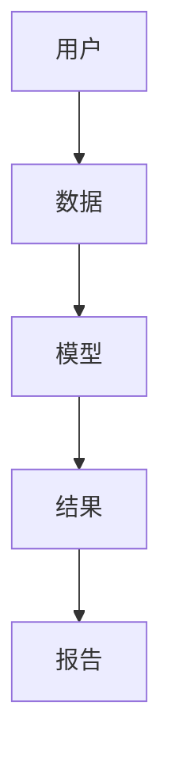
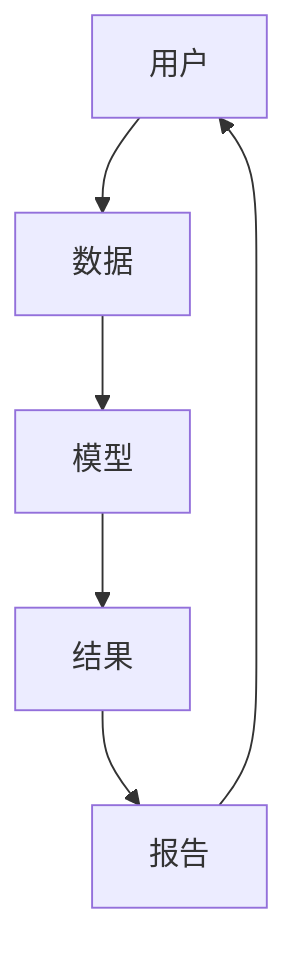
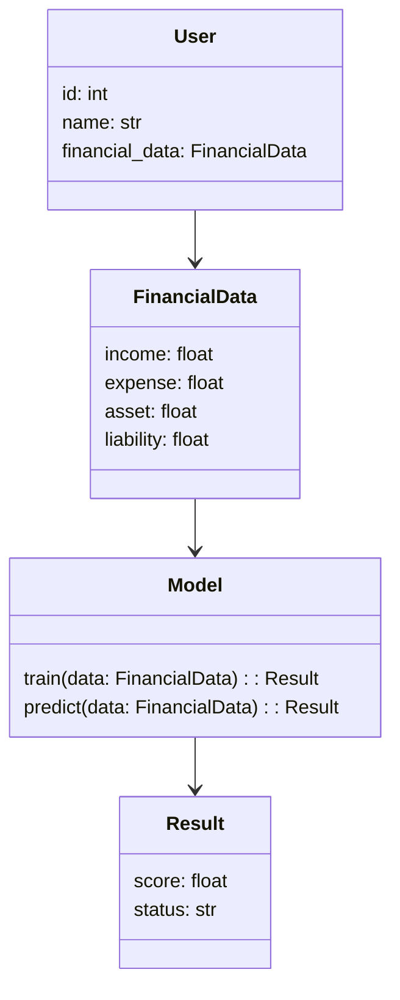
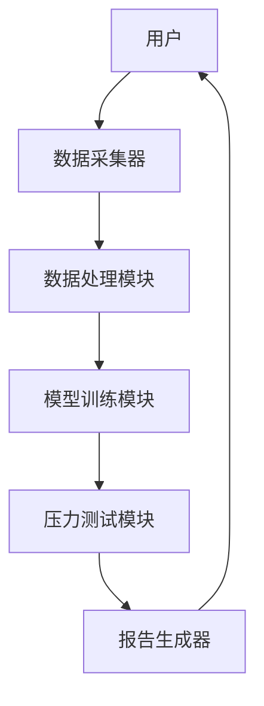
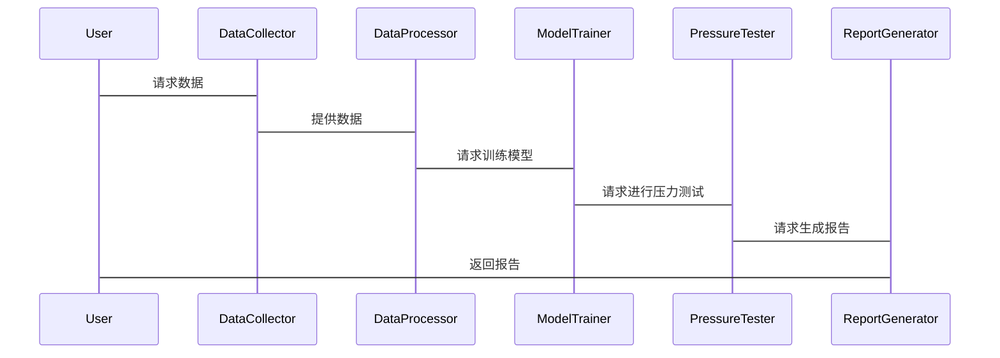

                 


# AI驱动的个人财务压力测试系统设计与实现

> 关键词：AI驱动、个人财务、压力测试、系统设计、机器学习

> 摘要：本文详细探讨了AI驱动的个人财务压力测试系统的背景、核心概念、算法原理、系统架构设计和项目实现。通过结合传统压力测试的不足，提出了一种基于AI的解决方案，介绍了系统的功能模块、算法实现、数学模型以及实际案例，展示了AI在提升财务风险管理中的巨大潜力。

---

# 第1章: AI驱动的个人财务压力测试系统概述

## 1.1 问题背景与描述

### 1.1.1 传统个人财务风险管理的局限性
传统个人财务压力测试通常依赖于人工分析和静态模型，难以应对复杂多变的金融市场环境。主要问题包括：
- 数据处理能力有限，难以覆盖所有可能的极端场景。
- 计算效率低，响应时间长，无法实现实时监控。
- 模型复杂性高，难以快速调整以适应市场变化。

### 1.1.2 人工智能在金融领域的应用潜力
人工智能（AI）技术在金融领域的应用越来越广泛，尤其是在风险管理和压力测试方面。AI能够通过大数据分析、机器学习模型和自然语言处理等技术，帮助金融机构和个体更高效地识别和应对潜在风险。

### 1.1.3 个人财务压力测试的核心问题与目标
个人财务压力测试的核心问题是评估个人在面对经济波动、收入变化、支出增加等压力时的财务稳定性。目标是通过模拟不同压力情景，预测个人财务状况的变化，并制定相应的应对策略。

---

## 1.2 AI驱动的解决方案

### 1.2.1 人工智能在压力测试中的优势
AI驱动的压力测试系统具有以下优势：
- 高效性：AI算法能够快速处理大量数据，生成实时压力测试结果。
- 准确性：通过机器学习模型，可以更准确地预测潜在风险。
- 灵活性：AI模型可以动态调整参数，适应不同的压力情景。

### 1.2.2 系统设计的核心目标与关键特性
系统的核心目标是实现个人财务压力测试的自动化和智能化。关键特性包括：
- 数据驱动：基于个人财务数据和市场数据进行分析。
- 模型可解释性：确保模型的预测结果能够被用户理解和信任。
- 实时性：支持实时监控和快速响应。

### 1.2.3 系统的边界与外延
系统的边界包括：
- 输入数据：个人财务数据、市场数据。
- 输出结果：压力测试报告、风险预警。
- 外延：与第三方数据源的集成，例如银行账户、股票市场数据等。

---

## 1.3 系统核心要素与概念结构

### 1.3.1 系统功能模块的构成
系统主要包括以下功能模块：
- 数据采集与预处理模块。
- 模型训练与预测模块。
- 压力测试报告生成模块。
- 风险预警模块。

### 1.3.2 核心概念的属性特征对比表

| 核心概念 | 属性特征 |
|----------|----------|
| 数据源   | 来源：银行账户、股票交易记录；类型：结构化数据、非结构化数据 |
| 模型类型 | 线性回归、随机森林、神经网络 |
| 压力情景 | 收入下降、支出增加、市场波动 |

### 1.3.3 实体关系图（ER图）



---

# 第2章: AI驱动的个人财务压力测试系统核心概念与联系

## 2.1 核心概念原理

### 2.1.1 压力测试的定义与分类
压力测试是一种通过模拟极端市场条件来评估资产或负债组合在不利情况下的表现的方法。常见的分类包括：
- 情景分析：基于假设的市场情景进行测试。
- 因素分析：基于特定风险因素进行测试。

### 2.1.2 AI在压力测试中的应用原理
AI通过机器学习模型，从历史数据中学习潜在的模式和关系，预测在不同压力情景下个人财务状况的变化。

### 2.1.3 系统的核心算法与模型
常用的算法包括：
- 线性回归：用于预测连续型变量。
- 支持向量机（SVM）：用于分类和回归。
- 神经网络：用于处理非线性关系。

---

## 2.2 核心概念属性特征对比

### 2.2.1 传统压力测试与AI驱动压力测试的对比

| 对比维度       | 传统压力测试               | AI驱动压力测试             |
|----------------|----------------------------|----------------------------|
| 数据处理能力   | 依赖人工分析，处理能力有限   | 基于机器学习，处理能力强    |
| 模型复杂性      | 模型简单，难以覆盖复杂场景   | 模型复杂，能够覆盖更多场景   |
| 响应时间       | 响应时间长                 | 响应时间短                 |

### 2.2.2 不同AI模型在压力测试中的表现对比

| 模型类型       | 优点                           | 缺点                           |
|----------------|--------------------------------|--------------------------------|
| 线性回归       | 模型简单，易于解释             | 无法处理非线性关系             |
| 随机森林       | 能处理非线性关系，抗过拟合     | 解释性较差                   |
| 神经网络       | 表现优异，适合复杂场景         | 计算复杂，解释性较差           |

---

## 2.3 实体关系图（ER图）



---

# 第3章: 系统算法原理与实现

## 3.1 算法原理概述

### 3.1.1 机器学习在压力测试中的应用
机器学习通过训练模型，从历史数据中学习潜在的模式和关系，预测在不同压力情景下个人财务状况的变化。

### 3.1.2 神经网络模型的原理与优势
神经网络模型具有强大的非线性拟合能力，能够处理复杂的金融市场数据，提高压力测试的准确性。

---

## 3.2 算法实现流程

### 3.2.1 数据预处理与特征提取
数据预处理包括：
- 数据清洗：处理缺失值、异常值。
- 数据归一化：将数据标准化，便于模型训练。

特征提取包括：
- 收入、支出、资产、负债等财务指标。
- 市场波动率、利率变化等宏观经济指标。

### 3.2.2 模型训练与优化
使用训练数据训练机器学习模型，例如随机森林或神经网络模型。通过交叉验证优化模型参数。

### 3.2.3 模型评估与验证
使用测试数据评估模型的性能，例如计算准确率、召回率等指标。

---

## 3.3 算法实现代码

### 3.3.1 环境安装与配置
需要安装以下库：
- Python 3.x
- scikit-learn
- pandas
- numpy
- matplotlib

### 3.3.2 核心代码实现

```python
import pandas as pd
import numpy as np
from sklearn.model_selection import train_test_split
from sklearn.ensemble import RandomForestRegressor
from sklearn.metrics import mean_squared_error

# 数据加载
data = pd.read_csv('financial_data.csv')

# 数据预处理
data.dropna()
data = data.drop(columns=['user_id'])
X = data.drop(columns=['financial_health'])
y = data['financial_health']

# 划分训练集和测试集
X_train, X_test, y_train, y_test = train_test_split(X, y, test_size=0.2, random_state=42)

# 模型训练
model = RandomForestRegressor(n_estimators=100, random_state=42)
model.fit(X_train, y_train)

# 模型预测
y_pred = model.predict(X_test)

# 模型评估
 mse = mean_squared_error(y_test, y_pred)
 print(f'Mean Squared Error: {mse}')
```

---

## 3.4 数学模型与公式解析

### 3.4.1 线性回归模型公式
$$ y = \beta_0 + \beta_1x_1 + \beta_2x_2 + \dots + \beta_nx_n $$

### 3.4.2 神经网络模型公式
$$ y = \sigma(w \cdot x + b) $$
其中，$$ \sigma $$ 是激活函数，$$ w $$ 是权重，$$ b $$ 是偏置。

---

# 第4章: 系统分析与架构设计

## 4.1 系统功能设计

### 4.1.1 领域模型类图



### 4.1.2 功能模块划分
- 数据采集模块：负责采集个人财务数据。
- 数据处理模块：对数据进行预处理和特征提取。
- 模型训练模块：训练机器学习模型。
- 压力测试模块：生成压力测试报告。

---

## 4.2 系统架构设计

### 4.2.1 系统架构图



---

## 4.3 系统接口设计

### 4.3.1 API接口
- 数据接口：用于获取个人财务数据。
- 模型接口：用于调用机器学习模型进行预测。
- 报告接口：用于生成压力测试报告。

### 4.3.2 接口交互流程图



---

# 第5章: 项目实战

## 5.1 环境安装与配置
需要安装以下库：
- Python 3.x
- scikit-learn
- pandas
- numpy
- matplotlib

---

## 5.2 核心代码实现

### 5.2.1 数据采集与预处理
```python
import pandas as pd
import numpy as np

data = pd.read_csv('financial_data.csv')

# 数据清洗
data.dropna()
data = data.drop(columns=['user_id'])

# 特征提取
X = data.drop(columns=['financial_health'])
y = data['financial_health']
```

### 5.2.2 模型训练与预测
```python
from sklearn.ensemble import RandomForestRegressor
from sklearn.metrics import mean_squared_error
from sklearn.model_selection import train_test_split

X_train, X_test, y_train, y_test = train_test_split(X, y, test_size=0.2, random_state=42)

model = RandomForestRegressor(n_estimators=100, random_state=42)
model.fit(X_train, y_train)

y_pred = model.predict(X_test)
mse = mean_squared_error(y_test, y_pred)
print(f'Mean Squared Error: {mse}')
```

---

## 5.3 实际案例分析

### 5.3.1 案例背景
假设一个用户有以下财务数据：
- 收入：5000元/月
- 支出：4000元/月
- 资产：10万元
- 负债：5万元

### 5.3.2 案例分析
通过模型预测，用户在以下压力情景下的财务状况：
- 情景1：收入下降20%，支出增加10%。
- 情景2：市场波动导致资产价值下降10%。

---

## 5.4 项目小结
通过本项目的实现，展示了AI在个人财务压力测试中的巨大潜力。系统能够高效、准确地评估个人在不同压力情景下的财务稳定性，为用户提供科学的财务决策支持。

---

# 作者

作者：AI天才研究院/AI Genius Institute & 禅与计算机程序设计艺术 /Zen And The Art of Computer Programming

---

# 拓展阅读
- 《机器学习实战》
- 《深入浅出AI》
- 《财务风险管理》

