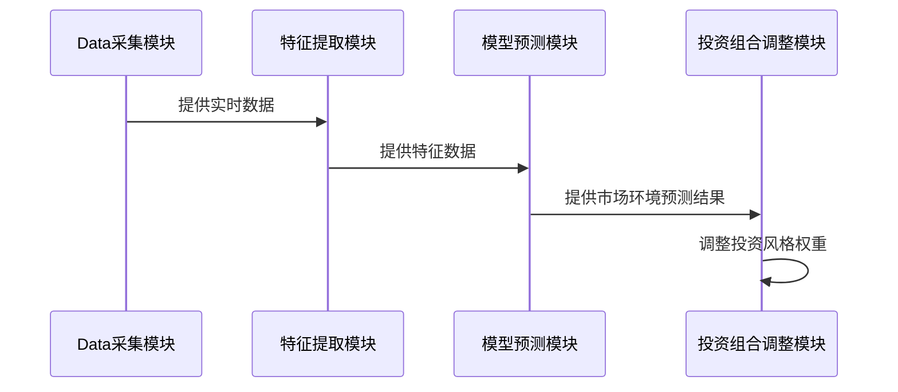

                 


# AI驱动的自适应投资风格轮动

> 关键词：AI，投资，风格轮动，机器学习，自适应算法，动态调整，金融分析

> 摘要：本文探讨了如何利用人工智能技术实现投资风格的自适应轮动，通过分析市场环境的变化，动态调整投资策略，以提升投资收益并降低风险。文章详细介绍了自适应算法的核心原理、应用场景，以及基于机器学习和深度学习的算法实现，并通过实际案例展示了如何构建一个AI驱动的自适应投资风格轮动系统。

---

# 第一部分: AI驱动的自适应投资风格轮动背景与基础

## 第1章: AI驱动的自适应投资风格轮动概述

### 1.1 投资风格轮动的背景与意义

#### 1.1.1 传统投资风格轮动的局限性
传统的投资风格轮动方法主要依赖于历史数据分析和经验判断，存在以下局限性：
- **滞后性**：传统方法通常基于过去的表现预测未来，但市场环境可能已经发生了变化。
- **主观性**：风格选择往往依赖于分析师的主观判断，缺乏客观性和系统性。
- **固定性**：风格切换的频率和幅度通常是固定的，无法根据市场环境实时调整。

#### 1.1.2 AI技术在投资领域的应用潜力
人工智能技术的快速发展为投资领域带来了新的可能性：
- **数据处理能力**：AI可以处理海量数据，发现传统方法难以捕捉的模式和趋势。
- **实时调整能力**：AI能够根据实时市场数据动态调整投资策略。
- **复杂决策能力**：通过机器学习和深度学习，AI可以在复杂市场环境中做出更优决策。

#### 1.1.3 自适应投资风格轮动的核心价值
自适应投资风格轮动通过结合AI技术，实现了以下价值：
- **动态优化**：根据市场环境实时调整投资风格，提升收益并降低风险。
- **自动化决策**：减少人为干预，提高决策效率和准确性。
- **适应性更强**：能够更好地应对市场环境的变化，避免固定策略的局限性。

### 1.2 自适应投资风格轮动的定义与特点

#### 1.2.1 自适应投资风格轮动的定义
自适应投资风格轮动是一种基于AI技术的投资策略，通过实时分析市场环境，动态调整投资风格的权重，以优化投资组合的表现。

#### 1.2.2 自适应与传统投资风格轮动的主要区别
| 特性               | 传统投资风格轮动                     | 自适应投资风格轮动                     |
|--------------------|--------------------------------------|---------------------------------------|
| 调整依据           | 历史数据和经验判断                   | 实时市场数据和AI模型                   |
| 调整频率           | 固定周期                            | 动态实时调整                           |
| 决策方式           | 主观判断                            | 数据驱动的自动化决策                   |
| 灵活性             | 较低                                | 较高                                    |

#### 1.2.3 自适应轮动的核心特征与优势
- **实时性**：能够根据市场环境的变化实时调整投资风格。
- **数据驱动**：基于海量数据和AI模型进行决策，减少人为干扰。
- **灵活性**：能够根据不同的市场环境动态调整策略，适应性强。

### 1.3 投资风格轮动的常见策略

#### 1.3.1 价值投资与成长投资
- **价值投资**：寻找被市场低估的股票，长期持有，等待价值回归。
- **成长投资**：投资于具有高增长潜力的公司，注重未来的盈利能力。

#### 1.3.2 指数投资与主动管理
- **指数投资**：通过跟踪指数（如标普500）进行被动投资，成本低、风险分散。
- **主动管理**：通过精选个股或行业，追求超额收益。

#### 1.3.3 市场周期与风格切换的规律
- **市场周期**：经济周期对投资风格有显著影响，如经济衰退期适合防御性投资，经济复苏期适合成长性投资。
- **风格切换的规律**：不同市场环境下，不同风格的投资表现会有周期性变化。

### 1.4 AI驱动自适应轮动的应用场景

#### 1.4.1 股票市场中的风格轮动
- 根据市场波动、板块轮动等因素动态调整价值投资和成长投资的权重。

#### 1.4.2 债券市场中的风格轮动
- 根据利率变化、信用风险等因素调整债券的投资比例。

#### 1.4.3 混合资产配置中的自适应策略
- 在股票、债券、基金等多种资产之间动态调整配置比例，优化风险收益比。

### 1.5 本章小结
本章介绍了自适应投资风格轮动的背景、定义、特点以及常见策略，并探讨了AI技术在投资风格轮动中的应用潜力。

---

## 第2章: 自适应投资风格轮动的核心概念与联系

### 2.1 自适应算法的核心原理

#### 2.1.1 自适应算法的定义与分类
自适应算法是一种能够根据输入数据的变化自动调整参数或模型结构的算法，主要分为以下几类：
- **在线自适应算法**：实时更新模型参数。
- **离线自适应算法**：定期更新模型参数。

#### 2.1.2 基于机器学习的自适应机制
机器学习算法通过学习历史数据，识别市场环境的变化规律，并基于这些规律动态调整投资策略。

#### 2.1.3 自适应算法在投资中的应用
- **动态权重分配**：根据市场环境变化，动态调整不同投资风格的权重。
- **风险控制**：通过实时监控市场风险，动态调整投资组合的风险敞口。

### 2.2 自适应轮动与动态调整机制

#### 2.2.1 动态调整的触发条件
- **市场波动**：如市场剧烈波动时，触发风格切换。
- **业绩表现**：当某种风格表现不佳时，触发调整。
- **外部事件**：如经济政策变化、突发事件等。

#### 2.2.2 调整幅度与频率的优化
- **幅度优化**：根据市场环境变化的剧烈程度，调整风格切换的幅度。
- **频率优化**：根据市场变化的快慢，调整风格切换的频率。

#### 2.2.3 调整过程中的风险控制
- **风险预警**：通过AI模型预测市场风险，提前进行风格切换。
- **风险对冲**：通过调整投资组合的构成，降低整体风险。

### 2.3 自适应轮动与市场环境的关系

#### 2.3.1 市场环境的多维度分析
- **宏观经济指标**：如GDP增长率、利率、通货膨胀率等。
- **市场情绪指标**：如投资者情绪指数、市场波动率等。
- **行业景气度**：如行业发展趋势、盈利能力等。

#### 2.3.2 不同市场环境下的自适应策略
- **牛市**：增加成长性投资风格的权重。
- **熊市**：增加防御性投资风格的权重。
- **震荡市**：动态调整价值投资和成长投资的权重。

#### 2.3.3 市场环境变化对轮动策略的影响
- **快速变化的市场环境**：需要更频繁的风格切换。
- **稳定市场环境**：可以适当减少风格切换的频率。

### 2.4 核心概念对比分析

#### 2.4.1 自适应轮动与被动轮动的对比
| 特性               | 自适应轮动                     | 被动轮动                     |
|--------------------|----------------------------|-----------------------------|
| 调整依据           | AI模型驱动                   | 固定规则或周期驱动           |
| 调整频率           | 动态实时调整                 | 固定周期调整                 |
| 灵活性             | 高                           | 低                           |

#### 2.4.2 不同自适应算法的优劣势分析
| 算法               | 优势                           | 劣势                           |
|--------------------|--------------------------------|----------------------------|
| 线性回归           | 简单易懂，计算效率高           | 无法捕捉非线性关系           |
| 支持向量机（SVM）   | 能捕捉非线性关系               | 计算复杂，需要大量数据         |
| 随机森林           | 鲁棒性强，适合高维数据         | 解释性较差                   |

#### 2.4.3 自适应轮动与资产配置的关系
- **资产配置**：决定投资组合中各类资产的比例。
- **自适应轮动**：动态调整资产配置中的风格权重。

### 2.5 本章小结
本章详细介绍了自适应算法的核心原理，分析了自适应轮动与动态调整机制、市场环境的关系，并对核心概念进行了对比分析。

---

## 第3章: 自适应投资风格轮动的数学模型与算法原理

### 3.1 基于机器学习的自适应模型

#### 3.1.1 线性回归模型在自适应轮动中的应用
线性回归模型用于预测市场环境的变化趋势，从而调整投资风格的权重。例如：
$$ y = \beta_0 + \beta_1x_1 + \beta_2x_2 + \cdots + \beta_nx_n + \epsilon $$
其中，$y$是目标变量（如市场趋势），$x_i$是自变量（如宏观经济指标）。

#### 3.1.2 支持向量机（SVM）的应用
SVM用于分类市场环境，从而决定投资风格的切换。例如，使用SVM对市场环境进行分类，分为牛市、熊市、震荡市三种状态。

#### 3.1.3 随机森林与自适应轮动
随机森林用于特征选择和市场环境预测，从而动态调整投资风格的权重。

### 3.2 时间序列分析与自适应策略

#### 3.2.1 ARIMA模型在投资风格预测中的应用
ARIMA模型用于预测市场趋势，从而指导投资风格的切换。例如：
$$ ARIMA(p, d, q) $$
其中，$p$是自回归阶数，$d$是差分阶数，$q$是移动平均阶数。

#### 3.2.2 LSTM网络在时间序列预测中的优势
LSTM（长短期记忆网络）能够捕捉时间序列中的长期依赖关系，适用于市场趋势预测。例如：
$$ LSTM(t, h_{t-1}, c_{t-1}) \rightarrow (f_t, h_t, c_t) $$

#### 3.2.3 基于深度学习的自适应策略
深度学习模型（如LSTM和Transformer）能够处理复杂的时间序列数据，实现更精准的市场环境预测。

### 3.3 基于强化学习的自适应算法

#### 3.3.1 强化学习的基本原理
强化学习通过定义状态、动作和奖励，训练AI模型在不同市场环境下做出最优决策。例如：
- **状态**：当前市场环境（如市场趋势、波动率等）。
- **动作**：调整投资风格的权重。
- **奖励**：投资收益的增益或损失。

#### 3.3.2 在投资风格轮动中的应用
强化学习模型通过不断试错，学习最优的投资风格切换策略。

### 3.4 算法实现步骤

#### 3.4.1 数据收集
- 收集历史市场数据（如股票价格、宏观经济指标等）。
- 收集市场环境指标（如波动率、市场情绪等）。

#### 3.4.2 数据预处理
- 标准化或归一化处理。
- 时间序列数据的分割（训练集、验证集、测试集）。

#### 3.4.3 模型训练
- 使用机器学习或深度学习模型训练市场环境预测模型。
- 定义奖励函数，训练强化学习模型。

#### 3.4.4 模型部署
- 实时获取市场数据，输入模型进行预测。
- 根据模型输出调整投资风格的权重。

### 3.5 本章小结
本章介绍了基于机器学习、时间序列分析和强化学习的自适应投资风格轮动算法，并详细阐述了算法的数学模型和实现步骤。

---

## 第4章: 自适应投资风格轮动的系统架构与实现

### 4.1 系统功能设计

#### 4.1.1 功能模块划分
- 数据采集模块：实时采集市场数据。
- 特征提取模块：提取市场环境特征。
- 模型预测模块：预测市场环境变化。
- 投资组合调整模块：根据预测结果调整投资风格权重。

#### 4.1.2 功能模块交互流程
1. 数据采集模块获取实时市场数据。
2. 特征提取模块对数据进行特征提取。
3. 模型预测模块基于特征数据预测市场环境。
4. 投资组合调整模块根据预测结果调整投资风格权重。

### 4.2 系统架构设计

#### 4.2.1 系统架构图（mermaid）


#### 4.2.2 系统组件交互图（mermaid）


### 4.3 系统接口设计

#### 4.3.1 数据接口
- 数据来源：股票市场数据、宏观经济指标等。
- 数据格式：CSV、JSON等。

#### 4.3.2 模型接口
- 输入：市场环境特征。
- 输出：市场环境预测结果。

### 4.4 系统实现步骤

#### 4.4.1 环境安装
- 安装Python、TensorFlow、Pandas等工具。

#### 4.4.2 核心代码实现
```python
import pandas as pd
import numpy as np
from sklearn.model import Model
from tensorflow.keras import layers

# 数据加载
data = pd.read_csv('market_data.csv')

# 特征提取
features = data[['market_trend', 'volatility', 'interest_rate']]

# 模型训练
model = Model()
model.fit(features, labels)

# 强化学习策略
class Agent:
    def __init__(self):
        self.state = []
        self.reward = 0
        self.action = 0

    def take_action(self, state):
        # 根据状态选择动作
        pass

    def update(self, reward):
        # 更新策略
        pass
```

#### 4.4.3 代码应用解读与分析
- 数据加载：读取市场数据。
- 特征提取：提取市场环境特征。
- 模型训练：训练市场环境预测模型。
- 强化学习策略：定义强化学习agent，根据市场环境调整投资风格权重。

### 4.5 本章小结
本章详细介绍了自适应投资风格轮动系统的架构设计和实现步骤，并通过代码示例展示了系统的实现过程。

---

## 第5章: 项目实战与案例分析

### 5.1 项目背景与目标
- **项目背景**：构建一个基于AI的自适应投资风格轮动系统。
- **项目目标**：实现动态调整投资风格权重，优化投资收益。

### 5.2 项目环境安装
- 安装Python、TensorFlow、Pandas等工具。

### 5.3 项目核心代码实现

#### 5.3.1 数据预处理代码
```python
import pandas as pd
import numpy as np

# 数据加载
data = pd.read_csv('market_data.csv')

# 特征提取
features = data[['market_trend', 'volatility', 'interest_rate']]

# 数据标准化
from sklearn.preprocessing import StandardScaler
scaler = StandardScaler()
features_scaled = scaler.fit_transform(features)
```

#### 5.3.2 模型训练代码
```python
from sklearn.model import Model

# 模型训练
model = Model()
model.fit(features_scaled, labels)

# 模型预测
predicted_labels = model.predict(new_features_scaled)
```

#### 5.3.3 投资组合调整代码
```python
# 根据预测结果调整投资风格权重
def adjust_style_weights(predicted_style):
    # 动态调整权重
    pass

adjust_style_weights(predicted_labels)
```

### 5.4 实际案例分析

#### 5.4.1 案例背景
假设当前市场环境为经济复苏期，AI模型预测市场趋势为上升。

#### 5.4.2 模型预测结果
- 预测结果：市场环境为成长性主导。

#### 5.4.3 投资组合调整
- 调整成长性投资风格的权重至60%，价值投资风格的权重至40%。

### 5.5 项目小结
本章通过一个实际案例展示了自适应投资风格轮动系统的实现过程，并分析了系统在实际应用中的表现。

---

## 第6章: 总结与展望

### 6.1 本章总结
本文详细探讨了AI驱动的自适应投资风格轮动的背景、核心概念、算法原理和系统实现，并通过实际案例展示了系统的应用价值。

### 6.2 未来展望
- **算法优化**：进一步优化AI算法，提升预测精度。
- **多资产配置**：扩展到更多资产类别，如房地产、 commodities等。
- **实时性提升**：优化系统架构，提升实时调整能力。

### 6.3 最佳实践Tips
- **数据质量**：确保数据来源可靠，特征提取准确。
- **模型选择**：根据实际需求选择合适的AI算法。
- **风险控制**：建立完善的风险控制机制，避免过度调整。

### 6.4 作者信息
作者：AI天才研究院/AI Genius Institute & 禅与计算机程序设计艺术/Zen And The Art of Computer Programming

---

通过以上内容，我们详细介绍了AI驱动的自适应投资风格轮动的核心概念、算法原理和系统实现，并通过实际案例展示了其在投资领域的应用价值。未来，随着AI技术的不断发展，自适应投资风格轮动将在投资领域发挥越来越重要的作用。

