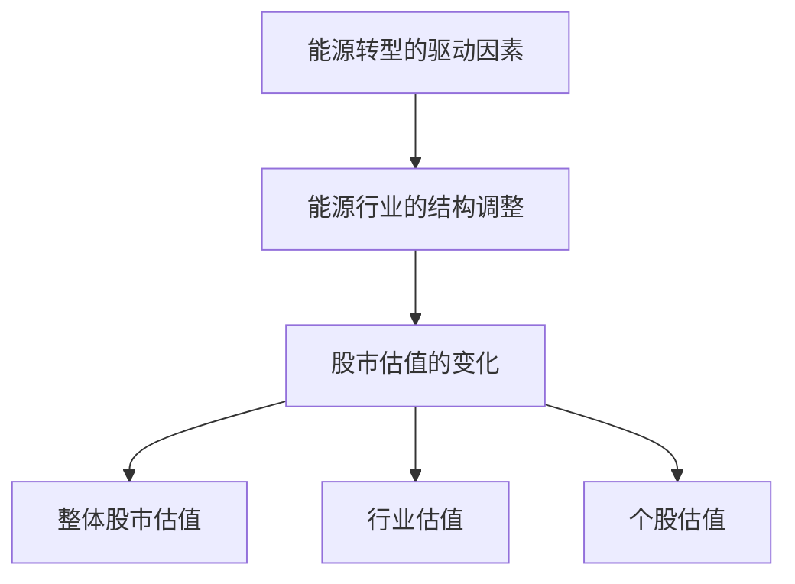

                 


# 全球股市估值与能源转型趋势的关系

> 关键词：全球股市估值，能源转型，可再生能源，股市模型，能源政策

> 摘要：本文探讨了全球股市估值与能源转型趋势之间的关系。通过分析能源转型的核心概念、影响机制以及股市估值的理论与实践，本文揭示了能源转型对股市估值的深远影响。文章结合实际案例和数学模型，提出了能源转型背景下股市估值的系统性分析方法，并对未来研究方向进行了展望。

---

# 第一部分: 全球股市估值与能源转型趋势的背景与核心概念

## 第1章: 全球股市估值与能源转型趋势的背景介绍

### 1.1 能源转型的背景与定义
#### 1.1.1 能源转型的定义与核心要素
能源转型是指从依赖化石燃料（如煤炭、石油、天然气）转向使用可再生能源（如风能、太阳能、水能）的过程。这一过程不仅涉及能源生产方式的改变，还包括能源存储、传输和消费方式的创新。能源转型的核心要素包括技术创新、政策支持、市场机制和全球合作。

#### 1.1.2 能源转型的驱动因素
能源转型的驱动因素主要包括：
- **环境因素**：减少温室气体排放，应对气候变化。
- **经济因素**：可再生能源成本的下降和化石能源价格的波动。
- **技术因素**：清洁能源技术的进步（如光伏发电、风电技术）。
- **政策因素**：各国政府出台的能源政策和补贴机制。

#### 1.1.3 能源转型的全球发展趋势
全球范围内，能源转型正在加速。欧盟、美国、中国等主要经济体纷纷制定可再生能源目标，推动能源结构的调整。例如，欧盟提出到2030年可再生能源占总能源消耗的32%。

### 1.2 全球股市估值的基本概念
#### 1.2.1 股市估值的定义与方法
股市估值是通过对公司财务数据和市场因素的分析，评估股票的内在价值。常用的方法包括市盈率（P/E）、市净率（P/B）、股息率等。

#### 1.2.2 影响股市估值的主要因素
影响股市估值的主要因素包括：
- **公司基本面**：收入、利润、资产负债情况。
- **市场情绪**：投资者情绪和市场信心。
- **宏观经济因素**：GDP增长率、利率、通货膨胀。
- **行业政策**：政府政策和行业法规。

#### 1.2.3 能源行业在股市中的地位与作用
能源行业是股市的重要组成部分。传统能源企业（如石油公司）和可再生能源企业（如风能、太阳能公司）在股市中占据重要地位。能源行业的表现对整体股市估值有显著影响。

### 1.3 能源转型趋势与股市估值的关系
#### 1.3.1 能源转型对股市估值的影响
能源转型可能导致能源行业内部结构的变化，进而影响股市估值。例如，可再生能源企业可能因政策支持而估值上升，而传统化石能源企业可能因需求下降而估值下降。

#### 1.3.2 能源转型趋势与股市估值的相互作用
能源转型不仅影响能源行业的估值，还可能通过产业链传导影响其他行业的估值。例如，能源转型推动电动汽车行业发展，从而影响汽车制造企业的估值。

#### 1.3.3 本书研究的核心问题与目标
本书的核心问题是：能源转型趋势如何影响全球股市估值？通过分析能源转型的驱动因素、影响机制和股市估值的理论与实践，本书旨在为投资者和政策制定者提供参考。

---

## 第2章: 能源转型趋势的核心概念与影响机制

### 2.1 能源转型的核心概念
#### 2.1.1 可再生能源的发展现状与趋势
可再生能源（如太阳能、风能）的装机容量近年来快速增长。根据国际能源署（IEA）的数据，2020年全球可再生能源发电量占总发电量的33%。

#### 2.1.2 石油、天然气等传统能源的转型压力
传统能源企业面临市场需求下降的风险。例如，全球范围内对化石能源的需求可能在未来几十年内逐步减少。

#### 2.1.3 能源政策与技术创新对转型的影响
政府政策和技术创新是能源转型的两大驱动力。例如，中国的“十四五”规划提出，到2025年可再生能源发电装机容量占总装机容量的50%以上。

### 2.2 能源转型对全球经济与产业的影响
#### 2.2.1 能源转型对产业链的重塑
能源转型可能导致产业链的重构。例如，传统能源企业的转型可能需要投资于可再生能源技术，而可再生能源企业可能需要与储能技术企业合作。

#### 2.2.2 能源转型对就业结构的影响
能源转型可能对就业结构产生深远影响。例如，可再生能源行业创造的就业岗位可能超过传统化石能源行业。

#### 2.2.3 能源转型对国际贸易与投资的推动
能源转型可能推动国际贸易格局的变化。例如，可再生能源技术的出口可能成为新的经济增长点。

### 2.3 能源转型对股市估值的核心影响
#### 2.3.1 能源转型对能源企业估值的影响
能源转型可能导致能源企业估值的变化。例如，可再生能源企业的估值可能因政策支持而上升，而传统化石能源企业的估值可能因需求下降而下降。

#### 2.3.2 能源转型对非能源企业估值的影响
能源转型可能通过供应链和市场需求影响非能源企业的估值。例如，电动汽车行业的快速发展可能提升相关企业的估值。

#### 2.3.3 能源转型对整体股市估值的系统性影响
能源转型可能对整体股市估值产生系统性影响。例如，能源行业的结构调整可能导致股市整体估值波动。

---

## 第3章: 全球股市估值的核心概念与分析框架

### 3.1 股市估值的基本理论
#### 3.1.1 股票估值的定义与方法
股票估值是通过对公司财务数据和市场因素的分析，评估股票的内在价值。常用的方法包括市盈率（P/E）、市净率（P/B）、股息率等。

#### 3.1.2 股市估值的核心模型
股市估值的核心模型包括：
- **股利折现模型（DDM）**：假设股利按一定增长率增长，计算股票的内在价值。
- **资本资产定价模型（CAPM）**：通过市场风险溢价和无风险利率计算股票的预期收益。

#### 3.1.3 股市估值的行业差异
不同行业的股票估值方法可能有所不同。例如，科技行业的股票可能更注重市盈率，而传统制造业的股票可能更注重市净率。

### 3.2 能源行业在股市估值中的特殊性
#### 3.2.1 能源行业估值的核心要素
能源行业的估值核心要素包括：
- **资源储量**：对于传统能源企业，资源储量是估值的重要依据。
- **能源价格**：能源价格的波动对估值的影响。
- **政策风险**：政策变化对估值的影响。

#### 3.2.2 能源行业估值的特殊性
能源行业的估值具有特殊性，例如：
- **周期性**：能源行业的周期性波动可能影响估值。
- **政策依赖性**：能源行业的估值可能高度依赖政策支持。

#### 3.2.3 能源行业估值的挑战
能源行业估值的挑战包括：
- **不确定性**：能源价格的波动和政策变化的不确定性。
- **技术变革**：技术变革可能影响能源行业的估值。

---

## 第4章: 能源转型对股市估值的影响机制

### 4.1 能源转型对能源行业估值的影响机制
#### 4.1.1 可再生能源行业的估值变化
可再生能源行业的估值可能因政策支持和技术进步而上升。例如，光伏企业的估值可能因技术进步而增加。

#### 4.1.2 传统能源行业的估值变化
传统能源行业的估值可能因市场需求下降和政策压力而下降。例如，石油企业的估值可能因需求下降而减少。

#### 4.1.3 能源转型对能源行业整体估值的影响
能源转型可能导致能源行业整体估值的变化。例如，能源行业的结构调整可能影响整体估值。

### 4.2 能源转型对非能源行业估值的影响机制
#### 4.2.1 能源转型对制造业估值的影响
能源转型可能推动制造业的转型，例如电动汽车行业的快速发展可能提升相关企业的估值。

#### 4.2.2 能源转型对金融行业估值的影响
能源转型可能通过金融市场的变化影响金融行业的估值。例如，绿色金融产品的推出可能影响银行和保险公司的估值。

#### 4.2.3 能源转型对科技行业估值的影响
能源转型可能推动科技创新，例如储能技术的发展可能提升科技企业的估值。

### 4.3 能源转型对整体股市估值的影响机制
#### 4.3.1 能源转型对股市整体估值的系统性影响
能源转型可能导致股市整体估值的变化。例如，能源行业的结构调整可能影响股市整体估值。

#### 4.3.2 能源转型对股市风险的传导机制
能源转型可能通过产业链和市场情绪传导风险。例如，能源行业的不确定性可能影响整体市场的风险偏好。

#### 4.3.3 能源转型对股市长期趋势的影响
能源转型可能对股市的长期趋势产生深远影响。例如，可再生能源行业的快速发展可能推动股市的长期上涨。

---

## 第5章: 能源转型趋势下股市估值的系统性分析

### 5.1 系统性分析的理论基础
#### 5.1.1 能源转型与股市估值的系统性关系
能源转型与股市估值之间存在复杂的系统性关系。例如，能源转型可能导致股市估值的变化，而股市估值的变化又可能反馈到能源转型的过程中。

#### 5.1.2 系统性分析的框架
系统性分析的框架包括：
- **输入层**：能源转型的驱动因素（政策、技术、市场）。
- **中间层**：能源行业的结构调整和市场反应。
- **输出层**：股市估值的变化。

#### 5.1.3 系统性分析的核心要素
系统性分析的核心要素包括：
- **能源转型的驱动因素**：政策、技术、市场。
- **能源行业的结构调整**：传统能源企业转型、可再生能源企业发展。
- **股市估值的变化**：整体估值、行业估值、个股估值。

### 5.2 系统性分析的数学模型
#### 5.2.1 能源转型与股市估值的数学模型
能源转型与股市估值的数学模型可以表示为：
$$
V = f(E, M, P)
$$
其中，$V$ 表示股市估值，$E$ 表示能源转型的驱动因素，$M$ 表示市场因素，$P$ 表示政策因素。

#### 5.2.2 系统性分析的流程图
以下是系统性分析的流程图：



### 5.3 系统性分析的实现方法
#### 5.3.1 数据收集与处理
数据收集与处理包括：
- **能源转型的驱动因素**：政策、技术、市场数据。
- **能源行业的结构调整**：企业转型数据。
- **股市估值的变化**：股价、市盈率、市净率等数据。

#### 5.3.2 数据分析与建模
数据分析与建模包括：
- **回归分析**：分析能源转型驱动因素与股市估值变化的关系。
- **时间序列分析**：分析股市估值的变化趋势。

#### 5.3.3 结果解读与反馈
结果解读与反馈包括：
- **结果解读**：分析模型结果，解释能源转型对股市估值的影响。
- **反馈机制**：根据分析结果，调整模型参数或数据收集策略。

---

## 第6章: 能源转型趋势下股市估值的实战分析

### 6.1 实战分析的背景与目标
#### 6.1.1 实战分析的背景
实战分析的背景是能源转型趋势下的股市估值变化。本文将通过实际案例分析，探讨能源转型对股市估值的影响。

#### 6.1.2 实战分析的目标
实战分析的目标是：
- **验证模型的可行性**：通过实际案例验证系统性分析模型的可行性。
- **提供实证依据**：为能源转型对股市估值的影响提供实证依据。

### 6.2 实战分析的数据来源与工具
#### 6.2.1 数据来源
数据来源包括：
- **公开数据**：如股票价格、公司财务数据。
- **政策文件**：如政府发布的能源政策。
- **行业报告**：如国际能源署（IEA）发布的能源转型报告。

#### 6.2.2 数据分析工具
数据分析工具包括：
- **Python**：用于数据处理和建模。
- **Pandas**：用于数据分析。
- **Matplotlib**：用于数据可视化。

### 6.3 实战分析的步骤与方法
#### 6.3.1 数据清洗与预处理
数据清洗与预处理包括：
- **数据清洗**：处理缺失值、异常值。
- **数据转换**：将数据转换为适合建模的形式。

#### 6.3.2 数据建模与分析
数据建模与分析包括：
- **回归分析**：分析能源转型驱动因素与股市估值变化的关系。
- **时间序列分析**：分析股市估值的变化趋势。

#### 6.3.3 结果解读与可视化
结果解读与可视化包括：
- **结果解读**：分析模型结果，解释能源转型对股市估值的影响。
- **数据可视化**：通过图表展示分析结果。

### 6.4 实战分析的案例研究
#### 6.4.1 案例背景
以中国某可再生能源企业为例，分析其股价变化与能源转型政策的关系。

#### 6.4.2 数据分析
通过Python代码分析该企业的股价变化：

```python
import pandas as pd
import matplotlib.pyplot as plt

# 读取数据
data = pd.read_csv('stock_price.csv')

# 绘制股价变化图
plt.plot(data['日期'], data['股价'])
plt.title('股价变化图')
plt.xlabel('日期')
plt.ylabel('股价')
plt.show()
```

#### 6.4.3 结果解读
分析结果表明，该企业的股价在政策支持下呈现上升趋势。

---

## 第7章: 结论与展望

### 7.1 本文的主要结论
本文的主要结论包括：
- **能源转型对股市估值的影响**：能源转型可能导致能源行业估值的变化，进而影响整体股市估值。
- **系统性分析的可行性**：通过系统性分析，可以有效预测能源转型对股市估值的影响。

### 7.2 未来研究方向
未来研究方向包括：
- **能源转型的长期影响**：研究能源转型对股市长期趋势的影响。
- **政策对股市估值的影响**：分析不同政策对股市估值的具体影响。

### 7.3 对投资者的建议
对投资者的建议包括：
- **关注能源转型政策**：投资者应关注能源转型政策的变化，及时调整投资策略。
- **关注可再生能源企业**：可再生能源企业可能因政策支持而估值上升。

---

## 作者：AI天才研究院/AI Genius Institute & 禅与计算机程序设计艺术 /Zen And The Art of Computer Programming

---

本文通过系统性分析和实际案例研究，探讨了能源转型趋势对全球股市估值的影响。通过本文的分析，读者可以更好地理解能源转型与股市估值之间的复杂关系，并为投资者和政策制定者提供参考。

