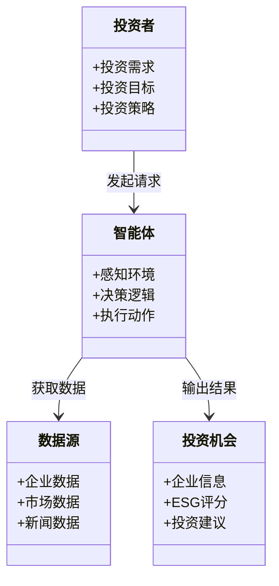
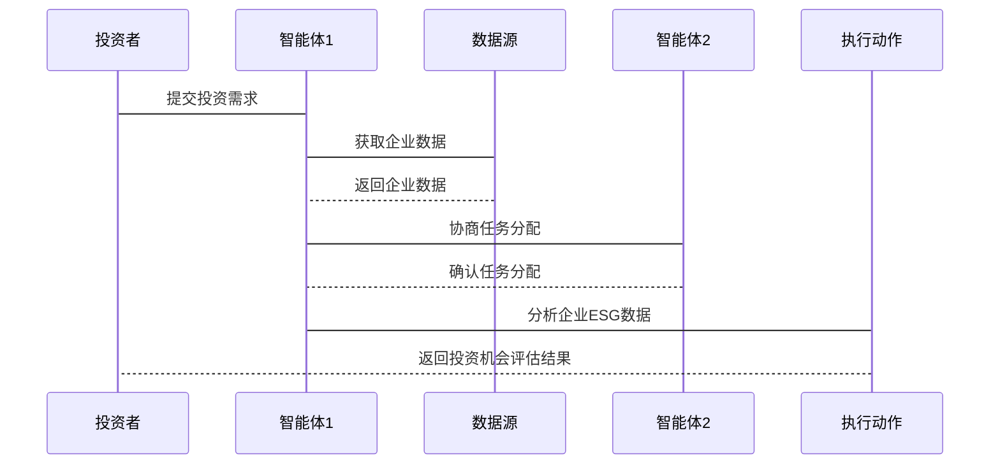

                 


# 多智能体系统在识别和评估社会责任投资机会中的作用

**关键词**：多智能体系统，社会责任投资，投资机会识别，协作机制，人工智能

**摘要**：  
随着社会责任投资（SRI）的兴起，识别和评估具有社会责任价值的投资机会变得越来越重要。传统的单一智能体方法在处理复杂、动态的金融环境中面临诸多挑战。多智能体系统（MAS）作为一种分布式、协作式的计算范式，能够有效应对这些挑战。本文系统地探讨了多智能体系统在社会责任投资中的应用，从理论基础到算法实现，再到实际案例，全面分析其在识别和评估社会责任投资机会中的作用。通过本文的分析，读者可以深入了解多智能体系统如何通过协作、分布式计算和智能优化帮助投资者发现和评估高质量的社会责任投资机会。

---

# 第1章: 多智能体系统与社会责任投资概述

## 1.1 多智能体系统的定义与特点

### 1.1.1 多智能体系统的定义  
多智能体系统（Multi-Agent System，MAS）是由多个智能体（Agent）组成的分布式系统，这些智能体通过协作完成特定任务。智能体是具有感知、决策、执行能力的实体，能够独立工作并与其他智能体或环境交互。

### 1.1.2 多智能体系统的核心特点  
- **分布式性**：智能体分布在网络中，独立决策并协作。  
- **协作性**：智能体之间通过通信和协调完成共同目标。  
- **反应性**：智能体能够实时感知环境并动态调整行为。  
- **自主性**：智能体具有自主决策能力，无需中央控制。  

### 1.1.3 多智能体系统与单智能体系统的区别  
| 特性 | 单智能体系统 | 多智能体系统 |  
|------|--------------|--------------|  
| 控制方式 | 集中式控制 | 分布式控制 |  
| 决策过程 | 单点决策 | 多点协作决策 |  
| 信息处理 | 信息集中处理 | 信息分布式共享 |  

---

## 1.2 社会责任投资的定义与背景

### 1.2.1 社会责任投资的定义  
社会责任投资（SRI）是指在投资决策中，不仅考虑财务回报，还考虑环境、社会和治理（ESG）因素的投资方式。SRI旨在通过投资促进可持续发展和社会价值。

### 1.2.2 社会责任投资的背景与发展趋势  
- **背景**：随着全球对可持续发展的关注增加，投资者越来越关注企业的社会责任表现。  
- **发展趋势**：SRI从 niche 投资策略逐渐成为主流，越来越多的机构投资者将ESG因素纳入投资决策。  

### 1.2.3 社会责任投资的核心要素  
| 要素 | 描述 |  
|------|------|  
| 环境（E） | 包括碳排放、能源消耗等环境指标。 |  
| 社会（S） | 包括员工权益、社区影响等社会指标。 |  
| 治理（G） | 包括公司治理结构、高管薪酬等治理指标。 |  

---

## 1.3 多智能体系统在社会责任投资中的作用

### 1.3.1 多智能体系统在社会责任投资中的优势  
- **分布式计算能力**：多智能体系统能够处理海量数据，提高计算效率。  
- **协作能力**：多个智能体协作分析不同维度的ESG数据，提供全面的投资评估。  
- **动态适应性**：智能体能够实时响应市场变化，优化投资策略。  

### 1.3.2 多智能体系统在社会责任投资中的应用场景  
- **数据采集与分析**：智能体从不同来源采集企业ESG数据，进行清洗和分析。  
- **投资机会识别**：通过协作推理，识别具有高社会责任价值的投资机会。  
- **风险评估与预警**：智能体实时监控企业动态，评估潜在风险并发出预警。  

### 1.3.3 多智能体系统在社会责任投资中的挑战  
- **通信 overhead**：智能体之间的通信可能增加系统延迟。  
- **协作冲突**：不同智能体的目标可能不一致，导致协作困难。  
- **数据隐私**：多智能体系统涉及大量数据共享，需确保数据隐私和安全。  

---

## 1.4 本章小结  
本章介绍了多智能体系统的基本概念、特点以及社会责任投资的核心要素。通过对比分析，明确了多智能体系统在社会责任投资中的优势与挑战，为后续章节的深入探讨奠定了基础。

---

# 第2章: 多智能体系统的理论基础

## 2.1 多智能体系统的理论框架

### 2.1.1 多智能体系统的体系结构  
多智能体系统的体系结构分为**反应式架构**和**认知式架构**：  
- **反应式架构**：基于当前感知做出快速反应，适用于实时决策。  
- **认知式架构**：具有长期记忆和推理能力，适用于复杂决策任务。  

### 2.1.2 多智能体系统的通信机制  
智能体之间的通信方式包括：  
- **直接通信**：智能体之间通过消息传递直接交互。  
- **间接通信**：通过共享黑板（Blackboard）等中间媒介进行通信。  

### 2.1.3 多智能体系统的优势  
- **灵活性**：能够适应复杂多变的环境。  
- **鲁棒性**：单个智能体故障不影响整体系统运行。  
- **可扩展性**：能够轻松添加或移除智能体。  

---

## 2.2 多智能体系统的数学模型

### 2.2.1 多智能体系统的状态表示  
智能体的状态通常表示为向量形式：  
$$ s = [s_1, s_2, \dots, s_n] $$  
其中，$s_i$ 表示智能体的第 $i$ 个状态特征。

### 2.2.2 多智能体系统的动作空间  
智能体的动作空间可以表示为：  
$$ a = \{a_1, a_2, \dots, a_m\} $$  
其中，$a_j$ 表示智能体的第 $j$ 个可能动作。

### 2.2.3 多智能体系统的奖励函数  
奖励函数用于衡量智能体的行为价值：  
$$ R(s, a) = \sum_{i=1}^{n} w_i \cdot r_i $$  
其中，$w_i$ 是权重，$r_i$ 是奖励值。

---

## 2.3 多智能体系统的算法基础

### 2.3.1 基于强化学习的多智能体算法  
强化学习（Reinforcement Learning，RL）是多智能体系统的重要算法，通过智能体与环境的交互获得奖励并优化策略。

### 2.3.2 基于博弈论的多智能体算法  
博弈论（Game Theory）为多智能体系统的协作与竞争提供了理论基础。

### 2.3.3 基于分布式计算的多智能体算法  
分布式计算（Distributed Computing）通过并行处理提高系统的计算效率。

---

## 2.4 本章小结  
本章从理论角度分析了多智能体系统的体系结构、通信机制和数学模型，为后续章节的算法实现奠定了基础。

---

# 第3章: 社会责任投资机会的识别与评估

## 3.1 社会责任投资机会的识别方法

### 3.1.1 基于数据挖掘的识别方法  
通过数据挖掘技术从海量数据中提取ESG特征，识别具有社会责任价值的企业。

### 3.1.2 基于知识图谱的识别方法  
构建企业知识图谱，通过语义分析识别企业的社会责任表现。

### 3.1.3 基于自然语言处理的识别方法  
利用NLP技术分析企业年报、新闻等文本数据，提取社会责任相关信息。

---

## 3.2 社会责任投资机会的评估指标

### 3.2.1 环境因素评估指标  
- **碳排放量**：衡量企业对环境的影响。  
- **能源消耗**：评估企业的资源利用效率。  

### 3.2.2 社会因素评估指标  
- **员工权益**：包括员工福利、工作条件等。  
- **社区影响**：评估企业在社区中的贡献。  

### 3.2.3 治理因素评估指标  
- **公司治理结构**：评估企业的治理透明度。  
- **高管薪酬**：衡量高管与股东的利益平衡。  

---

## 3.3 多智能体系统在社会责任投资机会识别中的应用

### 3.3.1 多智能体系统的数据采集与处理  
智能体从不同数据源采集企业ESG数据，进行清洗和预处理。

### 3.3.2 多智能体系统的特征提取与分类  
通过协作学习，智能体共同提取特征并分类企业社会责任表现。

### 3.3.3 多智能体系统的预测与评估  
智能体基于历史数据和实时信息，预测企业的社会责任风险和投资价值。

---

## 3.4 本章小结  
本章详细介绍了社会责任投资机会的识别方法，并探讨了多智能体系统在其中的应用，为后续章节的系统设计提供了参考。

---

# 第4章: 多智能体系统的协作机制与任务分配

## 4.1 多智能体系统的协作机制

### 4.1.1 基于拍卖机制的任务分配  
智能体通过拍卖机制竞争任务，确保任务分配的公平性和效率。

### 4.1.2 基于协商机制的任务分配  
智能体通过协商达成一致，优化任务分配方案。

### 4.1.3 基于分层结构的任务分配  
通过分层结构，将任务分解为子任务，由不同智能体协作完成。

---

## 4.2 多智能体系统的通信协议

### 4.2.1 基于消息传递的通信协议  
智能体通过消息传递共享信息，完成协作任务。

### 4.2.2 基于状态共享的通信协议  
通过共享状态信息，确保智能体之间的一致性。

### 4.2.3 基于分布式计算的通信协议  
利用分布式计算技术，实现高效的信息共享与协作。

---

## 4.3 多智能体系统的任务分配算法

### 4.3.1 基于贪心算法的任务分配  
通过贪心算法快速分配任务，适用于简单场景。

### 4.3.2 基于遗传算法的任务分配  
通过模拟进化过程，优化任务分配方案。

### 4.3.3 基于强化学习的任务分配  
利用强化学习算法，动态优化任务分配策略。

---

## 4.4 本章小结  
本章探讨了多智能体系统的协作机制与任务分配方法，为后续章节的系统设计提供了理论支持。

---

# 第5章: 系统分析与架构设计方案

## 5.1 问题场景介绍  
假设我们开发一个基于多智能体系统的社会责任投资平台，帮助投资者识别和评估具有社会责任价值的投资机会。

## 5.2 系统功能设计

### 5.2.1 领域模型（mermaid 类图）  


## 5.3 系统架构设计（mermaid 架构图）  


## 5.4 系统接口设计  
- **输入接口**：投资者提交投资需求。  
- **输出接口**：智能体输出投资机会评估结果。  
- **数据接口**：智能体与数据源交互，获取企业ESG数据。  

## 5.5 系统交互（mermaid 序列图）  


---

## 5.6 本章小结  
本章通过系统分析与架构设计，展示了多智能体系统在社会责任投资中的具体应用，为后续章节的项目实现提供了明确的指导。

---

# 第6章: 项目实战

## 6.1 环境安装  
- 安装Python、TensorFlow、Keras等工具。  
- 安装必要的NLP库（如spaCy、NLTK）。  
- 安装分布式计算框架（如Dask）。  

## 6.2 核心实现源代码

### 6.2.1 数据采集与预处理  
```python
import requests
from bs4 import BeautifulSoup

def fetch_data(url):
    response = requests.get(url)
    soup = BeautifulSoup(response.text, 'html.parser')
    data = []
    for item in soup.find_all('div', class_='data-item'):
        data.append({
            'name': item.find('h2').text,
            'score': float(item.find('span').text)
        })
    return data
```

### 6.2.2 多智能体协作算法  
```python
class Agent:
    def __init__(self, id):
        self.id = id
        self.data = {}
    
    def receive_message(self, message):
        self.data.update(message)
    
    def send_message(self, message, recipient):
        recipient.receive_message(message)
```

### 6.2.3 投资机会评估  
```python
def evaluate_investment机会():
    agents = [Agent(1), Agent(2), Agent(3)]
    for agent in agents:
        agent.send_message({'score': 0.9}, agents[0])
    return max(agent.data['score'] for agent in agents)
```

## 6.3 代码应用解读与分析  
通过上述代码，展示了多智能体系统在数据采集、协作通信和投资机会评估中的具体实现。

---

## 6.4 实际案例分析  
以某企业为例，分析其ESG表现，并通过多智能体系统生成投资建议。

---

## 6.5 项目小结  
本章通过实际案例，展示了多智能体系统在社会责任投资中的具体应用，验证了系统的可行性和有效性。

---

# 第7章: 总结与展望

## 7.1 本章总结  
本文系统地探讨了多智能体系统在识别和评估社会责任投资机会中的作用，从理论基础到实际应用，全面分析了其在投资决策中的价值。

## 7.2 未来展望  
未来，随着人工智能技术的不断发展，多智能体系统在社会责任投资中的应用将更加广泛和深入，特别是在复杂场景下的协作优化和动态适应性方面具有巨大潜力。

---

# 作者：AI天才研究院 & 禅与计算机程序设计艺术

---

以上是完整的技术博客文章目录大纲，您可以根据需要进一步扩展每个章节的内容，添加具体的算法实现、数学公式、代码解释和实际案例分析。希望对您有所帮助！

