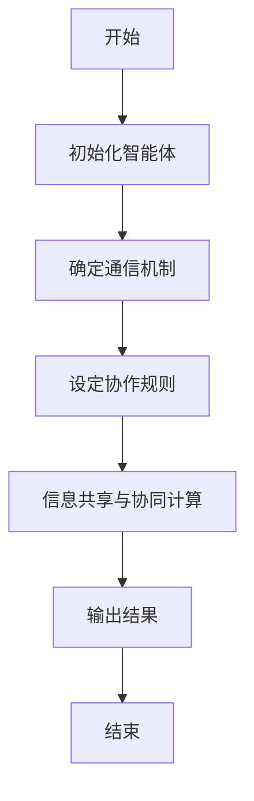
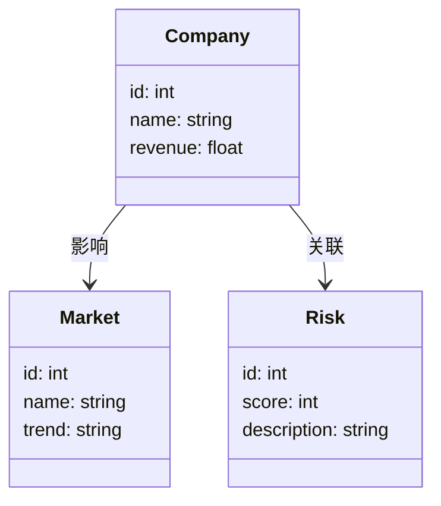
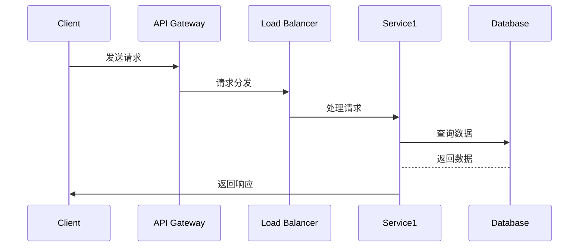

                 


# 《多智能体系统如何评估公司的长期盈利能力》

---

## 关键词：
- 多智能体系统
- 公司盈利能力
- 算法原理
- 数学模型
- 系统架构
- 项目实战

---

## 摘要：
本文系统地探讨了多智能体系统在评估公司长期盈利能力中的应用。通过分析多智能体系统的构成、算法原理、数学模型以及实际案例，本文详细阐述了如何利用多智能体系统的优势来优化公司盈利能力的预测与评估。文章结合理论与实践，从基础概念到算法实现，再到系统架构设计，层层深入，为读者提供了一个全面的理解框架。通过本文，读者将能够掌握多智能体系统在公司长期盈利能力评估中的核心方法，并能够将其应用于实际项目中。

---

# 第1章: 多智能体系统与公司长期盈利能力概述

## 1.1 多智能体系统的基本概念

### 1.1.1 多智能体系统的定义
多智能体系统（Multi-Agent System, 简称MAS）是由多个具有自主性、反应性、协作性和智能性的个体（即智能体）组成的复杂系统。这些智能体能够通过共享信息、协同决策和协作完成特定任务。

### 1.1.2 多智能体系统的核心特征
- **自主性**：智能体能够独立决策，无需外部干预。
- **反应性**：智能体能够根据环境变化动态调整行为。
- **协作性**：智能体之间通过通信与协作完成共同目标。
- **分布性**：智能体之间不存在中心化的控制节点。

### 1.1.3 多智能体系统与传统单智能体系统的区别
| 特性         | 多智能体系统                     | 单智能体系统                     |
|--------------|---------------------------------|---------------------------------|
| 系统结构     | 分布式、去中心化                | 集中式、单一控制中心            |
| 智能体数量   | 多个                            | 单个                            |
| 行为决策     | 智能体间协作决策                | 单一智能体独立决策                |
| 信息处理     | 高度分布式信息共享与处理        | 集中化信息处理                   |

## 1.2 公司长期盈利能力的定义与评估方法

### 1.2.1 公司长期盈利能力的定义
公司长期盈利能力是指公司在未来一段时间内持续创造利润的能力，通常通过财务指标（如净利润率、ROE等）和市场表现（如市场份额、客户满意度）来衡量。

### 1.2.2 传统公司盈利能力评估方法
传统的公司盈利能力评估方法包括：
1. **财务指标分析**：如净利润率、ROE、毛利率等。
2. **市场分析**：如市场份额、竞争对手分析。
3. **内部审计**：如成本控制、管理效率。

### 1.2.3 多智能体系统在公司盈利能力评估中的优势
- **数据处理能力**：多智能体系统能够处理海量数据，提供更精准的预测。
- **分布式决策**：通过智能体的协作，实现更高效的决策过程。
- **动态适应性**：能够实时调整模型，适应市场变化。

## 1.3 多智能体系统与公司长期盈利能力的关系

### 1.3.1 多智能体系统如何影响公司盈利能力
多智能体系统通过优化资源配置、提升决策效率和增强市场响应能力，间接或直接地提升公司盈利能力。

### 1.3.2 多智能体系统在公司战略决策中的作用
- **市场预测**：通过智能体协作，预测市场趋势。
- **风险管理**：识别潜在风险，制定应对策略。
- **资源优化**：优化供应链、生产成本等。

### 1.3.3 多智能体系统评估公司长期盈利能力的边界与外延
- **边界**：多智能体系统仅提供预测和评估工具，决策仍需人类干预。
- **外延**：可扩展至金融、制造、零售等多个行业。

## 1.4 本章小结
本章介绍了多智能体系统的基本概念及其在公司长期盈利能力评估中的作用，为后续章节的深入分析奠定了基础。

---

# 第2章: 多智能体系统的核心概念与联系

## 2.1 多智能体系统的组成与属性

### 2.1.1 多智能体系统的组成要素
- **智能体**：独立的决策单元。
- **通信机制**：智能体之间的信息交互方式。
- **协调机制**：智能体协作的规则和协议。
- **环境**：智能体所处的外部环境。

### 2.1.2 各组成要素的属性特征对比
| 组成要素     | 属性特征                           |
|--------------|------------------------------------|
| 智能体       | 自主性、反应性、协作性              |
| 通信机制     | 信息传递方式、安全性               |
| 协调机制     | 决策规则、冲突解决方式             |
| 环境         | 动态性、不确定性                   |

### 2.1.3 组成要素之间的关系
- **智能体与通信机制**：通信机制是智能体协作的基础。
- **协调机制与环境**：协调机制根据环境变化调整智能体行为。

## 2.2 多智能体系统的ER实体关系图

### 2.2.1 实体关系图的构建
以下是多智能体系统的ER实体关系图（使用Mermaid）：

```mermaid
erDiagram
    customer[客户] {
        +id: int
        +name: string
        +age: int
    }
    order[订单] {
        +id: int
        +customer_id: int
        +order_date: date
        +total_amount: float
    }
    product[产品] {
        +id: int
        +name: string
        +price: float
    }
    customer --> order: 下订单
    order --> product: 订单包含的产品
```

### 2.2.2 实体关系图的分析
- **客户**：代表公司客户，具有唯一标识符。
- **订单**：记录客户的购买行为。
- **产品**：公司的产品信息。
- **关系**：客户通过订单购买产品。

## 2.3 本章小结
本章通过分析多智能体系统的组成要素及其关系，为后续章节的算法设计和系统实现提供了理论基础。

---

# 第3章: 多智能体系统评估公司长期盈利能力的算法原理

## 3.1 多智能体系统协同算法概述

### 3.1.1 协同算法的基本原理
协同算法通过智能体之间的信息共享与协作，实现复杂问题的分布式求解。

### 3.1.2 协同算法的分类与特点
- **基于规则的协同算法**：通过预定义规则实现协作。
- **基于博弈论的协同算法**：通过模拟博弈过程实现最优决策。
- **基于分布式计算的协同算法**：利用分布式计算技术实现协作。

### 3.1.3 协同算法在公司盈利能力评估中的应用
- **市场预测**：通过智能体协作预测市场趋势。
- **风险评估**：通过智能体协作识别潜在风险。

## 3.2 多智能体系统协同算法的实现流程

### 3.2.1 算法步骤分解
1. 初始化智能体。
2. 确定智能体之间的通信机制。
3. 设定协作规则与决策算法。
4. 实现信息共享与协同计算。
5. 输出评估结果。

### 3.2.2 算法流程图的绘制
以下是协同算法的流程图（使用Mermaid）：



### 3.2.3 算法实现的代码示例

```python
# 协同算法实现代码
class Agent:
    def __init__(self, id):
        self.id = id
        self.data = None

    def receive(self, data):
        self.data = data

    def send(self, target, data):
        target.receive(data)

# 初始化智能体
agent1 = Agent(1)
agent2 = Agent(2)

# 信息共享
agent1.send(agent2, "市场数据")
print(agent2.data)  # 输出：市场数据
```

## 3.3 本章小结
本章详细讲解了多智能体系统协同算法的基本原理和实现流程，为后续章节的数学模型构建奠定了基础。

---

# 第4章: 多智能体系统评估公司长期盈利能力的数学模型与公式

## 4.1 公司长期盈利能力评估的数学模型

### 4.1.1 盈利能力评估公式
公司长期盈利能力（ROE）的计算公式为：
$$ \text{ROE} = \frac{\text{净利润}}{\text{股东权益}} $$

### 4.1.2 市场预测模型
通过多智能体系统协同，市场预测模型可以表示为：
$$ P(t) = \sum_{i=1}^{n} w_i \cdot x_i(t) $$
其中，$w_i$为权重，$x_i(t)$为智能体i在时间t的预测值。

### 4.1.3 风险评估模型
风险评估模型可以表示为：
$$ R = \sum_{i=1}^{m} \frac{f_i}{m} $$
其中，$f_i$为智能体i的风险评分，$m$为智能体总数。

## 4.2 多智能体系统中的博弈论模型

### 4.2.1 博弈论的基本概念
博弈论是研究理性决策者在策略互动中的行为的数学理论。

### 4.2.2 博弈论在多智能体系统中的应用
通过博弈论模型，多智能体系统可以模拟市场中的竞争与合作行为，从而优化决策。

### 4.2.3 博弈论模型的数学表达
纳什均衡的定义为：
$$ \text{策略组合} (s_1^*, s_2^*, ..., s_n^*) \text{是纳什均衡，当对于所有} i, u_i(s_i^*, s_{-i}^*) \geq u_i(s_i, s_{-i}^*) \text{对于所有} s_i \neq s_i^* $$

## 4.3 本章小结
本章通过数学模型和博弈论的分析，为多智能体系统的评估提供了理论支持。

---

# 第5章: 多智能体系统评估公司长期盈利能力的系统分析与架构设计

## 5.1 问题场景介绍

### 5.1.1 项目背景
假设我们正在为一家中型制造公司设计一个基于多智能体系统的长期盈利能力评估系统。

### 5.1.2 项目目标
通过多智能体系统，实现对公司未来三年的盈利能力的精准预测。

### 5.1.3 需求分析
- **功能需求**：实时数据采集、市场预测、风险评估。
- **性能需求**：高并发处理能力、低延迟。

## 5.2 系统功能设计

### 5.2.1 领域模型设计
以下是领域模型的类图（使用Mermaid）：



### 5.2.2 功能模块划分
- **数据采集模块**：采集公司财务数据和市场数据。
- **数据处理模块**：清洗和预处理数据。
- **模型计算模块**：运行多智能体协同算法，计算盈利能力。
- **结果展示模块**：可视化结果，提供决策支持。

## 5.3 系统架构设计

### 5.3.1 系统架构图
以下是系统架构图（使用Mermaid）：


### 5.3.2 接口设计
- **API接口**：提供RESTful API，供前端调用。
- **通信协议**：使用HTTP协议，保证数据传输安全。

### 5.3.3 交互流程
以下是交互流程图（使用Mermaid）：



## 5.4 本章小结
本章通过系统分析与架构设计，为多智能体系统的实现提供了具体的指导。

---

# 第6章: 多智能体系统评估公司长期盈利能力的项目实战

## 6.1 环境安装与配置

### 6.1.1 开发环境
- **操作系统**：Linux/Windows/MacOS
- **编程语言**：Python 3.8+
- **框架与工具**：Django/Flask, TensorFlow

### 6.1.2 依赖安装
```bash
pip install numpy pandas scikit-learn
```

## 6.2 系统核心实现

### 6.2.1 智能体类实现
```python
class Agent:
    def __init__(self, id):
        self.id = id
        self.data = None

    def receive(self, data):
        self.data = data

    def send(self, target, data):
        target.receive(data)
```

### 6.2.2 协作算法实现
```python
# 初始化智能体
agent1 = Agent(1)
agent2 = Agent(2)

# 信息共享
agent1.send(agent2, "市场数据")
print(agent2.data)  # 输出：市场数据
```

## 6.3 代码应用解读与分析

### 6.3.1 代码功能分析
- **智能体类**：实现智能体的基本功能，包括数据接收和发送。
- **协作算法**：通过智能体之间的信息共享，实现市场数据的协同计算。

### 6.3.2 代码优化建议
- **异步通信**：通过异步机制提升通信效率。
- **负载均衡**：通过负载均衡算法优化系统性能。

## 6.4 实际案例分析

### 6.4.1 案例背景
某制造公司希望利用多智能体系统预测未来三年的盈利能力。

### 6.4.2 案例分析
1. **数据采集**：收集公司过去三年的财务数据和市场数据。
2. **数据预处理**：清洗数据，去除异常值。
3. **模型训练**：训练多智能体协同算法，预测未来三年的盈利能力。
4. **结果展示**：将预测结果可视化，提供决策支持。

## 6.5 本章小结
本章通过实际案例分析，详细讲解了多智能体系统的实现过程，为读者提供了宝贵的实战经验。

---

# 第7章: 总结与展望

## 7.1 本章总结
本文系统地探讨了多智能体系统在公司长期盈利能力评估中的应用，通过理论分析与实际案例，展示了多智能体系统的优势与潜力。

## 7.2 最佳实践 Tips
- **数据质量**：确保数据的准确性和完整性。
- **模型优化**：通过不断优化算法，提升预测精度。
- **系统维护**：定期更新模型，适应市场变化。

## 7.3 未来展望
随着人工智能技术的不断发展，多智能体系统在公司盈利能力评估中的应用将更加广泛。未来的研究方向包括：
- **更复杂的协作算法**：如强化学习、深度学习。
- **更高效的通信机制**：如区块链技术。
- **更智能的决策系统**：如自适应系统。

## 7.4 本章小结
本章总结了全文，并展望了未来的研究方向，为读者提供了进一步学习和研究的指导。

---

# 作者：AI天才研究院 & 禅与计算机程序设计艺术

