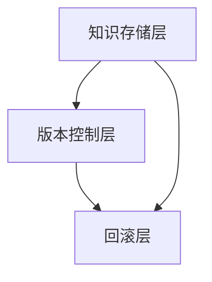

                 


# 实现AI Agent的动态知识库版本控制与回滚

## 关键词
AI Agent, 动态知识库, 版本控制, 回滚机制, 系统架构, 算法原理

## 摘要
本文详细探讨了AI Agent动态知识库版本控制与回滚的核心概念、算法原理、系统架构设计及项目实现。通过分析动态知识库的特点和版本控制的必要性，结合具体案例，展示了如何设计高效的版本控制与回滚机制，确保知识库的稳定性和可追溯性。

---

## 第一部分: AI Agent动态知识库版本控制与回滚的背景与核心概念

### 第1章: 问题背景与核心概念

#### 1.1 问题背景
- **1.1.1 AI Agent的定义与特点**
  - AI Agent的定义：智能体（Agent）是一种能够感知环境并采取行动以实现目标的实体。
  - AI Agent的特点：自主性、反应性、目标导向、社交能力。
- **1.1.2 动态知识库的定义与作用**
  - 动态知识库：一种能够实时更新和调整的知识存储系统，用于支持AI Agent的决策和推理。
  - 作用：提供动态、实时的知识支持，增强AI Agent的适应性和智能性。
- **1.1.3 知识库版本控制的必要性**
  - 知识库动态更新的挑战：数据的频繁变化可能导致知识不一致或错误。
  - 版本控制的缺失带来的问题：难以追溯错误，影响系统的稳定性和可靠性。
  - 回滚机制的重要性：在出现问题时，能够快速恢复到之前的稳定状态。

#### 1.2 问题描述
- **1.2.1 知识库动态更新的挑战**
  - 数据一致性：动态更新可能导致数据冲突。
  - 更新频率：高频更新对版本控制机制提出了更高要求。
  - 数据依赖性：知识库中的数据可能相互依赖，更新一个部分可能影响整体。
- **1.2.2 版本控制的缺失带来的问题**
  - 知识不一致：多个版本同时存在可能导致逻辑混乱。
  - 无法追溯：出现问题时，难以找到导致问题的具体版本。
  - 系统崩溃风险：错误的更新可能导致整个知识库不可用。
- **1.2.3 回滚机制的重要性**
  - 确保系统稳定性：在出现问题时，能够快速恢复到一个已知的稳定版本。
  - 提高系统可靠性：通过回滚机制，减少因更新错误导致的系统故障。
  - 支持调试和修复：回滚机制为修复错误提供了时间和空间上的灵活性。

#### 1.3 问题解决思路
- **1.3.1 动态知识库版本控制的目标**
  - 提供高效的知识库版本管理方法。
  - 实现版本之间的可追溯性和可恢复性。
  - 支持动态更新的同时，确保知识库的稳定性和一致性。
- **1.3.2 回滚机制的设计原则**
  - 简单性：回滚机制应尽量简单，减少复杂性。
  - 可靠性：确保回滚过程中的数据完整性和一致性。
  - 可扩展性：回滚机制应支持多种场景和应用需求。
- **1.3.3 系统架构的初步设想**
  - 分层架构：将系统划分为知识存储层、版本控制层和回滚层。
  - 组件协作：各组件之间通过明确的接口和协议进行通信。
  - 可扩展性：系统架构应支持未来的扩展和升级。

#### 1.4 边界与外延
- **1.4.1 知识库版本控制的边界**
  - 知识库的范围：仅限于特定的知识领域或模块。
  - 版本控制的粒度：可以根据需求选择粗粒度或细粒度的版本控制。
  - 回滚的范围：支持从单个知识点到整个知识库的回滚。
- **1.4.2 动态知识库的外延**
  - 知识库的动态更新：包括新增、删除、修改等操作。
  - 知识库的分布式存储：支持多节点的协作和同步。
  - 知识库的自适应性：能够根据环境变化自动调整内容。
- **1.4.3 回滚机制的适用范围**
  - 单点回滚：针对某个特定的知识点进行回滚。
  - 整体回滚：针对整个知识库或特定版本进行回滚。
  - 有条件回滚：在满足特定条件时自动触发回滚机制。

#### 1.5 核心概念结构
- **1.5.1 核心要素组成**
  - 知识点：知识库中的最小单位，可以是事实、规则或逻辑。
  - 版本：知识库在某个时间点的状态。
  - 更新操作：对知识库进行的新增、删除或修改操作。
  - 回滚操作：将知识库恢复到某个特定版本的操作。
- **1.5.2 与其他概念的关系**
  - 知识点与版本：每个版本由一系列知识点组成。
  - 更新操作与版本：每次更新操作生成一个新的版本。
  - 回滚操作与版本：回滚操作选择一个版本，并将其恢复为当前版本。
- **1.5.3 系统架构的初步框架**
  - 知识存储层：负责存储知识库的数据。
  - 版本控制层：负责记录版本信息，并管理版本之间的关系。
  - 回滚层：负责执行回滚操作，将知识库恢复到指定版本。

### 第2章: 动态知识库与版本控制的核心概念

#### 2.1 动态知识库的表示方法
- **2.1.1 知识表示的基本形式**
  - 知识点：最小的有意义单位，如“猫是 mammals”。
  - 知识关系：知识点之间的关联，如“猫属于 mammals”。
  - 知识网络：由知识点和关系构成的网络结构。
- **2.1.2 动态更新的表示方法**
  - 增量更新：只记录变化的部分。
  - 全量更新：记录整个知识库的最新状态。
  - 混合更新：根据情况选择增量或全量更新。
- **2.1.3 知识库的组织结构**
  - 分层结构：将知识库分为多个层次，每个层次负责不同的功能。
  - 树状结构：知识点以树的形式组织，便于管理和查询。
  - 网络结构：知识点之间的关系形成复杂的网络，支持复杂的推理。

#### 2.2 知识库版本控制的原理
- **2.2.1 版本控制的基本概念**
  - 版本：知识库在某个时间点的状态。
  - 版本号：用于标识不同版本的编号或时间戳。
  - 版本关系：版本之间的依赖和关联。
- **2.2.2 动态知识库的版本管理**
  - 版本生成：每次更新生成一个新的版本。
  - 版本存储：将所有版本存储起来，以便后续回滚和追溯。
  - 版本比较：比较不同版本之间的差异，支持高效更新和回滚。
- **2.2.3 版本控制的实现机制**
  - 日志记录：记录每次更新的操作和结果。
  - 差分存储：只存储变化的部分，减少存储空间。
  - 哈希校验：使用哈希函数确保数据的完整性和一致性。

#### 2.3 回滚机制的设计
- **2.3.1 回滚的基本原理**
  - 回滚操作：将知识库恢复到某个特定版本。
  - 回滚策略：根据需求选择回滚的版本和范围。
  - 回滚过程：包括数据恢复和版本切换等步骤。
- **2.3.2 回滚策略的制定**
  - 时间戳回滚：根据时间戳选择版本。
  - 错误检测回滚：检测到错误后自动回滚到最近的稳定版本。
  - 手动回滚：用户手动选择版本进行回滚。
- **2.3.3 回滚过程中的注意事项**
  - 数据一致性：确保回滚后的数据与版本记录一致。
  - 操作原子性：回滚操作应是原子操作，避免中间状态的出现。
  - 性能优化：尽量减少回滚操作对系统性能的影响。

---

## 第三部分: AI Agent动态知识库版本控制与回滚的系统分析与架构设计

### 第3章: 系统架构设计

#### 3.1 系统架构概述
- **3.1.1 分层架构的设计思路**
  - 将系统划分为知识存储层、版本控制层和回滚层。
  - 每层负责不同的功能，层次之间通过接口进行通信。
- **3.1.2 组件之间的关系**
  - 知识存储层：负责存储知识库的数据。
  - 版本控制层：负责记录版本信息，并管理版本之间的关系。
  - 回滚层：负责执行回滚操作，将知识库恢复到指定版本。
- **3.1.3 系统的可扩展性**
  - 系统架构设计应支持未来的扩展和升级。
  - 各层之间应有良好的接口和协议，便于添加新功能。

#### 3.2 功能模块设计
- **3.2.1 知识库存储模块**
  - 负责存储知识库的数据。
  - 支持增量和全量更新。
  - 提供高效的查询和检索功能。
- **3.2.2 版本控制模块**
  - 负责记录版本信息。
  - 管理版本之间的关系。
  - 提供版本比较和回滚的功能。
- **3.2.3 回滚模块**
  - 负责执行回滚操作。
  - 支持多种回滚策略。
  - 确保回滚操作的原子性和一致性。

#### 3.3 数据流设计
- **3.3.1 知识库的写入流程**
  - 用户或AI Agent提交更新请求。
  - 知识库存储模块接收请求，更新数据。
  - 版本控制模块记录新的版本。
- **3.3.2 版本控制的触发条件**
  - 每次更新操作触发版本控制模块。
  - 记录版本信息，生成新的版本号。
- **3.3.3 回滚的执行流程**
  - 用户或AI Agent提交回滚请求。
  - 回滚模块选择目标版本。
  - 知识库存储模块恢复数据到目标版本。
  - 确保数据一致性和系统稳定性。

### 第4章: 系统架构设计

#### 4.1 问题场景介绍
- **4.1.1 知识库动态更新的场景**
  - AI Agent根据新的信息更新知识库。
  - 多个AI Agent协作更新知识库。
- **4.1.2 版本控制的需求**
  - 需要支持高频更新和复杂场景。
  - 需要高效的版本比较和回滚机制。
- **4.1.3 系统目标**
  - 设计高效的系统架构，支持动态知识库的版本控制与回滚。
  - 确保系统的稳定性和可扩展性。

#### 4.2 系统功能设计
- **4.2.1 领域模型设计**
  - 知识点：基本单位，具有唯一标识和属性。
  - 版本：由多个知识点组成，具有版本号和时间戳。
  - 更新操作：对知识点的新增、删除或修改操作。
  - 回滚操作：将知识库恢复到某个版本。
- **4.2.2 系统架构设计**
  - 分层架构：知识存储层、版本控制层和回滚层。
  - 组件协作：各层通过接口和协议进行通信。
  - 可扩展性：支持未来的功能扩展和性能优化。

#### 4.3 系统架构图


#### 4.4 系统接口设计
- **4.4.1 知识库存储模块接口**
  - updateKnowledge(knowledgePoint): 更新知识点。
  - rollback(version): 回滚到指定版本。
- **4.4.2 版本控制模块接口**
  - recordVersion(): 记录当前版本。
  - compareVersions(v1, v2): 比较两个版本。
- **4.4.3 回滚模块接口**
  - rollback(version): 回滚到指定版本。
  - commit(version): 提交当前版本。

#### 4.5 系统交互流程
- **4.5.1 更新知识流程**
  1. AI Agent提交更新请求。
  2. 知识库存储层接收请求，更新知识点。
  3. 版本控制层记录新版本。
- **4.5.2 回滚流程**
  1. AI Agent检测到错误，提交回滚请求。
  2. 回滚模块选择目标版本。
  3. 知识库存储层恢复到目标版本。
  4. 系统确认回滚完成。

---

## 第四部分: AI Agent动态知识库版本控制与回滚的项目实战

### 第5章: 项目实战

#### 5.1 环境安装
- **5.1.1 环境要求**
  - 操作系统：支持Linux、Windows、macOS。
  - 开发工具：安装Python、Git、Mermaid等工具。
  - 依赖库：安装必要的Python库，如`mermaid`、`networkx`等。

#### 5.2 核心实现
- **5.2.1 知识库存储模块实现**
  ```python
  class KnowledgeStorage:
      def __init__(self):
          self.knowledge = {}  # key: version, value: dict of knowledge points
  ```

- **5.2.2 版本控制模块实现**
  ```python
  class VersionControl:
      def __init__(self):
          self.version_history = []  # list of versions
  ```

- **5.2.3 回滚模块实现**
  ```python
  class Rollback:
      def __init__(self):
          self.current_version = 0  # current version number
  ```

#### 5.3 代码解读
- **5.3.1 知识库存储模块**
  - `KnowledgeStorage`类：负责存储不同版本的知识点。
  - `update_knowledge`方法：更新特定版本的知识点。
  - `get_knowledge`方法：根据版本号获取知识点。

#### 5.4 功能实现
- **5.4.1 更新知识库**
  ```python
  def update_knowledge(storage, version, knowledge):
      storage.knowledge[version] = knowledge
  ```

- **5.4.2 回滚知识库**
  ```python
  def rollback(storage, version):
      storage.knowledge[current_version] = storage.knowledge[version]
  ```

#### 5.5 案例分析
- **5.5.1 更新过程**
  1. 初始化知识库存储模块。
  2. 更新知识点到版本1。
  3. 更新知识点到版本2。
  4. 记录版本信息。

- **5.5.2 回滚过程**
  1. 检测到错误，提交回滚请求。
  2. 回滚到版本1。
  3. 确认回滚完成。

#### 5.6 项目总结
- **5.6.1 核心实现总结**
  - 知识库存储模块：实现了知识点的存储和管理。
  - 版本控制模块：实现了版本的记录和比较。
  - 回滚模块：实现了回滚操作的执行和确认。
- **5.6.2 实践中的注意事项**
  - 确保数据一致性和系统稳定性。
  - 优化回滚操作的效率和性能。
  - 提供友好的用户接口和错误处理机制。

---

## 第五部分: 总结与展望

### 第6章: 总结与展望

#### 6.1 核心内容总结
- 本文详细探讨了AI Agent动态知识库版本控制与回滚的核心概念、算法原理、系统架构设计及项目实现。
- 通过分析动态知识库的特点和版本控制的必要性，结合具体案例，展示了如何设计高效的版本控制与回滚机制，确保知识库的稳定性和可追溯性。

#### 6.2 未来展望
- **6.2.1 系统优化方向**
  - 提高版本控制的效率和性能。
  - 优化回滚操作的响应时间和成功率。
- **6.2.2 新功能开发**
  - 支持分布式知识库的版本控制与回滚。
  - 提供智能化的版本管理功能，如自动选择最佳版本进行回滚。
- **6.2.3 技术扩展**
  - 研究更高效的知识表示方法，如图嵌入和知识图谱。
  - 探索更先进的版本控制算法，如基于区块链的版本控制。

#### 6.3 最佳实践 Tips
- **版本控制的粒度**：根据实际需求选择粗粒度或细粒度的版本控制，避免不必要的存储和计算开销。
- **回滚操作的原子性**：确保回滚操作是原子性的，避免中间状态的出现，保证数据的完整性和一致性。
- **系统监控与日志记录**：实时监控知识库的更新和回滚操作，记录详细的日志，便于后续的调试和优化。

---

## 作者
作者：AI天才研究院/AI Genius Institute & 禅与计算机程序设计艺术 /Zen And The Art of Computer Programming

