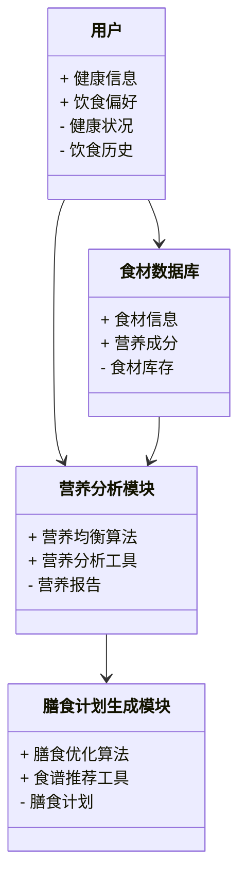
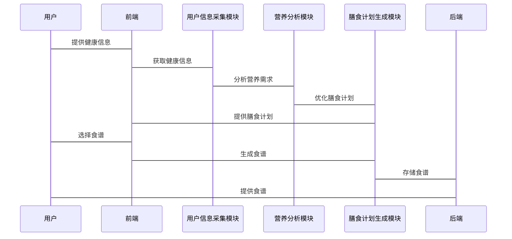

                 


# 智能厨房助手：AI Agent的营养均衡膳食规划

> 关键词：智能厨房助手, AI Agent, 营养均衡, 膳食规划, 人工智能, 数学建模

> 摘要：本文探讨了AI Agent在智能厨房助手中的应用，重点分析了如何通过AI技术实现营养均衡的膳食规划。从背景分析、核心概念、算法原理到系统架构设计，再到项目实战，全面解析了智能厨房助手的技术实现路径。

---

# 第一部分: 背景与需求

# 第1章: 背景与问题分析

## 1.1 智能厨房助手的背景
### 1.1.1 当前厨房智能化的发展现状
随着智能家居的普及，厨房智能化已成为趋势。智能冰箱、智能灶具等设备逐渐进入家庭，为厨房助手的实现提供了硬件基础。AI技术的进步使得厨房助手能够更加智能化地处理食材采购、食谱推荐和膳食规划等问题。

### 1.1.2 用户对营养均衡膳食的需求
现代人越来越关注健康，营养均衡的膳食需求日益增长。然而，许多用户由于缺乏营养学知识，难以自行制定科学的膳食计划。智能厨房助手通过AI技术，能够根据用户的饮食习惯、健康状况和营养需求，自动推荐营养均衡的食谱。

### 1.1.3 AI技术在厨房中的应用潜力
AI技术在厨房中的应用潜力巨大。通过自然语言处理（NLP）、计算机视觉（CV）和机器学习（ML）等技术，AI助手可以实现食材识别、食谱推荐、营养分析和膳食优化等功能。

## 1.2 营养均衡膳食规划的核心问题
### 1.2.1 营养均衡的基本概念
营养均衡是指膳食中各类营养素的摄入比例符合人体健康需求。通常包括热量、蛋白质、碳水化合物、脂肪、维生素和矿物质等的合理搭配。

### 1.2.2 用户需求与问题描述
用户在使用智能厨房助手时，通常希望：
1. 根据自身健康状况推荐膳食。
2. 自动优化食谱，使其更加营养均衡。
3. 提供多样化的食谱选择，避免饮食单调。

### 1.2.3 问题解决的边界与外延
智能厨房助手的主要功能是规划营养均衡的膳食，但不涉及食材的实际烹饪过程。系统设计的边界包括：
1. 用户的基本健康信息（如年龄、性别、体重、活动量等）。
2. 食材的种类和营养成分数据库。
3. 膳食计划的生成与优化。

## 1.3 核心概念与组成
### 1.3.1 AI Agent的定义与特征
AI Agent是一种智能体，能够感知环境、自主决策并执行任务。其主要特征包括：
1. 感知能力：通过传感器或数据库获取信息。
2. 决策能力：基于数据进行分析和决策。
3. 执行能力：通过接口或设备执行操作。

### 1.3.2 营养均衡膳食规划的要素
营养均衡膳食规划的核心要素包括：
1. 用户健康信息：年龄、性别、体重、活动量等。
2. 食材数据库：各类食材的营养成分数据。
3. 膳食计划：基于用户需求生成的食谱。
4. 营养分析：对食谱的营养均衡性进行评估。

### 1.3.3 系统的核心功能模块
智能厨房助手的核心功能模块包括：
1. 用户信息采集模块。
2. 营养分析模块。
3. 膳食计划生成模块。
4. 交互界面模块。

---

# 第二部分: 核心概念与联系

# 第2章: AI Agent与营养均衡膳食规划的关系

## 2.1 AI Agent的核心原理
### 2.1.1 AI Agent的基本原理
AI Agent通过感知环境、分析数据、制定策略并执行操作，帮助用户实现目标。在智能厨房助手中，AI Agent的主要任务是优化膳食计划。

### 2.1.2 AI Agent的分类与特点
AI Agent可以根据智能水平分为：
1. **基于规则的AI Agent**：通过预设规则进行决策。
2. **基于学习的AI Agent**：通过机器学习模型进行预测和优化。

### 2.1.3 AI Agent在厨房中的应用场景
在厨房中，AI Agent可以实现以下功能：
1. 食材识别与分类。
2. 食谱推荐与优化。
3. 营养均衡分析。

## 2.2 营养均衡膳食规划的数学模型
### 2.2.1 营养均衡的基本约束条件
营养均衡的约束条件包括：
1. **热量摄入**：每日热量摄入应符合用户的需求。
2. **营养素比例**：蛋白质、碳水化合物、脂肪的比例应符合科学建议。
3. **维生素与矿物质**：维生素A、B、C、D等的摄入应达到推荐值。

### 2.2.2 膳食规划的数学模型
营养均衡膳食规划的数学模型可以表示为：
$$
\text{目标函数：} \quad \min \sum_{i=1}^{n} |x_i - r_i|
$$
$$
\text{约束条件：} \quad 
\begin{cases}
\sum_{i=1}^{n} a_i x_i \geq b_i & \text{（营养素需求）} \\
x_i \geq 0 & \text{（食材数量非负）}
\end{cases}
$$
其中，$x_i$ 是食材的数量，$a_i$ 是食材的营养素含量，$b_i$ 是营养素的需求量。

### 2.2.3 营养均衡的评价指标
营养均衡的评价指标包括：
1. **热量密度**：单位热量的营养素含量。
2. **营养均衡指数**：基于各类营养素的摄入比例计算。

## 2.3 AI Agent与营养均衡膳食规划的关联
### 2.3.1 AI Agent在膳食规划中的作用
AI Agent通过以下方式实现膳食规划：
1. **数据采集**：获取用户的健康信息和食材库存。
2. **数据分析**：基于营养学原理分析食材的营养成分。
3. **算法优化**：利用优化算法生成营养均衡的膳食计划。

### 2.3.2 营养均衡与AI Agent的协同关系
营养均衡是AI Agent的目标，AI Agent是实现营养均衡的手段。通过AI技术，营养均衡的膳食规划可以更加科学和高效。

### 2.3.3 系统的核心功能模块
智能厨房助手的核心功能模块包括：
1. **用户信息采集模块**：收集用户的健康信息和饮食偏好。
2. **营养分析模块**：分析食材的营养成分。
3. **膳食计划生成模块**：基于优化算法生成营养均衡的膳食计划。
4. **交互界面模块**：提供用户友好的操作界面。

---

# 第三部分: 算法原理与数学模型

# 第3章: 基于AI Agent的营养均衡算法

## 3.1 算法原理
### 3.1.1 基于规则的营养均衡算法
基于规则的算法通过预设规则生成膳食计划。例如：
1. 根据用户的需求推荐食材类别（如蔬菜、蛋白质来源等）。
2. 根据食材的营养成分计算摄入量。

### 3.1.2 基于机器学习的营养均衡算法
基于机器学习的算法通过训练模型优化膳食计划。例如：
1. 使用线性回归模型预测营养素的摄入量。
2. 使用遗传算法优化食材组合。

### 3.1.3 算法的优缺点分析
| 算法类型 | 优点 | 缺点 |
|---------|------|------|
| 基于规则 | 实现简单，可解释性高 | 需要大量预设规则，灵活性差 |
| 基于机器学习 | 可以自适应数据，灵活性高 | 需要大量数据训练，可解释性差 |

## 3.2 数学模型与公式
### 3.2.1 营养均衡的约束条件
营养均衡的约束条件可以用以下公式表示：
$$
\sum_{i=1}^{n} x_i \cdot a_i = b_i
$$
其中，$x_i$ 是食材的数量，$a_i$ 是食材的营养素含量，$b_i$ 是营养素的需求量。

### 3.2.2 膳食规划的数学模型
膳食规划的数学模型可以表示为：
$$
\min \sum_{i=1}^{n} |x_i - r_i|
$$
其中，$x_i$ 是食材的数量，$r_i$ 是推荐的食材数量。

---

# 第四部分: 系统分析与架构设计

# 第4章: 智能厨房助手的系统架构设计

## 4.1 问题场景介绍
智能厨房助手的目标是帮助用户制定营养均衡的膳食计划。系统需要处理以下问题：
1. 如何获取用户的健康信息和饮食偏好。
2. 如何分析食材的营养成分。
3. 如何生成营养均衡的膳食计划。

## 4.2 项目介绍
智能厨房助手是一个基于AI技术的膳食规划系统，旨在帮助用户根据自身需求制定科学的膳食计划。

## 4.3 系统功能设计
### 4.3.1 领域模型


### 4.3.2 系统架构设计


### 4.3.3 系统接口设计
系统接口设计包括：
1. 用户信息接口：用于获取用户的健康信息和饮食偏好。
2. 食材数据库接口：用于查询食材的营养成分。
3. 营养分析接口：用于分析食材的营养均衡性。
4. 膳食计划接口：用于生成和优化膳食计划。

### 4.3.4 系统交互流程


---

# 第五部分: 项目实战

# 第5章: 项目实战

## 5.1 环境安装
### 5.1.1 安装Python
安装Python 3.8或更高版本：
```bash
# 在终端中运行以下命令
python --version
pip install --upgrade pip
```

### 5.1.2 安装依赖库
安装必要的依赖库：
```bash
pip install numpy pandas scikit-learn matplotlib
```

## 5.2 系统核心实现
### 5.2.1 营养分析模块实现
```python
import numpy as np
import pandas as pd

def calculate_nutritionalance(food_data, user_info):
    # 食材数据：pandas DataFrame，包含各食材的营养成分
    # 用户信息：字典，包含用户的健康需求
    pass

def optimize_meal_plan(food_data, user_info):
    # 优化膳食计划
    pass
```

### 5.2.2 膳食计划生成模块实现
```python
from sklearn.linear_model import LinearRegression

def generate_meal_plan(food_data, user_info):
    # 基于机器学习生成膳食计划
    model = LinearRegression()
    model.fit(X, y)
    pass
```

## 5.3 代码应用解读与分析
### 5.3.1 营养分析模块解读
营养分析模块通过分析食材的营养成分，计算膳食的营养均衡性。例如：
```python
# 示例代码：计算蛋白质摄入量
protein_intake = np.dot(food_data['蛋白质'], food_amounts)
```

### 5.3.2 膳食计划生成模块解读
膳食计划生成模块通过优化算法生成营养均衡的膳食计划。例如：
```python
# 示例代码：基于线性回归的膳食计划生成
model = LinearRegression()
model.fit(X, y)
predicted_intake = model.predict(X)
```

## 5.4 实际案例分析
### 5.4.1 案例背景
假设用户是一位30岁的男性，体重70公斤，活动量中等。目标是每天摄入2000卡路里，其中蛋白质占20%，碳水化合物占60%，脂肪占20%。

### 5.4.2 数据准备
食材数据表：
| 食材   | 蛋白质(g) | 碳水化合物(g) | 脂肪(g) | 热量(kcal) |
|--------|-----------|---------------|---------|------------|
| 牛肉   | 26        | 0             | 6.5      | 121        |
| 白米饭 | 2.7       | 34.5          | 0.5      | 130        |
| 西兰花 | 2.5       | 7.5           | 0.4      | 25         |

### 5.4.3 营养分析
计算每种食材的营养比例：
```python
# 示例代码：计算蛋白质比例
protein_ratio = (26 + 2.7 + 2.5) / 55  # 总蛋白质摄入量 / 总热量摄入量
```

### 5.4.4 膳食计划生成
基于优化算法生成膳食计划：
```python
# 示例代码：基于线性回归的膳食计划生成
X = np.array([[26, 2.7, 2.5]]).T
y = np.array([20])
model = LinearRegression()
model.fit(X, y)
predicted_protein = model.predict(X)
```

## 5.5 项目小结
通过以上步骤，我们可以实现一个基于AI Agent的营养均衡膳食规划系统。系统能够根据用户的健康需求和食材库存，生成科学的膳食计划。

---

# 第六部分: 总结与展望

# 第6章: 总结与展望

## 6.1 小结
本文详细介绍了AI Agent在智能厨房助手中的应用，从背景分析、核心概念、算法原理到系统架构设计，再到项目实战，全面解析了智能厨房助手的技术实现路径。

## 6.2 注意事项
1. 系统设计时需考虑数据的准确性和完整性。
2. 算法优化需结合实际应用场景。
3. 用户隐私保护需高度重视。

## 6.3 拓展阅读
1. 《基于AI的膳食优化算法研究》
2. 《智能厨房设备的物联网实现》
3. 《营养学与人工智能的结合应用》

---

作者：AI天才研究院/AI Genius Institute & 禅与计算机程序设计艺术 /Zen And The Art of Computer Programming

