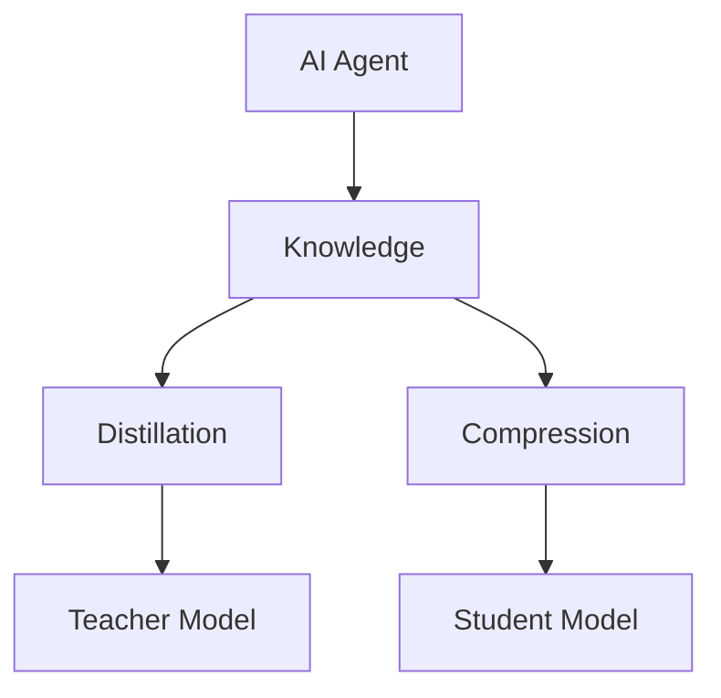
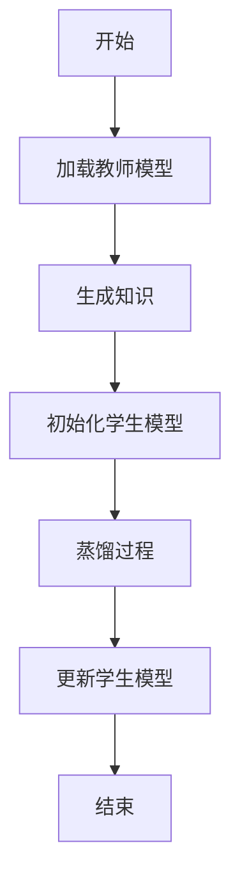
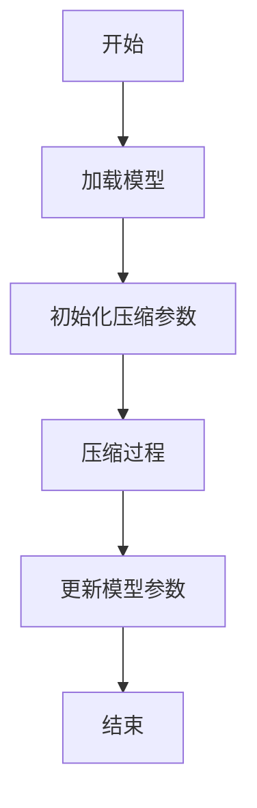
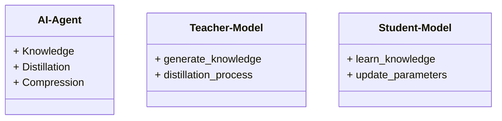
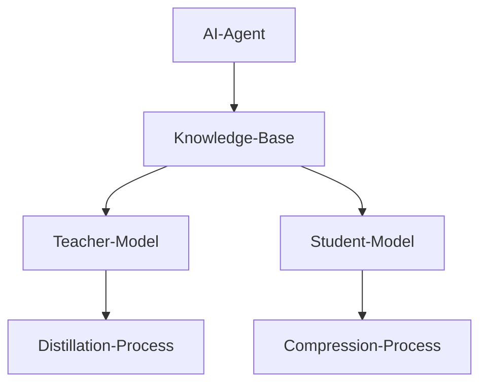
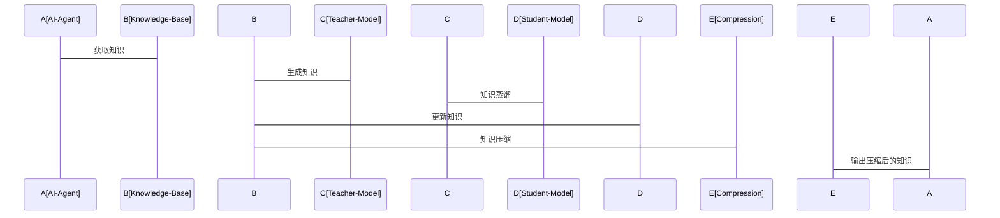

                 


# 设计AI Agent的动态知识蒸馏与压缩

> 关键词：AI Agent，动态知识蒸馏，知识压缩，机器学习，模型优化

> 摘要：本文深入探讨了AI Agent的动态知识蒸馏与压缩技术，从基本概念、核心原理、算法实现到系统设计和项目实战，全面解析了这一领域的关键技术和实际应用。通过理论与实践相结合的方式，本文旨在为AI Agent的设计者和开发者提供一份详尽的指导手册。

---

## 第1章: AI Agent与动态知识蒸馏压缩概述

### 1.1 AI Agent的基本概念

#### 1.1.1 AI Agent的定义与分类
AI Agent（人工智能代理）是指能够感知环境、自主决策并执行任务的智能实体。根据功能和应用场景的不同，AI Agent可以分为多种类型，包括基于规则的代理、基于模型的代理、强化学习代理和基于记忆的代理等。

#### 1.1.2 动态知识蒸馏与压缩的背景
随着AI技术的快速发展，模型的复杂性和计算成本不断增加。为了在资源受限的环境中高效运行AI Agent，动态知识蒸馏与压缩技术应运而生。这种技术能够实时更新和优化模型，使其在动态环境中保持高效性能。

#### 1.1.3 问题背景与目标
传统知识蒸馏和压缩技术主要针对静态模型设计，难以应对动态环境下的知识更新需求。本文旨在探讨如何在动态环境中实现知识蒸馏与压缩，以满足实时性和高效性的要求。

### 1.2 动态知识蒸馏与压缩的核心概念

#### 1.2.1 知识蒸馏的基本原理
知识蒸馏通过将大型模型的知识迁移到小型模型中，以减少模型的体积和计算成本。动态蒸馏则进一步要求模型能够实时更新和优化，以适应环境的变化。

#### 1.2.2 知识压缩的核心思想
知识压缩通过对模型参数进行量化和精简，降低模型的复杂度。动态压缩则强调在压缩过程中保持模型的实时性和适应性，确保模型在变化的环境中仍能高效运行。

#### 1.2.3 动态环境下的知识更新需求
在动态环境中，AI Agent需要不断更新其知识库以应对新的任务和挑战。动态知识蒸馏与压缩技术能够实时调整模型参数，确保模型在变化的环境中保持高效性能。

### 1.3 动态知识蒸馏与压缩的必要性

#### 1.3.1 知识蒸馏与压缩的动机
随着AI应用的普及，模型的轻量化需求日益增长。知识蒸馏与压缩技术能够有效降低模型的计算成本，同时保持其性能。

#### 1.3.2 动态环境下的知识更新需求
在动态环境中，AI Agent需要快速适应新的输入和任务。动态知识蒸馏与压缩技术能够实时更新模型，确保其在变化的环境中仍能高效运行。

#### 1.3.3 与传统知识蒸馏压缩的区别
传统知识蒸馏和压缩技术主要针对静态模型设计，而动态知识蒸馏与压缩技术则强调实时更新和适应性优化，以满足动态环境下的需求。

### 1.4 本章小结
本章主要介绍了AI Agent的基本概念、动态知识蒸馏与压缩的背景及其核心概念。通过对比传统技术与动态技术的区别，我们明确了动态知识蒸馏与压缩技术的重要性和必要性。

---

## 第2章: 动态知识蒸馏与压缩的核心概念与联系

### 2.1 动态知识蒸馏的原理

#### 2.1.1 知识蒸馏的基本流程
知识蒸馏通常包括教师模型和学生模型两个部分。教师模型负责生成知识，学生模型负责学习和压缩知识。动态蒸馏则要求这一过程能够实时进行。

#### 2.1.2 动态蒸馏的核心步骤
动态蒸馏的核心步骤包括实时知识生成、知识转移和模型更新。这些步骤需要在动态环境中快速完成，以确保模型的适应性。

#### 2.1.3 蒸馏过程中的关键参数
关键参数包括教师模型的权重、蒸馏温度和蒸馏率。这些参数需要根据动态环境实时调整，以优化蒸馏效果。

### 2.2 动态知识压缩的机制

#### 2.2.1 知识压缩的基本方法
知识压缩通常采用量化、剪枝和参数替换等方法。动态压缩则要求这些方法能够实时进行，以适应环境的变化。

#### 2.2.2 动态压缩的核心算法
动态压缩的核心算法包括自适应量化、动态剪枝和模型参数动态调整。这些算法需要根据动态环境实时优化模型参数。

#### 2.2.3 压缩过程中的优化策略
优化策略包括贪心策略、反馈机制和在线优化。这些策略能够帮助模型在动态环境中高效压缩知识。

### 2.3 蒸馏与压缩的关系与对比

#### 2.3.1 蒸馏与压缩的联系
蒸馏和压缩都旨在降低模型的复杂度，但它们的目标不同。蒸馏注重知识的转移，而压缩注重知识的精简。

#### 2.3.2 蒸馏与压缩的区别
蒸馏关注模型性能的保持，而压缩关注模型体积的减小。动态蒸馏与压缩技术则需要在性能和体积之间找到平衡。

#### 2.3.3 蒸馏与压缩的协同优化
通过协同优化，可以同时实现知识的高效转移和精简，从而在动态环境中实现模型的高效运行。

### 2.4 核心概念对比表

| 概念 | 蒸馏 | 压缩 |
|------|------|------|
| 目标 | 知识转移 | 知识精简 |
| 方法 | 模型参数调整 | 参数量化 |
| 优势 | 保持模型性能 | 减小模型体积 |
| 挑战 | 知识损失 | 压缩后的性能损失 |

### 2.5 ER实体关系图



---

## 第3章: 动态知识蒸馏与压缩的算法原理

### 3.1 动态知识蒸馏算法的实现

#### 3.1.1 算法流程图



#### 3.1.2 Python代码实现

```python
def dynamic_distillation(teacher, student, inputs):
    # 生成教师模型的输出
    teacher_outputs = teacher(inputs)
    # 生成学生模型的输出
    student_outputs = student(inputs)
    # 计算蒸馏损失
    loss = KL_divergence(teacher_outputs, student_outputs)
    # 更新学生模型
    optimizer = Adam(student.parameters())
    optimizer.zero_grad()
    loss.backward()
    optimizer.step()
    return loss.item()
```

#### 3.1.3 数学模型与公式
蒸馏过程中，通常使用KL散度来衡量教师模型和学生模型之间的差异：

$$ KL(\text{P} \mid \text{Q}) = \sum_{i} \text{P}(i) \log \frac{\text{P}(i)}{\text{Q}(i)} $$

其中，$\text{P}$和$\text{Q}$分别代表教师模型和学生模型的输出分布。

### 3.2 动态知识压缩算法的实现

#### 3.2.1 算法流程图



#### 3.2.2 Python代码实现

```python
def dynamic_compression(model, threshold):
    # 初始化压缩参数
    compressed_params = []
    # 压缩过程
    for param in model.parameters():
        compressed_param = quantize(param, threshold)
        compressed_params.append(compressed_param)
    # 更新模型参数
    model.load_state_dict({'params': compressed_params})
    return model
```

#### 3.2.3 数学模型与公式
压缩过程中，通常采用量化方法来降低参数的精度：

$$ \text{compressed\_param} = \text{round}(\text{param} \times \text{scale}) $$

其中，$\text{scale}$是量化比例因子。

---

## 第4章: 动态知识蒸馏与压缩的系统分析与架构设计

### 4.1 系统应用场景

动态知识蒸馏与压缩技术广泛应用于边缘计算、实时推荐系统和动态环境下的模型部署等领域。

### 4.2 系统功能设计

#### 4.2.1 系统功能模块



#### 4.2.2 系统架构图



### 4.3 接口设计与交互流程

#### 4.3.1 接口设计

- 输入接口：接收动态环境中的新数据和任务请求。
- 输出接口：输出压缩后的模型参数和实时更新的知识。

#### 4.3.2 交互流程图



---

## 第5章: 动态知识蒸馏与压缩的项目实战

### 5.1 项目环境安装

#### 5.1.1 安装依赖
安装必要的Python库，如TensorFlow、PyTorch和Keras。

#### 5.1.2 环境配置
配置开发环境，确保硬件资源充足。

### 5.2 系统核心实现

#### 5.2.1 知识蒸馏实现

```python
import tensorflow as tf
from tensorflow.keras import layers

# 教师模型
teacher = tf.keras.Sequential([
    layers.Dense(64, activation='relu'),
    layers.Dense(10, activation='softmax')
])

# 学生模型
student = tf.keras.Sequential([
    layers.Dense(32, activation='relu'),
    layers.Dense(10, activation='softmax')
])

# 蒸馏过程
def distillation_loss(y_true, y_pred, alpha=0.1):
    loss = tf.keras.losses.sparse_categorical_crossentropy(y_true, y_pred)
    teacher_loss = tf.keras.losses.sparse_categorical_crossentropy(y_true, teacher(y_true))
    return alpha * loss + (1 - alpha) * teacher_loss

# 编译和训练
teacher.compile(optimizer='adam', loss='sparse_categorical_crossentropy')
student.compile(optimizer='adam', loss=lambda y_true, y_pred: distillation_loss(y_true, y_pred))
teacher.fit(x_train, y_train, epochs=10)
student.fit(x_train, y_train, epochs=10)
```

#### 5.2.2 知识压缩实现

```python
def quantize(param, threshold=0.1):
    # 量化参数
    param_abs = tf.abs(param)
    scale = tf.reduce_max(param_abs) / threshold
    quantized_param = tf.round(param / scale * threshold)
    return quantized_param

# 压缩过程
compressed_params = []
for param in teacher.trainable_weights:
    compressed_param = quantize(param)
    compressed_params.append(compressed_param)
# 更新模型参数
new_model = tf.keras.Sequential([
    layers.Dense(64, activation='relu'),
    layers.Dense(10, activation='softmax')
])
new_model.set_weights(compressed_params)
```

### 5.3 项目小结
通过本章的实战项目，我们详细讲解了动态知识蒸馏与压缩技术的具体实现过程，包括模型训练、知识蒸馏、参数压缩等步骤。这些代码示例和实现细节为读者提供了宝贵的参考。

---

## 第6章: 总结与展望

### 6.1 本章总结
本文从AI Agent的基本概念出发，深入探讨了动态知识蒸馏与压缩的核心原理、算法实现和系统设计。通过理论与实践相结合的方式，为读者提供了一套完整的解决方案。

### 6.2 展望
未来，动态知识蒸馏与压缩技术将在更多领域得到应用，如实时推荐系统、边缘计算和动态环境下的模型部署等。同时，如何在动态环境中实现更高效的压缩和蒸馏算法，仍是一个值得深入研究的方向。

### 6.3 最佳实践Tips
- 在实际应用中，建议根据具体需求选择合适的蒸馏和压缩方法。
- 动态环境中，实时更新模型参数需要考虑计算资源和延迟的平衡。
- 建议结合反馈机制，优化模型的动态适应性。

---

## 作者信息
作者：AI天才研究院/AI Genius Institute  
联系邮箱：contact@aicourse.com  
官方网站：https://www.aicourse.com

---

以上是《设计AI Agent的动态知识蒸馏与压缩》的技术博客文章目录和部分正文内容，涵盖了从基础概念到实际应用的完整流程。通过详细的章节划分和丰富的技术细节，读者可以系统地学习和掌握动态知识蒸馏与压缩的核心技术。

