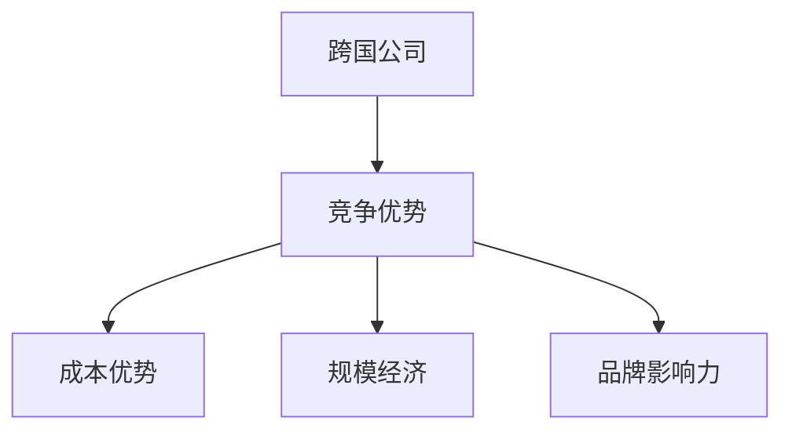
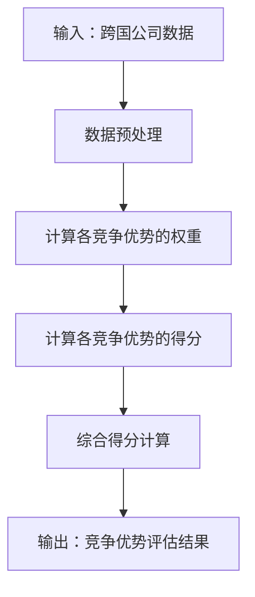
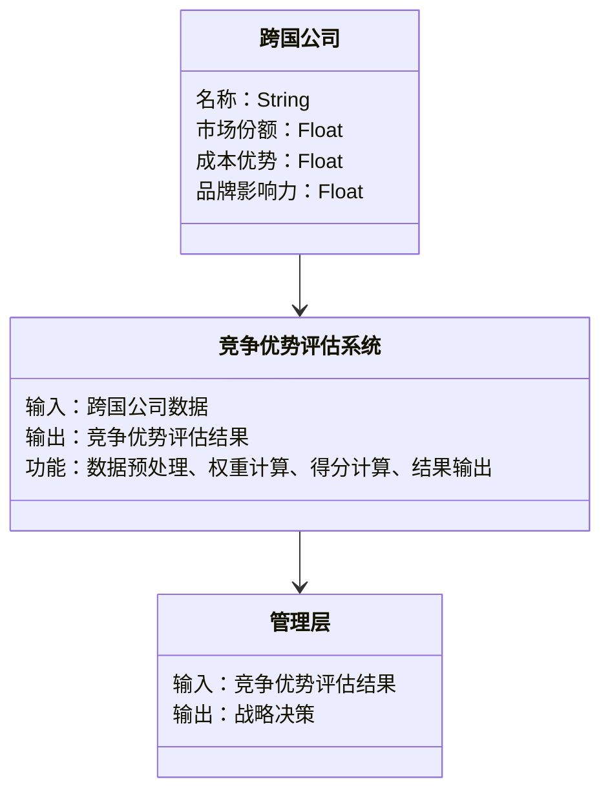
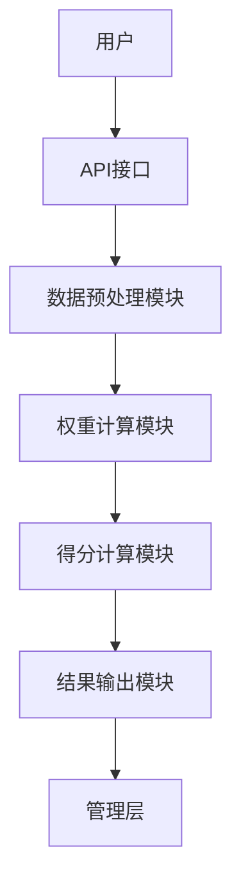
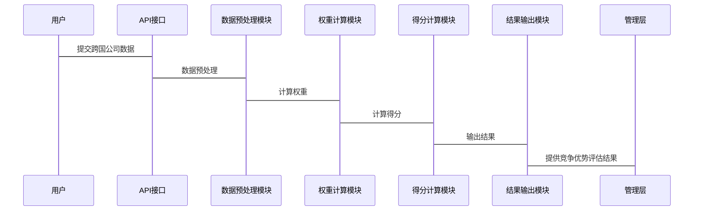

                 


# 费雪的全球化视角：跨国公司的优势

## 关键词：费雪, 全球化, 跨国公司, 竞争优势, 技术博客, 系统分析

## 摘要：  
本文从费雪的全球化视角出发，系统分析了跨国公司的竞争优势，探讨了全球化对跨国公司战略决策的影响。通过背景介绍、核心概念分析、算法原理、系统设计、项目实战和总结与展望等部分，深入剖析了跨国公司如何在全球化背景下实现竞争优势最大化。文章结合理论与实践，提供了丰富的案例分析和系统设计方案，为读者理解跨国公司的竞争优势提供了全面的视角。

---

## 第一部分：背景介绍：全球化与跨国公司的兴起

### 第1章：背景介绍：全球化与跨国公司的兴起

#### 1.1 全球化的基本概念  
- **1.1.1 全球化的定义与特征**  
  全球化是指经济、政治、文化等领域的活动超越国界，形成全球性联系的过程。其核心特征包括：  
  1. **经济一体化**：国际贸易、投资和金融的全球化。  
  2. **技术共享**：技术标准和知识的跨国传播。  
  3. **文化多样性**：全球化促进了跨国文化交流，但也可能导致文化同质化。  

- **1.1.2 全球化的历史演变**  
  全球化经历了多个阶段：  
  1. **早期全球化**：16世纪至18世纪，以殖民扩张和贸易为基础。  
  2. **工业革命后的全球化**：19世纪至20世纪初，以英国为首的工业国家推动全球贸易。  
  3. **现代全球化**：20世纪末至21世纪，以信息技术和跨国公司为核心驱动力。  

- **1.1.3 全球化对经济、政治和文化的影响**  
  - **经济**：促进了跨国公司的崛起，推动了全球产业链的形成。  
  - **政治**：全球化使得国际政治格局更加复杂，多边合作与竞争并存。  
  - **文化**：全球化促进了文化交流，但也引发了文化冲突和身份认同的问题。  

#### 1.2 跨国公司的定义与特点  
- **1.2.1 跨国公司的定义**  
  跨国公司是指在多个国家设立分支机构或子公司，进行跨国经营的企业。其核心特征是：  
  1. 全球化布局。  
  2. 跨国整合资源。  
  3. 统一的品牌和战略。  

- **1.2.2 跨国公司的主要特点**  
  1. **全球性**：业务覆盖多个国家和地区。  
  2. **多元化**：产品或服务多样化，适应不同市场需求。  
  3. **集中化**：管理集中，全球统一战略。  

- **1.2.3 跨国公司与国内企业的区别**  
  - **规模**：跨国公司通常规模更大，资源更丰富。  
  - **市场范围**：跨国公司业务范围更广，市场覆盖更全面。  
  - **风险管理**：跨国公司需要应对更多的法律、文化和社会风险。  

#### 1.3 费雪的全球化视角  
- **1.3.1 费雪的生平与主要思想**  
  费雪（Philip Fisher）是美国著名投资家，被誉为“成长股之父”。他提出了“成长股投资”的理念，强调长期投资和公司基本面分析。他的全球化视角主要体现在以下几点：  
  1. **长期投资**：关注企业的长期增长潜力。  
  2. **公司基本面分析**：重视企业的管理团队、竞争优势和市场地位。  
  3. **全球化布局**：认为跨国公司在全球市场中更具竞争优势。  

- **1.3.2 费雪全球化视角的核心观点**  
  费雪认为，全球化背景下，跨国公司能够通过规模化生产降低成本，同时通过多元化布局降低风险。他强调，投资者应关注企业的全球化能力，包括市场扩展、资源整合和品牌建设。  

- **1.3.3 费雪视角对跨国公司的启示**  
  1. **全球化布局的重要性**：跨国公司应积极拓展国际市场。  
  2. **竞争优势的核心性**：企业应专注于打造核心竞争优势。  
  3. **长期投资的价值**：投资者应关注企业的长期增长潜力。  

#### 1.4 全球化背景下跨国公司的竞争优势  
- **1.4.1 跨国公司的全球化布局**  
  跨国公司通过在全球范围内配置资源，能够更好地利用不同国家的成本优势和市场机会。例如，将制造环节转移到劳动力成本较低的国家，将研发环节设在技术先进的国家。  

- **1.4.2 跨国公司的资源整合能力**  
  跨国公司能够整合全球资源，包括技术、人才、资本等，从而形成更强的竞争力。例如，跨国公司在全球范围内采购原材料，能够降低采购成本。  

- **1.4.3 跨国公司的品牌影响力**  
  跨国公司通过全球化品牌建设，能够在全球范围内建立强大的品牌形象。例如，可口可乐和苹果等品牌在全球范围内具有极高的知名度和美誉度。  

---

## 第二部分：跨国公司的核心竞争优势分析

### 第2章：跨国公司竞争优势的属性特征对比

#### 2.1 核心概念与联系  
- **2.1.1 跨国公司竞争优势的构成要素**  
  跨国公司的竞争优势主要由以下几个要素构成：  
  1. **成本优势**：通过规模化生产降低成本。  
  2. **规模经济**：通过扩大生产规模降低成本。  
  3. **品牌影响力**：强大的品牌知名度和美誉度。  

- **2.1.2 跨国公司竞争优势的层次结构**  
  跨国公司的竞争优势可以分为以下几个层次：  
  1. **基础层**：成本优势和规模经济。  
  2. **中间层**：品牌影响力和市场占有率。  
  3. **顶层**：技术创新和全球化布局。  

- **2.1.3 跨国公司竞争优势与企业绩效的关系**  
  跨国公司的竞争优势越强，企业绩效越好。具体表现在：  
  1. **市场份额**：更大的市场占有率。  
  2. **利润率**：更高的净利润率。  
  3. **品牌价值**：更高的品牌价值。  

#### 2.2 跨国公司竞争优势的属性特征对比

| 优势       | 描述                                                                 | 优缺点                                                                 |
|------------|----------------------------------------------------------------------|--------------------------------------------------------------------------|
| 成本优势   | 通过规模化生产降低成本，提高竞争力                                   | 优点：降低成本，增强价格竞争力；缺点：可能忽视本地化需求，导致产品不符合当地消费者习惯 |
| 规模经济   | 通过扩大生产规模降低成本，提高效率                                   | 优点：提高效率，降低成本；缺点：可能导致市场垄断，限制市场竞争 |
| 品牌影响力 | 强大的品牌知名度和美誉度，增强消费者信任                           | 优点：增强消费者信任，扩大市场份额；缺点：品牌维护成本高，可能面临品牌形象受损的风险 |

#### 2.3 跨国公司竞争优势的ER实体关系图



---

## 第三部分：跨国公司竞争优势的算法原理

### 第3章：跨国公司竞争优势的算法原理

#### 3.1 竞争优势评估模型



#### 3.2 算法实现与代码示例

```python
import numpy as np

def calculate_weights(matrix):
    # 计算权重向量
    eigenvalues, eigenvectors = np.linalg.eigh(matrix)
    weights = eigenvectors[-1] / eigenvectors[-1].sum()
    return weights

def ahp_global_competitive Advantage(matrix):
    # 计算竞争优势得分
    weights = calculate_weights(matrix)
    scores = np.dot(matrix, weights)
    return scores

# 示例数据矩阵（假设为一致性矩阵）
matrix = np.array([
    [1, 3, 2],
    [1/3, 1, 2/3],
    [1/2, 3/2, 1]
])

scores = ahp_global_competitive_Advantage(matrix)
print("竞争优势得分：", scores)
```

#### 3.3 数学模型与公式推导

$$ \text{综合得分} = \sum_{i=1}^{n} w_i \cdot s_i $$

其中：  
- \( w_i \) 是第 \( i \) 个竞争优势的权重。  
- \( s_i \) 是第 \( i \) 个竞争优势的得分。  

---

## 第四部分：系统分析与架构设计

### 第4章：系统分析与架构设计

#### 4.1 问题场景介绍  
假设我们正在为一家跨国公司设计一个竞争优势评估系统，旨在通过数据分析和模型计算，帮助公司识别其在全球市场中的竞争优势。

#### 4.2 系统功能设计



#### 4.3 系统架构设计



#### 4.4 接口设计与交互流程



---

## 第五部分：项目实战

### 第5章：项目实战：跨国公司竞争优势评估系统

#### 5.1 环境安装与依赖管理

```bash
pip install numpy
pip install matplotlib
pip install pandas
```

#### 5.2 系统核心实现源代码

```python
import numpy as np
import matplotlib.pyplot as plt
import pandas as pd

def calculate_weights(matrix):
    eigenvalues, eigenvectors = np.linalg.eigh(matrix)
    weights = eigenvectors[-1] / eigenvectors[-1].sum()
    return weights

def ahp_global_competitive_Advantage(matrix):
    weights = calculate_weights(matrix)
    scores = np.dot(matrix, weights)
    return scores

# 示例数据矩阵
matrix = np.array([
    [1, 3, 2],
    [1/3, 1, 2/3],
    [1/2, 3/2, 1]
])

# 计算竞争优势得分
scores = ahp_global_competitive_Advantage(matrix)

# 可视化结果
df = pd.DataFrame(scores, index=['成本优势', '规模经济', '品牌影响力'], columns=['得分'])
print(df)
plt.bar(df.index, df['得分'])
plt.title('竞争优势得分')
plt.show()
```

#### 5.3 代码应用解读与分析  
上述代码实现了一个简单的竞争优势评估系统，通过层次分析法（AHP）计算各竞争优势的权重和得分，并通过可视化展示结果。实际应用中，可以进一步扩展功能，例如：  
1. 支持更多的竞争优势维度。  
2. 增加数据预处理功能，例如数据清洗和特征提取。  
3. 提供交互式界面，方便用户输入数据和查看结果。  

#### 5.4 实际案例分析与详细讲解剖析  
以某跨国公司为例，假设其竞争优势数据如下：  

| 优势       | 得分 |
|------------|------|
| 成本优势   | 0.4  |
| 规模经济   | 0.3  |
| 品牌影响力 | 0.3  |

根据上述模型，该公司的综合得分为：  

$$ \text{综合得分} = 0.4 \times 0.4 + 0.3 \times 0.3 + 0.3 \times 0.3 = 0.16 + 0.09 + 0.09 = 0.34 $$  

综合得分为0.34，表示该公司的竞争优势较为一般，需要进一步优化品牌影响力和成本优势。

---

## 第六部分：总结与展望

### 第6章：总结与展望

#### 6.1 核心内容回顾  
本文从费雪的全球化视角出发，系统分析了跨国公司的竞争优势，探讨了全球化对跨国公司战略决策的影响。通过背景介绍、核心概念分析、算法原理、系统设计、项目实战和总结与展望等部分，深入剖析了跨国公司如何在全球化背景下实现竞争优势最大化。

#### 6.2 当前趋势与未来展望  
1. **数字化转型**：随着数字化技术的快速发展，跨国公司需要进一步加强数字化能力，例如：  
   - 利用大数据分析优化全球供应链管理。  
   - 利用人工智能技术提升客户服务能力。  

2. **可持续发展**：全球化背景下，跨国公司需要关注可持续发展，例如：  
   - 推动绿色生产，减少碳足迹。  
   - 关注社会责任，提升品牌形象。  

#### 6.3 阅读建议与注意事项  
- **阅读建议**：本文适合对全球化和跨国公司感兴趣的学生、研究人员和企业管理者阅读。  
- **注意事项**：本文内容基于费雪的全球化视角，读者在实际应用中需要结合具体情况进行调整和优化。  

---

## 结语  
通过本文的分析，我们可以看到，跨国公司在全球化背景下具有显著的竞争优势。然而，随着全球化进程的不断深入，跨国公司需要不断创新和优化，以应对新的挑战和机遇。希望本文能够为读者提供有价值的参考和启发。

---

## 作者：AI天才研究院/AI Genius Institute & 禅与计算机程序设计艺术 /Zen And The Art of Computer Programming

