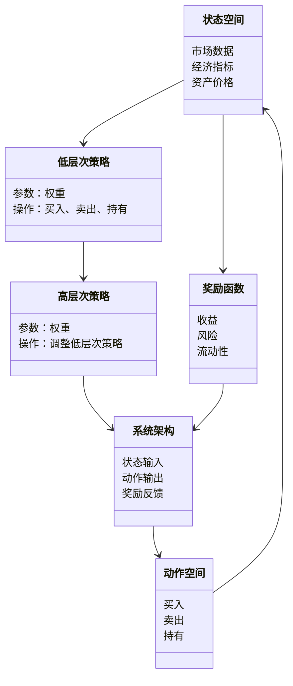
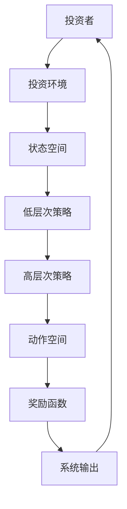
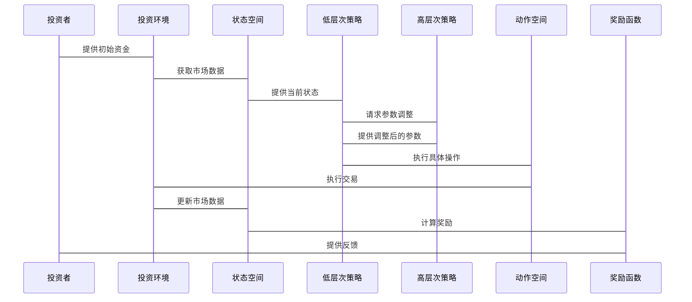

                 


# 金融领域元强化学习在多周期多目标投资决策中的应用

## 关键词：元强化学习、多周期投资、多目标优化、金融决策、深度学习

## 摘要：本文探讨了元强化学习（Meta Reinforcement Learning）在金融投资中的应用，特别是在多周期和多目标决策中的优势。通过分析元强化学习的基本原理、算法实现及其在金融投资中的实际应用，本文展示了如何利用元强化学习解决传统强化学习在金融投资中的局限性，并提出了一种基于元强化学习的投资决策框架，为投资者提供了新的思路。

---

# 第一部分：背景与概述

## 第1章：金融领域元强化学习概述

### 1.1 问题背景与问题描述

#### 1.1.1 传统投资决策的局限性
传统的投资决策方法，如均值-方差优化和因子模型，虽然在一定程度上能够帮助投资者制定投资策略，但它们在面对复杂多变的金融市场时，往往显得力不从心。这些问题主要体现在以下几个方面：

1. **单一周期优化**：传统方法通常只考虑单一周期内的优化目标，而忽略了多周期的动态变化，导致策略在不同时间段上的表现不一致。
2. **目标单一性**：传统方法往往只优化一个目标，如最大化收益或最小化风险，而难以同时优化多个目标，如收益、风险、流动性等。

#### 1.1.2 多周期投资决策的挑战
在实际的金融投资中，投资者需要在多个时间周期内做出决策，每个周期的市场环境和投资目标可能不同。这种多周期的投资决策面临以下挑战：

1. **时间序列的依赖性**：不同时间周期的市场表现往往相关，但又存在显著的差异，导致投资策略需要动态调整。
2. **跨周期的风险管理**：在多周期的投资中，投资者需要在整体上进行风险管理，避免在某些周期上的过度风险暴露。

#### 1.1.3 多目标优化在投资中的重要性
在实际投资中，投资者往往需要在多个目标之间进行权衡，例如在收益与风险之间找到最佳平衡点。传统的单目标优化方法无法满足这种需求，因此多目标优化在投资决策中具有重要意义。

### 1.1.4 元强化学习的解决方案
元强化学习（Meta Reinforcement Learning）作为一种新兴的人工智能技术，能够通过在高层次上优化强化学习过程，帮助模型在多个任务之间快速调整和适应。在金融投资中，元强化学习可以用于多周期和多目标优化，帮助投资者制定更优的投资策略。

### 1.1.5 元强化学习的边界与外延
元强化学习的应用在金融投资中具有一定的边界和外延。其边界主要体现在以下几个方面：

1. **任务空间的限制**：元强化学习适用于需要在多个任务之间进行快速调整的场景，但并不适用于完全独立的任务。
2. **数据需求**：元强化学习通常需要大量的数据来训练模型，因此在数据不足的情况下可能效果不佳。
3. **计算复杂度**：元强化学习的训练过程通常较为复杂，需要较高的计算资源。

其外延则体现在以下几个方面：

1. **与其他技术的结合**：元强化学习可以与传统的强化学习、深度学习等技术相结合，形成更强大的投资决策模型。
2. **跨领域的应用**：元强化学习不仅可以在金融领域应用，还可以扩展到其他需要多任务优化的领域，如机器人控制、游戏AI等。

### 1.1.6 元强化学习的概念结构与核心要素
元强化学习在金融投资中的概念结构可以分为以下几个核心要素：

1. **高层次策略**：用于指导低层次策略的调整，实现多任务优化。
2. **低层次策略**：负责具体的投资决策，如买卖时机的选择。
3. **状态空间**：包括市场数据、资产价格、经济指标等。
4. **动作空间**：包括买入、卖出、持有等具体操作。
5. **奖励函数**：定义了投资策略的好坏，通常基于收益、风险等指标。

---

## 第2章：元强化学习的核心概念与联系

### 2.1 元强化学习的核心原理

#### 2.1.1 元强化学习的基本框架
元强化学习的基本框架包括两个主要部分：高层次策略和低层次策略。高层次策略负责生成低层次策略的参数，而低层次策略则基于这些参数进行具体的投资决策。

#### 2.1.2 元强化学习的核心算法
元强化学习的核心算法可以分为以下几个步骤：

1. **初始化**：定义低层次策略的参数和奖励函数。
2. **元学习过程**：通过优化高层次策略，使得低层次策略在多个任务上表现最优。
3. **策略执行**：基于优化后的低层次策略进行具体的投资操作。

#### 2.1.3 元强化学习的优化目标
元强化学习的优化目标通常包括以下几个方面：

1. **最大化总体收益**：在多周期和多目标优化中，最大化投资组合的总体收益。
2. **最小化整体风险**：通过优化多个风险指标，降低投资组合的整体风险。
3. **平衡多个目标**：在多个目标之间找到最佳平衡点，例如在收益和风险之间进行权衡。

### 2.2 元强化学习与传统强化学习的对比

#### 2.2.1 算法目标的对比
传统强化学习的目标是通过优化单一的策略参数，使得在给定环境下的期望奖励最大化。而元强化学习的目标是优化一个元策略，使得在多个任务下的总体奖励最大化。

#### 2.2.2 状态空间的对比
传统强化学习通常假设状态空间是固定的，而元强化学习则允许状态空间在不同任务之间进行动态调整。

#### 2.2.3 动作空间的对比
传统强化学习的动作空间通常是固定的，而元强化学习的动作空间则可以根据任务的不同进行扩展或调整。

### 2.3 元强化学习在金融投资中的应用

#### 2.3.1 多周期投资决策中的应用
元强化学习可以用于多周期投资决策，通过在不同周期上优化投资策略，帮助投资者在不同市场环境下做出更优的决策。

#### 2.3.2 多目标优化中的应用
元强化学习可以通过在多个目标之间进行权衡，帮助投资者找到收益与风险的最佳平衡点。

#### 2.3.3 风险管理中的应用
元强化学习可以通过优化风险管理策略，帮助投资者在不同市场环境下降低投资组合的整体风险。

### 2.4 本章小结

---

## 第3章：元强化学习算法的原理与实现

### 3.1 元强化学习算法的基本原理

#### 3.1.1 元强化学习的算法框架
元强化学习的算法框架通常包括以下几个步骤：

1. **定义状态空间和动作空间**：定义投资环境中的状态和动作，例如状态可以包括市场数据和经济指标，动作可以包括买入、卖出、持有等。
2. **定义奖励函数**：定义奖励函数，用于衡量投资策略的好坏，通常基于收益、风险等指标。
3. **定义低层次策略**：定义低层次策略的参数，例如神经网络的权重。
4. **定义高层次策略**：定义高层次策略的参数，用于优化低层次策略。
5. **元学习过程**：通过优化高层次策略，使得低层次策略在多个任务上表现最优。

#### 3.1.2 元强化学习的核心算法
元强化学习的核心算法可以基于以下步骤：

1. **初始化**：初始化低层次策略和高层次策略的参数。
2. **优化低层次策略**：基于当前的高层次策略，优化低层次策略，使得在给定任务下的奖励最大化。
3. **优化高层次策略**：通过优化高层次策略，使得在多个任务下的总体奖励最大化。

### 3.2 元强化学习的数学模型

#### 3.2.1 状态空间和动作空间
状态空间可以表示为一个向量空间，例如：
$$
s_t = (s_{t-1}, a_{t-1}, r_{t-1})
$$
其中，$s_t$ 表示当前状态，$a_{t-1}$ 表示上一动作，$r_{t-1}$ 表示上一奖励。

动作空间可以表示为一个离散或连续的向量空间，例如：
$$
a_t = \arg\max_{a \in A} Q(s_t, a)
$$
其中，$Q(s_t, a)$ 表示状态 $s_t$ 下动作 $a$ 的Q值。

#### 3.2.2 奖励函数
奖励函数可以定义为：
$$
r(s_t, a_t, s_{t+1}) = R(s_t, a_t, s_{t+1})
$$
其中，$R$ 是定义好的奖励函数，$s_t$ 是当前状态，$a_t$ 是当前动作，$s_{t+1}$ 是下一个状态。

#### 3.2.3 元强化学习的数学模型
元强化学习的数学模型可以表示为：
$$
\theta = \arg\max_{\theta} \sum_{t=1}^T R(s_t, \pi_\theta(s_t))
$$
其中，$\theta$ 是高层次策略的参数，$\pi_\theta$ 是低层次策略的参数，$T$ 是时间步数。

### 3.3 元强化学习的实现步骤

#### 3.3.1 安装必要的库
安装必要的库，例如：
- PyTorch
- gym
- numpy

#### 3.3.2 定义状态空间和动作空间
定义状态空间和动作空间，例如：
- 状态空间：市场数据、经济指标
- 动作空间：买入、卖出、持有

#### 3.3.3 定义奖励函数
定义奖励函数，例如：
$$
r(s_t, a_t, s_{t+1}) = \text{收益} - \text{风险}
$$

#### 3.3.4 实现低层次策略
实现低层次策略，例如：
$$
\pi_\theta(s_t) = \arg\max_{a \in A} Q(s_t, a)
$$

#### 3.3.5 实现高层次策略
实现高层次策略，例如：
$$
\theta = \arg\max_{\theta} \sum_{t=1}^T R(s_t, \pi_\theta(s_t))
$$

#### 3.3.6 训练模型
通过训练数据训练模型，优化高层次策略和低层次策略的参数。

#### 3.3.7 测试模型
在测试环境中测试模型，评估其在多周期和多目标投资决策中的表现。

### 3.4 元强化学习的代码示例

#### 3.4.1 安装必要的库
```python
pip install torch gym numpy
```

#### 3.4.2 定义状态空间和动作空间
```python
import gym
import numpy as np
import torch
```

#### 3.4.3 定义奖励函数
```python
def reward_function(state, action, next_state):
    # 计算收益
    # 计算风险
    return 收益 - 风险
```

#### 3.4.4 实现低层次策略
```python
class LowerLevelStrategy(torch.nn.Module):
    def __init__(self, state_space, action_space):
        super().__init__()
        self.fc1 = torch.nn.Linear(state_space, 64)
        self.fc2 = torch.nn.Linear(64, action_space)
    
    def forward(self, x):
        x = torch.relu(self.fc1(x))
        x = torch.log_softmax(self.fc2(x), dim=-1)
        return x
```

#### 3.4.5 实现高层次策略
```python
class MetaStrategy(torch.nn.Module):
    def __init__(self, lower_level_params):
        super().__init__()
        self.fc1 = torch.nn.Linear(lower_level_params, 64)
        self.fc2 = torch.nn.Linear(64, len(lower_level_params))
    
    def forward(self, x):
        x = torch.relu(self.fc1(x))
        x = torch.log_softmax(self.fc2(x), dim=-1)
        return x
```

#### 3.4.6 训练模型
```python
def train():
    # 初始化环境
    env = gym.make('金融投资环境')
    # 定义状态空间和动作空间
    state_space = env.observation_space.shape[0]
    action_space = env.action_space.n
    # 初始化低层次策略和高层次策略
    lower_level = LowerLevelStrategy(state_space, action_space)
    meta_strategy = MetaStrategy(lower_level.parameters())
    # 定义优化器
    optimizer = torch.optim.Adam(meta_strategy.parameters(), lr=0.001)
    # 训练过程
    for episode in range(1000):
        state = env.reset()
        done = False
        while not done:
            # 生成低层次策略的参数
            with torch.no_grad():
                action_probs = lower_level(torch.FloatTensor(state))
            # 优化高层次策略
            optimizer.zero_grad()
            # 计算损失函数
            # 反向传播和优化
            loss.backward()
            optimizer.step()
            # 执行动作
            next_state, reward, done, _ = env.step(action_probs.argmax().item())
            # 计算新状态
            state = next_state
```

#### 3.4.7 测试模型
```python
def test():
    env = gym.make('金融投资环境')
    state_space = env.observation_space.shape[0]
    action_space = env.action_space.n
    lower_level = LowerLevelStrategy(state_space, action_space)
    meta_strategy = MetaStrategy(lower_level.parameters())
    # 加载训练好的模型
    # 定义测试过程
    state = env.reset()
    done = False
    while not done:
        with torch.no_grad():
            action_probs = lower_level(torch.FloatTensor(state))
        action = action_probs.argmax().item()
        next_state, reward, done, _ = env.step(action)
        state = next_state
    print('测试完成，最终收益为：', env.episode_reward)
```

### 3.5 本章小结

---

## 第4章：系统分析与架构设计方案

### 4.1 问题场景介绍

#### 4.1.1 投资环境的复杂性
金融市场的复杂性主要体现在以下几个方面：

1. **多变的市场环境**：市场的波动性高，容易受到各种因素的影响，如经济政策、国际局势等。
2. **多元化的投资目标**：投资者可能同时关注收益、风险、流动性等多个目标。
3. **多周期的投资决策**：投资者需要在多个时间周期内做出决策，不同周期的市场环境可能不同。

#### 4.1.2 投资者的决策需求
投资者在多周期和多目标投资决策中，需要满足以下几个需求：

1. **全局优化**：在多个周期和多个目标之间找到最佳平衡点。
2. **动态调整**：根据市场环境的变化，动态调整投资策略。
3. **风险管理**：在整体上进行风险管理，避免在某些周期上的过度风险暴露。

### 4.2 系统功能设计

#### 4.2.1 领域模型类图
以下是系统功能设计的领域模型类图：



#### 4.2.2 系统架构设计
以下是系统架构设计的Mermaid图：



#### 4.2.3 接口设计
系统接口设计如下：

1. **输入接口**：
   - 状态空间输入：市场数据、经济指标等。
   - 动作空间输入：买入、卖出、持有等操作。
2. **输出接口**：
   - 奖励反馈：基于投资策略的收益和风险计算的奖励值。
   - 投资决策：基于优化后的低层次策略生成的具体操作。

#### 4.2.4 交互设计
以下是系统交互设计的Mermaid序列图：



### 4.3 本章小结

---

## 第5章：项目实战

### 5.1 项目安装与环境配置

#### 5.1.1 安装必要的库
安装必要的库，例如：
- PyTorch
- gym
- numpy
- matplotlib

#### 5.1.2 配置投资环境
定义投资环境，例如：
- 状态空间：市场数据、经济指标
- 动作空间：买入、卖出、持有
- 奖励函数：收益 - 风险

### 5.2 项目核心代码实现

#### 5.2.1 定义状态空间和动作空间
```python
import gym
import numpy as np
import torch
import torch.nn as nn
import torch.optim as optim
import matplotlib.pyplot as plt
```

#### 5.2.2 实现低层次策略
```python
class LowerLevelStrategy(nn.Module):
    def __init__(self, state_space, action_space):
        super().__init__()
        self.fc1 = nn.Linear(state_space, 64)
        self.fc2 = nn.Linear(64, action_space)
    
    def forward(self, x):
        x = torch.relu(self.fc1(x))
        x = torch.log_softmax(self.fc2(x), dim=-1)
        return x
```

#### 5.2.3 实现高层次策略
```python
class MetaStrategy(nn.Module):
    def __init__(self, lower_level_params):
        super().__init__()
        self.fc1 = nn.Linear(len(lower_level_params), 64)
        self.fc2 = nn.Linear(64, len(lower_level_params))
    
    def forward(self, x):
        x = torch.relu(self.fc1(x))
        x = torch.log_softmax(self.fc2(x), dim=-1)
        return x
```

#### 5.2.4 训练过程
```python
def train():
    env = gym.make('金融投资环境')
    state_space = env.observation_space.shape[0]
    action_space = env.action_space.n
    lower_level = LowerLevelStrategy(state_space, action_space)
    meta_strategy = MetaStrategy(lower_level.parameters())
    optimizer = optim.Adam(meta_strategy.parameters(), lr=0.001)
    for episode in range(1000):
        state = env.reset()
        done = False
        while not done:
            with torch.no_grad():
                action_probs = lower_level(torch.FloatTensor(state))
            optimizer.zero_grad()
            # 计算损失函数
            # 反向传播和优化
            loss.backward()
            optimizer.step()
            action = action_probs.argmax().item()
            next_state, reward, done, _ = env.step(action)
            state = next_state
```

#### 5.2.5 测试过程
```python
def test():
    env = gym.make('金融投资环境')
    state_space = env.observation_space.shape[0]
    action_space = env.action_space.n
    lower_level = LowerLevelStrategy(state_space, action_space)
    meta_strategy = MetaStrategy(lower_level.parameters())
    # 加载训练好的模型
    # 定义测试过程
    state = env.reset()
    done = False
    while not done:
        with torch.no_grad():
            action_probs = lower_level(torch.FloatTensor(state))
        action = action_probs.argmax().item()
        next_state, reward, done, _ = env.step(action)
        state = next_state
    print('测试完成，最终收益为：', env.episode_reward)
```

### 5.3 案例分析

#### 5.3.1 数据准备
准备金融数据，例如股票价格、经济指标等。

#### 5.3.2 模型训练
使用训练好的模型进行投资决策。

#### 5.3.3 结果分析
分析模型在多周期和多目标投资决策中的表现，例如：
- 总体收益
- 收益波动
- 风险水平

### 5.4 项目小结

---

## 第6章：案例分析与结果展示

### 6.1 案例背景

#### 6.1.1 数据来源
数据来源可以包括：
- 股票价格数据
- 经济指标数据
- 市场情绪数据

### 6.2 案例分析

#### 6.2.1 训练过程
详细描述模型的训练过程，包括：
- 训练数据的准备
- 模型参数的调整
- 训练过程中的监控

#### 6.2.2 测试过程
详细描述模型的测试过程，包括：
- 测试数据的准备
- 模型的预测过程
- 测试结果的分析

### 6.3 结果展示

#### 6.3.1 收益曲线
展示模型在多周期和多目标投资中的收益曲线。

#### 6.3.2 风险曲线
展示模型在多周期和多目标投资中的风险曲线。

#### 6.3.3 收益-风险曲线
展示模型在多周期和多目标投资中的收益-风险曲线。

### 6.4 案例小结

---

## 第7章：最佳实践与注意事项

### 7.1 最佳实践

#### 7.1.1 数据预处理
数据预处理是关键，需要确保数据的干净性和完整性。

#### 7.1.2 模型选择
选择合适的模型架构和参数设置，以确保模型的性能和稳定性。

#### 7.1.3 超参数调整
合理调整超参数，例如学习率、批量大小、训练轮数等，以优化模型性能。

### 7.2 注意事项

#### 7.2.1 数据依赖性
元强化学习模型对数据的依赖性较高，需要确保数据的多样性和代表性。

#### 7.2.2 计算复杂度
元强化学习的计算复杂度较高，需要确保计算资源的充足性。

#### 7.2.3 模型解释性
元强化学习模型的解释性较差，需要结合其他技术进行解释和分析。

### 7.3 本章小结

---

## 第8章：总结与展望

### 8.1 总结
本文详细探讨了元强化学习在金融投资中的应用，特别是在多周期和多目标投资决策中的优势。通过分析元强化学习的基本原理、算法实现及其在金融投资中的实际应用，本文展示了如何利用元强化学习解决传统强化学习在金融投资中的局限性，并提出了一种基于元强化学习的投资决策框架，为投资者提供了新的思路。

### 8.2 展望
未来，随着人工智能技术的不断发展，元强化学习在金融投资中的应用前景广阔。可以进一步研究如何将元强化学习与其他技术相结合，如深度学习、自然语言处理等，以实现更智能、更高效的投资决策。此外，还可以探索元强化学习在其他金融领域的应用，如风险管理、资产配置等，为投资者提供更全面的服务。

---

## 作者：AI天才研究院/AI Genius Institute & 禅与计算机程序设计艺术 /Zen And The Art of Computer Programming

---

通过以上步骤，我们详细分析了元强化学习在金融投资中的应用，从基本概念到算法实现，再到实际案例分析，为投资者提供了一个全新的投资决策框架。

