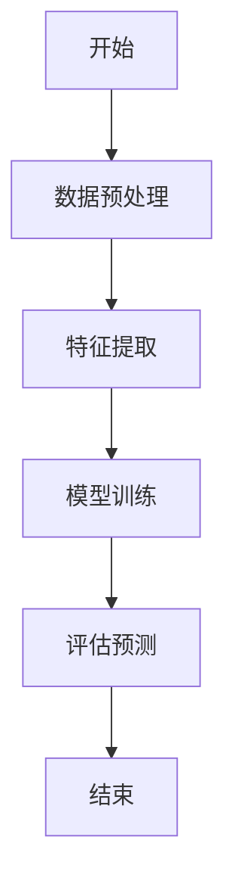
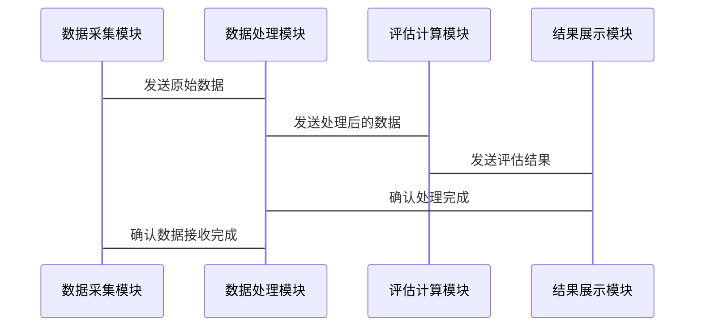

                 


# AI Agents在公司商业模式可持续性评估中的应用

> 关键词：AI代理，商业模式，可持续性评估，算法原理，系统架构

> 摘要：本文探讨了AI代理在公司商业模式可持续性评估中的应用，详细分析了AI代理的核心原理、商业模式的评估指标体系、算法的实现过程以及系统架构设计。通过实际案例，展示了如何利用AI代理提升商业模式的可持续性，并展望了未来的发展方向。

---

## 第1章: AI代理与公司商业模式概述

### 1.1 AI代理的基本概念

#### 1.1.1 AI代理的定义
AI代理（Artificial Intelligence Agents）是指能够感知环境、自主决策并采取行动的智能实体。它们能够通过传感器获取数据，利用算法进行分析，并执行任务以达到特定目标。

#### 1.1.2 AI代理的核心属性
- **自主性**：能够在没有外部干预的情况下独立运作。
- **反应性**：能够实时感知环境变化并做出反应。
- **学习能力**：通过数据和经验不断优化自身的决策能力。
- **协作性**：能够与其他代理或系统协同工作。

#### 1.1.3 AI代理与传统数据分析工具的区别
| 特性 | AI代理 | 传统数据分析工具 |
|------|---------|------------------|
| 自主性 | 高       | 低               |
| 反应性 | 高       | 低               |
| 学习能力 | 高       | 低               |
| 决策能力 | 强       | 弱               |

### 1.2 公司商业模式的定义与特点

#### 1.2.1 商业模式的定义
商业模式（Business Model）是指企业如何创造价值、传递价值和获取价值的基本逻辑。它包括客户价值主张、收入来源、核心资源和关键活动等方面。

#### 1.2.2 商业模式的关键要素
- **客户价值主张**：为客户提供的产品或服务的价值。
- **收入来源**：企业通过哪些途径获得收入。
- **核心资源**：企业成功运营所需的关键资源。
- **关键活动**：企业为实现价值创造所需的关键活动。

#### 1.2.3 可持续性商业模式的特征
- **经济可行性**：商业模式能够持续盈利。
- **社会价值**：对社会产生积极影响。
- **环境友好**：减少对环境的负面影响。

### 1.3 AI代理在商业模式评估中的作用

#### 1.3.1 AI代理在商业模式分析中的优势
- **高效性**：能够快速处理大量数据，提高评估效率。
- **准确性**：通过机器学习算法提高评估的准确性。
- **实时性**：能够实时监控商业模式的变化。

#### 1.3.2 AI代理如何提升商业模式的可持续性
- **优化资源配置**：通过数据分析优化资源分配，降低成本。
- **预测风险**：利用预测模型提前识别潜在风险。
- **动态调整**：根据实时数据动态调整商业模式。

#### 1.3.3 AI代理在商业模式优化中的应用场景
- **市场分析**：通过市场数据预测市场趋势，指导商业模式调整。
- **客户行为分析**：分析客户行为，优化客户价值主张。
- **竞争对手分析**：监控竞争对手的动态，制定竞争策略。

### 1.4 本章小结
本章介绍了AI代理的基本概念、商业模式的定义与特点，以及AI代理在商业模式评估中的作用。通过对比分析，展示了AI代理在提升商业模式可持续性方面的优势。

---

## 第2章: AI代理与商业模式可持续性评估的核心概念

### 2.1 AI代理的核心原理

#### 2.1.1 AI代理的基本工作流程
1. **数据采集**：通过传感器或API获取数据。
2. **数据处理**：对数据进行清洗、转换和分析。
3. **决策制定**：基于分析结果制定决策。
4. **执行行动**：根据决策执行任务。

#### 2.1.2 AI代理的决策机制
- **基于规则的决策**：根据预定义的规则进行决策。
- **基于机器学习的决策**：利用机器学习模型进行预测和决策。
- **基于知识图谱的决策**：通过知识图谱进行推理和决策。

#### 2.1.3 AI代理的学习与自适应能力
- **监督学习**：通过标注数据进行学习。
- **无监督学习**：通过无标签数据进行学习。
- **强化学习**：通过与环境互动进行学习。

### 2.2 商业模式可持续性评估的指标体系

#### 2.2.1 经济、社会、环境三重维度的评估
- **经济维度**：评估商业模式的盈利能力。
- **社会维度**：评估商业模式对社会的贡献。
- **环境维度**：评估商业模式对环境的影响。

#### 2.2.2 具体评估指标的定义与计算方法
| 指标 | 定义 | 计算方法 |
|------|------|----------|
| 净利润 | 利润总额减去成本 | 净利润 = 收入 - 成本 |
| 社会影响力 | 对社会的积极影响 | 社会影响力 = 创造的就业机会 + 社会责任投入 |
| 碳排放 | 对环境的影响 | 碳排放 = 生产过程中的温室气体排放量 |

#### 2.2.3 指标权重的确定方法
- **层次分析法（AHP）**：通过专家评分确定指标权重。
- **熵值法**：根据数据的离散程度确定权重。
- **主观赋权法**：根据经验或主观判断确定权重。

### 2.3 AI代理与商业模式可持续性评估的结合

#### 2.3.1 AI代理如何处理商业模式数据
- **数据清洗**：去除无效数据，填补缺失值。
- **特征提取**：提取关键特征用于评估。
- **数据建模**：利用机器学习模型进行预测和评估。

#### 2.3.2 AI代理在评估中的具体应用流程
1. **数据采集**：获取商业模式相关的数据。
2. **数据处理**：清洗和预处理数据。
3. **模型训练**：训练机器学习模型。
4. **评估预测**：利用模型进行可持续性评估。

#### 2.3.3 AI代理评估结果的解释与反馈
- **结果可视化**：通过图表展示评估结果。
- **反馈优化**：根据评估结果优化商业模式。

### 2.4 核心概念对比表格

#### 表2-1: AI代理与传统数据分析工具的对比
| 特性 | AI代理 | 传统数据分析工具 |
|------|---------|------------------|
| 数据处理能力 | 强 | 弱               |
| 自动学习能力 | 强 | 弱               |
| 决策能力 | 强 | 弱               |

### 2.5 ER实体关系图

#### 图2-1: 商业模式可持续性评估的ER实体关系图
```mermaid
erDiagram
    customer[客户] {
        customer_id : integer
        name : string
        industry : string
    }
    business_model[商业模式] {
        model_id : integer
        description : string
        sustainability_score : float
    }
    assessment_indicator[评估指标] {
        indicator_id : integer
        name : string
        weight : float
    }
    relationship(评估指标属于商业模式) {
        business_model --> assessment_indicator
        business_model --> customer
    }
```

### 2.6 本章小结
本章详细介绍了AI代理的核心原理和商业模式可持续性评估的指标体系，通过对比分析和ER实体关系图展示了AI代理在评估中的应用。

---

## 第3章: 商业模式可持续性评估的算法原理

### 3.1 算法原理概述

#### 3.1.1 评估算法的基本框架
1. **数据预处理**：清洗和转换数据。
2. **特征提取**：提取关键特征。
3. **模型训练**：训练机器学习模型。
4. **评估预测**：利用模型进行预测。

#### 3.1.2 算法的核心步骤
- **数据预处理**：去除无效数据，填补缺失值。
- **特征提取**：选择对评估影响较大的特征。
- **模型训练**：使用机器学习算法训练模型。
- **评估预测**：利用训练好的模型进行预测。

#### 3.1.3 算法的输入输出定义
- **输入**：商业模式相关的数据。
- **输出**：可持续性评估结果。

### 3.2 算法流程图

#### 图3-1: 商业模式可持续性评估算法的mermaid流程图


### 3.3 数学模型与公式

#### 3.3.1 综合评估指数公式
$$ C = \sum_{i=1}^{n} w_i x_i $$
其中，$C$ 是综合评估指数，$w_i$ 是指标权重，$x_i$ 是指标得分。

### 3.4 算法实现代码

#### 代码3-1: 评估算法的Python实现
```python
def calculate_sustainability(assessment_data):
    # 数据预处理
    processed_data = preprocess_data(assessment_data)
    # 特征提取
    features = extract_features(processed_data)
    # 模型训练
    model = train_model(features)
    # 评估预测
    result = model.predict(features)
    return result
```

### 3.5 本章小结
本章详细介绍了商业模式可持续性评估算法的原理和实现过程，展示了如何利用机器学习模型进行评估。

---

## 第4章: 系统架构与接口设计

### 4.1 系统功能模块设计

#### 4.1.1 数据采集模块
- **功能**：采集商业模式相关的数据。
- **输入**：API接口或其他数据源。
- **输出**：原始数据。

#### 4.1.2 数据处理模块
- **功能**：清洗和预处理数据。
- **输入**：原始数据。
- **输出**：处理后的数据。

#### 4.1.3 评估计算模块
- **功能**：利用算法进行可持续性评估。
- **输入**：处理后的数据。
- **输出**：评估结果。

#### 4.1.4 结果展示模块
- **功能**：展示评估结果。
- **输入**：评估结果。
- **输出**：可视化报告。

### 4.2 系统架构图

#### 图4-1: 系统架构的mermaid图


### 4.3 系统接口设计

#### 4.3.1 数据采集模块接口
- **输入接口**：API接口接收数据。
- **输出接口**：返回数据状态。

#### 4.3.2 评估计算模块接口
- **输入接口**：接收处理后的数据。
- **输出接口**：返回评估结果。

### 4.4 系统交互序列图

#### 图4-2: 系统交互的mermaid序列图


### 4.5 本章小结
本章详细设计了系统架构和接口，展示了各个模块之间的协作关系。

---

## 第5章: 项目实战与案例分析

### 5.1 项目环境安装

#### 5.1.1 安装Python环境
```bash
python --version
pip install --upgrade pip
```

#### 5.1.2 安装相关库
```bash
pip install numpy pandas scikit-learn matplotlib
```

### 5.2 系统核心实现源代码

#### 代码5-1: 数据采集模块
```python
import requests

def fetch_data(api_url):
    response = requests.get(api_url)
    return response.json()
```

#### 代码5-2: 数据处理模块
```python
import pandas as pd

def preprocess_data(data):
    df = pd.DataFrame(data)
    df.dropna(inplace=True)
    return df
```

#### 代码5-3: 评估计算模块
```python
from sklearn.ensemble import RandomForestRegressor

def train_model(features):
    model = RandomForestRegressor()
    model.fit(features)
    return model
```

#### 代码5-4: 结果展示模块
```python
import matplotlib.pyplot as plt

def visualize_results(results):
    plt.bar(range(len(results)), results)
    plt.show()
```

### 5.3 代码应用解读与分析

#### 5.3.1 数据采集模块解读
- **功能**：通过API接口获取数据。
- **实现细节**：使用requests库发送HTTP请求。

#### 5.3.2 数据处理模块解读
- **功能**：清洗和预处理数据。
- **实现细节**：使用pandas库进行数据清洗。

#### 5.3.3 评估计算模块解读
- **功能**：训练机器学习模型并进行预测。
- **实现细节**：使用RandomForestRegressor进行模型训练。

#### 5.3.4 结果展示模块解读
- **功能**：将评估结果可视化。
- **实现细节**：使用matplotlib库绘制图表。

### 5.4 实际案例分析

#### 5.4.1 案例背景
某公司希望优化其商业模式，提高可持续性。

#### 5.4.2 数据采集与处理
- **数据来源**：公司财务数据、客户反馈、市场数据。
- **数据清洗**：去除无效数据，填补缺失值。

#### 5.4.3 评估与优化
- **评估结果**：综合评估指数为0.85。
- **优化建议**：优化客户价值主张，降低生产成本。

### 5.5 项目小结
本章通过实际案例展示了如何利用AI代理进行商业模式可持续性评估，并提供了详细的代码实现和分析。

---

## 第6章: 总结与展望

### 6.1 本章总结
本文详细探讨了AI代理在公司商业模式可持续性评估中的应用，介绍了AI代理的基本原理、商业模式的评估指标体系、算法的实现过程以及系统架构设计。通过实际案例，展示了如何利用AI代理提升商业模式的可持续性。

### 6.2 未来展望
随着AI技术的不断发展，AI代理在商业模式可持续性评估中的应用将更加广泛。未来的研究方向包括：
- **更复杂的模型**：开发更复杂的机器学习模型。
- **多模态数据**：结合文本、图像等多种数据源进行评估。
- **实时评估**：实现商业模式的实时动态评估。

### 6.3 最佳实践Tips
- **数据质量**：确保数据的准确性和完整性。
- **模型选择**：根据具体情况选择合适的模型。
- **结果解释**：确保评估结果的可解释性。

### 6.4 本章小结
本文总结了AI代理在商业模式可持续性评估中的应用，并展望了未来的发展方向。

---

## 作者：AI天才研究院/AI Genius Institute & 禅与计算机程序设计艺术/Zen And The Art of Computer Programming

---

### 附录：相关工具与库

- **Python库**：numpy, pandas, scikit-learn, matplotlib
- **工具**：requests, mermaid, LaTeX

---

**全文完**

