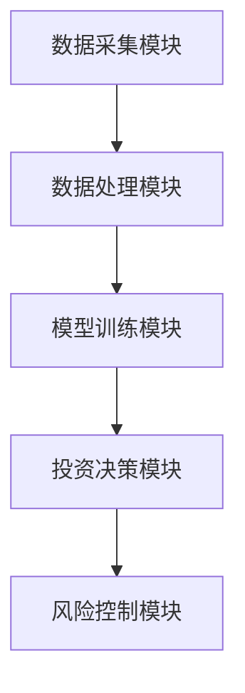
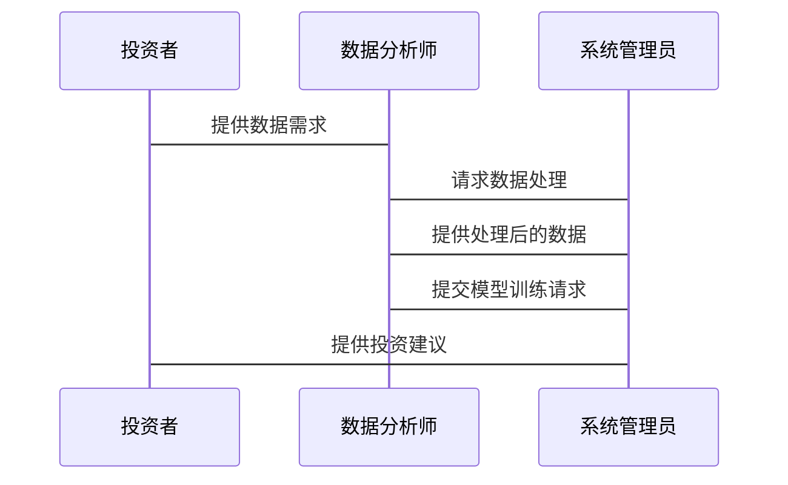

                 


# AI驱动的行业分析：多智能体系统在价值投资中的应用

**关键词**：AI驱动、行业分析、多智能体系统、价值投资、投资决策、系统架构、算法原理

**摘要**：  
本文探讨了AI驱动的行业分析在价值投资中的应用，重点分析了多智能体系统在投资决策中的潜力。文章首先介绍了AI驱动的行业分析的基本概念和多智能体系统的核心原理，然后深入分析了多智能体系统在价值投资中的应用优势，包括数据处理、投资策略优化和风险评估等方面。接着，文章详细讲解了多智能体系统的算法基础、系统架构设计以及实际项目实现。最后，文章总结了多智能体系统在价值投资中的优势与挑战，并展望了未来的研究方向。

---

# 第1章: AI驱动的行业分析概述

## 1.1 行业分析的背景与意义

### 1.1.1 行业分析的定义与作用
行业分析是指通过对行业内部结构、市场趋势、竞争格局和经济环境的系统性研究，为企业或投资者提供决策支持的过程。在传统行业分析中，分析师依赖经验、行业数据和市场研究来做出判断。然而，随着人工智能技术的发展，AI驱动的行业分析以其高效性、精准性和自动化特点，正在成为行业分析的重要工具。

### 1.1.2 AI在行业分析中的应用价值
AI技术可以通过自然语言处理（NLP）、机器学习（ML）和大数据分析等手段，帮助分析师快速处理大量非结构化数据，发现隐藏的行业趋势和潜在机会。例如，AI可以通过新闻、社交媒体和企业财报预测行业的未来走势，为投资者提供更精准的决策支持。

### 1.1.3 多智能体系统在行业分析中的潜力
多智能体系统是一种由多个智能体协作完成复杂任务的系统，每个智能体可以独立决策，同时通过通信和协作提高整体性能。在行业分析中，多智能体系统可以分别负责数据采集、趋势预测、风险评估等任务，从而提供更全面和精准的分析结果。

## 1.2 多智能体系统的核心概念

### 1.2.1 多智能体系统的定义与特点
多智能体系统（Multi-Agent System, MAS）是由多个智能体（Agent）组成的分布式系统，每个智能体都有自己的目标和决策能力。多智能体系统的特点包括分布式性、协作性、自主性和动态性。

### 1.2.2 多智能体系统与传统单智能体系统的对比
与传统单智能体系统相比，多智能体系统具有更强的协作能力和适应性。单智能体系统通常由一个中心化决策单元完成任务，而多智能体系统通过多个智能体的协作实现复杂任务。

### 1.2.3 多智能体系统在价值投资中的应用场景
在价值投资中，多智能体系统可以用于数据处理、投资策略优化、风险评估等领域。例如，一个智能体可以负责收集和分析行业数据，另一个负责预测市场趋势，第三个负责优化投资组合。

## 1.3 价值投资的基本原理

### 1.3.1 价值投资的定义与核心理念
价值投资是一种投资策略，强调以低于内在价值的价格买入优质资产。其核心理念是寻找市场低估的股票，并长期持有，等待其价值回归。

### 1.3.2 价值投资的关键要素分析
价值投资的关键要素包括企业基本面分析、行业趋势分析、竞争优势分析和估值分析。这些要素需要结合市场环境和企业财务数据进行综合判断。

### 1.3.3 价值投资与AI技术的结合点
AI技术可以通过大数据分析和机器学习模型，帮助投资者更准确地评估企业的内在价值和行业趋势。多智能体系统可以通过分工协作，提高分析效率和决策精度。

## 1.4 本章小结

### 1.4.1 行业分析与AI技术的结合
AI技术的应用使得行业分析更加高效和精准，特别是在数据处理和趋势预测方面具有显著优势。

### 1.4.2 多智能体系统在价值投资中的优势
多智能体系统通过分工协作，能够更全面地分析行业和企业信息，提供更精准的投资决策支持。

### 1.4.3 本书的核心内容框架
本书将从多智能体系统的原理、算法、架构设计等方面展开，结合实际案例分析，探讨多智能体系统在价值投资中的应用。

---

# 第2章: 多智能体系统的原理与架构

## 2.1 多智能体系统的组成与结构

### 2.1.1 多智能体系统的组成要素
多智能体系统由多个智能体、通信机制、协作协议和环境组成。每个智能体都有自己的目标和决策能力，通过通信机制与其他智能体协作。

### 2.1.2 多智能体系统的层次架构
多智能体系统的层次架构包括感知层、决策层、执行层和协作层。感知层负责数据采集，决策层负责策略制定，执行层负责具体操作，协作层负责通信和协作。

### 2.1.3 多智能体系统与分布式计算的关系
多智能体系统与分布式计算密切相关，但多智能体系统更强调智能体的自主性和协作性，而分布式计算更关注任务的分配和资源的利用。

## 2.2 多智能体系统的通信与协作

### 2.2.1 多智能体系统中的通信机制
多智能体系统中的通信机制包括消息传递、状态共享和事件通知。智能体之间通过通信机制交换信息，协调行动。

### 2.2.2 多智能体系统的协作策略
协作策略包括任务分配、目标协商和冲突解决。智能体需要通过协作策略实现共同目标。

### 2.2.3 多智能体系统中的冲突解决
在多智能体系统中，冲突可能来自资源竞争或目标冲突。通过协商和优化算法，可以有效解决冲突，提高系统效率。

## 2.3 多智能体系统的算法基础

### 2.3.1 基于强化学习的多智能体算法
强化学习是一种通过试错学习的算法，适用于多智能体系统的决策优化。例如，基于Q-learning的多智能体算法可以用于投资组合优化。

### 2.3.2 基于博弈论的多智能体决策
博弈论是研究策略选择和竞争关系的数学理论，适用于多智能体系统中的策略优化和竞争分析。

### 2.3.3 多智能体系统的优化算法
优化算法包括遗传算法、模拟退火和蚁群算法等，适用于多智能体系统的任务分配和资源优化。

## 2.4 本章小结

### 2.4.1 多智能体系统的原理总结
多智能体系统通过智能体的协作和优化算法，实现复杂任务的高效完成。

### 2.4.2 多智能体系统在价值投资中的应用潜力
多智能体系统可以通过分工协作，提高行业分析和投资决策的效率和精度。

### 2.4.3 下一章内容的铺垫
下一章将重点探讨多智能体系统在价值投资中的具体应用，包括数据处理、投资策略优化和风险评估。

---

# 第3章: 价值投资中的多智能体系统应用

## 3.1 价值投资中的数据处理

### 3.1.1 行业数据的获取与预处理
行业数据包括企业财务数据、市场数据和行业报告等。预处理包括数据清洗、特征提取和数据标准化。

### 3.1.2 数据特征的提取与分析
通过特征工程提取关键特征，例如市盈率、市净率和ROE等。分析特征之间的相关性，筛选出影响股价的关键因素。

### 3.1.3 数据的可视化与洞察
通过数据可视化工具，例如Matplotlib和Tableau，展示数据分布和趋势，帮助分析师发现潜在的投资机会。

## 3.2 多智能体系统在投资决策中的应用

### 3.2.1 多智能体系统的投资决策模型
多智能体系统可以分别负责数据分析、模型训练和策略制定。例如，一个智能体负责市场趋势预测，另一个负责企业基本面分析。

### 3.2.2 多智能体系统的投资组合优化
通过多智能体系统的协作，优化投资组合的风险收益比。例如，一个智能体负责风险评估，另一个负责收益预测。

### 3.2.3 多智能体系统的风险评估与控制
通过多智能体系统的实时监控和反馈机制，及时发现和应对市场风险。例如，智能体可以实时调整投资策略，避免重大损失。

## 3.3 多智能体系统的投资策略优化

### 3.3.1 基于多智能体系统的主动投资策略
主动投资策略强调及时调整投资组合，适应市场变化。多智能体系统可以通过实时数据和模型预测，优化投资策略。

### 3.3.2 基于多智能体系统的被动投资策略
被动投资策略强调长期持有优质资产，通过多智能体系统筛选出具有持续竞争优势的企业。

### 3.3.3 多智能体系统的动态调整机制
通过动态调整机制，多智能体系统可以根据市场变化和企业基本面，实时优化投资组合。

## 3.4 本章小结

### 3.4.1 多智能体系统在价值投资中的核心作用
多智能体系统通过分工协作，提高了数据处理和投资决策的效率和精度。

### 3.4.2 多智能体系统的优势与局限性
多智能体系统的优势包括高效性、协作性和适应性。其局限性包括复杂性和协作成本。

### 3.4.3 未来研究方向与改进空间
未来研究可以进一步优化多智能体系统的协作机制和算法，提高系统的效率和精度。

---

# 第4章: 系统架构设计与实现

## 4.1 问题场景介绍

### 4.1.1 系统目标
本系统旨在通过多智能体技术，实现价值投资中的数据处理、投资决策和风险控制。

### 4.1.2 项目介绍
本项目是一个基于多智能体系统的价值投资分析平台，旨在帮助投资者制定更科学的投资策略。

## 4.2 系统功能设计

### 4.2.1 功能模块划分
系统功能模块包括数据采集、数据处理、模型训练、投资决策和风险控制。

### 4.2.2 系统功能流程
数据采集模块负责收集行业数据，数据处理模块进行清洗和特征提取，模型训练模块建立预测模型，投资决策模块制定投资策略，风险控制模块实时监控市场风险。

### 4.2.3 功能模块的ER实体关系图

```mermaid
erDiagram
    actor 投资者
    actor 市场数据提供者
    actor 数据分析师
    actor 系统管理员
    database 行业数据
    database 投资组合
    database 风险评估
    投资者 --> 行业数据 : 查询
    投资者 --> 投资组合 : 调整
    投资者 --> 风险评估 : 监控
    数据分析师 --> 行业数据 : 处理
    数据分析师 --> 投资组合 : 优化
    数据分析师 --> 风险评估 : 分析
    系统管理员 --> 行业数据 : 管理
    系统管理员 --> 投资组合 : 管理
    系统管理员 --> 风险评估 : 管理
```

## 4.3 系统架构设计

### 4.3.1 系统架构图



### 4.3.2 系统接口设计
系统接口包括数据输入接口、模型训练接口和投资决策接口。数据输入接口接收行业数据，模型训练接口训练预测模型，投资决策接口制定投资策略。

### 4.3.3 系统交互流程图



## 4.4 本章小结

### 4.4.1 系统架构设计的核心内容
系统架构设计包括功能模块划分、架构图和交互流程图。通过模块化设计，提高了系统的可维护性和扩展性。

### 4.4.2 系统实现的关键点
系统实现的关键点包括数据采集、数据处理、模型训练和投资决策。每个模块都需要高效协作，确保系统的整体性能。

### 4.4.3 未来优化方向
未来优化方向包括优化系统架构、提高系统的可扩展性和增强系统的安全性。

---

# 第5章: 项目实战与案例分析

## 5.1 环境安装

### 5.1.1 系统环境要求
系统运行环境包括Python 3.8及以上版本，TensorFlow 2.0及以上版本，以及相关数据处理库（Pandas、NumPy）。

### 5.1.2 安装依赖库
安装依赖库包括：
```bash
pip install numpy pandas tensorflow matplotlib
```

## 5.2 系统核心实现源代码

### 5.2.1 数据采集模块
```python
import pandas as pd
import requests

def fetch_data(ticker):
    url = f"https://api.example.com/stock/{ticker}"
    response = requests.get(url)
    data = response.json()
    return pd.DataFrame(data)
```

### 5.2.2 数据处理模块
```python
import pandas as pd
from sklearn.preprocessing import StandardScaler

def preprocess_data(df):
    # 假设df包含股票数据
    df = df[['open', 'high', 'low', 'close', 'volume']]
    scaler = StandardScaler()
    df_scaled = scaler.fit_transform(df)
    return df_scaled
```

### 5.2.3 模型训练模块
```python
import tensorflow as tf
from tensorflow.keras import layers

def build_model(input_shape):
    model = tf.keras.Sequential()
    model.add(layers.Dense(64, activation='relu', input_shape=input_shape))
    model.add(layers.Dense(32, activation='relu'))
    model.add(layers.Dense(1, activation='sigmoid'))
    model.compile(optimizer='adam', loss='binary_crossentropy', metrics=['accuracy'])
    return model
```

### 5.2.4 投资决策模块
```python
import numpy as np
import pandas as pd

def investment_strategy(predictions, threshold=0.5):
    decisions = []
    for prob in predictions:
        if prob > threshold:
            decisions.append('buy')
        else:
            decisions.append('sell')
    return pd.Series(decisions)
```

## 5.3 代码应用解读与分析

### 5.3.1 数据采集模块
数据采集模块通过API获取股票数据，返回数据框。该模块需要确保数据的准确性和完整性。

### 5.3.2 数据处理模块
数据处理模块对数据进行标准化处理，为后续的模型训练提供高质量的数据输入。

### 5.3.3 模型训练模块
模型训练模块构建了一个简单的神经网络模型，用于预测股票价格走势。该模型可以通过训练数据进行优化，提高预测准确率。

### 5.3.4 投资决策模块
投资决策模块根据模型预测结果，制定买卖决策。通过阈值设置，可以调整决策的保守性和激进性。

## 5.4 实际案例分析

### 5.4.1 案例背景
假设我们有一个包含多只股票的行业数据集，目标是通过多智能体系统筛选出具有投资价值的股票。

### 5.4.2 数据处理与分析
通过对行业数据的预处理和特征分析，识别出市盈率低、ROE高的优质企业。

### 5.4.3 模型训练与优化
通过神经网络模型预测股票价格走势，优化投资策略。

### 5.4.4 投资组合优化
根据模型预测结果，制定投资组合，分散投资风险。

## 5.5 本章小结

### 5.5.1 项目实现的核心内容
项目实现了数据采集、数据处理、模型训练和投资决策模块，展示了多智能体系统在价值投资中的应用。

### 5.5.2 代码实现的关键点
代码实现的关键点包括数据处理、模型训练和投资决策。每个模块都需要高效协作，确保系统的整体性能。

### 5.5.3 实际案例的分析与启示
实际案例分析表明，多智能体系统能够有效提高投资决策的效率和精度，为投资者提供科学的决策支持。

---

# 第6章: 总结与展望

## 6.1 总结

### 6.1.1 多智能体系统的原理总结
多智能体系统通过智能体的协作和优化算法，实现复杂任务的高效完成。

### 6.1.2 多智能体系统在价值投资中的应用优势
多智能体系统通过分工协作，提高了数据处理和投资决策的效率和精度。

### 6.1.3 本书的核心内容回顾
本书系统地介绍了AI驱动的行业分析和多智能体系统在价值投资中的应用，通过理论分析和实际案例，展示了多智能体系统的潜力和优势。

## 6.2 展望

### 6.2.1 多智能体系统的未来发展趋势
未来，多智能体系统将更加智能化和协作化，通过深度学习和强化学习，进一步提高系统的决策能力和适应性。

### 6.2.2 多智能体系统在金融领域的应用前景
随着AI技术的不断发展，多智能体系统在金融领域的应用前景广阔，特别是在智能投资、风险管理和社会化金融方面具有重要潜力。

### 6.2.3 价值投资与AI技术的深度融合
价值投资与AI技术的深度融合将推动投资决策的科学化和智能化，为投资者提供更精准的决策支持。

## 6.3 最佳实践 tips

### 6.3.1 小结
多智能体系统在价值投资中的应用需要结合实际需求，选择合适的算法和系统架构，确保系统的高效性和准确性。

### 6.3.2 注意事项
在实际应用中，需要注意数据质量、模型优化和系统安全，确保系统的稳定性和可靠性。

### 6.3.3 拓展阅读
推荐读者阅读相关领域的经典文献，深入了解多智能体系统和价值投资的理论与实践。

---

# 作者：AI天才研究院 & 禅与计算机程序设计艺术

---

以上是《AI驱动的行业分析：多智能体系统在价值投资中的应用》的技术博客文章的完整目录和内容概要。希望这篇文章能够为读者提供清晰的思路和详细的指导，帮助他们理解多智能体系统在价值投资中的应用及其潜在的商业价值。

