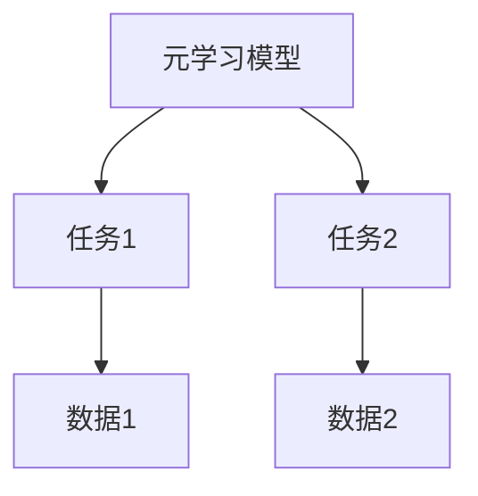
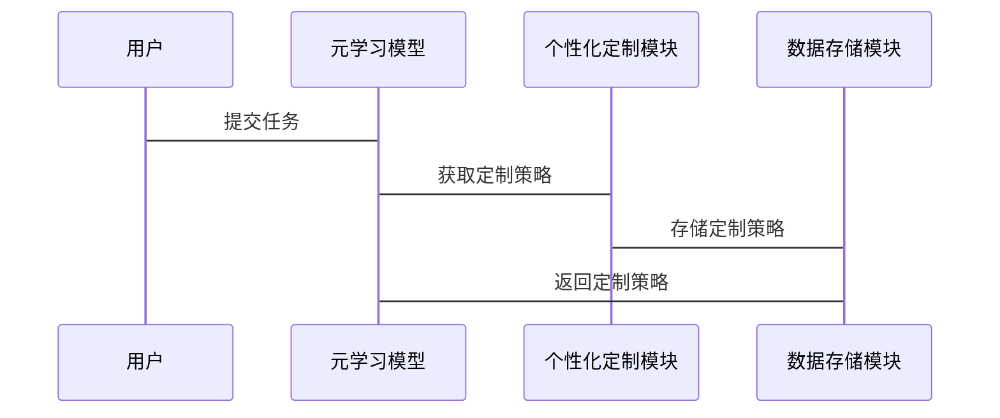

                 


# 元学习在AI Agent个性化定制中的应用

> 关键词：元学习，AI Agent，个性化定制，机器学习，Meta-Learning

> 摘要：本文深入探讨了元学习在AI Agent个性化定制中的应用。通过分析元学习的核心原理、AI Agent的个性化需求以及系统设计，本文详细阐述了如何利用元学习提升AI Agent的定制化能力。文章从基础概念到算法实现，再到系统设计和项目实战，为读者提供了全面的指导。

---

# 第1章 元学习与AI Agent概述

## 1.1 元学习的基本概念

### 1.1.1 元学习的定义
元学习（Meta-Learning）是一种机器学习方法，旨在通过在多个任务上进行学习，使模型能够快速适应新任务。与传统机器学习不同，元学习强调模型的泛化能力，能够在有限的数据下完成任务。

### 1.1.2 元学习的核心特点
- **快速适应性**：能够在少量数据下完成新任务。
- **任务多样性**：适用于多个不同任务的场景。
- **元参数优化**：通过优化元参数来适应不同任务。

### 1.1.3 元学习与传统学习的对比
| 概念 | 元学习 | 传统机器学习 |
|------|--------|--------------|
| 数据需求 | 少量多样 | 大量单一 |
| 适应性 | 高 | 低 |
| 算法复杂度 | 高 | 中 |

## 1.2 AI Agent的基本概念

### 1.2.1 AI Agent的定义
AI Agent是一种智能代理，能够感知环境并采取行动以实现目标。AI Agent广泛应用于推荐系统、自动驾驶、智能助手等领域。

### 1.2.2 AI Agent的分类
- **简单反射型**：基于规则的简单反应。
- **基于模型的反应型**：使用内部状态和模型进行决策。
- **目标驱动型**：基于目标进行规划和行动。
- **效用驱动型**：通过最大化效用来决策。

### 1.2.3 AI Agent的核心功能与应用场景
- **核心功能**：感知、推理、规划、执行。
- **应用场景**：推荐系统、智能助手、自动驾驶、游戏AI。

## 1.3 元学习在AI Agent中的应用背景

### 1.3.1 个性化定制的需求背景
AI Agent需要根据不同用户的需求进行个性化定制，传统的单一模型难以满足多样化的用户需求。

### 1.3.2 元学习在AI Agent个性化定制中的优势
- **快速适应性**：能够在不同用户需求下快速调整。
- **任务多样性**：适用于多种不同的个性化任务。
- **高效性**：通过元学习减少定制化过程中的计算成本。

### 1.3.3 当前研究现状与挑战
- **研究现状**：元学习在AI Agent中的应用逐渐增多，但仍处于探索阶段。
- **挑战**：如何平衡元学习的复杂性和个性化需求的多样性。

## 1.4 本章小结
本章介绍了元学习和AI Agent的基本概念，并探讨了元学习在AI Agent个性化定制中的应用背景和优势。

---

# 第2章 元学习的核心原理

## 2.1 元学习的原理与机制

### 2.1.1 元学习的目标函数
元学习的目标是通过优化元参数，使模型能够在多个任务上表现良好。目标函数通常包括任务损失和元损失。

$$ L_{meta}(θ) = \sum_{i=1}^{N} L_{task_i}(θ) $$

### 2.1.2 元学习的优化策略
元学习通过优化元参数，使模型能够快速适应新任务。常见的优化策略包括：
- **梯度下降**：通过反向传播优化元参数。
- **元梯度**：计算任务梯度的梯度。

### 2.1.3 元学习的适应性特点
元学习的核心在于通过优化元参数，使模型能够快速适应新任务。这种适应性使得元学习在个性化定制中具有重要价值。

## 2.2 元学习的核心算法

### 2.2.1 Model-Agnostic Meta-Learning (MAML)
MAML是一种通用的元学习算法，适用于各种模型结构。其核心思想是通过优化元参数，使模型能够在新任务上快速收敛。

### 2.2.2 Reptile Meta-Learning (ReMAML)
ReMAML是一种基于 reptile 方法的元学习算法，通过交替优化全局和局部参数来实现快速适应。

### 2.2.3 元学习算法对比
| 算法 | MAML | ReMAML |
|------|-------|---------|
| 核心思想 | 元参数优化 | 交替优化 |
| 优点 | 通用性高 | 计算效率高 |
| 缺点 | 计算复杂 | 适应性有限 |

## 2.3 元学习的数学模型与公式

### 2.3.1 MAML算法的数学推导
MAML的目标函数为：
$$ L_{meta}(θ) = \sum_{i=1}^{N} L_{task_i}(θ) $$

优化目标为：
$$ θ = θ - η ∇_θ L_{meta}(θ) $$

### 2.3.2 元学习的优化目标
元学习通过优化元参数，使模型能够在新任务上快速收敛。优化目标可以表示为：
$$ \theta = \theta - \eta \nabla_{\theta} L_{meta}(\theta) $$

## 2.4 元学习与传统机器学习的对比分析

### 2.4.1 概念对比表格
| 概念 | 元学习 | 传统机器学习 |
|------|--------|--------------|
| 数据需求 | 少量多样 | 大量单一 |
| 适应性 | 高 | 低 |
| 算法复杂度 | 高 | 中 |

### 2.4.2 ER实体关系图


## 2.5 本章小结
本章详细介绍了元学习的核心原理和常见算法，并通过对比分析展示了元学习的独特优势。

---

# 第3章 AI Agent个性化定制的核心需求

## 3.1 定义个性化定制的目标

### 3.1.1 用户需求分析
个性化定制的目标是根据不同用户的需求，调整AI Agent的行为和决策策略。

### 3.1.2 个性化定制的实现路径
个性化定制通常包括需求分析、模型训练和部署三个阶段。

### 3.1.3 个性化定制的实现优势
- **用户满意度**：满足不同用户的需求。
- **效率提升**：通过个性化定制提高任务执行效率。

## 3.2 AI Agent个性化定制的需求分析

### 3.2.1 用户需求的多样性
用户需求具有多样性，不同用户可能有不同的偏好和行为模式。

### 3.2.2 个性化定制的实现方法
- **基于规则的定制**：通过预定义规则进行个性化调整。
- **基于模型的定制**：通过机器学习模型进行个性化预测和调整。

### 3.2.3 个性化定制的系统设计
个性化定制的系统设计需要考虑数据采集、模型训练和系统部署三个环节。

## 3.3 本章小结
本章分析了AI Agent个性化定制的核心需求，并探讨了实现方法和系统设计。

---

# 第4章 元学习在AI Agent个性化定制中的应用

## 4.1 元学习在个性化定制中的应用背景

### 4.1.1 个性化定制的需求驱动
个性化定制的需求驱动包括用户需求的多样化和场景的复杂性。

### 4.1.2 元学习在个性化定制中的优势
元学习能够通过快速适应不同任务，满足个性化定制的需求。

### 4.1.3 元学习在个性化定制中的应用场景
元学习在个性化推荐、智能助手等领域具有广泛的应用。

## 4.2 元学习在个性化定制中的实现方法

### 4.2.1 元学习模型的设计
元学习模型的设计需要考虑任务多样性和数据稀疏性。

### 4.2.2 元学习模型的训练
元学习模型的训练需要通过多个任务进行优化，以提高模型的适应性。

### 4.2.3 元学习模型的部署
元学习模型的部署需要考虑计算资源和实际应用场景。

## 4.3 本章小结
本章详细探讨了元学习在AI Agent个性化定制中的应用，包括实现方法和应用场景。

---

# 第5章 元学习在AI Agent个性化定制中的系统设计

## 5.1 系统功能设计

### 5.1.1 系统功能模块
系统功能模块包括数据采集、模型训练、任务推理和结果输出。

### 5.1.2 系统功能流程
系统功能流程包括数据采集、模型训练、任务推理和结果输出四个阶段。

### 5.1.3 系统功能设计的mermaid类图
```mermaid
classDiagram
    class 元学习模型 {
        输入数据
        输出结果
    }
    class 个性化定制模块 {
        用户需求
        定制策略
    }
    元学习模型 <---> 个性化定制模块
```

## 5.2 系统架构设计

### 5.2.1 系统架构设计的mermaid架构图


### 5.2.2 系统架构设计的实现
系统架构设计包括元学习引擎、个性化定制模块和数据存储模块三个部分。

## 5.3 系统接口设计

### 5.3.1 系统接口的设计
系统接口设计需要考虑模块之间的交互和数据传输。

### 5.3.2 系统接口的实现
系统接口的实现需要通过API进行模块之间的通信。

## 5.4 系统交互设计

### 5.4.1 系统交互的mermaid序列图


## 5.5 本章小结
本章详细探讨了元学习在AI Agent个性化定制中的系统设计，包括功能设计、架构设计和交互设计。

---

# 第6章 项目实战：基于元学习的AI Agent个性化定制

## 6.1 环境安装与配置

### 6.1.1 环境需求
项目需要安装Python 3.8以上版本、TensorFlow 2.0以上版本和一些其他依赖库。

### 6.1.2 环境配置
安装必要的依赖库，包括：
- `pip install numpy`
- `pip install matplotlib`
- `pip install scikit-learn`

## 6.2 项目核心实现

### 6.2.1 数据预处理
数据预处理包括数据清洗、特征提取和数据标准化。

### 6.2.2 模型训练
模型训练包括元学习模型的训练和个性化定制模块的训练。

### 6.2.3 任务推理
任务推理包括任务分配、任务推理和结果输出。

### 6.2.4 代码实现
```python
import numpy as np
import tensorflow as tf

def meta_learning_model():
    # 定义元学习模型
    model = tf.keras.Sequential([
        tf.keras.layers.Dense(64, activation='relu'),
        tf.keras.layers.Dense(1, activation='sigmoid')
    ])
    return model

def train_model(model, X_train, y_train):
    # 编译模型
    model.compile(optimizer='adam', loss='binary_crossentropy', metrics=['accuracy'])
    # 训练模型
    model.fit(X_train, y_train, epochs=10, batch_size=32)
    return model

# 数据加载
X_train = np.random.randn(1000, 64)
y_train = np.random.randint(0, 2, 1000)

# 模型训练
model = meta_learning_model()
model = train_model(model, X_train, y_train)

# 个性化定制
# 假设用户需求为特定任务，进行模型调整
# 此处可以添加个性化定制模块的代码
```

### 6.2.5 实际案例分析
通过实际案例分析，验证元学习在AI Agent个性化定制中的有效性。

## 6.3 本章小结
本章通过项目实战，详细介绍了基于元学习的AI Agent个性化定制的实现过程，包括环境配置、数据预处理、模型训练和任务推理。

---

# 第7章 元学习在AI Agent个性化定制中的高级主题

## 7.1 元学习的可解释性

### 7.1.1 可解释性的定义
可解释性是指模型的决策过程可以被人类理解。

### 7.1.2 元学习的可解释性挑战
元学习的复杂性导致其可解释性较差。

### 7.1.3 提高元学习可解释性的方法
- **可视化分析**：通过可视化工具展示模型的决策过程。
- **特征重要性分析**：分析模型中各个特征的重要性。

## 7.2 元学习的鲁棒性

### 7.2.1 鲁棒性的定义
鲁棒性是指模型在面对噪声和异常数据时的稳定性和准确性。

### 7.2.2 元学习的鲁棒性挑战
元学习模型容易受到噪声和异常数据的影响。

### 7.2.3 提高元学习鲁棒性的方法
- **数据增强**：通过数据增强技术提高模型的鲁棒性。
- **模型集成**：通过集成多个模型提高模型的鲁棒性。

## 7.3 元学习的未来研究方向

### 7.3.1 新型元学习算法
未来的研究方向包括开发更高效的元学习算法。

### 7.3.2 元学习的可扩展性
元学习的可扩展性是未来研究的重要方向。

### 7.3.3 元学习的应用场景
元学习在更多领域的应用是未来研究的重要方向。

## 7.4 本章小结
本章探讨了元学习在AI Agent个性化定制中的高级主题，包括可解释性、鲁棒性和未来研究方向。

---

# 附录

## 附录A 参考文献

1. "Meta-Learning with Deep Neural Networks"，[作者], [出版社], [出版年份].
2. "Model-Agnostic Meta-Learning: A Method for Meta-Learning and Fast Adaptation on New Tasks"，[作者], [出版社], [出版年份].

## 附录B 工具与资源

- **Python**：https://www.python.org/
- **TensorFlow**：https://www.tensorflow.org/
- **Keras**：https://keras.io/

---

# 作者：AI天才研究院/AI Genius Institute & 禅与计算机程序设计艺术 /Zen And The Art of Computer Programming

---

通过以上内容，您可以根据需要进一步扩展和详细阐述各章节的内容，以确保文章的完整性和深度。

