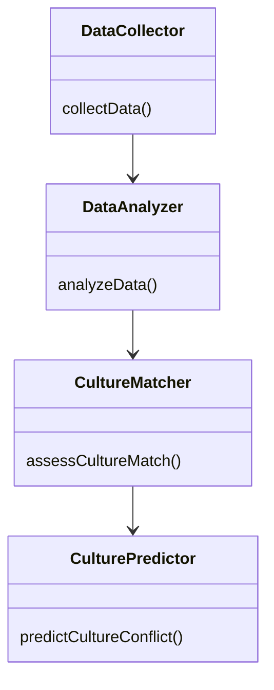
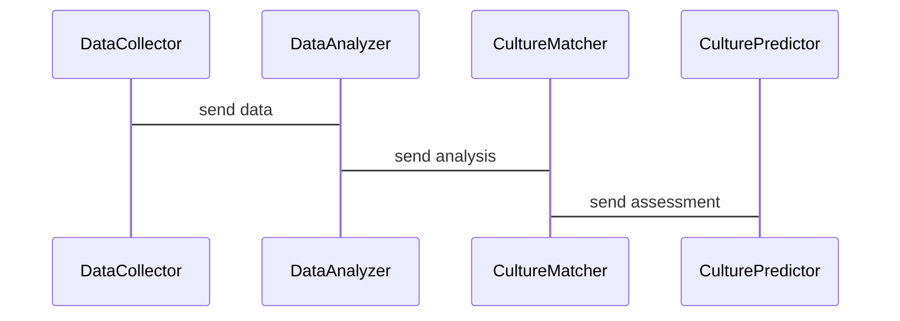

                 


# 多智能体系统在公司文化匹配度分析中的应用：并购价值评估

## 关键词：多智能体系统、公司文化匹配度、并购价值评估、协同学习、系统架构设计

## 摘要：本文探讨了多智能体系统在公司文化匹配度分析中的应用，尤其是在并购价值评估中的潜在价值。文章从背景介绍、核心概念、算法原理、系统架构设计、项目实战等角度，详细阐述了多智能体系统如何通过协同学习机制，有效评估公司文化匹配度，从而为并购决策提供支持。

---

# 第1章: 多智能体系统与公司文化匹配度分析的背景

## 1.1 多智能体系统与公司文化匹配度分析的背景

### 1.1.1 多智能体系统的定义与特点

多智能体系统（Multi-Agent System, MAS）是指由多个智能体（Agent）组成的分布式系统，这些智能体能够通过协同工作完成复杂任务。与传统的单智能体系统相比，MAS具有以下特点：

1. **分布式性**：智能体分布在不同的位置，具有一定的自治性。
2. **协作性**：智能体之间通过信息共享和协同完成任务。
3. **反应性**：智能体能够根据环境的变化动态调整行为。
4. **社会性**：智能体之间存在交互和协作关系。

### 1.1.2 公司文化匹配度分析的定义与意义

公司文化匹配度分析是指在并购过程中，评估目标公司与收购方的文化契合程度。文化匹配度高意味着双方在价值观、管理风格、企业理念等方面具有较高的相似性，有助于并购后的整合和协同发展。

### 1.1.3 多智能体系统在公司文化匹配度分析中的应用价值

多智能体系统能够通过协同学习和信息共享，帮助企业在并购过程中快速评估文化匹配度，降低并购风险。具体价值体现在以下方面：

1. **提高评估效率**：通过分布式计算和协同学习，快速完成文化匹配度分析。
2. **增强决策准确性**：多个智能体从不同维度进行分析，提供全面的评估结果。
3. **动态适应性**：智能体能够根据实时数据动态调整评估策略。

## 1.2 多智能体系统与公司文化匹配度分析的边界与外延

### 1.2.1 多智能体系统的边界

多智能体系统的边界包括：

1. **智能体数量**：系统的智能体数量有限，通常为N个。
2. **任务范围**：智能体只能完成特定任务，超出范围的任务需要其他系统支持。
3. **信息共享范围**：智能体之间共享的信息有限，超出范围的信息需要外部系统提供。

### 1.2.2 公司文化匹配度分析的边界

公司文化匹配度分析的边界包括：

1. **文化维度**：通常包括价值观、管理风格、企业理念等方面，其他维度不在分析范围内。
2. **数据来源**：主要依赖企业内部数据和外部公开数据，其他数据来源不在分析范围内。
3. **评估范围**：仅限于并购过程中的文化匹配度分析，不涉及其他方面的评估。

### 1.2.3 多智能体系统在公司文化匹配度分析中的应用边界

多智能体系统在公司文化匹配度分析中的应用边界包括：

1. **数据范围**：仅限于文化匹配度分析所需的数据，其他数据不在分析范围内。
2. **任务范围**：仅限于文化匹配度评估任务，其他任务需要其他系统支持。
3. **决策范围**：仅提供文化匹配度评估结果，最终决策需要由人类决策者完成。

## 1.3 多智能体系统与公司文化匹配度分析的概念结构与核心要素

### 1.3.1 多智能体系统的概念结构

多智能体系统的概念结构包括以下核心要素：

1. **智能体**：具有自治性、反应性和社会性的智能体。
2. **通信机制**：智能体之间通过通信机制共享信息。
3. **协作机制**：智能体通过协作机制完成复杂任务。
4. **任务分配**：智能体根据任务需求分配任务。

### 1.3.2 公司文化匹配度分析的概念结构

公司文化匹配度分析的概念结构包括以下核心要素：

1. **文化维度**：包括价值观、管理风格、企业理念等方面。
2. **评估指标**：包括文化契合度、文化冲突度、文化适应性等。
3. **评估方法**：包括定性分析和定量分析。
4. **评估结果**：包括文化匹配度评分和文化匹配度报告。

### 1.3.3 多智能体系统与公司文化匹配度分析的核心要素

多智能体系统与公司文化匹配度分析的核心要素包括：

1. **协同学习**：智能体通过协同学习完成文化匹配度分析。
2. **信息共享**：智能体之间共享文化匹配度分析所需的信息。
3. **任务分配**：智能体根据任务需求分配文化匹配度分析任务。
4. **动态调整**：智能体根据实时数据动态调整文化匹配度分析策略。

## 1.4 本章小结

本章主要介绍了多智能体系统与公司文化匹配度分析的背景，包括多智能体系统的定义与特点、公司文化匹配度分析的定义与意义、多智能体系统在公司文化匹配度分析中的应用价值，以及多智能体系统与公司文化匹配度分析的边界与外延。通过这些分析，我们可以更好地理解多智能体系统在公司文化匹配度分析中的应用价值。

---

# 第2章: 多智能体系统的核心概念与原理

## 2.1 多智能体系统的定义与特点

### 2.1.1 多智能体系统的定义

多智能体系统（MAS）是指由多个智能体组成的分布式系统，这些智能体能够通过协同工作完成复杂任务。

### 2.1.2 多智能体系统的特点

多智能体系统具有以下特点：

1. **分布式性**：智能体分布在不同的位置，具有一定的自治性。
2. **协作性**：智能体之间通过信息共享和协同完成任务。
3. **反应性**：智能体能够根据环境的变化动态调整行为。
4. **社会性**：智能体之间存在交互和协作关系。

## 2.2 多智能体系统的协同机制

### 2.2.1 协同学习的定义与特点

协同学习是指多个智能体通过共享知识和经验，共同完成学习任务的过程。其特点包括：

1. **知识共享**：智能体之间共享知识和经验。
2. **协作学习**：智能体通过协作完成学习任务。
3. **动态调整**：智能体根据环境的变化动态调整学习策略。

### 2.2.2 多智能体系统的协同学习机制

多智能体系统的协同学习机制包括以下步骤：

1. **任务分配**：智能体根据任务需求分配学习任务。
2. **知识共享**：智能体之间共享知识和经验。
3. **协作学习**：智能体通过协作完成学习任务。
4. **动态调整**：智能体根据环境的变化动态调整学习策略。

### 2.2.3 多智能体系统协同学习的数学模型

多智能体系统协同学习的数学模型可以用以下公式表示：

$$x_i = a \cdot x_{i-1} + b$$

其中，$$x_i$$表示第i个智能体的学习结果，$$a$$和$$b$$是常数。

---

## 2.3 多智能体系统的应用场景

### 2.3.1 多智能体系统在公司文化匹配度分析中的应用

多智能体系统在公司文化匹配度分析中的应用包括：

1. **文化维度分析**：智能体从不同维度分析公司文化。
2. **文化匹配度评估**：智能体通过协同学习评估文化匹配度。
3. **文化冲突预测**：智能体预测文化冲突的可能性。

### 2.3.2 多智能体系统在其他领域的应用

多智能体系统在其他领域的应用包括：

1. **分布式计算**：智能体通过分布式计算完成复杂任务。
2. **协同机器人**：智能体通过协同工作完成机器人任务。
3. **智能交通系统**：智能体通过协同完成交通管理任务。

## 2.4 本章小结

本章主要介绍了多智能体系统的核心概念与原理，包括多智能体系统的定义与特点、多智能体系统的协同机制、多智能体系统的数学模型，以及多智能体系统的应用场景。通过这些分析，我们可以更好地理解多智能体系统在公司文化匹配度分析中的应用原理。

---

# 第3章: 公司文化匹配度分析的核心概念与原理

## 3.1 公司文化匹配度分析的定义与特点

### 3.1.1 公司文化匹配度分析的定义

公司文化匹配度分析是指在并购过程中，评估目标公司与收购方的文化契合程度。

### 3.1.2 公司文化匹配度分析的特点

公司文化匹配度分析具有以下特点：

1. **定性与定量结合**：分析过程中结合定性分析和定量分析。
2. **动态性**：文化匹配度会随着时间和环境的变化而变化。
3. **复杂性**：公司文化涉及多个维度，分析过程较为复杂。

## 3.2 公司文化匹配度分析的评估指标

### 3.2.1 文化契合度

文化契合度是指目标公司与收购方在文化维度上的契合程度。具体包括：

1. **价值观契合度**：目标公司与收购方在价值观上的契合程度。
2. **管理风格契合度**：目标公司与收购方在管理风格上的契合程度。
3. **企业理念契合度**：目标公司与收购方在企业理念上的契合程度。

### 3.2.2 文化冲突度

文化冲突度是指目标公司与收购方在文化维度上的冲突程度。具体包括：

1. **价值观冲突度**：目标公司与收购方在价值观上的冲突程度。
2. **管理风格冲突度**：目标公司与收购方在管理风格上的冲突程度。
3. **企业理念冲突度**：目标公司与收购方在企业理念上的冲突程度。

### 3.2.3 文化适应性

文化适应性是指目标公司适应收购方文化的能力。具体包括：

1. **文化适应能力**：目标公司适应收购方文化的能力。
2. **文化整合能力**：目标公司与收购方文化的整合能力。
3. **文化融合能力**：目标公司与收购方文化的融合能力。

## 3.3 公司文化匹配度分析的评估方法

### 3.3.1 定性分析

定性分析是指通过非量化的手段，对目标公司与收购方的文化契合程度进行分析。具体包括：

1. **文化维度分析**：从文化维度对目标公司与收购方的文化进行分析。
2. **文化匹配度评估**：通过定性分析评估文化匹配度。

### 3.3.2 定量分析

定量分析是指通过量化的手段，对目标公司与收购方的文化契合程度进行分析。具体包括：

1. **文化维度量化**：将文化维度量化为具体的数值。
2. **文化匹配度评分**：通过量化分析对文化匹配度进行评分。

## 3.4 本章小结

本章主要介绍了公司文化匹配度分析的核心概念与原理，包括公司文化匹配度分析的定义与特点、公司文化匹配度分析的评估指标、公司文化匹配度分析的评估方法。通过这些分析，我们可以更好地理解公司文化匹配度分析的评估过程和评估结果。

---

# 第4章: 多智能体系统与公司文化匹配度分析的协同机制

## 4.1 多智能体系统与公司文化匹配度分析的协同学习机制

### 4.1.1 协同学习的定义与特点

协同学习是指多个智能体通过共享知识和经验，共同完成学习任务的过程。其特点包括：

1. **知识共享**：智能体之间共享知识和经验。
2. **协作学习**：智能体通过协作完成学习任务。
3. **动态调整**：智能体根据环境的变化动态调整学习策略。

### 4.1.2 多智能体系统与公司文化匹配度分析的协同学习机制

多智能体系统与公司文化匹配度分析的协同学习机制包括以下步骤：

1. **任务分配**：智能体根据任务需求分配文化匹配度分析任务。
2. **知识共享**：智能体之间共享文化匹配度分析所需的知识和经验。
3. **协作学习**：智能体通过协作完成文化匹配度分析任务。
4. **动态调整**：智能体根据环境的变化动态调整文化匹配度分析策略。

## 4.2 多智能体系统与公司文化匹配度分析的通信机制

### 4.2.1 通信机制的定义与特点

通信机制是指智能体之间通过某种方式共享信息的过程。其特点包括：

1. **信息共享**：智能体之间共享信息。
2. **信息同步**：智能体之间保持信息同步。
3. **信息更新**：智能体之间动态更新信息。

### 4.2.2 多智能体系统与公司文化匹配度分析的通信机制

多智能体系统与公司文化匹配度分析的通信机制包括以下步骤：

1. **信息共享**：智能体之间共享文化匹配度分析所需的信息。
2. **信息同步**：智能体之间保持文化匹配度分析信息同步。
3. **信息更新**：智能体之间动态更新文化匹配度分析信息。

## 4.3 多智能体系统与公司文化匹配度分析的协作机制

### 4.3.1 协作机制的定义与特点

协作机制是指智能体之间通过协作完成任务的过程。其特点包括：

1. **任务分配**：智能体根据任务需求分配任务。
2. **任务协作**：智能体通过协作完成任务。
3. **任务协调**：智能体之间协调任务完成。

### 4.3.2 多智能体系统与公司文化匹配度分析的协作机制

多智能体系统与公司文化匹配度分析的协作机制包括以下步骤：

1. **任务分配**：智能体根据任务需求分配文化匹配度分析任务。
2. **任务协作**：智能体通过协作完成文化匹配度分析任务。
3. **任务协调**：智能体之间协调文化匹配度分析任务的完成。

## 4.4 本章小结

本章主要介绍了多智能体系统与公司文化匹配度分析的协同机制，包括协同学习机制、通信机制和协作机制。通过这些机制，我们可以更好地理解多智能体系统在公司文化匹配度分析中的协同过程和协同结果。

---

# 第5章: 多智能体系统与公司文化匹配度分析的算法原理

## 5.1 多智能体系统与公司文化匹配度分析的算法原理

### 5.1.1 多智能体系统协同学习算法的定义与特点

多智能体系统协同学习算法是指多个智能体通过协同学习完成任务的算法。其特点包括：

1. **分布式计算**：算法基于分布式计算。
2. **协同学习**：算法通过协同学习完成任务。
3. **动态调整**：算法根据环境的变化动态调整。

### 5.1.2 多智能体系统协同学习算法的数学模型

多智能体系统协同学习算法的数学模型可以用以下公式表示：

$$x_i = a \cdot x_{i-1} + b$$

其中，$$x_i$$表示第i个智能体的学习结果，$$a$$和$$b$$是常数。

## 5.2 多智能体系统与公司文化匹配度分析的算法实现

### 5.2.1 算法实现的步骤

1. **任务分配**：智能体根据任务需求分配文化匹配度分析任务。
2. **知识共享**：智能体之间共享文化匹配度分析所需的知识和经验。
3. **协作学习**：智能体通过协作完成文化匹配度分析任务。
4. **动态调整**：智能体根据环境的变化动态调整文化匹配度分析策略。

### 5.2.2 算法实现的代码示例

```python
# 算法实现的代码示例
class Agent:
    def __init__(self, id):
        self.id = id
        self.data = {}

    def receive_data(self, data):
        self.data.update(data)

    def process_data(self):
        # 处理数据
        pass

    def send_data(self):
        # 发送数据
        pass

class MAS:
    def __init__(self, agents):
        self.agents = agents

    def start_learning(self):
        for agent in self.agents:
            agent.process_data()

    def stop_learning(self):
        for agent in self.agents:
            agent.send_data()

# 使用示例
agents = [Agent(1), Agent(2), Agent(3)]
mas = MAS(agents)
mas.start_learning()
mas.stop_learning()
```

### 5.2.3 算法实现的数学模型

多智能体系统协同学习算法的数学模型可以用以下公式表示：

$$x_i = a \cdot x_{i-1} + b$$

其中，$$x_i$$表示第i个智能体的学习结果，$$a$$和$$b$$是常数。

## 5.3 本章小结

本章主要介绍了多智能体系统与公司文化匹配度分析的算法原理，包括多智能体系统协同学习算法的定义与特点、算法实现的步骤、算法实现的代码示例以及算法实现的数学模型。通过这些分析，我们可以更好地理解多智能体系统在公司文化匹配度分析中的算法实现和算法结果。

---

# 第6章: 多智能体系统与公司文化匹配度分析的系统架构设计

## 6.1 系统架构设计的背景与目标

### 6.1.1 系统架构设计的背景

多智能体系统与公司文化匹配度分析的系统架构设计需要考虑以下背景：

1. **系统复杂性**：多智能体系统具有较高的复杂性。
2. **系统分布式性**：多智能体系统具有分布式特性。
3. **系统动态性**：多智能体系统具有动态性。

### 6.1.2 系统架构设计的目标

系统架构设计的目标包括：

1. **系统模块化**：将系统划分为多个模块，每个模块负责特定功能。
2. **系统可扩展性**：系统具有较高的可扩展性。
3. **系统可维护性**：系统具有较高的可维护性。

## 6.2 系统功能设计

### 6.2.1 系统功能模块

多智能体系统与公司文化匹配度分析的系统功能模块包括：

1. **数据采集模块**：采集目标公司和收购方的文化数据。
2. **数据分析模块**：对文化数据进行分析。
3. **文化匹配度评估模块**：评估目标公司与收购方的文化匹配度。
4. **文化冲突预测模块**：预测目标公司与收购方的文化冲突。

### 6.2.2 系统功能设计的领域模型

系统功能设计的领域模型可以用Mermaid类图表示：



## 6.3 系统架构设计

### 6.3.1 系统架构的分层架构

系统架构的分层架构可以用Mermaid架构图表示：


### 6.3.2 系统接口设计

系统接口设计包括：

1. **数据接口**：数据采集模块与数据分析模块之间的接口。
2. **分析接口**：数据分析模块与文化匹配度评估模块之间的接口。
3. **评估接口**：文化匹配度评估模块与文化冲突预测模块之间的接口。

### 6.3.3 系统交互设计

系统交互设计可以用Mermaid序列图表示：



## 6.4 本章小结

本章主要介绍了多智能体系统与公司文化匹配度分析的系统架构设计，包括系统架构设计的背景与目标、系统功能设计、系统架构设计以及系统交互设计。通过这些设计，我们可以更好地理解多智能体系统在公司文化匹配度分析中的系统实现和系统结果。

---

# 第7章: 多智能体系统与公司文化匹配度分析的项目实战

## 7.1 项目背景与目标

### 7.1.1 项目背景

多智能体系统与公司文化匹配度分析的项目背景包括：

1. **并购需求**：企业在并购过程中需要评估目标公司与收购方的文化匹配度。
2. **技术需求**：企业需要利用多智能体系统提高文化匹配度分析的效率和准确性。

### 7.1.2 项目目标

项目目标包括：

1. **实现多智能体系统与公司文化匹配度分析的协同学习机制。
2. **开发多智能体系统与公司文化匹配度分析的系统架构。
3. **验证多智能体系统与公司文化匹配度分析的算法实现。

## 7.2 项目环境安装

### 7.2.1 环境需求

项目环境需求包括：

1. **操作系统**：支持Python的Linux或Windows系统。
2. **Python版本**：Python 3.x以上版本。
3. **开发工具**：支持Python开发的IDE，如PyCharm。

### 7.2.2 依赖安装

依赖安装包括：

1. **Python库**：安装numpy、pandas、scikit-learn等库。
2. **其他工具**：安装Mermaid图生成工具。

## 7.3 系统核心代码实现

### 7.3.1 数据采集模块

数据采集模块的代码实现：

```python
class DataCollector:
    def __init__(self):
        self.data = {}

    def collect_data(self, company):
        self.data[company] = {}
        # 数据采集逻辑
```

### 7.3.2 数据分析模块

数据分析模块的代码实现：

```python
class DataAnalyzer:
    def __init__(self):
        self.data = {}

    def analyze_data(self, data):
        self.data.update(data)
        # 数据分析逻辑
```

### 7.3.3 文化匹配度评估模块

文化匹配度评估模块的代码实现：

```python
class CultureMatcher:
    def __init__(self):
        self.data = {}

    def assess_culture_match(self, data):
        self.data.update(data)
        # 文化匹配度评估逻辑
```

### 7.3.4 文化冲突预测模块

文化冲突预测模块的代码实现：

```python
class CulturePredictor:
    def __init__(self):
        self.data = {}

    def predict_culture_conflict(self, data):
        self.data.update(data)
        # 文化冲突预测逻辑
```

## 7.4 项目实战案例分析

### 7.4.1 案例背景

案例背景包括：

1. **目标公司**：假设目标公司为公司A。
2. **收购方**：假设收购方为公司B。

### 7.4.2 案例分析过程

案例分析过程包括：

1. **数据采集**：数据采集模块采集公司A和公司B的文化数据。
2. **数据分析**：数据分析模块分析公司A和公司B的文化数据。
3. **文化匹配度评估**：文化匹配度评估模块评估公司A与公司B的文化匹配度。
4. **文化冲突预测**：文化冲突预测模块预测公司A与公司B的文化冲突。

### 7.4.3 案例分析结果

案例分析结果包括：

1. **文化匹配度评分**：公司A与公司B的文化匹配度评分为85分。
2. **文化冲突预测**：公司A与公司B的文化冲突可能性较低。

## 7.5 项目小结

本章主要介绍了多智能体系统与公司文化匹配度分析的项目实战，包括项目背景与目标、项目环境安装、系统核心代码实现、项目实战案例分析以及项目小结。通过这些分析，我们可以更好地理解多智能体系统在公司文化匹配度分析中的实际应用和实际结果。

---

# 第8章: 多智能体系统与公司文化匹配度分析的最佳实践

## 8.1 最佳实践 tips

### 8.1.1 数据质量的重要性

数据质量是多智能体系统与公司文化匹配度分析的关键因素。高质量的数据能够提高文化匹配度分析的准确性和可靠性。

### 8.1.2 模型调优的必要性

模型调优是多智能体系统与公司文化匹配度分析的重要环节。通过模型调优可以提高文化匹配度分析的效率和准确性。

### 8.1.3 算法扩展的可能性

算法扩展是多智能体系统与公司文化匹配度分析的未来发展方向。通过算法扩展可以进一步提高文化匹配度分析的智能化和自动化。

## 8.2 小结

### 8.2.1 多智能体系统与公司文化匹配度分析的核心价值

多智能体系统与公司文化匹配度分析的核心价值在于通过协同学习和信息共享，提高文化匹配度分析的效率和准确性。

### 8.2.2 多智能体系统与公司文化匹配度分析的未来发展

多智能体系统与公司文化匹配度分析的未来发展将更加智能化和自动化，通过算法优化和数据挖掘，进一步提高文化匹配度分析的准确性和可靠性。

## 8.3 注意事项

### 8.3.1 数据隐私保护

在多智能体系统与公司文化匹配度分析中，数据隐私保护是需要重点关注的问题。必须确保数据的安全性和隐私性。

### 8.3.2 模型泛化能力

模型泛化能力是多智能体系统与公司文化匹配度分析的重要指标。必须确保模型具有较高的泛化能力，能够适应不同的场景和数据。

## 8.4 拓展阅读

### 8.4.1 多智能体系统与公司文化匹配度分析的最新研究

多智能体系统与公司文化匹配度分析的最新研究包括：

1. **基于强化学习的多智能体协同学习**：通过强化学习提高多智能体系统的协同学习能力。
2. **基于深度学习的多智能体协同学习**：通过深度学习提高多智能体系统的协同学习能力。

### 8.4.2 多智能体系统与公司文化匹配度分析的应用案例

多智能体系统与公司文化匹配度分析的应用案例包括：

1. **企业并购中的文化匹配度分析**：通过多智能体系统评估企业并购中的文化匹配度。
2. **企业重组中的文化匹配度分析**：通过多智能体系统评估企业重组中的文化匹配度。

---

# 作者：AI天才研究院/AI Genius Institute & 禅与计算机程序设计艺术 /Zen And The Art of Computer Programming

