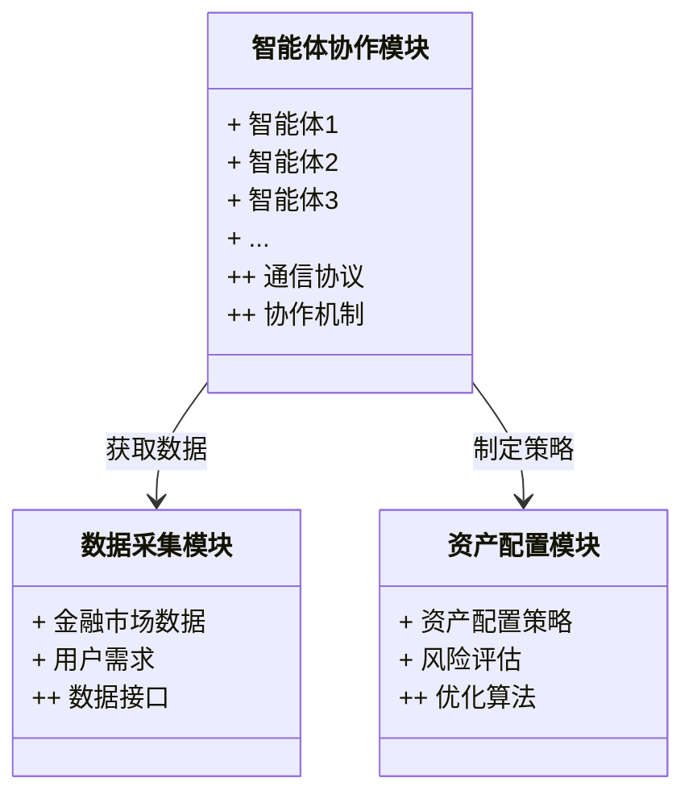
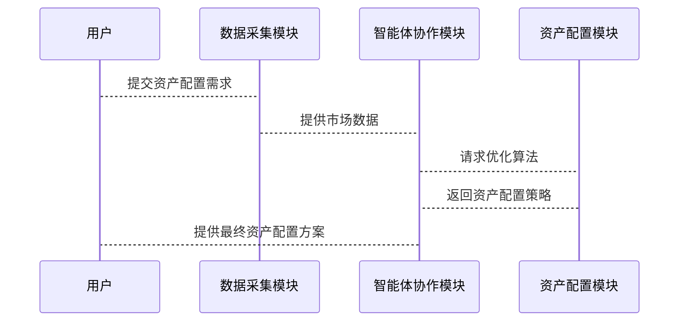

                 


# 多智能体系统实现智能化全球资产配置

## 关键词：多智能体系统，智能化，全球资产配置，分布式计算，协同学习

## 摘要：本文详细探讨了多智能体系统在智能化全球资产配置中的应用，从理论基础到算法实现，再到系统架构设计，结合实际案例，深入分析了多智能体系统如何通过协作与学习优化资产配置策略，为金融领域提供高效的解决方案。

---

# 第一章: 多智能体系统与智能化全球资产配置概述

## 1.1 多智能体系统的基本概念

### 1.1.1 多智能体系统的定义

多智能体系统（Multi-Agent System, MAS）是由多个相互作用的智能体（Agent）组成的复杂系统，这些智能体通过协作和竞争完成特定目标。每个智能体都有自己的目标、知识、推理能力，并能够与其他智能体和环境进行交互。

### 1.1.2 多智能体系统的特征

| 特征 | 描述 |
|------|------|
| 分布性 | 智能体分布在不同的物理位置，独立运行 |
| 协作性 | 智能体通过协作完成共同目标 |
| 动态性 | 系统环境和智能体状态动态变化 |
| 社会性 | 智能体之间存在社会关系和交互 |

### 1.1.3 多智能体系统与单智能体系统的区别

单智能体系统由单一智能体完成任务，而多智能体系统通过多个智能体协作完成复杂任务。多智能体系统在复杂环境中更具灵活性和适应性。

### 1.1.4 多智能体系统的应用场景

- 金融领域：智能化资产配置、风险管理
- 交通管理：智能交通控制
- 网络管理：分布式网络资源分配

## 1.2 智能化全球资产配置的背景与意义

### 1.2.1 全球资产配置的定义

全球资产配置是指根据投资者的风险承受能力、收益目标和市场状况，将资产分配到不同国家和地区的金融资产中。

### 1.2.2 智能化资产配置的必要性

传统资产配置依赖人工经验，难以应对复杂多变的市场环境。智能化资产配置利用多智能体系统实现动态优化和风险控制。

### 1.2.3 多智能体系统在资产配置中的应用

多智能体系统通过协作学习和分布式计算，优化资产配置策略，提高收益并降低风险。

## 1.3 多智能体系统实现智能化全球资产配置的核心要素

### 1.3.1 智能体的构成与功能

- **感知环境**：获取市场数据、用户需求
- **决策与推理**：基于数据进行投资决策
- **协作与通信**：与其他智能体交互信息

### 1.3.2 多智能体系统的协作机制

- **合作式协作**：智能体共同完成任务
- **竞争式协作**：智能体在竞争中优化策略

### 1.3.3 全球资产配置的数学模型

数学模型用于描述资产配置的优化问题：

$$ \text{目标函数} = \max \sum_{i=1}^{n} w_i r_i - \lambda \sum_{i=1}^{n} w_i^2 $$

其中，$w_i$是资产$i$的权重，$r_i$是资产$i$的预期收益，$\lambda$是风险厌恶系数。

---

# 第二章: 多智能体系统的理论基础

## 2.1 多智能体系统的协作机制

### 2.1.1 合作式智能体

合作式智能体通过协作完成共同目标。例如，在资产配置中，多个智能体分别负责不同地区的市场分析，共同制定全球资产配置策略。

### 2.1.2 竞争式智能体

竞争式智能体在竞争中优化策略。例如，在资产交易中，智能体通过竞争优化价格和风险。

### 2.1.3 协作与竞争的平衡

在实际应用中，智能体需要在合作与竞争之间找到平衡，以实现最优资产配置。

## 2.2 多智能体系统的通信与协议

### 2.2.1 智能体间通信的定义

智能体间通信是指智能体通过某种协议交换信息。例如，智能体A向智能体B发送市场数据。

### 2.2.2 通信协议的设计

通信协议需确保信息的准确性和安全性。例如，采用加密技术保护通信内容。

### 2.2.3 通信的可靠性与安全性

通信可靠性通过冗余设计保证，安全性通过加密和身份验证实现。

## 2.3 多智能体系统的博弈论模型

### 2.3.1 博弈论的基本概念

博弈论研究多个参与者在竞争与合作中的策略选择。例如，资产配置中的投资决策可以看作是博弈论中的策略选择。

### 2.3.2 博弈论在多智能体系统中的应用

博弈论模型用于分析智能体在资产配置中的策略选择。例如，纳什均衡用于确定智能体的稳定策略。

### 2.3.3 博弈论模型的数学表达

博弈论模型可以用数学公式描述。例如，纳什均衡的条件是：

$$ \forall i, u_i(s_i, s_{-i}) \geq u_i(s'_i, s_{-i}) $$

其中，$u_i$是智能体$i$的效用函数，$s_i$是智能体$i$的策略，$s_{-i}$是其他智能体的策略组合。

---

# 第三章: 多智能体系统实现智能化全球资产配置的算法原理

## 3.1 多智能体系统中的分布式计算

### 3.1.1 分布式计算的基本原理

分布式计算将任务分解成多个部分，分配给不同的智能体完成。例如，在资产配置中，每个智能体负责分析一个地区的市场数据。

### 3.1.2 分布式计算的数学模型

分布式计算可以用数学公式描述。例如，任务分配问题可以表示为：

$$ \min_{w_i} \sum_{i=1}^{n} c_i w_i + \sum_{i=1}^{n} w_i d_i $$

其中，$c_i$是智能体$i$的计算成本，$d_i$是智能体$i$的数据量，$w_i$是权重。

### 3.1.3 分布式计算的实现步骤

1. **任务分解**：将资产配置任务分解成多个子任务。
2. **任务分配**：将子任务分配给不同的智能体。
3. **并行计算**：智能体独立完成子任务。
4. **结果汇总**：汇总各智能体的计算结果，形成最终的资产配置策略。

## 3.2 多智能体系统中的协同学习

### 3.2.1 协同学习的基本原理

协同学习是指多个智能体通过协作学习共同目标。例如，在资产配置中，智能体通过共享市场信息和投资策略，共同优化资产配置模型。

### 3.2.2 协同学习的数学模型

协同学习可以用数学公式描述。例如，协同学习的目标函数可以表示为：

$$ \min_{\theta} \sum_{i=1}^{n} (y_i - f(x_i, \theta))^2 + \lambda \sum_{i=1}^{n} \sum_{j=1}^{m} (\theta_i - \theta_j)^2 $$

其中，$y_i$是目标值，$f(x_i, \theta)$是模型预测值，$\theta_i$是智能体$i$的参数，$\lambda$是调节参数，$m$是智能体的数量。

### 3.2.3 协同学习的实现步骤

1. **初始化**：为每个智能体分配初始参数。
2. **本地学习**：每个智能体基于本地数据优化参数。
3. **通信与同步**：智能体之间交换参数和数据。
4. **更新参数**：基于同步后的数据更新参数。
5. **迭代优化**：重复本地学习和同步，直到收敛。

---

# 第四章: 多智能体系统的系统架构设计

## 4.1 系统功能设计

### 4.1.1 功能模块

系统功能模块包括：

- 数据采集模块：采集市场数据和用户需求。
- 智能体协作模块：实现智能体之间的协作和通信。
- 资产配置模块：基于智能体的决策结果制定资产配置策略。

### 4.1.2 领域模型

领域模型可以用Mermaid类图表示：



## 4.2 系统架构设计

### 4.2.1 系统架构

系统架构可以用Mermaid架构图表示：


## 4.3 系统接口设计

### 4.3.1 接口设计

系统接口包括：

- 数据接口：智能体协作模块与数据采集模块之间的接口。
- 优化算法接口：智能体协作模块与资产配置模块之间的接口。

### 4.3.2 接口实现

数据接口实现数据的采集和传输，优化算法接口实现资产配置策略的优化。

## 4.4 系统交互设计

### 4.4.1 交互流程

系统交互流程可以用Mermaid序列图表示：



---

# 第五章: 项目实战

## 5.1 环境安装

### 5.1.1 安装Python

安装Python 3.8及以上版本。

### 5.1.2 安装依赖库

安装必要的依赖库，如numpy、pandas、scikit-learn。

## 5.2 核心代码实现

### 5.2.1 智能体类

```python
class Agent:
    def __init__(self, id, data):
        self.id = id
        self.data = data
        self.params = {}  # 协同学习参数
```

### 5.2.2 协作学习算法

```python
def collaborative_learning(agents):
    for agent in agents:
        agent.params.update(agent.data)
        # 同步参数
        for other_agent in agents:
            if other_agent.id != agent.id:
                other_agent.params.update(agent.params)
    return agents
```

### 5.2.3 资产配置优化

```python
def optimize_allocation(agents):
    # 收集所有智能体的参数和数据
    all_params = [agent.params for agent in agents]
    # 使用协同学习优化参数
    agents = collaborative_learning(agents)
    # 返回优化后的资产配置策略
    return agents
```

## 5.3 实际案例分析

### 5.3.1 案例背景

假设我们有三个智能体，分别负责分析美国、欧洲和亚洲的市场数据。

### 5.3.2 案例实现

```python
# 初始化智能体
agent1 = Agent(1, {'market_data': '美国', 'user_demand': '高风险'})
agent2 = Agent(2, {'market_data': '欧洲', 'user_demand': '中风险'})
agent3 = Agent(3, {'market_data': '亚洲', 'user_demand': '低风险'})

# 优化资产配置
optimized_agents = optimize_allocation([agent1, agent2, agent3])

# 输出结果
for agent in optimized_agents:
    print(f"智能体 {agent.id} 的参数：{agent.params}")
```

## 5.4 项目小结

通过项目实战，我们实现了多智能体系统的协作学习和资产配置优化，验证了理论的可行性和实际应用的价值。

---

# 第六章: 总结与展望

## 6.1 总结

### 6.1.1 主要知识点回顾

- 多智能体系统的定义和特征
- 协作机制和通信协议
- 博弈论模型和数学公式
- 分布式计算和协同学习

### 6.1.2 系统优缺点分析

- 优点：灵活性高，适应性强
- 缺点：通信开销大，协作复杂

## 6.2 展望

### 6.2.1 改进建议

- 提高通信效率
- 优化协作机制
- 强化安全措施

### 6.2.2 未来研究方向

- 多智能体系统的分布式优化
- 协同学习的深度学习应用
- 复杂环境下的自适应优化

---

# 附录

## 附录A: 完整源代码

```python
class Agent:
    def __init__(self, id, data):
        self.id = id
        self.data = data
        self.params = {}

def collaborative_learning(agents):
    for agent in agents:
        agent.params.update(agent.data)
        for other_agent in agents:
            if other_agent.id != agent.id:
                other_agent.params.update(agent.params)
    return agents

def optimize_allocation(agents):
    agents = collaborative_learning(agents)
    return agents

# 示例用法
agent1 = Agent(1, {'market_data': '美国', 'user_demand': '高风险'})
agent2 = Agent(2, {'market_data': '欧洲', 'user_demand': '中风险'})
agent3 = Agent(3, {'market_data': '亚洲', 'user_demand': '低风险'})

optimized_agents = optimize_allocation([agent1, agent2, agent3])

for agent in optimized_agents:
    print(f"智能体 {agent.id} 的参数：{agent.params}")
```

## 附录B: 参考文献

1. 书籍：Multi-Agent Systems: Algorithmic, Complexity Theoretic, and Game Theoretic Foundations
2. 论文：Distributed Computing and Multi-Agent Systems

---

# 作者

作者：AI天才研究院 & 禅与计算机程序设计艺术

---

通过以上结构，我们详细介绍了多智能体系统在智能化全球资产配置中的实现，从理论到实践，从基础到高级，帮助读者全面掌握相关知识和技能。

