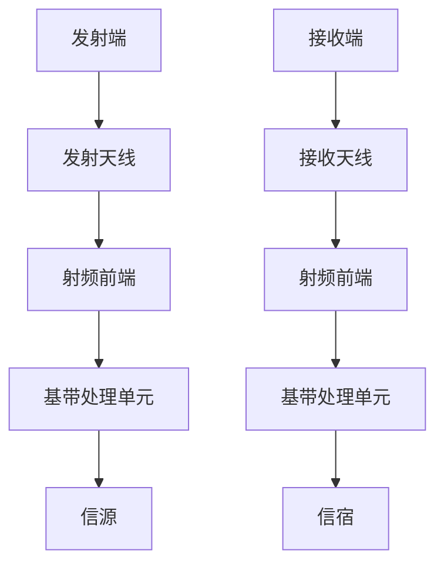
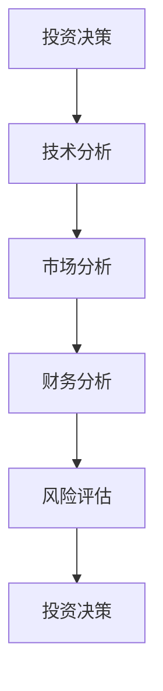

                 


```markdown
# 巴菲特-芒格的太赫兹通信技术投资：下一代无线通信

> 关键词：巴菲特，芒格，太赫兹通信，无线通信，投资分析，技术原理，系统架构

> 摘要：本文探讨了巴菲特和芒格的投资理念与太赫兹通信技术的结合，分析了太赫兹通信技术的背景、核心原理、系统架构、投资价值及市场前景。通过详细的技术分析和投资策略，展示了如何将巴菲特-芒格的投资理念应用于太赫兹通信技术的投资决策中，为读者提供了全面的技术与投资视角。

---

## 第1章: 巴菲特-芒格投资理念概述

### 1.1 巴菲特-芒格投资理念的核心要素
#### 1.1.1 巴菲特的价值投资理论
- **长期主义**：投资于具备持续竞争优势的企业。
- **安全边际**：买入价格低于内在价值。
- **企业基本面分析**：关注企业的财务状况、盈利能力、竞争优势。

#### 1.1.2 芒格的多元思维模型
- **跨学科学习**：通过多个学科的交叉思考，寻找投资机会。
- **逆向思维**：从反向思考问题，找到别人忽略的机会。
- **认知的边界**：承认自己的无知，避免过度自信。

#### 1.1.3 投资中的长期主义与安全边际
- **长期主义**：关注企业的长期价值，而非短期波动。
- **安全边际**：通过合理估值，降低投资风险。

### 1.2 巴菲特-芒格投资理念的现代应用
#### 1.2.1 科技创新与投资机会
- **技术创新的核心地位**：科技是推动企业增长的关键。
- **技术周期分析**：关注技术发展的周期，判断投资时机。
- **技术驱动的行业趋势**：分析技术对企业利润和市场份额的影响。

#### 1.2.2 行业趋势与竞争优势分析
- **行业生命周期**：分析行业的成长阶段，判断投资机会。
- **竞争优势**：关注企业的核心竞争力，如技术壁垒、成本优势等。
- **市场地位**：企业是否是行业领导者或具有潜力的新 entrant。

#### 1.2.3 投资决策中的风险管理
- **风险识别**：识别投资中的潜在风险。
- **风险评估**：量化风险对投资价值的影响。
- **风险控制**：通过多样化投资、分散风险等方式降低风险。

### 1.3 巴菲特-芒格投资理念与太赫兹通信技术的结合
#### 1.3.1 太赫兹通信技术的定义与特点
- **定义**：太赫兹通信技术是指利用0.1 THz到10 THz频段的无线电波进行通信的技术。
- **特点**：高频、大带宽、低延迟、高容量、支持大规模连接。

#### 1.3.2 太赫兹通信技术的投资价值
- **市场需求**：随着5G、物联网、工业自动化等领域的快速发展，对高速、低延迟的通信需求不断增加。
- **技术优势**：太赫兹通信技术具有高频段的频谱资源，可以实现更高的数据传输速率和更低的延迟，适合6G及更高级别的通信需求。
- **应用场景**：广泛应用于卫星通信、毫米波通信、工业物联网、自动驾驶等领域。

#### 1.3.3 巴菲特-芒格理念在太赫兹通信技术投资中的应用
- **长期主义**：关注太赫兹通信技术的长期发展，投资于具备持续技术优势的企业。
- **安全边际**：通过合理的估值，选择具有安全边际的公司进行投资。
- **竞争优势分析**：分析企业的技术壁垒、市场地位、盈利能力，选择具有竞争优势的企业。

---

## 第2章: 太赫兹通信技术的背景与现状

### 2.1 太赫兹通信技术的基本概念
#### 2.1.1 太赫兹频段的定义与特点
- **定义**：太赫兹频段是指频率在0.1 THz到10 THz之间的无线电频段。
- **特点**：高频段频谱资源丰富，频段宽，适合大规模多用户连接。

#### 2.1.2 太赫兹通信技术的优势与挑战
- **优势**：
  - 高频段频谱资源丰富，可以实现高带宽、高速率的通信。
  - 低延迟，适合实时性要求高的应用场景。
  - 支持大规模连接，适合物联网、工业自动化等场景。
- **挑战**：
  - 信号衰减严重，传播距离有限。
  - 易受环境因素影响，如雨衰、大气吸收等。
  - 技术复杂性高，实现难度大。

#### 2.1.3 太赫兹通信技术的应用场景
- **卫星通信**：利用太赫兹频段实现卫星与地面站之间的高速通信。
- **毫米波通信**：在5G及更高代数的通信系统中，利用太赫兹频段实现高速数据传输。
- **工业物联网**：在工业自动化、智能工厂中，利用太赫兹通信技术实现设备间的高速通信。
- **自动驾驶**：在自动驾驶汽车中，利用太赫兹通信技术实现车辆与周围环境的实时通信。

### 2.2 太赫兹通信技术的发展历程
#### 2.2.1 太赫兹通信技术的起源与发展
- **起源**：太赫兹通信技术的研究可以追溯到20世纪初，但受限于技术限制，未能大规模应用。
- **发展**：随着微波技术的进步，太赫兹通信技术在20世纪末开始逐步发展。
- **现代进展**：近年来，随着5G、6G通信技术的推进，太赫兹通信技术的研究和应用得到了快速发展。

#### 2.2.2 太赫兹通信技术在不同领域的应用
- **军事领域**：用于雷达、卫星通信等。
- **民用领域**：用于高速数据传输、物联网、工业自动化等。
- **学术研究**：高校和研究机构在太赫兹通信技术的研究上投入了大量资源。

#### 2.2.3 太赫兹通信技术的未来趋势
- **技术成熟**：随着技术的进步，太赫兹通信技术将逐步成熟，实现更广泛的应用。
- **标准化**：国际和行业标准的制定将推动太赫兹通信技术的规范化。
- **商业化**：太赫兹通信技术将逐步进入商业化阶段，应用于更多的实际场景。

### 2.3 太赫兹通信技术的市场现状
#### 2.3.1 全球太赫兹通信技术的市场分布
- **区域分布**：北美、欧洲、亚洲等地区在太赫兹通信技术的研究和应用上均有一定的投入。
- **主要厂商**：包括华为、诺基亚、爱立信、高通等通信设备厂商。
- **竞争格局**：目前市场尚处于发展阶段，竞争格局尚未完全形成。

#### 2.3.2 太赫兹通信技术的主要厂商与竞争格局
- **主要厂商**：华为、诺基亚、爱立信、高通等通信设备厂商。
- **竞争格局**：技术竞争、市场占有率竞争、专利竞争等。
- **合作与竞争**：行业内既有竞争，也有合作，共同推动技术的发展。

#### 2.3.3 太赫兹通信技术的市场前景与投资机会
- **市场前景**：随着技术的成熟和应用的推广，太赫兹通信技术市场将快速增长。
- **投资机会**：具备技术优势和市场潜力的企业将具备较高的投资价值。

---

## 第3章: 太赫兹通信技术的核心原理与系统架构

### 3.1 太赫兹通信技术的核心原理
#### 3.1.1 太赫兹频段的传播特性
- **传播损耗**：太赫兹频段的信号传播损耗较高，传播距离有限。
- **信道特性**：太赫兹频段的信道特性复杂，受环境影响较大。
- **多径效应**：太赫兹频段的多径效应显著，影响信号的接收质量。

#### 3.1.2 太赫兹通信技术的信号传输机制
- **调制与解调**：通过调制技术实现信号的传输，接收端通过解调技术恢复信号。
- **编码与解码**：采用先进的编码技术，提高通信的可靠性和安全性。
- **同步与定时**：实现发射端和接收端的同步，保证信号的正确传输。

#### 3.1.3 太赫兹通信技术的抗干扰能力
- **抗干扰技术**：通过多种技术手段，如频率 hopping、空时编码等，提高抗干扰能力。
- **信道估计**：准确估计信道特性，优化信号传输。
- **自适应调制**：根据信道条件动态调整调制方式，提高通信效率。

### 3.2 太赫兹通信系统的系统架构
#### 3.2.1 发射端与接收端的组成
- **发射端**：包括发射天线、射频前端、基带处理单元等。
- **接收端**：包括接收天线、射频前端、基带处理单元等。
- **天线系统**：采用高增益天线，提高信号的传输和接收能力。

#### 3.2.2 太赫兹通信系统的信道模型
- **信道模型**：描述信号在传输过程中受到的各种影响，包括传播损耗、多径效应、信道噪声等。
- **信道估计**：通过信道估计技术，准确估计信道特性，优化信号传输。
- **信道反馈**：将信道信息反馈给发射端，指导信号传输。

#### 3.2.3 太赫兹通信系统的组网方式
- **点对点通信**：两个节点之间的直接通信。
- **多点通信**：多个节点之间的通信，支持大规模连接。
- **网络架构**：包括核心网、接入网、用户终端等组成部分。

### 3.3 太赫兹通信技术的算法原理
#### 3.3.1 太赫兹通信技术的信号处理算法
- **信号检测**：通过算法实现信号的检测和识别。
- **信号同步**：实现发射端和接收端的同步，保证信号的正确传输。
- **信号恢复**：通过算法恢复原始信号，提高通信质量。

#### 3.3.2 太赫兹通信技术的调制与解调技术
- **调制技术**：包括正交频分复用（OFDM）、正交频分多址（OFDMA）等。
- **解调技术**：通过解调技术恢复原始信号，实现通信。
- **自适应调制**：根据信道条件动态调整调制方式，提高通信效率。

#### 3.3.3 太赫兹通信技术的同步与定时技术
- **同步技术**：实现发射端和接收端的同步，保证信号的正确传输。
- **定时技术**：通过定时技术实现信号的准确接收和处理。
- **自适应同步**：根据信道条件动态调整同步算法，提高同步精度。

---

## 第4章: 太赫兹通信技术的投资分析与价值评估

### 4.1 太赫兹通信技术的投资价值分析
#### 4.1.1 技术成熟度分析
- **技术成熟度**：目前太赫兹通信技术尚处于发展初期，技术成熟度有待提高。
- **技术瓶颈**：信号衰减、环境影响、技术实现难度大等。
- **技术突破**：随着技术的不断进步，太赫兹通信技术的实现难度将逐步降低。

#### 4.1.2 市场需求分析
- **市场需求**：随着5G、6G通信技术的发展，对太赫兹频段的需求不断增加。
- **应用领域**：广泛应用于卫星通信、工业物联网、自动驾驶等领域。
- **市场潜力**：太赫兹通信技术市场潜力巨大，未来将快速增长。

#### 4.1.3 投资风险分析
- **技术风险**：技术实现难度大，存在技术失败的风险。
- **市场风险**：市场需求不确定，存在市场风险。
- **竞争风险**：行业内竞争激烈，存在被竞争对手取代的风险。

### 4.2 太赫兹通信技术的市场前景与投资机会
#### 4.2.1 市场规模预测
- **市场规模**：预计未来几年，太赫兹通信技术市场规模将快速增长。
- **增长率预测**：年增长率将超过20%，市场潜力巨大。

#### 4.2.2 投资机会分析
- **技术驱动型投资**：投资于具备技术优势的企业。
- **市场驱动型投资**：投资于具备市场潜力的企业。
- **竞争优势分析**：选择具备竞争优势的企业进行投资。

#### 4.2.3 投资策略建议
- **长期投资**：关注企业的长期价值，投资于具备持续竞争优势的企业。
- **安全边际**：通过合理的估值，选择具有安全边际的公司进行投资。
- **风险管理**：通过分散投资、风险控制等方式降低投资风险。

---

## 第5章: 巴菲特-芒格投资理念在太赫兹通信技术中的实践

### 5.1 投资策略与实践案例
#### 5.1.1 投资策略
- **价值投资**：寻找具备长期竞争优势的企业。
- **安全边际**：通过合理估值，选择具有安全边际的公司。
- **风险管理**：通过分散投资、风险控制等方式降低投资风险。

#### 5.1.2 实践案例
- **案例一**：投资某太赫兹通信技术企业。
- **案例二**：投资某具备技术优势的通信设备厂商。

### 5.2 投资决策中的关键因素
#### 5.2.1 技术优势
- **技术壁垒**：企业是否具备核心技术优势。
- **技术团队**：企业的技术研发团队是否具备实力。
- **研发投入**：企业的研发投入是否充足。

#### 5.2.2 市场地位
- **市场份额**：企业在市场中的占有率。
- **竞争优势**：企业的竞争优势是否明显。
- **市场前景**：企业的市场前景是否广阔。

#### 5.2.3 财务状况
- **盈利能力**：企业的盈利能力是否强。
- **财务健康**：企业的财务状况是否健康。
- **估值水平**：企业的估值是否合理。

### 5.3 投资回报与风险管理
#### 5.3.1 投资回报
- **短期回报**：投资的短期回报是否可观。
- **长期回报**：投资的长期回报是否可观。
- **回报来源**：回报来源于企业的盈利增长、股价上涨等。

#### 5.3.2 风险管理
- **风险识别**：识别投资中的潜在风险。
- **风险评估**：评估风险对投资回报的影响。
- **风险控制**：通过多元化投资、分散投资等方式降低风险。

---

## 第6章: 结论与展望

### 6.1 结论
- **总结**：本文探讨了巴菲特和芒格的投资理念与太赫兹通信技术的结合，分析了太赫兹通信技术的背景、核心原理、系统架构、投资价值及市场前景。
- **核心观点**：太赫兹通信技术具备巨大的市场潜力，投资者可以通过巴菲特-芒格的投资理念，选择具备技术优势和竞争优势的企业进行投资。

### 6.2 展望
- **未来研究方向**：进一步研究太赫兹通信技术在不同领域的应用，探索其投资机会。
- **技术发展**：关注太赫兹通信技术的技术进步，分析其对投资价值的影响。
- **市场动态**：关注太赫兹通信技术的市场动态，把握投资机会。

---

## 附录

### 附录A: 太赫兹通信技术的数学模型与公式
- **信道容量公式**：
  $$ C = W \log_2(1 + \frac{P}{N}) $$
  其中，$C$表示信道容量，$W$表示信道带宽，$P$表示信号功率，$N$表示噪声功率。

### 附录B: 太赫兹通信系统的系统架构图


### 附录C: 投资策略与决策流程图


---

## 作者：AI天才研究院/AI Genius Institute & 禅与计算机程序设计艺术/Zen And The Art of Computer Programming
```

