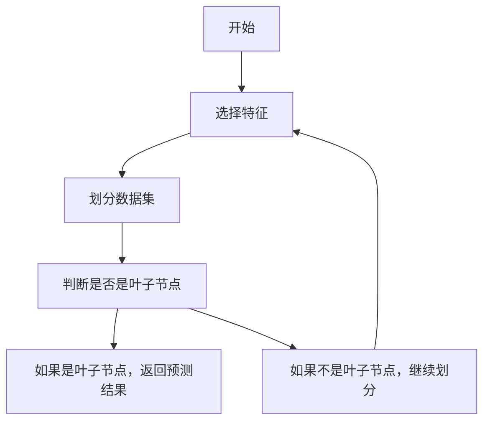
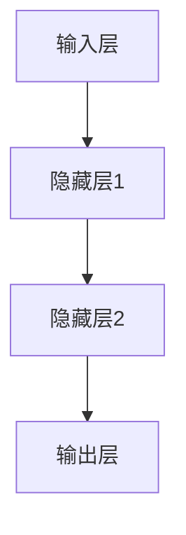

                 


# 巴菲特的品牌忠诚度分析：社交媒体时代的消费者行为

## 关键词：品牌忠诚度，社交媒体，消费者行为，巴菲特，投资策略

## 摘要：
在社交媒体时代，品牌忠诚度的分析变得前所未有的重要。本文从巴菲特的投资理念出发，结合社交媒体对消费者行为的影响，系统性地分析了品牌忠诚度的核心概念、算法原理、系统架构及项目实战。通过建立数学模型、设计算法流程和实现系统架构，本文深入探讨了品牌忠诚度在社交媒体环境下的动态变化及其对消费者行为的影响。同时，本文结合实际案例，详细解读了如何通过技术手段提升品牌忠诚度分析的准确性和效率，为品牌管理者和投资者提供了有价值的参考。

---

# 第一部分：品牌忠诚度与社交媒体的背景介绍

## 第1章：品牌忠诚度的定义与维度

### 1.1 品牌忠诚度的定义
#### 1.1.1 品牌忠诚度的定义与内涵
品牌忠诚度是指消费者对某一品牌长期的偏好和持续购买行为。消费者对品牌的忠诚度不仅取决于产品的质量，还包括品牌的文化价值、用户体验以及情感认同。在社交媒体时代，品牌忠诚度的内涵更加丰富，消费者的行为受到社交媒体信息的强烈影响。

#### 1.1.2 品牌忠诚度的分类与维度
品牌忠诚度可以从以下几个维度进行分类：
1. **情感忠诚**：消费者基于对品牌的感情认同而产生的忠诚。
2. **行为忠诚**：消费者基于实际购买行为的忠诚，通常表现为重复购买。
3. **认知忠诚**：消费者基于对品牌的认知和信任而产生的忠诚。
4. **价格忠诚**：消费者基于价格敏感度而产生的忠诚。

#### 1.1.3 品牌忠诚度的核心要素
品牌忠诚度的核心要素包括：
- 品牌认知度：消费者对品牌的认知和记忆。
- 消费者情感：消费者对品牌的感情认同。
- 用户体验：消费者在使用品牌产品或服务时的实际体验。
- 品牌信任：消费者对品牌的信任程度。

### 1.2 品牌忠诚度的影响因素
#### 1.2.1 品牌认知与品牌态度
品牌认知是消费者对品牌的基本理解，而品牌态度则反映了消费者对品牌的看法。两者共同影响消费者的行为决策。

#### 1.2.2 消费者情感与品牌忠诚度的关系
消费者的情感体验是品牌忠诚度的核心驱动力。积极的情感体验会增强品牌忠诚度，而负面的情感体验则会导致品牌忠诚度的下降。

#### 1.2.3 产品特性与品牌忠诚度的关联
产品的质量、创新性、性价比等因素直接影响消费者对品牌的忠诚度。高质量的产品和创新设计能够提升品牌忠诚度，而低质量的产品则会削弱品牌忠诚度。

### 1.3 品牌忠诚度的测量方法
#### 1.3.1 品牌忠诚度的定性测量
定性测量方法包括：
- 消费者访谈：通过与消费者进行深度访谈，了解他们对品牌的看法和忠诚度。
- 用户反馈：通过社交媒体评论、论坛讨论等途径收集消费者对品牌的反馈。

#### 1.3.2 品牌忠诚度的定量测量
定量测量方法包括：
- 调查问卷：通过设计科学的调查问卷，收集消费者对品牌的评分和反馈。
- 数据分析：通过销售数据、市场份额数据等进行分析，衡量品牌忠诚度。

#### 1.3.3 品牌忠诚度测量的工具与方法
常用的工具包括：
- 品牌忠诚度指数（BCI）：通过综合评估品牌认知度、品牌态度、购买行为等指标，计算品牌忠诚度指数。
- 品牌情感分析：通过自然语言处理技术，分析消费者对品牌的评论，评估品牌情感倾向。

## 第2章：社交媒体时代消费者行为的演变

### 2.1 社交媒体对消费者行为的影响
#### 2.1.1 社交媒体的崛起与普及
社交媒体的普及改变了消费者的获取信息的方式，消费者不再仅仅依赖传统的广告宣传，而是通过社交媒体平台获取信息、分享体验。

#### 2.1.2 社交媒体对消费者决策过程的改变
社交媒体时代，消费者的信息获取、决策过程和购买行为都发生了显著变化。消费者通过社交媒体了解品牌信息，通过社交网络获取产品评价，最终形成购买决策。

#### 2.1.3 社交媒体时代消费者行为的特点
社交媒体时代消费者行为的特点包括：
- **信息透明化**：消费者可以轻松获取品牌信息，了解产品优缺点。
- **互动性**：消费者可以通过社交媒体与品牌进行互动，提出反馈和建议。
- **社交化决策**：消费者的决策过程受到社交媒体上其他消费者评价的影响。

### 2.2 品牌忠诚度在社交媒体时代的新挑战
#### 2.2.1 社交媒体对品牌忠诚度的双刃剑效应
社交媒体可以增强品牌忠诚度，但也可能削弱品牌忠诚度。例如，负面评论和差评会直接影响消费者对品牌的信任和忠诚度。

#### 2.2.2 消费者主权的崛起与品牌忠诚度的脆弱性
在社交媒体时代，消费者的话语权显著增强，消费者可以通过社交媒体表达对品牌的不满，从而对品牌忠诚度产生直接影响。

#### 2.2.3 品牌忠诚度的动态变化
社交媒体时代，品牌忠诚度不再是静态的，而是动态变化的。消费者对品牌的忠诚度会随着品牌的表现和社会媒体上的信息变化而波动。

### 2.3 品牌忠诚度与社交媒体的互动关系
#### 2.3.1 品牌忠诚度在社交媒体中的表现形式
品牌忠诚度在社交媒体中的表现形式包括：
- 消费者对品牌的关注和互动频率。
- 消费者对品牌的正面评价和推荐。
- 消费者对品牌的持续购买行为。

#### 2.3.2 社交媒体如何影响品牌忠诚度
社交媒体通过提供信息、促进互动、增强品牌认知等方式影响消费者对品牌的忠诚度。积极的社交媒体互动可以增强品牌忠诚度，而负面的社交媒体互动则会削弱品牌忠诚度。

#### 2.3.3 品牌忠诚度如何反哺社交媒体生态
品牌忠诚度的高消费者会通过社交媒体主动传播品牌信息，推荐品牌产品，从而反哺社交媒体生态，增强品牌的影响力和知名度。

---

# 第二部分：品牌忠诚度分析的核心概念与联系

## 第3章：品牌忠诚度分析的核心概念

### 3.1 品牌忠诚度的核心概念
#### 3.1.1 品牌忠诚度的理论模型
品牌忠诚度的理论模型包括：
- **认知模型**：强调消费者对品牌的认知和记忆对忠诚度的影响。
- **情感模型**：强调消费者对品牌的感情认同对忠诚度的影响。
- **行为模型**：强调消费者实际购买行为对忠诚度的影响。

#### 3.1.2 品牌忠诚度的核心属性特征对比
| 特性 | 情感忠诚 | 行为忠诚 | 认知忠诚 | 价格忠诚 |
|------|----------|----------|----------|----------|
| 定义 | 消费者基于情感认同的忠诚 | 消费者基于行为的忠诚 | 消费者基于认知的忠诚 | 消费者基于价格敏感度的忠诚 |
| 影响 | 情感体验 | 购买行为 | 品牌认知 | 价格敏感度 |

#### 3.1.3 品牌忠诚度的ER实体关系图
```mermaid
erDiagram
    CUSTOMER { id: integer, name: string, age: integer, gender: string } 
    BRAND { id: integer, name: string, category: string } 
    PURCHASE { id: integer, customer_id: integer, brand_id: integer, purchase_date: date } 
    CUSTOMER-|{多次购买}| PURCHASE
    PURCHASE-|{购买品牌}| BRAND
```

### 3.2 消费者行为模型与品牌忠诚度的关系
#### 3.2.1 消费者行为模型的定义与分类
消费者行为模型包括：
- **理性模型**：消费者基于理性决策选择品牌。
- **情感模型**：消费者基于情感体验选择品牌。
- **社会影响模型**：消费者基于社会影响选择品牌。

#### 3.2.2 品牌忠诚度在消费者行为模型中的位置
品牌忠诚度是消费者行为模型的重要组成部分，影响消费者的决策过程和购买行为。

#### 3.2.3 消费者行为模型与品牌忠诚度的关联分析
消费者行为模型与品牌忠诚度的关联分析可以通过构建数学模型来实现。例如，可以通过回归分析来研究消费者行为模型中的各个变量对品牌忠诚度的影响。

### 3.3 品牌忠诚度分析的数学模型与公式
#### 3.3.1 品牌忠诚度的数学模型
品牌忠诚度的数学模型可以表示为：
$$
L = \beta_0 + \beta_1C + \beta_2E + \beta_3U + \epsilon
$$
其中，$L$ 表示品牌忠诚度，$C$ 表示品牌认知度，$E$ 表示消费者情感，$U$ 表示用户体验，$\beta$ 表示回归系数，$\epsilon$ 表示误差项。

#### 3.3.2 品牌忠诚度分析的核心公式
品牌忠诚度分析的核心公式包括：
- 品牌忠诚度指数（BCI）计算公式：
$$
BCI = \frac{\text{品牌忠诚度得分}}{\text{行业平均忠诚度得分}}
$$
- 情感分析的正负向比例计算公式：
$$
\text{正向比例} = \frac{\text{正面评论数}}{\text{总评论数}}
$$
$$
\text{负向比例} = \frac{\text{负面评论数}}{\text{总评论数}}
$$

---

# 第三部分：品牌忠诚度分析的算法原理与实现

## 第4章：品牌忠诚度分析的算法原理

### 4.1 品牌忠诚度分析的算法概述
#### 4.1.1 品牌忠诚度分析的主要算法
品牌忠诚度分析的主要算法包括：
- 逻辑回归
- 支持向量机（SVM）
- 决策树
- 神经网络

#### 4.1.2 算法选择的依据与原则
算法选择的依据包括：
- 数据特征：数据是否为分类问题，数据量的大小。
- 计算复杂度：算法的计算复杂度和运行时间。
- 模型解释性：模型是否需要具有解释性。

#### 4.1.3 算法的优缺点对比
| 算法 | 优点 | 缺点 |
|------|------|------|
| 逻辑回归 | 解释性强，计算速度快 | 对非线性关系的处理能力较弱 |
| 决策树 | 易于解释，适合处理非线性关系 | 易受噪声数据影响，模型不稳定 |
| 神经网络 | 处理能力强，适合复杂数据 | 计算复杂度高，解释性差 |

### 4.2 基于机器学习的品牌忠诚度分析算法
#### 4.2.1 机器学习算法在品牌忠诚度分析中的应用
机器学习算法可以用于品牌忠诚度的预测和分类。例如，可以使用逻辑回归算法对消费者进行忠诚度分类，使用决策树算法对消费者行为进行预测。

#### 4.2.2 基于决策树的忠诚度分析算法
决策树是一种常用的机器学习算法，可以用于品牌忠诚度的分析。以下是决策树算法的步骤：


#### 4.2.3 基于神经网络的忠诚度分析算法
神经网络是一种强大的机器学习算法，可以用于品牌忠诚度的分析。以下是神经网络算法的步骤：


### 4.3 算法实现的步骤与流程
#### 4.3.1 数据预处理
数据预处理是品牌忠诚度分析的重要步骤，包括：
- 数据清洗：去除噪声数据和冗余数据。
- 数据标准化：对数据进行标准化处理，确保不同特征的尺度一致。

#### 4.3.2 特征选择
特征选择是品牌忠诚度分析的关键步骤，包括：
- 特征提取：从原始数据中提取有用的特征。
- 特征降维：通过主成分分析等方法降低特征的维度。

#### 4.3.3 模型训练
模型训练是品牌忠诚度分析的核心步骤，包括：
- 选择合适的算法：根据数据特征和业务需求选择合适的算法。
- 调参优化：通过交叉验证等方法优化模型参数。

#### 4.3.4 模型评估
模型评估是品牌忠诚度分析的重要步骤，包括：
- 评估指标：准确率、召回率、F1值等。
- 模型优化：根据评估结果优化模型结构和参数。

---

# 第四部分：系统分析与架构设计

## 第5章：品牌忠诚度分析系统的架构设计

### 5.1 问题场景介绍
品牌忠诚度分析系统的目标是通过分析消费者行为数据，评估品牌忠诚度，帮助企业制定有效的品牌管理策略。

### 5.2 项目介绍
品牌忠诚度分析系统是一个基于机器学习的分析平台，旨在帮助企业通过社交媒体数据和消费者行为数据，分析品牌忠诚度，优化品牌管理策略。

### 5.3 系统功能设计
系统功能设计包括：
- 数据采集：从社交媒体平台获取消费者行为数据。
- 数据处理：对数据进行清洗、转换和标准化处理。
- 模型训练：基于机器学习算法训练品牌忠诚度分析模型。
- 模型评估：对模型进行评估和优化。
- 结果展示：通过可视化界面展示品牌忠诚度分析结果。

### 5.4 系统架构设计
系统架构设计包括：
- 前端架构：Web界面，用于展示品牌忠诚度分析结果。
- 后端架构：基于Python的Flask框架，提供API接口。
- 数据库设计：MySQL数据库，存储消费者行为数据和品牌忠诚度分析结果。

### 5.5 系统接口设计
系统接口设计包括：
- 数据采集接口：从社交媒体平台获取消费者行为数据。
- 数据处理接口：对数据进行清洗、转换和标准化处理。
- 模型训练接口：基于机器学习算法训练品牌忠诚度分析模型。
- 模型评估接口：对模型进行评估和优化。
- 结果展示接口：通过可视化界面展示品牌忠诚度分析结果。

### 5.6 系统交互设计
系统交互设计包括：
- 用户登录与注册：用户通过登录或注册进入系统。
- 数据上传：用户上传消费者行为数据。
- 模型训练：用户选择算法并训练模型。
- 结果展示：用户查看品牌忠诚度分析结果。

---

# 第五部分：项目实战

## 第6章：环境安装与系统核心实现

### 6.1 环境安装
#### 6.1.1 安装Python
品牌忠诚度分析系统基于Python语言，需要安装以下Python库：
- `pandas`：数据处理库。
- `numpy`：数值计算库。
- `scikit-learn`：机器学习库。
- `matplotlib`：数据可视化库。

安装命令：
```bash
pip install pandas numpy scikit-learn matplotlib
```

### 6.2 系统核心实现
#### 6.2.1 数据预处理
数据预处理代码：
```python
import pandas as pd
import numpy as np

# 读取数据
data = pd.read_csv('consumer_behavior.csv')

# 删除缺失值
data.dropna(inplace=True)

# 标准化处理
from sklearn.preprocessing import StandardScaler
scaler = StandardScaler()
scaled_data = scaler.fit_transform(data)
```

#### 6.2.2 模型训练
模型训练代码：
```python
from sklearn.tree import DecisionTreeClassifier
from sklearn.model_selection import train_test_split
from sklearn.metrics import accuracy_score

# 划分数据集
X_train, X_test, y_train, y_test = train_test_split(scaled_data, data['loyalty'], test_size=0.2, random_state=42)

# 训练决策树模型
model = DecisionTreeClassifier()
model.fit(X_train, y_train)

# 模型预测
y_pred = model.predict(X_test)

# 模型评估
print("准确率：", accuracy_score(y_test, y_pred))
```

### 6.3 代码应用解读与分析
- 数据预处理：通过标准化处理确保不同特征的尺度一致。
- 模型训练：使用决策树算法训练品牌忠诚度分类模型。
- 模型评估：通过准确率评估模型的性能。

---

## 第7章：实际案例分析与详细解读

### 7.1 案例背景介绍
假设我们有一个社交媒体平台上的消费者行为数据，包括消费者的购买记录、评论内容、点赞数等。

### 7.2 数据分析与模型实现
通过数据分析和模型实现，我们可以评估消费者的忠诚度，并预测未来的购买行为。

### 7.3 案例分析与解读
通过案例分析，我们可以看到品牌忠诚度在社交媒体时代的重要性，以及如何通过技术手段提升品牌忠诚度分析的准确性和效率。

---

## 第8章：项目总结与小结

### 8.1 项目总结
通过本项目的实施，我们掌握了品牌忠诚度分析的核心概念、算法原理和系统架构设计。同时，我们还通过实际案例分析，验证了品牌忠诚度分析技术的应用价值。

### 8.2 注意事项与未来研究方向
- 注意事项：数据隐私和数据安全问题需要特别关注。
- 未来研究方向：探索更多机器学习算法在品牌忠诚度分析中的应用，如深度学习算法和集成学习算法。

---

# 第六部分：总结与展望

## 第9章：总结与展望

### 9.1 总结
本文从巴菲特的投资理念出发，结合社交媒体对消费者行为的影响，系统性地分析了品牌忠诚度的核心概念、算法原理、系统架构及项目实战。通过建立数学模型、设计算法流程和实现系统架构，本文深入探讨了品牌忠诚度在社交媒体环境下的动态变化及其对消费者行为的影响。

### 9.2 展望
未来，随着人工智能和大数据技术的不断发展，品牌忠诚度分析技术将更加精准和高效。我们期待更多的研究成果和技术创新，为品牌管理者和投资者提供更有力的支持。

---

# 作者：AI天才研究院/AI Genius Institute & 禅与计算机程序设计艺术 /Zen And The Art of Computer Programming

