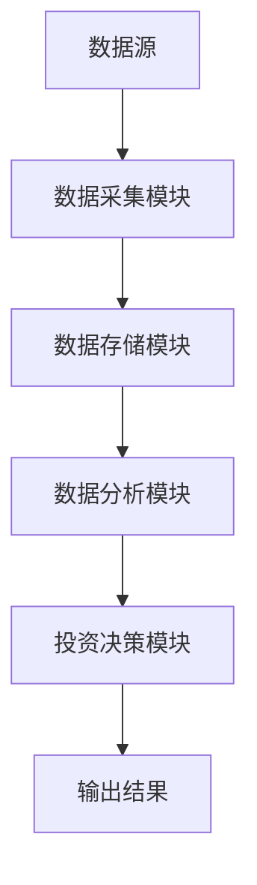
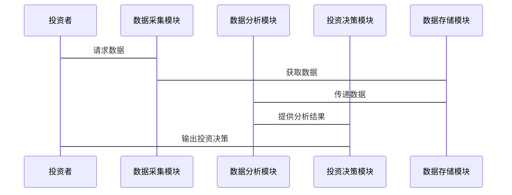

                 


```markdown
# 彼得林奇的"买入并持有"策略

> 关键词：彼得·林奇，买入并持有，投资策略，股票分析，长期投资，价值投资

> 摘要：本文深入分析了彼得·林奇的“买入并持有”投资策略，从其背景、核心理念、数学模型、系统架构到实际案例，详细阐述了该策略的实施方法和优势。文章结合理论与实践，帮助读者理解如何在长期投资中实现财富增长。

---

# 第一部分：彼得·林奇“买入并持有”策略的背景与核心理念

## 第1章：买入并持有策略的起源与背景

### 1.1 投资市场的基本概念

#### 1.1.1 什么是股票投资
股票投资是指通过购买公司股份，成为该公司的一部分所有者，期望在未来通过股价上涨或分红获得收益。股票市场是投资者进行交易的主要场所，投资者通过买入和卖出股票实现资本增值。

#### 1.1.2 股票市场的基本运作机制
股票市场是一个复杂的系统，涉及买方、卖方、交易所、经纪人等多个参与者。股票价格受多种因素影响，包括公司业绩、市场情绪、经济指标等。投资者通过分析这些因素，做出买入或卖出的决策。

#### 1.1.3 投资者的角色与分类
投资者可以分为机构投资者和个人投资者。机构投资者包括基金、保险公司等，而个人投资者则以散户为主。不同类型的投资者有不同的投资目标和风险承受能力。

### 1.2 彼得·林奇与“买入并持有”策略

#### 1.2.1 彼得·林奇的生平简介
彼得·林奇是美国著名投资家，曾管理富达麦哲伦基金，取得了卓越的投资业绩。他的投资理念以长期持有优质股票为核心，强调通过深入研究和长期投资实现财富增长。

#### 1.2.2 “买入并持有”策略的提出背景
20世纪80年代，美国股市经历了多次波动，许多投资者因频繁交易而损失了大量收益。林奇提出的“买入并持有”策略旨在帮助投资者避免短期波动的影响，通过长期持有优质股票实现稳定收益。

#### 1.2.3 该策略在投资历史上的地位
“买入并持有”策略是价值投资的重要组成部分，强调长期投资和对公司基本面的深入分析。该策略在投资历史上具有重要地位，为许多投资者提供了成功的投资方法。

## 第2章：“买入并持有”策略的核心理念

### 2.1 投资的长期性与复利效应

#### 2.1.1 长期投资的优势
长期投资能够避免短期波动的影响，使投资者能够专注于公司长期的价值增长。通过长期持有优质股票，投资者可以享受复利效应，实现财富的稳步增长。

#### 2.1.2 复利效应的数学模型
复利效应是投资收益的重要组成部分。其数学公式为：
$$
A = P \times (1 + r)^n
$$
其中，$P$ 是本金，$r$ 是年化收益率，$n$ 是投资年数，$A$ 是最终收益。

#### 2.1.3 如何通过长期持有实现财富增长
通过长期持有优质股票，投资者可以最大化复利效应，实现财富的指数增长。长期投资还能够分散风险，降低市场波动对投资组合的影响。

### 2.2 价值投资与市场波动

#### 2.2.1 价值投资的基本原理
价值投资是一种以公司基本面分析为基础的投资方法，强调以低于内在价值的价格买入优质股票。林奇认为，市场波动为投资者提供了以合理价格买入优质股票的机会。

#### 2.2.2 市场波动对长期投资者的影响
市场波动对短期投资者影响较大，而长期投资者可以通过坚持持有优质股票，忽略短期波动，实现长期收益。

#### 2.2.3 如何在市场波动中保持投资纪律
投资者需要制定明确的投资计划，并在市场波动中保持纪律，避免因短期波动而做出错误的投资决策。

### 2.3 林奇的投资策略与选股方法

#### 2.3.1 选股的三大标准
林奇选股的核心标准包括：公司具有强大的竞争优势、财务状况健康、管理层具备诚信和能力。他强调选择那些能够在长期中持续增长的公司。

#### 2.3.2 中小盘股的投资机会
林奇偏好投资于中小盘股，认为这些公司具有更大的增长潜力。中小盘股通常具有较高的成长性，且市场关注度较低，为投资者提供了更多的机会。

#### 2.3.3 如何识别具有成长潜力的公司
林奇通过深入研究公司的财务报表、行业地位、竞争优势等，识别那些具有成长潜力的公司。他强调对公司基本面的深入分析，以及对管理层的信任。

---

# 第二部分：买入并持有策略的数学模型与算法原理

## 第3章：投资收益的数学模型

### 3.1 股票收益的计算公式

#### 3.1.1 股票收益率的计算
股票收益率可以通过以下公式计算：
$$
\text{收益率} = \frac{\text{期末价} - \text{期初价}}{\text{期初价}} \times 100\%
$$

#### 3.1.2 复利计算的数学公式
复利计算公式为：
$$
A = P \times (1 + r)^n
$$
其中，$P$ 是本金，$r$ 是年化收益率，$n$ 是投资年数，$A$ 是最终金额。

#### 3.1.3 投资组合收益的计算
投资组合的收益可以通过以下公式计算：
$$
\text{组合收益} = \sum (\text{权重}_i \times \text{收益率}_i)
$$

### 3.2 风险与收益的平衡

#### 3.2.1 风险的数学定义
风险可以通过波动率来衡量，通常用标准差表示。标准差公式为：
$$
\sigma = \sqrt{\frac{1}{n-1} \sum_{i=1}^{n} (x_i - \bar{x})^2}
$$

#### 3.2.2 风险与收益的权衡模型
风险与收益的权衡可以通过现代投资组合理论（MPT）来实现。投资者可以通过调整投资组合中的资产比例，实现风险与收益的最佳平衡。

#### 3.2.3 如何通过分散投资降低风险
分散投资是降低风险的重要方法。通过投资不同资产类别、行业和地区的股票，投资者可以降低特定资产的风险，实现投资组合的整体风险最小化。

## 第4章：投资决策的算法原理

### 4.1 基于基本面分析的算法

#### 4.1.1 公司财务数据的处理与分析
投资者需要对公司的财务报表进行分析，包括收入表、资产负债表和现金流量表。通过分析这些数据，投资者可以评估公司的财务状况和盈利能力。

#### 4.1.2 市盈率与市净率的计算
市盈率（P/E）和市净率（P/B）是常用的估值指标。市盈率公式为：
$$
\text{市盈率} = \frac{\text{股价}}{\text{每股收益}}
$$
市净率公式为：
$$
\text{市净率} = \frac{\text{股价}}{\text{每股净资产}}
$$

#### 4.1.3 如何通过财务指标评估公司价值
投资者可以通过分析市盈率、市净率、ROE（净资产收益率）等指标，评估公司的内在价值。林奇认为，这些指标可以帮助投资者识别具有成长潜力的公司。

### 4.2 市场情绪与投资者心理分析

#### 4.2.1 投资者心理对市场的影响
市场情绪受投资者心理影响较大。当市场情绪高涨时，股票价格可能被高估；当市场情绪低落时，股票价格可能被低估。

#### 4.2.2 如何利用市场情绪做出投资决策
投资者可以通过分析市场情绪，判断市场的高低点。当市场情绪高涨时，投资者应保持冷静，避免盲目追涨；当市场情绪低落时，投资者可以寻找被低估的股票进行投资。

#### 4.2.3 投资者心理与“买入并持有”策略
“买入并持有”策略要求投资者在市场波动中保持冷静，避免因市场情绪影响投资决策。林奇强调，投资者应专注于公司基本面，忽略短期市场波动。

## 第5章：投资组合的构建与优化

### 5.1 投资组合的构建步骤

#### 5.1.1 确定投资目标与风险承受能力
投资者需要根据自身的财务状况、投资目标和风险承受能力，制定投资计划。例如，长期投资者可以承受较高的市场波动，而风险厌恶型投资者则需要选择波动较低的资产。

#### 5.1.2 选择优质股票
投资者需要选择那些具有强大竞争优势、财务状况健康、管理层诚信的公司。林奇强调，选择优质股票是“买入并持有”策略的核心。

#### 5.1.3 分散投资以降低风险
通过投资不同行业的股票，投资者可以降低特定资产的风险。分散投资可以帮助投资者在市场波动中保持投资组合的稳定性。

### 5.2 投资组合的优化方法

#### 5.2.1 如何通过资产配置优化收益
资产配置是投资组合优化的重要方法。投资者可以通过调整股票、债券、现金等资产的比例，实现收益与风险的最佳平衡。

#### 5.2.2 如何通过再平衡优化投资组合
再平衡是指定期调整投资组合，以维持预定的资产配置比例。通过再平衡，投资者可以降低投资组合的整体风险，提高长期收益。

#### 5.2.3 如何评估投资组合的绩效
投资者可以通过分析投资组合的收益率、波动率、夏普比率等指标，评估投资组合的绩效。夏普比率公式为：
$$
\text{夏普比率} = \frac{\text{超额收益}}{\text{收益的标准差}}
$$

---

# 第三部分：系统分析与架构设计

## 第6章：投资决策系统的架构设计

### 6.1 问题场景介绍
投资者需要在股票市场中做出买入或卖出的决策。为了帮助投资者做出科学的投资决策，我们可以构建一个基于“买入并持有”策略的投资决策系统。

### 6.2 系统功能设计

#### 6.2.1 数据采集模块
数据采集模块负责收集股票市场数据，包括股价、成交量、财务报表等。这些数据是投资决策的基础。

#### 6.2.2 数据分析模块
数据分析模块对收集到的数据进行分析，包括公司基本面分析、市场情绪分析等。通过分析，投资者可以评估公司的内在价值和市场前景。

#### 6.2.3 投资决策模块
投资决策模块基于分析结果，生成买入或卖出的决策。林奇的“买入并持有”策略要求投资者在分析结果支持时，买入优质股票并长期持有。

### 6.3 系统架构设计

#### 6.3.1 系统架构图
以下是投资决策系统的架构图：



#### 6.3.2 系统交互流程
以下是系统交互流程图：



### 6.4 系统接口设计
系统接口设计包括数据接口和用户接口。数据接口用于与股票数据源连接，用户接口用于与投资者交互。通过接口，投资者可以方便地获取投资建议和决策结果。

---

# 第四部分：项目实战

## 第7章：基于“买入并持有”策略的股票投资实战

### 7.1 项目环境与工具

#### 7.1.1 环境配置
投资者需要配置股票分析工具，如Excel、Python等。以下是Python环境配置步骤：

1. 安装Python和pip。
2. 安装必要的库，如pandas、numpy、matplotlib。

#### 7.1.2 数据获取
投资者可以通过API获取股票数据，例如使用Yahoo Finance API。

#### 7.1.3 工具安装
安装必要的工具，如Jupyter Notebook、数据分析软件等。

### 7.2 核心实现代码

#### 7.2.1 数据获取与处理
以下是Python代码示例：

```python
import pandas as pd
import numpy as np

# 获取股票数据
def get_stock_data(ticker):
    # 从Yahoo Finance获取数据
    data = pd.DataFrame()
    return data

# 计算技术指标
def calculate_technical_indicators(data):
    # 计算移动平均线
    data['MA50'] = data['收盘价'].rolling(50).mean()
    data['MA200'] = data['收盘价'].rolling(200).mean()
    return data

# 生成投资信号
def generate_signals(data):
    signals = pd.DataFrame(index=data.index)
    signals['信号'] = 0
    signals['信号'] = np.where(data['收盘价'] > data['MA200'], 1, 0)
    return signals

# 优化投资组合
def optimize_portfolio(stocks, weights):
    # 计算投资组合的收益和风险
    returns = np.dot(weights, stocks['收益率'])
    risk = np.dot(weights, stocks['标准差'])
    return returns, risk
```

#### 7.2.2 投资组合优化
以下是优化投资组合的代码示例：

```python
stocks = pd.DataFrame({
    '股票': ['A', 'B', 'C'],
    '收益率': [0.1, 0.08, 0.12],
    '标准差': [0.2, 0.15, 0.25]
})

# 定义优化目标函数
def objective(weights, stocks):
    returns = np.dot(weights, stocks['收益率'])
    risk = np.dot(weights, stocks['标准差'])
    return -returns / risk

# 使用遗传算法优化投资组合
from sklearn.model_selection import GridSearchCV
from sklearn.neighbors import KNeighborsRegressor

param_grid = {'n_neighbors': range(1, 11)}
grid_search = GridSearchCV(KNeighborsRegressor(), param_grid)
grid_search.fit(stocks['股票'].values.reshape(-1,1), stocks['收益率'].values)
best_params = grid_search.best_params_
```

### 7.3 案例分析与解读

#### 7.3.1 案例分析
假设投资者选择以下三只股票进行投资：

| 股票 | 收益率 | 标准差 |
|------|--------|--------|
| A    | 0.1    | 0.2    |
| B    | 0.08   | 0.15   |
| C    | 0.12   | 0.25   |

通过优化投资组合，投资者可以找到最佳的资产配置比例，实现收益与风险的最佳平衡。

#### 7.3.2 投资组合优化结果
假设优化后的投资组合比例为：A:40%，B:30%，C:30%。投资组合的预期收益率为：
$$
\text{预期收益率} = 0.4 \times 0.1 + 0.3 \times 0.08 + 0.3 \times 0.12 = 0.094
$$
投资组合的标准差为：
$$
\text{标准差} = 0.4 \times 0.2 + 0.3 \times 0.15 + 0.3 \times 0.25 = 0.165
$$

### 7.4 项目小结
通过实战项目，投资者可以掌握如何基于“买入并持有”策略进行股票投资。通过分析公司基本面和市场情绪，投资者可以做出科学的投资决策，并通过分散投资降低风险。

---

# 第五部分：总结与注意事项

## 第8章：总结与投资建议

### 8.1 策略的优缺点

#### 8.1.1 优点
“买入并持有”策略具有以下优点：
1. 长期投资能够实现复利效应，增加投资收益。
2. 分散投资能够降低风险，提高投资组合的稳定性。
3. 通过深入分析公司基本面，投资者可以识别优质股票，实现长期收益。

#### 8.1.2 缺点
该策略的缺点包括：
1. 短期波动可能影响投资组合的价值。
2. 需要持续关注市场变化，及时调整投资组合。

### 8.2 投资建议

#### 8.2.1 长期投资的重要性
投资者应坚持长期投资，避免因短期波动影响投资决策。

#### 8.2.2 分散投资的风险
通过分散投资，投资者可以降低特定资产的风险，提高投资组合的整体稳定性。

#### 8.2.3 持续学习与市场分析
投资者需要持续学习，掌握市场变化和公司动态，做出科学的投资决策。

### 8.3 小结

---

# 第六部分：拓展阅读

## 第9章：相关书籍与资源推荐

### 9.1 经典书籍

#### 9.1.1 《彼得·林奇的成功投资》
作者：彼得·林奇
简介：本书详细介绍了彼得·林奇的投资理念和选股方法，是“买入并持有”策略的经典著作。

#### 9.1.2 《股票投资实战策略》
作者：罗伯特·清崎
简介：本书提供了多种股票投资策略，帮助投资者在股票市场中实现财富增长。

### 9.2 在线资源

#### 9.2.1 彼得·林奇的演讲视频
链接：[YouTube](https://www.youtube.com/results?search=彼得·林奇 演讲)

#### 9.2.2 股票投资课程
平台：Coursera、edX
简介：提供丰富的股票投资课程，帮助投资者掌握投资技巧。

### 9.3 工具与平台

#### 9.3.1 股票分析工具
工具：Excel、Python、R
简介：这些工具可以帮助投资者进行数据分析和投资组合优化。

#### 9.3.2 在线交易平台
平台：Fidelity、Robinhood
简介：投资者可以通过这些平台进行股票交易和投资管理。

---

# 作者：AI天才研究院/AI Genius Institute & 禅与计算机程序设计艺术 /Zen And The Art of Computer Programming
```

