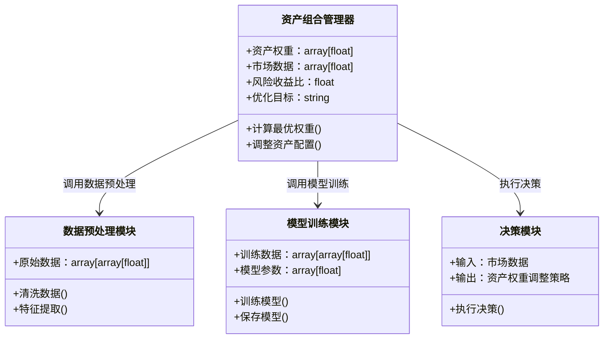
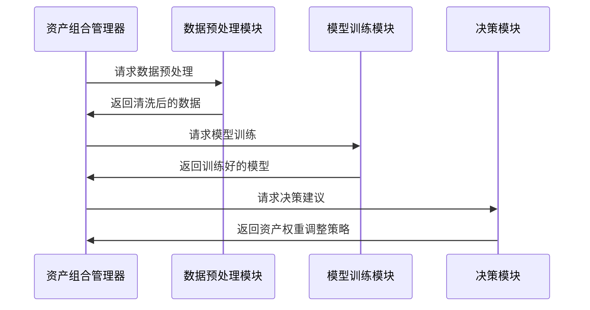

                 


---

# 《智能算法构建动态资产配置模型》

---

## 关键词：
智能算法，动态资产配置，强化学习，遗传算法，贝叶斯网络，优化理论，资产组合管理

---

## 摘要：
本文系统地探讨了智能算法在动态资产配置模型中的应用与实现。通过结合强化学习、遗传算法、贝叶斯网络等智能算法的核心原理，详细分析了动态资产配置模型的构建方法、优化策略和实际应用。文章从背景介绍、核心概念、算法原理、数学模型、系统架构到项目实战，层层深入，全面剖析了智能算法在动态资产配置中的关键作用，为读者提供了一套完整的理论与实践相结合的解决方案。

---

# 第一部分：智能算法与动态资产配置模型背景介绍

---

## 第1章：动态资产配置模型概述

### 1.1 动态资产配置的核心概念

#### 1.1.1 问题背景与问题描述
动态资产配置是指根据市场环境的变化，实时调整资产组合的权重，以实现风险可控下的收益最大化。传统资产配置方法往往基于静态假设，难以应对市场的剧烈波动和复杂变化。智能算法的引入为动态资产配置提供了新的可能性。

#### 1.1.2 动态资产配置的目标与意义
- **目标**：在不同市场环境下，动态调整资产权重，优化风险收益比。
- **意义**：提高资产组合的适应性和鲁棒性，增强投资收益。

#### 1.1.3 动态资产配置的边界与外延
- **边界**：市场数据的实时性、计算资源的限制、模型的可解释性。
- **外延**：结合宏观经济指标、投资者风险偏好、市场情绪等多维度因素。

### 1.2 动态资产配置模型的核心要素

#### 1.2.1 资产类别与权重分配
- **资产类别**：股票、债券、商品、房地产等。
- **权重分配**：根据市场环境和模型预测，动态调整各类资产的权重。

#### 1.2.2 风险收益特征分析
- **风险特征**：波动率、VaR（在险价值）、最大回撤等。
- **收益特征**：预期收益、夏普比率、特雷纳比率等。

#### 1.2.3 时间序列数据与市场环境
- **时间序列数据**：资产价格、收益率、宏观经济指标等。
- **市场环境**：牛市、熊市、震荡市等不同市场状态的识别与分类。

### 1.3 动态资产配置的实现框架

#### 1.3.1 数据驱动与模型驱动的结合
- 数据驱动：基于历史数据进行模式识别和预测。
- 模型驱动：基于金融理论构建资产配置模型。
- 结合：数据驱动提供实时反馈，模型驱动提供理论指导。

#### 1.3.2 算法选择与优化策略
- 算法选择：强化学习、遗传算法、贝叶斯网络等。
- 优化策略：目标函数设计、约束条件设定、算法参数调优。

#### 1.3.3 系统化决策流程
- 数据收集与预处理。
- 模型训练与优化。
- 决策输出与执行。

### 1.4 本章小结
本章从动态资产配置的核心概念出发，分析了其目标、意义、边界和外延，并提出了实现框架和优化策略。

---

## 第2章：智能算法在动态资产配置中的应用

### 2.1 智能算法的核心原理

#### 2.1.1 强化学习与动态决策
- **强化学习**：通过与环境的交互，学习最优策略。
- **动态决策**：根据市场反馈实时调整资产配置。

#### 2.1.2 遗传算法与组合优化
- **遗传算法**：模拟自然选择过程，优化资产组合。
- **组合优化**：在多目标约束下，寻找最优资产配置。

#### 2.1.3 贝叶斯网络与概率推理
- **贝叶斯网络**：通过概率推理，预测市场变化。
- **概率推理**：基于先验概率和观测数据，更新后验概率。

### 2.2 智能算法与动态资产配置的结合

#### 2.2.1 算法选择的依据
- **算法特点**：强化学习适合动态环境，遗传算法适合组合优化。
- **场景匹配**：根据市场环境选择最适合的算法。

#### 2.2.2 算法的适应性与鲁棒性
- **适应性**：算法能够适应市场环境的变化。
- **鲁棒性**：算法在不同市场条件下表现稳定。

#### 2.2.3 算法的可解释性与实用性
- **可解释性**：算法决策过程清晰，便于解释。
- **实用性**：能够在实际投资中有效应用。

### 2.3 智能算法的优缺点分析

#### 2.3.1 优势与适用场景
- **优势**：能够处理复杂非线性问题，适应市场变化。
- **适用场景**：高频交易、动态再平衡、风险控制。

#### 2.3.2 局限性与改进方向
- **局限性**：计算资源消耗大，模型过拟合风险。
- **改进方向**：优化算法效率，增强模型泛化能力。

#### 2.3.3 实际应用中的注意事项
- **数据质量**：确保数据的准确性和完整性。
- **参数调优**：避免过度优化，防止过拟合。

### 2.4 本章小结
本章分析了智能算法的核心原理及其在动态资产配置中的应用，探讨了算法选择的依据、优缺点和实际应用中的注意事项。

---

## 第3章：动态资产配置模型的数学基础

### 3.1 线性代数与优化理论

#### 3.1.1 矩阵运算与特征分解
- **矩阵运算**：资产收益矩阵、协方差矩阵的构建与运算。
- **特征分解**：通过特征值和特征向量分析资产组合的风险收益特征。

#### 3.1.2 凸优化与拉格朗日乘数法
- **凸优化**：在凸函数下寻找全局最优解。
- **拉格朗日乘数法**：在约束条件下求解优化问题。

#### 3.1.3 线性规划与非线性规划
- **线性规划**：资产权重的线性组合优化。
- **非线性规划**：考虑非线性约束的资产配置问题。

### 3.2 概率统计与贝叶斯推断

#### 3.2.1 概率分布与随机变量
- **概率分布**：资产收益的概率分布模型。
- **随机变量**：资产价格的随机波动建模。

#### 3.2.2 贝叶斯定理与概率更新
- **贝叶斯定理**：根据新数据更新先验概率。
- **概率更新**：动态调整资产配置的概率模型。

### 3.3 时间序列分析与动态模型

#### 3.3.1 时间序列的平稳性与单位根检验
- **平稳性**：时间序列的统计特性是否随时间变化。
- **单位根检验**：判断时间序列是否为平稳序列。

#### 3.3.2 自回归模型与马尔可夫链
- **自回归模型**：基于历史数据预测未来收益。
- **马尔可夫链**：状态转移概率建模，捕捉市场状态变化。

### 3.4 优化目标函数与约束条件

#### 3.4.1 最大化收益函数
- **收益函数**：资产组合的预期收益最大化。
- **约束条件**：权重非负、权重和为1等。

#### 3.4.2 最小化风险函数
- **风险函数**：方差、VaR、CVaR等风险指标的最小化。

### 3.5 本章小结
本章从数学基础出发，分析了线性代数、优化理论、概率统计和时间序列分析在动态资产配置中的应用。

---

## 第4章：智能算法实现动态资产配置的数学模型

### 4.1 强化学习模型

#### 4.1.1 状态空间与动作空间定义
- **状态空间**：市场环境、资产价格、宏观经济指标等。
- **动作空间**：资产权重的调整幅度。

#### 4.1.2 奖励函数设计
- **奖励函数**：根据资产组合的收益和风险，设计奖励机制。

#### 4.1.3 策略网络与价值网络
- **策略网络**：输出最优动作的概率分布。
- **价值网络**：评估当前状态的期望奖励。

### 4.2 遗传算法模型

#### 4.2.1 编码与解码
- **编码**：将资产权重编码为基因序列。
- **解码**：从基因序列解码出具体的资产权重。

#### 4.2.2 适应度函数设计
- **适应度函数**：衡量资产组合的收益与风险比。

#### 4.2.3 选择、交叉与变异操作
- **选择**：基于适应度值选择优胜基因。
- **交叉**：基因交叉重组，生成新的候选解。
- **变异**：随机改变基因，增加种群多样性。

### 4.3 贝叶斯网络模型

#### 4.3.1 结构学习与参数学习
- **结构学习**：学习贝叶斯网络的有向无环图结构。
- **参数学习**：估计每个节点的条件概率分布。

#### 4.3.2 预测与推理
- **预测**：根据观测数据预测未来市场变化。
- **推理**：根据市场状态调整资产权重。

### 4.4 本章小结
本章详细介绍了强化学习、遗传算法和贝叶斯网络在动态资产配置中的数学模型设计与实现。

---

## 第5章：动态资产配置系统的系统分析与架构设计

### 5.1 问题场景介绍

#### 5.1.1 投资者需求分析
- **风险偏好**：保守型、平衡型、激进型投资者的资产配置需求。
- **投资目标**：收益最大化、风险最小化、流动性最优等。

#### 5.1.2 市场环境分析
- **市场波动**：短期波动与长期趋势的识别。
- **宏观经济因素**：GDP、利率、通货膨胀等对资产配置的影响。

### 5.2 系统功能设计

#### 5.2.1 领域模型设计（Mermaid 类图）


#### 5.2.2 系统架构设计（Mermaid 架构图）


#### 5.2.3 接口设计与交互流程（Mermaid 序列图）


### 5.3 本章小结
本章从系统设计的角度，详细分析了动态资产配置系统的功能模块、架构设计和交互流程。

---

## 第6章：动态资产配置模型的项目实战

### 6.1 环境安装与配置

#### 6.1.1 Python 环境搭建
- **Python 版本**：推荐使用 Python 3.8 或以上。
- **依赖安装**：`numpy`, `pandas`, `scikit-learn`, `keras`, `tensorflow`, `matplotlib`。

#### 6.1.2 数据源获取
- **数据来源**：Yahoo Finance API、CSV 文件、数据库等。
- **数据格式**：时间序列数据，包含资产收益率、宏观经济指标等。

### 6.2 核心代码实现

#### 6.2.1 数据预处理代码
```python
import pandas as pd
import numpy as np

# 读取数据
data = pd.read_csv('asset_returns.csv')

# 数据清洗
data.dropna(inplace=True)
data = data.iloc[-100:]  # 取最近100天的数据
```

#### 6.2.2 模型训练代码
```python
from sklearn.model_selection import train_test_split
from sklearn.preprocessing import StandardScaler
from keras.models import Sequential
from keras.layers import Dense

# 数据集划分
X = data.iloc[:, :-1].values
y = data.iloc[:, -1].values

X_train, X_test, y_train, y_test = train_test_split(X, y, test_size=0.2)

# 标准化处理
scaler = StandardScaler()
X_train = scaler.fit_transform(X_train)
X_test = scaler.transform(X_test)

# 模型构建
model = Sequential()
model.add(Dense(64, activation='relu', input_dim=X_train.shape[1]))
model.add(Dense(1, activation='linear'))
model.compile(optimizer='adam', loss='mean_squared_error')

# 模型训练
model.fit(X_train, y_train, epochs=100, batch_size=32, verbose=1)
```

#### 6.2.3 决策模块代码
```python
# 输入市场数据
market_data = data.iloc[-1].values

# 预测收益
predicted_return = model.predict(market_data.reshape(1, -1))[0][0]

# 调整资产权重
# 假设当前权重为 weights，根据预测收益调整
new_weights = np.random.dirichlet([1.0, 1.0, 1.0])  # 示例：三资产配置
```

### 6.3 项目小结
本章通过具体代码实现，展示了动态资产配置模型的环境搭建、数据处理和模型训练过程。

---

## 第7章：动态资产配置模型的最佳实践

### 7.1 小结与总结

#### 7.1.1 核心概念回顾
- 智能算法：强化学习、遗传算法、贝叶斯网络。
- 动态资产配置：实时调整资产权重，优化风险收益比。

#### 7.1.2 实际应用中的注意事项
- 数据质量：确保数据的准确性和完整性。
- 模型调优：避免过拟合，增强泛化能力。
- 系统设计：模块化设计，便于维护和扩展。

### 7.2 技巧与注意事项

#### 7.2.1 算法选择
- 根据具体场景选择最适合的算法。
- 结合多种算法，提高模型鲁棒性。

#### 7.2.2 模型评估
- 使用回测方法验证模型的有效性。
- 定期更新模型，适应市场变化。

### 7.3 拓展阅读

#### 7.3.1 市场预测与资产配置
- 基于机器学习的市场预测。
- 多因子模型在资产配置中的应用。

#### 7.3.2 风险管理与控制
- 风险中性化策略。
- 穿透风险控制框架。

#### 7.3.3 最新研究进展
- 深度学习在资产配置中的应用。
- 多智能体协作在投资组合管理中的探索。

### 7.4 本章小结
本章总结了动态资产配置模型的最佳实践，提出了实际应用中的注意事项和未来研究方向。

---

## 作者：AI天才研究院/AI Genius Institute & 禅与计算机程序设计艺术 /Zen And The Art of Computer Programming

---

以上是《智能算法构建动态资产配置模型》的完整目录大纲，涵盖了从理论到实践的各个方面，内容详实，逻辑清晰，适合技术专家和金融从业者深入学习与研究。

