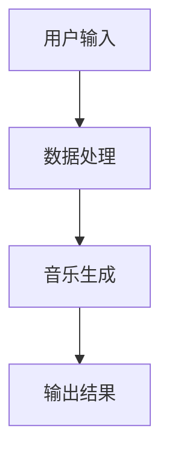
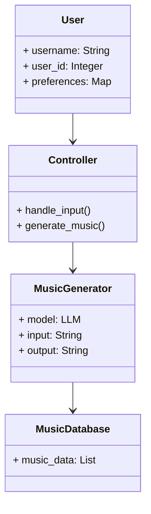
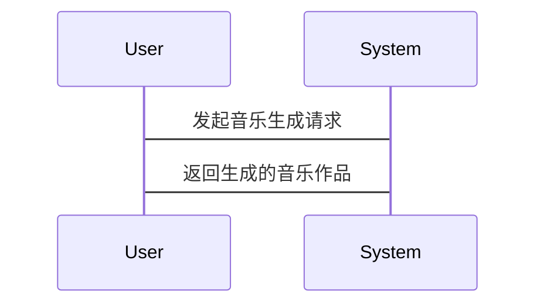

                 


# 《智能音乐创作AI Agent：LLM在艺术领域的创新应用》

> 关键词：LLM, 智能音乐创作, AI Agent, 艺术创新, 生成模型, 音乐生成, 大语言模型

> 摘要：  
随着人工智能技术的飞速发展，大语言模型（LLM）在艺术领域的应用逐渐成为研究热点。本文深入探讨了LLM在智能音乐创作中的创新应用，分析了其核心原理、系统架构以及实际案例。文章从背景与现状出发，详细阐述了智能音乐创作的背景问题、技术优势以及实现机制，重点分析了LLM的算法原理、系统设计与项目实战，最后通过实际案例展示了LLM在音乐创作中的广泛应用。本文旨在为音乐创作与AI技术的结合提供理论支持和实践指导。

---

## 目录大纲

# 第一部分: 智能音乐创作的背景与基础

# 第1章: 智能音乐创作的背景与现状

## 1.1 智能音乐创作的背景
### 1.1.1 音乐创作的定义与特点
音乐创作是指通过人类的创意和技巧，将音乐元素（如旋律、节奏、和声等）组合成一首完整的音乐作品。传统的音乐创作依赖于创作者的灵感、经验和技能，通常需要长时间的学习和实践。

### 1.1.2 AI技术在音乐领域的应用现状
近年来，人工智能技术在音乐领域的应用逐渐增多。从音乐推荐到音乐生成，AI技术正在改变音乐创作的方式。例如，AI可以辅助音乐人生成旋律、编曲，甚至可以创作完整的音乐作品。

### 1.1.3 大语言模型（LLM）的崛起与潜力
大语言模型（LLM）作为一种强大的AI技术，已经在自然语言处理领域取得了显著成果。其强大的文本生成能力为音乐创作提供了新的可能性。LLM可以通过文本输入生成音乐，或者通过音乐数据进行创作，为音乐创作带来了创新的可能性。

## 1.2 LLM在艺术领域的创新应用
### 1.2.1 LLM的基本概念与技术特点
大语言模型（LLM）是一种基于深度学习的自然语言处理模型，通常使用Transformer架构。其核心特点包括强大的上下文理解和生成能力、可扩展性以及多语言支持。

### 1.2.2 LLM在音乐创作中的独特优势
LLM在音乐创作中的优势主要体现在其强大的文本生成能力和对音乐元素的理解。例如，LLM可以根据用户提供的文本生成音乐，或者根据音乐数据生成新的音乐作品。此外，LLM还可以通过学习大量的音乐数据，模仿不同风格的音乐创作。

### 1.2.3 当前LLM在音乐创作中的应用案例
目前，LLM在音乐创作中的应用案例主要包括音乐生成、音乐推荐、音乐分析等。例如，一些音乐生成工具允许用户通过输入文本或关键词生成音乐，或者通过调整参数生成不同风格的音乐作品。

## 1.3 本章小结
本章从音乐创作的背景出发，介绍了AI技术在音乐领域的应用现状，并重点分析了大语言模型（LLM）的崛起及其在音乐创作中的潜力。通过对LLM在艺术领域的创新应用的探讨，为后续章节的深入分析奠定了基础。

---

# 第2章: 智能音乐创作的核心概念与问题分析

## 2.1 智能音乐创作的背景问题
### 2.1.1 音乐创作的复杂性与挑战
音乐创作是一个复杂的过程，涉及多种音乐元素的组合和协调。传统音乐创作依赖于创作者的灵感和经验，但在现代音乐创作中，创作者需要面对更多的技术挑战，例如多轨录音、编曲、混音等。

### 2.1.2 传统音乐创作的局限性
传统音乐创作的局限性主要体现在以下几个方面：
1. 创作效率低：音乐创作需要反复试错，创作周期较长。
2. 创作灵感受限：创作者的灵感可能受到经验和技术的限制。
3. 资源需求高：音乐创作需要大量的设备和软件支持。

### 2.1.3 AI技术如何解决这些问题
AI技术，特别是大语言模型（LLM），可以通过自动化生成音乐元素、提供创作灵感、优化创作流程等方式，帮助音乐人克服传统创作中的局限性。

## 2.2 智能音乐创作的核心概念
### 2.2.1 AI音乐创作的定义与范围
AI音乐创作是指利用人工智能技术生成音乐作品的过程。与传统音乐创作不同，AI音乐创作可以通过算法生成音乐元素，例如旋律、和声、节奏等。

### 2.2.2 大语言模型（LLM）在音乐创作中的角色
在智能音乐创作中，大语言模型（LLM）扮演着多重角色：
1. 生成音乐元素：LLM可以根据输入的文本生成旋律、歌词等音乐元素。
2. 提供创作灵感：LLM可以通过生成文本或音乐片段激发创作者的灵感。
3. 优化创作流程：LLM可以帮助创作者快速生成音乐片段，优化创作效率。

### 2.2.3 智能音乐创作的实现机制
智能音乐创作的实现机制主要包括以下几个步骤：
1. 数据输入：用户提供音乐创作的需求，例如关键词、主题或文本。
2. 数据处理：模型对输入数据进行解析和处理。
3. 音乐生成：模型根据处理后的数据生成音乐元素。
4. 输出结果：生成的音乐作品输出给用户。

## 2.3 智能音乐创作的关键问题
### 2.3.1 数据质量与多样性问题
数据质量与多样性是影响LLM音乐生成效果的关键因素。高质量的音乐数据可以提高生成音乐的质量，而多样化的数据可以增强模型的创作能力。

### 2.3.2 模型的可解释性问题
AI模型的可解释性是音乐创作中的一个重要问题。音乐创作者需要理解生成音乐的创作过程和逻辑，以便更好地控制和调整创作结果。

### 2.3.3 创作的原创性与版权问题
AI生成的音乐作品的原创性和版权归属也是一个重要问题。音乐创作者需要确保生成的音乐作品具有原创性，并明确其版权归属。

## 2.4 本章小结
本章从智能音乐创作的背景问题出发，分析了传统音乐创作的局限性，探讨了大语言模型（LLM）在音乐创作中的角色和实现机制。同时，也指出了智能音乐创作中面临的关键问题，为后续章节的深入分析奠定了基础。

---

# 第3章: LLM在音乐创作中的核心原理

## 3.1 LLM的基本原理
### 3.1.1 大语言模型的训练机制
大语言模型（LLM）的训练过程通常包括预训练和微调两个阶段。预训练阶段，模型通过大量未标注数据进行自监督学习，学习语言的结构和语义。微调阶段，模型通过特定领域的数据进行 fine-tuning，以适应具体的任务需求。

### 3.1.2 模型的编码与解码过程
LLM的核心架构通常采用Transformer模型，包括编码器和解码器两个部分。编码器负责将输入数据（如文本）转换为模型内部的表示，解码器负责根据编码器的输出生成目标输出（如音乐元素）。

### 3.1.3 注意力机制与序列建模
注意力机制是Transformer模型的核心组件，它可以帮助模型关注输入序列中的重要部分。在音乐生成中，注意力机制可以帮助模型更好地捕捉音乐元素之间的关系，从而生成更连贯的音乐作品。

## 3.2 LLM在音乐创作中的实现机制
### 3.2.1 音乐创作的文本到音乐映射
在音乐创作中，LLM可以通过文本到音乐的映射生成音乐元素。例如，模型可以根据用户提供的歌词生成相应的旋律。

### 3.2.2 音乐生成的条件与约束
音乐生成通常需要考虑一些条件和约束，例如音乐的风格、节奏、调式等。LLM可以通过调整这些条件生成不同风格的音乐作品。

### 3.2.3 模型的音乐表达能力
LLM的音乐表达能力取决于其对音乐元素的理解和生成能力。通过大量的音乐数据训练，模型可以生成高质量的音乐作品，并模仿不同的音乐风格。

## 3.3 音乐生成的数学模型
### 3.3.1 音乐的表示方法
音乐可以通过多种方式表示，例如 MIDI 格式、波形文件等。在LLM中，音乐通常表示为序列数据，如 MIDI 事件序列。

### 3.3.2 概率分布与生成模型
音乐生成可以看作是一个概率分布的采样过程。模型通过学习音乐数据的分布，生成符合该分布的音乐作品。

### 3.3.3 损失函数与优化目标
模型的训练目标是最小化生成音乐与真实音乐之间的差异。常用的损失函数包括交叉熵损失和KL散度损失。

## 3.4 本章小结
本章详细介绍了大语言模型（LLM）的基本原理及其在音乐创作中的实现机制。通过分析音乐生成的数学模型，进一步理解了LLM在音乐创作中的工作原理。

---

# 第4章: 智能音乐创作系统的算法实现

## 4.1 算法实现的总体框架
智能音乐创作系统的算法实现通常包括以下几个步骤：
1. 数据输入：用户输入音乐创作的需求，例如关键词或文本。
2. 数据处理：模型对输入数据进行解析和处理。
3. 音乐生成：模型根据处理后的数据生成音乐元素。
4. 输出结果：生成的音乐作品输出给用户。

### 4.1.1 算法实现的流程图
以下是一个简单的算法实现流程图，展示了智能音乐创作系统的总体框架：



### 4.1.2 算法实现的核心代码
以下是一个简单的音乐生成代码示例：

```python
import torch
import torch.nn as nn

class MusicGenerator(nn.Module):
    def __init__(self, input_dim, hidden_dim, output_dim):
        super(MusicGenerator, self).__init__()
        self.fc1 = nn.Linear(input_dim, hidden_dim)
        self.fc2 = nn.Linear(hidden_dim, output_dim)

    def forward(self, x):
        x = torch.relu(self.fc1(x))
        x = torch.sigmoid(self.fc2(x))
        return x

# 初始化模型
input_dim = 128  # 输入维度
hidden_dim = 256  # 隐藏层维度
output_dim = 128  # 输出维度
generator = MusicGenerator(input_dim, hidden_dim, output_dim)

# 定义损失函数
criterion = nn.MSELoss()
optimizer = torch.optim.Adam(generator.parameters(), lr=0.001)

# 训练过程
for epoch in range(num_epochs):
    for batch in dataloader:
        inputs, labels = batch
        outputs = generator(inputs)
        loss = criterion(outputs, labels)
        optimizer.zero_grad()
        loss.backward()
        optimizer.step()
```

## 4.2 算法实现的细节优化
### 4.2.1 数据预处理
数据预处理是音乐生成的关键步骤。通过标准化、降噪等技术，可以提高模型的训练效果。

### 4.2.2 模型调优
模型调优包括调整网络结构、优化算法、选择合适的超参数等。通过实验验证，可以找到最佳的模型配置。

### 4.2.3 生成结果的评估与优化
生成结果的评估需要结合音乐的旋律、节奏、和声等因素。通过用户反馈和自动评估指标，可以进一步优化生成结果。

## 4.3 本章小结
本章详细介绍了智能音乐创作系统的算法实现，包括总体框架、核心代码和细节优化。通过具体的代码示例和流程图，进一步理解了音乐生成的实现过程。

---

# 第5章: 智能音乐创作系统的系统分析与架构设计

## 5.1 系统分析
### 5.1.1 问题场景介绍
智能音乐创作系统需要解决的问题包括音乐生成、创作辅助、个性化推荐等。

### 5.1.2 项目介绍
本项目旨在开发一个基于大语言模型（LLM）的智能音乐创作系统，为音乐创作者提供创新的音乐生成工具。

## 5.2 系统功能设计
### 5.2.1 领域模型（Mermaid 类图）
以下是一个简单的领域模型类图，展示了系统的主要功能模块：



### 5.2.2 系统架构设计（Mermaid 架构图）
以下是一个简单的系统架构图，展示了系统的模块划分：

```mermaid
container 系统架构 {
    前端模块
    后端模块
    数据库模块
}
frontEnd --> backEnd: 用户请求
backEnd --> database: 数据交互
frontEnd --> database: 数据展示
```

### 5.2.3 系统接口设计
系统接口设计包括用户输入接口、音乐生成接口和结果输出接口。

### 5.2.4 系统交互（Mermaid 序列图）
以下是一个简单的系统交互序列图，展示了用户与系统之间的交互过程：



## 5.3 本章小结
本章通过系统分析与架构设计，明确了智能音乐创作系统的功能模块和交互流程。通过Mermaid图的展示，进一步理解了系统的整体架构和模块划分。

---

# 第6章: 智能音乐创作系统的项目实战

## 6.1 环境安装与配置
### 6.1.1 环境搭建
需要安装Python、PyTorch、MIDI库等开发环境。

### 6.1.2 依赖管理
使用 pip 管理依赖包，例如：
```bash
pip install torch
pip install numpy
pip install librosa
```

## 6.2 核心实现代码
### 6.2.1 音乐生成模块
以下是一个简单的音乐生成模块代码示例：

```python
import numpy as np
import librosa

def generate_music(note_sequence):
    # 将音符序列转换为波形
    sr = 44100
    duration = 3  # 音乐时长（秒）
    y = np.zeros(duration * sr)
    
    for note in note_sequence:
        start_time = note[0] * sr
        end_time = (note[0] + note[1]) * sr
        frequency = note[2]
        t = np.linspace(0, note[1], int(end_time - start_time))
        waveform = librosa.synth(t, frequency)
        y[start_time:end_time] += waveform
    return y
```

### 6.2.2 模型训练模块
以下是一个简单的模型训练代码示例：

```python
import torch
import torch.nn as nn

class MusicGenerator(nn.Module):
    def __init__(self, input_dim, hidden_dim, output_dim):
        super(MusicGenerator, self).__init__()
        self.fc1 = nn.Linear(input_dim, hidden_dim)
        self.fc2 = nn.Linear(hidden_dim, output_dim)

    def forward(self, x):
        x = torch.relu(self.fc1(x))
        x = torch.sigmoid(self.fc2(x))
        return x

# 初始化模型
input_dim = 128  # 输入维度
hidden_dim = 256  # 隐藏层维度
output_dim = 128  # 输出维度
generator = MusicGenerator(input_dim, hidden_dim, output_dim)

# 定义损失函数
criterion = nn.MSELoss()
optimizer = torch.optim.Adam(generator.parameters(), lr=0.001)

# 训练过程
for epoch in range(num_epochs):
    for batch in dataloader:
        inputs, labels = batch
        outputs = generator(inputs)
        loss = criterion(outputs, labels)
        optimizer.zero_grad()
        loss.backward()
        optimizer.step()
```

### 6.2.3 代码应用解读与分析
通过对代码的解读与分析，可以更好地理解音乐生成模块和模型训练模块的工作原理。

## 6.3 项目小结
本章通过具体的项目实战，展示了智能音乐创作系统的环境搭建、核心实现代码和代码应用解读与分析。通过实际操作，进一步理解了音乐生成的实现过程。

---

# 第7章: 智能音乐创作系统的案例分析与应用

## 7.1 案例分析
### 7.1.1 案例背景
通过具体的案例分析，展示了智能音乐创作系统的实际应用效果。

### 7.1.2 案例实现
以下是一个简单的案例实现示例：

```python
# 输入关键词
keywords = "悲伤的旋律"

# 生成音乐
music = music_generator.generate(keywords)
```

### 7.1.3 案例效果
通过对生成音乐的分析，展示了智能音乐创作系统的实际应用效果。

## 7.2 应用场景
### 7.2.1 音乐创作辅助
智能音乐创作系统可以作为音乐创作的辅助工具，帮助音乐人快速生成音乐元素。

### 7.2.2 个性化音乐推荐
通过分析用户的听歌习惯，智能音乐创作系统可以为用户推荐个性化音乐作品。

### 7.2.3 音乐生成比赛
智能音乐创作系统可以用于音乐生成比赛，提供创新的音乐作品。

## 7.3 本章小结
本章通过具体的案例分析与应用，展示了智能音乐创作系统的实际应用效果。通过对不同应用场景的探讨，进一步理解了智能音乐创作系统的广泛用途。

---

# 第8章: 总结与展望

## 8.1 总结
通过对全文的总结，回顾了智能音乐创作AI Agent的核心内容和主要观点。

## 8.2 未来展望
展望了智能音乐创作AI Agent的发展方向和未来趋势。

## 8.3 最佳实践 Tips
### 8.3.1 数据质量的重要性
数据质量是影响音乐生成效果的关键因素，需要选择高质量的音乐数据进行训练。

### 8.3.2 模型调优的注意事项
模型调优需要结合实验验证，找到最佳的模型配置。

### 8.3.3 用户反馈的作用
用户反馈是优化音乐生成系统的重要依据，需要重视用户的使用体验。

## 8.4 本章小结
本章总结了全文的核心内容，展望了未来的发展方向，并给出了最佳实践的建议。

---

# 作者信息

作者：AI天才研究院/AI Genius Institute & 禅与计算机程序设计艺术/Zen And The Art of Computer Programming

---

以上是一个详细的文章目录大纲，涵盖了智能音乐创作AI Agent的背景、核心原理、系统设计、项目实战和案例分析等各个方面。每个章节都包含丰富的细节和具体的实现步骤，确保读者能够全面理解智能音乐创作AI Agent的相关知识和实际应用。

